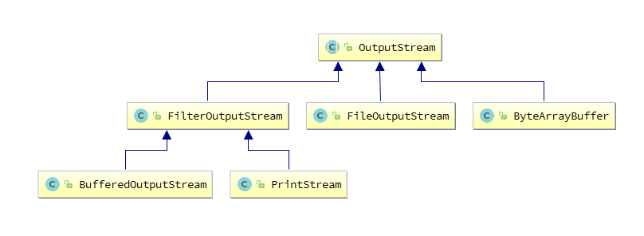

[TOC]


#单例Singleton


#装饰Decorator

## 基础概念

装饰模式（Decorator），也叫包装模式（Wrapper）。装饰类是增强已有对象，具备的功能和已有对象相同，只不过提供了更强功能。所以装饰类和被装饰类通常都属于`同一个体系`中。

在复杂的类体系中，同一级下的兄弟类通常有很多。当想要为每个兄弟类都加上相同功能时，就要为每个兄弟类添加新的子类了，毫无疑问这是不合理的。装饰器模式是在不影响各个兄弟类核心价值的同时，添加了特有的装饰效果，具备非常好的通用性，这也是他存在的最大价值。

> 优缺点

优点：(1). 是一种用于代替继承的技术，勿需继承就能`扩展子类的功能`。

​            (2). 使用对象的关联关系代替继承关系，更加灵活。`有效避免类型体系的快速膨胀`。

缺点：(1). 产生很多小对象，大量小对象占据内存，一定程度上影响性能。

​            (2). 装饰模式易于出错，对于多次装饰的对象，调试时寻找错误可能需要逐级排查，较为繁琐。

> 装饰 & 继承


> 装饰 & 桥接


> 适用场景

在不影响其他对象的情况下，以动态、透明的方式给单个对象添加职责。

当不能采用继承的方式对系统进行扩展，或者采用继承不利于系统扩展和维护时可以使用装饰模式。不能采用继承的情况主要有两类：

- 第一类是系统中存在大量独立的扩展，为支持每一种扩展或者扩展之间的组合将产生大量的子类，使得子类数目呈爆炸性增长。


- 第二类是因为类已定义为不能被继承（如Java语言中的final类）。


> 装饰 VS 继承

```java
|--Writer
    |--TextWriter
        |--BufferedTextWriter  //每一种 Writer 的子类都需要单独生成一个缓冲子类
    |--MediaWriter
        |--BufferedMediaWriter //同上
```

```java
|--Writer
    |--TextWriter
    |--MediaWriter    
    |--BufferedWriter //装饰类
    
public class BufferedWriter extend Writer{ //装饰类自身还是 Writer 的子类
    Writer writer;
    
    BufferedWriter(Writer writer){
        this.writer = writer; //持有父类 Writer 的引用，则可对任意子类进行功能增强
    }
}
```

## 常见场景

1. Servlet API 中的 `ServletRequestWrapper` 增强了 ServletRequest 对象的功能。
2. IO流的实现细节，举例：`BufferedOutputStream`



> 1.抽象组件（Component）：需要装饰的抽象对象（接口或抽象父类）。`OutputStream`

```java
public abstract class OutputStream implements Closeable, Flushable {
    public abstract void write(int b) throws IOException;
}
```

> 2.具体组件（ConcreteComponent）：需要装饰的对象。 `FileOutputStream`

```java
public class FileOutputStream extends OutputStream {
    public void write(int b) throws IOException {
        write(b, append); //普通 write() 方法
    }
}
```

> 3.抽象装饰类（Decorator）：包含了对抽象组件的引用以及装饰着共有的方法。 `FilterOutputStream`

```java
public class FilterOutputStream extends OutputStream {
    protected OutputStream out; //持有一个 OutputStream 类型的引用
    
    public FilterOutputStream(OutputStream out) {
        this.out = out;
    }
    
    public void write(int b) throws IOException {
        out.write(b);
    }
}
```

> 4.具体装饰类（ConcreteDecorator）：被装饰的对象。 `BufferedOutputStream`

```java
public class BufferedOutputStream extends FilterOutputStream {
    public synchronized void write(int b) throws IOException { //增强 write() 方法
        if (count >= buf.length) {
            flushBuffer();
        }
        buf[count++] = (byte)b; //先存入缓存
    }
}
```


#代理模式

##  静态代理

【需求变化】要求项目中所有类在执行方法时，日志记录方法的参数值 和 方法的耗时。

> 传统方式（修改源码）的缺点

1、工作量特别大，如果项目中有多个类，多个方法，则要修改多处。

2、违背了设计原则：开闭原则，对扩展开放，对修改关闭。并且为增加功能把每个方法都修改，也不便于维护。

3、违背了设计原则：单一职责，每个方法除了要完成自身的功能，还要计算耗时等；每一个方法引起它变化的原因就有多种。

4、违背了设计原则：依赖倒转，抽象不应该依赖细节，两者都该依赖抽象。在Test类中，Test与Math都是细节。

```java
class MyMath {
    public int add(int num1, int num2) {
        return num1 + num2;
    }
}
```

```java
//传统做法，修改源码
class MyMath {
    public int add(int num1, int num2) {
        System.out.println("add() 参数: " + num1 + " - " + num2);
        
        long l = System.currentTimeMillis();
        int res = num1 + num2;
        System.out.println("add() 耗时: " + (System.currentTimeMillis() - l));
        return res;
    }
}
```

> 静态代理的优点（还有1点未解决）

1、解决了 开闭原则 的问题，因为并没有修改 MyMath类，而扩展出了 MyMathProxy类。

2、解决了 依赖倒转 的问题，通过引入接口。

3、解决了 单一职责 的问题，MyMath类不再需要去计算耗时与延时操作。

4、`未解决`如果项目中有多个类，则需要编写多个代理类，工作量大，不好维护。应使用`动态代理`。

> 代理模式的核心角色

抽象角色：定义代理角色和真实角色的公共对外方法。

真实角色：实现抽象角色，定义真实角色所要实现的业务逻辑，供代理角色调用（关注真正的业务逻辑！）。

代理角色：实现抽象角色，是真实角色的代理，通过真实角色的业务逻辑方法来实现抽象方法，并可以附加自己的操作（将统一的流程控制放到代理角色中处理！）。


```java
interface IMyMath { //抽象角色
    int add(int num1, int num2);
}
```

```java
class MyMath implements IMyMath { //真实角色

    @Override
    public int add(int num1, int num2) {
        return num1 + num2;
    }
}
```

```java
class MyMathProxy implements IMyMath { //代理角色
    MyMath myMath;
    
    public MyMathProxy(MyMath myMath) {
        this.myMath = myMath;
    }

    @Override
    public int add(int num1, int num2) {
        System.out.println("add() 参数: " + num1 + " - " + num2);

        long l = System.currentTimeMillis();
        int res = myMath.add(num1, num2);
        System.out.println("add() 耗时: " + (System.currentTimeMillis() - l));
        return res;
    }
}
```

## 动态代理

<https://www.cnblogs.com/best/p/5679656.html>


