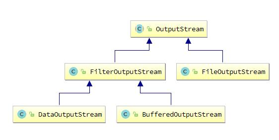

[TOC]


#单例Singleton


#装饰Decorator

## 基础概念

装饰模式（Decorator），也叫包装模式（Wrapper）。装饰类是增强已有对象，具备的功能和已有对象相同，只不过提供了更强功能。`所以装饰类和被装饰类通常都属于同一个体系中`。

优点：（1）是一种用于代替继承的技术，勿需继承就能`扩展子类的功能`。

​            （2）使用对象的关联关系代替继承关系，更加灵活。`有效避免类型体系的快速膨胀`。

缺点：（1）产生很多小对象，大量小对象占据内存，一定程度上影响性能。

​            （2）装饰模式易于出错，调试排查比较麻烦。

> 装饰 VS 继承

```java
|--Writer
    |--TextWriter
        |--BufferedTextWriter  //每一种 Writer 的子类都需要单独生成一个缓冲子类
    |--MediaWriter
        |--BufferedMediaWriter //同上
```

```java
|--Writer
    |--TextWriter
    |--MediaWriter    
    |--BufferedWriter //装饰类
    
public class BufferedWriter extend Writer{ //装饰类自身还是 Writer 的子类
    Writer writer;
    
    BufferedWriter(Writer writer){
        this.writer = writer; //持有父类 Writer 的引用，则可对任意子类进行功能增强
    }
}
```


## 常见场景

1. Servlet API 中的 HttpServletRequestWrapper 增强了 request 对象的功能。
2. IO流的实现细节，举例：`BufferedOutputStream`



## DEMO

JDK中的IO流就是用到了装饰模式。其中 InputStream，OutputStream，Reader，Writer就已经使用了装饰模式。

- OutputStream 是一个抽象类。
- FileOutputStream 继承了OutputStream 类。
- FilterOutputStream 也继承了OutputStream 类，并且持有一个 OutputStream 类型的引用。
- BufferedOutputStream 等类继承了 FilterInputStream 类。

> 1.抽象构件角色 Component `OutputStream`

```java
public abstract class OutputStream implements Closeable, Flushable {
    public abstract void write(int b) throws IOException;
}
```

> 2.具体构件角色 ConcreteComponent（真实对象） `FileOutputStream`

```java
public class FileOutputStream extends OutputStream {
    public void write(int b) throws IOException {
        write(b, append); //普通 write() 方法
    }
}
```

> 3.装饰角色 Decorator `FilterOutputStream`

```java
public class FilterOutputStream extends OutputStream {
    protected OutputStream out; //持有一个 OutputStream 类型的引用
    
    public FilterOutputStream(OutputStream out) {
        this.out = out;
    }
    
    public void write(int b) throws IOException {
        out.write(b);
    }
}
```

> 4.具体装饰角色 ConcreteDecorator `BufferedOutputStream`

```java
public class BufferedOutputStream extends FilterOutputStream {
    public synchronized void write(int b) throws IOException { //增强 write() 方法1
        if (count >= buf.length) {
            flushBuffer();
        }
        buf[count++] = (byte)b; //先存入缓存
    }
}
```

> 5.另一个具体装饰角色 ConcreteDecorator `DataOutputStream`

```java
public class DataOutputStream extends FilterOutputStream implements DataOutput {
    public synchronized void write(int b) throws IOException { //增强 write() 方法2
        out.write(b);
        incCount(1);
    } 
}
```

