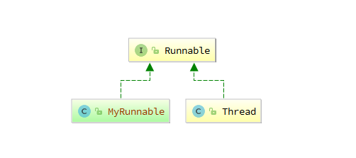

[TOC]


# 单例Singleton

GoF23：Group of Four，四个人提出的23中设计模式。

## 基础概念

解决一个类在内存中只存在一个对象的问题（适用于实例化需要较多资源的对象）。

> 常见场景

```java
在Spring中，每个Bean默认就是单例的，这样做的优点是Spring容器可以管理
在Spring MVC框架/struts1框架中，控制器对象也是单例
```

```java
Windows的Task-Manager（任务管理器）和Recycle-Bin（回收站）。在整个系统运行过程中，仅维护一个实例
操作系统的文件系统,也是大的单例模式实现的具体例子,一个操作系统只能有一个文件系统

项目中读取配置文件的类。没必要每次使用配置文件数据，每次 new 一个对象去读取。

网站的计数器，一般也是采用单例模式实现，否则难以同步

应用程序的日志应用，一般都何用单例模式实现，这一般是由于共享的日志文件一直处于打开状态，因为只能有一个实例去操作，否则内容不好追加。

数据库连接池的设计一般也是采用单例模式，因为数据库连接是一种数据库资源

Application 也是单例的典型应用（Servlet编程中会涉及到）
在servlet编程中,每个Servlet也是单例

```
> 各种方式对比

    饿汉式  --->  线程安全，调用效率高。不能'延时加载'
    懒汉式  --->  线程安全，但效率不高。可以'延时加载'
    
    双重检测锁 -> 饿汉式是方法锁，此方法是局部锁。
    静态内部类 -> 线程安全，调用效率高，可以'延时加载'!
    
    枚举实现  -> 线程安全，调用效率高，不能'延时加载'
             -> 枚举本身就是单例模式，由 JVM 从根本上提供保障！避免通过反射和反序列化的漏洞！
> 场景选择

```java
占用资源少，不要 延时加载: //枚举式    > 饿汉式
占用资源大，需要 延时加载: //静态内部类 > 懒汉式
```
## 五种方式

> 通用套路

```java
(1).私有构造函数：避免其他类实例化该类对象
(2).提供私有的静态属性：存储对象的地址
(3).提供公共的静态方法：获取静态属性②
```
> 饿汉式

```java
public class Singleton {
    private Singleton() {}

    private static Singleton instance = new Singleton();

    //(a).static 变量会在类装载时初始化，此时也不会涉及多个线程访问该对象的问题。
    //(b).虚拟机保证只会装载一次该类，肯定也不会发生并发访问的问题。
    //综上两点：可以省略关键字 synchronized
    public static /*synchronized*/ Singleton newInstance() {
        return instance;
    }
}
```
> 懒汉式

```java
public class Singleton {
    private Singleton() {}

    //延迟加载 --> 假如 newInstance() 从不调用，则也不会实例化对象，有效避免了资源的浪费
    private static Singleton instance;

    //懒汉式 ---> 对于多线程访问容易出问题，加上同步锁
    public static synchronized Singleton newInstance() {
        if (null == instance) {
            instance = new Singleton();
        }
        return instance;
    }
}
```
> 双重检测锁

```java
public class Singleton {
    private Singleton() {}

    private static volatile Singleton instance; //必须有关键字: volatile

    public static Singleton newInstance() {
        if (null == instance) { //避免不必要的同步，已经存在对象
            synchronized (Singleton.class) { //静态方法的同步锁一般选为当前类的 class
                if (null == instance) {
                    instance = new Singleton();
                }
            }
        }
        return instance;
    }
}
```
```java
//volatile：没有此关键字，将导致其他线程可能访问到一个没有初始化的对象
创建对象 new 过程可以拆分为3步：1.开辟空间；2.初始化对象信息；3.返回对象的地址给引用
假如 new 过程是耗时操作，可能发生 <指令重排>，即先执行 1，3，在执行 2
这将造成，线程-A 还在执行 new 的第 2 步，而线程-B已经拿到对象的引用，此时线程-B拿到的就是一个空的对象
```

> 静态内部类

```java
public class Singleton {
    private Singleton() {}

    //外部类没有 static 属性，则不会像饿汉式那样立即加载对象
    //只有真正调用 newInstance()，才会加载静态内部类，加载类时是线程安全的
    //static final instance，保证了内存中只有这样一个实例存在，而且只能被赋值一次，从而保证了线程安全性
    //兼备了并发高效调用和延迟加载的优势！
    private static class SingletonInner {
        private static final Singleton instance = new Singleton();
    }

    public static Singleton newInstance() {
        return SingletonInner.instance;
    }
}
```
> 枚举实现

```java
public enum Singleton {
    INSTANCE;

    public void doSth() { }
}
```
## 方式比对

> 反射破解

```java
@Test
public void test() throws Exception {
    Singleton instance0 = Singleton.newInstance();
    Singleton instance1 = Singleton.newInstance();
    System.out.println(instance0 == instance1); //true

    Class<?> clazz = Class.forName("com.example.spring.test.Singleton");
    Constructor<?> constructor = clazz.getDeclaredConstructor(); //无参构造
    constructor.setAccessible(true); //必要
    Object instance2 = constructor.newInstance();
    System.out.println(instance2 == instance0); //false -> 通过反射破解（不包括枚举）
}
```
> 效率测试

```java
long start = System.currentTimeMillis();
int nThread = 10;

//同步辅助类，它允许一个或多个线程一直等待，直到其他线程的操作执行完后再执行
CountDownLatch count = new CountDownLatch(nThread);
for (int i = 0; i < nThread; i++) {
    new Thread(() -> {
        for (int j = 0; j < 10000; j++) {
            Singleton instance = Singleton.newInstance();
        }

        count.countDown(); //每当一个线程完成了自己的任务后，计数器的值就会减 1
    }).start();
}

count.await(); // main线程阻塞，直到 count 减到0，才继续向下执行
System.out.println("耗时：" + (System.currentTimeMillis() - start));
```


#装饰Decorator

## 基础概念

装饰模式（Decorator），也叫包装模式（Wrapper）。装饰类是增强已有对象，具备的功能和已有对象相同，只不过提供了更强功能。所以装饰类和被装饰类通常都属于`同一个体系`中。

在复杂的类体系中，同一级下的兄弟类通常有很多。当想要为每个兄弟类都加上相同功能时，就要为每个兄弟类添加新的子类了，毫无疑问这是不合理的。装饰器模式是在不影响各个兄弟类核心价值的同时，添加了特有的装饰效果，具备非常好的通用性，这也是他存在的最大价值。

> 优缺点

优点：(1). 是一种用于代替继承的技术，勿需继承就能`扩展子类的功能`。

​            (2). 使用对象的关联关系代替继承关系，更加灵活。`有效避免类型体系的快速膨胀`。

缺点：(1). 产生很多小对象，大量小对象占据内存，一定程度上影响性能。

​            (2). 装饰模式易于出错，对于多次装饰的对象，调试时寻找错误可能需要逐级排查，较为繁琐。

> 装饰 & 继承


> 装饰 & 桥接


> 适用场景

在不影响其他对象的情况下，以动态、透明的方式给单个对象添加职责。

当不能采用继承的方式对系统进行扩展，或者采用继承不利于系统扩展和维护时可以使用装饰模式。不能采用继承的情况主要有两类：

- 第一类是系统中存在大量独立的扩展，为支持每一种扩展或者扩展之间的组合将产生大量的子类，使得子类数目呈爆炸性增长。


- 第二类是因为类已定义为不能被继承（如Java语言中的final类）。


> 装饰 VS 继承

```java
|--Writer
    |--TextWriter
        |--BufferedTextWriter  //每一种 Writer 的子类都需要单独生成一个缓冲子类
    |--MediaWriter
        |--BufferedMediaWriter //同上
```

```java
|--Writer
    |--TextWriter
    |--MediaWriter    
    |--BufferedWriter //装饰类
    
public class BufferedWriter extend Writer{ //装饰类自身还是 Writer 的子类
    Writer writer;
    
    BufferedWriter(Writer writer){
        this.writer = writer; //持有父类 Writer 的引用，则可对任意子类进行功能增强
    }
}
```

## 常见场景

1. Servlet API 中的 `ServletRequestWrapper` 增强了 ServletRequest 对象的功能。
2. IO流的实现细节，举例：`BufferedOutputStream`


> 1.抽象组件（Component）：需要装饰的抽象对象（接口或抽象父类）。`OutputStream`

```java
public abstract class OutputStream implements Closeable, Flushable {
    public abstract void write(int b) throws IOException;
}
```

> 2.具体组件（ConcreteComponent）：需要装饰的对象。 `FileOutputStream`

```java
public class FileOutputStream extends OutputStream {
    public void write(int b) throws IOException {
        write(b, append); //普通 write() 方法
    }
}
```

> 3.抽象装饰类（Decorator）：包含了对抽象组件的引用以及装饰着共有的方法。 `FilterOutputStream`

```java
public class FilterOutputStream extends OutputStream {
    protected OutputStream out; //持有一个 OutputStream 类型的引用
    
    public FilterOutputStream(OutputStream out) {
        this.out = out;
    }
    
    public void write(int b) throws IOException {
        out.write(b);
    }
}
```

> 4.具体装饰类（ConcreteDecorator）：被装饰的对象。 `BufferedOutputStream`

```java
public class BufferedOutputStream extends FilterOutputStream {
    public synchronized void write(int b) throws IOException { //增强 write() 方法
        if (count >= buf.length) {
            flushBuffer();
        }
        buf[count++] = (byte)b; //先存入缓存
    }
}
```


#代理模式

##  静态代理

【需求变化】要求项目中所有类在执行方法时，日志记录方法的参数值 和 方法的耗时。

> 传统方式（修改源码）的缺点

1、工作量特别大，如果项目中有多个类，多个方法，则要修改多处。

2、违背了设计原则：开闭原则，对扩展开放，对修改关闭。并且为增加功能把每个方法都修改，也不便于维护。

3、违背了设计原则：单一职责，每个方法除了要完成自身的功能，还要计算耗时等。

4、违背了设计原则：依赖倒转，抽象不应该依赖细节，两者都该依赖抽象。在Test类中，Test与Math都是细节。

```java
class MyMath {
    public int add(int num1, int num2) {
        return num1 + num2;
    }
}
```

```java
//传统做法，修改源码
class MyMath {
    public int add(int num1, int num2) {
        System.out.println("add() 参数: " + num1 + " - " + num2);
        
        long l = System.currentTimeMillis();
        int res = num1 + num2;
        System.out.println("add() 耗时: " + (System.currentTimeMillis() - l));
        return res;
    }
}
```

> 静态代理的优点（还有1点未解决）

1、解决了 开闭原则 的问题，因为并没有修改 MyMath类，而扩展出了 MyMathProxy类。

2、解决了 依赖倒转 的问题，通过引入接口。

3、解决了 单一职责 的问题，MyMath类不再需要去计算耗时与延时操作。

4、`未解决`如果项目中有多个类，则需要编写多个代理类，工作量大，不好维护。应使用`动态代理`。

> 代理模式的核心角色




抽象角色：定义代理角色和真实角色的公共对外方法。

真实角色：实现抽象角色，定义真实角色所要实现的业务逻辑，供代理角色调用（关注真正的业务逻辑！）。

代理角色：实现抽象角色，是真实角色的代理，通过真实角色的业务逻辑方法来实现抽象方法，并可以附加自己的操作（将统一的流程控制放到代理角色中处理！）。


```java
interface IProxy { //抽象角色
    int add(int num1, int num2);
}
```

```java
class RealObject implements IProxy { //真实角色

    @Override
    public int add(int num1, int num2) {
        return num1 + num2;
    }
}
```

```java
class ProxyObject implements IProxy { //代理角色
    IProxy proxy;
    
    public ProxyObject(IProxy proxy) {
        this.proxy = proxy;
    }

    @Override
    public int add(int num1, int num2) {
        System.out.println("add() 参数: " + num1 + " - " + num2);

        long l = System.currentTimeMillis();
        int res = proxy.add(num1, num2);
        System.out.println("add() 耗时: " + (System.currentTimeMillis() - l));
        return res;
    }
}
```

## 动态代理

<https://www.cnblogs.com/best/p/5679656.html>


