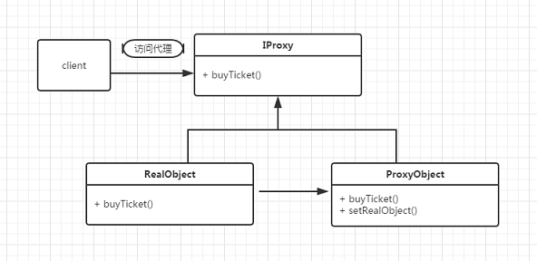

[TOC]


# 代理模式

## 静态代理

> 为目标对象提供一种代理，以控制对目标对象的访问。

```shell
使用一个代理对象将原始对象包装起来，然后用该代理对象取代原始对象。
任何对原始对象的调用都要通过代理对象。代理对象决定是否，以及何时将方法调用转到原始对象上。
```

```shell
抽象角色：可以是抽象类也可以是接口，是一个最普通的业务类型定义，无特殊要求
真实角色：也叫被代理角色，是业务逻辑的具体执行者
代理角色：是真实角色的代理，在真实角色处理业务逻辑的前后做预处理和善后工作，控制流程
```

```shell
#静态代理
自己编写代理类，每个代理的功能都需要单独编写。如果项目中有多个类，则需要编写多个代理类，工作量大，不好维护。

#动态代理
为了解决静态代理需要频繁编写代理功能的缺点。只需要一个代理类，而不是针对每个类编写代理类。
```



> 代码实现

```java
interface IProxy { //抽象角色
    int add(int num1, int num2);
}
```

```java
class RealObject implements IProxy { //真实角色

    @Override
    public int add(int num1, int num2) {
        return num1 + num2;
    }
}
```

```java
class ProxyObject implements IProxy { //代理角色
    IProxy proxy;

    public ProxyObject(IProxy proxy) {
        this.proxy = proxy;
    }

    @Override
    public int add(int num1, int num2) {
        System.out.println("add() 参数: " + num1 + " - " + num2);
        long start = System.currentTimeMillis();
        
        int res = proxy.add(num1, num2);
        
        System.out.println("add() 耗时: " + (System.currentTimeMillis() - start));
        return res;
    }
}
```

## 接口代理

>基于接口实现动态代理：JDK动态代理。`2个重要类`

```shell
#和 cglib 相比
优点：jdk自带，勿需额外jar包。
缺点：真实对象必须实现接口。利用反射机制，效率不高。
```

```java
Proxy：所有动态代理类的父类。专门用于生成代理类，或者代理对象

//方法1：用于生成代理类的 Class 对象
public static Class<?> getProxyClass(ClassLoader loader, Class<?>... interfaces)

//方法2：用于生成代理对象
public static Object newProxyInstance(ClassLoader loader, Class<?>[] interfaces, InvocationHandler h)
```

```java
InvocationHandler：完成动态代理的整个过程

//动态代理整个过程都写在此方法中
public Object invoke(Object obj, Object... args)
```

> 代码实现：`Proxy.newProxyInstance()`

```java
//此类 -> 用于生成动态代理对象
public class ProxyFactory implements InvocationHandler {

    //目标对象
    private Object target;

    public ProxyFactory(Object target) {
        this.target = target;
    }

    /**
     * 代理对象调用代理方法，都会回来调用 invoke() 方法
     *
     * @param proxy  代理对象，一般不会使用
     * @param method 正在被调用的方法对象
     * @param args   正在被调用的方法的参数
     */
    @Override
    public Object invoke(Object proxy, Method method, Object[] args) throws Throwable {
        System.out.println(method.getName() + " 参数：" + Arrays.toString(args));
        long start = System.currentTimeMillis();

        //将方法的调用转回到目标对象上，利用反射
        Object invoke = method.invoke(target, args);

        System.out.println(method.getName() + " 耗时：" + (System.currentTimeMillis() - start));
        return invoke;
    }

    //获取代理对象的方法
    public Object newProxyInstance() {
        ClassLoader loader = target.getClass().getClassLoader();
        Class<?>[] interfaces = target.getClass().getInterfaces();

        /**
         * 获取动态代理对象
         *
         * @param loader      类加载器对象，加载动态生成的代理类
         * @param interfaces  目标对象实现的接口列表，目的是保证代理对象与目标对象都有接口中的相同方法
         * @param h           InvocationHandler 对象，目标对象执行的方法
         */
        return Proxy.newProxyInstance(loader, interfaces, this);
    }
}
```

```java
@Test //测试方法
public void test() {
    ProxyFactory proxyFactory = new ProxyFactory(new RealObject());
    IProxy target = (IProxy) proxyFactory.newProxyInstance();
    int add = target.add(5, 3);
    System.out.println(add);
}
```

> 两个问题

````shell
（1）代理对象能否转换成目标对象的类型？

#动态代理类 和 目标类 是兄弟关系（都实现接口 IProxy），不能相互转化
#RealObject target = (RealObject) proxyFactory.newProxyInstance();

（2）代理对象调用代理方法，为什么会执行 InvocationHandler 中的 invoke() 方法？
````

```java
/**
 * 模拟动态代理的底层原理
 * <p>
 * (1) Proxy 是所有动态代理类的父类，所以必须得继承 Proxy
 * (2) 动态代理类和目标类都实现相同的接口，所以必须实现 IProxy
 */
public class DynamicProxy extends Proxy implements IProxy {

    /**
     * 继承 Proxy 必须添加一个有参构造方法。此时，默认的无参构造不再存在
     *
     * @param h 该对象在 生成代理类 时传入
     */
    protected DynamicProxy(InvocationHandler h) {
        super(h);
    }

    /**
     * 和目标类实现相同的接口，就和目标对象拥有相同的方法
     * <p>
     * 调用代理类中的目标方法 ---> 调用 InvocationHandler.invoker() 方法 --> 本质还得调用目标类的目标方法
     */
    @Override
    public int add(int num1, int num2) {
        return super.h.invoke(this, 目标对象的方法, 目标对象的方法参数);
    }
}
```

>另一种实现：`Proxy.getProxyClass()`

```java
public class ProxyFactory implements InvocationHandler {

    //目标对象（略）

    @Override
    public Object invoke(Object proxy, Method method, Object[] args) throws Throwable {
        //同上（略）
    }

    //获取代理对象的方法
    public Object newProxyInstance() throws Exception {
        ClassLoader loader = target.getClass().getClassLoader();
        Class<?>[] interfaces = target.getClass().getInterfaces();

        //动态代理类
        Class<?> proxyClass = Proxy.getProxyClass(loader, interfaces);

        //没有无参构造（具体详见 DynamicProxy），所以必须得使用有参构造
        Constructor<?> constructor = proxyClass.getConstructor(InvocationHandler.class);
        return constructor.newInstance(this);
    }
}
```

> 底层原理

```shell
原理：在程序运行时，动态生成代理类的字节码，而没必要针对每个类编写代理类。
缺点：只能代理接口中的方法，不能代理未实现接口的方法。

#如果项目中有些类没有实现接口，则不应该为了实现动态代理而刻意去抽出一些没有实例意义的接口，可通过 cglib 可以解决该问题。
```

```java
//保存生成的动态代理类
Properties properties = System.getProperties();
properties.put("sun.misc.ProxyGenerator.saveGeneratedFiles", "true");
```

## 继承代理

> 基于继承实现动态代理：Cglib，Javassist动态代理

```shell
cglib 是基于字节码，针对类（区别于 jdk 的接口）来实现代理的，原理是对指定的目标类生成他的一个子类，并覆盖其中的业务方法来实现代理。
#因为采用的是继承，所以不能对 final 修饰的类进行代理。
```

```
https://mp.weixin.qq.com/s/lR2pJTy5cbX43YvaQ8uUgQ
```

