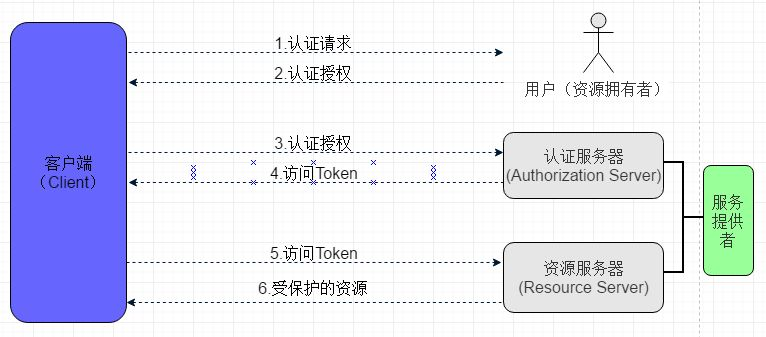
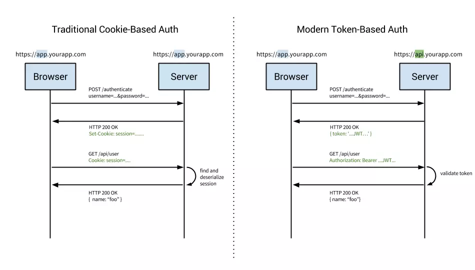

[TOC]


#微服务

## 基础概念

> 镜像，容器，微服务

```
子项目做成镜像，镜像做成容器。

微服务就是同类容器的集合，一个微服务包括一组容器。如，已有的 mysql 容器，或者自定义的 交友 容器等。
```

> 微服务的子项目中是否需要接口？ `不需要`

```
普通项目分为MVC三层，不同层由不同人员维护，所以在不同层进行相互调用时，就需要一套规范，即不同层的接口。

但是对于微服务项目，每一个子项目都是单独的一个服务，由单独的人员进行维护，所以也就不需要定义接口。
```

> 概念解析

```java
'SpringBoot'：Spring的纯注解版，零配置文件，以最少的配置来开发项目。是一种开发风格。

'SpringCloud'：Spring整合第三方技术的架构，将已有的第三方技术以'SpringBoot'的形式（即零配置的形式）封装到Spring框架中。
               所以，SpringCloud 依赖于 SpringBoot，但 SpringBoot 不依赖 SpringCloud。

'SpringMVC'：一种web层MVC框架，用于替代servlet（处理-响应请求，获取表单参数，表单校验等）。

'SpringData'：持久层框架。不仅能够适用于关系型数据库，还能够适用于非~。如 MongoDB，Redis，Hadoop
```

##父项目

> 区别 IDEA 中的 project 和 module

```

```

> 父项目：demo_parent。创建：<https://start.spring.io/>

```
项目名最好使用下划线进行分割。由于父项目不写代码逻辑，所以可将 src 目录删除
```

>对于微服务的父项目而言，pom 文件中的打包类型选择 pom 类型

```xml
<modelVersion>4.0.0</modelVersion>
<modules>
    <module>demo_common</module>  <!--子项目列表-->
    <module>demo_base</module>
    <module>demo_user</module>
</modules>
<parent>
    <groupId>org.springframework.boot</groupId>
    <artifactId>spring-boot-starter-parent</artifactId>
    <version>2.1.5.RELEASE</version>
    <relativePath /> <!-- lookup parent from repository -->
</parent>
<groupId>com.example</groupId>
<artifactId>demo_parent</artifactId>
<version>0.0.1-SNAPSHOT</version>
<packaging>pom</packaging> <!--父项目必须设置类型 pom-->

<name>demo_parent</name>
<description>Demo project for Spring Boot</description>

<properties>
    <java.version>1.8</java.version>
</properties>
```

> 父项目的 pom 文件只写通用的jar包。如 mysql 驱动包只在部分子模块使用，就不要写在父项目中

```xml
<dependencies>
    <dependency>
        <groupId>org.projectlombok</groupId>
        <artifactId>lombok</artifactId>
        <scope>provided</scope> <!--参与编译，测试，运行，但不会打包-->
        <optional>true</optional> <!--true: 依赖不会传递，但是该依赖卸载父项目则所有子类都可用。false: 会传递-->
    </dependency>
    <dependency>
        <groupId>org.springframework.boot</groupId>
        <artifactId>spring-boot-starter-web</artifactId>
    </dependency>
    <dependency>
        <groupId>org.springframework.boot</groupId>
        <artifactId>spring-boot-starter-test</artifactId>
        <scope>test</scope>
    </dependency>
</dependencies>
```

> 配置 Spring 的仓库地址，与 build 标签同级

```xml
<build>
    <plugins>
        <plugin>
            <groupId>org.springframework.boot</groupId>
            <artifactId>spring-boot-maven-plugin</artifactId>
        </plugin>
    </plugins>
</build>

<repositories> <!--jar包仓库-->
    <repository>
        <id>spring-snapshots</id>
        <name>Spring Snapshots</name>
        <url>https://repo.spring.io/snapshot</url>
        <snapshots>
            <enabled>true</enabled>
        </snapshots>
    </repository>
    <repository>
        <id>spring-milestones</id>
        <name>Spring Milestones</name>
        <url>https://repo.spring.io/milestone</url>
    </repository>
</repositories>

<pluginRepositories> <!--插件仓库-->
    <pluginRepository>
        <id>spring-snapshots</id>
        <name>Spring Snapshots</name>
        <url>https://repo.spring.io/snapshot</url>
        <snapshots>
            <enabled>true</enabled>
        </snapshots>
    </pluginRepository>
    <pluginRepository>
        <id>spring-milestones</id>
        <name>Spring Milestones</name>
        <url>https://repo.spring.io/milestone</url>
    </pluginRepository>
</pluginRepositories>
```


## 公共模块

> 项目创建：demo_common

```
选中父项目，然后右键选择 new -> module，项目名称：demo_common

对于公共模块只写公共方法，不写业务逻辑，所以 pom.xml 不用引用其他jar包
```

> pom.xml

```xml
<parent>
    <artifactId>demo_parent</artifactId> <!--指定父项目-->
    <groupId>com.example</groupId>
    <version>0.0.1-SNAPSHOT</version>
</parent>
<modelVersion>4.0.0</modelVersion>

<artifactId>demo_common</artifactId> <!--当前项目名。GV同父项目，所以省略-->

<dependencies>
    <dependency>
        <groupId>org.apache.commons</groupId>
        <artifactId>commons-lang3</artifactId>
        <version>3.8.1</version>
    </dependency>
    <dependency>
        <groupId>commons-collections</groupId>
        <artifactId>commons-collections</artifactId>
        <version>3.2.2</version>
    </dependency>
</dependencies>
```

> 状态码实体类

```java
package entity; //新建 entity 包，包下创建类 Result

public class StatusCode {
    public static final int OK = 20000; //成功
    public static final int ERROR = 20001; //失败
    public static final int LOGIN_ERROR = 20002; //用户名或密码错误
    public static final int ACCESS_ERROR = 20003; //权限不足
    public static final int REMOTE_ERROR = 20004; //远程调用失败
    public static final int REP_ERROR = 20005; //重复操作
}
```
>返回结果实体类：用于控制器类返回结果

```java
@Data
public class Result {
    private boolean flag; //是否成功 （规范2）
    private Integer code; //返回码 （规范1）
    private String message; //返回信息
    private Object data; //返回数据

    public Result() {
    }

    public Result(boolean flag, Integer code, String message) {
        this.flag = flag;
        this.code = code;
        this.message = message;
    }

    public Result(boolean flag, Integer code, String message, Object data) {
        this.flag = flag;
        this.code = code;
        this.message = message;
        this.data = data;
    }
}
```

> ali规范

```java
//【强制】所有的 POJO 类属性必须使用包装数据类型。
//【强制】RPC 方法的返回值和参数必须使用包装数据类型。

//【推荐】所有的局部变量使用基本数据类型。

说明：POJO 类属性没有初值是提醒使用者在需要使用时，必须自己显式地进行赋值，任何 NPE 问题，或者入库检查，都由使用者来保证。

正例：数据库的查询结果可能是 null，因为自动拆箱，用基本数据类型接收有 NPE 风险。

反例：比如显示成交总额涨跌情况，即正负 x%，x 为基本数据类型，调用的 RPC 服务，调用不成功时，返回的是默认值，页面显示为 0%，这是不合理的，应该显示成中划线。所以包装数据类型的 null 值，能够表示额外的信息，如：远程调用失败，异常退出。
```

```java
//【强制】POJO 类中布尔类型变量都不要加 is 前缀，否则部分框架解析会引起序列化错误。

说明：在本文 MySQL 规约中的建表约定第一条，表达是与否的值采用 is_xxx 的命名方式，所以，需要在<resultMap>设置从 is_xxx 到 xxx 的映射关系。

反例：定义为基本数据类型 Boolean isDeleted 的属性，它的方法也是 isDeleted()，RPC 框架在反向解析的时候，“误以为”对应的属性名称是 deleted，导致属性获取不到，进而抛出异常。
```

>分布式ID生成器

```java
由于数据库在生产环境中要分片部署（MyCat），所以不能使用数据库本身的自增功能来产生主键值，只能由程序来生成唯一的主键值。
采用开源的 twitter 的 snowflake（雪花）算法，总长度64bit。

'优点'：（1）整体上按照时间自增排序（2）整个分布式系统内不会产生ID碰撞(由数据中心ID和机器ID作区分) （3）效率较高
经测试，SnowFlake每秒能够产生26万ID左右。

0        //最高位是符号位,始终为0,不可用.
1-41     //41 位的时间序列，精确到毫秒级，可使用到2082年。时间位另一作用是可以根据时间进行排序
42-51    //10 位的机器标识，10位的长度最多支持部署1024个节点（2^10）
52-63    //12 位的计数序列，是一系列的自增id，支持每个节点每毫秒产生4096个ID序号（2^12）
```


##基础微服务

> 基础微服务：demo_base

```java
//与公共模块的区别：
公共模块只写一些公共类，不写逻辑代码，最终是以 jar 包形式在各个微服务中调用。
基础微服务是整个项目的一个子模块，也是微服务的一个。

但创建方式相同，都是右键选择 new -> module，项目名称：demo_base
```

> pom.xml

```xml
<parent>
    <artifactId>demo_parent</artifactId> <!--父项目-->
    <groupId>com.example</groupId>
    <version>0.0.1-SNAPSHOT</version>
</parent>
<modelVersion>4.0.0</modelVersion>

<artifactId>demo_base</artifactId>

<dependencies>
    <dependency>
        <groupId>com.example</groupId>
        <artifactId>demo_common</artifactId> <!--引用公共模块 demo_common-->
        <version>0.0.1-SNAPSHOT</version>
    </dependency>

    <dependency>
        <groupId>com.alibaba</groupId>
        <artifactId>druid-spring-boot-starter</artifactId>
        <version>1.1.10</version>
    </dependency>
    <dependency>
        <groupId>org.springframework.boot</groupId>
        <artifactId>spring-boot-starter-data-jpa</artifactId>
    </dependency>
    <dependency>
        <groupId>mysql</groupId>
        <artifactId>mysql-connector-java</artifactId>
    </dependency>
</dependencies>
```

> properties

```properties
server.port=9001

#微服务名称只能用-进行分割，不能用下划线
spring.application.name=demo-base

spring.datasource.type=com.alibaba.druid.pool.DruidDataSource
spring.datasource.driverClassName=com.mysql.cj.jdbc.Driver
spring.datasource.url=jdbc:mysql://192.168.8.7:33306/demo_base?useSSL=false&allowMultiQueries=true&serverTimezone=GMT%2B8
spring.datasource.username=bluecardsoft
spring.datasource.password=#$%_BC13439677375

spring.jpa.database=mysql
spring.jpa.show-sql=true
#是否自动生成ddl
spring.jpa.generate-ddl=true
spring.jpa.open-in-view=false
```

> 启动类

```java
@SpringBootApplication
public class BaseApplication {

    public static void main(String[] args) {
        SpringApplication.run(BaseApplication.class, args);
    }

    //id生成器，并不是所有的微服务项目都使用，所以不要在 IdWork 类上加 @Component
    //而应该在使用 id生成器 的微服务中用 @Bean 标签注入
    @Bean
    public IdWorker idWorker() {
        return new IdWorker();
    }
}
```

> pojo

```java
@Data
@Entity
@Table(name = "tb_label") //同数据表名
public class Label {
    @Id
    private String id;
    private String labelname;//标签名称
    private String state;//状态
    private Long count;//使用数量
    private Long fans;//关注数
    private String recommend;//是否推荐
}
```

> Controller

```java
@Slf4j
@RequestMapping("/label")
@RestController
public class LabelController {

    @Autowired
    LabelService labelService;

    //获取多个对象的方法用 list 做前缀，复数形式结尾如：listObjects
    //获取单个对象的方法用 get 做前缀
    //插入的方法用 save/insert 做前缀
    //修改的方法用 update 做前缀
    //删除的方法用 remove/delete 做前缀
    @GetMapping
    public Result listLabels() {
        List<Label> labels = labelService.listLabels();
        log.info("listLabels: {}", labels);
        return new Result(true, StatusCode.OK, "查询成功", labels);
    }
}
```

> Service：`微服务中不需要使用接口，直接写实现类即可`

```java
@Slf4j
@Service
@Transactional
public class LabelService {

    @Autowired
    LabelDao labelDao;

    @Autowired
    IdWorker idWorker;

    //查询全部
    public List<Label> listLabels() {
        Iterable<Label> iterable = labelDao.findAll();
        List<Label> labels = new ArrayList<>();
        iterable.forEach(labels::add);
        return labels;
    }
}
```

> DAO

```java
public interface LabelDao extends CrudRepository<Label, String> { }
```

##用户微服务

> 用户微服务：demo_user

```
创建方式同上，右键选择 new -> module，项目名称：demo_user
```

```xml
<parent>
    <artifactId>demo_parent</artifactId>
    <groupId>com.example</groupId>
    <version>0.0.1-SNAPSHOT</version>
</parent>
<modelVersion>4.0.0</modelVersion>

<artifactId>demo_user</artifactId>

<dependencies>
    <dependency>
        <groupId>com.example</groupId>
        <artifactId>demo_common</artifactId>
        <version>0.0.1-SNAPSHOT</version>
    </dependency>
</dependencies>
```

> 关于JWT认证

```java
JWT认证的 pom 引用，及工具类 JwtUtil 写在 'demo_common' 模块（不用写配置）

@Data
@ConfigurationProperties(prefix = "jwt.config")
public class JwtUtil {
    //...略
}
```

```java
但是JWT认证功能在 用户微服务 中使用，所以必须在 'demo_user' 微服务的启动类中注入 Bean，并增加配置

@Bean
public JwtUtil jwtUtil() {
    return new JwtUtil();
}
```

```properties
jwt.config.key=bluecard
jwt.config.ttl=300000
```


# Sms

> 短信服务使用 阿里云通信

```java
（1）注册，登陆，实名，产品选择'短信服务'
（2）申请签名，申请模板，创建 AccessKey，充值
```
##基础配置

> 配置文件

```xml
<!-- https://mvnrepository.com/artifact/com.aliyun/aliyun-java-sdk-dysmsapi -->
<dependency>
    <groupId>com.aliyun</groupId>
    <artifactId>aliyun-java-sdk-dysmsapi</artifactId>
    <version>1.1.0</version>
</dependency>
<!-- https://mvnrepository.com/artifact/com.aliyun/aliyun-java-sdk-core -->
<dependency>
    <groupId>com.aliyun</groupId>
    <artifactId>aliyun-java-sdk-core</artifactId>
    <version>3.2.8</version>
</dependency>
```

```properties
aliyun.sms.accessKeyId=*
aliyun.sms.accessKeySecret=*
aliyun.sms.templateCode=sms_20190328 #模板CODE
aliyun.sms.signName=短信测试          #签名名称
```

>SMS工具类

```java
/**
 * 短信工具类
 *
 * @author Administrator
 */
@Component
public class SmsUtils {

    //产品名称:云通信短信API产品,开发者无需替换
    static final String product = "Dysmsapi";
    //产品域名,开发者无需替换
    static final String domain = "dysmsapi.aliyuncs.com";

    @Autowired
    private Environment env;

    // TODO 此处需要替换成开发者自己的AK(在阿里云访问控制台寻找)

    /**
     * 发送短信
     *
     * @param mobile        手机号
     * @param template_code 模板号
     * @param sign_name     签名
     * @param param         参数
     * @return
     * @throws ClientException
     */
    public SendSmsResponse sendSms(String mobile, String template_code, String sign_name, String param) throws
            ClientException {
        String accessKeyId = env.getProperty("aliyun.sms.accessKeyId");
        String accessKeySecret = env.getProperty("aliyun.sms.accessKeySecret");
        //可自助调整超时时间
        System.setProperty("sun.net.client.defaultConnectTimeout", "10000");
        System.setProperty("sun.net.client.defaultReadTimeout", "10000");
        //初始化acsClient,暂不支持region化
        IClientProfile profile = DefaultProfile.getProfile("cn-hangzhou", accessKeyId, accessKeySecret);
        DefaultProfile.addEndpoint("cn-hangzhou", "cn-hangzhou", product, domain);
        IAcsClient acsClient = new DefaultAcsClient(profile);
        //组装请求对象-具体描述见控制台-文档部分内容
        SendSmsRequest request = new SendSmsRequest();
        //必填：待发送手机号
        request.setPhoneNumbers(mobile);
        //必填：短信签名-可在短信控制台中找到
        request.setSignName(sign_name);
        //必填：短信模板-可在短信控制台中找到
        request.setTemplateCode(template_code);
        //可选：模板中的变量替换JSON串,如模板内容为"亲爱的${name},您的验证码为${code}"时,此处的值为
        request.setTemplateParam(param);
        //选填，上行短信扩展码(无特殊需求用户请忽略此字段)
        //request.setSmsUpExtendCode("90997");
        //可选，outId为提供给业务方扩展字段,最终在短信回执消息中将此值带回给调用者
        request.setOutId("yourOutId");
        //hint 此处可能会抛出异常，注意catch
        SendSmsResponse sendSmsResponse = acsClient.getAcsResponse(request);
        return sendSmsResponse;
    }

    //查询发送短信的详情：如当天的发送消息总数
    public QuerySendDetailsResponse querySendDetails(String mobile, String bizId) throws ClientException {
        String accessKeyId = env.getProperty("accessKeyId");
        String accessKeySecret = env.getProperty("accessKeySecret");
        //可自助调整超时时间
        System.setProperty("sun.net.client.defaultConnectTimeout", "10000");
        System.setProperty("sun.net.client.defaultReadTimeout", "10000");
        //初始化acsClient,暂不支持region化
        IClientProfile profile = DefaultProfile.getProfile("cn-hangzhou", accessKeyId, accessKeySecret);
        DefaultProfile.addEndpoint("cn-hangzhou", "cn-hangzhou", product, domain);
        IAcsClient acsClient = new DefaultAcsClient(profile);
        //组装请求对象
        QuerySendDetailsRequest request = new QuerySendDetailsRequest();
        //必填-号码
        request.setPhoneNumber(mobile);
        //可选-流水号
        request.setBizId(bizId);
        //必填-发送日期 支持30天内记录查询，格式yyyyMMdd
        SimpleDateFormat ft = new SimpleDateFormat("yyyyMMdd");
        request.setSendDate(ft.format(new Date()));
        //必填-页大小
        request.setPageSize(10L);
        //必填-当前页码从1开始计数
        request.setCurrentPage(1L);
        //hint 此处可能会抛出异常，注意catch
        QuerySendDetailsResponse querySendDetailsResponse = acsClient.getAcsResponse(request);
        return querySendDetailsResponse;
    }
}
```

>SMS发送

```java
@Value("${aliyun.sms.templateCode}") //模板编号Code
String templateCode;

@Value("${aliyun.sms.signName}") //签名
String signName;

@Autowired
SmsUtil smsUtil;

//发送短信
smsUtil.sendSms(moblieNum, templateCode, signName, "{\"checkCode\":\"" + checkCode + "\"}");
```

##注册DEMO


>用户填写手机号，点击获取验证码。服务器向用户填写的手机号发送验证码。

```java
@PostMapping("/sendSms/{mobile}")
public String sendSms(@PathVariable String mobile) {
    if (StringUtils.isEmpty(mobile)) { //正则检测略
        return "手机号不合法";
    }
    return HelloService.sendSms(mobile);
}
```
>发送短信Service

```java
public void sendSms(String mobile) {
    //(1).生成验证码
    String checkCode = RandomStringUtils.randomNumeric(6); //org.apache.commons.lang3

    //(2).验证码存入redis，5分钟失效
    redisTemplate.opsForValue().set("checkCode_" + mobile, checkCode, 5, TimeUnit.MINUTES);

    //(3).发送消息 RabbitMQ，短信验证
    JSONObject object = new JSONObject();
    object.put("mobile", mobile);
    object.put("checkCode", checkCode);
    rabbitTemplate.convertAndSend("spring.sms", object);
}
```

>用户将收到的验证码填入，然后点击注册

```java
@PostMapping("/regist/{mobile}/{checkCode}")
public String regist(@PathVariable String mobile, @PathVariable String checkCode) {
    if (StringUtils.isEmpty(mobile)) { //正则检测略
        return "手机号不合法";
    }
    return HelloService.regist(mobile, checkCode);
}
```
>用户注册Service

```java
//service, dao --> 抛出异常; Controller/全局异常处理器 --> 处理异常.
private void regist(String mobile, String checkCode) {
    if (StringUtils.isEmpty(checkCode))
        throw new RuntimeException("请输入验证码");

    if (!smsCodeRedis.equalsIgnoreCase(checkCode))
        throw new RuntimeException("验证码不正确或已过期");

    personDao.add(person); //写库
}
```
##中国网建

>测试账户

```java
private static final String ZGWJ_NAME = "bluecardsoft"; //中国网建账号
private static final String ZGWJ_PASS = "537915b43b2b99a355df"; //中国网建发短息密钥

SmsUtils.sendSMS(ZGWJ_NAME, ZGWJ_PASS, "1761061****", "测试文档");
```
>短信工具类

```java
public static String sendSMS(String userName, String key, String toMobile, String smsText) {
    List<NameValuePair> nvps = new ArrayList<>(4);
    nvps.add(new BasicNameValuePair("Uid", userName));
    nvps.add(new BasicNameValuePair("Key", key));
    nvps.add(new BasicNameValuePair("smsMob", toMobile));
    nvps.add(new BasicNameValuePair("smsText", smsText));
    UrlEncodedFormEntity entity = new UrlEncodedFormEntity(nvps, Charset.forName("GBK")); //中文乱码
    entity.setContentType("application/x-www-form-urlencoded;charset=gbk");

    HttpPost httpPost = new HttpPost("http://gbk.sms.webchinese.cn");
    httpPost.setEntity(entity);

    try (CloseableHttpResponse httpResponse =
         HttpClients.createDefault().execute(httpPost)) { //发送请求，连接自动关闭
        if (null != httpResponse && HttpStatus.SC_OK ==
            httpResponse.getStatusLine().getStatusCode()) {
            String res = EntityUtils.toString(httpResponse.getEntity(), "UTF-8"); //获取结果
            System.out.println(res);
            return res;
        }
    } catch (IOException e) {
        e.printStackTrace();
    }
    return null;
}
```
# BCrypt加密

>基础配置：hash算法不可逆，所以不能解密

```java
任何应用考虑到安全，绝不能明文的方式保存密码。密码应该通过哈希算法进行加密。有很多标准的算法比如 SHA 或 MD5，结合salt（盐）是一个不错的选择。
Spring Security提供了 BCryptPasswordEncoder 类，实现Spring的 PasswordEncoder 接口使用'BCrypt强哈希方法'来加密密码。
```
```java
'纯md5加密'：可以使用密码字典破解，暴力破解。（X）
'md5加盐加密'：一旦知道 salt 和加密规则，就可以破解所有的密码。（X）
'md5随机盐加密'：不同用户分配不同的salt。必须得单独保存salt，验证时使用。（X）

'BCrypt加密'：将salt随机，并混入最终加密后的密码。验证时也无需单独提供之前的salt，从而无需单独处理salt问题。
```

```java
//BCrypt加密对于同一个密码，每次生成的hash不一样。因为随机salt
但是，hash结果中包含了salt（hash产生过程：先随机生成salt，salt跟password进行hash）。

在下次校验时，从hash中取出salt，salt跟password进行hash。得到的结果跟保存在DB中的hash进行比对。
```

```xml
<dependency>
    <groupId>org.springframework.boot</groupId>
    <artifactId>spring-boot-starter-security</artifactId>
</dependency>
```
```java
@Bean //配置bean
public BCryptPasswordEncoder encoder(){
    return new BCryptPasswordEncoder();
}
```

> 必要配置

```java
添加了spring security依赖后，所有的地址都被spring security所控制了。
目前只是需要用到'BCrypt密码加密'的部分，所以我们要添加一个配置类，配置为所有地址都可以匿名访问。
```

```java
@Configuration
@EnableWebSecurity
public class WebSecurityConfig extends WebSecurityConfigurerAdapter {
    @Override
    protected void configure(HttpSecurity http) throws Exception {
        super.configure(http);
        http.authorizeRequests()
                .antMatchers("/**").permitAll()
                .anyRequest().authenticated()
                .and().csrf().disable();
    }
}
```

> 加密测试

```java
@Autowired
BCryptPasswordEncoder encoder;

@Test
public void encoder() {
    String encode = encoder.encode("123");
    System.out.println("encode: " + encode); //加密: $2a$10$ujGzEaaHHU0y72yzfwMk.OA0KUNpKfRFr291I5YuGqnWawmnAQV1y

    boolean matches = encoder.matches("123", "$2a$10$ujGzEaaHHU0y72yzfwMk.OA0KUNpKfRFr291I5YuGqnWawmnAQV1y");
    System.out.println("matches: " + matches); //比对: true
}
```
#JWT认证

##常见认证

>HTTP Basic Auth

```
每次请求API时，都提供用户的 username 和 password。
简言之，Basic Auth是配合RESTful API 使用的最简单的认证方式，只需提供用户名密码即可。
但由于有把用户名密码暴露给第三方客户端的风险，在生产环境下被使用的越来越少。因此，在开发对外开放的 RESTful API 时，尽量避免采用HTTP Basic Auth。
```

>OAuth：<https://www.cnblogs.com/flashsun/p/7424071.html>

```
OAuth（开放授权）是一个开放的授权标准，允许用户让第三方应用访问该用户在某一web服务上存储的私密的资源（如照片，视频，联系人列表），
而无需将用户名和密码提供给第三方应用。

OAuth允许用户提供一个令牌，而不是用户名和密码来访问他们存放在特定服务提供者的数据。
每一个令牌授权一个特定的第三方系统（例如，视频编辑网站)在特定的时段（例如，接下来的2小时内）内访问特定的资源（例如仅仅是某一相册中的视频）。
这样，OAuth让用户可以授权第三方网站访问他们存储在另外服务提供者的某些特定信息，而非所有内容。

这种基于OAuth的认证机制适用于个人消费者类的互联网产品，如社交类APP等应用，但是不太适合拥有自有认证权限管理的企业应用。
```



>Cookie Auth

```java
为一次请求认证在服务端创建一个Session对象，同时在客户端的浏览器端创建了一个Cookie对象；
通过客户端带上来Cookie对象来与服务器端的Session对象匹配来实现'状态管理'的。
默认的，当我们关闭浏览器的时候，cookie会被删除。但可以通过修改cookie 的expire time使cookie在一定时间内有效。

cookie 验证是用于长时间用户验证，cookie 验证是'有状态的'，意味着验证记录或者会话需要一直在服务端和客户端保持。
服务器需要保持对数据库（如 redis）中活动会话的追踪，当在前端创建了一个 cookie，cookie 中包含了一个 session 标识符。
```

```java
//传统 cookie 会话的验证流程：
（1）用户登录，输入账号密码
（2）服务器验证用户账号密码正确，创建一个 session 存储在数据库（或者 redis）
（3）将 session ID 放进 cookie 中，被存储在用户浏览器中
（4）再次发起请求，服务器直接通过 session ID 对用户进行验证
（5）一旦用户登出，则 session 在客户端和服务器端都被销毁
```



>Token Auth：<https://www.jianshu.com/p/c33f5777c2eb>

```java
使用基于 Token 的身份验证方法，在服务端不需要存储用户的登录记录。

//大概的流程是这样的：
（1）客户端使用用户名跟密码请求登录
（2）服务端收到请求，去验证用户名与密码
（3）验证成功后，服务端会签发一个 Token，再把这个 Token 发送给客户端
（4）客户端收到 Token 以后可以把它存储起来，比如存储在 local storage，也可以存储在 session storage 或者 cookie 中
（5）客户端每次向服务端请求资源的时候，将 token 放进 Authorization header，然后发送到服务端
（6）服务端收到请求，然后去验证客户端请求里面带着的 Token，如果验证成功，就向客户端返回请求的数据
（7）一旦用户登出，token 在客户端被销毁，不需要经过服务器端
```

##Token优缺点

>（优点1）：无状态，可扩展和解耦

```java
使用 token 而不是 cookie 的最大优点应该就是'无状态'
后端不需要保持对 token 的记录，每个 token 都是独立的，包含了检查其有效性的所有数据，并通过声明传达了用户信息。

服务器端的工作只需要在登录成功后，生成（或者 sign，签署） token，或者验证传入的 token 是否有效。
有时候甚至不需要生成 token，第三方服务比如 Auth0 可以处理 token 的签发，服务器只需要验证 token 的有效性就可以。
```

>（优点2）：跨域和 CORS

```
cookie 能很好的处理单域和子域，但是遇到跨域的问题就会变得难以处理。
而使用 token 的 CORS 可以很好的处理跨域的问题。由于每次发送请求到后端，都需要检查 JWT，只要它们被验证通过就可以处理请求。
```

>（优点3）：在 JWT 中存储数据

```java
当使用 cookie 进行验证时，是将 session id 存储到 cookie 里，JWT 允许你存储任何类型的元数据，只要是合法的 JSON。
可以在里面添加任何数据，可以只有用户 ID 和到期日，也可以添加其它的比如邮件地址，域名等等。

假如：有一个 API 是'/api/orders'，用于取回最新的订单，但是只有 admin 角色的用户可以获取到这些数据。
在基于 cookie 的验证中，一旦请求被创建，就需要先去访问数据库去验证 session 是否正确（现在应该都是存储到 redis 里了，不会存数据库里了），
另外还要去获取数据库里的用户权限去校验用户是否拥有 admin 的权限（这个应该是根据用户 role_id 查看权限是否是 admin），最后才是调用订单信息。

而使用 JWT 的话，可以将用户角色放进 JWT 内，所以只要验证通过了，就可以直接调用订单信息。
```

>（优点4）：移动平台

```
现代的 API 不仅仅和浏览器交互，正确编写一个 API 可以同时支持浏览器，还有原生移动平台，比如 IOS 或者 Android。

原生移动平台并不一定和 cookie 能良好的兼容，在使用中会存在一些限制和需要注意的地方。
另一方面，token 更容易在 IOS 和 Android 上实现，Token 也更容易实现物联网应用程序和服务，没有 Cookie 存储的概念。
```

>缺点1：JWT 大小

```
token 最大的缺点就是它的大小，最小的它都比 cookie 要大。
如果 token 中包含很多声明，那问题就会变得比较严重，毕竟向服务器发送的每个请求都要有这个 token。（太大了会导致请求缓慢）
```

>缺点2：哪里存储 token

```
通常 JWT 被存储在浏览器的 local storage 中并且能够很好的运用。
但是这样存储也会有问题，不像 cookie，local storage 被沙盒化到特定域，其区域不能被任何其他域访问，包括子域。

可以存储 token 在 cookie 中，但是 cookie 最大的大小也只有 4kb，所以如果你有许多声明的时候可能会存储不够，
session storage 就更不用说了，会话断开就被清除掉了。

（个人记录：由于JWT前两个字符串采用base64进行编码，所以内容越多，编码字符串长度越长）
```

##JWT的Token

> JWT组成：头部（header）、载荷（playload）与签名（signature）

```
JSON Web Token（JWT）是一个非常轻巧的规范。这个规范允许使用 JWT 在用户和服务器之间传递安全可靠的信息。
```

> BASE64编码和解码：http://tool.oschina.net/encrypt?type=3

```java
//Base64是一种基于64个可打印字符来表示二进制数据的表示方法。
JDK 中提供了非常方便的 BASE64Encoder 和 BASE64Decoder，用它们可以非常方便的完成基于 BASE64 的编码和解码

由于2的6次方等于64，所以每6个比特为一个单元，对应某个可打印字符。
3个字节有24个比特，对应于4个Base64单元，即3个字节需要用4个可打印字符来表示。
```

```java
@Test
public void demo01() throws IOException {
    String encode = new BASE64Encoder().
        encode("{\"typ\":\"JWT\",\"alg\":\"HS256\"}".getBytes(Charset.forName("UTF-8")));
    System.out.println("BASE64 编码: " + encode);

    String decode = new String(new BASE64Decoder().decodeBuffer("eyJ0eXAiOiJKV1QiLCJhbGciOiJIUzI1NiJ9"));
    System.out.println("BASE64 解码: " + decode);
}
```

>头部（header）：用于描述关于该JWT的最基本的信息，例如其类型以及签名所用的算法等。也可以被表示成一个JSON对象。

```java
{"typ":"JWT","alg":"HS256"} //签名算法是HS256算法

eyJ0eXAiOiJKV1QiLCJhbGciOiJIUzI1NiJ9 //BASE64编码
```

>载荷（playload）：存放有效信息的地方。包含三部分内容：

```java
//（1）标准中注册的声明（建议但不强制使用）
iss: jwt签发者
sub: jwt所面向的用户
aud: 接收jwt的一方
exp: jwt的过期时间，这个过期时间必须要大于签发时间
nbf: 定义在什么时间之前，该jwt都是不可用的.
iat: jwt的签发时间
jti: jwt的唯一身份标识，主要用来作为一次性token，从而回避重放攻击。
```

```java
//（2）公共的声明
可以添加任何的信息，一般添加用户的相关信息或其他业务需要的必要信息。'但不建议添加敏感信息'，因为该部分在客户端可解密
```

```java
//（3）私有的声明
提供者和消费者所共同定义的声明，即自定义的claim。一般'不建议存放敏感信息'，因为base64是对称解密的，意味着该部分信息可以归类为明文信息。
如前面那个结构举例中的 admin 和 name 都属于自定的claim。

这些claim跟JWT标准规定的claim区别在于：
JWT规定的claim，JWT的接收方在拿到JWT之后，都知道怎么对这些标准的claim进行验证（还不知道是否能够验证）；
而 private claims不会验证，除非明确告诉接收方要对这些 claim 进行验证以及规则才行。

{"sub":"1234567890","name":"John Doe","admin":true} //自定义playload
eyJzdWIiOiIxMjM0NTY3ODkwIiwibmFtZSI6IkpvaG4gRG9lIiwiYWRtaW4iOnRydWV9 //BASE64编码
```

> 签证（signature）：jwt的第三部分是一个签证信息，由三部分组成：

```java
//header (base64后的) + payload (base64后的) + secret

这个部分需要base64加密后的header 和 base64加密后的payload使用 '.' 连接组成的字符串，
然后通过header中声明的加密方式进行加盐secret组合加密，然后就构成了jwt的第三部分。

eyJhbGciOiJIUzI1NiIsInR5cCI6IkpXVCJ9. //header (base64后的)
eyJzdWIiOiIxMjM0NTY3ODkwIiwibmFtZSI6IkpvaG4gRG9lIiwiYWRtaW4iOnRydWV9. //payload (base64后的)
TJVA95OrM7E2cBab30RMHrHDcEfxjoYZgeFONFh7HgQ //secret
```

```java
注意：secret是保存在服务器端的，jwt的签发生成也是在服务器端的，secret就是用来进行jwt的签发和jwt的验证，
所以，它就是你服务端的私钥，'在任何场景都不应该流露出去'。一旦客户端得知这个secret, 那就意味着客户端是可以自我签发jwt了。
```

## JJWT基础

> 基础概念

```java
JJWT是一个提供 端到端 的JWT创建和验证的'Java库'。永远免费和开源(Apache-License，版本2.0)，JJWT很容易使用和理解。
它被设计成一个以建筑为中心的流畅界面，隐藏了它的大部分复杂性。
```

```xml
<!-- https://mvnrepository.com/artifact/io.jsonwebtoken/jjwt -->
<dependency>
    <groupId>io.jsonwebtoken</groupId>
    <artifactId>jjwt</artifactId>
    <version>0.9.1</version>
</dependency>
```

>Token的创建

```java
private static final String SECRET_KEY = "bluecard"; //服务端的秘钥
```

```java
public void createToken() {
    long now = System.currentTimeMillis(); //当前时间
    long exp = now + 1000 * 60; //过期时间设为1分钟

    JwtBuilder builder = Jwts.builder()
        .signWith(SignatureAlgorithm.HS256, SECRET_KEY) //秘钥
        .setId("888")
        .setSubject("小白")
        .setIssuedAt(new Date()) //签发时间
        .setExpiration(new Date(exp)) //过期时间
        .claim("roles", "admin") //自定义Claims：roles
        .claim("logo", "logo.png"); //自定义Claims：logo
    String token = builder.compact();
    System.out.println(token);
}
```

> Token的解析

```java
public void parseToken() {
    String token = "eyJhbGciOiJIUzI1NiJ9." +
        "eyJqdGkiOiI4ODgiLCJzdWIiOiLlsI_nmb0iLCJpYXQiOjE1NjIwMzc0NTUsImV4cCI6" +
        "MTU2MjAzNzUxNCwicm9sZXMiOiJhZG1pbiIsImxvZ28iOiJsb2dvLnBuZyJ9." +
        "3biyBWxg0BNC_RnWlWJG_NM-pdUFmIRhonPJRdEvA_M";

    //parseClaimsJws(token); 可能抛出各种异常。
    //如，Token过期时会引发 io.jsonwebtoken.ExpiredJwtException 异常
    Claims claims = Jwts.parser().setSigningKey(SECRET_KEY).parseClaimsJws(token).getBody();

    //jti：jwt的唯一身份标识，主要用来作为一次性token，从而回避重放攻击
    System.out.println("jti: " + claims.get("jti")); //888
    //iat：jwt的签发时间
    System.out.println("iat: " + claims.get("iat")); //1562044568

    System.out.println("id: " + claims.getId()); //888
    System.out.println("subject: " + claims.getSubject()); //小白

    System.out.println("roles: " + claims.get("roles")); //自定义Claims: admin
    System.out.println("logo: " + claims.get("logo")); //logo.png

    SimpleDateFormat sdf = new SimpleDateFormat("yyyy-MM-dd hh:mm:ss");
    System.out.println("签发时间: " + sdf.format(claims.getIssuedAt()));
    System.out.println("过期时间: " + sdf.format(claims.getExpiration()));
    System.out.println("当前时间: " + sdf.format(new Date()));
}
```

##JJWT整合

> JJWT工具类，写在公共模块 `demo_common`

```java
@Data
@ConfigurationProperties(prefix = "jwt.config")
public class JwtUtil {
    private String key; //加盐Secret
    private long ttl; //过期时间

    //生成JWT
    public String createJWT(String id, String subject, String roles) {
        long nowMillis = System.currentTimeMillis();
        JwtBuilder builder = Jwts.builder()
                .setId(id)
                .setSubject(subject)
                .setIssuedAt(new Date(nowMillis))
                .signWith(SignatureAlgorithm.HS256, key)
                .claim("roles", roles);
        if (ttl > 0) {
            builder.setExpiration(new Date(nowMillis + ttl));
        }
        return builder.compact();
    }

    //解析JWT
    public Claims parseJWT(String jwtStr) {
        return Jwts.parser()
                .setSigningKey(key)
                .parseClaimsJws(jwtStr)
                .getBody();
    }
}
```

>JWT使用，写在用户微服务 `demo_user`

```java
@Bean //启动类注入Bean
public JwtUtil jwtUtil() {
    return new JwtUtil();
}
```

```properties
#配置文件
jwt.config.key=bluecard
jwt.config.ttl=300000
```

> 生成JWT。场景需求：登陆成功后生成 Token，返回给客户端

```java
@PostMapping("/login")
public Result login(@RequestBody Map<String, String> loginMap) { //restful接口的参数可以封装为 javaBean,也可以封装 map
    String loginName = loginMap.get("loginName");
    String loginPwd = loginMap.get("loginPwd");
    User user = userService.login(loginName, loginPwd); //登陆验证逻辑

    if (null == user) {
        return new Result(false, StatusCode.LOGIN_ERROR, "用户名或密码错误");
    }

    String userName = user.getName();
    String userRole = user.getRoles();
    String token = jwtUtil.createJWT(user.getId() + "", userName, userRole);
    HashMap<String, String> map = new HashMap<>();
    map.put("token", token);
    map.put("name", userName);
    map.put("roles", userRole); //返回前台，不用解析即可使用
    return new Result(true, StatusCode.OK, "登陆成功", map);
}
```

> 解析JWT。场景需求：删除用户，必须拥有管理员权限，否则不能删除。

```java
'前后端约定'：前端请求微服务时需要添加头信息 Authorization: Bearer+空格+token
```

```java
@DeleteMapping("/{id}")
public Result delete(@RequestHeader("Authorization") String authHeader, @PathVariable String id) {
    //@RequestHeader("Authorization") String authHeader //获取头信息：注解版
    // String authHeader = request.getHeader("Authorization"); //获取头信息：代码版

    if (authHeader == null || !authHeader.startsWith("Bearer ")) {
        return new Result(false, StatusCode.ACCESS_ERROR, "权限不足");
    }

    String token = authHeader.substring(7);//提取token
    Claims claims = null;
    try {
        claims = jwtUtil.parseJWT(token);
    } catch (Exception e) {
        log.error("delete Exception: ", e);
    }
    if (claims == null || !"admin".equals(claims.get("roles"))) {
        return new Result(false, StatusCode.ACCESS_ERROR, "权限不足");
    }

    userService.deleteById(id); //删除用户逻辑
    return new Result(true, StatusCode.OK, "删除成功");
}
```

>使用拦截器方式实现token鉴权

```java
每个接口都进行 鉴权 处理，会显得冗余。可以通过 拦截器 进行优化。 extends HandlerInterceptorAdapter

（1）定义拦截器
（2）注册拦截器
（3）更新鉴权方式，不再每个接口中进行鉴权
```

```java
@Slf4j
@Component
public class JwtInterceptor extends HandlerInterceptorAdapter {

    @Autowired
    JwtUtil jwtUtil;

    //预处理：可以进行编码、安全控制等处理
    @Override
    public boolean preHandle(HttpServletRequest request, HttpServletResponse response, Object handler) throws
            Exception {
        // return super.preHandle(request, response, handler);

        System.out.println("经过了拦截器");
        String authHeader = request.getHeader("Authorization");
        if (authHeader != null && authHeader.startsWith("Bearer ")) {
            String token = authHeader.substring(7); //The part after "Bearer "

            Claims claims = null;
            try {
                claims = jwtUtil.parseJWT(token);
            } catch (Exception e) {
                log.error("JwtInterceptor#preHandle Exception: ", e);
            }
            if (claims != null) {
                if ("admin".equals(claims.get("roles"))) { //如果是管理员
                    request.setAttribute("admin_claims", claims);
                }
                if ("user".equals(claims.get("roles"))) { //如果是用户
                    request.setAttribute("user_claims", claims);
                }
            }
        }
        return true;
    }

    //后处理（调用了Service并返回ModelAndView，但未进行页面渲染）：有机会修改ModelAndView
    @Override
    public void postHandle(HttpServletRequest request, HttpServletResponse response, Object handler, ModelAndView
            modelAndView) throws Exception {
        super.postHandle(request, response, handler, modelAndView);
    }

    //返回处理（已经渲染了页面）：可以根据ex是否为null判断是否发生了异常，进行日志记录
    @Override
    public void afterCompletion(HttpServletRequest request, HttpServletResponse response, Object handler, Exception
            ex) throws Exception {
        super.afterCompletion(request, response, handler, ex);
    }
}
```

```java
@Configuration
public class WebMvcConfig implements WebMvcConfigurer {

    @Autowired
    JwtInterceptor jwtInterceptor;

    @Override
    protected void addInterceptors(InterceptorRegistry registry) {
        super.addInterceptors(registry);

        registry.addInterceptor(jwtInterceptor)
                .addPathPatterns("/**")
                .excludePathPatterns("/**/login");
    }
}
```

```java
@DeleteMapping("/{id}") //使用 拦截器 后的删除接口
public Result delete(@PathVariable String id) {
    Claims claims = (Claims) request.getAttribute("admin_claims");
    if (claims == null) {
        return new Result(true, StatusCode.ACCESS_ERROR, "无权访问");
    }
    userService.deleteById(id);
    return new Result(true, StatusCode.OK, "删除成功");
}
```


