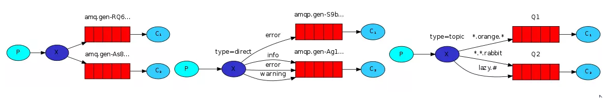

# RabbitMQ

## 基础配置

> BOOT

```xml
<dependency>
    <groupId>org.springframework.boot</groupId>
    <artifactId>spring-boot-starter-amqp</artifactId>
</dependency>
```

```properties
# rabbitmq
spring.rabbitmq.host=192.168.5.23
spring.rabbitmq.port=5672
spring.rabbitmq.username=guest
spring.rabbitmq.password=guest

# listener
spring.rabbitmq.listener.simple.auto-startup: 是否启动时自动启动容器
spring.rabbitmq.listener.simple.acknowledge-mode: 表示消息确认方式，其有三种配置方式，分别是 none、manual和auto；默认 auto
spring.rabbitmq.listener.simple.concurrency: 最小的消费者数量
spring.rabbitmq.listener.simple.max-concurrency: 最大的消费者数量
spring.rabbitmq.listener.simple.prefetch: 指定一个请求能处理多少个消息，如果有事务的话，必须大于等于transaction数量.
spring.rabbitmq.listener.simple.transaction-size: 指定一个事务处理的消息数量，最好是小于等于prefetch的数量.
spring.rabbitmq.listener.simple.default-requeue-rejected: 决定被拒绝的消息是否重新入队；默认是true（与参数acknowledge-mode有关系）
spring.rabbitmq.listener.simple.idle-event-interval: 多少长时间发布空闲容器时间，单位毫秒

spring.rabbitmq.listener.simple.retry.enabled: 监听重试是否可用
spring.rabbitmq.listener.simple.retry.max-attempts: 最大重试次数
spring.rabbitmq.listener.simple.retry.initial-interval: 第一次和第二次尝试发布或传递消息之间的间隔
spring.rabbitmq.listener.simple.retry.multiplier: 应用于上一重试间隔的乘数
spring.rabbitmq.listener.simple.retry.max-interval: 最大重试时间间隔
spring.rabbitmq.listener.simple.retry.stateless: 重试是有状态or无状态

# template
spring.rabbitmq.template.mandatory: 启用强制信息；默认false
spring.rabbitmq.template.receive-timeout: receive() 操作的超时时间
spring.rabbitmq.template.reply-timeout: sendAndReceive() 操作的超时时间
spring.rabbitmq.template.retry.enabled: 发送重试是否可用
spring.rabbitmq.template.retry.max-attempts: 最大重试次数
spring.rabbitmq.template.retry.initial-interval: 第一次和第二次尝试发布或传递消息之间的间隔
spring.rabbitmq.template.retry.multiplier: 应用于上一重试间隔的乘数
spring.rabbitmq.template.retry.max-interval: 最大重试时间间隔
```

## 基本使用

> 序列化**：默认以java序列化，现配置json序列化

```java
@EnableRabbit //rabbitmq-全局注解
@Configuration
public class AppConfig {
    @Bean
    public MessageConverter messageConverter() {
        return new Jackson2JsonMessageConverter(); //对于传递对象，可配置此项。对于传递JSON字符串，则不用配置
    }
}
```

> **队列** の创建和删除

```java
/**
 * @param name       队列名称
 * @param durable    是否持久化。即 rabbitmq 服务重启，队列是否还存在？ 默认 true
 * @param exclusive  是否排外及私有。默认 false
 *        true： 私有队列，其他通道channel不能访问，强制访问抛异常。并且该channel的conn断开后，队列将自动删除包括里面的msg
 *        false：非排外及私有，可以使用两个消费者同时访问同一个队列，没有任何问题
 * @param autoDelete 当所有消费客户端连接断开后，是否自动删除队列？ 默认 false
 * @param arguments  额外参数。
 */
Queue queue = new Queue("queue.expires", true, false, false, args);

String queueName = amqpAdmin.declareQueue(queue); //创建队列，返回队列名
boolean deleteQueue = amqpAdmin.deleteQueue("queue.expires.999"); //删除队列
```

> **队列** 其他属性

```java
Map<String, Object> args = new HashMap<>();
args.put("x-expires", 3 * 60 * 1000);     //3分钟内，没有消费者消费 msg，则自动删除该队列
args.put("x-message-ttl", 5 * 60 * 1000); //队列中 msg 被丢弃前，能够存活的时间
args.put("x-max-length", 5);              //队列的最大长度。超过最大长度，后面的消息会顶替前面的
args.put("x-max-length-bytes", 5);        //队列的最大容量。作用同上，但这个是靠队列大小（bytes）来达到限制
args.put("x-max-priority", 5);            //队列的优先级。建议使用1到10之间，表示队列应该支持的最大优先级。
args.put("x-queue-mode", "lazy"); //取值范围：default和lazy。lazy：先将消息保存到磁盘上，不放在内存中，当消费者开始消费的时候才加载到内存中
Queue queue = new Queue("queue.expires", true, false, false, args);
```

> **交换器** の创建和删除

```java
/**
 * @param name       交换器名称
 * @param durable    是否持久化，即 rabbitmq 重启是否还存在？ 默认 true
 * @param autoDelete 当所有绑定队列都不在使用时，是否自动删除交换器。默认 false
 */
FanoutExchange exchange = new FanoutExchange("exchange.fanout", true, false);

amqpAdmin.declareExchange(exchange); //创建交换器
boolean deleteExchange = amqpAdmin.deleteExchange("exchange.fanout"); //删除交换器
```

> **绑定关系**の创建和删除

```java
/**
 * @param destination     目的地，队列名 或 交换器名
 * @param destinationType 目的地类型（可选值 QUEUE，EXCHANGE）
 * @param exchange        交换器
 * @param routingKey      路由键
 * @param arguments       额外参数
 */
Binding binding = new Binding("queue.admin.0", Binding.DestinationType.QUEUE, "exchange.admin", "admin.#", null);

amqpAdmin.declareBinding(binding); //声明绑定关系（队列，交换器，路由键）
amqpAdmin.removeBinding(binding); //删除绑定关系
```

> **发送消息**の两种方式

```java
//msg需要自己构造，自定义消息头和消息体
amqpTemplate.send("exchange", "routing-key", new Message("".getBytes(), null));

//【推荐】只需传入要发送的对象 obj，系统自动将其当成消息体，并自动序列化。
amqpTemplate.convertAndSend("exchange", "routing-key", new Object());
```

> 三种模式

```sh
`Fanout`：任何发送到'Exchange'的消息，都会路由到与其绑定的'所有Queue'中。`Queue与Exchange 直接相连，不需要 RoutingKey`
Queue与Exchange 的绑定是：多对多的关系。一个E上可以绑定多个Q，一个Q可以同多个E进行绑定
```

```sh
`Direct`：任何发送到 E 的消息，都会被转发到'RK一致'的 Q 中。`Q与E 通过 RK 相连，RK需要完全匹配`
如，绑定的RK为"rk.info"，则只会转发标记为"rk.info"的消息，不会转发"rk.debug"，"rk.info.log"等
```

```sh
`Topic`：任何发送到 E 的消息，都会被转发到'RK模糊匹配'的 Q 中。`Q与E 通过 RK 相连，RK支持模糊匹配`
模糊匹配规则："#"表示0个或若干个关键词，"*"表示1个关键词
所以，如"rk.*"能与"rk.info"匹配，无法与"rk.info.log"匹配；但是"rk.#"能与上述两者匹配。

RK='quick.orange.rabbit'的消息会同时路由到 Q1 + Q2，
RK='lazy.orange.fox'的消息会路由到 Q1 + Q2，
RK='lazy.brown.fox'的消息会路由到 Q2，
RK='lazy.pink.rabbit'的消息会路由到 Q2（只会投递给Q2一次，虽然这个 RK 与Q2的两个 Binding-Key 都匹配）
RK='quick.brown.fox'，'orange'，'quick.orange.male.rabbit'的消息将会被丢弃，因为它们没有匹配任何 Binding-Key
```



## Fanout

> 发送端：直接发送 Msg 到 Exchange，不指定 RoutingKey

```java
for (int i = 0; i < 10; i++) {
    String exchange = "exchange.fanout";
    String routingKey = ""; //路由键：不指定，E与Q直接绑定，多对多
    String msg = "fanout-" + i;
    amqpTemplate.convertAndSend(exchange, routingKey, msg);
}
```

> 接收端：两个消费者，都能收到消息

```java
//@QueueBinding --> value: 绑定队列的名称；exchange: 配置交换器；key: 路由键(fanout模式不需要指定)
@RabbitListener(bindings = {
    @QueueBinding(
        // value = @Queue(value = "${queue.fanout.info}"), //可以使用 ${} 直接从配置文件读取
        value = @Queue(value = "queue.fanout.info"),
        exchange = @Exchange(value = "exchange.fanout", type = ExchangeTypes.FANOUT),
        key = ""
    )
    /*, @QueueBinding()*/ //也可以实现：一个Queue绑定多个Exchange
})
@Slf4j
@Component
public class InfoConsumer {

    @RabbitHandler //接收消息的方法。采用消息队列监听机制
    public void recv(String msg) {
        log.info("【接收消息】FANOUT-INFO: " + msg);
    }
}
```

```java
@RabbitListener(bindings = @QueueBinding(
    value = @Queue(value = "queue.fanout.error"),
    exchange = @Exchange(value = "exchange.fanout", type = ExchangeTypes.FANOUT),
    key = ""
))
@Slf4j
@Component
public class ErrorConsumer {

    @RabbitHandler
    public void recv(String msg) {
        log.info("【接收消息】FANOUT-ERROR: " + msg);
    }
}
```

## Direct

> 发送端：发送`3`种消息

```java
String exchange = "exchange.direct";

String routingKey = "rk.debug";
String msg = "direct-rk-debug";
amqpTemplate.convertAndSend(exchange, routingKey, msg); //msg-01

routingKey = "rk.info";
msg = "direct-rk-info";
amqpTemplate.convertAndSend(exchange, routingKey, msg); //msg-02

routingKey = "rk.info.log";
msg = "direct-rk-info-log";
amqpTemplate.convertAndSend(exchange, routingKey, msg); //msg-03
```

> 接收端：只能收到第`2`种消息。如果两个接收端，则会交替接收到消息

```java
@RabbitListener(bindings = @QueueBinding(
    value = @Queue(value = "queue.direct.info"),
    exchange = @Exchange(value = "exchange.direct", type = ExchangeTypes.DIRECT),
    key = "rk.info"
))
@Slf4j
@Component
public class DirectConsumer {

    @RabbitHandler //接收消息的方法。采用消息队列监听机制
    public void recv(String msg) {
        log.info("【接收消息】DIRECT: " + msg);
    }
}
```

## Topic

> 发送端

```java
String exchange = "exchange.topic";

String routingKey = "rk.info";
String msg = "topic-rk-info";
amqpTemplate.convertAndSend(exchange, routingKey, msg);

routingKey = "rk.info.log";
msg = "topic-rk-info-log";
amqpTemplate.convertAndSend(exchange, routingKey, msg);
```

> 接收端

```java
@RabbitListener(bindings = @QueueBinding(
    value = @Queue(value = "queue.topic.info"),
    exchange = @Exchange(value = "exchange.topic", type = ExchangeTypes.TOPIC),
    key = "rk.#"
))
@Slf4j
@Component
public class TopicConsumer {

    @RabbitHandler //接收消息的方法。采用消息队列监听机制
    public void recv(String msg) {
        log.info("【接收消息】TOPIC: " + msg);
    }
}
```

## 页面版

>启用 Web STOMP 插件

```sh
docker exec -it rabbitmq /bin/bash           #进入容器
rabbitmq-plugins list                        #查看已启动的插件
rabbitmq-plugins enable rabbitmq_web_stomp   #开启插件 web-stomp
docker restart rabbitmq                      #重启容器

rabbitmq-plugins enable rabbitmq_management  #开启插件 web-ui
http://localhost:15672/                      #登陆UI，默认用户名-密码都是: guest
```

> guest 用户配置远程登录

```sh
#（1）对于低版本，修改docker里的 /etc/rabbitmq/rabbitmq.config
[
    { rabbit, [
            { loopback_users, ["guest"] },
            { tcp_listeners, [ 5672 ] },
            { ssl_listeners, [ ] },
            { hipe_compile, false }
    ] },
    { rabbitmq_management, [
        { listener, [
            { port, 15672 },
            { ssl, false }
        ] }
    ] }
].
```

```sh
#（2）对于高版本，修改 /etc/rabbitmq/rabbitmq.conf
loopback_users.guest = false #false：远程访问；true：本地访问
```

> WebSocket 连接 RabbitMQ

```sh
'subscribe() 消息头'可以指定的参数：
x-queue-name：指定队列名，默认随机生成，如 stomp-subscription-*****。   durable：持久化。   auto-delete：自动删除。   exclusive：独占。
其他还有：x-expires、x-message-ttl 等等，详见'基本使用的队列参数'
```

```html
<body>
    <div id="show_msg"></div>

    <script src="../js/stomp.js"></script> <!-- 必须使用 stomp.js -->
    <script src="../js/jquery2.0.0min.js"></script>
    <script>
        let ws = new WebSocket('ws://47.103.68.238:15674/ws');
        let client = Stomp.over(ws);

        let on_connect = function () {
            console.log('connect success!');

            //参数依次为：目的地(/exchange/交换机名/路由键)，回调方法，消息头
            client.subscribe('/exchange/exchange.cloudseat/*.*.*.*.*', function (data) {
                let json = JSON.parse(data.body);
                let msg = json.parkName + ": " + json.datas.eventMsg;
                let $showMsg = $("#show_msg");
                let innerHTML = $showMsg.prop("innerHTML");
                innerHTML += "<br/>" + msg;
                $showMsg.empty();
                $showMsg.prop("innerHTML", innerHTML);
            }, {'auto-delete': true, ack: 'client'});
        };

        let on_error = function () {
            console.log('error');
        };
        //参数依次为：用户名，密码，连接成功，连接出错，虚拟主机名
        client.connect('guest', 'guest', on_connect, on_error, '/');
    </script>
</body>
```


