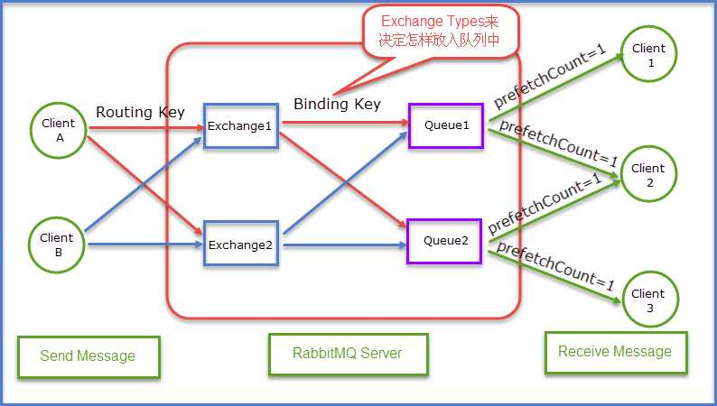
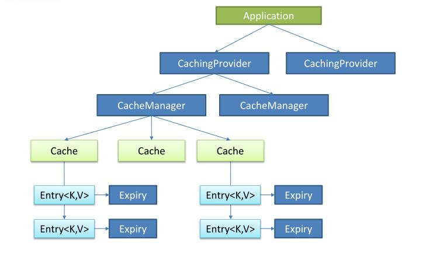

# Docker

## 基础概念

能够把应用程序自动部署到容器的开源引擎，轻量级容器技术！

简化程序：将软件做好配置依赖 --> 编译成镜像 --> 镜像发布 --> 其他使用者就可以直接使用这个镜像。

简化部署：传统做法先安装（包管理工具或者源码包编译），再配置和运行。Docker模式为复制镜像，然后运行。

```java
主机(Host)       ->  安装了Docker程序的机器(Docker直接安装在操作系统之上)
客户端(Client)   ->  命令行
仓库(Registry)   ->  用来保存各种打包好的软件镜像
镜像(Images)     ->  软件打包好的镜像，放在docker仓库中
容器(Container)  ->  运行中的这个镜像称为容器，容器启动是非常快速的！
```
> Ubuntu安装

```shell
$ uname -r                     #内核版本必须是3.10及以上
$ apt-get install docker.io    #安装Docker -(可能存在权限错误,使用时添加 sudo 前缀)
$ service docker status/start  #启动服务和守护进程
$ docker -v                    #检测是否安装成功
$ ln -sf /usr/bin/docker.io /usr/local/bin/docker #创建软连接（方便使用docker命令）
```
```shell
#权限问题：permission denied. Are you trying to connect to a TLS-enabled daemon without TLS?
#注意: 默认情况,执行 docker 都需要运行 sudo 命令. 如何免去 sudo?

$ sudo groupadd docker            #如果还没有 docker group 就添加一个
$ sudo gpasswd -a ${USER} docker  #将用户加入该 group 内.然后退出并重新登录就生效啦
$ sudo service docker restart     #重启 docker 服务
$ newgrp - docker                 #切换当前会话到新 group
```

> CentOS6.9安装

```shell
$ cat /etc/issue    #查看发行版信息：CentOS release 6.9 (Final)
$ cat /proc/version #查看正在运行的内核版本：...Red Hat 4.4.7-18...
$ uname -r          #docker要求内核版本3.10以上

$ yum install docker
$ systemctl start/restart docker
$ docker -v                #docker版本
$ systemctl enable docker  #开机启动
```

```shell
#可能出现问题：Segmentation Fault or Critical Error encountered. Dumping core and aborting.
yum list installed |grep docker #找到安装的docker
yum -y remove docker.x86_64     #然后进行卸载后重新安装
```

## 相关指令

> 状态相关

```shell
service docker status（Start-Stop-Restart）
docker info
```

> 镜像相关

```shell
docker search mysql
docker pull mysql:5.6.7
#docker pull registry.docker-cn.com/library/mysql:5.6.7 ---> 官方加速

docker images [-q]                   #-q: 只显示id
docker rmi [-f] IMAGE_ID
docker rmi $(docker image -q)        #删除所有

docker inspect IMAGE_ID              #相关信息
docker tag IMAGE_ID NEW_NAME:NEW_TAG #拷贝重命名
```

> 容器相关

```shell
docker ps [-a]                    #运行中的容器（-a: 所有）

docker start(SSR) CONTAINER_NAME  #容器的启动，停止，重启
docker rm CONTAINER_NAME          #移除容器（停止状态） rm -> 移除容器; rmi -> 移除镜像！

docker top CONTAINER_NAME         #容器内进程
docker inspect CONTAINER_NAME     #容器相关信息

docker logs [-t] [--tail 10] CONTAINER_NAME    #容器日志(-t: 显示时间, --tail: 最新10条)

#动态的更新一个或多个容器的配置
docker update --restart=always mysql #更新容器mysql的配置，改为开机自启
```

> 互动相关

```shell
docker exec -it CONTAINER_NAME /bin/bash    #进入容器.(exit: 退出)

docker cp CONTAINER_NAME:SRC_PATH DEST_PATH #拷出来
docker cp DEST_PATH CONTAINER_NAME:SRC_PATH #拷进去
```

## 配置容器

```shell
--name #为容器指定一个名称：--name ES01
-d     #后台运行容器，并返回容器ID
-e     #设置环境变量：-e ES_JAVA_OPTS="-Xms256m -Xmx256m"    
-p     #端口映射（宿主机:容器） -p 9200:9200

-it    #配合 exec 使用，开启一个交互模式的终端
-v     #挂载宿主机的目录作为配置文件（宿主机目录:容器目录）：-v /conf/mysql:/etc/mysql/conf.d

--restart #三种重启策略：
          #no：容器退出时，不重启容器
          #on-failure n：重新启动容器的最大次数n
          #always：无论退出状态是如何，都重启容器。如若开机自启时，配置此项
```

> elasticsearch

```shell
#后台启动 elasticsearch，指定内存大小，端口号，及名称，web通信使用 9200，分布式集群的节点间通信使用 9300
docker run --name ES01 -d -e ES_JAVA_OPTS="-Xms256m -Xmx256m" -p 9200:9200 -p 9300:9300 4f7e4c61f09d

#将 IK 插件解压到宿主机，然后配置docker容器加载宿主机 /plugins 目录
docker run --name ES02 -d -e ES_JAVA_OPTS="-Xms256m -Xmx256m" -p 9201:9200 -p 9301:9300 -v /var/tmp/plugins:/usr/share/elasticsearch/plugins 4f7e4c61f09d
```

> tomcat

```shell
#tomcat：最后一个参数是 镜像名:版本号(latest可省)
docker run --name tomcat01 -d -p 9090:8080 tomcat:8.5-jre8-alpine
#-v 将宿主主机目录和容器目录建立映射关系，冒号前为宿主主机目录，冒号后为容器对应目录
docker run --name tomcat -d -p 80:8080 -v /var/lib/cloudService/webapps:/usr/local/tomcat/webapps tomcat
```

> mysql

```shell
#mysql的root密码
docker run --name mysql01 -d -p 33066:3306 -e MYSQL_ROOT_PASSWORD=123456 mysql

#配置mysql参数
docker run --name mysql02 -d -e MYSQL_ROOT_PASSWORD=123456 mysql:tag --character-set-server=utf8mb4 --collation-server=utf8mb4_unicode_ci

#将上述配置参数保存到宿主机文件'/conf/mysql'，启动加载宿主机的配置文件。
#即以后可通过修改宿主机的配置文件来配置mysql
docker run --name mysql02 -d -e MYSQL_ROOT_PASSWORD=123456 mysql:tag -v /conf/mysql:/etc/mysql/conf.d
```

```shell
#对于 mysql-8.0.4 之后版本，不能简单的通过 '-e MYSQL_ROOT_PASSWORD=123456' 来指定root密码
docker exec -it 1457d60b0375  /bin/bash #进入mysql所在docker

mysql -u root -p //进入docker-mysql

ALTER USER 'root'@'%' IDENTIFIED WITH mysql_native_password BY '123456'; #修改root密码

exit #执行两次，依次退出 docker-mysql 和 docker。
```

> redis

```shell
docker run --name redis -d -p 6379:6379 redis
```

> rabbitmq

```shell
#4369：erlang发现；5672：client通信；15672：UI管理界面；25672：server间内部通信    
docker run --name rabbitmq -d -p 5671:5671 -p 5672:5672 -p 4369:4369 -p 15671:15671 -p 15672:15672 -p 25672:25672 -p 15674:15674 rabbitmq
```


## 构建镜像

> commit：通过已有的容器，打包成新的镜像

```shell
#-a：作者相关，-m：描述信息，mysql01：已有容器，skyl/mysql：新镜像
docker commit -a 'skyl' -m 'hello skyl' mysql01 skyl/mysql

#使用新镜像
docker run --name skyl-mysql -d -e MYSQL_ROOT_PASSWORD=123456 mysql
```

> build：从零开始构建，先创建 dockerfile

```shell
#First Dockerfile                ##为注释
FROM ubuntu:14.01                #FROM：基础镜像，必须写在第一行
MAINTAINER skyl 'skyl@qq.com'    #MAI*: 作者相关
RUN apt-get update                
RUN apt-get install -y nginx
EXPOSE 80                        #运行该容器所使用的端口

#build-构建(dockerfile所在目录)
docker build -t 'skyl-nginx' /var/tmp/docker/
```

##常见问题

> 镜像加速

```shell
#aliyun 加速
https://cr.console.aliyun.com/cn-hangzhou/mirrors
```

```shell
#daocloud 加速
#docker pull daocloud.io/library/logstash
https://hub.daocloud.io/
```

```shell
#直接设置 –registry-mirror 参数，仅对当前的命令有效 
docker run hello-world --registry-mirror=https://docker.mirrors.ustc.edu.cn

#修改 /etc/default/docker，加入 DOCKER_OPTS=”镜像地址”，可以有多个
DOCKER_OPTS="--registry-mirror=https://docker.mirrors.ustc.edu.cn"
```

```shell
#支持 systemctl 的系统,通过 sudo systemctl edit docker.service
#会生成 etc/systemd/system/docker.service.d/override.conf 覆盖默认的参数,在该文件中加入如下内容
[Service] 
ExecStart= 
ExecStart=/usr/bin/docker -d -H fd:// --registry-mirror=https://docker.mirrors.ustc.edu.cn

#新版的 Docker 推荐使用 json 配置文件的方式,默认为 /etc/docker/daemon.json
#非默认路径需要修改 dockerd 的 –config-file,在该文件中加入如下内容
{"registry-mirrors": ["https://docker.mirrors.ustc.edu.cn"]}        
```
> 配置http

```shell
#FATA[0010] Error response from daemon: v1 ping attempt failed with error: Get https://registry.docker-cn.com/v1/_ping: dial tcp

#在最新的docker1.3.3中 无法pull，因为默认的是https。在'/etc/default/docker'中追加：
DOCKER_OPTS="--insecure-registry juandapc:5000"
```


# RabbitMQ

常用消息队列中间件：ActiveMQ（√），RabbitMQ（√），Kafka（√），ZeroMq，MetaMQ，RocketMQ

执行速度：Kafka > RabbitMQ > ActiveMQ。安全性则相反。

## 相关概念

> 基础概念

```java
RabbitMQ 是一个由 Erlang 语言开发的 'AMQP' 的开源实现。

'JMS'：Java Message Service，JAVA消息服务。基于JVM消息代理的规范，ActiveMQ、HornetMQ 是 JMS 实现。

'AMQP'：Advanced Message Queue，高级消息队列协议。也是一个消息代理的规范，兼容JMS。
它是应用层协议的一个开放标准，为面向消息的中间件设计，基于此协议的客户端与消息中间件可传递消息，并不受产品、开发语言等条件的限制。
```

>应用场景1：流量削峰（秒杀服务），消息通讯

    服务器接收用户请求后，首先写入消息队列，依次处理。
    
    假如消息队列长度超过最大数量，则直接抛弃用户请求或跳转到错误页面
> 应用场景2：同步变异步，应用耦合

```java
//(1).原始过程：用户下单 到 生成订单，总共花费 60ms，同步过程，强耦合。
用户下单 -> 短信通知(20ms) -> 邮件通知(20ms) -> app通知(20ms) --> 生成订单....

//(2).线程池技术：自己实现线程池，强耦合
用户下单 -> 短信通知(thread) -> 邮件通知(thread) -> app通知(thread) --> 生成订单....

//(3).消息机制：三个消息同时发送。异步，解耦。
用户下单 -> 短信通知(msg) -> 邮件通知(msg) -> app通知(msg) --> 生成订单....
```
```java
@Test
public void sendSms(String mobile) {
    //(1).生成验证码
    String checkCode = RandomStringUtils.randomNumeric(6); //org.apache.commons.lang3

    //(2).存入redis-5分钟失效
    redisTemplate.opsForValue().set("checkCode_" + mobile, checkCode, 5, TimeUnit.MINUTES);

    //(3).发送消息RabbitMQ-短信验证
    JSONObject object = new JSONObject();
    object.put("mobile", mobile);
    object.put("checkCode", checkCode);
    rabbitTemplate.convertAndSend("spring.sms", object);
}
```


> 核心概念

```java
'RabbitMQ Server'：也叫broker server，它是一种传输服务。
维护一条从 Producer 到 Consumer 的路线，保证数据能够按照指定的方式进行传输。
```

```java
'Exchange'：生产者将消息发送到 Exchange（交换器），由 Exchange 将消息路由到一个或多个Queue中（或者丢弃）。

//Exchange 并不存储消息。
//RabbitMQ中的Exchange有 direct（默认）、fanout、topic、headers四种类型，每种类型对应不同的路由规则。
```

```java
'Queue'：消息队列，用于存储消息。消息消费者就是通过订阅队列来获取消息的。

RabbitMQ中的消息都只能存储在Queue中，生产者生产消息并最终投递到Queue中，消费者可以从Queue中获取消息并消费。
多个消费者订阅同一个Queue，消息会被平均分摊给多个消费者进行处理，而不是每个消费者都收到所有的消息并处理。 

//一个消息可投入一个或多个队列。消息一直在队列里面，等待消费者连接到这个队列将其取走
```

```java
'Routing-key'：生产者在将消息发送给Exchange的时候，一般会指定一个 Routing-key，来指定这个消息的路由规则，
而这个 Routing-key 需要与 Exchange-Type 及 Binding-key 联合使用才能最终生效。 

在 Exchange-Type 与 binding-key 固定的情况下，生产者就可以在发送消息给Exchange时，通过指定 Routing-key 来决定消息流向哪里。
RabbitMQ为routing key设定的长度限制为 255 bytes。
```

```java
'Binding-key'：在绑定 Exchange 与 Queue 时，一般会指定一个 Binding-key。
消费者将消息发送给 Exchange 时，一般会指定一个 Routing-key，当 Binding-key 与 Routing-key 相匹配时，消息将会被路由到对应的 Queue 中。

//在绑定多个 Queue 到同一个 Exchange 的时候，这些绑定允许使用相同的binding key。
//Binding-key 并不是在所有情况下都生效，它依赖于 Exchange-Type，
//比如 fanout 类型的Exchange就会无视 Binding-key，而是将消息路由到所有绑定到该 Exchange 的 Queue。
```

> 其他概念

```java
'Connection'：连接，Producer和Consumer都是通过 TCP 连接到RabbitMQ Server的。

//程序的起始处就是建立这个TCP连接。
```

```java
'Channels'：信道，它建立在上述的TCP连接中。

数据流动都是在 Channel 中进行的。也就是说，一般情况是程序起始建立TCP连接，第二步就是建立这个Channel。
```

```java
'VirtualHost'：权限控制的基本单位，一个 VirtualHost 里面有若干 Exchange 和 MessageQueue，以及指定被哪些 user 使用。
```

```java
'Message ACK'：Message acknowledgment，消息回执。

实际应用中，可能发生消费者收到Queue中的消息，但没有处理完成就宕机（或出现其他意外）情况，这种情况下就可能会导致消息丢失。
为了避免这种情况发生，可以要求消费者在消费完消息后发送一个回执给RabbitMQ，RabbitMQ收到消息回执（Message ACK）后才将该消息从Queue中移除；
如果RabbitMQ没有收到回执并检测到消费者的RabbitMQ连接断开，则RabbitMQ会将该消息发送给其他消费者（如果存在多个消费者）进行处理。
这里不存在timeout概念，一个消费者处理消息时间再长也不会导致该消息被发送给其他消费者，除非它的RabbitMQ连接断开。

这里会产生另外一个问题，如果我们的开发人员在处理完业务逻辑后，忘记发送回执给RabbitMQ，这将会导致严重的bug。
Queue中堆积的消息会越来越多；消费者重启后会重复消费这些消息并重复执行业务逻辑…

//另外，pub message是没有 ACK 的。
```

```java
'Message durability'：如果我们希望即使在RabbitMQ服务重启的情况下，也不会丢失消息，我们可以将Queue与Message都设置为可持久化的（durable），这样可以保证绝大部分情况下我们的RabbitMQ消息不会丢失。但依然解决不了小概率丢失事件的发生（比如RabbitMQ服务器已经接收到生产者的消息，但还没来得及持久化该消息时RabbitMQ服务器就断电了）。
如果我们需要对这种小概率事件也要管理起来，那么我们要用到事务。由于这里仅为RabbitMQ的简单介绍，所以这里将不讲解RabbitMQ相关的事务。
```

```java
'Prefetch count'：前面讲到如果有多个消费者同时订阅同一个Queue中的消息，Queue中的消息会被平摊给多个消费者。这时如果每个消息的处理时间不同，就有可能会导致某些消费者一直在忙，而另外一些消费者很快就处理完手头工作并一直空闲的情况。
可以通过设置prefetchCount来限制Queue每次发送给每个消费者的消息数，比如我们设置prefetchCount=1，则Queue每次给每个消费者发送一条消息；消费者处理完这条消息后Queue会再给该消费者发送一条消息。
```

```java

```

```java

```

```java

```

```java

```


> 11个概念

```java
'Message'：消息。由消息头和消息体组成。消息体不透明，而消息头以下可选属性组成
    routing-key   //路由键
    priority      //相对于其他消息的优先权
    delivery-mode //该消息可能需要持久性存储

'Publisher'：消息的生产者。一个向交换器（Exchange）发布消息的客户端应用程序

'Consumer'：消息的消费者。表示一个从消息队列中取得消息的客户端应用程序

'Queue'：消息队列。用来保存消息直到发送给消费者。它是消息的容器，也是消息的终点
    //一个消息可投入一个或多个队列
    //消息一直在队列里面，等待消费者连接到这个队列将其取走

'Exchange'：交换器。用来接收生产者发送的消息，并将该消息路由给服务器中的队列
    Exchange(4种类型)： direct(默认)，fanout，topic， headers(几乎不用)
    //Publisher --> Message --> Exchange --> Queue --> Consumer
    
'Binding'：绑定。用于消息队列和交换器之间的关联
    一个绑定就是基于路由键将交换器和消息队列连接起来的路由规则
    所以，可以将交换器理解成一个由绑定构成的路由表
    //Exchange 和 Queue 的绑定可以是多对多的关系

'Routingkey'：路由键。RabbitMQ 决定消息该投递到哪个队列的规则。队列通过路由键绑定到交换器    
    消息发送到 MQ 服务器时，消息将拥有一个路由键，即便是空的，MQ也会将其和绑定使用的路由键进行匹配
    如果相匹配，消息将会投递到该队列
    如果不匹配，消息将会进入黑洞

'Connection'：链接。RabbitMQ 服务器和服务建立的 TCP 链接

'Channel'：信道。TCP 里面的虚拟链接。
    例如，电缆相当于 TCP，信道是一个独立光纤束，一条 TCP 连接上创建多条信道是没有问题的
    TCP 一旦打开，就会创建 AMQP 信道。
    无论是发布消息，接收消息，订阅队列，这些动作都是通过信道完成的

'VirtualHost'：虚拟主机。表示一批交换器，消息队列和相关对象
    虚拟主机是共享相同的身份认证和加密环境的独立服务器域
    每个 vhost 本质上就是一个 mini 版的 RabbitMQ 服务器，拥有自己的队列，交换器，绑定和权限机制
    vhost 是 AMQP 概念的基础，必须在链接时指定。 //RabbitMQ 默认的 vhost 是/

'Borker'：表示消息队列服务器实体

'prefetch count'：预取计数。用于指定消费者从Queue中每一次预取得消息、执行完城后才能接着去取。
```

>交换器和队列的关系

```java
交换器是通过'路由键'和队列绑定在一起的。路由键可以理解为匹配的规则

如果消息拥有的路由键跟队列和交换器的路由键匹配，那么消息就会被路由到该绑定的队列中

也就是说，消息到队列的过程中，消息首先会经过交换器，接下来交换器在通过路由键匹配分发消息到具体的队列中
```
>RabbitMQ为什么需要信道？ 为什么不是TCP直接通信？

```java
(1).TCP 的创建和销毁开销特别大。创建需要 3 次握手，销毁需要 4 次分手

(2).使用 TCP 链接 Rabbit，高峰时每秒成千上万条链接会造成资源巨大的浪费，而且操作系统每秒处理 TCP 链接数也是有限制的,必定造成性能瓶颈

(3).信道的原理是一条线程一个通道，多条线程多个通道，共用一条 TCP 链接。一条 TCP 链接可以容纳无限的信道，即使每秒成千上万的请求也不会成为性能的瓶颈
```

>消息可靠性：RabbitMQ 是如何保证消息可靠性的呢？`消息持久化，以及消息确认-ACK`

```java
//消息持久化
@param durable    是否持久化，即 rabbitmq 重启是否还存在？ 默认 true
@param autoDelete 当所有绑定队列都不在使用时，是否自动删除交换器？ 默认 false
```

```java
//什么是消息确认ACK？
如果消费者服务器在处理消息的过程中出现异常，那这条正在处理的消息就没有完成销费，数据就会丢失。
为确保数据不会丢失，RabbitMQ 支持消息确认ACK（默认开启）。

//ACK的消息确认机制
消费者处理完消息后反馈给 RabbitMQ，RabbitMQ 收到反馈后才将消息从队列中删除。

(1)对于单个消费者，消费出现异常，则不会有 ACK-反馈。RMQ认为此消息没有正常消费，则会将消息'重新放入队列'。
(2)对于集群消费者，单个消费（物理节点）出现异常，RMQ会立即将消息推送给其他节点的消费者，保证消息不会丢失。
(3)/** ACK-确认机制默认开启。没有收到ACK，则消息永远不会从 RabbitMQ 删除。*/
```

```java
//ACK机制注意
如果忘了 ACK，后果很严重。当消费者退出后，消息会一直重新分发，然后 RabbitMQ 内存也越来越大。长时间运行就会导致'内存泄露'。解决方案：

(1).消息消费端。添加 try-catch 异常捕获
(2).添加配置。开启异常重试，添加最大重试次数，默认3

spring.rabbitmq.listener.simple.retry.enabled=true
spring.rabbitmq.listener.simple.retry.max-attempts=3
```

## 安装配置

> docker启动

```shell
#4369：erlang发现；5672：client通信；15672：UI管理界面；25672：server间内部通信    
docker run --name rabbitmq -d -p 5671:5671 -p 5672:5672 -p 4369:4369 -p 15671:15671 -p 15672:15672 \
-p 25672:25672 -p 15674:15674 rabbitmq

#开启 UI管理页面
docker exec -it rabbitmq /bin/bash
rabbitmq-plugins enable rabbitmq_management

#登陆UI，默认用户名 密码都是: guest
http://localhost:15672/
```

```shell
#docker 里的 RabbitMQ 相关目录
docker exec -it rabbitmq /bin/bash

配置文件目录：/etc/rabbitmq
数据存储目录：/var/lib/rabbitmq
日志目录：/var/log/rabbitmq
```

> 添加用户

```shell
#获得容器的bash
docker exec -it rabbitmq /bin/bash

#查看已有用户
rabbitmqctl list_users

#添加用户
rabbitmqctl add_user admin 123456

#赋权，访问vhost的权限
rabbitmqctl set_permissions -p "/" admin ".*" ".*" ".*"

#查看是否成功赋予vhost权限
rabbitmqctl list_permissions -p /

#赋予 administrator 权限
rabbitmqctl set_user_tags admin administrator
```

> 开启插件 & 配置权限：js连接RabbitMq通过stomp实现消息实时推送

```shell
#获得容器的bash
docker exec -it rabbitmq /bin/bash

#查看已启动了哪些RabbitMQ插件
rabbitmq-plugins list

#开启 rabbitmq 的图形化界面
rabbitmq-plugins enable rabbitmq_management

#手动开启 MQTT 插件
rabbitmq-plugins enable rabbitmq_mqtt

#手动开启 STOMP 有关的一系列插件
rabbitmq-plugins enable rabbitmq_management rabbitmq_web_stomp rabbitmq_stomp rabbitmq_web_stomp_examples

#重启RabbitMQ（可选）
docker restart rabbitmq

#打开 RabbitMq的主页 OverView，会发现 Ports and contexts 多了2个端
http/web-stomp  ::  15674
stomp           ::  61613

#赋予 guest 用户远程登录权限
#（1）对于低版本，修改docker里的 /etc/rabbitmq/rabbitmq.config
[
        { rabbit, [
                { loopback_users, ["guest"] }, #增加"guest"用户
                { tcp_listeners, [ 5672 ] },
                { ssl_listeners, [ ] },
                { hipe_compile, false }
        ] },
        { rabbitmq_management, [ { listener, [
                { port, 15672 },
                { ssl, false }
        ] } ] }
].
#（2）对于高版本，修改 /etc/rabbitmq/rabbitmq.conf
loopback_users.guest = false #false：远程访问；true：本地访问
```


##BOOT整合

>基础配置

```xml
<dependency>
    <groupId>org.springframework.boot</groupId>
    <artifactId>spring-boot-starter-amqp</artifactId>
</dependency>
```

```properties
#rabbitmq
spring.rabbitmq.host=192.168.5.23
spring.rabbitmq.port=5672
spring.rabbitmq.username=guest //默认，可省
spring.rabbitmq.password=guest
```

```java
//全局注解   + 监听注解
@EnableRabbit + @RabbitListener
```
>序列化器：默认以java序列化，现配置json序列化

```java
@Configuration
public class AMQPConfig {
    @Bean
    public MessageConverter messageConverter() {
        return new Jackson2JsonMessageConverter(); 
    }
}
```
> 队列相关属性

```java
Map<String, Object> args = new HashMap<>();
//控制queue被自动删除前可以处于未使用状态的时间。单位毫秒，不能为0
//队列中就算有还未消费的msg，也会删除。服务器启动后，持久化的queue的超时时间将重新计算。
//未使用：queue上没有任何consumer, queue 没有被重新声明，并且在过期时间段内为调用过 basic.get 命令
//常用于：RPC-style 的回复 queue,其中许多queue会被创建出来，但是却从未被使用
args.put("x-expires", 10 * 60 * 1000);

//queue中 msg 被丢弃前能够存活的时间，对于已发送给 consumer 的 msg 不失效，单位毫秒，可以为0
//设为0，则表示 msg 在到达 queue 之后，但尚未被立即投递到 consumer 的情况下，判定为过期
//注意：当一个 msg 被路由到多个queue中时，其可以在不同的时间死掉，或者出现有的queue中 msg 不死掉的情况
args.put("x-message-ttl", 60 * 1000);

//队列最大长度，超过最大长度后面的消息会顶替前面的消息
args.put("x-max-length", 5);

//队列最大容量，作用同上，但这个是靠队列大小（bytes）来达到限制
args.put("x-max-length-bytes", 5);

//声明优先级队列。该参数应该是一个整数，表示队列应该支持的最大优先级
//建议使用1到10之间。目前使用更多的优先级将消耗更多的资源（Erlang进程）
//设置该参数同时设置死信队列时，或造成已过期的低优先级消息会在未过期的高优先级消息后面执行。 
//该参数会造成额外的CPU消耗。
args.put("x-max-priority", 5);

//先将消息保存到磁盘上，不放在内存中，当消费者开始消费的时候才加载到内存中
//取值范围：default 和 lazy
args.put("x-queue-mode", "lazy");

//延迟结束后指向交换机（死信收容交换机）
args.put("x-dead-letter-exchange", "exchange.dead");
//延迟结束后指向队列（死信收容队列），可直接设置queue name也可以设置routing-key
args.put("x-dead-letter-routing-key", "queue.dead");
amqpAdmin.declareQueue(new Queue("queue.args", true, false, false, args)); //创建queue
```

>代码创建和删除，及发送消息

```java
/**
 * @param name       队列名称
 * @param durable    是否持久化，即 rabbitmq 重启是否还存在？ 默认 true
 * @param exclusive  是否排外及私有private。
 *                   true：私有队列，其他通道channel不能访问，强制访问抛异常。并且该channel的conn断开后，队列将自动删除
 *                         包括里面的msg，默认 false
 *                   false：非排外及私有，可以使用两个消费者同时访问同一个队列，没有任何问题，
 * @param autoDelete 当所有消费客户端连接断开后，是否自动删除队列？ 默认 false
 */
Map<String, Object> args = new HashMap<>();
args.put("x-max-length", 5); //队列长度
args.put("x-expires", 30*60*1000); //queue自动过期，30min
amqpAdmin.declareQueue(new Queue("queue.direct.0", true, false, false, args)); //创建

amqpAdmin.deleteQueue("queue.admin.0"); //移除

/**
 * @param name 交换器名称
 * @param durable 是否持久化，即 rabbitmq 重启是否还存在？ 默认 true
 * @param autoDelete 当所有绑定队列都不在使用时，是否自动删除交换器。默认 false
 */
amqpAdmin.declareExchange(new FanoutExchange("exchange.admin", true, true)); //交换器

/**
 * @param destination 目的地，队列名
 * @param destinationType 目的地类型（可选值 QUEUE,EXCHANGE）
 * @param exchange 交换器
 * @param routingKey 路由键
 * @param arguments null
 */
amqpAdmin.declareBinding(new Binding("queue.admin.0", Binding.DestinationType.QUEUE,
        "exchange.admin", "admin.#", null)); //绑定（通道，交换器，路由键）
```
```java
//msg需要自己构造，自定义消息头和消息体
rabbitTemplate.send("exchange", "routing key", new Message("".getBytes(), null));

//只需传入要发送的对象 obj；系统自动将其当成消息体，并自动序列化
rabbitTemplate.convertAndSend("exchange", "routing key", new Object());
```

> 三种模式的区别

- fanout（广播）：Queue 只要连上 Exchange，就能收到其中的 Msg


- direct（直接）：`Queue 不仅要连上 Exchange，并且 E Q 之间 Binding 的 RK 还必须和 Msg 的 RK 完全一致`


- topic（主题）：... ... Binding 的 RK 和 Msg 的 RK 模糊匹配即可

## 广播：fanout


>广播模式（fanout）：多对多，发送到 E 的消息都会被转发到与该 E 绑定的所有 Q 上。`不处理 RK`

```java
0.很像子网广播，每台子网内的主机都获得了一份复制的消息。Fanout交换机转发消息是最快的。 

1.可以理解为路由表的模式，这种模式不需要RouteKey

2./*这种模式需要提前将 Exchange 与 Queue 进行绑定*/，一个Exchange可以绑定多个Queue，一个Queue可以同多个Exchange进行绑定。

3.如果接受到消息的Exchange没有与任何Queue绑定，则消息会被抛弃。
```

> 生产者：直接发送 Msg 到 Exchange，不指定 RK

```properties
spring.rabbitmq.host=192.168.5.23
spring.rabbitmq.port=8672
spring.rabbitmq.username=guest
spring.rabbitmq.password=guest

mq.config.exchange=log.fanout
```

```java
@Autowired
AmqpTemplate amqpTemplate;

@Value("${mq.config.exchange}")
String exchange;

public void sendFanout(String msg) {
    //
    /**
     * @param exchange    交换器
     * @param routingKey  路由键：不处理，E直接与Q绑定，多对多
     * @param object      消息对象
     */
    amqpTemplate.convertAndSend(exchange, "", msg);
}
```

```java
@Autowired
Publisher publisher;

@Test
public void sendFanout() {
    for (int i = 0; i < 10; i++) {
        String msg = "log_info_" + i;
        publisher.sendFanout(msg);
    }
}
```

> 消费者：将 Exchange 分别和两个队列 Queue 进行绑定

```properties
spring.rabbitmq.host=192.168.5.23
spring.rabbitmq.port=8672
spring.rabbitmq.username=guest
spring.rabbitmq.password=guest

spring.rabbitmq.listener.simple.retry.max-attempts=3
spring.rabbitmq.listener.simple.retry.enabled=true

mq.config.exchange=log.fanout

mq.config.queue.info=log.info
mq.config.queue.error=log.error
```

```java
@Component
/**
 * @RabbitListener - bindings: 绑定队列
 * @QueueBinding - value: 绑定队列的名称；exchange: 配置交换器；key: RoutingKey
 *
 * @Queue - value: 队列名称；autoDelete: 当所有消费客户端连接断开后，是否自动删除队列
 *
 * @Exchange - value: 交换器名称；type: 交换器类型；autoDelete: 当所有绑定队列都不在使用时，是否自动删除交换器
 */
//durable: 默认将消息存储在内存中，若rabbitMQ宕机，那么所有数据就会丢失，所以在声明队列的时候可以声明将数据持久化。
//但是如果已经声明了一个未持久化的队列，那么不能修改，只能将这个队列删除或重新声明一个持久化数据
@RabbitListener(
        bindings = {
                @QueueBinding(
                        value = @Queue(value = "${mq.config.queue.info}", autoDelete = "false", durable = "false"),
                        exchange = @Exchange(value = "${mq.config.exchange}", type = ExchangeTypes.FANOUT,
                                autoDelete = "false"),
                        key = "" //fanout模式不处理RK，直接将 Q 与 E 绑定
                )
                /*, @QueueBinding()*/ //也可以实现：一个Queue绑定多个Exchange
        }
)
public class InfoConsumer {

    @RabbitHandler //接收消息的方法。采用消息队列监听机制
    public void recv(String msg) {
        System.out.println(LocalTime.now() + " INFO: " + msg);
    }
}
```

```java
@Component
@RabbitListener(
        bindings = {
                @QueueBinding(
                        value = @Queue(value = "${mq.config.queue.error}", autoDelete = "false", durable = "false"),
                        exchange = @Exchange(value = "${mq.config.exchange}", type = ExchangeTypes.FANOUT),
                        key = "" //fanout模式不处理RK，直接将 Q 与 E 绑定
                )
                /*, @QueueBinding()*/ //也可以实现：一个Queue绑定多个Exchange
        }
)
public class ErrorConsumer {

    @RabbitHandler
    public void recv(String msg) {
        System.out.println(LocalTime.now() + " ERROR: " + msg);
    }
}
```

## 直接：direct


> 直接模式（direct）：一对一，`任何发送到Direct Exchange的消息，都会被转发到Routing Key中指定的 Queue`。

需要将 Queue 绑定到 Exchange 上，要求该消息与 Routing Key完全匹配。如果一个队列绑定到该交换机上要求路由键 “dog”，则只有被标记为“dog”的消息才被转发，不会转发dog.puppy，也不会转发dog.guard，只会转发dog。 

```
1.这种模式，可以自定义 Exchange，也可以使用自带的”"（该Exchange的名字为空字符串，下文称其为 Default Exchange）

2.这种模式下不需要将Exchange进行任何绑定(binding)操作

3.消息传递时需要一个“RouteKey”，可以简单的理解为要发送到的队列名字

4.如果vhost中不存在RouteKey中指定的队列名，则该消息会被抛弃
```

> 生产者：发送 Msg 到 Exchange，并指定 Routing Key

```properties
mq.config.exchange=log.direct

mq.config.queue.info.routing.key=log.info.routing.key
mq.config.queue.error.routing.key=log.error.routing.key
```

```java
@Component
public class Publisher {

    @Autowired
    AmqpTemplate amqpTemplate;

    @Value("${mq.config.exchange}")
    String exchange;

    @Value("${mq.config.queue.info.routing.key}")
    String infoRoutingKey;

    @Value("${mq.config.queue.error.routing.key}")
    String errorRoutingKey;

    public void sendDirect(String msg) {
        /**
         * @param exchange     交换器，可以使用默认的Exchange，即""
         * @param routingKey   路由键
         * @param object       消息对象
         */
        amqpTemplate.convertAndSend(exchange, infoRoutingKey, msg);
    }
}
```

```java
@Test
public void sendDirect() {
    for (int i = 0; i < 10; i++) {
        String msg = "log_info_" + i;
        publisher.sendDirect(msg);
    }
}
```

> 消费者：根据 RK 找到`完全匹配`的 Queue

```properties
mq.config.exchange=log.direct

mq.config.queue.info=log.info
mq.config.queue.error=log.error

mq.config.queue.info.routing.key=log.info.routing.key
mq.config.queue.error.routing.key=log.error.routing.key
```

```java
@Component
@RabbitListener(
        bindings = {
                @QueueBinding(
                        value = @Queue(value = "${mq.config.queue.info}", autoDelete = "false", durable = "false"),
                        exchange = @Exchange(value = "${mq.config.exchange}", type = ExchangeTypes.DIRECT),
                        key = "${mq.config.queue.info.routing.key}" //Queue 通过 RK 与 Exchange 绑定
                )
        }
)
public class InfoConsumer {

    @RabbitHandler
    public void recv(String msg) {
        System.out.println(LocalTime.now() + " INFO: " + msg);
    }
}
```

## 主题：topic


> Topic：多对多，任何发送到 Topic Exchange 的消息都会被转发到所有关心 Routing Key 中指定话题的Queue上。

```
1.每个队列都有其关心的主题，所有的消息都带有一个标题（RouteKey），Exchange会将消息转发到所有关注主题能与RouteKey模糊匹配的队列。

2.这种模式需要RouteKey，也许要提前绑定Exchange与Queue。

3.在进行绑定时，要提供一个该队列关心的主题，如“#.log.#”表示该队列关心所有涉及log的消息(一个RouteKey为”MQ.log.error”的消息会被转发到该队列)。

4.“#”表示0个或若干个关键词，“*”表示一个关键词。如“log.*”能与“log.warn”匹配，无法与“log.warn.timeout”匹配；但是“log.#”能与上述两者匹配。

5.同样，如果Exchange没有发现能够与RouteKey匹配的Queue，则会抛弃此消息。
```

> 生产者：发送 Msg 到 Exchange，并指定 Routing Key

```properties
mq.config.exchange=log.topic

mq.config.queue.info.routing.key=log.info.routing.key
mq.config.queue.error.routing.key=log.error.routing.key
```

```java
@Component
public class Publisher {

    @Autowired
    AmqpTemplate amqpTemplate;

    @Value("${mq.config.exchange}")
    String exchange;

    @Value("${mq.config.queue.info.routing.key}")
    String infoRoutingKey;

    @Value("${mq.config.queue.error.routing.key}")
    String errorRoutingKey;

    public void sendTopicInfo(String msg) {
        amqpTemplate.convertAndSend(exchange, infoRoutingKey, msg);
    }

    public void sendTopicError(String msg) {
        amqpTemplate.convertAndSend(exchange, errorRoutingKey, msg);
    }
}
```

```java
@Test
public void sendTopic() {
    for (int i = 0; i < 10; i++) {
        String msg = "log_info_" + i;
        publisher.sendTopicInfo(msg + "_info");
        publisher.sendTopicError(msg + "_error");
    }
}
```

> 生产者：根据 RK 找到`模糊匹配`的 Queue

```properties
mq.config.exchange=log.topic

mq.config.queue.info=log.info
mq.config.queue.error=log.error
mq.config.queue.all=log.all

mq.config.queue.info.routing.key=log.info.routing.key
mq.config.queue.error.routing.key=log.error.routing.key
mq.config.queue.all.routing.key=log.*.routing.key
```

```java
@Component
@RabbitListener(
        bindings = {
                @QueueBinding(
                        value = @Queue(value = "${mq.config.queue.all}", autoDelete = "false", durable = "false"),
                        exchange = @Exchange(value = "${mq.config.exchange}", type = ExchangeTypes.TOPIC),
                        key = "${mq.config.queue.all.routing.key}"
                )
        }
)
public class AllConsumer {

    @RabbitHandler
    public void recv(String msg) {
        System.out.println(LocalTime.now() + " ALL: " + msg);
    }
}
```

```java
@Component
@RabbitListener(
        bindings = {
                @QueueBinding(
                        value = @Queue(value = "${mq.config.queue.info}", autoDelete = "false", durable = "false"),
                        exchange = @Exchange(value = "${mq.config.exchange}", type = ExchangeTypes.TOPIC),
                        key = "${mq.config.queue.info.routing.key}"
                )
        }
)
public class InfoConsumer {

    @RabbitHandler
    public void recv(String msg) {
        System.out.println(LocalTime.now() + " INFO: " + msg);
    }
}
```


# EHCache

##BOOT整合

> 纯java的进程内缓存框架！快速，精干

```xml
<dependency>
    <groupId>org.springframework.boot</groupId>
    <artifactId>spring-boot-starter-cache</artifactId>
</dependency>
<dependency>
    <groupId>net.sf.ehcache</groupId>
    <artifactId>ehcache</artifactId>
</dependency>
```
```properties
#缓存类型，如用redis改为redis
spring.cache.type=ehcache
#存放'/resources'目录下
spring.cache.ehcache.config=classpath:ehcache.xml
```
>ehcahe.xml

```xml
<ehcache xmlns:xsi="http://www.w3.org/2001/XMLSchema-instance"
    xsi:noNamespaceSchemaLocation="ehcache.xsd"
    updateCheck="true" monitoring="autodetect" dynamicConfig="true">

    <diskStore path="java.io.tmpdir/ehcache" />
    
    <!-- 的默认缓存策略 -->
    <defaultCache
        eternal="false" <!--是否永不过期？ 默认false。true则属性 timeTo* 将不起作用 -->
        timeToIdleSeconds="120" <!--缓存最大闲置时间. 0无限.-->
        timeToLiveSeconds="120" <!--........存活.........-->
        
        maxEntriesLocalHeap="100" <!--内存缓存最大个数. 0无限. 过时属性 maxElementsInMemory-->
        maxEntriesLocalDisk="100" <!--磁盘.......................... maxElementsOnDisk-->
        
        <!--磁盘缓存相关-->
        overflowToDisk="true" <!--内存中缓存过量是否输出到磁盘?? 默认true-->
        diskSpoolBufferSizeMB="30" <!--写入磁盘时IO缓冲区大小. 默认30MB. 每个Cache一个缓冲区-->
        diskExpiryThreadIntervalSeconds="120" <!--磁盘缓存清理线程的运行间隔. 默认120s.-->
        diskPersistent="false" <!--磁盘缓存在jvm重启后是否保持. 默认为false-->
        
        memoryStoreEvictionPolicy="LRU"> <!--内存中缓存过量后的移除策略. 默认 LRU(最近最少使用)-->
        
        <persistence strategy="localTempSwap" />
    </defaultCache>
    
    <!-- 自定义缓存策略 -->
    <cache
        name="system_set"
        eternal="false"
        timeToLiveSeconds="300"
        maxEntriesLocalHeap="2"
        overflowToDisk="true"
        maxEntriesLocalDisk="5">
    </cache>
</ehcache>
```
>配置说明

```java
diskStore: 过量缓存输出到磁盘的存储路径.
    //默认 path="java.io.tmpdir".
    //windows-> "C:\Users\当前用户\AppData\Local\Temp\"; linux-> "/tmp"
    //缓存文件名为缓存name, 后缀为data. 如: C:\Users\当前用户\AppData\Local\Temp\system_set.data

当 maxEntriesLocalHeap 过量时,两种情况: 
    //overflowToDisk=true  --> 过量缓存输出磁盘. 
    //overflowToDisk=false --> 则按照 memoryStoreEvictionPolicy 从内存中移除缓存
    
clearOnFlush: 调用 flush() 方法时,是否清空内存缓存??? 默认true.
    //设为true, 则系统在初始化时会在磁盘中查找 CacheName.index 缓存文件, 如 system_set.index. 找到后将其加载到内存.
    //注意: 在使用 net.sf.ehcache.Cache 的 void put (Element element) 方法后要使用 void flush() 方法
```
##测试DEMO

> javaBean

```java
@Data
public class Student implements Serializable { //对于磁盘缓存，必须'序列化'
    private  int id;
    private String name;
}
```
>Service

```java
@Service
public class HelloServiceImpl implements HelloService {

    @Override
    @Cacheable(value = "student") //开启缓存，配合全局注解 @EnableCaching
    public Student selStudentById(int id) {
        return helloMapper.selStudentById(id);
    }
}
```
>单元测试

```java
@RunWith(SpringRunner.class)
@SpringBootTest
public class ApplicationTests {
    @Autowired
    HelloService helloService;

    @Test
    public void test() {
        System.out.println(helloService.selStudentById(3));
        System.out.println(helloService.selStudentById(3)); //从日志看出，第二次不再查库
    }
}
```
#Redis

## docker模式

>docker模式安装的redis没有配置文件

```shell
#需要通过 -v 指令将宿主机配置文件进行映射
docker run --name redis -d -p 6379:6379 redis

#下载默认配置
wget https://raw.githubusercontent.com/antirez/redis/4.0/redis.conf -O conf/redis.conf

#挂载宿主机的配置
docker run --name redis -d -p 6379:6379 -v /var/tmp/docker/redis.conf:/etc/redis/redis.conf \
      -v /var/tmp/docker/data:/data redis redis-server /etc/redis/redis.conf --appendonly yes

#-v /var/tmp/docker/redis.conf:/etc/redis/redis.conf --> 文件映射，将宿主机的配置文件复制到docker中
#-v /var/tmp/docker/data:/data        --> 容器映射/data
#redis-server /etc/redis/redis.conf   --> redis启动时，加载配置文件（/etc/redis/redis.conf），默认不加载
#--appendonly yes                     --> 开启redis持久化
```

>

```shell

```

##安装包模式

> 下载安装

```shell
$ wget http://download.redis.io/releases/redis-2.8.17.tar.gz
$ tar -zxvf redis-2.8.17.tar.gz
$ cd redis-2.8.17
$ make #make 编译完后会生成 src/redis-server 和 src/redis-cli，服务端和客户端
```

> 启动服务端的两种方式

```shell
$ ./src/redis-server  #读取默认配置，启动
$ ./src/redis-server redis.conf  #读取自定义配置，启动
```

> 配置后台启动：redis.conf

```shell
daemonize no -改为-> daemonize yes
```

>开机自启：vim /etc/rc.local 

```
添加：/usr/local/redis/bin/redis-server /usr/local/redis/etc/redis.conf （意思就是开机调用这段启动redis的命令）
```

> 检测启动状态

```shell
$ ps -ef | grep redis
$ lsof -i:6379
$ netstat -anp | grep redis

$ pkill redis    #停止redis
```

> 卸载redis

```shell
$ rm -rf /usr/local/redis            #删除安装目录
$ rm -rf /usr/bin/redis-*            #删除所有redis相关命令脚本
$ rm -rf /root/download/redis-4.0.4  #删除redis解压文件夹
```

> 启动redis客户端

```shell
$ ./src/redis-cli    #另起客户端命令行，以此命令启动redis客户端
```
## 相关配置

> 查找配置文件位置

```shell
使用命令'whereis redis'，查找redis的安装路径，编辑文件 redis.conf
```

> 账号密码

```shell
#默认，访问Redis服务器是不需要密码的。配置密码为：redis
#取消 requirepass 这一行的注释,或者新增一行
requirepass redis
```

>配置Redis服务器可以远程访问

```shell
#默认，Redis服务器不允许远程访问，只允许本机访问
bind 127.0.0.1 #注释此行
sudo /etc/init.d/redis-server restart #重启redis
```

## BOOT整合

> 配置文件

```xml
<dependency>
    <groupId>org.springframework.boot</groupId>
    <artifactId>spring-boot-starter-data-redis</artifactId>
</dependency>
```
```properties
spring.cache.type=redis
spring.redis.host=192.168.5.25
#spring.redis.password=redis #docker版没有配置文件，所以没有密码
spring.redis.jedis.pool.max-idle=10
spring.redis.jedis.pool.min-idle=5
spring.redis.jedis.pool.max-active=20
spring.redis.jedis.pool.max-wait=-1ms
```
> json序列化

```java
@Configuration
public class RedisConfig {
    //对于显示操作生效
    @Bean
    public RedisTemplate<Object, Object> redisTemplate(RedisConnectionFactory factory) {
        RedisTemplate<Object, Object> template = new RedisTemplate<>();
        template.setConnectionFactory(factory);

        StringRedisSerializer stringRedisSerializer = new StringRedisSerializer();
        template.setKeySerializer(stringRedisSerializer); //序列化-key

        GenericJackson2JsonRedisSerializer redisSerializer = new GenericJackson2JsonRedisSerializer(); //方式1

        // Jackson2JsonRedisSerializer<Object> redisSerializer = new Jackson2JsonRedisSerializer<>(Object.class); //方式2
        // ObjectMapper om = new ObjectMapper();
        // om.setVisibility(PropertyAccessor.ALL, JsonAutoDetect.Visibility.ANY);
        // om.enableDefaultTyping(ObjectMapper.DefaultTyping.NON_FINAL);
        // redisSerializer.setObjectMapper(om);

        template.setValueSerializer(redisSerializer); //序列化-value
        template.setHashValueSerializer(redisSerializer); //序列化-value hashmap

        return template;
    }

    //对于注解生效，如 @Cacheable
    @Bean
    public RedisCacheConfiguration redisCacheConfiguration() {
        GenericJackson2JsonRedisSerializer redisSerializer = new GenericJackson2JsonRedisSerializer(); //方式1

        // Jackson2JsonRedisSerializer<Object> redisSerializer = new Jackson2JsonRedisSerializer<>(Object.class); //方式2
        // ObjectMapper om = new ObjectMapper();
        // om.setVisibility(PropertyAccessor.ALL, JsonAutoDetect.Visibility.ANY);
        // om.enableDefaultTyping(ObjectMapper.DefaultTyping.NON_FINAL);
        // redisSerializer.setObjectMapper(om);

        RedisCacheConfiguration redisCacheConfiguration = RedisCacheConfiguration.defaultCacheConfig();
        redisCacheConfiguration = redisCacheConfiguration.serializeValuesWith(
                RedisSerializationContext.SerializationPair.fromSerializer(redisSerializer)
        ).entryTtl(Duration.ofMinutes(30));
        return redisCacheConfiguration;
    }
}
```

> 两种序列化方式？

```java
//GenericJackson2JsonRedisSerializer 和 Jackson2JsonRedisSerializer
(1).G* 比 J* 效率低，占用内存高

(2).G* 序列化时，会保存对象的全类名，即'@class'。反序列化时以此标识就可以反序列化成指定的对象。如下所示

{ //redis中数据
  "@class": "com.example.spring.bean.Student",
  "id": 6,
  "name": "张四",
  "teacher": null
}
```


>`神坑1：类型转换异常`

```java
//java.lang.Integer cannot be cast to java.lang.Long

@Test
public void test() {
    redisTemplate.opsForValue().set("long", 2L);
    
    // Long l = (Long) redisTemplate.opsForValue().get("long"); //类型转换异常
    Long l = Long.valueOf(redisTemplate.opsForValue().get("long").toString()); //常用作法
    System.out.println("long: " + l);
}
```
>显示操作的常用方法

```java
redisTemplate.opsForValue().set("test", "100", 60 * 10, TimeUnit.SECONDS); //向redis里存入数据和设置缓存时间
redisTemplate.opsForValue().get("test"); //根据key获取缓存中的val

redisTemplate.boundValueOps("test").increment(-1); //val做-1操作
redisTemplate.boundValueOps("test").increment(1); //val +1

redisTemplate.expire("test", 1000, TimeUnit.MILLISECONDS); //设置过期时间
redisTemplate.getExpire("test"); //根据key获取过期时间
redisTemplate.getExpire("test", TimeUnit.SECONDS); //根据key获取过期时间并换算成指定单位

redisTemplate.hasKey("test"); //检查key是否存在，返回boolean值
redisTemplate.delete("test"); //根据key删除缓存

redisTemplate.opsForSet().add("red_123", "1", "2", "3"); //向指定key中存放set集合
redisTemplate.opsForSet().isMember("red_123", "1"); //根据key查看集合中是否存在指定数据
redisTemplate.opsForSet().members("red_123");//根据key获取set集合
```


>注解版：SpringCache

```java
@Override
@Cacheable(value = "student", key = "'id-' + #p0")
public Student findById(int id) {
    return helloMapper.findById(id);
}
```
```java
@Test
public void test() {
    System.out.println(helloService.findById(2)); //必须: Student implements Serializable
    System.out.println(helloService.findById(2)); //第二次不读库
}
```


# SpringCache

##基础概念

>应用场景。`相比于 Redis 的缺点为：不能设置过期时间`

    高频热点数据 -> 频繁访问数据库，数据库压力过大
    
    临时性的数据 -> 手机号发送的验证码，三分钟有效，过期删掉
>Java缓存规范：JSR107

```java
Java Caching 定义了5个核心接口：CachingProvider，CacheManager，Cache，Entry 和 Expiry
//其中，CachingProvider，CacheManager，Cache，Entry：都是一对多的关系！
```
```java
'CachingProvider'（类比数据库）：定义创建，配置，获取，管理和控制多个 CacheManager。
//一个应用在运行期访问多个 CachingProvider。
```
```java
'CacheManager'（数据表）：定义创建，配置，获取，管理和控制多个唯一命名的Cache。这些 Cache 存在于 CacheManager 的上下文中。
//CachingProvider 与 CacheManager 是一对多的关系。
```
```java
'Cache'（数据行）：一个类似Map的数据结构，并临时存储以Key为索引的值。
//CacheManager 与 Cache 是一对多的关系。
```
```java
'Entry'（数据字段）：一个存储在Cache中的 key-value 对。
//Cache 与 Entry 是一对多的关系。
```
```java
'Expiry'：每一个存储在 Cache 中的条目有一个定义的有效期。一旦过期，条目将不可访问，更新和删除。缓存有效期可以通过 ExpiryPolicy 设置。
```
>相关概念

```java
'cacheManager/cacheResolver'：缓存管理器，默认使用 ConcurrentMapCacheManager
```

```java
'cache'：CacheManager管理多个Cache对象，对缓存的真正CRUD操作是基于Cache对象的。默认使用 ConcurrentMapCache
//每个Cache对象都有唯一一个名字。
```





## 常用注解

> @EnableCaching：全局注解。系统默认缓存为：ConcurrentMapCacheManager

```xml
<dependency>
    <groupId>org.springframework.boot</groupId>
    <artifactId>spring-boot-starter-cache</artifactId>
</dependency>
```
> @Cacheable：开启缓存，标注在（类/方法）上。根据方法的请求参数对其结果进行缓存。`适用于查询`

```java
//工作流程
(0).目标方法调用之前，先检查缓存，有则返回；无则查库，并将结果放入缓存
(1).检查缓存时，先根据 value/cacheNames 找到对应的Cache对象
(2).再根据 key 从Cache对象（ConcurrentMapCache<K,V>）中取出对应的缓存值
```

```java
//value/cacheNames：缓存名称，必须指定。数组形式，表示缓存到多个 Cache 中。如：value = {"people","emp"}
//key：用来指定存储缓存时使用的key，默认使用方法参数对应的值（支持SpringEL表达式）。

@Cacheable(value = "people", key = "#person.id") //自定义key: person.id
public Person getOneById(Person person) {
    return personMapper.getOneById(person.id);
}
```
> @CacheEvict：清空缓存。`适用于添加，删除`

```java
//value：缓存名字，同上
//allEntries：是否清空对应 value 中的所有缓存，默认 false
//beforeInvocation：清空动作是否在方法调用之前，默认 false，即方法调用出错，则缓存不会清空

@CacheEvict(value = "people"/*, allEntries = true*/) //默认key为方法参数值
public int deleteOneById(int id) {
    return personMapper.deleteOneById(id);
}
```

> @CachePut：既调用方法，又更新缓存。`适用于更新`

```java
//此时若不指定 @CachePut 的value和key，则不能更新 @Cacheable 的缓存。即查询到的仍旧是更新前的数据
//这是因为默认的 key 为方法参数对应的值，即 @CachePut 是以 Person对象 作为缓存的key

//也可以这样指定：@CachePut(value = "people", key = "#result.id")
//但是，@Cacheable 则不可以!!!! 
//因为后者 #result.id 是在方法调用之前取值，为null，报错

@CachePut(value = "people", key = "#person.id")
public void updateOneById(Person person) {
    personMapper.updateOneById(person);
}
```
> @Caching：复杂场景使用的组合注解

```java
//方法调用后，将结果保存到三组缓存中： people:<name,VALUE>; people:<id,VALUE>; emp:<id,VALUE>;

//此时，根据 value = "people" 的 id 查找，直接从缓存读取。
//但是，根据 value = "people" 的 name 查找，则会调用方法。这是因为组合注解中包含 put 的缘故！

@Caching(
    cacheable = {
        @Cacheable(value = "people", key = "#result.name")
    },
    put = {
        @CachePut(value = "people", key = "#result.id"),
        @CachePut(value = "emp", key = "@result.id")
    }
)
public int getOneByName(String name) {
    return personMapper.deleteOneById(1);
}
```
> @CacheConfig：类注解，用于抽取当前类中所有缓存的共同属性。类比于 @RequestMapping

```java
//与全局配置不一致的方法，可单独的显示配置 cacheNames 属性
@CacheConfig(cacheNames = "people")
public class PersonServiceImpl { }
```
## 常用参数

> 缓存的key值：根据SpEL表达式生成

|     名字      |            描述            |                             示例                             |
| :-----------: | :------------------------: | :----------------------------------------------------------: |
|    method     |      当前被调用的方法      |                      #root.method.name                       |
|  methodName   |     当前被调用的方法名     |      \#root.methodName+'['+#id+']' `如：getOneById[66]`      |
|    target     |    当前被调用的目标对象    |                         #root.target                         |
|  targetClass  |   当前被调用的目标对象类   |                      #root.targetClass                       |
|     args      | 当前被调用的方法的参数列表 |               \#root.args[0] `如：第一个参数`                |
|    caches     | 当前方法调用使用的缓存列表 |         \#root.caches[0].name `如：第一个缓存的name`         |
| argument name |       方法参数的名字       | \#id，#a0，#p0 `可用 #参数名，也可 #p0或#a0 的形式，0 为参数索引` |
|    result     |     方法执行后的返回值     |                           #result                            |

>自定义 KeyGenerator

```java
@Configuration
public class CacheConfig {

    @Bean(value = "myKeyGenerator") //自定义 KeyGenerator
    public KeyGenerator keyGenerator() {
        return (target, method, params) -> method.getName() + "[" + Arrays.asList(params) + "]";
    }
}
```
```java
//使用自定义
@Cacheable(value = "people", keyGenerator = "myKeyGenerator")
```

#ElasticSearch

## 安装配置

> 搜索分两类：搜索引擎（google），站内搜索

```java
ElasticSearch & Solar：前者可以实现'分布式搜索'，后者依赖插件
```

> docker模式安装

```shell
docker search elasticsearch #以docker形式检索
docker pull registry.docker-cn.com/library/elasticsearch #下载，镜像加速

#后台启动ES，指定内存大小，端口号，及自定义名称
#ES的web通信使用 9200，分布式集群的节点间通信使用 9300
docker run --name ES01 -d -e ES_JAVA_OPTS="-Xms256m -Xmx256m" -p 9200:9200 -p 9300:9300 elasticsearch

http://192.168.5.23:9200/ #检测是否启动成功
```

> BOOT整合问题

```shell
#因为 ES 从5版本以后默认不开启远程连接，需要修改配置文件
#NoNodeAvailableException[None of the configured nodes are available:[{#transport#‐1}{192.168.184.135:9300}]]

docker exec -it ES01 /bin/bash #进入容器内部
cat /usr/share/elasticsearch/config/elasticsearch.yml #ES默认的配置文件

#由于 ES 容器中不能使用 vi 命令，所以必须先将默认配置拷贝至宿主机
docker cp ES01:/usr/share/elasticsearch/config/elasticsearch.yml /var/lib/webpark/logs/sm/task/file/

#修改宿主机中的配置文件，将前面的注释去掉，表示所有 ip 都可以访问。也可以指定 ip
http.host: 0.0.0.0

#增加以下两句命令，解决 head 插件的跨域问题
http.cors.enabled: true
http.cors.allow‐origin: "*"

#停止和删除原来创建的容器
docker stop ES01 
docker rm  ES01

#重新执行创建容器命令，使用 -v 加载宿主机的配置文件
docker run --name ES01 -d -e ES_JAVA_OPTS="-Xms256m -Xmx256m" -p 9200:9200 -p 9300:9300 \
-v /var/lib/webpark/logs/sm/task/file/elasticsearch.yml:/usr/share/elasticsearch/config/elasticsearch.yml elasticsearch
```

>ES与MySQL逻辑结构的概念对比

|        ES        |     mysql      |
| :--------------: | :------------: |
|  索引（index）   | 库（database） |
|   类型（type）   |  表（table）   |
| 文档（document） |   行（row）    |

##测试DEMO

> （0）DEMO说明

```java
每个雇员对应一个文档（doucument），包含该雇员的所有信息
每个文档都将是 employee 类型（type）
该类型位于索引（index） megacorp 内
该索引保存在我们的 Elasticsearch 集群中

'1个ES集群 --> 多个索引(index) --> 多个类型(type) --> 多个文档(document) --> 多个属性'
```
> （1）新建索引（类比数据库）

```java
PUT http://192.168.5.23:9200/megacorp
```

> （2）新增类型和文档（类比数据表和数据行）

```java
PUT http://192.168.5.23:9200/megacorp/employee/1
{
    "first_name": "二狗",
    "last_name":  "王",
    "age":        30,
    "about":      "没事打游戏",
    "interests":  ["吹牛", "农药"]
}
```
>（3）修改文档

```java
//类似 SpringData 的更新API，新增时：该Id有对应数据则更新，无则新增
PUT http://192.168.5.23:9200/megacorp/employee/1
{
    "first_name": "二狗",
    "last_name":  "王",
    "age":        33,
    "about":      "没事打游戏",
    "interests":  ["吹牛", "农药"]
}
```

>（4）判断是否存在

```java
//根据响应码判断，200：存在；404：不存在
HEAD http://192.168.5.23:9200/megacorp/employee/4
```
>（5）删除文档

```java
DELETE http://192.168.5.23:9200/megacorp/employee/4
```

>（6）查询所有文档

```java
GET http://192.168.5.23:9200/megacorp/employee/_search
```

>（7）查询根据条件

```java
//first_name 中包含"狗"，用 * 代表任意字符
GET http://192.168.5.23:9200/megacorp/employee/_search?q=first_name:*狗*
```

> （8）查询根据表达式

```java
//first_name 包含"狗"
POST  http://192.168.5.23:9200/megacorp/employee/_search
{
    "query" : {
        "match" : {
            "first_name" : "狗"
        }
    }
}
```

```java
//first_name 包含"狗"，age > 30
POST  http://192.168.5.23:9200/megacorp/employee/_search
{
    "query" : {
        "bool": {
            "must": {
                "match" : {
                    "first_name" : "狗" 
                }
            },
            "filter": {
                "range" : {
                    "age" : { "gt" : 30} 
                }
            }
        }
    }
}
```

##HEAD插件

> 通过图形化界面来实现 Elasticsearch 的日常管理：增删查改

```
通过 rest 请求的方式使用Elasticsearch，太过麻烦，也不够人性化。
```

> 下载安装

```
下载head插件：https://github.com/mobz/elasticsearch-head  elasticsearch-head-master.zip

解压到任意目录，但是要和elasticsearch的安装目录区别开

安装nodejs，安装cnpm
npm install ‐g cnpm ‐‐registry=https://registry.npm.taobao.org

将grunt安装为全局命令。Grunt是基于Node.js的项目构建工具。它可以自动运行所设定的任务
npm install ‐g grunt‐cli

安装依赖 
cnpm install

进入head目录启动head，在命令提示符下输入命令
grunt server

打开浏览器，验证 http://localhost:9100
```

> 跨域问题

```properties
#点击连接按钮没有任何相应，按F12发现有如下错误：
No 'Access-Control-Allow-Origin' header is present on the requested resource

#这个错误是由于elasticsearch默认不允许跨域调用，而elasticsearch-head是属于前端工程，所以报错。
#修改elasticsearch的配置，让其允许跨域访问。

#修改 elasticsearch 配置文件：elasticsearch.yml，增加以下两句命令：
http.cors.enabled: true
http.cors.allow‐origin: "*"
```

##IK分词器

> 安装配置

```shell
#windows版本：下载，解压，拷贝到ES的 '/plugins' 目录，重启ES即可
https://github.com/medcl/elasticsearch-analysis-ik/releases/download/v5.6.12/elasticsearch-analysis-ik-5.6.12.zip
```
```shell
#Linux版本の方式一：将IK分词器拷贝到docker容器
#下载（版本一定要对应），解压，拷贝到docker容器，重启ES
docker exec -it ES01 /bin/bash
docker cp /var/lib/elasticsearch-analysis-ik-5.6.12 ES01:/usr/share/elasticsearch/plugins
```
```shell
#方式二：docker容器挂载宿主机的IK分词器
#下载，解压，启动image时挂载外部配置文件
docker run --name ES02 -d -e ES_JAVA_OPTS="-Xms256m -Xmx256m" -p 9201:9200 -p 9301:9300 -v \
/var/tmp/plugins:/usr/share/elasticsearch/plugins elasticsearch
```

> 两种测试

```shell
#最少切分：中华人民共和国，国歌
http://localhost:9200/_analyze?pretty&analyzer=ik_smart&text=中华人民共和国国歌
```
```shell
#最细切分：中华人民共和国，中华人民，中华，华人，人民共和国，人民，共和国，共和，国歌
http://localhost:9200/_analyze?pretty&analyzer=ik_max_word&text=中华人民共和国国歌
```

>自定义词库

```shell
#默认不作为一个词
http://localhost:9200/_analyze?pretty&analyzer=ik_smart&text=人艰不拆
```
```java
在'/elasticsearch/plugins/ik/config/'新建 my.dic (编码UTF-8)，编写内容'人艰不拆' 
```

```xml
<!--修改'/~/ik/config/IKAnalyzer.cfg.xml'，重启ES-->
<properties>
    <comment>IK Analyzer 扩展配置</comment> 
    <entry key="ext_dict">my.dic</entry> <!--配置此项-->
    <entry key="ext_stopwords"></entry>

    <entry key="remote_ext_dict">location</entry> 
    <entry key="remote_ext_stopwords">location</entry> 
</properties>
```
##BOOT整合

> SpringBoot 默认支持两种技术和ES进行交互：jest，SpringData（默认）

> jest模式

```xml
<!-- https://mvnrepository.com/artifact/io.searchbox/jest -->
<dependency>
    <groupId>io.searchbox</groupId>
    <artifactId>jest</artifactId>
    <version>5.3.4</version>
</dependency>
```
```properties
spring.elasticsearch.jest.uris=192.168.5.23:9200
```
> SpringData（默认）

```xml
<dependency>
    <groupId>org.springframework.data</groupId>
    <artifactId>spring-data-elasticsearch</artifactId>
</dependency>
```
```properties
spring.data.elasticsearch.cluster-name=elasticsearch
spring.data.elasticsearch.cluster-nodes=192.168.5.23:9300
```
> 常用注解

```java
public @interface Document {
    String indexName(); //索引库的名称，个人建议以项目的名称命名
    String type() default ""; //类型，个人建议以实体的名称命名

    short shards() default 5; //默认分区数
    short replicas() default 1; //每个分区默认的备份数
    String refreshInterval() default "1s"; //刷新间隔
    String indexStoreType() default "fs"; //索引文件存储类型
}
```
```java
public @interface Field {
    FieldType type() default FieldType.Auto; //自动检测属性的类型，可以根据实际情况自己设置

    FieldIndex index() default FieldIndex.analyzed; //默认情况，一般默认分词就好，除非这个字段你确定查询时不会用到

    DateFormat format() default DateFormat.none; //时间类型的格式化

    String pattern() default ""; 

    boolean store() default false; //默认情况下不存储原文

    String searchAnalyzer() default ""; //指定字段搜索时使用的分词器

    String indexAnalyzer() default ""; //指定字段建立索引时指定的分词器

    String[] ignoreFields() default {}; //如果某个字段需要被忽略

    boolean includeInParent() default false;
}
```
> 使用注解

```java
@Document(indexName = "book", type = "article")
public class Article {
    //mysql中的id，非索引库中的id
    @Id
    private String id;

    // 对应索引库中的域
    // index: 是否被索引（能否被搜索）；是否分词（搜索时是整体匹配还是分词匹配）；是否存储（是否在页面上显示）
    // analyzer: 存储时使用的分词策略
    // searchAnalyzer 查询时的.....（二者必须一致）
    @Field(index = true, analyzer = "ik_max_word", searchAnalyzer = "ik_max_word")
    private String title;

    @Field(index = true, analyzer = "ik_smart", searchAnalyzer = "ik_smart")
    private String content;
}
```
> ElasticsearchTemplate（方式1，略）

> ElasticsearchRepository（方式2）

```java
@Repository
public interface ArticleDao extends ElasticsearchRepository<Article, String> {
    List<Article> findByTitleLike(String title); //查询接口
}
```
```java
@Autowired
ArticleDao articleDao;

@Test
public void test() {
    Object index = articleDao.index(new Article("1", "三国演义", "群雄逐鹿中原")); //新增

    List<Article> articleList = articleDao.findByTitleLike("三"); //查询
}
```
# logstash

> 基础概念：<https://www.cnblogs.com/cjsblog/p/9459781.html>

```java
//和 ES 配合使用
开源的服务器端数据处理管道，可以同时从多个数据源获取数据，并对其进行转换，然后将其发送到你最喜欢的“存储”。（当然，最喜欢的是Elasticsearch）
```

```
Logstash 能够动态地转换和解析数据，不受格式或复杂度的影响：
（1）.利用 Grok 从非结构化数据中派生出结构
（2）.从 IP 地址破译出地理坐标
（3）.将 PII 数据匿名化，完全排除敏感字段
（4）.整体处理不受数据源、格式或架构的影响
```


> Docker安装，并测试 `待完善` <https://blog.csdn.net/qq_33547169/article/details/86629261>

```shell
#加速下载
docker pull daocloud.io/library/logstash

#宿主机上创建配置文件夹
mkdir /usr/local/logstash/config

#启动命令
docker run --name logstash -d -p 5044:5044 -p 9600:9600 -it -v /usr/local/logstash/config/:/usr/share/logstash/config/ \
daocloud.io/library/logstash
```

```shell
#此语句表示：将控制台输入，输出到控制台
#-e 加载命令行指定的配置。 -f 加载配置文件
bin/logstash -e 'input { stdin {} } output { stdout {} }'
```

> 自定义配置（三部分） `mysql.conf`

```shell
input {
    stdin {
    }
    jdbc {
      # mysql 数据库链接,shop为数据库名
      jdbc_connection_string => "jdbc:mysql://127.0.0.1:33306/webpark?useSSL=false&serverTimezone=GMT%2B8"
      # 用户名和密码
      jdbc_user => "bluecardsoft"
      jdbc_password => "#$%_BC13439677375"
      # 驱动包路径
      jdbc_driver_library => "./elasticsearch/logstash-5.5.2/mysqletc/mysql-connector-java-8.0.16.jar"
      jdbc_driver_class => "com.mysql.cj.jdbc.Driver"
      # 分页相关
      jdbc_paging_enabled => "true"
      jdbc_page_size => "100"
      
      # 可以选择：sql文件 或 sql语句
      # 执行的 sql文件路径+名称
      # statement_filepath => "./elasticsearch/logstash-5.5.2/mysqletc/plate.sql"
      # 执行的 sql语句
      statement => ""
      
      # 设置监听间隔  各字段含义(由左至右)分、时、天、月、年，全部为 * 默认含义为每分钟都更新
      schedule => "* * * * *"
      # 索引类型
      type => "content"
    }
}
```
```shell
filter {
    json {
        source => "message"
        remove_field => ["message"]
    }
}
```
```shell
output {
    elasticsearch {
        # ES的 ip 地址与端口
        hosts => ["192.168.5.23:9200"]
        
        # ES 索引名称（自定义）
        index => "plate_index"
        
        # 自增编号id，%{id} 表示使用上述sql结果的id
        document_id => "%{id}"
        document_type => "plate_document"
    }
    stdout {
        #以JSON格式输出
        codec => json_lines
    }
}
```
>加载自定义配置文件

```shell
#需要 mysql 的连接驱动包：mysql-connector-java-8.0.16.jar
logstash -f ../mysqletc/mysql.conf
```

