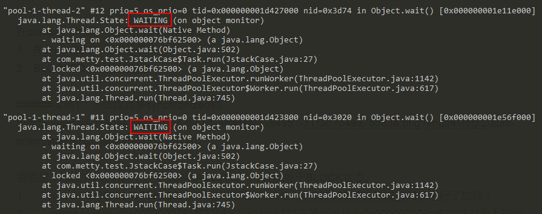

# 代码异常

##java

> java.lang.UnsupportedOperationException

```java
List<Integer> list = Arrays.asList(1, 3, 5);
list.add(7); //抛出 ex

//Arrays.asList() 返回的 ArrayList 是 java.util.Arrays$ArrayList，而非 java.util.ArrayList。
//Arrays$ArrayList 并没有覆写其中的 add()和 remove()方法，只会抛出异常。
```

```java
List<Integer> list = new ArrayList<>(Arrays.asList(1, 3, 5)); 
list.add(7); //正确做法
```
>java.util.ConcurrentModificationException

```java
在集合遍历过程中，进行元素的 增/删 都会报此异常，集合的 fast-fail 机制所导致的。
List<Integer> list = new ArrayList<>(Arrays.asList(1, 3, 5));
for (Integer i : list) { //遍历源集合
    if (3 == i) {
        // list.add(7); //ex
        list.remove(Integer.valueOf(5)); //ex
    }
}

//解决方案1：原集合拷贝一份，遍历拷贝集合
List<Integer> list = new ArrayList<>(Arrays.asList(1, 3, 5));
ArrayList<Integer> copyList = new ArrayList<>(list);
for (Integer i : copyList) {
    if (3 == i) {
        // list.add(7); //OK
        list.remove(Integer.valueOf(5)); //OK
    }
}

//解决方案2：使用迭代器 iterator
List<Integer> list = new ArrayList<>(Arrays.asList(1, 3, 5));
Iterator<Integer> iterator = list.iterator();
while (iterator.hasNext()) {
    Integer next = iterator.next();
    if (3 == next) {
        // list.add(7); //OK
        list.remove(Integer.valueOf(5)); //OK
    }
}
```

> Unable to instantiate xxx: make sure class name exists, is public, and has an empty constructor that is public

```
反射实例需要调用 public 无参构造器，所以 javabean 必须单独定义，不能作为内部类。
```

>No constructor found in com.x matching [java.lang.Integer, java.lang.Integer, java.lang.String]] with root cause

```java
同上
```

>is not an enclosing class

```java
//实例化 B 时：A.B ab = new A.B(); 则会出现以上异常。
public class A {
    public class B {}
}

正确做法为：A.B b = new A().new B();
//非 static 内部类不能使用外部类进行操作，必须用实例来进行实例化类中类.
```

>java.lang.IllegalAccessError: class cannot access its superinterface

```
一般来说就是：jar包冲突，版本问题、两个相同的jar包
```

>Unable to find a @SpringBootConfiguration, you need to use @ContextConfiguration or @SpringBootTest(classes=...) with your test

```java
//两种可能性
1.程序入口类忘了添加：SpringBootApplication注解

2.程序入口类的包名和测试类所在包名不一致。例如：
    主类： com.example.application.Application.java
    测试类： com.example.test.JpaTest.java
```

```java
//解决方案
1.给主类添加注解 @SpringBootApplication 

2.将入口类和测试类所在包调整为一致即可。例如，
    将主类调整为：com.example.Application.java
    或者，在测试类的注解后面添加启动类的类名  @SpringBootTest(classes = Application.class)
```


## mybatis

>资源拷贝插件：打包时，没有将mybatis的 xml 文件打进war包。

```java
//Invalid bound statement (not found): com.example.blue.mapper.PersonMapper.getOneById
```

>Parameter Maps collection does not contain value for java.lang.Integer

```java
检查mybatis的xml配置，肯定在某处配错 "parameterType / resultType" --> "parameterMap/resultMap"
```

>必须为元素类型"insert" 声明属性 "resultType"

```
删除xml文件中<insert/>，<delete/>等标签中的 resultType 属性
```
>Consider defining a bean of type "com.x.x.service.PersonService" in your configuration

```java
(1)类 PersonServiceImpl 是否添加 @Service 注解; 
(2)sp项目启动类是否添加 @MapperScan(value = "com.x.x.mapper")
```


## jpa

> 对于 `增删改` 操作，需要添加额外注解：`@Modifying`

```java
//Can not issue data manipulation statements with executeQuery().
```

>对于 `删改` 操作涉及到事务机制，需要在 service 类上加上注解：`@Transactional`

```java
//javax.persistence.TransactionRequiredException: Executing an update/delete query
```


# IDE异常

## IDEA


## Eclipse

>Eclipse卡在"Initializing Java Tools 1%...."

```java
删除当前工作目录下的 'WORKSPACE/.metadata/.plugins/org.eclipse.core.resources/.project'，然后重启
```

>Failed to execute goal org.apache.maven.plugins:maven-surefire-plugin:2.12.4:test (default-test) on

```java
项目打包时，出现这个问题：可能是测试类和 maven-surefire-plugin:2.12.4:test (default-test) 出现了冲突

@Ignore //测试方法增加此注解，这个注解的意思是忽略掉当前的测试类
@Test
public void testCreeper() throws Exception {
    ImoocPageProcessor imoocPageProcessor = new ImoocPageProcessor();
    imoocPageProcessor.creeper();
}
```

>eclipse项目有红叉但里面没错

```
打开'Problems'视图: Description Resource Path Location Type Java compiler level does not match the version of，jdk版本不一致所致

windows - proferences - java – compiler设置jdk为1.8
windows - proferences - java – Installed JREs设置jdk为1.8
点击项目右键 – properties - java Compiler 设置jdk为1.8
点击项目右键 - properties - eclipse - project Facets设置java为1.8
点击项目右键 – properties - eclipse - project Facets设置Dynamic Web Module 为3.1（这是你在web.xml配置的servlet版本）
点击项目右键 – Maven - update project 错误应该可以消除
```


# 运维异常

## CPU超高

> 寻找问题

- 在LINUX环境下，可以通过`top`命令查看各个进程的CPU使用情况，默认按CPU使用率排序。


- 通过`top -Hp 18451`查看该进程下各个线程的CPU使用情况（假设PID为 18451 的进程CPU使用率高）。
- 通过`/usr/java/jdk1.8.0_191/bin/jstack 18451 > 18451.log`查看java进程堆栈状态，并保存文件。

```java
//jstack命令生成的 thread dump 信息包含了JVM中所有存活的线程。

在 top -Hp 命令中，已经获取到了占用cpu资源较高的线程pid，将该pid转成16进制的值。在 thread dump 中每个线程都有一个 nid，找到对应的nid即可。
隔段时间再执行一次 jstack 命令获取thread dump，区分两份dump是否有差别。
在nid=0x246c的线程调用栈中，发现该线程一直在执行JstackCase类第33行的calculate方法，得到这个信息，就可以检查对应的代码是否有问题。
```

> 分析线程状态

基于thead dump分析线程的运行情况，如是否存在死锁、是否存在一个线程长时间持有锁不放等等。在dump中，以下种状态：RUNNABLE（线程处于执行中），BLOCKED（线程被阻塞），WAITING（线程正在等待）。

> 多线程竞争 synchronized 锁


```java
//很明显：pool-1-thread-1 获取到锁，处于RUNNABLE状态，线程2处于BLOCK状态
1、'locked <0x000000076bf62208>' 说明线程1对地址为 0x000000076bf62208 对象进行了加锁；

2、'waiting to lock <0x000000076bf62208>' 说明线程2在等待地址为 0x000000076bf62208 对象上的锁；

3、'waiting for monitor entry [0x000000001e21f000]' 说明线程1是通过 synchronized 关键字进入了监视器的临界区，并处于"Entry Set"队列，等待monitor，具体实现可以参考深入分析 synchronized 的JVM实现；
```

> 通过 wait 挂起线程



```java
//线程1和2都处于WAITING状态
1、线程1和2都是先'locked <0x000000076bf62500>'，再'waiting on <0x000000076bf62500>'，之所以先锁再等同一个对象，是因为wait方法需要先通过 synchronized 获得该地址对象的monitor；

2、'waiting on <0x000000076bf62500>'说明线程执行了wait方法之后，释放了monitor，进入到"Wait Set"队列，等待其它线程执行地址为'<0x000000076bf62500>'对象的notify方法，并唤醒自己，具体实现可以参考深入分析Object.wait/notify实现机制；
```

## tomcat日志

>取消Tomcat自动生成的日志

```
tomcat有五类日志 ：catalina、localhost、manager、admin、host-manager

日志文件过大，且为问题排查不使用的日志，导致磁盘空间不足，项目异常关闭
```

> **catalina.out**

```
记录标准输出和标准出错。包含 tomcat 运行自己输出的日志以及应用里向 console 输出的日志。

默认这个日志文件是不会进行自动切割的，需要借助其他工具进行切割。
```

```
19-Sep-2018 09:53:30.082 INFO [main] org.apache.coyote.AbstractProtocol.start Starting ProtocolHandler ["http-nio-8080"]
19-Sep-2018 09:53:30.099 INFO [main] org.apache.coyote.AbstractProtocol.start Starting ProtocolHandler ["ajp-nio-8009"]
19-Sep-2018 09:53:30.106 INFO [main] org.apache.catalina.startup.Catalina.start Server startup in 1360 ms
2018-09-19 16:52:10
 [] [] [INFO]-[Thread: DefaultQuartzScheduler_Worker-7] 开始检查系统
```

>**catalina.YYYY-MM-DD.log**

```
记录tomcat自己运行的一些日志，这些日志还会输出到 catalina.out，但是应用向 console 输出的日志不会输出到此处，是tomcat的启动和暂停时的运行日志。

注意，它和 catalina.out 里面的内容是不一样的。
```

```
19-Sep-2018 09:53:30.064 INFO [localhost-startStop-1] org.apache.catalina.startup.HostConfig.deployDirectory Deployment of web application directory /opt/tomcat/webapps/manager has finished in 29 ms
19-Sep-2018 09:53:30.082 INFO [main] org.apache.coyote.AbstractProtocol.start Starting ProtocolHandler ["http-nio-8080"]
19-Sep-2018 09:53:30.099 INFO [main] org.apache.coyote.AbstractProtocol.start Starting ProtocolHandler ["ajp-nio-8009"]
19-Sep-2018 09:53:30.106 INFO [main] org.apache.catalina.startup.Catalina.start Server startup in 1360 ms
```

> **localhost.YYYY-MM-DD.log**

```
主要是应用初始化（listener，filter，servlet）未处理的异常最后被 tomcat 捕获而输出的日志。
也包含 tomcat 的启动和暂停时的运行日志,但它没有 catalina.2018-09-19.log 日志全。它只是记录了部分日志。
```

```
19-Sep-2018 03:57:15.287 INFO [localhost-startStop-1] org.apache.catalina.core.ApplicationContext.log ContextListener: contextInitialized()
19-Sep-2018 03:57:15.287 INFO [localhost-startStop-1] org.apache.catalina.core.ApplicationContext.log SessionListener: contextInitialized()
19-Sep-2018 03:57:15.288 INFO [localhost-startStop-1] org.apache.catalina.core.ApplicationContext.log ContextListener: attributeAdded('StockTicker', 'async.Stockticker@2f62fc5f')
```

> **localhost_access_log.YYYY-MM-DD.txt**

```
访问 tomcat 的日志，请求时间和资源，状态码都有记录。
```

```
192.168.1.220 - - [19/Sep/2018:03:57:42 -0400] "GET / HTTP/1.1" 200 11286
192.168.1.220 - - [19/Sep/2018:03:57:42 -0400] "GET /tomcat.css HTTP/1.1" 200 5581
192.168.1.220 - - [19/Sep/2018:03:57:42 -0400] "GET /tomcat.png HTTP/1.1" 200 5103
```

> **host-manager.YYYY-MM-DD.log**

```
记录 tomcat 自带的 manager 项目的日志信息的，未看到有什么重要的日志信息。
```

>**manager.YYYY-MM-DD.log**

```
tomcat 的 manager 项目专有的日志文件
```

> tomcat日志文件切割：这个文件大于 2G 时，会影响 tomcat 的运行。

```properties
#在tomcat根目录下建立 common/classes/log4j.properties，内容如下
log4j.rootLogger=INFO, R 
log4j.appender.R=org.apache.log4j.RollingFileAppender 
log4j.appender.R.File=${catalina.home}/logs/tomcat.newlog  #设定日志文件名
log4j.appender.R.MaxFileSize=100KB   #设定文件到100kb即分割
log4j.appender.R.MaxBackupIndex=10   #设定日志文件保留的序号数
log4j.appender.R.layout=org.apache.log4j.PatternLayout 
log4j.appender.R.layout.ConversionPattern=%p %t %c - %m%n

#在tomcat根目录下的 common/lib 下加入 log4j.jar 和 commons-logging.jar
#重新启动tomcat即可。
```


```java
1.jar war ear 
jar: 包含class、properties文件，是文件封装的最小单元。包含Java类的普通库、资源(resources)、辅助文件(auxiliary files)等
war: Servlet、JSP页面、JSP标记库、JAR库文件、HTML/XML文档和其他公用资源文件，如图片、音频文件等
ear: 包括整个项目，内含多个 EJB Module（JAR文件）和 Web Module（WAR文件）

jar: 通常是开发时要引用通用(JAVA)类，打成包便于存放管理；
war: 是做好一个(web)应用后，通常是网站，打成包部署到容器中；
ear: 企业级应用，实际上EAR包中包含WAR包和几个企业级项目的配置文件。

注意: 将web项目以war的方式导出后，直接放在tomcat容器的webapps下，启动tomcat服务，即可运行该项目。该war包会自动解压出一个同名的文件夹。
```


