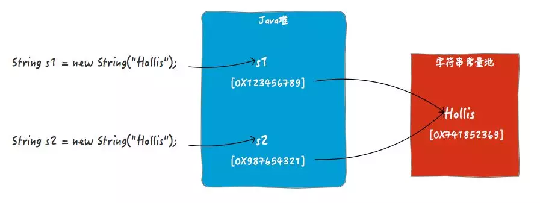
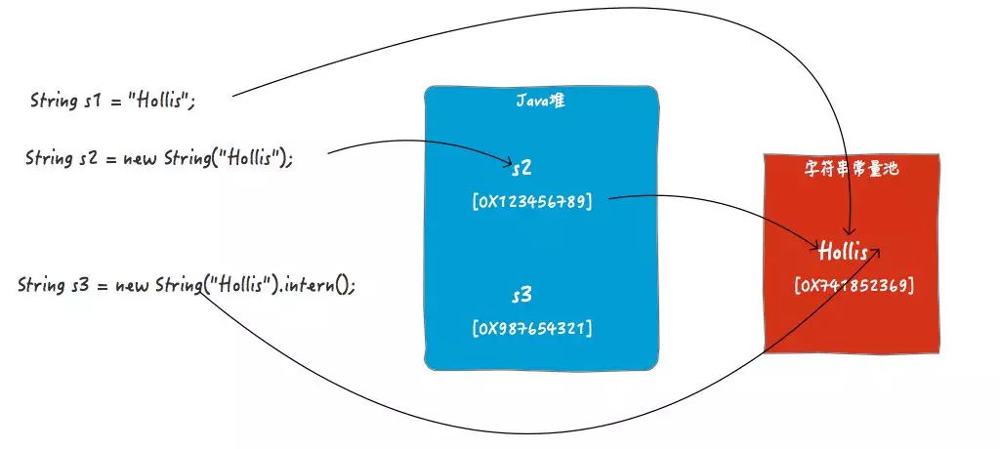

[TOC]


# Idea

> 使用技巧

- **复制警告或错误信息：** 鼠标光标悬浮在报错的地方，待错误提示出现后，键盘按住 Alt，同时点击鼠标左键，Ctrl+V 到度娘即可。
- **mvn打包，跳过Test：** 打开右侧标签页"Maven-Projects"，当前项目'Lifecycle'，选中'Test'，点击菜单栏的"小闪电"，此时Test上多了一条横。

> 快捷键

|                    描述                    |            idea             |       eclipse        |
| :----------------------------------------: | :-------------------------: | :------------------: |
|                  main方法                  |            psvm             |  main（Alt+/补全）   |
|                 输出控制台                 |            sout             |         syso         |
|               for普通 / 增强               |         fori / iter         |   for（Alt+/选择）   |
|                 try/catch                  |         Ctrl+Alt+T          |          *           |
|            自动生成Get/实现方法            |         Alt+Insert          |          *           |
|                                            |                             |                      |
|              抽取变量（方法）              |      Ctrl+Alt+V （M）       |   Shift+Alt+L（M）   |
|                   格式化                   |         Ctrl+Alt+L          |     Ctrl+Shift+F     |
|               代码提示/补全                |       Ctrl+Alt+Space        |        Alt+/         |
|                  导包优化                  |         Ctrl+Alt+O          |     Ctrl+Shift+O     |
|                                            |                             |                      |
|        上下移动单行语句（整个方法）        | Shift+Alt+↑（Shift+Ctrl+↑） |      Alt+↑（）       |
|                 批量重命名                 |          Shift+F6           |     Shift+Alt+R      |
|            注释单行（选中部分）            |   Ctrl+/（Ctrl+Shift+/）    |        Ctrl+/        |
|                  参数提示                  |           Ctrl+P            |                      |
|              查看类的继承关系              |           Ctrl+H            |        Ctrl+T        |
|                   定位行                   |           Ctrl+G            |        Ctrl+L        |
|            整行复制（整行删除）            |      Ctrl+D（Ctrl+X）       | Ctrl+Alt+↓（Ctrl+D） |
|                                            |                             |                      |
|                 大小写转化                 |        Ctrl+Shift+U         |                      |
|                返回上次修改                |    Ctrl+Shift+BackSpace     |                      |
|           当前工作空间查找java类           |      Ctrl+Shift+Alt+N       |                      |
|                 查看类结构                 |            Alt+7            |                      |
|   跳到下(上)一个选择项（配合Ctrl+F使用）   |       F3（Shift+F3）        |                      |
| 在全局（当前类）查找方法调用，可配合F3使用 |      Alt+F7（Ctrl+F7）      |      Ctrl+Alt+H      |
|             折叠（展开）代码块             |   Shift+Ctrl+减号（加号）   | Shift+Ctrl+/（*号）  |
|                                            |                             |                      |
|        调试：跳到下一步（进入代码）        |          F8（F7）           |       F6（*）        |

> 基本设置

```java
//黑色主题 --> 界面的字体大小,非代码字体
Appearance & Behavior - Appearance - Theme(选为Darcula) 
勾选 Override default fonts by(......) - Name(Mircrosoft Yahei UI) - Size(12)
    
//改变代码的字体和大小
Editor - Colors & Fonts
//首先,点击 Save As...,自定义一个名为 skyl 的样式
//然后,选择具体的字体和大小 Primary font(Source Code Pro) - Size(15)
    
//缩进采用4个空格,禁止使用tab字符
Editor - Code Style - java - Tabs and Indents - Use tab character(取消勾选)
    
//自动换行
Editor - Code Style - Java
右侧标签 Wrapping and Braces, (√) Line breaks 和 (√) Ensure right margin is not exceeded
    
//悬浮文档提示
Editor - General - Show quick documentation on...
    
//代码提示忽略大小写
Editor - General - Code Completion - Case sensitive...(None)
//代码补全快捷键: Ctrl + Alt + Space
    
//编码格式
Editor - File Encodings - 3个UTF-8

//显示行号等
Editor - General - Appearance //勾选以下
    (√)Show line number(行号) + (√)Show right margin(右边线) + (√)Show method sep...(方法分割线)

//自动导包
Editor - General - Auto Import 
    Insert imports...(All) + (√)Add unambiguous... + (√)Optimize imports...
    
//设置文件和代码的模板
Editor - File and Code Templates - Includes - 自行添加

//取消单行显示tabs
Editor - General - Editor Tabs - (X)show tabs in single...
    
//自动编译
Build,Exe... - Compiler - (√)Build project automatically
    
//Gradle配置
Build,Exe... - Build Tools - Gradle - Offline work
```

> 版本相关：Alpha，Beta，SNAPSHOT，Release，GA

```java
'Alpha': 内部测试版。一般不向外部发布，会有很多Bug。一般只有测试人员使用。
'Beta': 测试版。这个阶段的版本会一直加入新的功能，在Alpha版之后推出。
'RC(Release Candidate)': 候选版本。不会再加入新的功能，主要着重于除错。
'SNAPSHOT': 不稳定，尚处于开发中的版本。

'GA(General Availability)': 正式发布版本。在国外都是用GA来说明'Release'版本的。
```
# JVM

## 栈堆方法区

> 栈的特点

- 方法执行的内存模型。`每个方法被调用都会创建一个栈帧`（存储局部变量、操作数、方法出口等）。
- `JVM为每个线程创建一个栈`，用于存放该线程执行方法的信息（实际参数、局部变量等）。
- 栈属于线程私有，不能实现线程间的共享！
- 栈的存储特性是“先进后出，后进先出”。
- 栈是由系统自动分配，速度快！栈是一个连续的内存空间（相比于堆）。

> 堆的特点

- 用于存储创建好的对象和数组（数组也是对象）。

- `JVM只有一个堆，被所有线程共享！`

- 堆是一个不连续的内存空间，分配灵活，速度慢!

>方法区（特殊的堆）的特点

- `JVM只有一个方法区，被所有线程共享！`
- 方法区实际也是堆，只是用于存储类、常量相关的信息！
- 用来存放程序中永远不变或唯一的内容（类信息{Class对象}、静态变量、字符串常量等）。

```java
public class Dog {
    private String name;

    public Dog(String name) {
        this.name = name;
    }
}

public class Student {
    public static Boolean gender = false;
    private Integer age;
    private String name;

    public Dog dog;

    public Student(int age, String name) {
        this.age = age;
        this.name = name;
    }

    public void play() {
        System.out.println("play with " + this.dog.name);
    }
}

public class Test {
    public static void main(String[] args) { //程序入口
        Student stu = new Student(18, "王");
        stu.dog = new Dog("Yello");
        stu.play();
    }
}
```


> 程序执行过程的内存分析

## 对象初始化

> 对于语句`”Person p = new Person(“zhangsan”,20);`在内存中究竟做了什么事？

- 1). 因为 new 用到了 Person.class，所以会先找到 Person.class 文件并加载到内存中。
- 2). 执行该类中的` 静态代码块`。
- 3). 在堆内存中开辟空间，分配内存地址。
- 4). 在属性进行`默认初始化`（string 类型默认为 null，int 默认为 0） 。
- 5). 对属性进行`显式初始化`（即定义类时，属性含有默认值 `private String name = “xiaowang”`） 。
- 6). 对对象进行`构造代码块`初始化（没有static修饰的代码块）。
- 7). 对对象进行`构造函数`初始化。
- 8). 在栈内存中生成变量 p，将`内存地址赋给`栈内存中的 p 变量。

> 对象调用成员过程，`p.setName(”lisi”)`的执行过程？

- 1). 上述代码执行完后， 在栈内存中存在变量 p1， 在堆内存中存在Person对象。其中name=”zhangsan”和 age=20，方法区存在 setName()方法。其中，栈内存中的变量 p1 指向堆内存中的 Person 对象。
- 2). 当执行 `p1.setNmae(“lisi”);`时，先在栈内存中生成 setName()方法中的两个变量 this.name 和 name。由于是变量 p1 调用 setName()方法，所以 this 指向的是变量 p1 指向的对象。
- 3). 所以，当执行完 setName()方法后，堆内存中的 name=”zhangsan”变为 name=”lisi”。

```java
static class A {
    B b = new B();

    A() {
        System.out.print("A");
    }
}

static class B {
    B() {
        System.out.print("B");
    }
}

static class C extends A {
    B b = new B();

    private C() {
        System.out.print("C");
    }

    public static void main(String[] args) {
        new C();
    }
    //实例化C类需调用父类构造方法，实例化B，输出B，输出父类A。
    //回到子类，实例化B输出B，输出本身C。最终结果：BABC
}
```

- 子类通过构造函数进行实例化时，会先调用父类的构造函数。如果没有显示的指明调用哪个父类构造时，`默认调用父类的无参构造`。
- 普通成员变量的`显示初始化`优先于构造方法。

##静态代码块

> 静态代码块 > main方法 > 构造代码块 > 构造函数
>
> 父类静态代码块、子类静态代码块、main、父类构造代码块、父类构造函数、子类构造代码块、子类构造数

**静态代码块**：在类中只使用 static 关键字声明的代码块。`每个静态代码块只会执行一次`，用于初始化类的属性。由于 JVM 在加载类时会执行静态代码块，所以静态代码块优先主方法执行。

**构造代码块**：在类中直接用{ }扩起来的代码块。`每次new对象时都会被调用`，执行顺序`优先于`所有的构造函数。作用：给所有的对象进行统一、共性的初始化。

**构造函数**：每个类都有一个默认的无参构造函数，这个构造函数的权限和类保持一致。作用：是给通过此构造函数（构造函数不止一种）new 的对象进行初始化。

```java
static class F {
    static {
        System.out.print("F-S{} ");
    }

    {
        System.out.print("F{} ");
    }

    F() {
        System.out.print("F() ");
    }

    public static void main(String[] args) {
        System.out.print("F-M() ");
        new S(); //F-S{} F-M() S-S{} F{} F() S{} S()
    }
}

static class S extends F {
    static {
        System.out.print("S-S{} ");
    }

    {
        System.out.print("S{} ");
    }

    S() {
        System.out.print("S() ");
    }
}
```

```java
static class Add {
    static {
        int i = 5; //局部变量，不会影响i值。
    } //执行顺序在静态变量初始化之后（即如果设为非局部变量，则会影响静态变量的值）。

    private static int i, j; 

    public static void main(String[] args) { //i++，先++再使用；++i，先使用再++
        i--; //输出：-1
        add();
        System.out.println(i + " - " + j); //输出：1-0
        System.out.println(i + j + ++i); //输出：3
    }

    private static void add() {
        j = i++ + ++i; //输出：0(0)+0(1)
        System.out.println(i + " - " + j); //输出：1-0
    }
}
```


# Object

## 基础规约

```java
包名统一小写，统一单数，类名使用复数。 //com.example.mydemo.util.CommUtils
常量命名全部大写，单词间用下划线隔开。 //MAX_STOCK_COUNT
```
| 修饰符 \ 作用域 | 当前类 | 同一包 | 子孙类 | 其他包 |
| :-------------: | :----: | :----: | :----: | :----: |
|     public      |   √    |   √    |   √    |   √    |
|    protected    |   √    |   √    |   √    |        |
|     default     |   √    |   √    |        |        |
|     private     |   √    |        |        |        |

## 运算符

> `Math.round(double num);`函数是取整函数，只关注小数点后第一位小数值。

```java
long l = Math.round(-1.45); //-1
long l = Math.round(-1.55); //-2 --> 同sql，先绝对值，再四舍五入，最后加符号

double d = Math.ceil(-1.45);  //-1.0
double d = Math.floor(-1.45); //-2.0 -->同sql，向下取值，即向x轴负方向取值

double d = Math.floor(-10 / -3); //3.0
double d = Math.floor(-10 % -3); //-1.0 -->同sql，结果符号位和被除数一致。 a%b = a-a/b*b
```

> 保留两位有效小数（两种方式）

```java
double val0 = (Math.round(1.1249 * 100)) / 100.0;
double val1 = (Math.round(1.1250 * 100)) / 100.0;
System.out.println(val0 + " - " + val1); //1.12 - 1.13
```

```java
String val0 = String.format("%.2f", 1.1249);
String val1 = String.format("%.2f", 1.1250);
System.out.println(val0 + " - " + val1); //1.12 - 1.13
```


> &，&& ---> 都是逻辑与运算符，但后者为短路运算

&， 左边无论真假，右边都要运算
&&，如果左边为真，右边参与运算； 如果左边为假，那么右边不参与运算。

```java
if (x == 33 & ++y > 0)  //y 会增长
if (x == 33 && ++y > 0) //y 不会增长
```

```java
%(取模)    -> 左<边，值为左。//7%4= 3; 7%-4= 3; -7%4= -3; -7%-4= -3

^(异或)    -> 左右同为 false，左右不同为 true。 (和其他差别很大)

<<(位运算-左) -> 乘以 2 的移动位数次幂 //3<<2 = 3 * 2^2 =12
>>(位运算-右) -> 除以 2 ...........  //6>>2 = 6 / 2^2 =1
```
## 继承 & 实现

> java 只支持`单继承`，不支持`多继承`。 但支持`多层继承`和`多实现`。

当多个父类中定义了相同函数名的函数，而各个函数的实现各不相同，则子类就不确定要调用哪一个。

> **接口：** 可看作一个特殊的抽象类，方法全是抽象的。`一个类可以实现多个接口`。

 类与类之间是`继承关系`，类与接口之间是`实现关系`，接口与接口之间是`继承关系`。

##常用方法

1. **toString()**

   ```java
   //默认返回：对象的类型名+@+内存地址值。---> 子类需要重写
   public String toString() {
       return getClass().getName() + "@" + Integer.toHexString(hashCode());
   }
   ```

2. **arraycopy()**

   ```java
   //数组拷贝，非常高效 ---> 此方法隶属于System
   public void test() {
       List<String> list = Arrays.asList("a", "b", "c");
       String[] src = list.toArray(new String[list.size()]); //src
       String[] dest = new String[2]; //dest
       
       //从原数组的第1个开始拷贝，目标数组从第0个位置开始接收，拷贝2个元素
       System.arraycopy(src, 1, dest, 0, 2);
       Arrays.stream(dest).forEach(System.out::println); //b-c
   }
   ```


# String#

## 字符串常量池

> 字符串常量池用来存储String对象，共享使用，提高效率。由于`final String`，一经创建就不可改变，因此不用担心String对象共享而带来程序的混乱。
>
> **常量池中的“对象”是在编译期确定，在类被加载时创建**，如果类加载时，该字符串常量在常量池中已存在，那就跳过，不会重新创建一个。
>
> **堆中的对象是在运行期才确定，在代码执行到new的时候创建的**。

- **栈内存：** 在`函数`中定义的一些`基本类型的变量`和`对象的引用变量`都在函数的栈内存中分配。


-  **堆内存：** 用来存放所有`new创建的对象`和`数组的数据`。


-  **常量池：** 存放`字符串常量`和`基本类型常量`（public static final）。它们永不改变。


## 不可变

> 一旦一个String对象在内存（堆）中被创建出来，它就无法被修改。特别要注意的是，String类的所有方法都没有改变字符串本身的值，都是`返回了一个新的String对象`。

- `高效性-缓存HashCode` 字符串的不可变能保证其 hashcode 永远保持一致，不需要重新计算。这就使得字符串很适合作为 Map 中的 Key，字符串的处理速度要快过其它的键对象。
- `安全性` String被广泛的使用在其他Java类中充当参数。比如网络连接、打开文件等操作。如果字符串可变，那么类似操作可能导致安全问题。因为某个方法在调用连接操作的时候，他认为会连接到某台机器，但是实际上并没有（其他引用同一String对象的值修改会导致该连接中的字符串内容被修改）。可变的字符串也可能导致反射的安全问题，因为他的参数也是字符串。
- `不可变对象天生就是线程安全的` 因为不可变对象不能被改变，所以他们可以自由地在多个线程之间共享。不需要任何同步处理。

## DEMO

> `new String("Hollis");` 如果只需要创建一个字符串，可直接使用双引号的方式，如果你需要在堆中创建一个新的对象，你可以选择构造函数的方式。

```java
String s1 = new String("Hollis");
String s2 = new String("Hollis");
System.out.println(s1 == s2); //false
```



> `intern()`两个作用：1.将字符串字面量放入常量池（如果池没有的话），2.返回这个常量的引用。

```java
String s1 = "Hollis";
String s2 = new String("Hollis");
String s3 = new String("Hollis").intern();

System.out.println(s1 == s2); //false
System.out.println(s1 == s3); //true
```

- 可以简单的理解`String s1 = "Hollis";`和`String s3 = new String("Hollis").intern();`做的事情是一样的。都是定义一个字符串对象，然后将其字符串字面量保存在常量池中，并把这个字面量的引用返回给定义好的对象引用。
- 对于`String s3 = new String("Hollis").intern();`，在不调`intern()`情况，s3指向的是JVM在堆中创建的那个对象的引用的（如图中的s2）。但是当执行了`intern()`方法时，s3将指向字符串常量池中的那个字符串常量。



> **Q1：** `String s = new String("hollis");`定义了几个对象。
>
> **Q2：** 如何理解`String`的`intern()`方法？

- **A1：** 若常量池中已经存在"hollis"，则直接引用，也就是此时只会创建一个对象。如果常量池中不存在"hollis"，则先创建后引用，也就是有两个。
- **A2：** 当一个String实例调用intern()方法时，JVM会查找常量池中是否有相同Unicode的字符串常量，如果有，则返回其的引用，如果没有，则在常量池中增加一个Unicode等于str的字符串并返回它的引用。
- `new String()` 所谓的“如果有的话就直接引用”，指的是Java堆中创建的String对象中包含的字符串字面量直接引用字符串池中的字面量对象。也就是说，`还是要在堆里面创建对象的`。
- 而 `intern()` 中说的“如果有的话就直接返回其引用”，指的是会把字面量对象的引用直接返回给定义的对象。这个过程是`不会在Java堆中再创建一个String对象的`。

```java
public void test() {
    String s1 = "abc";
    String s2 = "abc";
    String s3 = new String("abc");
    String s4 = "ab" + "c";

    System.out.println(s1 == s2); //true
    System.out.println(s1 == s3); //false
    System.out.println(s1 == s4); //true
        
    String s5 = "ab";
    String s6 = s5 + "c";
    System.out.println(s4 == s6); //false
}
```

- `String s1 = "abc";` 先在常量池中查找是否存在"abc"（使用 equals() 确定）， 存在则让 s1 指向这个值，没有则新建。
- `String s2 = "abc";` 同上
- `String s3 = new String("abc");` 其中，String s3 只是定义了一个名为 s3 的String类型变量，并没有创建对象。new String() 才是真正的在堆空间上创建一个字符串对象，然后将 s3 指向新建对象的堆内存地址，所以 s1 == s3 比较结果为false。
- `String s4 = "ab" + "c";` 先在常量池中创建 2 个字符串对象，再将 s4 指向已有的 "abc"。
- `String s6 = s5 + "c";` 和 `String s4 = "ab" + "c";` 的区别： 对于字符串常量相加的表达式，不是等到运行期才去进行加法运算处理，而是在编译期直接将其编译成一个这些常量相连的结果。因此，`String s4 = "ab" + "c";`可以转化为`String s4 = "abc";`，但前者由于不是字符串常量直接相加，所以不能转化。


##StringBuilder##

> 内部拥有一个数组用来存放字符串内容。当进行字符串拼接时，直接在数组中加入新内容，并自动维护数组的扩容，不会产生中间字符串。

|     类型      |    安全    |                            特点                            |
| :-----------: | :--------: | :--------------------------------------------------------: |
|    String     | `线程安全` | 直接进行字符串拼接，会产生大量中间字符串，并且时间消耗长。 |
| StringBuffer  |  线程安全  |                   支持同步锁，性能稍差。                   |
| StringBuilder | 线程不安全 |         单线程进行大量字符串操作时，推荐使用(√)。          |

```java
public void test() {
    String result = "";
    String str = "hello";
    
    for (int i = 0; i < 1000; i++) {
        result += str;
        
        //上一行代码，编译器最终会编译为类似下面的代码：
        //result = new StringBuilder(result).append(str).toString();
    }
}
```

**解析：** 每次循环都需要创建一个` StringBuilder对象`（创建对象需要耗费时间和内存），随着循环次数的增大， result 字符串就会越来越长，把 result 中的字符复制到新建的 StringBuilder 中花费的时间也就越长，而且 `StringBuilder(result).append(str).toString();` 会创建一个临时的字符串，随着循环次数的增加，这个操作花费的时间也会越来越长。总之，随着循环变量 i 的增大，每次循环会变得越来越慢。
## 常用方法

1. **字符串连接符 +**

   - 两边都是数值类型时，为运算符，即相加求和。
   - 两边至少有一个为字符串类型时， 则为字符串连接符。底层原理 `StringBuilder.append()`。


2. **equals()**

   >**==：** 对于基本数据类型，比较其值； 对于引用数据类型，比较其堆内存地址。
   >
   >**equals：** `Object`中默认调用`==`。`String重写为：比较字符串内容。`

2. **length()**

   ```java
   public void test() {
       String[] array = {"a", "b", "c"};
       System.out.println("数组的长度: " + array.length); //数组的属性-length

       System.out.println("字符串长度: " + "abc".length()); //字符串的方法-length()
   }
   ```

3. **split()** 切割结果，需检查最后一个分隔符后有无内容，否则可能抛 IndexOutOfBoundsException

   ```java
   public void test() {
       String str = "a,b,c,,";
       String[] ary = str.split(",");
       System.out.println(ary.length); //预期大于 3，结果是 3
   }
   ```

5. **reverse**

   ```java
   //先转换为 StringBuilder，再调用 StringBuilder.reverse()
   String str = new StringBuilder("asdfghjjkk").reverse().toString();
   ```

6. **replace & replaceAll**

   > **replace()** 参数是char和CharSequence，即`支持字符和字符串的替换`。
   > **replaceAll()** 参数是regex，即`基于正则表达式的替换`。如，`replaceAll(".", "*")`是把字符串中所有字符转换成星号，`"."`在正则表达式中表示所有字符
   >
   > **replaceFirst()** 参数也是'regex'，但不同的是只替换第一个，即`基于正则替换第一个满足条件的`。

   ```java
   String s0 = "com.study.".replace(".", "/") + "s.r";
   String s1 = "com.study.".replaceAll(".", "/") + "s.ra";
   String s2 = "com.study.".replaceFirst(".", "/") + "s.rf";
   System.out.println(s0 + " - " + s1 + " - " + s2);

   输出结果：com/study/s.r - //////////s.ra - /om.study.s.rf
   ```


> 特殊空格

平时用键盘输入的空格ASCII值是32，而这个特殊空格的ASCII值为160。

```java
char char1 = ' '; //普通空格
char char2 = ' '; //特殊的空格
System.out.println((int) char1); //ASCII值-32
System.out.println((int) char2); //ASCII值-160
```

特殊空格是一个不间断空格(non-breaking space)，本质就是页面上`&nbsp;`所产生的空格，作用就是在页面换行时不被打断。

如果使用普通的空格，在换行时人名就会被打断，导致 Zhang 在第一行末尾，而 Xiaoming 跑到第二行开头。但是，如果使用不间断空格，则可以保持完整的人名在同一行的末尾（word中也有这种空格的使用）。

```java
页面某一行的末尾是一个人名Zhang Xiaoming //不间断空格

页面某一行的末尾是一个人名Zhang //使用普通空格
Xiaoming
```

**注意**：不间断空格有个问题，就是它无法被`trim()`所裁剪，也无法被正则表达式的`\s`所匹配，也无法被StringUtils的`isBlank()`所识别，也就是说，无法像裁剪普通空格那样移除这个不间断空格。

**正确做法**：利用不间断空格的Unicode编码来移除它，其编码为`\u00A0`。

```java
String str = "abc ";
String replace = str.replaceAll("\\u00A0", " ").trim();
System.out.println(str.length() + " - " + replace.length()); //4 - 3
```

# Interface

> OverWrite & OverLoad：`重载与方法的返回值类型无关`

**重写：** 在子类中，出现和父类中一摸一样的方法。

**重载：** 同一类中，出现多个方法名一样，但参数列表（参数类型+个数+顺序）不一样的方法。

方法包括：  修饰符（可选）， 返回值类型，方法名，参数列表，方法体。
假设定义了两个只有返回类型不一样的方法： int add(Object o); 和 boolean add(Object o); 当调用者不关心返回值时，写作：`add(obj);`编译器如何区分到底调用的是哪个方法？？

> 方法调用，传递参数遵循值传递原则（传递的都是数据的拷贝）。

- `基本类型传递的是数据值的拷贝。`在方法内对值类型操作不会改变原有值。

- `引用类型传递的是该对象的堆内存地址，即引用拷贝，但指向同一个对象。`所以，在方法内对引用类型进行重新赋引用，不会改变原有值。但是对原有引用的属性进行操作时，可改变这个引用的属性值。

```java
private void doSth(int i, String s, Person p) {
    i += 1;
    s += "hello";
    p = new Person("li", 20);
    // p.age = 30; //将改变原有引用的属性值
}
```

> this & super

- **this：** 子类调用【子类】的同名成员或方法。**super：** 子类调用【父类】的...。
- 构造函数间调用使用 `this() 或 super(name)` 语句，并且该语句只能放在构造函数第一行。

```java
class Outter {
    int num = 10;

    class Inner {
        int num = 20;

        void show() {
            int num = 30;

            System.out.println(num); //30
            System.out.println(this.num); //20
            System.out.println(Outter.this.num); //10 --> 切记不能使用 super
        }
    }
}
```

- 子类通过构造函数进行实例化时，会先调用父类的构造函数。如果没有显示的指明调用哪个父类构造时，`默认调用父类的无参构造`。
- 对于子类来说，不管是无参构造方法还是有参构造方法，`都会默认调用父类的无参构造方法`；当编译器尝试在子类中往这两个构造方法插入super()方法时，因为父类没有一个默认的无参构造方法，所以编译器报错；

```java
class Super {
    private int id;

    public Super(int id) {
        this.id = id;
    }
}

class Sub extends Super {
    public Sub() { //编译错误
    }

    public Sub(int id) { //编译错误
    }
}
```

> 抽象类 & 接口

接口`extends`接口， 抽象类`implements`接口， 抽象类`extends`具体类。

**抽象类与普通类的区别**：不能创建实例和允许有 abstract 方法。抽象类中可以有静态方法。

abstract修饰的类是抽象类，它不能生成对象，它是不完整的，只能作为基类。类可以实现无限个接口，但仅仅能从一个抽象类继承。

java中抽象类中可以有非抽象方法，继承抽象类必须要实现它其中的抽象方法。因此，Dog编译报错

```java
abstract class Animal {
    abstract void eat();
}
class Dog extends Animal { //编译报错
    public Dog() {
        System.out.println("I am a dog");
    }
}
```


> 方法重写 & final

- final修饰的方法不可以被重写，如果子类对final修饰的方法进行重写则编译报错。
- private修饰的方法对于子类不可见，同样的方法名同时出现在父类和子类表示新定义的方法，与父类无关。
- 当方法被覆盖后，调用子类实例的同名方法时会优先调用覆盖的方法，不会再调用父类的方法。

```java
class Father {
    private final void run() {
        System.out.println("father");
    }
}
class Son extends Father {
    private final void run() {
        System.out.println("son");
    }
}

//父类run()由private、final修饰，因此与子类无关。如果去除private，则子类run()编译错误。
new Son().run(); //结果输出：son
```

```java
public class Parent {
    private void fun1(){}
    void fun2(){}
    protected void fun3(){}
    public static void fun4(){}
}
//A.fun1方法为私有权限，无法被子类继承，因此无法被重写
//B.fun2方法为包权限，因此在同一个包内继承时，可以重写，但其他包继承无法重写
//C.fun3方法为子类访问权限，因此无论如何继承，都可以被重写。
//D.fun4方法虽然是公有的访问权限，但为静态方法，无法被继承，并且子类无法定义同名方法。
```


> **多态：** 父类的引用指向子类的对象。

```java
static class Father {
    public static int staticNum = 6;
    public int num = 6;

    public static void doStatic() {
        System.out.println("Father-Static");
    }

    public void doSth() {
        System.out.println("Father");
    }
}

static class Son extends Father {
    public static int staticNum = 8;
    public int num = 8;

    //不能重写 static 方法
    public static void doStatic() {
        System.out.println("Son-Static");
    }

    @Override
    public void doSth() {
        System.out.println("Son");
    }

    public void doSon() {
        System.out.println("Son-do");
    }
}

@Test
public void test() {
    Father father = new Son();

    //看左-静态
    System.out.println(father.staticNum); //6
    father.doStatic(); //Father-Static

    //看左-实例变量
    System.out.println(father.num); //6

    //看右-实例方法 --> 重写
    father.doSth(); //Son

    //类型为 Father 的变量不能直接执行 Son 类的方法 --> 编译看左
    ((Son) father).doSon(); //Son-do
}
```


# Integer

##基本数据类型

```java
//三大类，八小种
布尔类型： boolean （1bit，1位）
字符类型： char （1byte，8位，[-128, 127]）
数值类型-整型： byte （1byte）， short （2byte）， int （4byte）, long （8byte） 
数值类型-浮点型： float （4byte）， double （8byte）

//引用类型：类，接口，数组
```

## 装箱 & 拆箱

```java
public void test() {
    Integer i0 = new Integer(3);
    Integer i1 = Integer.valueOf(3); //装箱: 基本类型 -> 包装类

    int num0 = i0.intValue(); //拆箱: 包装类 -> 基本类型

    //自动装箱： 相当于Integer i = Integer.valueOf(4);
    Integer i = 4;

    //自动拆箱： 等号右边，将i对象转成基本数值 i.intValue() + 5;
    //加法运算完成后,再次装箱,把基本数值转成对象
    i = i + 5;
}
```

## 使用标准

- 所有 POJO 类属性必须使用`包装数据类型`，并且`不要设定默认值`。不设初值是提醒使用者在需要使用时必须自己显式地进行赋值。任何 `NPE（NullPointerExceptionrn） `问题，或者入库检查，都由使用者来保证。
- RPC 方法的返回值和参数必须使用`包装数据类型`。
- 所有的局部变量 【推荐】 使用`基本数据类型`。

```java
//【反例】设定默认值，会在更新其它字段时，附带更新此字段，导致创建时间被修改成当前时间
Date editTime = new Date();
```
## 常用方法

1. **equals()**

   >**【强制】** `所有的相同类型的包装类对象之间值的比较，全部使用 equals()。` `i0.equals(i1)`

   >**【说明】** 对于 Integer 对象，取值区间在 [-128, 127]，会复用已有对象，可直接使用 == 进行比较。但区间之外的取值，都会在堆上产生，并不会复用已有对象，推荐使用 equals() 进行判断。

   ```java
   public void test() {
       int j0 = 128, j1 = 128;
       System.out.println(j0 == j1); //true

       Integer i0 = 128, i1 = 128;
       System.out.println(i0 == i1); //false
       System.out.println(i0.equals(i1)); //true
   }
   ```

# Collection


## 数组 & 集合

>数组： 固定长度（不能动态改变数组的长度），只能放一种类型。
>集合： 可变长度， 可以存多种类型（在不考虑泛型的前提下）。

```java
List list = new ArrayList();
list.add(5); //集合放原始类型，其实是通过装箱拆箱来实现的。以前原生类型只能用数组，现在集合也可以了。
list.add("5");
list.add(new Integer(5));
```

## 双括号初始化

>使用双括号初始化（double-brace syntax）快速建立并初始化，`简洁但效率低`。原因：
>
>1. 双大括号初始化方法生成的.class文件要比常规方法多
>2. 双大括号初始化方法运行时间要比常规方法长
>3. 可能造成内存泄漏

```java
Map<Integer, String> map = new HashMap<Integer, String>() {{
    put(1, "a");
    put(2, "b");
    put(3, "c");
}};

List<String> list = new ArrayList<String>() {{
    add("a");
    add("b");
    add("c");
}};
```

- 第一层花括号，定义了一个继承自 ArrayList 的`匿名内部类`
- 第二层花括号，在匿名内部类中定义了一个 `构造代码块`
- 通过 new 得到ArrayList的子类的实例化，然后上转型为ArrayList的引用
- 得到的 list 实际上是ArrayList的子类的引用，但在功能上没有任何改变
- 相比于常规标准方式进行初始化要简洁许多，但代码可读性相对会差

## List & Set

>List： 排列有序（存入和取出的顺序一定相同，存在索引），元素可重复。
>Set： 排列无序，元素不可重复。

List的`contains()`和`remove()`底层调用的都是`equals()`。但Set却是`hashCode()`和`equals()`。

>Set如何保证元素唯一性？？？

先比较 hashCode()，如果相同，继续比较 equals() 是否为同一个对象。

> Set中，hashCode()相同，equals()不同，怎么存储呢？？？

 在同样的哈希值下顺延（可认为哈希值相同的元素放在一个哈希桶中），也就是哈希一样的存一列。

>TreeSet排序是如何进行的呢？？`两种比较器同时存在，以集合自身比较器为准`

1. 元素实现接口Comparable

```java
public class Dog implements Comparable<Dog> {
    @Override
    public int compareTo(Dog o) {
        if (this.name.compareTo(o.getName()) == 0) { //先比较 name,再比较 age
            return Integer.compare(this.age, o.getAge());
        } else {
            return this.name.compareTo(o.getName());
        }
    }
}
```

2. 集合添加比较器：当元素自身不具备比较性，或具备的比较性不满足要求时，让集合自身具备比较性

```java
TreeSet<Dog> dogSet = new TreeSet<>(new Comparator<Dog>() {
    @Override
    public int compare(Dog o1, Dog o2) {
        int compare = o1.getName().compareTo(o2.getName()); //先比较 name，再比较 age
        if (compare == 0) {
            return Integer.compare(o1.getAge(), o2.getAge());
        } else {
            return compare;
        }
    }
});
```


> ArrayList & Vector & LinkedList

同步性：Vector 是同步的（线程安全），ArrayList线程序不安全
数据增长：当需要增长时，Vector 默认增长一倍，ArrayList 却是 0.5


## Map

Map 存储的是键值对。Map 集合中 Key 要保证唯一性。

Map 集合没有直接取出元素的方法，而是先将key集合或value集合转成 Set 集合，在通过迭代获取元素。


## Iterator

> 禁止在 foreach 里进行元素的 remove/add 操作。remove 元素请使用 Iterator 方式，如果并发操作，需要对 Iterator 对象加锁。

```java
public void test() {
    ArrayList<String> list = new ArrayList<>(Arrays.asList("a", "b", "c"));
    
    for (String s : list) {
        if ("a".equalsIgnoreCase(s)) {
            list.remove(s); //抛异常 -> ConcurrentModificationException
        }
    }
    System.out.println(JSON.toJSON(list));
}
```

- 增强for循环，其实是Java提供的语法糖，其实现底层原理还是借助 Iterator 实现。
- HashMap 不是线程安全的，因此在使用 Iterator 的过程中，如果有其他线程修改了map，那么将抛出ConcurrentModificationException，这就是所谓 fail-fast机制。

> **fail-fast机制**：主要是通过 modCount （修改次数）实现，对HashMap内容的修改都将增加这个值。

在 Iterator  初始化过程中会将这个值赋给迭代器的 expectedModCount。在迭代过程中，判断 modCount 跟 expectedModCount 是否相等，如果不相等就表示已经有其他线程修改了 Map。

注意：modCount 声明为 volatile，保证线程之间修改的可见性。

> **方案1：** 直接使用普通for循环进行操作。因为普通for循环并没有用到 Iterator 的遍历。

```java
for (int i = 0; i < 1; i++) {
    if (list.get(i).equals("a")) {
        list.remove(i);
    }
}
```

> **方案2： ** 直接使用Iterator进行操作。

```java
Iterator<String> iterator = list.iterator();
while (iterator.hasNext()) {
    String next = iterator.next();
    if ("a".equalsIgnoreCase(next)) {
        // list.remove(next); //也会抛异常 -> ConcurrentModificationException
        
        iterator.remove();
    }
}
```
> **方案3： ** 使用 Jdk1.8 中提供的 filter 过滤

```java
list = list.stream().filter(x -> !x.equalsIgnoreCase("a")).collect(Collectors.toList());
```

> **【并发场景】方案4：** 直接使用 fail-safe 的集合类。这些集合容器在遍历时，`不是直接在集合内容上访问的，而是先复制原有集合内容，在拷贝的集合上进行遍历`。

```java
ConcurrentLinkedDeque<String> list = new ConcurrentLinkedDeque<>(Arrays.asList("a", "b", "c"));
for (String s : list) {
    if (s.equals("a")) {
        list.remove();
    }
}
```


## 常用方法

> NULL：高度注意 Map 类集合 K/V 能不能存储 null 值的情况

|       集合类        |      Key      |     Value     |    Super    |     说明     |
| :-----------------: | :-----------: | :-----------: | :---------: | :----------: |
|      Hashtable      | 不允许为 null | 不允许为 null | Dictionary  |   线程安全   |
| `ConcurrentHashMap` | 不允许为 null | 不允许为 null | AbstractMap | `分段锁技术` |
|       TreeMap       | 不允许为 null | `允许为 null` | AbstractMap |  线程不安全  |
|      `HashMap`      | `允许为 null` | `允许为 null` | AbstractMap |  线程不安全  |

> 去重：不应该使用 List.contains() 进行遍历

对于存储大量不重复元素，应该选用 Set 集合，利用其元素唯一性特点。而不应该选用 List，去使用 List.contains() 进行遍历，对比，去重操作。

> 初始化大小：集合初始化时，尽量指定初始值大小。大小应和实际存储元素个数相近，减少扩容次数。
> <https://www.jianshu.com/p/64f6de3ffcc1>

```java
List<String> list = new ArrayList<>(5); //默认16，加载因子0.75
```

> asList()：返回对象是 Arrays 内部类，并没有实现集合的修改方法（add，remove，clear）。

```java
List<String> asList = Arrays.asList("a", "b", "c");
// asList.add("d"); -> UnsupportedOperationException

ArrayList<String> list = new ArrayList<>(asList); //正解,先转换
list.add("d");
```
> subList()：返回的是 ArrayList 的内部类 SubList，本质是 ArrayList 的一个视图，对于 SubList 子列表的所有操作最终会反映到原列表上。

```java
ArrayList<String> list = new ArrayList<>(Arrays.asList("a", "b", "c"));
List<String> subList = list.subList(0, 2);

ArrayList<String> list1 = (ArrayList<String>) subList; //异常：ClassCastException
```
> toArray()：**【不推荐】**直接使用 toArray() 无参方法，因为其返回值只能是 Object[]。

```java
ArrayList<String> list = new ArrayList<>(Arrays.asList("a", "b", "c"));
String[] array = list.toArray(new String[list.size()]); //推荐

Object[] array1 = list.toArray(); //不推荐
```
> foreach()：`推荐使用 entrySet 遍历Map集合`，而不是 keySet 方式进行遍历

```java
Map<String, String> map = new HashMap<String, String>() {{
    put("k1", "v1");
    put("k2", "v2");
}};

//(1).keySet() 其实遍历了 2 次
//一次是转为 Iterator 对象，另一次是从Map中取出 key 所对应的 value
for (String key : map.keySet()) {
    System.out.println(key + ":" + map.get(key));
}

//(2).entrySet() 只遍历一次。
//遍历1次就把 kV 都放到了 entry 中，效率更高。JDK8的 Map.forEach() 就是这个原理
for (Map.Entry<String, String> entry : map.entrySet()) {
    System.out.println(entry.getKey() + ":" + entry.getValue());
}

//(3).JDK8 -> Map.forEach()
map.forEach((k, v) -> System.out.println(k + ":" + v));
```
> sort()：JDK7 以上，Comparator 要满足自反性，传递性，对称性。不然 Arrays.sort()，Collections.sort()会报异常 IllegalArgumentException。所以，`对于基本数据类型，要采用其包装类的 Compare(x, y) 进行比较`。

```java
new Comparator<Person>() {
    @Override
    public int compare(Person o1, Person o2) {
        //return o1.getAge() > o2.getAge() ? 1 : -1; //没有处理相等的情况

        return Integer.compare(o1.getAge(), o2.getAge()); //推荐使用
    }
};
```

# Date

## SimpleDateFormat

> `SimpleDateFormat`并不是一个线程安全的类，在多线程情况下，会出现异常。

```java
private static final SimpleDateFormat sdf = new SimpleDateFormat("yyyy-MM-dd HH:mm:ss");

public void test() throws InterruptedException {
    ExecutorService service = Executors.newFixedThreadPool(25);
    for (int i = 0; i < 20; i++) {
        service.execute(() -> {
            try {
                System.out.println(sdf.parse("2019-04-15 09:45:59"));
            } catch (ParseException e) {
                e.printStackTrace();
            }
        });
    }
    // 等待上述的线程执行完，再关闭线程池。二者配合使用
    service.shutdown();
    service.awaitTermination(1, TimeUnit.DAYS);
}
```

`把 SimpleDateFormat 实例定义为静态变量，在多线程情况下会被多个线程共享。`B线程会读取到A线程的时间，就会出现时间差异和其它各种问题。SimpleDateFormat 和它继承的 DateFormat 类都不是线程安全的。

> **方案1：** 只在需要的时候创建实例，不用static修饰。

```java
//缺点：加重了创建对象的负担，会频繁地创建和销毁对象，效率较低。
public static String formatDate(Date date) throws ParseException {
    SimpleDateFormat sdf = new SimpleDateFormat("yyyy-MM-dd HH:mm:ss");
    return sdf.format(date);
}

public static Date parse(String strDate) throws ParseException {
    SimpleDateFormat sdf = new SimpleDateFormat("yyyy-MM-dd HH:mm:ss");
    return sdf.parse(strDate);
}
```

> **方案2：** synchronized大法好。

```java
//缺点：并发量大的时候会对性能有影响，线程阻塞。
private static final SimpleDateFormat sdf = new SimpleDateFormat("yyyy-MM-dd HH:mm:ss");

public static String formatDate(Date date) throws ParseException {
    synchronized (sdf) {
        return sdf.format(date);
    }
}

public static Date parse(String strDate) throws ParseException {
    synchronized (sdf) {
        return sdf.parse(strDate);
    }
}
```

> **【推荐】方案3：** ThreadLocal，确保每个线程单独一个SimpleDateFormat对象。

```java
private static ThreadLocal<DateFormat> threadLocal = new ThreadLocal<DateFormat>() {
    @Override
    protected DateFormat initialValue() {
        return new SimpleDateFormat("yyyy-MM-dd HH:mm:ss");
    }
};

//上式的lambda简化版
//private static ThreadLocal<DateFormat> threadLocal = 
//        ThreadLocal.withInitial(() -> new SimpleDateFormat("yyyy-MM-dd HH:mm:ss"));

public static Date parse(String dateStr) throws ParseException {
    return threadLocal.get().parse(dateStr);
}

public static String format(Date date) {
    return threadLocal.get().format(date);
}
```

> **【推荐】方案4：** `基于JDK1.8的 DateTimeFormatter`

```java
private static final DateTimeFormatter formatter = DateTimeFormatter.ofPattern("yyyy-MM-dd HH:mm:ss");

public static String formatDate2(LocalDateTime date) {
    return formatter.format(date);
}

public static LocalDateTime parse2(String dateNow) {
    return LocalDateTime.parse(dateNow, formatter);
}
```


# 基本概念

## static

> static 方法是否可以调用非 static 方法？

不可以。因为非 static 方法是要与对象关联在一起的，必须创建一个对象后，才可以在该对象上进行方法调用。而 static 方法调用时不需要创建对象，可以通过类直接调用。

在 static 方法中调用非 static 方法时，可能还没有实例化对象， 这就与以上逻辑不符。

>静态变量 & 实例变量

**静态变量**：static 修饰，随着类的加载而分配内存空间，随着类的消失而消失。存在于方法区。

**实例变量**：随着对象的建立而分配内存空间，随着对象的消失而消失。存在于堆内存。

```java
class Test{
    static int staticNum = 0;
    int num = 0;
    
    Test(){
        staticNum++;
        num++;

        //对于 staticNum，全局唯一份。每实例化一个Test对象，staticNum 就加1
        //但是，对于 num，每实例化一个Test对象，就会重新分配一个，所以一直都是1
        sout(staticNum + " - " + num);
    }
}
```


## final

>区别 final & finally & finalize

- **final：**`修饰类`，不能被继承。`修饰方法`，不能被重写。`修饰变量`，对于值类型，不能修改其值；对于引用类型，不能修改其对应的堆内存地址，即不能重新再赋值。


- **finally：**异常处理的一部分，代码肯定会被执行，常用于释放资源。


- **finalize：**Object类的一个方法，用于垃圾回收。


>final 修饰变量时，是引用不能变，还是引用的对象不能变？`引用变量不能变`，引用变量所指向的对象中的内容还是可以改变的。

final 修饰基本数据类型的变量，那么这个变量的值就定了，不能变了。

final 修饰的引用类型的变量，那么该变量存的是一个内存地址，该地址就不能变了。但是，该内存地址所指向的那个对象还是可以变的。就像你记住了人家的门牌号，但你不能管人家家里人员数量。

```java
public void doFinal(final int i, final StringBuilder sb) {
    // i = i + 1; //编译报错,因为final修饰的基本类型 --> 值不能变
    // sb = new StringBuilder(); //同上,修饰引用类型 --> 堆内存地址不能变,即引用不能变

    sb.append("java"); //编译通过 -> 引用变量所指向的对象中的内容，可以改变
}
```

>final String，字符串一经创建就不可改变。以下代码，原始的 String对象 中的内容到底变了没有？

```java
String str = "Hello";
str = str + "world!";

//没有改变。这段代码中，str 原始指向 "Hello"，对 str 进行了 + 操作运算之后，str 不再指向 "hello"，
//而是指向 "Hello world!"，但字符串 "hello" 依然存在于内存之中，只是 str 这个引用变量不再指向它
```


##finally

> try 中的 return 语句和 finally 代码块执行的先后顺序？

- **return：** 可当作终止语句来用，经常用来跳出当前方法，并返回一个值给调用方法。
- **finally：** 无论 try 执行 return，break，甚至抛出异常，finally都会执行。finally 代码块常用于释放资源。
- 当try中有return，存在finally时，会先执行return之后的语句但不返回，执行完finally中的语句再return，如果finally语句中也有return，会直接通过finally的return语句返回。

```java
private int doTry(int x) {
    try {
        return ++x;
    } finally {
        return x++;
    }
}

System.out.println(doTry(1)); //执行try时先将x变为2，之后finally中x变为3，最终返回3
```
## for

> `for(初始化; 布尔表达式; 更新)` 等同于 `初始化; while(布尔表达式){ 更新; }`

**初始化**：对循环可能要用到的值进行初始化，相当于for循环内部的一个局部变量

**布尔表达式**：当表达式结果为true时继续执行，为false时终止循环

**更新**：在一次循环结束后进行更新，一般用于修改初始化值，从而影响循环布尔表达式的

```java
private boolean print(char c) {
    System.out.print(c);
    return true;
}

@Test
public void test() {
    int i = 0;
    for (print('a'); print('b') && (i < 2); print('c')) {
        i++;
        print('d');
    }
}
//输出结果为：a-bdc-bdc-b.（注意最后一个b）
```

```java
public void test() {
    int count = 0;
    int num = 0;
    for (int i = 0; i < 100; i++) {
        num = ++num; //先自增，再使用
        count = count++; //先使用，再自增
    }
    System.out.println(num +" - "+ count); //100 - 0
}
```


## switch

>switch能否作用在 byte 上，能否作用在 long 上，能否作用在 String 上？

switch 作用在 byte，short，char，int 这几个基本数据类型和封装类型 或 enum 枚举常量。其中，byte，short，char 都可以隐含转换为 int。 但是不支持 boolean。

另外，java7支持 String类型，其实是通过调用 `String.hashCode()`，将String转换为 int。

> **break关键字：** 当遇到break，switch语句终止。如果没有break出现，程序会继续执行下一条case语句，直到出现break语句。

```java
private int getValue(int i) {
    int result = 0;
    switch (i) {
        case 1:
            result += i;
        case 2:
            result += i * 2;
        case 3:
            result += i * 3;
    }
    return result;
}

System.out.println(getValue(2)); //2*2+2*3=10
```

> 如何跳出当前的多重嵌套循环？

让外层的循环条件表达式的结果，可以受到里层循环体代码的控制。

```java
public void test() {
    int arr[][] = {{1, 2, 3}, {4, 5, 6, 7}, {9}};
    
    boolean found = false;        
    for (int i = 0; i < arr.length && !found; i++) {
        for (int j = 0; j < arr[i].length; j++) {
            System.out.println("i =" + i + ", j = " + j);
            if (arr[i][j] == 5) {
                found = true;
                break;
            }
        }
    }
}
```


## instanceof

> instanceof关键字可以用来判断对象是否是一个类的一个实例。

```java
class A{}
class B extends A{}
class C extends A{}
class D extends B{}

@Test
public void test() {
    A d = new D();
    System.out.println(d instanceof A); //true
    System.out.println(d instanceof B); //true
    System.out.println(d instanceof C); //false
    System.out.println(d instanceof D); //true
}
```


## Integer

> int & Integer

```java
int 是java提供的 8 种原始数据类型之一，默认值为 0    
Integer是java为 int 提供的封装类，默认值为 null

Integer 可以区分出未赋值和值为 0 的两种情况，int 则无法表达出未赋值的情况。
如要想表达出没有参加考试和考试成绩为0的区别，就只能使用 Integer

另外，Integer 提供了多个与整数相关的操作方法。如将一个字符串转换成整数。
Integer中还定义了表示整数的最大值和最小值的常量。
```

> `short s1 = 1; s1=s1+1; 和 s1+=1;`有无区别？

前者，s1+1 运算时会`自动提升表达式的类型，`所以结果是 int 型。再赋值给 short 类型 s1 时，编译器将报错。

后者，`编译器对于 += 运算符会进行特殊处理`，因此可以正确编译。

```java
double d = 5.1e11;
float f = 22.2;
int i = 0.0;
Double oD = 2;

//（1）5.1e11表示5.1*10^11，在double的取值范围内正确。
//（2）22.2为double类型，赋值给float类型需要进行强制类型转换否则无法通过编译。
//（3）0.0虽然看似是0，但是表示的是double类型，赋值给int类型时同样需要强制类型转换，否则无法通过编译。
//（4）double od = 2可以，但包装类Double接收时不会进行自动类型转换，因此接收整型值2时无法通过编译。
```


> char 型变量中能不能存贮一个中文汉字? 

`char 类型变量用来存储 Unicode 编码的字符集`，Unicode 编码字符集中包含了汉字。所以，char 型变量中当然可以存储汉字。不过，如果某个特殊的汉字没有被包含在 Unicode 编码字符集中，那么，这个 char 型变量中就不能存储这个特殊汉字。

**补充：** Unicode 编码占用两个字节,，char 类型的变量也占两个字节。


## Exception##

>Exception 和 Error 都继承自 `Throwable` 类。是异常处理机制的基本组成类型。

- **Error：** 一般是指与虚拟机相关的问题，遇到这种问题，仅靠程序本身无法恢复，建议让程序终止。常见：系     统崩溃，内存溢出等。
- **Exception：** 是程序正常运行中，可以预料的意外情况，应该捕获并进行相应的处理。

>**Exception分类：** 受检查异常（Checked Exception）和 运行时异常（Runtime Exception）。

- **受检查异常：** 是`RuntimeException`以外的异常，类型上都属于`Exception`类及其子类。编译时直接报错，必须使用 try-catch 进行异常捕获，或使用 throws 语句声明抛出。常见：`IOException`，`SQLException`。
- **运行时异常：** 是`RuntimeException`类及其子类异常。编译时能通过，在运行时出现，出现后程序直接终止。常见：`NullPointerException `，`ClassCastException`，`ArithmaticException `（除数为0），`ArrayIndexOutOfBoundsException `（数组下标越界）。

> 自定义异常 一般继承`RuntimeException`，待证 ？？？


> 其中，`NullPointerException extends RuntimeException extends Exception`，结果如何？

```java
try {
    throw new NullPointerException("空指针异常"); //try 代码块中也可以抛出异常
} catch (RuntimeException e0) {
    System.out.println("RuntimeException");
} catch (Exception e) {
    System.out.println("Exception");
}

//结果输出: RuntimeException
```


> throws & throw

- **throws：** 通常被应用在声明方法时，用来指定可能抛出的异常。多个异常可以使用逗号隔开。
- **throw：**  通常用在方法体中，并且抛出一个异常对象。程序在执行到 throw 语句时立即停止，它后面的语句都不执行。

```java
//throw 抛出异常后，如果想在方法调用处捕获并处理该异常，则需要用 throws 在方法声明中指明要抛出的异常。
private int string2int(String str, int def) throws NumberFormatException {
    if (!StringUtils.isEmpty(str)) {
        try {
            def = Integer.parseInt(str);
        } catch (NumberFormatException e) {
            throw new NumberFormatException("非法字符串");
        }
    }
    return def;
}
```


## Collection


> map值排序：统计单词频率，并按照频率排序

```java
public void test() {
    String str = "asafaaffafaee";

    //(1).统计单词频率
    Map<Character, Integer> map = new TreeMap<>();
    char[] chars = str.toCharArray();
    for (char aChar : chars) {
        // Integer count = map.get(aChar);
        // if (null == count) {
        //     map.put(aChar, 1);
        // } else {
        //     map.put(aChar, count + 1);
        // }
        map.merge(aChar, 1, (a, b) -> a + b); //lambda简化
    }

    //(2).map值排序
    List<Map.Entry<Character, Integer>> list = new ArrayList<>(map.entrySet());
    Collections.sort(list, (o1, o2) -> o1.getValue().compareTo(o2.getValue()));
    // Collections.sort(list, Comparator.comparing(Map.Entry::getValue)); //lambda简化

    //[{"s":1},{"e":2},{"f":4},{"a":6}]
    System.out.println(JSON.toJSONString(list));
}
```


> HashMap & HashTable & ConcurrentHashMap

​    HashTable线程安全, 在多线程情况下, 同步操作能保证程序执行的正确性.
    但是, HashTable每次同步执行时,都要锁住整个结构.
    

    ConcurrentHashMap 正是为了解决这个问题而诞生的.
    ConcurrentHashMap 锁的方式是稍微细粒度的, 将hash表分为16个桶(默认值), 诸如get,put,remove等常用操作只锁当前需要用到的桶。
    原来只能一个线程进入, 现在却能同时16个写线程进入 (写线程才需要锁定,而读线程几乎不受限制), 并发性的提升是显而易见的!!!
    
    ConcurrentHashMap的'读取操作没有用到锁定',所以读取操作几乎是完全的并发操作.
    而'写操作锁定的粒度又非常细', 比起之前又更加快速(桶越多,表现越明显). '只有在求size等操作时才需要锁定整个表'

##HashMap & Hashtable


# IO

##IO流

按流向分为：输入流，输出流。

按操作数据分为：字节流 （如音频，图片等），字符流（如文本）。

字节流的抽象基类：InputStream，OutputStream。字符流的抽象基类：Reader，Writer。

> 文件拷贝：字节流 + 字符流

```java
try (FileInputStream fis = new FileInputStream(srcPath);
     FileOutputStream fos = new FileOutputStream(destPath)) {
    int len;
    byte[] buf = new byte[1024 * 4]; //字节流
    while (-1 != (len = fis.read(buf))) {
        fos.write(buf, 0, len);
    }
} catch (IOException e) {
    System.out.println("系统找不到指定的文件：" + srcPath);
}
```

```java
try (BufferedReader br = new BufferedReader(new FileReader(srcPath));
     BufferedWriter bw = new BufferedWriter(new FileWriter(destPath))) {
    String line;
    while (null != (line = br.readLine())) { ///如果已到达流末尾，则返回 null
        bw.write(line);
        bw.newLine(); //由于 readLine()方法不返回行的终止符，所以手动写入一个行分隔符。

        bw.flush(); //只要用到缓冲区技术，就一定要调用 flush()方法刷新该流中的缓冲。
    }
} catch (IOException e) {
    System.out.println("系统找不到指定的文件：" + srcPath);
}
```

> 转换流：字节流转换成字符流 InputStreamReader()

```java
br = new BufferedReader(new InputStreamReader(new FileInputStream(filePath)));
```

> 区别 close(); flush();

- **close()** `先刷新一次缓冲区，再关闭流对象`，关闭之后，流对象将不可用
- **flush()** `仅仅刷新缓冲区`（一般写字符时，先写入缓冲区），刷新之后，流对象还可以继续使用

> 常用方法

```java
boolean Mkdir();    //用于创建单层目录
boolean Mkdirs();   //.......多.....

boolean renameTo(); //重命名
boolean b = new File(src).renameTo(new File(dest)); //重命名-DEMO
```

## 字符编码

GBK：占用两个字节，比GB2312编码多了很多汉字，如"镕"字。

UTF-8：是Unicode一种具体的编码实现。是一种变长编码方式，使用1-4个字节进行编码，有利于节约网络流量。

> UTF-8编码规则

```java
① 对于单字节的符号，字节的第一位设为0，后面7位为这个符号的unicode码。因此对于英语字母，UTF-8编码和ASCII码是相同的。

② 对于n字节的符号（n>1），第一个字节的前n位都设为1，第n+1位设为0，后面字节的前两位一律设为10。剩下的没有提及的二进制位，全部为这个符号的unicode码。

假如有个字符占用3个字节，则：第一个字节以 1110 开始，第二三个字节以 10 开始。
```

```java
byte[] bytes = "联通".getBytes("GBK");
for (byte aByte : bytes) {
    // 11000001 10101010 11001101 10101000 --> 两个汉字，4个字节
    System.out.println(Integer.toBinaryString(aByte & 255));
}
```

## Properties

> 继承Hashtable，所以具有 map 集合的特点：`class Properties extends Hashtable`

```java
String filePath = "application.properties";
Properties properties = new Properties();
InputStream in = getClass().getClassLoader().getResourceAsStream(filePath);
if (null == in) {
    System.out.println("配置文件不存在：" + filePath);
} else {
    try {
        properties.load(in);
        String property = properties.getProperty("server.port", "8080"); //arg2: 默认值
        System.out.println("读取配置：" + property);
    } catch (IOException e) {
        e.printStackTrace();
    }
}
```


## Convert

> int，byte[] `大端模式：高位在前，低位在后。【常用模式】`

```java
public static byte[] int2Bytes(int value, int len) {
    if (len > 4 || len <= 0) throw new RuntimeException("int 最大长度4个字节");

    byte[] bytes = new byte[len];
    for (int i = 0; i < len; i++) {
        bytes[i] = (byte) ((value >> 8 * (len - 1 - i)) & 0xFF);
    }
    return bytes;
}
```

```java
public static int bytes2Int(byte[] bytes) {
	byte[] dest = new byte[4];
	System.arraycopy(bytes, 0, dest, 4 - bytes.length, bytes.length);
	return (dest[0] & 0xFF) << 24
			| ((dest[1] & 0xFF) << 16)
			| ((dest[2] & 0xFF) << 8)
			| (dest[3] & 0xFF << 0);
}

```

> int，byte[] `小端模式：低位在前，高位在后`

```java
public static byte[] int2Bytes(int value, int len) {
	if (len > 4 || len <= 0) throw new RuntimeException("int 最大长度4个字节");
	
	byte[] bytes = new byte[len];
	for (int i = 0; i < len; i++) {
		bytes[i] = (byte) ((value >> 8 * i) & 0xFF);
	}
	return bytes;
}

```

```java
//offset: 从数组的第offset位开始
public static int bytes2Int(byte[] bytes, int offset) {
	return (bytes[offset + 0] & 0xFF)
			| ((bytes[offset + 1] & 0xFF) << 8)
			| ((bytes[offset + 2] & 0xFF) << 16)
			| ((bytes[offset + 3] & 0xFF) << 24);
}

```

> int，Hex

```java
public static String int2Hex(int value) {
	return Integer.toHexString(value);
}
```

```java
private static int hex2Int(String hexString) {
	return Integer.parseInt(hexString, 16);
}
```

> String，Hex

```java
public static String string2Hex(String value) {
	StringBuilder hexString = new StringBuilder();
	for (char aChar : value.toCharArray()) {
		hexString.append(Integer.toHexString(aChar));
	}
	return hexString.toString();
}
```

> String，byte[]

```java
byte[] bytes = "hello".getBytes(Charset.forName("utf-8"));

String s = new String(bytes, Charset.forName("utf-8"));
```

> 校验和

```java
//第13位 -> 校验和 -> 前面所有字节的异或
data[13] = data[0];
for (int i = 1; i < 13; i++) {
    data[13] = (byte) (data[13] ^ data[i]);
}
```


# Socket

Socket 就是为网络服务提供的一种机制，网络通信其实就是 Socket 间的通信。通信两端都是 Socket，数据在两个 Socket 间通过 IO 传输。

## InetAddress

```java
// InetAddress inet = InetAddress.getLocalHost(); //本机
InetAddress inet = InetAddress.getByName("192.168.8.8"); //指定ip

String name = inet.getHostName(); //主机名
String ip = inet.getHostAddress(); //IP字符串
```

## UDP

UDP：面向无连接。数据包一次传输最大64K。不可靠，容易丢包，但是速度快。`例子：发短信`

TCP：需要先通过3次握手建立链接，所以是可靠协议，但效率稍低。传输数据量无限制。`例子：打电话`

>UDP通信

```java
public static void main(String[] args) throws Exception {
    ExecutorService pool = Executors.newCachedThreadPool();

    DatagramSocket ds = new DatagramSocket(7001); //通过 DatagramSocket 对象，创建 UDP 服务
    pool.execute(() -> sendMsg(ds, "192.168.8.7", 8001, "hello", "客户端-发送："));
    pool.execute(() -> recvMsg(ds, "客户端-接收："));

    DatagramSocket ds1 = new DatagramSocket(8001);
    pool.execute(() -> sendMsg(ds1, "192.168.8.7", 7001, "world", "服务端-发送："));
    pool.execute(() -> recvMsg(ds1, "服务端-接收："));
}
```

```java
// 发送消息
private static void sendMsg(DatagramSocket ds, String ip, int port, String msg, String mark) {
    byte[] buf = msg.getBytes();
    try {
        //发送数据包，数据包内容：数据的字节数组，目标ip，目标端口号
        ds.send(new DatagramPacket(buf, buf.length, InetAddress.getByName(ip), port));
        System.out.println(mark + msg);
    } catch (IOException e) {
        e.printStackTrace();
    }
}
```

```java
// 接收消息
private static void recvMsg(DatagramSocket ds, String mark) {
    while (true) {
        try {
            byte[] buf = new byte[4 * 1024];
            DatagramPacket dp = new DatagramPacket(buf, buf.length);
            ds.receive(dp); //接收数据包

            String host = dp.getAddress().getHostName(); //解析数据包
            int port = dp.getPort();
            String msg = new String(dp.getData(), 0, dp.getLength());

            System.out.println(mark + host + ":" + port + " - " + msg);
        } catch (Exception e) {
            e.printStackTrace();
        }
    }
}
```

## TCP

> 服务端

```java
public static void main(String[] args) {
    ExecutorService pool = Executors.newCachedThreadPool();
    try (ServerSocket server = new ServerSocket(8100)) {

        while (true) {
            Socket socket = server.accept(); //阻塞方法，接受客户端请求
            pool.execute(() -> recvMsg(socket)); //一个客户端一个线程去处理
        }
    } catch (IOException e) {
        e.printStackTrace();
    }
}

private static void recvMsg(Socket socket) {
    try (BufferedReader br = new BufferedReader(
        new InputStreamReader(socket.getInputStream()));
         BufferedWriter bw = new BufferedWriter(
             new OutputStreamWriter(socket.getOutputStream()))) {

        String line;
        StringBuilder sb = new StringBuilder();
        while (null != (line = br.readLine())) {
            sb.append(line);
        }
        System.out.println("<- ：" + sb);

        String recv = "java\r\n" + LocalDateTime.now();
        bw.write(recv);
        bw.flush();
        System.out.println("C-> ：" + recv);
    } catch (IOException e) {
        e.printStackTrace();
    }
}
```

> 客户端

```java
public static void main(String[] args) {
    int nThreads = 2;
    ExecutorService pool = Executors.newFixedThreadPool(nThreads);

    for (int i = 0; i < nThreads; i++) {
        int index = i;
        pool.execute(() -> sendMsg(index));
    }
}

private static void sendMsg(int index) {
    try (Socket socket = new Socket("127.0.0.1", 8100);
         BufferedReader br = new BufferedReader(
             new InputStreamReader(socket.getInputStream()));
         BufferedWriter bw = new BufferedWriter(
             new OutputStreamWriter(socket.getOutputStream()))) {

        String send = "hello\r\n" + index + "\n";
        bw.write(send);
        bw.flush();
        System.out.println("S->：" + send);

        String line;
        StringBuilder sb = new StringBuilder();
        while (null != (line = br.readLine())) {
            sb.append(line);
        }
        System.out.println("S<- ：" + sb);
    } catch (IOException e) {
        e.printStackTrace();
    }
}
```


# Reflect

##创建对象

> （1）new创建：传统方式，必须预先知道要使用的类；引用类改变，就必须修改源码。

```java
Person person = new Person();
```

> （2）Cloneable方式：不推荐

```java
public class Person implements Cloneable{
    @Override
    protected Object clone() throws CloneNotSupportedException {
        return super.clone();
    }
}
Person clone = (Person) person.clone(); //克隆
```

> （3）反射方式：动态创建，效率相对低下，耗时是传统方式的3倍

```java
//先获取 clazz 对象（4种方式，常用1和2），再创建此 clazz 对象所表示的类的一个新实例
Class<?> clazz = Class.forName("com.example.reflect.Person"); //1
Class<?> clazz = getClass().getClassLoader().loadClass("com.example.reflect.Person"); //2
Class<? extends clazz> clazz = new Person().getClass(); //3
Class<Person> clazz = Person.class; //4

Object instance = clazz.newInstance(); //创建实例
```

## 构造器

> 所有构造器

```java
Constructor<?>[] constructors = clazz.getConstructors(); //public-级别的所有构造器
Constructor<?>[] constructors = clazz.getDeclaredConstructors(); //all
```

> 无参构造器

```java
Constructor<?> constructor = clazz.getConstructor();
Person p = (Person) constructor.newInstance(); //等同于 new Person();
```

> 有参构造器

```java
Constructor<?> constructor = clazz.getConstructor(boolean.class);
Person p8 = (Person) constructor.newInstance(true); //new Person(true);
```

## 属性

> 所有属性

```java
public class Person {
    public static String city = "SX";
    public boolean gender;
    protected String name;
    int age;
    private boolean young;
}

Field[] fields = clazz.getFields(); //public-only
Field[] fields = clazz.getDeclaredFields(); //all
```

> 具体属性

```java
Field gender = clazz.getField("gender"); //public boolean gender;
Field name = clazz.getDeclaredField("name"); //protected String name;
```

> 属性操作

```java
Field city = clazz.getDeclaredField("city"); //static -> 不依赖对象,传参 null
city.set(null, "BJ");
System.out.println(city.get(null));

Field gender = clazz.getDeclaredField("gender"); //non static --> 依附于对象 p1
Object p1 = clazz.newInstance(); 
gender.set(p1, true);
System.out.println(gender.get(p1));

Field young = clazz.getDeclaredField("young"); //private --> 依附于对象,并暴力访问
Object p2 = clazz.newInstance();
young.setAccessible(true); //暴力膜
young.set(p2, true);
System.out.println(young.get(p2));
```
## 方法

> 所有方法

```java
Method[] methods = clazz.getMethods(); //同上
Method[] methods = clazz.getDeclaredMethods();
```
> 无参 public static

```java
Method staticHello = clazz.getMethod("staticHello");
Object invoke = staticHello.invoke(null); //invoke为返回值; 调用 --> 不依赖对象
```
> 无参 private

```java
Method privateHello = clazz.getDeclaredMethod("privateHello");
privateHello.setAccessible(true);
Object p0 = clazz.newInstance();
System.out.println("privateHello: " + privateHello.invoke(p0)); //依赖对象 + 暴力膜
```
> 有参 private

```java
Method privateHello1 = clazz.getDeclaredMethod("privateHello", String.class, int.class);
privateHello1.setAccessible(true);
Object p3 = clazz.newInstance();
System.out.println("privateHello1: " + privateHello1.invoke(p3, "SSS", 888)); //依赖+暴力膜
```

## main方法

> 怎样传递参数？ `public static void main(String[] args){}`

按照jdk1.5，整个数组是一个参数； jdk1.4数组中的每一个元素是一个参数。把一个字符串数组作为参数传递到 invoke()，jvm怎么解析？？

jdk1.5肯定没问题，但对于jdk1.4则会将字符串数组打散成一个个字符串作为参数，出现参数个数异常。

**正确做法：** 

1. 将字符串数组转换成Object对象；
2. 将字符串数组作为Object数组的一个元素

```java
Class<?> clazz = this.getClass().getClassLoader()
        .loadClass("com.example.reflect.Person");
Method helloArray = clazz.getMethod("main", String[].class); //参数类型: String[].class

helloArray.invoke(null, (Object) new String[]{"aaa", "bbb"}); //正确1
// helloArray.invoke(null, new Object[]{new String[]{"aaa", "bbb"}}); //正确2

// helloArray.invoke(null, new String[]{"aaa", "bbb"}); //错误写法
```

## 泛型相关

```java
public Map<Integer, Person> method(Map<String, Person> map, List<Person> list) {
    return null;
}

public void doArgs() throws NoSuchMethodException {
    Method method = getClass().getMethod("method", Map.class, List.class);
    Type[] types = method.getGenericParameterTypes();

    for (Type paramType : types) {
        System.out.println("参数-类型: " + paramType);

        if (paramType instanceof ParameterizedType) {
            Type[] genericTypes = ((ParameterizedType) paramType).getActualTypeArguments();
            for (Type genericType : genericTypes) {
                System.out.println("参数-泛型类型：" + genericType);
            }
            System.out.println();
        }
    }

    Type returnType = method.getGenericReturnType();
    System.out.println("返回值-类型：" + returnType);

    if (returnType instanceof ParameterizedType) {
        Type[] genericTypes = ((ParameterizedType) returnType).getActualTypeArguments();

        for (Type genericType : genericTypes) {
            System.out.println("返回值-泛型类型：" + genericType);
        }
    }
}
```


#11


