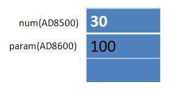

[TOC]

# ali

##命名规范


>各层命名规约

```java
//Service/DAO 方法前缀
get，list，count（统计值），insert/save（推荐），delete/remove（推荐），update

//领域模型命名规约
数据对象：    xxxDO（xxx为数据表名）
数据传输对象： xxxDTO（xxx为业务领域相关的名称）
展示对象：    xxxVO（xxx为网页名称）
POJO：       DO/DTO/BO/VO的统称，禁止命名成 xxxPOJO
```


##代码规范

> 避免在循环体中声明创建对象

```java
for (int i = 0; i < 100; i++) {
    Object obj = new Object();
}
```
```java
Object obj = null; //修改后
for (int i = 0; i < 100; i++) {
    obj = new Object();
}
```
> 避免 new Integer 实例化对象，推荐使用 Integer.valueOf()

```java
properties.put("CCSID", new Integer(5));

properties.put("CCSID", Integer.valueOf(5)); //修改后。会使用 IntegerCache，范围：[-128 ,127]
```
>推荐使用集合的 isEmpty() 代替 0 == collection.size()

```java
if (0 == imageSet.size()){}

if (imageSet.isEmpty()){} //修改后。比 size()速度快，后者是通过迭代集合得到，因为这样，随着元素数量增加，调用size（）变得越来越慢。
```

> 字符串比较时，将常量放在 equals() 方法的左侧

```java
if (str.equalsIgnoreCase("123")){} 

if ("123".equalsIgnoreCase(str)){} //修改后。避免 str 的空指针问题
```

>String.indexOf(char) is faster than String.indexOf(String)

```java
int index = str.indexOf("s");

int index = str.indexOf('s'); //修改后。速度更快
```


# JVM

## 栈堆方法区

> 栈的特点

- 方法执行的内存模型。`每个方法被调用都会创建一个栈帧`（存储局部变量、操作数、方法出口等）。
- `JVM为每个线程创建一个栈`，用于存放该线程执行方法的信息（实际参数、局部变量等）。
- 栈属于线程私有，不能实现线程间的共享！
- 栈的存储特性是“先进后出，后进先出”。
- 栈是由系统自动分配，速度快！栈是一个连续的内存空间（相比于堆）。

> 堆的特点

- 用于存储创建好的对象和数组（数组也是对象）。

- `JVM只有一个堆，被所有线程共享！`

- 堆是一个不连续的内存空间，分配灵活，速度慢!

>方法区（特殊的堆）的特点

- `JVM只有一个方法区，被所有线程共享！`
- 方法区实际也是堆，只是用于存储类、常量相关的信息！
- 用来存放程序中永远不变或唯一的内容（类信息{Class对象}、静态变量、字符串常量等）。

```java
public class Dog {
    private String name;

    public Dog(String name) {
        this.name = name;
    }
}

public class Student {
    public static Boolean gender = false;
    private Integer age;
    private String name;

    public Dog dog;

    public Student(int age, String name) {
        this.age = age;
        this.name = name;
    }

    public void play() {
        System.out.println("play with " + this.dog.name);
    }
}

public class Test {
    public static void main(String[] args) { //程序入口
        Student stu = new Student(18, "王");
        stu.dog = new Dog("Yello");
        stu.play();
    }
}
```


> 程序执行过程的内存分析

## 对象初始化

> 对于语句`”Person p = new Person(“zhangsan”,20);`在内存中究竟做了什么事？

- 1). 因为 new 用到了 Person.class，所以会先找到 Person.class 文件并加载到内存中。
- 2). 执行该类中的` 静态代码块`。
- 3). 在堆内存中开辟空间，分配内存地址。
- 4). 在属性进行`默认初始化`（string 类型默认为 null，int 默认为 0） 。
- 5). 对属性进行`显式初始化`（即定义类时，属性含有默认值 `private String name = “xiaowang”`） 。
- 6). 对对象进行`构造代码块`初始化（没有static修饰的代码块）。
- 7). 对对象进行`构造函数`初始化。
- 8). 在栈内存中生成变量 p，将`内存地址赋给`栈内存中的 p 变量。

> 对象调用成员过程，`p.setName(”lisi”)`的执行过程？

- 1). 上述代码执行完后， 在栈内存中存在变量 p1， 在堆内存中存在Person对象。其中name=”zhangsan”和 age=20，方法区存在 setName()方法。其中，栈内存中的变量 p1 指向堆内存中的 Person 对象。
- 2). 当执行 `p1.setNmae(“lisi”);`时，先在栈内存中生成 setName()方法中的两个变量 this.name 和 name。由于是变量 p1 调用 setName()方法，所以 this 指向的是变量 p1 指向的对象。
- 3). 所以，当执行完 setName()方法后，堆内存中的 name=”zhangsan”变为 name=”lisi”。

```java
static class A {
    B b = new B();

    A() {
        System.out.print("A");
    }
}

static class B {
    B() {
        System.out.print("B");
    }
}

static class C extends A {
    B b = new B();

    private C() {
        System.out.print("C");
    }

    public static void main(String[] args) {
        new C();
    }
    //实例化C类需调用父类构造方法，实例化B，输出B，输出父类A。
    //回到子类，实例化B输出B，输出本身C。最终结果：BABC
}
```

- 子类通过构造函数进行实例化时，会先调用父类的构造函数。如果没有显示的指明调用哪个父类构造时，`默认调用父类的无参构造`。
- 普通成员变量的`显示初始化`优先于构造方法。

##静态代码块

> 静态代码块 > main方法 > 构造代码块 > 构造函数
>
> 父类静态代码块、子类静态代码块、main、父类构造代码块、父类构造函数、子类构造代码块、子类构造数

**静态代码块**：在类中只使用 static 关键字声明的代码块。`每个静态代码块只会执行一次`，用于初始化类的属性。由于 JVM 在加载类时会执行静态代码块，所以静态代码块优先主方法执行。

**构造代码块**：在类中直接用{ }扩起来的代码块。`每次new对象时都会被调用`，执行顺序`优先于`所有的构造函数。作用：给所有的对象进行统一、共性的初始化。

**构造函数**：每个类都有一个默认的无参构造函数，这个构造函数的权限和类保持一致。作用：是给通过此构造函数（构造函数不止一种）new 的对象进行初始化。

```java
static class F {
    static {
        System.out.print("F-S{} ");
    }

    {
        System.out.print("F{} ");
    }

    F() {
        System.out.print("F() ");
    }

    public static void main(String[] args) {
        System.out.print("F-M() ");
        new S(); //F-S{} F-M() S-S{} F{} F() S{} S()
    }
}

static class S extends F {
    static {
        System.out.print("S-S{} ");
    }

    {
        System.out.print("S{} ");
    }

    S() {
        System.out.print("S() ");
    }
}
```

```java
static class Add {
    static {
        int i = 5; //局部变量，不会影响i值。
    } //执行顺序在静态变量初始化之后（即如果设为非局部变量，则会影响静态变量的值）。

    private static int i, j; 

    public static void main(String[] args) { //i++，先++再使用；++i，先使用再++
        i--; //输出：-1
        add();
        System.out.println(i + " - " + j); //输出：1-0
        System.out.println(i + j + ++i); //输出：3
    }

    private static void add() {
        j = i++ + ++i; //输出：0(0)+0(1)
        System.out.println(i + " - " + j); //输出：1-0
    }
}
```

- **栈内存：** 在`函数`中定义的一些`基本类型的变量`和`对象的引用变量`都在函数的栈内存中分配。


- **堆内存：** 用来存放所有`new创建的对象`和`数组的数据`。


- **常量池：** 存放`字符串常量`和`基本类型常量`（public static final）。它们永不改变。


# Object

## 基础规约

> toString()

```java
//默认返回：对象的类型名+@+内存地址值。---> 子类需要重写
public String toString() {
    return getClass().getName() + "@" + Integer.toHexString(hashCode());
}
```
> arraycopy()

```java

```

## 运算符

> `Math.round(double num);`函数是取整函数，只关注小数点后第一位小数值。

```java

```

> 保留两位有效小数（两种方式）

```sql

```


## 多态

>多态原理

```shell

```

> 抽象类和接口的异同？

```java

```

> java 只支持`单继承`，不支持多继承。 但支持`多层继承`和`多实现`。


```java

```

> this & super

- ​

```java

```

```java

```

> 方法传参，递遵循值传递原则（`传递的是值或引用的拷贝，不改变原有值`）。

```java

```

> 方法重载：`方法重载与方法的返回值类型无关`

```java

```

> 方法重写

```java

```

## Integer

> 基本数据类型：三大类，八小种。引用类型：类，接口，数组。

```java

```

> 装箱 & 拆箱

```java

```

> 使用标准

```java

```
```java

```

>`【强制】`所有的相同类型的包装类对象之间值的比较，全部使用 equals()。

```java

```

> `short s1 = 1; s1=s1+1; 和 s1+=1;`有无区别？

```java

```

> char 型变量中能不能存贮一个中文汉字? 

> 常用方法

```java

```

```JAVA
int j = i++; //先使用，再++

int l = ++i; //先++，再使用
```

```java

```

> 十进制 转 二进制：对十进制进行除2运算




# 2.基础阶段

## static

> static 方法是否可以调用非 static 方法？反之可以。

```

```

>静态变量 && 实例变量

**静态变量**：static 修饰，随着类的加载而分配内存空间，随着类的消失而消失。存在于方法区。

**实例变量**：随着对象的建立而分配内存空间，随着对象的消失而消失。存在于堆内存。

```java
class Test{
    static int staticNum = 0;
    int num = 0;
    
    Test(){
        staticNum++;
        num++;

        //对于 staticNum，全局唯一份。每实例化一个Test对象，staticNum 就加1
        //但是，对于 num，每实例化一个Test对象，就会重新分配一个，所以一直都是1
        sout(staticNum + " - " + num);
    }
}
```
##final

>final，finally，finalize

```java

```

```java

```

>字符串一经创建就不可改变 `final String`。以下代码，原始的 String对象 中的内容到底变了没有？

```java
String str = "Hello";
str = str + "world!";

没有改变。这段代码中，str 原始指向 "Hello"，对 str 进行了 + 操作运算之后，str 不再指向 "hello"，
而是指向 "Hello world!"，但字符串 "hello" 依然存在于内存之中，只是 str 这个引用变量不再指向它
```

> final修饰变量

```java

```


> 为什么内部线程中引用外部对象要加final修饰符呢

```java

```


##finally

> try 中的 return 语句和 finally 代码块执行的先后顺序？

```java
int num = 5;
try {
    // int _res = num;
    // return _res;
    return num + 1; //这一语句 等价为 上面两行语句，所以在 finally 块中对 num 进行操作将不起作用
} finally {
    num = num + 2; //6
    // return num + 2; //7 --> 若 finally 块中也有 return 语句，则以 finally 为主，即返回 7
}
```

## for

> `for(1初始化; 2(5)布尔表达式; 4更新){ 3 }` 等同于 `初始化; while(布尔表达式){ 更新; }`


```java
@Test
public void test() {
    int i = 0;
    for (print('a'); print('b') && (i < 2); print('c')) {
        i++;
        print('d');
    }
}
//输出结果为：a-bdc-bdc-b.（注意最后一个b）
```

```java

```

## switch

>

```java

```


## instanceof

> instanceof 关键字可以用来判断对象是否是一个类的一个实例。

```java

```


## Exception


>Exception 和 Error 都继承自 `Throwable` 类。是异常处理机制的基本组成类型。

```java

```

>Exception分类： RuntimeException（运行时异常）和 CheckedException（受检查异常，即编译器异常）。

```java

```

```java

```

```java

```
> throws & throw

```java

```

> 自定义异常 一般继承`RuntimeException`，待证 ？？？


# String

## 基础概念

> 字符串对象一旦在内存（堆）中创建，就无法修改。注意：

```

```

```java

```

```java

```

> 创建字符串，可直接使用双引号的方式。如需在堆中创建一个新的对象，可以选择构造函数的方式。

```java

```


## 常用方法

> `intern()`：①.将字符串字面量放入常量池（如果池没有的话）②.返回这个常量的引用。

```java

```


> 两个问题

- **Q1：** `String s = new String("hollis");`定义了几个对象。


- **Q2：** 如何理解`String`的`intern()`方法？

```java

```

> 常见测试

```java

```


> StringBuilder


|     类型      |    安全    |                            特点                            |
| :-----------: | :--------: | :--------------------------------------------------------: |
|    String     | `线程安全` | 直接进行字符串拼接，会产生大量中间字符串，并且时间消耗长。 |
| StringBuffer  |  线程安全  |                   支持同步锁，性能稍差。                   |
| StringBuilder | 线程不安全 |        单线程进行大量字符串操作时，推荐使用（√）。         |

```java
public void test() {
    String res = "";
    String str = "hello";
    
    for (int i = 0; i < 1000; i++) {
        res += str;
        
        //上一行代码，编译器最终会编译为类似下面的代码：
        //res = new StringBuilder(res).append(str).toString();
    }
}

//每次循环都需要创建一个 StringBuilder 对象（创建对象需要耗费时间和内存）。
//随着循环次数的增大，res字符串也就越长，把res中的字符复制到新建的 StringBuilder 中花费的时间也就越长。
//而且 StringBuilder(res).append(str).toString(); 会创建一个临时的字符串，随着循环次数的增加，
//这个操作花费的时间也会越来越长。总之，随着循环变量 i 的增大，每次循环会变得越来越慢。
```

## 其他API

> 字符串连接符 `+`

- 两边都是数值类型时，为运算符，即相加求和。
- 两边至少有一个为字符串类型时， 则为字符串连接符。底层原理 `StringBuilder.append()`。

> == 和 equals()


> switch中的String：`switch只支持 int 和 枚举类型`

```java
'char, byte, short, int, Character, Byte, Short, Integer, String, or an enum'
都可以隐式转换成int类型。其中，jdk1.7之后支持的 String，底层原理采用的是：先进行 hashCode() 比较，再进行 equals()比较（可能出现hash值碰撞）。 不支持 boolean 类型。
```

>length()

```java

```

> split()

```java

```
> reverse 字符串反转

```java
//方式1：借用StringBuilder
String str = "我是中华人民共和国公民";
StringBuilder reverse = new StringBuilder(str).reverse();
```
```java
//方式2：for循环
char[] chars = str.toCharArray();
StringBuilder sb = new StringBuilder();
for (int i = chars.length - 1; i >= 0; i--) {
    sb.append(chars[i]);
}
```

> replace()，replaceAll()，replaceFirst()


```java
str.replaceAll(".", "*"); //把字符串中所有字符转换成星号，"."在正则表达式中表示所有字符。
```

> 特殊空格1

```java
char char1 = ' '; //普通空格，ASCII值是32
char char2 = ' '; //特殊的空格，ASCII值为160
System.out.println((int) char1); //32
System.out.println((int) char2); //160
```

特殊空格是一个不间断空格(non-breaking space)，本质就是页面上`&nbsp;`所产生的空格，作用就是在页面换行时不被打断。

如果使用普通的空格，在换行时人名就会被打断，导致 Zhang 在第一行末尾，而 Xiaoming 跑到第二行开头。但是，如果使用不间断空格，则可以保持完整的人名在同一行的末尾（word中也有这种空格的使用）。

```java
页面某一行的末尾是一个人名Zhang Xiaoming //不间断空格

页面某一行的末尾是一个人名Zhang //使用普通空格
Xiaoming
```

**注意**：不间断空格有个问题，就是它无法被`trim()`所裁剪，也无法被正则表达式的`\s`所匹配，也无法被StringUtils的`isBlank()`所识别，也就是说，无法像裁剪普通空格那样移除这个不间断空格。

**正确做法**：利用不间断空格的Unicode编码（`\u00A0`）或者ASCII值（160）先进行替换，然后再`trim()`。

```java
String str = "abc ";
// String replace = str.replaceAll("\\u00A0", " ").trim(); //Unicode编码
String replace = str.replace((char) 160, ' ').trim(); //ASCII值
System.out.println(str.length() + " - " + replace.length()); //4 - 3
```

> 特殊空格2

对于全角空格，使用 trim() 方法也无法去除。必须利用其ASCII值（12288）。

```java
String str = "abc　";
String replace = str.replace((char) 12288, ' ').trim();
System.out.println(str.length() + " - " + replace.length()); //4 - 3
```


# Collection


##基础概念

> 数组 & 集合

数组： 固定长度（不能动态改变数组的长度），只能放一种类型。
集合： 可变长度， 可以存多种类型（在不考虑泛型的前提下）。

```java
List list = new ArrayList();
list.add(5); //集合放原始类型，其实是通过装箱拆箱来实现的。以前原生类型只能用数组，现在集合也可以了。
list.add("5");
list.add(new Integer(5));
```

> 双括号初始化

使用双括号初始化（double-brace syntax）快速建立并初始化，`简洁但效率低`。原因：

(1). 双大括号初始化方法生成的.class文件要比常规方法多

(2). 双大括号初始化方法运行时间要比常规方法长

(3). 可能造成内存泄漏

```java
//第一层花括号，定义了一个继承自 ArrayList 的匿名内部类
//第二层花括号，在匿名内部类中定义了一个 构造代码块
//通过 new 得到ArrayList的子类的实例化，然后上转型为ArrayList的引用
//得到的 list 实际上是ArrayList的子类的引用，但在功能上没有任何改变
//相比于常规标准方式进行初始化要简洁许多，但代码可读性相对会差
Map<Integer, String> map = new HashMap<Integer, String>() {{
    put(1, "a");
    put(2, "b");
    put(3, "c");
}};

List<String> list = new ArrayList<String>() {{
    add("a");
    add("b");
    add("c");
}};
```

## List & Set

> 二者特点

List： 排列有序（存入和取出的顺序一定相同，存在索引），元素可重复。
Set： 排列无序，元素不可重复。

区别：List的`contains()`和`remove()`底层调用`equals()`。但Set却是`hashCode()`和`equals()`。

>Set相关

```java
"Set如何保证元素唯一性？"
先比较 hashCode()，如果相同，继续比较 equals() 是否为同一个对象。

"Set的hashCode()相同，但equals()不同，怎么存储呢？"
在同样的哈希值下顺延（可认为哈希值相同的元素放在一个哈希桶中），也就是哈希一样的存一列。
```

>TreeSet排序是如何进行的呢？？`两种比较器同时存在，以集合自身比较器为准`

```java
//(1).元素实现接口Comparable
public class Dog implements Comparable<Dog> {
    @Override
    public int compareTo(Dog o) {
        if (this.name.compareTo(o.getName()) == 0) { //先比较 name,再比较 age
            return Integer.compare(this.age, o.getAge());
        } else {
            return this.name.compareTo(o.getName());
        }
    }
}
```

```java
//(2).集合添加比较器：当元素自身不具备比较性，或具备的比较性不满足要求时，让集合自身具备比较性
TreeSet<Dog> dogSet = new TreeSet<>(new Comparator<Dog>() {
    @Override
    public int compare(Dog o1, Dog o2) {
        int compare = o1.getName().compareTo(o2.getName()); //先比较 name，再比较 age
        if (compare == 0) {
            return Integer.compare(o1.getAge(), o2.getAge());
        } else {
            return compare;
        }
    }
});
```


> ArrayList & Vector & LinkedList

同步性：Vector 是同步的（线程安全），ArrayList线程序不安全
数据增长：当需要增长时，Vector 默认增长一倍，ArrayList 却是 0.5


## Iterator

> 禁止在 foreach 里进行元素的 remove/add 操作。

```java
public void test() {
    List<String> list = new ArrayList<>(Arrays.asList("a", "b", "c"));
    
    for (String s : list) {
        if ("a".equalsIgnoreCase(s)) {
            list.remove(s); //抛异常 -> ConcurrentModificationException
        }
    }
    System.out.println(JSON.toJSON(list));
}
```

- 增强for循环，其实是Java提供的语法糖，其实现底层原理还是借助 Iterator 实现。
- ArrayList不是线程安全的，因此在使用 Iterator 的过程中，如果有其他线程修改了list，那么将抛出ConcurrentModificationException，这就是所谓 fail-fast机制。

**fail-fast机制：主要是通过 modCount （修改次数）实现，对ArrayList内容的修改都将增加这个值。**

在 Iterator  初始化过程中会将这个值赋给迭代器的 expectedModCount。在迭代过程中，判断 modCount 跟 expectedModCount 是否相等，如果不相等就表示已经有其他线程修改了 list。

注意：modCount 声明为 volatile，保证线程之间修改的可见性。

> **方案1：** 直接使用普通for循环进行操作。因为普通for循环并没有用到 Iterator 的遍历。

```java
for (int i = 0; i < 1; i++) {
    if (list.get(i).equals("a")) {
        list.remove(i);
    }
}
```

> **方案2： ** 直接使用Iterator进行操作。

```java
Iterator<String> iterator = list.iterator();
while (iterator.hasNext()) {
    String next = iterator.next();
    if ("a".equalsIgnoreCase(next)) {
        // list.remove(next); //也会抛异常 -> ConcurrentModificationException
        
        iterator.remove();
    }
}
```
> **方案3： ** 使用 Jdk1.8 中提供的 filter 过滤

```java
list = list.stream().filter(x -> !x.equalsIgnoreCase("a")).collect(Collectors.toList());
```

> **【并发场景】方案4：** 直接使用 fail-safe 的集合类。这些集合容器在遍历时，`不是直接在集合内容上访问的，而是先复制原有集合内容，在拷贝的集合上进行遍历`。

```java
ConcurrentLinkedDeque<String> list = new ConcurrentLinkedDeque<>(Arrays.asList("a", "b", "c"));
for (String s : list) {
    if (s.equals("a")) {
        list.remove();
    }
}
```


## Map

Map 存储的是键值对。Map 集合中 Key 要保证唯一性。

Map 集合没有直接取出元素的方法，而是先将key集合或value集合转成 Set 集合，在通过迭代获取元素。

Map  存储元素使用 put() 方法， Collection  使用 add() 方法。

**Map/Set的key为自定义对象时，必须重写hashCode()和equals()**


## 常用方法

> NULL：高度注意 Map 类集合 K/V 能不能存储 null 值的情况

|       集合类        |      Key      |     Value     |    Super    |     说明     |
| :-----------------: | :-----------: | :-----------: | :---------: | :----------: |
|      Hashtable      | 不允许为 null | 不允许为 null | Dictionary  |   线程安全   |
| `ConcurrentHashMap` | 不允许为 null | 不允许为 null | AbstractMap | `分段锁技术` |
|       TreeMap       | 不允许为 null | `允许为 null` | AbstractMap |  线程不安全  |
|      `HashMap`      | `允许为 null` | `允许为 null` | AbstractMap |  线程不安全  |

> 去重：不应该使用 List.contains() 进行遍历

对于存储大量不重复元素，应该选用 Set 集合，利用其元素唯一性特点。而不应该选用 List，去使用 List.contains() 进行遍历，对比，去重操作。

> 初始化大小：集合初始化时，尽量指定初始值大小。大小应和实际存储元素个数相近，减少扩容次数。
> <https://www.jianshu.com/p/64f6de3ffcc1>

```java
List<String> list = new ArrayList<>(5); //默认16，加载因子0.75
```

> asList()：返回对象是 Arrays 内部类，并没有实现集合的修改方法（add，remove，clear）。

```java
List<String> asList = Arrays.asList("a", "b", "c");
// asList.add("d"); -> UnsupportedOperationException

ArrayList<String> list = new ArrayList<>(asList); //正解,先转换
list.add("d");
```
> subList()：返回的是 ArrayList 的内部类 SubList，本质是 ArrayList 的一个视图，对于 SubList 子列表的所有操作最终会反映到原列表上。

```java
ArrayList<String> list = new ArrayList<>(Arrays.asList("a", "b", "c"));
List<String> subList = list.subList(0, 2);

ArrayList<String> list1 = (ArrayList<String>) subList; //异常：ClassCastException
```
> foreach()：`Map遍历推荐使用 entrySet 集合`，而不是 keySet 方式进行遍历

```java
Map<String, String> map = new HashMap<String, String>() {{
    put("k1", "v1");
    put("k2", "v2");
}};

//(1).keySet() 其实遍历了 2 次
//一次是转为 Iterator 对象，另一次是从Map中取出 key 所对应的 value
for (String key : map.keySet()) {
    System.out.println(key + ":" + map.get(key));
}

//(2).entrySet() 只遍历一次。
//遍历1次就把 kV 都放到了 entry 中，效率更高。JDK8的 Map.forEach() 就是这个原理
for (Map.Entry<String, String> entry : map.entrySet()) {
    System.out.println(entry.getKey() + ":" + entry.getValue());
}

//(3).JDK8 -> Map.forEach()
map.forEach((k, v) -> System.out.println(k + ":" + v));
```
> sort()：JDK7 以上，Comparator 要满足自反性，传递性，对称性。不然 Arrays.sort()，Collections.sort()会报异常 IllegalArgumentException。所以，`对于基本数据类型，要采用其包装类的 Compare(x, y) 进行比较`。

```java
new Comparator<Person>() {
    @Override
    public int compare(Person o1, Person o2) {
        //return o1.getAge() > o2.getAge() ? 1 : -1; //没有处理相等的情况

        return Integer.compare(o1.getAge(), o2.getAge()); //推荐使用
    }
};
```

> 相互转化

```java
String[] strArray = {"a", "b", "c"};
List<String> list = Arrays.asList(strArray); //Array 转换 List

//【不推荐】直接使用 toArray() 无参方法，因为其返回值只能是 Object[]。
String[] array = list.toArray(new String[list.size()]); //List 转 Array
```

## 算法相关

> 冒泡排序

```java
int[] nums = {3332, 6367, 25623, 241, 12834};
for (int i = 0; i < nums.length - 1; i++) {

    // 第一趟排序考虑(0, 总趟数-0)
    // 第一趟排序过后，最后一位一定是最大的，不再考虑。即第二趟排序只需考虑(0, 总趟数-1)
    // 第三次为(0, 总趟数-2)....总结即：总趟数(length-1)减去趟次 (j)
    for (int j = 0; j < nums.length - i - 1; j++) {
        if (nums[j] > nums[j + 1]) { //升序
            int tmp;
            tmp = nums[j + 1];
            nums[j + 1] = nums[j];
            nums[j] = tmp;
        }
    }
}
Arrays.stream(nums).forEach(System.out::println); //升序排列
```

> 选择排序

```java
//首先，在未排序序列中找到最小（大）元素，存放到排序序列的起始位置
//然后，再从剩余未排序元素中继续寻找最小（大）元素，放到已排序序列的末尾。
//以此类推，直到所有元素均排序完毕

```

> 单词计数 & map值排序

```java
//(1).单词计数
String str = "我是中华人民共和国公民";
HashMap<Character, Integer> map = new HashMap<>();
char[] chars = str.toCharArray();
for (char aChar : chars) {
    // if (null == count) { //未统计到的字符
    //     map.put(aChar, 1);
    // } else {
    //     map.put(aChar, 1 + count);
    // }
    map.merge(aChar, 1, (a, b) -> b + a); //lambda简化
}
map.forEach((x, y) -> System.out.println(x + " - " + y));

//(2).map值排序
List<Map.Entry<Character, Integer>> list = new ArrayList<>(map.entrySet());
Collections.sort(list, (o1, o2) -> o1.getValue().compareTo(o2.getValue()));
// Collections.sort(list, Comparator.comparing(Map.Entry::getValue)); //lambda简化
System.out.println(JSON.toJSONString(list));
```


# 基本概念


## Collection


> map值排序：统计单词频率，并按照频率排序

```java
public void test() {
    String str = "asafaaffafaee";

    //(1).统计单词频率
    Map<Character, Integer> map = new TreeMap<>();
    char[] chars = str.toCharArray();
    for (char aChar : chars) {
        // Integer count = map.get(aChar);
        // if (null == count) {
        //     map.put(aChar, 1);
        // } else {
        //     map.put(aChar, count + 1);
        // }
        
        //aChar 表示要更新的key,1表示更新的大小，后面就是更新方法，表示原来a的value加 1
        //merge()的作用就是用某种方法更新原来的value值
        map.merge(aChar, 1, (a, b) -> a + b); //lambda简化
    }

    //(2).map值排序
    List<Map.Entry<Character, Integer>> list = new ArrayList<>(map.entrySet());
    Collections.sort(list, (o1, o2) -> o1.getValue().compareTo(o2.getValue()));
    // Collections.sort(list, Comparator.comparing(Map.Entry::getValue)); //lambda简化

    //[{"s":1},{"e":2},{"f":4},{"a":6}]
    System.out.println(JSON.toJSONString(list));
}
```


> HashMap & HashTable & ConcurrentHashMap

​    HashTable线程安全, 在多线程情况下, 同步操作能保证程序执行的正确性.
    但是, HashTable每次同步执行时,都要锁住整个结构.
    

    ConcurrentHashMap 正是为了解决这个问题而诞生的.
    ConcurrentHashMap 锁的方式是稍微细粒度的, 将hash表分为16个桶(默认值), 诸如get,put,remove等常用操作只锁当前需要用到的桶。
    原来只能一个线程进入, 现在却能同时16个写线程进入 (写线程才需要锁定,而读线程几乎不受限制), 并发性的提升是显而易见的!!!
    
    ConcurrentHashMap的'读取操作没有用到锁定',所以读取操作几乎是完全的并发操作.
    而'写操作锁定的粒度又非常细', 比起之前又更加快速(桶越多,表现越明显). '只有在求size等操作时才需要锁定整个表'

##HashMap & Hashtable


# IO

##IO流

`IO操作推荐使用：org.apache.commons.io`

> 文件拷贝：字节流 + 字符流

```java

```

```java

```

> 转换流：字节流转换成字符流 InputStreamReader()

```java

```

> 区别 close(); flush();


> 字符编码


```java

```

```java

```

## File

> file.getPath()，getAbsolutePath()，`getCanonicalPath() 推荐`

```java
File file = new File("..\\test1.txt");

```

> 常用方法

```java

```

## Properties

> 继承Hashtable，所以具有 map 集合的特点：`class Properties extends Hashtable`

```java

```


## Convert

> int，byte[] `大端模式：高位在前，低位在后。【常用模式】`

```java

```

```java

```


# Socket

Socket 就是为网络服务提供的一种机制，网络通信其实就是 Socket 间的通信。通信两端都是 Socket，数据在两个 Socket 间通过 IO 传输。

> 域名解析过程

在浏览器地址栏中输入<https://www.baidu.com/>后，系统会首先自动从Hosts文件中寻找对应的IP地址，一旦找到，系统会立即打开对应网页，如果没有找到，则系统会再将网址提交DNS域名解析服务器进行IP地址的解析。

本地Hosts文件所在位置：`C:\Windows\System32\drivers\etc`

配置本地Hosts文件，一方面可以加快网站的访问速度（配置网站对应的正确IP），另一方面可以阻止某些流氓软件的网络请求（配置网站的IP为127.0.0.1）。

> 网络模型

```sql
OSI七层模型        TCP/IP四层模型
------------------------------------
应用层
表示层            应用层 ---> http/https FTP
会话层
-------------------------------------
传输层            传输层 ----> TCP/UDP
-------------------------------------
网络层            网际层 ----> IP协议
--------------------------------------
数据链路层
物理层            主机至网络层
--------------------------------------
```

> InetAddress API使用

```java
// InetAddress inet = InetAddress.getLocalHost(); //本机
InetAddress inet = InetAddress.getByName("192.168.8.8"); //指定ip

String name = inet.getHostName(); //主机名
String ip = inet.getHostAddress(); //IP字符串
```

## UDP

UDP：面向无连接。数据包一次传输最大64K。不可靠，容易丢包，但是速度快。`例子：发短信`

TCP：需要先通过3次握手建立链接，所以是可靠协议，但效率稍低。传输数据量无限制。`例子：打电话`

>UDP通信

```java
public static void main(String[] args) throws Exception {
    ExecutorService pool = Executors.newCachedThreadPool();

    DatagramSocket ds = new DatagramSocket(7001); //数据包对象 DatagramSocket
    pool.execute(() -> sendMsg(ds, "192.168.8.7", 8001, "hello", "客户端-发送："));
    pool.execute(() -> recvMsg(ds, "客户端-接收："));

    DatagramSocket ds1 = new DatagramSocket(8001);
    pool.execute(() -> sendMsg(ds1, "192.168.8.7", 7001, "world", "服务端-发送："));
    pool.execute(() -> recvMsg(ds1, "服务端-接收："));
}
```

```java
// 发送消息
private static void sendMsg(DatagramSocket ds, String ip, int port, String msg, String mark) {
    byte[] buf = msg.getBytes();
    try {
        //发送数据包，数据包内容：数据的字节数组，目标ip，目标端口号
        ds.send(new DatagramPacket(buf, buf.length, InetAddress.getByName(ip), port));
        
        System.out.println(mark + msg);
    } catch (IOException e) {
        e.printStackTrace();
    }
}
```

```java
// 接收消息
private static void recvMsg(DatagramSocket ds, String mark) {
    while (true) {
        try {
            byte[] buf = new byte[4 * 1024];
            DatagramPacket dp = new DatagramPacket(buf, buf.length);
            ds.receive(dp); //接收数据包

            String host = dp.getAddress().getHostName(); //解析数据包
            int port = dp.getPort();
            String msg = new String(dp.getData(), 0, dp.getLength());

            System.out.println(mark + host + ":" + port + " - " + msg);
        } catch (Exception e) {
            e.printStackTrace();
        }
    }
}
```

## TCP

> TCP三次握手


```sql
A --> B: B在吗？           发送SYN-A同步包
B --> A: A在，B收到了吗？   解析，知道是A请求建立链接，发送ACK-A确认包 + SYN-B同步包
A --> B: B收到了,开始传输！  解析，知道B同意建立连接，并发送ACK-B同意建立连接
```


> 服务端

```java
public static void main(String[] args) {
    ExecutorService pool = Executors.newCachedThreadPool();
    try (ServerSocket server = new ServerSocket(8100)) {

        while (true) {
            Socket socket = server.accept(); //阻塞方法，接受客户端请求
            pool.execute(() -> recvMsg(socket)); //一个客户端一个线程去处理
        }
    } catch (IOException e) {
        e.printStackTrace();
    }
}

private static void recvMsg(Socket socket) {
    try (InputStream in = socket.getInputStream();
         OutputStream out = socket.getOutputStream()) {

        List<String> lines = IOUtils.readLines(in, "UTF-8"); //读取流中的每一行
        String join = StringUtils.join(lines, ""); //多行合并为一行
        System.out.println("S<-C：" + join);

        String recv = LocalDateTime.now().toString();
        IOUtils.write(recv, out, "UTF-8");
        System.out.println("S->C：" + recv);
    } catch (IOException e) {
        e.printStackTrace();
    }
}
```

> 客户端

```java
public static void main(String[] args) {
    int nThreads = 2;
    ExecutorService pool = Executors.newFixedThreadPool(nThreads);

    for (int i = 0; i < nThreads; i++) {
        int index = i;
        pool.execute(() -> sendMsg(index));
    }
}

private static void sendMsg(int index) {

    try (Socket socket = new Socket("127.0.0.1", 8100);
         InputStream in = socket.getInputStream();
         OutputStream out = socket.getOutputStream()) {

        String send = index + "";
        IOUtils.write(send, out, "UTF-8");
        System.out.println("C->S：" + send);

        List<String> lines = IOUtils.readLines(in, "UTF-8");
        String join = StringUtils.join(lines, "");
        System.out.println("C<-S：" + join);
    } catch (IOException e) {
        e.printStackTrace();
    }
}
```


# 算法相关

## 基础算法

> 某校为 x 个学生分配宿舍，每6个人一间房（不考虑性别差异），问需要多少房？

```java
int ceil = (int) Math.ceil(x / 6.0); //或者：(x+5)/6
```

> 让数值在 0～9 之间循环

```java
for (int i = 0; i < 1000; i++) {
    System.out.println(i % 10);
}
```