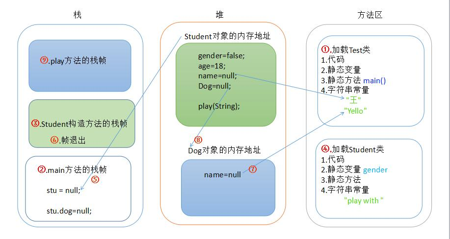
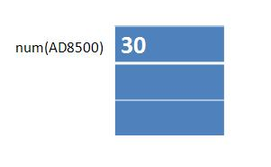
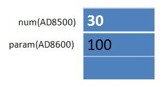
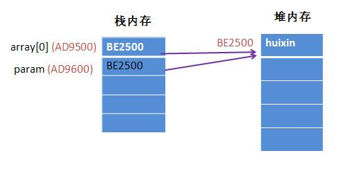
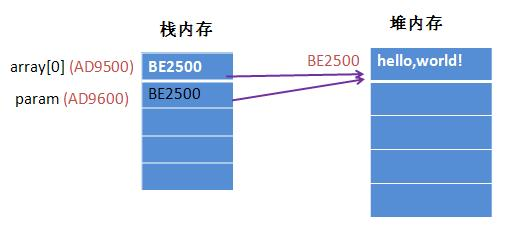
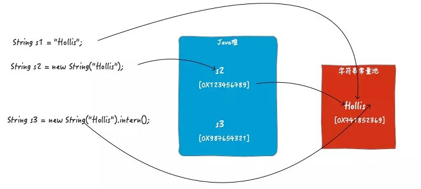

[TOC]


# 基础阶段

## 运算符

> ④种修饰符

```shell
private ---> 当前类
default ---> 当前类  当前包
protect ---> 当前类  当前包  子孙类
public  ---> 当前类  当前包  子孙类  其他包
```

> 数组拷贝

```java
public void test() {
    String[] src = {"a", "b", "c"};
    String[] dest = new String[2];

    //从原数组的第1个开始拷贝，目标数组从第0个位置开始接收，拷贝2个元素
    System.arraycopy(src, 1, dest, 0, 2);
    Arrays.stream(dest).forEach(System.out::println); //b-c
}
```

> `Long l = Math.round(double num);`返回值类型

```java
long l = Math.round(-1.45); //-1
long l = Math.round(-1.55); //-2 --> 同sql，x轴上向最近的整数取整

double d = Math.ceil(-1.45);  //-1.0
double d = Math.floor(-1.45); //-2.0 -->同sql，x轴上向最近（最远）的整数取整

double d = Math.floor(-10 / -3); //3.0
double d = Math.floor(-10 % -3); //-1.0 -->同sql，结果符号位和被除数（-10）一致。a%b = a-a/b*b
```

> 保留两位有效小数（2种方式）

```java
//round()返回与参数最接近的长整数，参数加1/2后求其 floor()
double val0 = (Math.round(1.1249 * 100)) / 100.0; //1.12
double val1 = (Math.round(1.1250 * 100)) / 100.0; //1.13
```

```java
String val0 = String.format("%.2f", 1.1249); //1.12
String val1 = String.format("%.2f", 1.1250); //1.13
```

> &，&&：都是逻辑 "与" 运算符，但后者为`短路运算`

```sh
'& ' 既是逻辑运算符，也是位运算符。既能操作布尔类型，也能操作数值类型
'&&' 只是逻辑运算符，只能操作 boolean 类型。'短路操作：左为false，则右不再计算'
```

```java
int x = 0;
if (1 < 0 && x++ > 0) {} //&& 短路运算，左边 false，所以右边不执行。即 x 依旧等于 0
```

> 其他运算符

```sh
# 7%4 = 3; 7%-4 = 3; -7%4 = -3; -7%-4 = -3; 7%9 = 7; -7%-9 = -7; -7%-1= 0
%(取模)      --> 先取绝对值，再进行运算。符号同左。

^(异或)      --> 左右同为 false，左右不同为 true。(和其他差别很大)

<<(位运算-左) --> 乘以 2 的移动位数次幂  #3<<2 = 3 * 2^2 =12
>>(位运算-右) --> 除以 2 ...........   #6>>2 = 6 / 2^2 =1

b=a++; #先使用，再++
```

##关键字

> switch - break

```shell
switch：参数是一个整数表达式。支持 byte，char,short,int（都可转换成 int），enum，String（jdk7新增）

break ：当遇到break，switch语句终止。如果没有break出现，程序会继续执行下一条case语句，'直到出现 break 语句'。
```

> for

```shell
for(初始化； boolean表达式; 更新){ }

'初始化'   ：对循环可能要用到的值进行初始化，相当于for循环内部的一个局部变量
'布尔表达式'：当表达式结果为 true 时继续执行，为 false 时终止循环
'更新'     ：在一次循环结束后进行更新，一般用于修改初始化值，从而影响循环布尔表达式的值
```

```java
int count = 0;
int num = 0;
for (int i = 0; i < 100; i++) {
    num = ++num;     //先自增，再使用
    count = count++; //先使用，再自增
}
System.out.println(num +" - "+ count); //100 - 0
```

```java
//如何跳出当前的多重嵌套循环？让外层的循环条件表达式的结果，可以受到里层循环体代码的控制。
public void test() {
    int arr[][] = {{1, 2, 3}, {4, 5, 6, 7}, {9}};
    
    boolean found = false;        
    for (int i = 0; i < arr.length && !found; i++) {
        for (int j = 0; j < arr[i].length; j++) {
            System.out.println("i =" + i + ", j = " + j);
            if (arr[i][j] == 5) {
                found = true;
                break;
            }
        }
    }
}
```
> final & finally & finalize

```shell
'finally'：异常处理的一部分，代码肯定会被执行，常用于释放资源。
'finalize'：Object类的一个方法，用于垃圾回收。
```

```shell
'final-类'：不可被继承，即 final 类没有子类。 final 类中的所有方法默认全是 final 方法。
'final-方法'：不能被重写。#其中 private 和 static 方法默认就是 final

'final-变量'：即常量。值类型，不能修改其值；引用类型，不能修改其对应的堆内存地址，即不能重新再赋值。
             #但是，该内存地址所指向的那个对象还是可以变的。就像你记住了人家的门牌号，但你不能管人家家里人员数量。
```

```java
public void doFinal(final int i, final StringBuilder sb) {
    // i = i + 1; //编译报错，因为final修饰的基本类型  --> 值不能变
    // sb = new StringBuilder(); //同上，修饰引用类型 --> 堆内存地址不能变,即引用不能变

    sb.append("java"); //编译通过 -> 引用变量所指向的对象中的内容，可以改变
}
```
```shell
#为什么内部线程中引用外部对象要加final修饰符呢？
被内部线程引用的外部对象受到外部线程作用域的制约，有其特定的生命周期。

当外部对象在外部线程中生命周期已经结束，而内部线程中还在持续使用，怎样解决问题？'内部线程变量要访问一个已不存在的外部变量？'
在外部变量前添加 final 修饰符，其实内部线程使用的这个变量就是外部变量的一个'复制品'，即使外部变量生命周期已经结束，内部复制品依然可用。
```

> instanceof

```java
A a = new B(); //class B extends A{}
System.out.println(a instanceof A); //true. instanceof 用来判断对象是否是一个类的一个实例
```

> 序列化

```sh
序列化就是一种用来处理对象流的机制，所谓对象流也就是将对象的内容进行流化。可以对流化后的对象进行读写操作，也可将流化后的对象传输于网络之间。
序列化是为了解决在对对象流进行读写操作时所引发的问题。

'序列化的实现'：将需要被序列化的类 implements Serializable 接口，该接口没有需要实现的方法，只是为了标注该对象是可被序列化的，
然后使用一个输出流(如：FileOutputStream)来构造一个ObjectOutputStream(对象流)对象，
接着，使用ObjectOutputStream对象的writeObject(Object obj)方法就可以将参数为obj的对象写出(即保存其状态)，要恢复的话则用输入流。
```
## 对象初始化

> 堆，栈，方法区

```sh
#栈
- JVM为每个线程创建一个栈，用于存放该线程执行方法的信息（实际参数、局部变量等）。
- 栈属于线程私有，不能实现线程间的共享！
- 栈是由系统自动分配，速度快！栈是一个连续的内存空间（相比于堆）。 
- 栈的存储特性是 "先进后出，后进先出"。
- 每个方法被调用都会创建一个栈帧（存储局部变量、操作数、方法出口等）。

#堆
- 用于存储创建好的对象和数组（'数组也是对象'）。
- JVM只有一个堆，被所有线程共享！
- 堆是一个不连续的内存空间，分配灵活，速度慢!

#方法区（特殊的堆）
- 方法区实际也是堆，用来存放程序中永远不变或唯一的内容（'类信息{Class对象}、静态变量、字符串常量等'）。
- JVM只有一个方法区，被所有线程共享！
```

```java
public class Dog {
    private String name;

    public Dog(String name) {
        this.name = name;
    }
}

public class Student {
    public static Boolean gender = false;
    private Integer age;
    private String name;

    public Dog dog;

    public Student(int age, String name) {
        this.age = age;
        this.name = name;
    }

    public void play() {
        System.out.println("play with " + this.dog.name);
    }
}
```

```java
public class Test {
    public static void main(String[] args) { //程序入口
        Student stu = new Student(18, "王");
        stu.dog = new Dog("Yello");
        stu.play();
    }
}
```



>对象初始化

```sh
#对于语句 Person p = new Person(“zhangsan”,20); 在内存中究竟做了什么事？

- 动态加载 Person.class 文件并加载到内存中。
- 静态字段初始化
- 静态代码块
- 在堆内存中开辟空间，分配内存地址。
- '普通字段的默认初始化' #（String默认 null，int默认 0）
- 开始执行构造函数的第一行，默认是 super(); 跳转到父类的构造函数
- '普通字段的显示初始化' # int age = 18
- 构造代码块
- 构造函数初始化
- 在栈内存中生成变量 p，将内存地址赋给栈内存中的 p 变量。

'静态字段 -> 静态代码块' -> 开辟堆内存 -> '普通字段默认初始化 -> 普通字段显示初始化 -> 构造代码块 -> 构造函数' ---> 赋值引用
```

```java
public class A {
    B b = new B();

    A() { System.out.print("A"); }
}

public class B {
    B() { System.out.print("B"); }
}

public class C extends A {
    B b = new B();

    C() { System.out.print("C"); }
}
```

```java
public static void main(String[] args) {
    new C(); //C 构造函数的第一行是 super(); 跳到父类 A中，A先进行 b=new B();即打印 B。再执行构造函数，打印 A
}            //执行完 A 的构造函数，跳转回 C 中，C也先进行 b=new B(); 即打印 B，然后再执行 C 的构造，打印 C ---> BABC
```

> 静态代码块

```sh
静态代码块 -> main -> 构造代码块 -> 构造函数

父类静态代码块 -> 子类静态代码块 -> main -> 父类构造代码块 -> 父类构造函数 -> 子类构造代码块 -> 子类构造数
```

```sh
'静态代码块'：只在jvm首次加载类时调用一次，优先于 main()执行。  #作用：初始化类的属性
'构造代码块'：每次 new 对象时都会被调用，优先于所有的构造函数。  #作用：给所有的对象进行统一、共性的初始化
'构造函数'  ：每个类都有一个默认的无参构造，访问权限和类保持一致。#作用：给通过此构造函数（构造函数不止一种）new 的对象进行初始化
```


##方法相关

> 方法传参：遵循`值传递`原则

```sh
#基本类型：传递的是该数据值的copy
所以，在方法内对值类型操作不会改变原有值

#引用类型：传递的是对象引用的copy，即堆内存的地址，真正的值是放在堆内存中。但指向的是同一个对象
所以，在方法内对引用类型进行'重新赋引用'，不会改变原有值。但是，'对原有引用的属性进行操作'时，可改变这个引用的属性值
```

```java
int num = 30;

public void add(int param) {
    param = 100;
}
```

```sh
当执行了 int num = 30; 这句代码后，程序在栈内存中开辟了一块地址为AD8500的内存，里边放的值是30

执行到add()方法时，程序在栈内存中又开辟了一块地址为AD8600的内存，将num的值30传递进来，此时这块内存里边放的值是30，
执行param = 100;后，AD8600中的值变成了100。

地址AD8600中用于存放param的值，和存放num的内存没有任何关系，无论你怎么改变param的值，实际改变的是地址为AD8600的内存中的值，
而AD8500中的值并未改变，所以num的值也就没有改变。
```

 

```java
String[] array = new String[] { "huixin" }; 

public void reset(String[] param) {
    param[0] = "hello,world!";
}
```

```sh
当程序执行了 String[] array = new String[] {"huixin"}; 后，程序在栈内存中开辟了一块地址编号为AD9500内存空间，
用于存放array[0]的引用地址，里边放的值是堆内存中的一个地址，示例中的值为BE2500，可以理解为有一个指针指向了堆内存中的编号为BE2500的地址。
堆内存中编号为BE2500的这个地址中存放的才是array[0]的值：'huixin'。

当程序进入 reset() 方法后，将array的值，也就是对象的引用BE2500传了进来。这时，程序在栈内存中又开辟了一块编号为AD9600的内存空间，
里边放的值是传递过来的值，即AD9600。可以理解为栈内存中的编号为AD9600的内存中有一个指针，也指向了堆内存中编号为BE2500的内存地址。
这样一来，栈内存AD9500和AD9600(即array[0]和param的值)都指向了编号为BE2500的堆内存。

在 reset() 方法中将param的值修改为'hello,world!'后，改变对象param的值实际上是改变param这个栈内存所指向的堆内存中的值。
param这个对象在栈内存中的地址是AD9600，里边存放的值是BE2500，所以堆内存BE2500中的值就变成了hello,world!。

程序放回main方法之后，堆内存BE2500中的值仍然为hello,world!，main方法中array[0]的值时，从栈内存中找到array[0]的值是BE2500，
然后去堆内存中找编号为BE2500的内存，里边的值是hello,world!。所以main方法中打印出来的值就变成了'hello,world!'
```



>重写 & 重载`（与返回值无关）`

```shell
'重写'：在子类中，出现和父类中一摸一样的方法。
'重载'：同一类中，出现多个方法名一样，但参数列表（参数类型 + 个数 + 顺序）不一样的方法。
```

```java
private + static + final 各修饰的方法，子类都不可重写。
其中，子类中的 private + static 同名方法，表示重新定义的方法，与父类无关。而子类的 final 方法则编译报错。

protected, default, public 对子类可见，可重写。'但重写时不能缩小修饰符范围'，即不能将父类 public 方法重写为 protected 方法。

//当方法被重写后，调用子类实例的同名方法时会优先调用子类的重写方法，不会再调用父类的方法。
```

```java
public class Parent {
    private void fun1(){}
    void fun2(){}
    protected void fun3(){}
    public static void fun4(){}
}

//fun1：私有权限，无法被子类继承，因此无法被重写
//fun2：包权限，因此在同一个包内继承时，可以重写，但其他包继承无法重写
//fun3：子类访问权限，因此无论如何继承，都可以被重写。
//fun4：虽然是公有的访问权限，但为静态方法，无法被继承。
```

```java
public void test() {
    Father father = new Son(); //多态思想

    //所有属性 和 静态方法 --> 看左，即和父类保持一致，调用父类的
    System.out.println(father.staticNum);
    System.out.println(father.num);
    father.doStatic(); //FATHER-STATIC

    //非静态方法 --> 若子类有重写，则调用子类方法。否则调用父类方法
    father.doSth(); //Father 或 SON
}
```

> 构造方法

```shell
'this'：子类调用【子类】的同名成员或方法。'super'： 子类调用【父类】的同名成员或方法。
构造方法间调用使用 this() 或 super(name) 语句，并且该语句只能放在构造函数第一行。

#对于子类的构造函数，不管无参还是有参，如果没有显示指明调用哪个父类构造时，默认调用父类无参构造。
#当编译器尝试在子类中往这两个构造方法插入 super() 方法时，因为父类没有默认无参构造方法，所以编译器报错。下面 DEMO
```

```java
class Super {
    private int id;
    public Super(int id) { this.id = id; } //没有无参构造
}

class Sub extends Super {    
    public Sub() { } //编译错误

    public Sub(int id) { } //编译错误
}
```

> static 方法

```shell
#static 方法不可以调用非 static 方法
因为非 static 方法是要与对象关联在一起的，必须创建一个对象后，才可以在该对象上进行方法调用。
而 static 方法调用时不需要创建对象，可以通过类直接调用。

在 static 方法中调用非 static 方法时，可能还没有实例化对象， 这就与以上逻辑不符。
```

```shell

```


#高级阶段

## Integer

>基本数据类型：三大类，八小种。引用类型：类，接口，数组。

```java
布尔类型     ： boolean （1byte，8位） //以前，误以为是 1bit，1位。好像是错误的。
字符类型     ： char （2byte，2字节，16位，[-128, 127]）
数值类型整型  : byte （1byte）， short （2byte）， int （4byte）, long （8byte） 
数值类型浮点型： float （4byte）， double （8byte）
```

> 使用标准

```shell
（1）所有 POJO 类属性必须使用'包装数据类型'，并且不要设定默认值。
不设初值是提醒使用者在使用时必须自己显式地进行赋值。任何 NPE（NullPointerExceptionrn） 问题，或入库检查，都由使用者来保证。

（2）RPC 方法的返回值和参数必须使用'包装数据类型'。

（3）所有的局部变量【推荐】使用基本数据类型。
```

```java
//【反例】设定默认值，会在更新其它字段时，附带更新此字段，导致创建时间被修改成当前时间
Date editTime = new Date();
```

```shell
（1）某业务的交易报表上显示成交总额涨跌情况。调用的RPC服务，调用不成功时返回默认值，页面显示：0%，这是不合理的，应该显示成：中划线-。
（2）搜索条件对象，一般 null 值表示该字段不做限制，而 0 表示该字段的值必须为0。
#所以，包装数据类型的 null 值，能够表示额外的信息，如：远程调用失败，异常退出等
```

> 装箱 & 拆箱

```java
Integer v1 = 100;
// Integer v1 = Integer.valueOf(100); //底层：自动装箱（触发IntegerCache）
Integer v2 = 200;
int sum = v1 + v2;
//int sum = v1.intValue() + v2.intValue(); //底层：自动拆箱
```

>缓存策略

```java
Integer m = 128, n = 128;
System.out.println(m.equals(n)); //true  --> 对比【值】
System.out.println(m == n);      //false --> 对比【内存地址】

Integer m1 = 127, n1 = 127;
System.out.println(m1.equals(n1)); //true
System.out.println(m1 == n1);      //true

//jvm启动时，预先创建 [-128,127] 之间整数的 Integer 实例，然后保存到缓存数组 IntegerCache
//以后，再创建此区间整数的包装类实例时，直接从缓存取，不会再 new 新对象，即使用同一个对象。

//所以，所有的相同类型的 包装类对象之间值的比较，全部使用 equals()
```

> 类型的自动提升

```sh
#short s1 = 1; s1=s1+1; 与 s1+=1; 二者的区别？

（1）s1本是 short 类型，与 1 相加，自动提升为 int 类型，即等号右侧的结果已是 int 类型，将 int 赋值给 short 将报类型转换异常。
（2）对于运算符 +=，编译器会做特殊处理，不会报错。
```

```sh
#int x = 10; double res = (x > 10) ? 9.9 : 9; 结果 res 为何？

程序将计算后的结果，自动提升为两者之间较大的数据类型，即 double 类型： 9.0。
```

```java
float f = 22.2; //22.2 为double类型，赋值给float类型需要进行强制类型转换，否则无法通过编译
int i = 0.0;    //0.0 虽然看似是0，但是表示的是double类型，赋值给int类型时同样需要强制类型转换，否则无法通过编译

double d0 = 2;  //int 类型自动提升为 double 类型，编译通过
Double d1 = 2;  //但是，包装类Double接收 int 时，不会进行自动类型转换，因此无法通过编译
```

> char 类型存储中文

```sh
char 类型变量用来存储 Unicode 编码的字符集，Unicode 编码字符集中包含了汉字。所以，char 型变量中当然可以存储汉字。
不过，如果某个特殊的汉字没有被包含在 Unicode 编码字符集中，那么，这个 char 型变量中就不能存储这个特殊汉字。

'补充：Unicode 编码占用两个字节，char 类型的变量也占两个字节'
```

> 进制转换

```java
//八进制以 0 开头，十六进制以 0x 开头。都是数字 0，而不是字母 O

int i = 0144; //100，八进制表示方式: 4*8^0 + 4*8^1 + 1*8^2 = 4+32+64
int i = 0x64; //100，十六进制表示方式: 4*16^0 + 6*16^1 = 4+96

String octal = Integer.toOctalString(100); //144，十进制转八进制
String hex = Integer.toHexString(100);     //64，十进制转十六进制
```

## String

> 字符串对象一旦创建（字符串常量池中），就无法修改。

```shell
String类的所有方法都没有改变字符串本身的值，而是返回了一个新的String对象。

'String对象不可变（√）' 与 'String对象的引用变量不可变（×）'。

final 类不一定线程安全，如: StringBuilder。
#常见 final 类：LocalDateTime，StringBuffer，StringBuilder（非线程安全），Integer等。
```

```shell
#String 不可变特性的应用
'高效性' ：不可变性能保证其 hashcode 永远保持一致，不需要重新计算。这就使得字符串很适合作为 Map 中的 Key，字符串的处理速度要快过其它的键对象。
'安全性' ：String被广泛的使用在其他Java类中充当参数。比如网络连接、打开文件等操作。如果字符串可变，那么类似操作可能导致安全问题。
'线程安全'：因为不可变对象不能被改变，所以他们可以自由地在多个线程之间共享。不需要任何同步处理。
```

> 字符串常量池

```sh
#Java为了避免产生大量的String对象，设计了一个字符串常量池。
工作原理是这样的，创建一个字符串时，JVM首先为检查字符串常量池中是否有'值相等'的字符串，如果有，则不再创建，直接返回该字符串的引用地址；
如果没有，则创建，然后放到字符串常量池中，并返回新创建的字符串的引用地址。

当遇到 'new String("Hollis");' 时，还会在内存（不是字符串常量池中，而是在堆里面）上创建一个新的String对象，
存储"hollis"，并将内存上的引用地址返回。
```

```sh
字符串常量池中的对象是'在编译期确定'，在类被加载时创建。如果类加载时，该字符串常量在常量池中已存在，那就跳过，不会重新创建一个。

与之相反，堆中的对象是'在运行期才确定'，在代码执行到 new 的时候创建的。
```

> `intern()`：①.将字符串字面量放入常量池（如果池中没有的话）②.返回这个常量的引用

```java
String s1 = "Hollis"; 
String s2 = new String("Hollis");
String s3 = new String("Hollis").intern();

System.out.println(s1 == s2); //false
System.out.println(s1 == s3); //true
```

```sh
#如何理解 String 的 intern()方法？
可以简单的理解 s1 和 s3 做的事情是一样的。
都是定义一个字符串对象，然后将'字符串字面量'保存在常量池中，并把这个'字面量的引用'返回给定义好的对象引用。

对于 s3，在不调 intern()情况，s3指向的是JVM在堆中创建的那个对象的引用的（如图中的s2）。
但是当执行了 intern()方法时，s3将指向字符串常量池中的那个字符串常量。
```

```sh
#String s = new String("hollis"); 定义了几个对象？
先在字符串常量池中查找是否含有'值相同'的字符串常量，然后再在内存中（堆）创建一个String对象
```



> 字符串拼接

```java
String s1 = "abc";
String s2 = "ab" + "c";

String s3 = "ab";
String s4 = s3 + "c";

System.out.println(s1 == s2); //true
System.out.println(s1 == s4); //false
```

```sh
对于'字符串常量相加'的表达式，不是等到'运行期'才去进行加法运算处理，而是在'编译期'直接将其编译成一个这些常量相连的结果。
因此，String s2 = "ab" + "c"; 可转化为 String s2 = "abc"; 但是， s4 并不是字符串常量相加，不能转化。
s4 底层是使用 new StringBuilder().append(s3).append("c").toString(); 所以，s1 != s4
```

> StringBuilder

```java
//内部拥有一个数组用来存放字符串内容。当进行字符串拼接时，直接在数组中加入新内容，并自动维护数组的扩容，不会产生中间字符串。

String res = str0 + str1;
String res = new StringBuilder(str0).append(str1).toString(); // + 的底层原理
```

```sh
String          #线程安全     直接进行字符串拼接，会产生大量中间字符串，并且时间消耗长。
StringBuffer    #线程安全     支持同步锁，性能稍差。
StringBuilder   #线程不安全   单线程进行大量字符串操作时，推荐使用（√）。
```

```sh
#循环中拼接字符串
每次循环都需要创建一个 StringBuilder 对象（创建对象需要耗费时间和内存）。
随着循环次数的增大，res字符串也就越长，把res中的字符复制到新建的 StringBuilder 中花费的时间也就越长。
而且，StringBuilder(res).append(str).toString(); 会创建一个临时的字符串，随着循环次数的增加，
这个操作花费的时间也会越来越长。总之，随着循环变量 i 的增大，每次循环会变得越来越慢。
```

> 字符串替换

```sh
replace();      #参数是 char 和 CharSequence，即支持字符和字符串的替换
replaceAll();   #参数是 regex，即基于正则表达式的替换
replaceFirst(); #参数也是 regex，但不同的是只替换第一个，即基于正则替换第一个满足条件的
```


## 枚举

>`java.lang.Enum` 是一个抽象类，默认有两个属性：name + ordinal

```java
public enum EnumTest {    
    MON, TUE, WED, THU, FRI, SAT, SUN; 
    
    // new Enum<EnumTest>("MON", 0);
    // new Enum<EnumTest>("TUE", 1);
    // ...
}
```

```java
枚举类型使用关键字 enum，每个枚举值都是 java.lang.Enum 的子类（java.lang.Enum 是一个抽象类）。

枚举类型符合通用模式 Class Enum<E extends Enum<E>>，而 E 表示枚举类型的名称。
枚举类型的每一个值都将映射到 protected Enum(String name, int ordinal) 构造函数中。
每个值的名称都被转换成一个字符串，并且序数设置表示了此设置被创建的顺序。

所以，以上的枚举类，实际上调用了 7 次 Enum(String name, int ordinal)：
```

```java
EnumTest sun = EnumTest.SUN;
System.out.println(sun.name() + "-" + sun.ordinal()); //SUN-6
```

> 枚举自定义属性和方法

```java
@Getter //只能有 get
@NoArgsConstructor
@AllArgsConstructor
public enum EnumTest {
    MON(1, "周一"), TUE, WED, THU, FRI, SAT, SUN(7, "周末");

    private Integer code;
    private String msg;
}
```

```java
EnumTest[] values = EnumTest.values();
for (EnumTest value : values) {
    System.out.println(value.getCode() + "-" + value.getMsg() + "-" + value.ordinal()); //7-周末-6
}
```

> 总结：`switch 底层只支持 int + 枚举(底层也是int)`

```java
可以把 enum看成是一个普通的 class，它们都可以定义一些属性和方法。
不同之处是：enum 不能使用 extends 关键字继承其他类，因为 enum 已经继承了 java.lang.Enum（java是单一继承）。
```

## 异常

> Throwable

```shell
#Throwable 有两个子类：Error 和 Exception
Error    ：程序无法处理的系统错误，一般指与虚拟机相关的问题，建议程序终止。常见：'内存溢出，深递归导致栈溢出等'。
Exception：程序可以处理的异常，应该捕获并进行相应的处理。
```

> Exception

```sh
#CheckedException：编译期异常。编译时期就会检查，不处理则编译不通过
#不是具体的java类，是指 RuntimeException 以外的异常，类型上属于Exception类及其子类
IOException；SQLException；InterruptedException；ParseException（日期格式化异常），ClassNotFoundException（反射）
```

```sh
#运行时异常（RuntimeException）：在运行时期，检查异常。在编译时期，不处理也不会报错。
空指针；类型强制转换（ClassCastException）；除数为0；数组越界；数字格式（String转数字）；非法参数异常

#java.lang.IllegalArgumentException: Non-positive period.
Timer timer = new Timer();
timer.schedule(timerTask, new Date(), 0);

Arrays.asList("a", "b").add("c"); #java.lang.UnsupportedOperationException
list.forEach(x -> {if("b".equals(x)){ list.add("c"); }}); #ConcurrentModificationException
```

>异常处理：`try-catch 比 if 更耗性能`

```java
throw ：用在'方法体内'，用来抛出一个异常对象，将这个异常对象传递到调用者处，并'结束'当前方法的执行
throws：用在'方法声明'，用于表示当前方法不处理异常，而是提醒该方法的调用者来处理异常（抛出异常）

try-catch ：捕获异常，对异常进行针对性的处理。 try 和 catch 不能单独使用，必须连用
finally   ：finally代码块中存放的代码无论异常是否发生，都会执行。如释放IO资源，数据库连接，网络连接等
```

>注意事项

```sh
如果父类抛出了多个异常 ,子类覆盖父类方法时,只能抛出相同的异常或者是他的子集
父类方法没有抛出异常，子类覆盖父类该方法时也不可抛出异常。此时子类产生该异常，只能捕获处理，不能声明抛出（如，run方法）

当多异常处理时，捕获处理，前边的类不能是后边类的父类
在 try/catch 后可以追加 finally 代码块，其中的代码一定会被执行，通常用于资源回收

#finally 代码块中，如果有 return 语句，永远返回 finally 中的结果，避免该情况
```

```java
private int doWork() {
    try {
        int i = 1 / 0;
        System.out.println("结果为: " + i); //不执行。抛出异常，直接跳出
    } catch (ArithmeticException e) {
        System.out.println("被除数为0");    //会执行。捕获异常的'就近原则'
        return 0;
    } catch (RuntimeException e) {
        System.out.println("捕获大异常");   //不执行。异常只会被捕获一次
        return 1;
    } finally {
        System.out.println("finally");    //肯定执行。最终结果返回：2
        return 2;
    }
}
```
> 自定义异常：`extends RuntimeException`

```sh

```

## 接口

> 接口的变迁

```java
public interface IMyInterface {
    //java7 --> 只能声明 全局常量 和 抽象方法
    /*public static final*/ int STATIC_NUM = 7; //变量的默认修饰符，即全局常量

    /*public abstract*/ void method();          //方法的默认修饰符

    //java8 --> 声明 静态方法 和 默认方法
    static void staticMethod() {
        System.out.println("java8-静态方法");
    }

    default void defaultMethod() {
        System.out.println("java8-默认方法");
    }

    //java9 --> 声明 私有方法（静态和非静态两种）
    private void privateMethod() {
        //当有多个 java8的静态方法和默认方法时，可以将冗余代码提取到通用的私有方法中
        System.out.println("java9-私有方法");
    }

    private static void privateStaticMethod() {
        System.out.println("java9-私有静态方法");
    }
}
```

> `类优先原则`：当父类和父接口（default方法）中都实现了相同的方法时，应该以父类中的方法优先。

```java
public class FatherClass {
    public void sayHello() {
        System.out.println("say hello");
    }
}
```

```java
public interface IFatherInterface {
    default void sayHello() {
        System.out.println("default say hello");
    }
}
```

```java
public class Test extends FatherClass implements IFatherInterface {
    public static void main(String[] args) {
        Test test = new Test();
        test.sayHello(); //输出："say hello"
    }
}
```

> `接口冲突`：当实现多个接口，且每个接口中都有同名的 default 方法，就会报错。必须手动选择一个 default 方法作为实现。

```java
public interface IFatherInterface1 {
    default void sayHi() {
        System.out.println("默认方法-1");
    }
}
```

```java
public interface IFatherInterface2 {
    default void sayHi() {
        System.out.println("默认方法-2");
    }
}
```

```java
public class Test implements IFatherInterface1, IFatherInterface2 {
    @Override
    public void sayHi() {
        IFatherInterface2.super.sayHi(); //手动指定
    }

    public static void main(String[] args) {
        Test test = new Test();
        test.sayHi();
    }
}
```


# IO流

## IO

> 文件拷贝：字节流 + 字符流

```sh
按流向        ：输入流，输出流。
按操作数据     ：字节流 （如音频，图片等），字符流（如文本）。

字节流的'抽象基类'：InputStream，OutputStream。字符流的'抽象基类'：Reader，Writer。
```

```java
try (BufferedInputStream bis = new BufferedInputStream(new FileInputStream(src));
     BufferedOutputStream bos = new BufferedOutputStream(new FileOutputStream(dest))) {
    int len;
    byte[] buf = new byte[1024 * 4]; //字节流
    while (-1 != (len = bis.read(buf))) {
        bos.write(buf, 0, len);
    }
} catch (IOException e) {
    System.out.println("系统找不到指定的文件：" + src);
}
```

```java
try (BufferedReader br = new BufferedReader(new FileReader(src));
     BufferedWriter bw = new BufferedWriter(new FileWriter(dest))) {
    String line;
    while (null != (line = br.readLine())) { ///如果已到达流末尾，则返回 null
        bw.write(line);
        bw.newLine(); //由于 readLine()方法不返回行的终止符，所以手动写入一个行分隔符

        bw.flush(); //只要用到缓冲区技术，就一定要调用 flush() 方法刷新该流中的缓冲
    }
} catch (IOException e) {
    System.out.println("系统找不到指定的文件：" + src);
}
```

> 转换流：字节流 ---> 字符流

```java
BufferedReader br = new BufferedReader(new InputStreamReader(new FileInputStream(filePath)));
```

> 字符编码

```sh
GBK   ：占用两个字节，比 GB2312 编码多了很多汉字，如"镕"字。
UTF-8 ：Unicode一种具体的编码实现。是一种变长编码方式，使用 1-4 个字节进行编码，有利于节约网络流量。
```

```sh
#UTF-8编码规则
① 对于单字节的符号，字节的第一位设为0，后面7位为这个符号的unicode码。因此对于英语字母，UTF-8编码和ASCII码是相同的。
② 对于n字节的符号，第一个字节的前n位都设为1，第n+1位设为0，后面字节的前两位一律设为10。剩下的没有提及的二进制位，全部为这个符号的unicode码。

假如有个字符占用3个字节，则：第一个字节以 1110 开始，第二三个字节以 10 开始。
```

```java
byte[] bytes = "联通".getBytes("GBK");
for (byte aByte : bytes) {
    // 11000001 10101010 11001101 10101000 --> 两个汉字，4个字节
    System.out.println(Integer.toBinaryString(aByte & 255));
}
```

## File

> 获取文件路径：`getCanonicalPath()`

```java
//返回定义时的路径，可能是相对路径，也可能是绝对路径，这个取决于定义时用的是相对路径还是绝对路径。
//如果定义时用的是绝对路径，那么结果跟getAbsolutePath()一样
file.getPath(); // ..\test1.txt
```

```java
//返回的是定义时的路径对应的相对路径，但不会处理"."和".."的情况
file.getAbsolutePath(); // F:\sp_project\spring\..\test1.txt
```

```java
//返回的是规范化的绝对路径，相当于将getAbsolutePath()中的"."和".."解析成对应的正确的路径
file.getCanonicalPath(); // F:\sp_project\test1.txt
```

> 常用方法

```java
boolean Mkdir();    //用于创建单层目录
boolean Mkdirs();   //.......多.....

boolean renameTo(); //重命名
```

##Properties

> `class Properties extends Hashtable` 线程安全

```java
String filePath = "application.properties";
Properties properties = new Properties();
InputStream in = getClass().getClassLoader().getResourceAsStream(filePath);
if (null == in) {
    System.out.println("配置文件不存在：" + filePath);
} else {
    try {
        properties.load(in);
        String property = properties.getProperty("server.port", "8080"); //arg2: 默认值
        System.out.println("读取配置：" + property);
    } catch (IOException e) {
        e.printStackTrace();
    }
}
```

## Convert

> int，byte[] `大端模式：高位在前，低位在后。【常用模式】`

```java
public static byte[] int2Bytes(int value, int len) {
    if (len > 4 || len <= 0) throw new RuntimeException("int 最大长度4个字节");

    byte[] bytes = new byte[len];
    for (int i = 0; i < len; i++) {
        bytes[i] = (byte) ((value >> 8 * (len - 1 - i)) & 0xFF);
    }
    return bytes;
}
```

```java
public static int bytes2Int(byte[] bytes) {
    byte[] dest = new byte[4];
    System.arraycopy(bytes, 0, dest, 4 - bytes.length, bytes.length);
    return (dest[0] & 0xFF) << 24
            | ((dest[1] & 0xFF) << 16)
            | ((dest[2] & 0xFF) << 8)
            | (dest[3] & 0xFF << 0);
}

```

> int，byte[] `小端模式：低位在前，高位在后`

```java
public static byte[] int2Bytes(int value, int len) {
    if (len > 4 || len <= 0) throw new RuntimeException("int 最大长度4个字节");
    
    byte[] bytes = new byte[len];
    for (int i = 0; i < len; i++) {
        bytes[i] = (byte) ((value >> 8 * i) & 0xFF);
    }
    return bytes;
}

```

```java
//offset: 从数组的第offset位开始
public static int bytes2Int(byte[] bytes, int offset) {
    return (bytes[offset + 0] & 0xFF)
            | ((bytes[offset + 1] & 0xFF) << 8)
            | ((bytes[offset + 2] & 0xFF) << 16)
            | ((bytes[offset + 3] & 0xFF) << 24);
}

```

> int，Hex

```java
public static String int2Hex(int value) {
    return Integer.toHexString(value);
}
```

```java
private static int hex2Int(String hexString) {
    return Integer.parseInt(hexString, 16);
}
```

> String，Hex

```java
public static String string2Hex(String value) {
    StringBuilder hexString = new StringBuilder();
    for (char aChar : value.toCharArray()) {
        hexString.append(Integer.toHexString(aChar));
    }
    return hexString.toString();
}
```

> String，byte[]

```java
byte[] bytes = "hello".getBytes(Charset.forName("utf-8"));
```

```java
String s = new String(bytes, Charset.forName("utf-8"));
```

> 校验和

```java
//第13位 -> 校验和 -> 前面所有字节的异或
data[13] = data[0];
for (int i = 1; i < 13; i++) {
    data[13] = (byte) (data[13] ^ data[i]);
}
```


# Reflect

## 创建对象

>（1）new创建：传统方式，必须预先知道要使用的类。引用类改变，就必须修改源码。

```java
Person person = new Person();
```

> （2）Cloneable方式：不推荐

```java
public class Person implements Cloneable{} //实现克隆接口

Person clone = (Person) person.clone();
```

> （3）反射方式：动态创建，效率相对低下，耗时是传统方式的 `3` 倍

```java
//先获取 clazz 对象（4种方式，常用1和2），再创建此 clazz 对象所表示的类的一个新实例
Class<?> clazz = Class.forName("com.example.reflect.Person"); //1
Class<?> clazz = getClass().getClassLoader().loadClass("com.example.reflect.Person"); //2
Class<? extends clazz> clazz = new Person().getClass(); //3
Class<Person> clazz = Person.class; //4

Object instance = clazz.newInstance(); //创建实例。当没有无参构造时，将报错
```

## 常用方法

> 构造器

```java
aClass.getConstructors();        //构造器：public
clazz.getDeclaredConstructors(); //构造器：all
```

```java
Constructor<?> constructor = clazz.getConstructor();
Person p = (Person) constructor.newInstance(); //等同于 new Person();

Constructor<?> constructor = aClass.getConstructor(String.class, Integer.class);
Object instance = constructor.newInstance("li", 18); //new Person("li", 18);
```

> 属性

```java
//public static String city;
Field city = aClass.getField("city"); //static -> 不依赖对象，传参 null
city.set(null, "Beijing");
System.out.println(city.get(null));

//public Boolean gender;
Field gender = aClass.getField("gender"); //non static --> 依附于对象 p1
Object p1 = aClass.newInstance();
gender.set(p1, true);
System.out.println(gender.get(p1));

//private Boolean young;
Field young = aClass.getDeclaredField("young"); //private --> 依附于对象，并暴力访问
Object p2 = aClass.newInstance();
young.setAccessible(true); //暴力膜
young.set(p2, true);
System.out.println(young.get(p2));
```

> 方法

```java
//public static String staticHello() {}
Method staticHello = aClass.getMethod("staticHello");
Object invoke = staticHello.invoke(null); //invoke为返回值; 调用 --> 不依赖对象

//public String publicHello(String name, Integer age) {}
Method privateHello1 = aClass.getMethod("publicHello", String.class, Integer.class);
Object p3 = aClass.newInstance();
invoke = privateHello1.invoke(p3, "li", 20); //依赖对象

//private String privateHello() {}
Method privateHello = aClass.getDeclaredMethod("privateHello");
privateHello.setAccessible(true);
Object p0 = aClass.newInstance();
Object invoke = privateHello.invoke(p0); //依赖对象 + 暴力膜
```

> main方法怎样传递参数？

```shell
把一个字符串数组作为参数传递到 invoke()，jvm怎么解析？？

按照jdk1.5，整个数组是一个参数； jdk1.4数组中的每一个元素是一个参数。
jdk1.5肯定没问题，但对于jdk1.4则会将字符串数组打散成一个个字符串作为参数，就会出现参数个数异常。
```

```shell
#正确做法
（1）将字符串数组转换成 Object 对象
（2）将字符串数组作为 Object 数组的一个元素
```

```java
Class<?> clazz = this.getClass().getClassLoader().loadClass("com.example.reflect.Person");
Method helloArray = clazz.getMethod("main", String[].class); //参数类型: String[].class

helloArray.invoke(null, (Object) new String[]{"aaa", "bbb"}); //正确1
// helloArray.invoke(null, new Object[]{new String[]{"aaa", "bbb"}}); //正确2

// helloArray.invoke(null, new String[]{"aaa", "bbb"}); //错误写法
```


# 常见问题


## 概念区分

> ==，equals

```sh
#System.out.println(2 == 2.0); //true（类型转换？）
当比较的是'基本数据类型'时，比较的是值
当比较的是'引用数据类型'时，比较的是地址值
```

```sh
#equals
不能用于基本数据类型的比较
当比较的是引用数据类型时，默认也是比较地址值（即'调用=='）。
只不过像String、Date、File、包装类等都重写了Object类中的 equals()。实际开发中，常常需要根据业务需要重写 equals()。
```

```java
public boolean equals(Object obj) { //Object 中的方法
    return (this == obj);
}
```

> 抽象类 & 接口

```sh
二者的定义 #抽象类使用关键字 abstract，接口使用 interface
共同点    #不能实例化；用于被其他类实现和继承，以多态的方式使用；都可以包含抽象方法
```

```sh
#不同点   单继承，多实现
接口不能包含构造器。       抽象类可以包含构造器（让抽象类的子类调用这些构造器来完成属于抽象类的初始化操作）
接口不能包含初始化代码块。  抽象类可以包含初始代码块（静态代码块和非静态代码块）

接口只能定义静态常量，不能定义普通成员变量。    抽象类既可以定义普通成员变量，也可以定义静态常量
接口只包含抽象方法、静态方法和默认方法（java8新增），不能为普通方法提供方法实现。     抽象类完全包含普通方法
```

> 静态变量 & 实例变量

```sh
'静态变量'：static 修饰，随着类的加载而分配内存空间，随着类的消失而消失。存在于'方法区'，被类的所有实例共享
'实例变量'：随着对象的建立而分配内存空间，随着对象的消失而消失。存在于'堆内存'
```

```java
class Test{
    Test(){
        staticNum++; //静态变量
        num++;       //实例变量

        //对于 staticNum，全局唯一份。每实例化一个Test对象，staticNum 就加1
        //但是，对于 num，每实例化一个Test对象，就会重新分配一个，所以一直都是1
        sout(staticNum + " - " + num);
    }
}
```

>

```sh

```

> int & Integer

```sh
int 是java提供的8种原始数据类型之一，默认值为0。
Integer是java为 int 提供的封装类，默认值为 null，即 Integer 可以区分出未赋值和值为0的区别，int 则无法表达出未赋值的情况，
例如，要想表达出没有参加考试和考试成绩为0的区别，则只能使用 Integer。

另外， Integer 提供了多个与整数相关的操作方法，例如，将一个字符串转换成整数，Integer中还定义了表示整数的最大值和最小值的常量。
```

```java
String str = num + "";      //速度最慢. new StringBuilder()
str = String.valueOf(num);
str = Integer.toString(num);

num = Integer.parseInt(str);
num = Integer.valueOf(str);
```

>重写 & 重载`（与返回值无关）`

```shell
'重写'：在子类中，出现和父类中一摸一样的方法。子类对象调用此方法时，将调用子类中的定义，对它而言，父类中的定义如同被"屏蔽"了。
'重载'：同一类中，出现多个方法名一样，但参数列表（参数类型 + 个数 + 顺序）不一样的方法。

方法的重写和重载是'Java多态性'的不同表现。重写是父类与子类之间多态性的一种表现，重载是一个类中多态性的一种表现。
```

> close() & flush()

```sh
close(); #先刷新一次缓冲区，再关闭流对象。关闭之后，流对象将不可用
flush(); #仅仅刷新缓冲区（一般写字符时，先写入缓冲区）。刷新之后，流对象还可以继续使用
```

> CheckedException & UncheckedException

```sh
CheckedException  ：
UncheckedException：
```

```sh

```


## 概念知识

> 一些常识

```sh
#一个.java文件
.java文件可以包含多个类。但是，只能有一个 public 类，并且此类的类名必须和文件名相同。

#导包注意
import java.util.*; 只能导入'java.util'包下的所有类，但不能导入'java.util.concurrent'包下的类

#数组相关
数组是一个对象，不同类型的数组具有不同的类（如，int数组 和 double数组）。数组长度不可以动态调整。
数组中的元素'连续存储'在同一块内存中，所以，可以通过下标（偏移量）的方式访问
两个数组使用 equals()方法进行比较时，其实际比较的还是 内存地址。数组没有覆写 Object.equals()方法。

```

> 字符串与数组中的 Length

```sh
'数组和字符串都是对象'。数组在创建的时候，长度就已经确定了，所以，可以利用 'length属性' 表示其长度。
而字符串本质也是一个字符数组，没必要再用这个属性表示其长度。于是，就封装了一个 'length方法'，其源码如下：
```

```java
public int length() {
    return value.length;
}
```

>JVM加载class文件的原理机制？

```sh
JVM中类的装载是由 ClassLoader 和它的子类来实现的。
Java ClassLoader 是一个重要的Java运行时系统组件，它负责在运行时查找和装入类文件的类。
```

>两个对象值相同(x.equals(y) == true)，但却可有不同的hash code，这句话对`不对`？

```sh
Java对于eqauls方法和hashCode方法是这样规定的：
#（1）相等的对象应该具有相同的hashCode（equals方法返回true，则hashCode一定相同）。
#（2）如果两个对象的hashCode相同，它们并不一定相同。
当然，你未必要按照要求去做，但是如果你违背了上述原则就会发现在使用容器时，相同的对象可以出现在Set集合中，
同时增加新元素的效率会大大下降（对于使用哈希存储的系统，如果哈希码频繁的冲突'hash冲突'将会造成存取性能急剧下降）。
```

```sh
equals() 方法必须满足：
#自反性（x.equals(x)必须返回true）、
#对称性（x.equals(y)返回true时，y.equals(x)也必须返回true）、
#传递性（x.equals(y)和y.equals(z)都返回true时，x.equals(z)也必须返回true）
#一致性（当x和y引用的对象信息没有被修改时，多次调用x.equals(y)应该得到同样的返回值）
#而且对于任何非null值的引用x， x.equals(null) 必须返回false。
```

```sh
实现高质量的equals方法的诀窍包括：
（1）使用==操作符检查"参数是否为这个对象的引用"；
（2）使用instanceof操作符检查"参数是否为正确的类型"；
（3）对于类中的关键属性，检查参数传入对象的属性是否与之相匹配；
（4）编写完equals方法后，问自己它是否满足对称性、传递性、一致性；
（5）重写equals时总是要重写hashCode；
（6）不要将equals方法参数中的Object对象替换为其他的类型，在重写时不要忘掉@Override注解。
```

```java
@Override
public boolean equals(Object o) {
    if (this == o) return true;
    if (o == null || getClass() != o.getClass()) return false;
    City city = (City) o;
    return Objects.equals(id, city.id) && Objects.equals(name, city.name);
}

@Override
public int hashCode() {
    return Objects.hash(id, name);
}
```

> 当一个对象被当作参数传递到一个方法后，此方法可改变这个对象的属性，并可返回变化后的结果，那么这里到底是值传递还是引用传递

```sh

```


# 开发手册

## 命名风格

> 变量，常量

```sh
方法名、参数名、成员变量、局部变量都统一使用'小驼峰'风格。
'常量'命名全部大写，单词间用'下划线'隔开，力求语义表达完整清楚，不要嫌名字长。
#POJO类中布尔类型的变量，都不要加 is，否则部分框架解析会引起序列化错误。

long或Long初始赋值时，必须使用大写的L，不能是小写的l，小写容易跟数字1混淆，造成误解。
```

> 包名，类名

```sh
包名统一使用'单数'形式，但是类名如果有复数含义，类名可以使用'复数'形式。 #com.example.safe.util.CommonUtils
'接口类'中的方法和属性不要加任何修饰符号（public也不要加）。

枚举类名建议带上'Enum'后缀，枚举成员名称需要全大写，单词间用下划线隔开。
测试类命名以它要测试的类的名称开始，以'Test'结尾。
```

##OOP规约

>避免在`循环体`中声明创建对象，也不要使用 `+` 进行字符串拼接

```java
Object obj = null;
for (int i = 0; i < 100; i++) {
    obj = new Object(); //推荐方式。字符串拼接使用 StringBuilder
}
```

>推荐使用 `Integer.valueOf()`

```java
properties.put("CCSID", new Integer(5));
properties.put("CCSID", Integer.valueOf(5)); //触发 IntegerCache 机制，范围：[-128 ,127]
```

> 所有的相同类型的`包装类对象`之间值的比较，全部使用 equals 方法比较

```sh
#对于 Integer 在[-128,127]范围内的赋值，对象是在 IntegerCache.cache 产生，会复用已有对象。
所以，在此范围内的 v1==v2 效果同 v1.equals(v2) 相同，都是 true
但是，此范围之外的不会复用已有的对象，而是在堆空间新生成。所以，v1==v2 返回 false。v1.equals(v2) 返回 true
```

> 字符串比较时，将常量放在 `equals()` 方法的左侧

```java
if (str.equalsIgnoreCase("123")){} 
if ("123".equalsIgnoreCase(str)){} //避免 str 的空指针问题
```

> `String.indexOf(char)` 速度更快

```java
int index = str.indexOf("s");
int index = str.indexOf('s'); //速度更快
```

> String 的 `split()` 得到数组后，需做最后一个分隔符后有无内容的检查，否则会有抛 `数组越界` 的风险

```java
String str = "a,b,c,,";
String[] ary = str.split(",");
System.out.println(ary.length); // 预期大于 3，结果是 3
```
