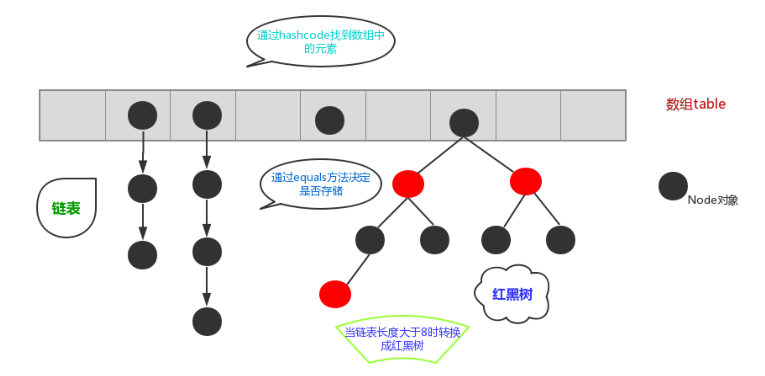
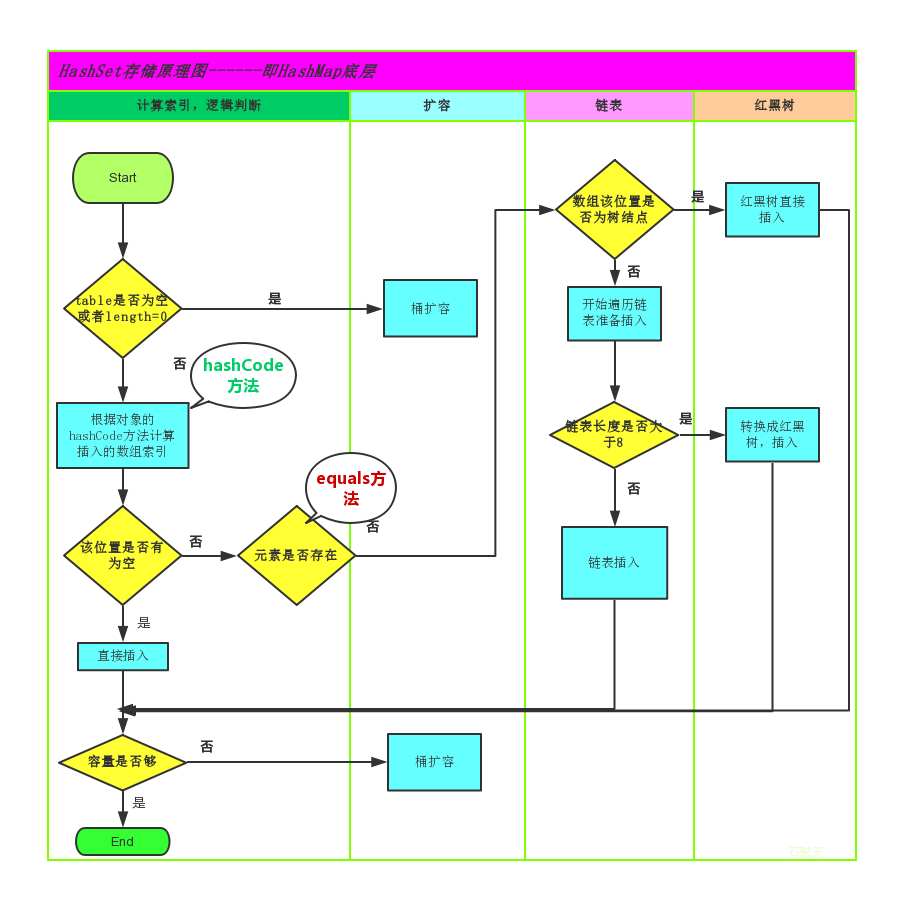

[TOC]


# Collection

## 基础概念

> 数组 & 集合

```sh
数组：固定长度（不能动态改变）。只能放同一类型的元素。数组可以存储基本类型
集合：可变长度。不考虑泛型的前提下，可以存多种类型。集合中只能存储引用类型
```

```java
List<Integer> list = new ArrayList<>();
list.add(5); //集合放基本类型，其实是通过【装箱拆箱】来实现的。以前基本类型只能用数组，现在集合也可以了
```

```java
'双括号初始化 ---> 简洁但效率低';
（1）.双大括号初始化方法生成的.class文件要比常规方法多;
（2）.双大括号初始化方法运行时间要比常规方法长;
（3）.可能造成内存泄漏;

第一层花括号，定义了一个继承自 HashMap 的匿名内部类;
第二层花括号，在匿名内部类中定义了一个 构造代码块;

//通过 new 得到 HashMap 的子类的实例化，然后上转型为 Map 的引用，得到的 map 实际上是 HashMap 的子类的引用。
//但在功能上没有任何改变，相比于常规标准方式进行初始化要简洁许多，但代码可读性相对会差
Map<Integer, String> map = new HashMap<Integer, String>() {{
    put(1, "a"); put(2, "b");
}};
```


```sh
Vector：线程安全，效率慢。支持线程的同步，即某一时刻只有一个线程能够写 Vector

ArrayList：底层是通过'数组'实现. 当 add/remove 时,需要对数组进行复制,移动, 代价比较高

8.HashSet
通过 hashCode 来确定元素在内存中的位置.一个 hashCode 位置上可以存放多个元素(哈希桶).

9.TreeSet
使用二叉树的原理对新 add() 的对象按照指定的顺序排序(升序,降序)
每增加一个对象都会进行排序,将对象插入的二叉树指定的位置

0.HashTable
继承自 Dictionary 类,线程安全. 并发性不如 ConcurrentHashMap,后者引入了分段锁.
不推荐使用. 不需要线程安全 ---> HashMap, 需要线程安全 ---> ConcurrentHashMap

1.TreeMap
可针对key值进行排序,默认按key的升序排列,也可以自定义排序比较器.
key 必须 implements Comparable,或在构造 TreeMap 传入自定义的 Comparator

0.Map和Collection
Map 存储的是键值对. Map的Key要保证唯一性
Map 存储元素使用 put(), Collection 使用 add()
Map 集合没有直接取出元素的方法,而是先转成 Set 集合,再通过迭代获取元素

1.Map常见子类 //k不可重复,v可
HashTable -> 线程安全        k,v都不可为 null    底层哈希表实现    已被 HashMap 替代
HashMap   -> 线程不安全        k,v都可为 null        ..............    

TreeMap   -> 线程不安全        k不为,v可为 null    底层二叉树实现    可排序 key

3.关于hashCode和equals
(1).只要重写 equals, 就必须重写 hashCode
(2).Set 存储的对象,必须重写这两个方法. // Set存储的元素要保证唯一

(3).自定义对象做为Map的key,必须重写这两个方法. //Map的Key要保证唯一
```

> Iterator原理

```sh
在调用 Iterator 的 next()方法之前，迭代器的索引位于第一个元素之前，不指向任何元素。
当第一次调用迭代器的 next()方法后，迭代器的索引会向后移动一位，指向第一个元素并将该元素返回。
当再次调用 next()方法时，迭代器的索引会指向第二个元素并将该元素返回。
依此类推，直到 hasNext()方法返回 false，表示到达了集合的末尾，终止对元素的遍历。

#增强for循环：底层原理也是迭代器 Iterator，所以在遍历的过程中，不能对集合中的元素进行增删操作。【faset-fail】
```

> 泛型

```sh
集合是可以存放任意类型的，将元素存入集合后，元素都会被提升为 Object 类型。那么在取出元素时，就必须采用类型转换。
在存储过程中，存入其他类型也不会报错。但是，在取出时进行类型转换时则报异常。

'泛型优点'：（1）将运行时期的 ClassCastException，转移到了编译时期变成了编译失败。（2）避免了类型强转的麻烦。
```


## 数据结构

> 栈

```sh
'栈'：stack，又称堆栈。它是'一种运算受限的线性表'，其限制是仅允许在表的一端进行插入和删除操作，不允许在其他任何位置进行插入、查找、删除等操作。

（1）先进后出（即，存进去的元素，要在后它后面的元素依次取出后，才能取出该元素）
（2）栈的入口、出口的都是栈的顶端位置

'压栈'：就是存元素。即，把元素存储到栈的顶端位置，栈中已有元素依次向栈底方向移动一个位置。
'弹栈'：就是取元素。即，把栈的顶端位置元素取出，栈中已有元素依次向栈顶方向移动一个位置。
```

> 队

```sh
'队列'：queue，简称队。它同堆栈一样，也是'一种运算受限的线性表'，其限制是仅允许在表的一端进行插入，而在表的另一端进行删除。

（1）先进先出（即，存进去的元素，要在后它前面的元素依次取出后，才能取出该元素）。
（2）队列的入口、出口各占一侧。
```

> 数组

```sh
数组：Array，是有序的元素序列，数组是在内存中开辟'一段连续的空间'，并在此空间存放元素。

（1）查找元素快：通过索引，可以快速访问指定位置的元素
（2）增删元素慢

（2-1）指定索引位置'增加'元素：创建新数组，将新元素添加指定位置，复制原数组中的所有元素
（2-2）指定索引位置'删除'元素：创建新数组，删除指定位置元素，复制其他元素到新数组
```

> 链表

```sh
链表：linked_list，由一系列结点node（链表中每一个元素称为结点）组成，结点可以在运行时i动态生成。
每个结点包括'两个部分'：一个是存储数据元素的'数据域'，另一个是存储下一个结点地址的'指针域'。常说的链表结构有单向链表与双向链表。

（1）多个结点之间，通过地址进行连接
（2）查找元素慢：想查找某个元素，需要通过连接的节点，依次向后查找指定元素
（3）增删元素快：只需要修改连接下个元素的地址即可
```

> 红黑树

```sh
二叉树：binary_tree，每个结点不超过2的有序树（tree）。顶上的叫根结点，两边被称作'左子树'和'右子树'。

```


## Collection

> 子类介绍

```sh
顶级接口：Collection（单列集合） + Map（键值对集合）。#List Set 是 Collection 的二级接口。

List：存取有序，元素可重复。可通过索引操作元素
Set ：存取无序，元素不可重复

#为什么会出现这么多的容器？ 
因为每一个容器的存储方式（数据结构）都有不同
```

```sh
"元素唯一性？" 
List 是通过 equals 来比较两个对象是否相等，如 contains() remove()方法的底层都是。
而 Set 是通过 hashCode 和 equals 共同起作用。

"Set的 hashCode 相同，但 equals 不同，怎么存存储？"
在同样的哈希值下顺延（可认为哈希值相同的元素放在一个哈希桶中），也就是哈希一样的存一列。
```

> 迭代器

```sh
#迭代器-Iterator 是取出集合中元素的一种方式 。
因为 Collection 中有 iterator 方法，所以每一个子类集合对象都具备迭代器。
迭代器替代了 Vector 类中的 Enumeration(枚举)。迭代器的 next 方法是自动向下取元素，要避免出现 NoSuchElementException。
迭代器的 next 方法返回值类型是 Object， 所以要记得'类型转换'。 （学到泛型就可以消除强转！）
```

```sh
#集合遍历方式
（1）.Iterable接口   适用于 Collection 所有子类
（2）.foreach       适用于 数组 + Collection。底层实现方式为（1）
（3）.for           适用于 数组 + List
（4）.toArray()     转化为 数组
```

> ###`List`

```sh
List 是'有序'的集合，集合中每个元素都有对应的顺序序列。
List 集合可使用'重复'元素，可以通过索引来访问指定位置的集合元素（顺序索引从 0 开始），
List 集合默认按元素的添加顺序设置元素的索引，比如第一个元素的索引就是 0，好似'数组'。
```

```java
//ListIterator：Iterator 的子接口，专门用于操作 List 集合的输出，可以完成'逆序输出'。

ArrayList<Integer> list = new ArrayList<>(Arrays.asList(1, 5, 8));
ListIterator<Integer> iterator = list.listIterator(list.size()); //必须传参，将指针置为末位
while (iterator.hasPrevious()) { //是否还有上一个元素
    System.out.println(iterator.previous()); //上一个元素
}
```

> ArrayList

```sh
Vector     -> 线程安全      效率低，被 ArrayList 替代
ArrayList  -> 线程不安全    查询快，增删慢        底层'数组'实现，新增时会涉及到数组拷贝
LinkedList -> 线程不安全    查找慢，增删快        底层'双向循环链表'实现
```

```sh
#Vector & ArrayList
底层都是采用'数组'实现。
'同步性'：前者是线程安全的，后者非线程安全
'扩容'：当需要扩容时，Vector 默认增长一倍，ArrayList 却是 0.5
```

```sh
#Vector & ArrayList & LinkedList
Vector 和 ArrayList 都是使用数组方式存储数据，
```

> LinkedList

```java
//底层是一个双向链表，经常涉及到首尾操作，提供了大量首尾操作的方法。
public void addFirst(E e);
public E getFirst();
public E removeFirst();
```

```java
//在开发时，LinkedList集合也可以作为【堆栈，队列】的结构使用
public E pop();           //从此列表所表示的堆栈处弹出一个元素。
public void push(E e);    //将元素推入此列表所表示的堆栈。
public boolean isEmpty(); //如果列表不包含元素，则返回true。
```

>###`Set`

```sh
HashSet  -> 线程不安全    存取速度快           底层'哈希表'实现，内部是 HashMap
TreeSet  -> 线程不安全    排序存储（可排序）    底层'二叉树'实现，内部是 TreeMap
```

```sh
#Set 元素唯一性？
(1) 首先 hashCode 是否相同，如果不同，就是不重复的
(2) 如果 hashCode 一样，再比较equals。如果不同，就是不重复的，否则就是重复的。
'=='是判断内存地址是否相等，用来决定引用值是否指向同一个对象。
```

>HashSet

```sh
#HashSet 底层的实现其实是一个 HashMap。
根据对象的 hashCode 来确定元素在集合中的存储位置，因此具有良好的存取和查找性能。
保证元素唯一性的方式依赖于： hashCode() 与 equals() 方法。
#通过 hashCode()定位数组中的位置，通过 equals()判断已有元素和待插入元素是否为同一对象
```

> LinkedHashSet

```sh
链表 和 哈希表组合的一个数据存储结构。可以保证元素有序，即存入和取出顺序一致
```

>TreeSet

```sh
TreeSet 是 SortedSet 接口唯一的实现，底层是'二叉树'

#排序是如何进行的呢？【二者都有，以后者为主】
（1）元素 implements 'Comparable'
（2）元素自身不具备比较性，或具备的比较性不满足要求时。需要让 TreeSet 集合自身具备比较性：比较器 'Comparator'
TreeSet<Dog> dogSet = new TreeSet<>((o1, o2) -> Integer.compare(o1.getAge(), o2.getAge()));
```


>list & set

```sh

```

```

```


## Map

> map & Collection

```sh
Map 存储的是键值对（key唯一）。#Collection 存储的是单列集合
Map 存储元素使用 put()。     #Collection 使用 add()
Map 集合没有直接取出元素的方法，而是先转成 Set 集合，再通过迭代获取元素

#自定义对象做为Map的key，必须重写 hashCode 和 equals（保证key唯一）。
```

```sh
#高度注意：Map类集合 K/V 能不能存储 null 值的情况

集合类                Key             Value          Super          说明
-------------------------------------------------------------------------------
HashTable            不允许为 null    不允许为 null    Dictionary     '线程安全'
ConcurrentHashMap    不允许为 null    不允许为 null    AbstractMap    分段锁技术
TreeMap              不允许为 null    允许为 null     AbstractMap     线程不安全
HashMap              允许为 null      允许为 null     AbstractMap     线程不安全
```

```sh

```


```java
//使用 put 方法新增元素时，当前 key 在集合中不存在，即没有对应的 value，则返回 null。如果有对应的 value，则返回覆盖前的 value。
public V put(K key, V value);
```

>HashMap

```sh
'HashMap'      ：'哈希表'结构。元素存取无序。由于要保证键的唯一、不重复，需要重写 key 的'hashCode()方法、equals()方法'。
'LinkedHashMap'：HashMap 的子类，'链表+哈希表'结构。元素'存取有序'（链表保证）。也需要重写以上两个方法
```


>HashMap & HashTable & ConcurrentHashMap

```sh
HashTable线程安全, 在多线程情况下, 同步操作能保证程序执行的正确性.
但是, HashTable每次同步执行时,都要锁住整个结构.


ConcurrentHashMap 正是为了解决这个问题而诞生的.
ConcurrentHashMap 锁的方式是稍微细粒度的, 将hash表分为16个桶(默认值), 诸如get,put,remove等常用操作只锁当前需要用到的桶。
原来只能一个线程进入, 现在却能同时16个写线程进入 (写线程才需要锁定,而读线程几乎不受限制), 并发性的提升是显而易见的!!!

ConcurrentHashMap的'读取操作没有用到锁定',所以读取操作几乎是完全的并发操作.
而'写操作锁定的粒度又非常细', 比起之前又更加快速(桶越多,表现越明显). '只有在求size等操作时才需要锁定整个表'
```

> 哈希冲突

```sh
#哈希算法的功能：保证通过一个对象快速找到另一个对象。其算法价值体现在速度,可以保证查询快速执行。
当从 HashMap 访问元素时，先获取 key 的hashCode，然后到该 hashCode 对应的位置取出 value。
在这里，'key的 hashCode 就好比是数组里的索引，但是不是索引'。
```

```sh
#两个【不同对象】映射到散列表（数组）的【元素下标相同】，这种现象称为 哈希冲突。

（1）String str=new String("a"); String str2=new String("a");
str和str2是不同的对象，但是他们的 'hash值相同'，映射到散列表的元素下标相同，所以这两个键str和str2是相同的。

（2）String str=new String("a"); String str2=new String(其他和"a"hashCode相同的字符串);
str和str2是不同的对象，但是他们的 'hash值相同'，映射到散列表的元素下标相同，所以这两个键str和str2是相同的。

（3）String str=new String("a"); String str2=new String("q");
str和str2是不同的对象，但是他们的 'hash值不相同'，映射到散列表的元素下标相同，所以这两个键str和str2是相同的。
```

```sh
#resize()方法：每次都将容量调整为原来的2倍，并且调整键key映射的下标。（以字符串键“a","q"为例）

比如说，初始容量为16时，键'a'和'q'映射的下标都是1； 
当初始容量调整为32时，键'a'映射的下标都是1，键'q'映射的下标都是17。
如果resize()之后不调整键'q'映射的下标（即已存在键'q'映射在1），然而下次put("q",value)时，会映射到17。那么就出现重复键'q'。
```

> HashMap插入元素

```sh
#HashSet 元素增加
HashSet 新增元素时，首先调用 hashCode 方法获取新值的哈希值，然后'根据哈希值得到映射到数组的下标'，再判断该数组下标位置 #是否已有元素？
如果没有，则直接将新值插入。

如果有，则通过 equals 方法判断 旧值和新值 #是否相等？
相等，则新值覆盖原来的旧值，并返回旧值（add方法有返回值）。
不相等，则在该哈希值位置，顺延增加一个元素，即新值。这种现象称为'哈希冲突'（hashCode相同，equals不同）。
```

```sh
#hashCode相同 --X--> equals相同 ----> hashCode一定相同
所以，重写 equals() 方法，一定要重写 hashCode() 方法。

#HashSet 判断两个元素相等的标准是两个对象通过 equals 方法相等，并且两个对象的 hashCode 方法也相等。
如果需要某个类的对象保存到 HashSet 集合中，覆写该类的 equals()和 和 hashCode() 方法，
应该尽量保证两个对象通过 equals 比较返回 true 时, 他们的 hashCode 返回也相等。
```

> 555

```sh

```


```sh

```

```sh

```


```sh
在 JDK1.8 之前，哈希表底层采用'数组+链表'实现，即使用链表处理哈希冲突，同一 hashCode 值的元素都存储在一个链表里。
但是当位于一个桶中的元素较多，即 hashCode 值相等的元素较多时，通过 key 值依次查找的效率较低。

而 JDK1.8 中，哈希表存储采用'数组+链表+红黑树'实现，当链表长度超过阈值（8）时，将链表转换为红黑树，这样大大减少了查找时间。
```





# Collection-Plus

## 常见问题


##List去重

> `目标`：取出 Id 不重复的元素

```java
List<User> users = Arrays.asList(new User(1, "a"), new User(2, "b"), new User(1, "aa")); //源集合
```

> （1）遍历源集合，用遍历元素和结果集中的每个元素比较

```java
ArrayList<User> list = new ArrayList<>(); //结果集
users.forEach(x -> {
    boolean match = list.stream().anyMatch(y -> y.getId().equals(x.getId()));
    if (!match) {
        list.add(x);
    }
});
```

> （2）使用HashSet。`重写 hashCode() + equals()`

```java
//先放入 Set 去重，再取出来放入 list
Set<User> set = new HashSet<>(users);
List<User> list = new ArrayList<>(set);
```

> （3）对于大数据量，应采用 Stream 并行流的 distinct 方法。`重写 hashCode() + equals() `

```java
List<User> list = users.parallelStream()
    .distinct() //底层是通过 equals() 进行去重
    .collect(Collectors.toList());
```

> （0）重写 hashCode + equals

```java
@Override
public boolean equals(Object o) {
    if (this == o) return true;
    if (o == null || getClass() != o.getClass()) return false;
    User user = (User) o;
    return Objects.equals(id, user.id) /*&& Objects.equals(name, user.name)*/;
}

@Override
public int hashCode() {
    return Objects.hash(id/*, name*/); //只比较 id
}
```

> 总结向

```java
//HashSet 底层是通过 HashMap 实现
//HashMap 确保key值唯一：先比较 hashCode()，如果相同；继续比较 equals() 是否为同一个对象
public HashSet() {
    map = new HashMap<>();
}

//存在则返回 false，不存在的返回 true
public boolean add(E e) {
    return map.put(e, PRESENT)==null;
}
```

```shell
#equals相同 --> hashCode相同 --X--> equals相同
hashCode相同，但equals不同，称为'哈希冲突'。冲突会导致操作哈希表的时间开销增大，所以尽量定义好 hashCode()方法，能加快哈希表的操作。
```

```shell
#重写 equals()方法，必须也重写定 hashCode()方法
对于，String a = new String(“abc”); String b = new String(“abc”);
如果只覆写 equals()，不覆写 hashCode() 的话，那么 a和b 的 hashCode 就会不同。
把这两个类当做 key 存到 HashMap 中的话就会出现问题，就会和 key 的唯一性相矛盾。
```

## 快速失败

> 禁止在 foreach 里进行元素的 remove/add 操作。

```sh
'增强for循环'，其实是Java提供的'语法糖'，其实现底层原理还是借助'迭代器-Iterator'实现。
ArrayList 非线程安全，因此在使用迭代器的过程中，如果有其他线程修改了list，那么将抛出并发修改异常，即'fast-fail'机制。

void remove(); #迭代器-Iterator 的remove()方法删除集合上一次 next()方法返回的元素。(若集合中有多个相同的元素，都可以删掉)
```

```java
List<String> list = new ArrayList<>(Arrays.asList("a", "b", "c"));
for (String s : list) {
    if ("a".equalsIgnoreCase(s)) {
        list.remove(s); //抛异常 -> ConcurrentModificationException
    }
}
System.out.println(JSON.toJSON(list));
```

> 解决方案

```java
//方案1： 普通for循环。因为普通for循环并没有用到 Iterator 的遍历。
for (int i = 0; i < 1; i++) {
    if (list.get(i).equals("a")) {
        list.remove(i);
    }
}
```

```java
//方案2： 拷贝源集合
List<String> list = new ArrayList<>(Arrays.asList("a", "b", "c"));
ArrayList<String> copyList = new ArrayList<>(list); //源集合的拷贝
for (String s : copyList) {
    if ("a".equals(s)) {
        list.remove(s);
    }
}
```

```java
//方案3： 使用 Iterator 进行增删操作，而不是集合 list 本身
Iterator<String> iterator = list.iterator();
while (iterator.hasNext()) {
    String next = iterator.next();
    if ("a".equalsIgnoreCase(next)) {
        // list.remove(next); //也会抛异常 -> ConcurrentModificationException

        iterator.remove(); //OK
    }
}
```

```java
//方案4： 使用 Jdk1.8 中提供的 filter 过滤
list = list.stream().filter(x -> !x.equalsIgnoreCase("a")).collect(Collectors.toList());
```

```java
//方案5： 使用 fail-safe 的集合类 ConcurrentLinkedDeque
ConcurrentLinkedDeque<String> deque = new ConcurrentLinkedDeque<>(list);
for (String s : deque) {
    if (s.equals("a")) {
        deque.remove();
    }
}
```

```java
List<String> list = new ArrayList<>(Arrays.asList("a", "b", "c"));
list = new CopyOnWriteArrayList<>(list);
for (String s : list) {
    if ("a".equalsIgnoreCase(s)) {
        list.remove(s);
    }
}
```

> 快速失败（Fail-Fast）

```sh
#什么是并发修改？
当一个或多个线程正在遍历一个集合Collection，此时另一个线程修改了这个集合的内容（'增删改'）。这就是并发修改

#什么是 fail-fast 机制？
在使用'迭代器-Iterator'遍历集合时，当集合结构被修改，会抛出异常 ConcurrentModificationException

#两种场景
（1）单线程环境：在集合遍历过程中，修改了结构。
（2）多线程环境：当一个线程在遍历集合，而另一个线程对集合的结构进行了修改。

#注意：这里异常的抛出条件是检测到 modCount！=expectedmodCount 这个条件。
如果集合发生变化时，修改 modCount 值，刚好又设置为了 expectedmodCount 值，则异常不会抛出，如方法 iterator.remove();
因此，不能依赖于这个异常是否抛出而进行并发操作的编程，这个异常只建议用于检测并发修改的bug。
```

```sh
#底层原理
迭代器在遍历过程中是直接访问集合数据的，因此集合数据在遍历的过程中不能被修改。
为了保证不被修改，迭代器内部维护了一个修改次数的标记 'modCount'，当集合结构改变（增删改），标记都会被修改。

在 Iterator 初始化过程中，会将这个值赋给迭代器的 expectedModCount = modCount。
在迭代过程中，判断 modCount == expectedModCount？ 如果不相等，就表示已经有其他线程修改了集合，然后抛出异常。
#注意：modCount 声明为 volatile，保证线程之间修改的可见性。
```

```java
private class Itr implements Iterator<E> {
    int expectedModCount = ArrayList.this.modCount; //迭代器初始化过程时，保存当前的修改次数

    public E next() {
        checkForComodification();
        /** 省略此处代码 */
    }

    final void checkForComodification() { //在迭代器遍历集合过程中，检查集合是否被修改
        if (ArrayList.this.modCount == this.expectedModCount)
            return;
        throw new ConcurrentModificationException();
    }
}
```

> 安全失败（Fail-Safe）

```sh
'原理'：fail-safe集合，在进行结构修改时（增删改 + 遍历）,都是先拷贝原有集合，在拷贝上进行修改，修改完成之后再改变原有集合的引用。
所以，遍历是在原集合的拷贝上进行，修改是在原集合上进行，所以互不干扰

'缺点'：迭代器并不能访问到修改后的内容，即：迭代器遍历的是开始遍历那一刻拿到的集合拷贝，在遍历期间原集合发生的修改迭代器是不知道的。
并且，拷贝将产生大量的中间对象，同时数组的拷贝也是相当损耗资源的
```

```sh
场景：'java.util'包下的集合类都是快速失败的，不能在多线程下发生并发修改（迭代过程中被修改）。
场景：'java.util.concurrent'包下的容器都是安全失败，可以在多线程下并发使用，并发修改。
```


# 相关问题

## 相关练习

> List的交集、并集、差集

```java
List<Integer> list1 = new ArrayList<>(Arrays.asList(1, 5, 7));
List<Integer> list2 = new ArrayList<>(Arrays.asList(21, 5, 17));

list1.retainAll(list2);
System.out.println(list1); //交集：[5]

list1.removeAll(list2);
list1.addAll(list2);
System.out.println(list1); //并集：[1, 7, 21, 5, 17]

list1.removeAll(list2);
System.out.println(list1); //差集：[1, 7]
```


## 概念区分

> Collection & Collections

```sh
'Collection'  是集合类的上级接口，继承于他的接口主要有 Set，List
'Collections' 是针对集合类的一个帮助类，提供一系列静态方法实现对各种集合的搜索、排序、线程安全化等操作
```

> Vector & ArrayList & LinkedList

```sh

```


# 排序算法

##冒泡排序

> 基础概念

```sh
#一次比较两个元素，如果它们的顺序错误就把它们交换过来。
最佳情况：T(n) = O(n)  最差情况：T(n) = O(n^2)  '平均情况：T(n) = O(n^2)'
```

```java
private static void bubbleSort() {
    int[] arr = {9, 7, 5, 12};

    for (int i = 0; i < arr.length - 1; i++) { //总共遍历 len-1
        for (int j = 0; j < arr.length - 1 - i; j++) { //第 i 次比较 len-1-i 个元素
            if (arr[j + 1] < arr[j]) { //升序
                int temp = arr[j];
                arr[j] = arr[j + 1];
                arr[j + 1] = temp;
            }
        }
        System.out.println(Arrays.toString(arr));
    }
}
```

>改进方案

```sh
数据的顺序排好之后，冒泡算法仍然会继续进行下一轮的比较，直到 arr.length-1 次，后面的比较没有意义的。
设置'置换标志-flag'，如果发生了交换flag设置为 true；如果没有交换就设置为 false。
这样当一轮比较结束后如果flag仍为 false，即：这一轮没有发生交换，'说明数据的顺序已经排好'，没有必要继续进行下去。
```

```java
private static void bubbleSortSuper() {
    int[] arr = {9, 7, 5, 12};

    boolean flag; //置换标识
    for (int i = 0; i < arr.length - 1; i++) {
        flag = false;
        for (int j = 0; j < arr.length - 1 - i; j++) {
            if (arr[j + 1] < arr[j]) {
                int temp = arr[j];
                arr[j] = arr[j + 1];
                arr[j + 1] = temp;
                flag = true;
            }
        }
        if (!flag) break; //已排序完成
        System.out.println(Arrays.toString(arr));
    }
}
```

## 选择排序

> 基础概念

```sh
表现'最稳定'的排序算法之一，时间复杂度恒为'O(n^2)'，所以'数据规模越小越好'。不占用额外的内存空间。
最佳情况：T(n) = O(n^2)  最差情况：T(n) = O(n^2)  '平均情况：T(n) = O(n^2)'

首先，在原始数据中找到最小（大）元素，存放到排序序列的起始位置
然后，再从剩余未排序元素中继续寻找最小（大）元素，放到已排序序列的末尾位置
以此类推，直到所有元素均排序完毕
```

```java
private static void selectionSort() {
    int[] arr = {9, 7, 5, 12};

    int maxIndex;
    for (int i = 0; i < arr.length; i++) {
        maxIndex = i;
        for (int j = 0; j < arr.length - i; j++) {
            if (arr[j] > arr[maxIndex]) { //找出 [最大元素] 的将其放在集合的末位
                maxIndex = j;
            }
        }
        int exchangeIndex = arr.length - 1 - i; //待置换index
        if (maxIndex != exchangeIndex) {
            int temp = arr[exchangeIndex];
            arr[exchangeIndex] = arr[maxIndex];
            arr[maxIndex] = temp;
        }
        System.out.println(Arrays.toString(arr));
    }
}
```

```java
private static void selectionSort() {
    int[] arr = {9, 8, 5, 2, 4};

    int minIndex;
    for (int i = 0; i < arr.length - 1; i++) {
        minIndex = i;
        for (int j = i + 1; j < arr.length; j++) {
            if (arr[j] < arr[minIndex]) { //最小元素
                minIndex = j;
            }
        }
        if (minIndex != i) {
            int temp = arr[i];
            arr[i] = arr[minIndex];
            arr[minIndex] = temp;
        }
        System.out.println(Arrays.toString(arr));
    }
}
```

## 插入排序


# 开发手册

## 集合处理

> hashCode 和 equals 的处理

```sh
（1）只要重写 equals，就必须重写 hashCode
（2）Set 集合元素不重复的依据是 hashCode 和 equals。所以，Set 存储的对象必须重写这两个方法。
（3）Map 集合的 Key 也不能重复，原因同上
```

> 推荐使用集合的 `isEmpty() 代替 0==collection.size()`

```java
if (0 == imageSet.size()){}
if (imageSet.isEmpty()){} //size()是通过迭代集合得到，随着元素数量增加 size()会越来越慢。
```
> 初始值大小

```sh
#initialCapacity = (需要存储的元素个数 / 负载因子) + 1。
注意：负载因子（即loaderfactor）默认为 0.75， 如果暂时无法确定初始值大小，请设置为 16（即默认值）。
HashMap 需要放置 1024 个元素，由于没有设置容量初始大小，随着元素不断增加，容量 7 次被迫扩大， resize 需要重建 hash 表，严重影响性能。
```

```java
//集合初始化时，尽量指定集合'初始值大小'。大小应和实际存储元素个数相近，减少扩容次数。
List<String> list = new ArrayList<>(5); //默认16，加载因子0.75
```

> 不要使用集合实现来赋值静态成员变量

```java
//对于集合类型的静态成员变量，不要使用集合实现来赋值【双括号初始化】，应该使用【静态代码块】赋值
private static Map<String, Integer> map = new HashMap<String, Integer>() { //反例
    {
        put("a", 1);
    }
};
```

```java
private static Map<String, Integer> map = new HashMap<>(); //正例
static {
    map.put("a", 1);
};
```

> `asList() & subList()` 

```sh
'asList()'  返回'长度固定'的 List，是 Arrays 内部类，并不是真正的 ArrayList。它没有实现集合的修改方法，如 增删和 clear()
'subList()' 返回的是 ArrayList 内部类，是 ArrayList 的一个视图，对于 SubList 子列表的所有操作最终会反映到原列表上
```

```java
public void test() {
    List<String> asList = Arrays.asList("a", "b", "c");
    // asList.add("d"); -> UnsupportedOperationException

    ArrayList<String> list = new ArrayList<>(asList); //正解,先转换
    list.add("d");
}
```

```java
public void test() {
    ArrayList<String> list = new ArrayList<>(Arrays.asList("a", "b", "c"));
    List<String> subList = list.subList(0, 2);

    // ArrayList<String> list1 = (ArrayList<String>) subList; -> ClassCastException
}
```

> `toArray()`

```java
//直接使用 toArray() 无参方法返回值只能是 Object[].【不推荐】
public void test() {
    ArrayList<String> list = new ArrayList<>(Arrays.asList("a", "b", "c"));
    String[] array = list.toArray(new String[list.size()]); //推荐使用
}
```

> `foreach()`

```java
'Map遍历推荐使用 entrySet() 集合，而不是 keySet() 方式进行遍历';

//(1).keySet() 其实遍历了 2 次：一次是转为 Iterator 对象，另一次是从Map中取出 key 所对应的 value
for (String key : map.keySet()) {
    System.out.println(key + ":" + map.get(key));
}

//(2).entrySet() 只遍历 1 次：遍历1次就把 kV 都放到了 entry 中，效率更高。JDK8的 Map.forEach() 就是这个原理
for (Map.Entry<String, String> entry : map.entrySet()) {
    System.out.println(entry.getKey() + ":" + entry.getValue());
}

//(3).JDK8 -> Map.forEach() ---> 原理同（2）
map.forEach((k, v) -> System.out.println(k + ":" + v));
```

> `sort()`

```sh
JDK7 以上，Comparator 要满足以下'三个条件'，不然 Arrays.sort()，Collections.sort()会报异常 IllegalArgumentException。
'自反性'：x，y 的比较结果和 y，x 的比较结果相反
'传递性'：x > y， y > z，则 x > z
'对称性'：x = y，则 x，z 比较结果和 y，z 比较结果相同
#所以，对于基本数据类型，要采用其包装类的 Compare(x, y) 进行比较
```

````java
new Comparator<Person>() {
    @Override
    public int compare(Person o1, Person o2) {
        return Integer.compare(o1.getAge(), o2.getAge()); //推荐使用
    }
};
````

> 频繁调用 `Collection.contains()` 方法请使用 Set

```sh
在 java 集合类库中，List 的 contains 方法普遍时间复杂度是 O(n)。
如果在代码中需要频繁调用 contains 方法查找数据，可以先将 list 转换成 HashSet 实现，将 O(n) 的时间复杂度降为 O(1)。
```

```java
ArrayList<Integer> list = otherService.getList();
Set<Integer> set = new HashSet(list);
for (int i = 0; i <= Integer.MAX_VALUE; i++) {
    set.contains(i); // 时间复杂度O(1)
}
```

> 相互转化

```java
String[] strArray = {"a", "b", "c"};
List<String> list = Arrays.asList(strArray); //Array 转换 List

//【不推荐】直接使用 toArray() 无参方法，因为其返回值只能是 Object[]。
String[] array = list.toArray(new String[list.size()]); //List 转 Array
```
> 返回`空数组和空集合`而不是 null

```sh
返回 null，需要调用方强制检测 null，否则就会抛出空指针异常。
返回空数组或空集合，有效地避免了调用方因为未检测 null 而抛出空指针异常，还可以删除调用方检测 null 的语句使代码更简洁。
```

```java
public static Result[] getResults() {
    return new Result[0];
}
```


## 哈希值

> 哈希值

```sh
哈希值：主要作用是为了配合基于散列的集合一起正常运行，这样的散列集合包括 HashSet、HashMap 及 HashTable。
```

```sh
#当向Set集合（元素不重复）中插入对象时，如何判别在集合中是否已经存在该对象了？
调用 equasl() 方法逐个比较，当数据量庞大时，效率低下。（X）

当集合要添加新的对象时，先调用这个对象的 hashCode() 方法，得到对应的 hashcode 值。
实际上，在 HashMap 的具体实现中会用一个table保存已经存进去的对象的 hashcode 值。如果table中没有该hashcode值，它就可以直接存进去，
不用再进行任何比较了；如果存在该hashcode值， 就调用它的equals方法与新元素进行比较，相同的话就不存了，不相同就散列其它的地址。
所以，这里存在一个'哈希冲突'解决的问题，这样一来，实际调用 equals() 方法的次数就大大降低了。

说通俗一点：Java中的 hashCode() 方法就是根据一定的规则将与对象相关的信息（比如对象的存储地址，对象的字段等）映射成一个数值，这个数值称作为'散列值'。
```

```sh
#可以直接根据hashcode值判断两个对象是否相等吗？
肯定是不可以的，'因为不同的对象可能会生成相同的hashcode值'。
虽然不能根据hashcode值判断两个对象是否相等，但是可以直接根据hashcode值判断两个对象不等，如果两个对象的hashcode值不等，则必定是两个不同的对象。
如果要判断两个对象是否真正相等，必须通过equals方法。

#equals相同   ---> hashcode相同。  equals不同   ---> hashcode不一定不同。
#hashcode不同 ---> equals不同。    hashcode相同 ---> equals未知。
```


<https://blog.csdn.net/glory1234work2115/article/details/50772568>

<https://www.cnblogs.com/zhoudl/p/10648860.html>


> 哈希表

```sh
'哈希表'：就是一种以 键-值(key-value) 存储数据的结构，只要输入待查找的值即 key，即可查找到其对应的值。
```

```sh
#使用哈希查找有两个步骤:
1、使用哈希函数将被查找的键转换为数组的索引：在理想的情况下，不同的键会被转换为不同的索引值。
但是，在有些情况下，我们需要处理多个键被哈希到同一个索引值的情况。所以哈希查找的第二个步骤就是处理'哈希冲突'

2、处理哈希碰撞冲突：有很多处理哈希碰撞冲突的方法，本文后面会介绍'拉链法'和'线性探测法'。
```

