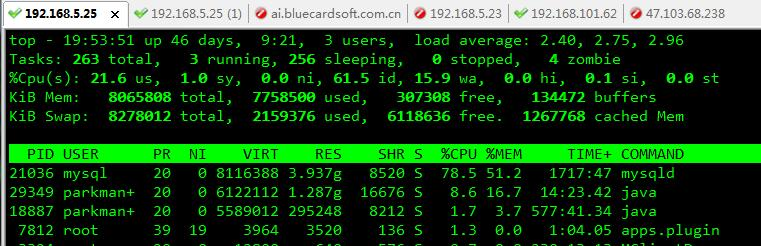
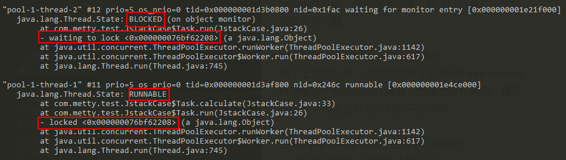
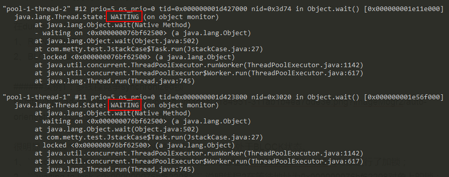

[TOC]


# 基础命令

## 系统相关

> 命令格式

```shell
linux区分大小写 "；" 命令过长，则使用 \ 进行换行

cmd > file ： #将输出重定向【覆盖】到file
cmd >> file： #将输出重定向【追加】到file 
cmd < file ： #读取file作为输入
```

> putty配置

```
字体大小: Windows -> Appearance -> Font Settings -> Consolas(12)
绿色字体: Windows -> Color -> Default Foregroud -> 0 255 0
保存配置: Session -> Saved Sessions -> 选中默认 -> Save -> Apply
```

> 系统相关信息

```shell
cat /etc/issue     #linux的发行版本：CentOS ubuntu
hostname           #主机名
cat /proc/version  #内核版本
```

> 关机重启（reboot）

```shell
shutdown -r now    #立即重启，等同于 reboot

shutdown -h now    #立即关机
shutdown -h +10    #10分钟后关机
shutdown -h 11:33  #定时关机，今天的11::33
```

> file属性

```shell
[root@linux]# ls -lh

total 4.9G #总计大小
drwxr-xr-x 8 parkmanager root 4.0K  9月 16  2014 nginx-1.6.2
-rw-r--r-- 1 parkmanager root 786K  8月 13  2018 nginx-1.6.2.tar.gz
#档案属性  连接 拥有者       分组  大小  修改日期      文件名
```

> 用户&分组

```shell
more /etc/passwd      #所有用户名信息
more /etc/group       #用户组信息
groups                #查看当前用户所属用户组

useradd -g group user #新增用户，分组
useradd user          #不指定分组，则分组名和用户名相同
groupadd police       #新增分组 police
userdel -r user       #若不加参数 -r，则仅删除用户帐号，而不删除相关文件
passwd user           #修改账户密码

chgrp [-R] user dir       #更改'档案'所属分组
chown [-R] user:root dir  #............拥有者，分组
```

> 档案属性 `d rwx r-x r-x`

```shell
#(0).是否是目录。d表示目录，-表示文件。

#(1).文件拥有者 所具有的读写权限。 u
#(2).文件拥有者同组用户........  g
#(3).其他用户.................  o

chmod [-R] 777 dir  #更改档案属性

chmod u-x file      #移除file所属用户（u）的执行权限
chmod a-x file      #.......所有用户（a = u+g+o）的执行权限
```
> rwx（读，写，执行）

```shell
x: #与能否进入该目录有关
r: #当目录有读取（r）权限时，就可以利用 ls 这个指令展示该目录的列表

w: #当目录有写入（w）权限时，将具有移动该目录结构清单的权限:
   (1). 建立新的档案与目录
   (2). 删除已经存在的档案与目录（不论该档案是属于谁）
   (3). 将已存在的档案或目录进行更名
   (4). 搬移该目录内的档案，目录位置
```

> 

```shell

```

```shell

```

> 软件相关

```shell
apt-get update             #更新安装列表

dpkg -l | grep x           #从已安装软件中确定是否安装了软件x 
apt-get --purge remove x   #删除软件及配置
apt-get autoremove x       #卸载软件及其依赖的安装包

wget url                   #下载指定链接
```

> RPM软件包管理器（RPM Package Manager）用于联网下载安装包

```shell
rpm –qa | more          #查询系统所安装的所有rpm软件包，并以分页的形式显示

rpm –qa | grep mysql    #查询系统所安装的所有rpm软件包，并返回和mysql相关的RPM包
rpm –q mysql            #查询软件是否被安装，是则返回该软件相关的版本信息，否则返回 is not installed.

rpm –i RPM包的全路径      #安装RPM包
rpm –ivh RPM包的全路径    #安装并有进度条等提示（i=install安装 v=verbose提示 h=hash进度条）

rpm –e RPM包名           #删除相关的rpm包(若果有依赖则报错，一般使用下者)
rpm –e RPM包名 –nodeps   #解除依赖，强制删除
```
> YUM包管理：相比rpm的好处是 自动解决软件包依赖关系 + 方便的软件包升级

```shell
2.安装 yum install sudo          #指定软件名，系统会自动的从网上获取安装镜像，并自动解决依赖关系

3.检测升级 yum check-update sudo  #如果有则返回新版本的版本号
4.升级 yum update sudo           #升级指定的也是软件名

5.软件包查询 yum list | more      #返回yum源所有的软件包名，以及是否安装过的信息
6.相关查询 yum list | grep sudo   #返回yum源中和sudo相关的软件包

7.软件包信息 yum info sudo        #返回软件sudo相关的信息
8.软件卸载 yum remove sudo
9.软件帮助 yum –help 或者 man yum
```

> 升级内核，docker要求内核在3.10以上

```shell
$ cat /etc/issue    #查看发行版信息：CentOS release 6.9 (Final)
$ uname -r  #查看当前内核版本

#（1）导入public-key
rpm --import https://www.elrepo.org/RPM-GPG-KEY-elrepo.org

#（2.1）为 CentOS-6 或 RHEL-6，SL-6安装ELRepo
rpm -Uvh http://www.elrepo.org/elrepo-release-6-8.el6.elrepo.noarch.rpm

#（2.2）为 CentOS-7 或 RHEL-7，SL-7安装ELRepo：
rpm -Uvh http://www.elrepo.org/elrepo-release-7.0-3.el7.elrepo.noarch.rpm (external link)

#（3.1）长期支持版本（更稳定）：kernel-lt
yum --enablerepo=elrepo-kernel install kernel-lt -y 

#（3.2）主线最新版本：kernel-ml
yum --enablerepo=elrepo-kernel install kernel-ml -y

#（4）修改文件 /etc/grub.conf，将 default 值改为0
#boot=/dev/vda
default=0
timeout=5

#（5）重启服务器，重启之后执行 uname -r 查看最新内核
reboot 或 shutdown -r now
```

> 系统目录

```shell
/etc #存放系统的配置文件。包括账号与密码（/etc/passwd，/etc/shadow），开机时各项设定值（/etc/sysconfig/*）...

/usr/local #将自己开发或自行额外安装的软件放置在 /usr/local 或 /opt.

/var #存放系统运作过程中的中间暂存数据（/var/lib，/var/log，/var/run），以及部分最终数据，如邮件（/var/spool/mail）
     #另外，几乎所有服务的登录文件（可以记录谁，什么时候，由哪里登入主机，做了什么事等等信息）都放在 /var/log 这个目录下

/tmp #存放临时文件
```

```shell
#磁盘分配
/      #根目录可以分配 1GB
/boot  #大概在 50MB 就可以了，因为开机档案并不大
/var   #至少需要 1GB 以上，因为 mail，proxy 预设的储存区都在这个目录中，除非要将一些设定改变
/usr   #因为所安装的软件和数据都是在 /usr/ 当中，所以 /usr 大概 10G 左右
/home  #用户数据放置在 /home 当中，因此通常建议你将所剩下的磁盘空间分配给这个目录
```

```shell
#启动级别（7）
0      #关机，机器关闭。即开机之后马上又关机 
1      #单用户模式。就像 Win9x 下的安全模式类似
2      #多用户模式，但是没有NFS支持
3      #完整的多用户模式，标准的运行级。默认使用
4      #一般不用，特殊情况下使用。例如，在笔记本电脑的电池用尽时，可以切换到这个模式来做一些设置
5      #就是 X11，进到 X-Window 图形界面。 默认使用
6      #重启。即开机之后，马上又重启
***    #使用命令 runlevel 查看当前的运行级别
```


##定时任务

> nano编辑器

```shell
yum -y install nano #安装
nano file           #新建/打开

退出: Ctrl+x （y确认）   保存修改: Ctrl+o    取消返回: Ctrl+c
剪贴/删除整行: Ctrl+k    复制整行: Alt+6        粘贴: Ctrl+U 

#在编辑状态下退出请按 Ctrl+X，会有两种情形：如果文件未修改，直接退出；如果修改了文件，下面会询问是否需要保存修改。
#输入 Y 确认保存，输入 N 不保存，按 Ctrl+C 取消返回。如果输入了 Y，下一步会提示输入想要保存的文件名。
#如果不需要修改文件名直接回车就行；若想要保存成别的名字（也就是另存为）则输入新名称然后确定，这个时候也可用 Ctrl+C 来取消返回。
```
> linux 定时任务 crontab

```shell
rpm -qa | grep crontab #检查是否安装（rpm: Red-Hat Package Manager）

sudo /etc/init.d/cron start(stop/restart) #命令形式-启动
sudo service cron start(stop/restart)     #服务形式-启动

crontab -l(e/r)    #列出（编辑/删除）当前用户的定时任务

/var/log/cron.log  #centOS日志的存储位置，对于ubuntu: http://www.cnblogs.com/nieqibest/p/9353927.html
```
```shell
#分 时 日 月 周 (user可省) cmd
m h dom mon dow (user)  command

* * * * * cmd           #每分钟执行一次任务  
0 * * * * cmd           #每小时的0点执行一次任务，如6:00; 10:00
6,10 * 2 * * cmd        #每个月2号，每小时的6分和10分执行一次任务
*/3,*/5 * * * * cmd     #每隔3分钟或5分钟执行一次任务，比如10:03, 10:05, 10:06 
0 23-7/2,8 * * * cmd    #晚上11点到早上8点之间每2个小时和早上8点 
20 3 * * * (xxx; yyy)   #每天早晨3点20分执行用户目录下的两个指令（每个指令以;分隔）
0 11 4 * mon-wed /etc/init.d/smb restart  #每月的4号与每周1到周3的11点重启smb 
```
```shell
#"%"是特殊字符（换行），所以命令中必须对其进行转义（\%）
*/2 * * * * echo $(date '+\%Y-\%m-\%d \%H:\%M:\%S')  >> file 
```

> Linux定时脚本

```shell
#!/bin/bash 
DATE=$(date '+%Y-%m-%d %H:%M:%S') #'%'对于 crontab 是关键字，而对于 shell 脚本则不是，即不需要转义
LSOF=$(lsof -p $(lsof -t +D /var/lib/webpark/logs/device) |wc -l)
CLOSE=$(netstat -anp |grep java |grep CLOSE |wc -l) #执行结果赋值给变量

cd /var/lib/webpark/logs/sm/file
echo $DATE '---' $LSOF >> lsof
echo $DATE '---' $CLOSE > close
grep -d skip -n 'Init---args' ../_* > ztj
```
> 

```java

```

## 防火墙

> iptables   firewall   ufw

```sh
iptables：是 Linux 下功能强大的应用层防火墙工具
firewall：是 Centos-7 里面新的防火墙管理命令，底层还是调用 iptables。firewall 可以在运行时更改设置，而不丢失现有连接
ufw     ：是 Ubuntu 下的一个简易的防火墙配置工具，底层也是调用 iptables
```

> Ubuntu

```sh
sudo apt-get install ufw        #安装
sudo ufw status|disable|enable

sudo ufw allow 80               #允许外部访问80端口
sudo ufw delete allow 80        #禁止外部访问80 端口
sudo ufw allow from 192.168.1.1 #允许此IP访问所有的本机端口
```

> CentOS

```sh
iptables -V #查看是否已经安装了iptables，以及版本号
service iptables status|stop|start|restart

iptables --list #查看iptables规则
```

```sh
firewall-cmd --state                        #CentOS -> 防火墙状态
service firewalld status|start|restart|stop #开启

firewall-cmd --list-all              #查看防火墙规则
firewall-cmd --query-port=8080/tcp                #查询端口是否开放
firewall-cmd --permanent --add-port=80/tcp        #开放80端口
firewall-cmd --permanent --add-port=8080-8085/tcp #开发8080到8085之间的端口
firewall-cmd --permanent --remove-port=8080/tcp   #移除端口

firewall-cmd --permanent --list-ports             #查看防火墙的开放的端口
firewall-cmd --reload                             #重启防火墙（修改配置后要重启防火墙）
```


##相似命令

> 文件读取

```shell
cat -n file  #从第1行开始,显示全部（n：示行号）
tac file     #从倒1行开始,显示全部

nl file      #从第1行开始,显示全部.自动显示行号

more file       #1次显示1屏内容（空格：下1屏内容）
more -5 file    #设置1屏只显示5行
more +100 file  #从100行开始显示

less file       #从倒1行开始，1次显示1屏内容

head -n 10 file #只显示前10行
tail -n 10 file #.....倒....

sed -n '[i],[j]p' #输出第i到第j行内容。其中，j<=i时，只输出第i行
sed -n '3,5p'     #显示第3到第5行的内容

cat -n file | head -n 5 | tail -n +3 #效果同上
cat -n file | tail -n +3 | head -n 3 #效果同上
```

> 文件查找

```shell
先考虑 whereis 或 locate，最后才考虑 find。#前两者是利用数据库来搜寻数据，相当快速！

whereis java  #只用于查找二进制文件，源代码和man手册页；一般文件的定位需使用locate命令

which java    #在环境变量 $PATH 中查找符合条件的文件

locate mysql.cnf #查找 mysql.cnf 文件

find . -name 'sm*' #（递归）查找当前目录下名为 sm* 的文件及文件夹
```

# A-B-C-D-E

## alias

> 临时简化命令，重新打开CMD则不起作用

```shell
alias datef='date "+%Y-%m-%d %H:%M:%S"' #''不可省，"="不可省
```
## awk

> 一次读取一行文本，按指定的分隔符进行切片，切成多列

```shell
#-F：指定分割字符（相当于内置变量FS），默认"任何空格"

awk '{print $1,$3}' file                #每行按默认进行分割，输出分割后的第1，3项
awk '{printf "%3s %-2s\n",$1,$3}' file  #格式化输出，%3s显示长度最小为3个字符，不足右侧补空格；%-2s左侧补

awk -F',' '{print $1,$3}' file          #自定义按','分割，默认不起作用
awk -F '[ :\t|]' '{print $1}' file      #多个分隔符使用 [] 括起来，这里代表空格、:、TAB、|同时做为分隔符。

awk 'BEGIN{FS="[, ]"} {print $1}' file  #使用内建变量，效果同上
```

```shell
#-v 设置变量
awk -va=5 '{print $2,$2+a,$2a}' file

1 2 3
A B C #源文件

2 7 25
B 5 B5 #处理后输出：第2列，第2列和变量a（5）相加的结果（非数字作为0处理），第2列和变量a（5）拼接
```

```shell
#根据条件过滤。过滤第1列大于0，且第2列等于字符串"B"的行，再输出结果的第1，3列。（对于非数字，按照ASCII进行比较）
awk '$1>0 && $2=="B" {print $1,$3}' file

#输出表头第一行，表头的表达式为 NR==1
awk '($1>0 && $2=="B")||(NR==1)' file 
```

```sh
#NR ：表示awk开始执行程序后所读取的数据行数。
#FNR：与NR功用类似，不同的是awk每打开一个新文件，FNR便从0重新累计。
#因为 linux-shell 命令行输出的前面几行一般是指导或是格式字段说明，而不是实现的数据，所以在作过滤时，一般需要排除前面的几行。

#找出指定机器开放的所有端口：if(NR>2) --> 读取第2行以后的内容
netstat -nltp|awk '{if(NR>2) {print $4}}'|cut -d ':' -f 2
```


## cat

## cp

>复制文件或目录

```shell
#-f：覆盖已经存在的目标文件而不给出提示。
#-i：与-f选项相反，在覆盖目标文件之前给出提示，要求用户确认是否覆盖，回答"y"时目标文件将被覆盖。
#-r：若给出的源文件是一个目录文件，此时将复制该目录下所有的子目录和文件。

#-a：此选项通常在复制目录时使用，它保留链接、文件属性，并复制目录下的所有内容。其作用等于dpR参数组合。
#-d：复制时保留链接。这里所说的链接相当于Windows系统中的快捷方式。
#-p：除复制文件的内容外，还把修改时间和访问权限也复制到新文件中。
#-l：不复制文件，只是生成链接文件。

cp test.log ./tmp   #单个复制
cp –rf ./test ./tmp #批量复制
```


## curl

> 命令行发送 GET POST 请求

```shell
curl localhost:9006/web/hello/get1?name=li  #默认 GET

curl localhost:9006/web/hello/post3 -X POST -d "name=li" #POST（-X POST/PUT/DELETE）
curl localhost:9006/web/hello/post4 -X POST -d '{"name":"li"}' -H "Content-Type:application/json" #JSON
```
```sh
curl -x 192.168.5.19:808 https://www.baidu.com #指定代理（proxy）服务器以及其端口
```

## cut

> 用于显示每行从开头算起 num1 到 num2 的文字

```shell
#-b: 仅显示行中指定范围的【字节】。这些字节位置将忽略多字节字符边界，除非也指定了 -n 标志。
#-c: 仅显示行中指定范围的【字符】
#-d: 指定字段的分隔符，默认的字段分隔符为“TAB”；
#-f: 显示指定字段的内容

cat cut.log
#No Name Mark Percent
#01 tom 69 91
#02 jack 71 87
#03 alex 68 98

cut -d ' ' -f 2,3 cut.log #显示每行的第2，3列
cut -d ' ' -f 2,3 --complement cut.log #显示每行的2，3以外的列，即1,4列

cut -b 2,5 cut.log #显示每行的第2个字节到第5个字节
cut -b 2- cut.log  #显示每行的第2个字节到结尾
```

##df

>显示系统的磁盘使用情况

```shell
#-l: 列出文件结构
#-h: 以人类可读的格式显示大小

df -lh          #当前linux系统所有目录的磁盘使用情况
df -lh --total  #增加统计信息

df -lh /var/lib/webpark/logs/sm  #查看指定目录所属挂载点，及挂载点的磁盘使用情况
```

##du

>显示指定的目录或文件所占用的磁盘空间

```shell
#--max-depth=<目录层数>: 超过指定层数的目录后,予以忽略

df -lh
du -h --max-depth=1 /var/lib/webpark/logs | sort -nr  #相结合使用,查看磁盘情况
```

##echo

> 显示普通字符串，或转义字符。`""会将内容转义，''不会转义，原样输出`

```shell
echo "$(date)"   #输出当前时间
echo '$(date)'   #输出 $(date)

echo $(date '+%Y-%m-%d %H:%M:%S') #输出时间格式化

echo a b c | awk '{print $1,$3}'  #查看一行的 第一列 和 第三列
```
>显示变量，或执行结果。shell中引用执行结果，有两种表达方式：'date' 和 $(date)，后者适用于嵌套情况

```shell
#查看文件句柄数（1）
echo $(lsof -p $(lsof -t +D /var/lib/webpark/logs/device) |wc -l) #执行结果

#查看文件句柄数（1）
echo $(date) '---' $(lsof -p $(lsof -t -i:8080|sed -n '1p') |wc -l) >> /file

#查看close_wait
#!/bin/bash
DATE=$(date '+%Y-%m-%d %H:%M:%S')
CLOSE=$(netstat -anp |grep java |grep CLOSE |wc -l)

echo $DATE '---' $CLOSE >> close #变量
```

> 是否显示换行。

```shell
#!/bin/sh
echo -n "OK!" #-n表示不换行，即只输出一行
echo "It is a test"
```


# F-G-H-I-J-K

## find

>根据【文件属性】进行【递归】查找

```shell
#-name: 根据文件名查找。(-iname: 忽略大小写)
#-size: 文件大小    
#-user: 所属用户
#-empty: 空文件
```
```shell
find . -name 'sm*'  #【递归】查找当前目录下名为 'sm' 或 'sm*' 的文件及文件夹
```

> 案例：需要备份 20190820_10 这一小时，所有模块的日志

```shell
#查找并拷贝，注意 \;之前有个空格
find /var/lib/webpark/logs -name '*.20190820_10.*' -exec cp {} /var/lib/webpark/logs/backup/20190820_10/ \;
```

> 其他属性

```shell
find . -empty       #（递归）-.......... '空' 文件或者文件夹
find . -size +10M   #（递归）-.......... 大于10MB的文件（c:字节，w:双字，k:KB，M:MB，G:GB）（+:大于,-:小于）

#查找目录中文件属主具有读、写权限，并且文件所属组的用户和其他用户具有读权限的文件
find . -type f -perm 644 -exec ls -l {} \;

#为了查找系统中所有文件长度为0的普通文件，并列出它们的完整路径
find / -type f -size 0 -exec ls -l {} \;

#查找/var/log目录中更改时间在7日以前的普通文件，并在删除之前询问它们
find /var/log -type f -mtime +7 -ok rm {} \;
```

```shell
#混合查找 ---> !(非); -and(且); -or(或)
find /tmp -size +10000c -and -mtime +2  #在/tmp目录下查找大于10000字节并在最后2分钟内修改的文件
find / -user fred -or -user george      #在/目录下查找用户是fred或者george的文件文件
find /tmp ! -user panda                 #在/tmp目录中查找所有不属于panda用户的文件
```

##free

> 用于显示内存状态

```shell
#-m： 以MB为单位显示内存使用情况
#-h： 以合适的单位显示内存使用情况，最大为三位数，自动计算对应的单位值
#-s<间隔秒数>： 持续观察内存使用状况
#-t： 显示内存总和列

free -hts 3 #3s刷新一次，内存的使用情况
```

## grep

> 查找文件中的内容

```shell
#-n: 显示匹配行的行号
#-r: 迭代查找，包含子目录
#-w: 只匹配整个单词，而不是字符串的一部分（如匹配'magic'，而不匹配'magical'）
#-i: 不区分大小写
#-v: 显示不包含匹配文本的所有行，即排除某个结果，反向过滤
#-A <行数n>: 除显示符合范式那一列之外，并显示该行之[后]的n行内容
#-B <行数n>: ................................[前]........
#-C <行数n>: ................................[前+后].....

#-d: 对象为目录时，使用此命令 grep -d skip
#-h: 查询多文件时，不显示文件名
#-l: 查询多文件时，只输出包含匹配字符的文件名
#-a: 不要忽略二进制数据
#-o: 只输出符合 正则表达式 的字符串
```
```shell
grep '京002024' sm              #文件查找
grep '京002024' sm len          #多文件查找
grep -n -C 3 '京002024' sm len  #显示结果的 ±3 行

grep -d skip -n 'magic' sm* --color=auto #忽略子目录，从 sm* 文件中查找，查找结果标红
ps -ef | grep 33306 | grep -v grep | awk '{print($2)}' #mysql的pid。（-v 反向过滤）
```


#L-M-N-O-P

## lsof

> 列出当前系统打开的文件（list open files）安装：yum install lsof

```shell
默认: #没有选项，列出所有活跃进程打开的所有文件
-t:  #仅获取进程 PID
-c string: #显示 COMMAND 列中包含指定字符的进程所有打开的文件，如 -c java

fileName:  #显示指定'文件'相关的所有进程
+d /DIR/:  #........'目录'..............
+D /DIR/:  #........'目录及子目录'...... （递归显示）

-p<进程号>: #列出指定进程号所打开的文件

-u:  #显示所属user进程打开的文件
-n:  #不将IP转换为hostname，缺省是不加上-n参数
-a:  #所有参数都满足时才显示结果
```
```shell
lsof -t -c java -i:8080       #java项目的pid，-c -i 默认是 或 的关系
lsof (-a) -t -c java -i:8080  #-a 代表 且 的关系

lsof blue/logs/info  #和文件 info 相关的进程信息
lsof +d blue/logs    #和目录 logs ............
lsof +D blue/logs    #迭代显示，当前目录及其子目录的打开文档信息

lsof -p 2853  #该进程相关的文件
```
```shell
#lsof -i[46] [protocol][@hostname|hostaddr][:service|port]

lsof -i:8090    #端口8090相关的网络信息
lsof -t -i:8090 #............进程pid

lsof -i6:8090     #端口8090的 IPV6 进程
lsof -i tcp       #仅显示tcp连接（udp同理）
lsof -i@host      #显示基于指定主机的连接
lsof -i@host:port #显示基于主机与端口的连接
```
## mkdir

> 创建目录及子目录

```shell
#-p：如果上级目录没有创建，即创建输入路径上的所有目录

mkdir a b c      #一次性创建多个目录
mkdir -p /a/c/v  #创建多层目录
```
## mv

> 对文件或目录，进行移动或重命名

```shell
#-i: 提示，若指定目录已有同名文件，则先询问是否覆盖旧文件;
#-f: 不提示，在mv操作要覆盖某已有的目标文件时不给任何指示;

mv /a.txt /b.txt       #前后两目录一致，指定新文件名 --> 重命名
mv /a.txt /test/c.txt  #.......不...，指定新文件名 --> 移动 + 重命名

mv /a.txt /test/       #.......不...，【没有】指定新文件名 --> 移动

mv /student/* .       #批量移动到当前目录
```
## nohup

> 后台启动程序

```sh

```

```sh

```

## ps

>用于显示当前进程 （process） 的状态

```shell
#-A   列出所有的行程
#-e   等于“-A”
#-a   显示现行终端机下的所有进程，包括其他用户的进程；
#-u   以用户为主的进程状态 ；
#-x   通常与 a 这个参数一起使用，可列出较完整信息。
#-w   显示加宽可以显示较多的资讯
#-au  显示较详细的资讯
#-aux 显示所有包含其他使用者的行程
#-f   做一个更为完整的输出
```

```shell
ps -A | grep java   #显示所有进程信息
ps -ef | grep java  #显示所有进程信息，连带命令行
ps -aux | grep java #列出目前所有的正在内存当中的程序

ps xH | wc -l #查看linux所有存在的线程数

ps -mp <pid> | wc -l   #查看一个进程的线程数
pstree -p <pid> | wc -l #同上

cat /proc/${pid}/status  #查看一个进程的所有相关信息
```
>

```shell

```
```shell

```
```shell

```

```shell

```


# Q-R-S-T-U

##rm

> 删除文件或目录

```shell
#-i：删除前逐一询问确认。
#-f：强制删除，即使原档案属性设为唯读，亦直接删除，无需逐一确认。
#-r：迭代删除，将目录及以下之档案亦逐一删除。

rm -rf /var/log   #递归 + 强制删除，也会删除 /log 目录
```
## scp

> 用于 Linux 之间复制文件和目录

```sh
Windows 本身不支持ssh协议。所以，必须安装 ssh for Windows 的客户端软件。比如: winsshd。
#百度云: https://pan.baidu.com/s/1d8izC-qJb2H22rgsUuXbfg 提取码: 7jwl

打开软件，(勾选)同意条款，点击 Install。(选中)personnel-edition，点击安装等待安装结束。
安装结束后开始配置。选中TAB页: Server，点击 Open-easy-settings。
1.Server-settings:  Open-Windows-firewall -> (选中)Open-port-to-any-computer
3.Virtual-accounts: add -> 自定义用户名和密码 -> (勾选)所有
```

```sh
#-r： 递归复制整个目录
#-q： 不显示传输进度条
#-P port：注意是大写的 P, port是指定数据传输用到的端口号
```

```sh
#上传文件 windows -> linux（不需要重命名，就不要加 web.war）
scp 1024@192.168.8.7:/F:/webpark/target/webpark.war /var/lib/webpark/update/web.war

#下载文件 linux -> windows（重命名同上）
scp /var/lib/webpark/logs/task 1024@192.168.8.7:/F:/222.log
```

```sh
#linux 之间传输
scp -r -P 33022 /var/lib/logs/task/ parkmanager@192.168.5.78:/var/lib/logs/task/
```


## shell

>文件第一行必须是 `#!/bin/sh`，注释符号为`#`。

```shell

```

> 时间格式化

```shell

```

> if

```sh

```

> fori（3种风格）

```shell

```

>foreach（2种风格）

```shell

```

>引用其他shell

```shell

```

```shell

```

>自定义函数

```shell

```

```shell

```

> 算术运算符：原生bash不支持简单的数学运算，可通过其他命令来实现。如：expr

```shell

```

> 关系运算符：关系运算符只支持数字，不支持字符串。除非字符串的值是数字，如ASCII表。

```shell

```

>字符串运算符：

```shell

```
> 文件测试运算符：用于检测 Unix 文件的各种属性

```shell

```
##tail

> 读取文件的末尾

```sh
#-f: 循环读取文件的最新内容。默认
#-n: 显示文件的尾部 n 行内容
#-s: 监视文件变化的间隔秒数。与 -f 配合使用

#-c: 显示的字节数
#--pid=PID: 当指定的进程号的进程终止后，自动退出tail命令。与 -f 配合使用
```

```shell
tail -f sm.log    #循环读取文件的末尾。默认最后 10 行，可通过 -n 自定义

tail -n 5 sm.log  #只读取最后 5 行
tail -n +5 sm.log #第 5 行至末尾

tail -c 10 file   #最后 10 个字符
```
## tar

> 打包压缩, 用于备份文件！（相比zip更优）

```sh
#-z: 通过gzip指令处理备份文件（gzip）
#-v: 显示指令执行过程（verbose）
#-f: 指定备份文件（file）
#-t: 列出备份文件的内容（list）
#-r: 新增文件到已备份文件的尾部（append）
#-g: 增量备份

#-c: （压缩）建立新的备份文件（create）
#-x: （解压）从备份文件中还原文件（extrac）
```

```shell
tar -zcvf test.tar.gz test     #压缩文件test

tar -zxvf test.tar.gz          #解压到【当前】目录
tar -zxvf test.tar.gz -C test/ #.....【指定】....

tar -ztvf test.tar.gz          #列出归档文件的内容

echo -n "123" > test           #-n表示不换行，即结尾没有换行符
tar -g snapshot -zcvf test0.tar.gz test    #第1次归档(123)

echo "456" >> test        #追加test末尾
tar -g snapshot -zcvf test1.tar.gz test    #第2次归档(123456)
tar -g snapshot -zcvf test2.tar.gz test    #第3次归档(空的，因为没有修改)
```
##touch

> 新建空文件，或修改文件的时间属性（ls -l 查看文件的时间属性）

```shell
touch file   #新建空文件file
```

>清空文件的③种方式

```shell
 > file            #使用重定向方法
true > file        #使用true命令重定向清空文件
echo -n "" > file  #必须加上"-n"参数，默认情况下会有"\n"，即有个空行
```
## top

> 能够实时显示系统中各个进程的资源占用状况，类似于Windows的任务管理器



```sh
#第一行，任务队列信息，同 uptime 命令的执行结果
系统时间：19:13:51. 运行时间：up 46 days. 当前登录用户：3 user. 负载均衡(uptime)load average: 2.40, 2.75, 2.96

average后面的三个数分别是：1分钟、5分钟、15分钟的负载情况。
负载均衡数据是每隔5秒钟检查一次活跃的进程数，然后按特定算法计算出的数值。如果这个数除以逻辑CPU的数量，结果'高于5'的时候就表明系统在超负荷运转了
```

```sh
#第二行，Tasks — 任务（进程）
总进程：263 total. 运行：3 running. 休眠:256 sleeping. 停止：0 stopped. 僵尸进程: 4 zombie
```

```sh
#第三行，cpu状态信息
用户空间（user space）占用CPU的百分比  - 21.6 us
内核空间（sysctl）占用CPU的百分比      - 1.0 sy
改变过优先级的进程占用CPU的百分比       - 0.0 ni
空闲（idolt）CPU百分比               - 61.5 id
IO等待（wait）占用CPU的百分比         - 15.9 wa
硬中断（Hardware）占用CPU的百分比     - 0.0 hi
软中断（Software）占用CPU的百分比     - 0.0 si
```

```sh
#第四行,内存状态
8065808 total,  7707936 used,   357872 free,   135304 buffers（缓存的内存量）
```

```sh
#第五行，swap交换分区信息
8278012 total,  2157596 used,  6120416 free.  1210132 cached Mem（缓冲的交换区总量）
```

```sh
#可用内存 = 第四行的free + 第四行的buffers + 第五行的cached
对于内存监控，要时刻监控'第五行swap交换分区的used'，如果这个数值在不断的变化，说明内核在不断进行内存和swap的数据交换，这是真正的内存不够用了。

第四行中使用中的内存总量（used）指的是现在系统内核控制的内存数，
第四行中空闲内存总量（free）是内核还未纳入其管控范围的数量。纳入内核管理的内存不见得都在使用中，还包括过去使用过的现在可以被重复利用的内存，
内核并不把这些可被重新使用的内存交还到free中去，因此在linux上free内存会越来越少，但不用为此担心。
```

```sh
#第七行以下：各进程（任务）的状态监控
PID     — 进程id
USER    — 进程所有者
PR      — 进程优先级
NI      — nice值。负值表示高优先级，正值表示低优先级
VIRT    — 进程使用的虚拟内存总量，单位kb。VIRT=SWAP+RES
RES     — 进程使用的、未被换出的物理内存大小，单位kb。RES=CODE+DATA
SHR     — 共享内存大小，单位kb
S       — 进程状态。D=不可中断的睡眠状态 R=运行 S=睡眠 T=跟踪/停止 Z=僵尸进程
%CPU    — 上次更新到现在的CPU时间占用百分比
%MEM    — 进程使用的物理内存百分比
TIME+   — 进程使用的CPU时间总计，单位1/100秒
COMMAND — 进程名称（命令名/命令行）
```

> 其他使用技巧

```sh
在top基本视图中，按键盘数字 '1'，可监控每个逻辑CPU的状况。
```

```sh
#默认，各进程安装 CPU 占用量倒序排列. 大写 'M'，以内存占用率倒序排列
敲击键盘 'x'，打开/关闭 排序列的加亮效果

通过 'shift + >'或'shift + <'可以向右或向左改变排序列
```

> 其他参数

```sh
#-d: 显示的页面更新一次的间隔。默认是5秒
#-p： 指定特定的pid进程号进行观察
```

## uniq

> 用于检查及删除文本文件中重复出现的行列，一般与 sort 命令结合使用

```shell
#-c: 在行首显示该行重复出现的次数
#-d: 仅显示重复出现的行列
#-w<字符位置>: 指定要比较的字符
#-u: 仅显示出一次的行列

sort file | uniq -c           #统计重复行，在行首显示重复次数
sort file | uniq -c | sort -r #以倒序方式排列重复次数
```


#V-W-X-Y-Z

## zip

>压缩和解压（unzip）

```shell
#-d: 从压缩文件内删除指定的文件
#-q: 不显示指令执行过程
#-r: 递归处理，将指定目录下的所有文件和子目录一并处理
#-l: 在不解压的前提下，显示压缩文件内所包含的文件
```
```sh
zip -qr err.zip ./err*   #将当前目录下所有以'err'开头的文件压缩到'err.zip'
zip -qr sm.zip /logs/sm  #将目录 /logs/sm 下所有文件夹和文件压缩到'sm.zip'

zip -d sm.zip a.log     #从压缩文件中删除文件 a.log    

unzip -l sm.zip         #查看压缩包中的文件信息（不解压）

unzip sm.zip            #解压到当前目录
unzip err.zip -d ./err  #......指定目录    

j=0; for i in ./*.zip; do unzip $i -d $i_$j; let j++; done #批量解压
```


# 常用命令

## vim

>vim 具有程序编辑的能力，可以主动的以字体颜色辨别语法的正确性，方便程序设计。

```shell
vim hello.java #使用 Vim 编辑器，新建并打开文件 hello.java
```

```shell
#默认初始为 {命令模式}，常用命令：

x  - 向后删除一个字符【del】      X - 向前删除一个字符【backspace】     #15x - 删除光标所在的15个字符
D  - 删除光标所在到行结尾         #删除指定范围的行 ---> 底行模式 :n1,n2d

dd   - 剪切当前行               #3dd - 剪切光标所在的3行           dG - 剪切光标所在到末尾的所有行
yy/Y - 复制当前行            #nyy/nY - 复制当前及以下n行
p/P  - 粘贴在当前光标所在行的上/下

u  - 取消上一步操作
.  - 重复上一个动作，如：yy p ...实现重复粘贴多行

r  - 替换光标所在字符    R - 从光标所在处开始替换字符，按Esc结束

gg - 到第一行           G - 到最后一行    #667G - 定位到667行  :667 - 也是同样定位到667行

0  - 移到行的第一字符处   $ - 移动到当前行的最后一个字符处

/word - 向光标之下寻找一个名称为 word 的字符串。按下 'n' 查找下一个，按下 'N' 查找上一个
```

```shell
#使用以下命令，从 {命令模式} 进入 {编辑模式}。使用 Esc 退出 {编辑模式}

i - 光标[前]插入文本    I - 本行[开始]插入文本
a - 光标[后]插入文本    A - 本行[末尾]插入文本
o - 光标[下]插入新行    O - 光标[上]插入新行
```

```shell
#在 {命令模式} 下按 ':' 进入 {底行模式}

:set nu - 显示行号        :set nonu - 隐藏行号

:w - 保存修改    :w! - 强制保存，能否保存成功和权限有管     :w filename - 另存为新的文件名

:q - 退出不保存  :q! - 强制退出 #对于只读文档修改时，提示"readonly"，使用 :wq! 强制保存退出(root有效)

:wq - 保存修改并退出   #等同于ZZ

:e! - 将档案还原到最原始的状态！
```


> 

```shell

```

```shell

```


## ls

> 显示指定目录下的内容（文件及子目录）

```shell
#-a: 显示所有，包含.开头的隐藏文件
#-l: 显示文件的详细信息
#-h: 以K，M，G等形式显示文件大小
#-R: 迭代所有文件（包含子目录下文件）

#-t: 以最后修改时间降序排列（先新后旧）
#-F: 在文件名称后加一符号（如，可执行文档加'*',目录则加'/'）
#-r: 以相反次序显示（原以英文字母次序）

ls -lh s*    #列出目录下所有名称 s 开头的文件和文件夹
```
## m***

>创建目录

```shell

```


## split

> 切割文件

```shell
#-d: 使用数字作为后缀
#-b: 指定每多少字节切成一个小文件
#-l <行数> / -<行数>: 指定每多少行切成一个小文件
```
```shell
split -5 test.log       #切割文件每个5行
split -l 5 test.log     #同上

split -b 100k test.log  #切割文件每个100KB

split -b 100k test.log test -d #切割文件并指定前缀为test，后缀为从00开始的数字
```

## sort

> 将文件内容进行排序

```shell
#-n: 按数值大小，正序排序（默认正序）
#-r: 以相反的顺序来排序
#-u: 忽略相同行
#-b: 忽略每行前面开始出的空格字符
#-k: 以哪个区间 (field) 来进行排序
#-t<分隔符>: 指定分隔符，默认的分隔符为空白字符和非空白字符之间的空字符
#+<起始栏位>-<结束栏位>: 以指定的栏位来排序，范围由起始栏位到结束栏位的前一栏位
```
```shell
sort (-r) file #以默认的方式（ASCII码的次序）将文本文件的第一列排列，并将结果输出到标准输出

ls -l | sort -n -k 5 #以默认的分隔符（空格）分割，按照第5列（即文件大小）的数值大小进行排序

sort -t $'\t' -k 2.7 file #以 TAB 分割为列，对第2列的第7个字符进行排序

sort -t ' ' -k 2 -r file #以空格分割为列，对第2列进行倒序排列
```

## date

```shell
date '+%Y-%m-%d %H:%M:%S' #格式化输出当前时间
```


#其他命令


##ln

>为某一个文件在另外一个位置建立一个同步的链接

```shell
#-f: 强制执行
#-s: 软链接（符号链接）。硬-软链接：无论软还是硬，文件都保持同步变化

ln src dest    #在选定的位置上生成一个和源文件大小相同的文件

ln –s src dest #只在指定的位置上生成一个文件的镜像，不会占用磁盘空间，类似"快捷方式"
```


##wget

>从指定的URL下载文件，可以在后台下载

```shell
#-b: 进行后台的方式运行wget
#-c: 继续执行上次终端的任务（断点续传）。
#-o: 下载信息写入日志，而非显示控制台
#-O: 下载并以不同的文件名保存。（默认以最后一个/后面的字符来命名，动态链接文件名会不正确）
#-i<文件>: 从指定文件获取要下载的URL地址

wget -o download.log URL 
wget -O wordpress.zip http://www.linuxde.net/download.aspx?id=1080 #下载并自定义文件名
wget -c http://www.linuxde.net/testfile.zip #断点续传

wget -b http://www.linuxde.net/testfile.zip #后台下载
tail -f wget-log #配合以上命令，察看下载进度

wget --spider www.baidu.com #不下载任何文件，只是会检查是否网站是否好着。‘200 OK’
wget -S www.baidu.com #模拟下载，打印服务器响应

wget -r --tries=2 www.baidu.com #指定尝试2次，2次后不再尝试
wget -r --tries=2 -q www.baidu.com #指定尝试，且不打印中间结果
```


## pstree

>将所有行程以树状图显示

```shell
#-p: 列出每個 process 的 PID；

pstree -p <pid> | wc -l #查询某程序的线程或进程数

pstree -p | wc -l #查询当前整个系统已用的线程或进程数
```


## tcpdump

> 用于网络数据抓包，配合 Wireshark 使用。必须以管理员权限使用。

```shell
#-w<数据包文件>: 把数据包数据写入指定的文件。

tcpdump tcp port 5232 -w /tmp/tcp5232.cap #抓取 TCP 协议的 5232 端口相关数据，并写入文件
```


# 补充命令

## 组合命令


>kill -9 \`lsof -t -i:8090\`

```shell
kill -9 `lsof -i:8090 | awk '{print $2}' | sed -n '2p'`         #等同于上面命令

（1）用``表示，引用命令的执行结果
（2）awk '{print $2}' #表示输出第二列内容
（3）sed -n '2p'      #表示输出第二行
（4）nohup cmd &      #表示后台执行命令cmd。nohup是不挂起的意思(no hang up)，它保证在退出帐户之后继续运行相应的进程
（5）/dev/null        #表示文件黑洞，起到'禁止输出'功能

cmd > /dev/null 2>&1 #屏蔽指令的 stdout 和 stderr

#一般情况下，每个 Unix/Linux 命令运行时都会打开三个文件:
（a）标准输入文件(stdin): stdin的文件描述符为0, Unix程序默认从stdin读取数据。
（b）标准输出文件(stdout): stdout 的文件描述符为1, Unix程序默认向stdout输出数据。
（c）标准错误文件(stderr): stderr的文件描述符为2, Unix程序会向stderr流中写入错误信息。

# 2>&1 -> 表示stderr的输出方式同stdout，都是禁止输出
```
> linux查询pid

```shell
jps -l #列出所有java进程的 pid + 项目名
```

```shell
ps -ef | grep webpark.war #ps相关

#C：cpu占用率；STIME：开始时间；TIME：进程运行的总时间；CMD：启动命令
#UID       PID     PPID  C    STIME  TTY        TIME    CMD
#parkman+  6315     1    0    7月10    ?     01:07:46    /usr/java/jdk1.8.0_191/bin/java -jar webpark.war

netstat -anp | grep 8080 #显示网络状态，过滤端口

lsof -t -i:8080 #lsof相关
```

> windows查询pid

```shell
netstat -aon | findstr 8080  #根据端口查找pid
taskkill -f /pid 9984        #强制杀死pid 9984

tasklist | findstr 10876     #根据pid查找进程名
```

> webpark异常

```shell
pstree -p <pid> | wc -l #查询某程序的线程或进程数

pstree -p | wc -l #查询当前整个系统已用的线程或进程数
```
##维护相关

> 查看不同状态的连接数数量

```shell
netstat -n | awk '/^tcp/ {++y[$NF]} END {for(w in y) print w, y[w]}'

#CLOSE_WAIT 2
#ESTABLISHED 58
#FIN_WAIT1 1
```

>查看每个ip跟服务器建立的连接数

```shell
netstat -nat|awk '{print$5}'|awk -F : '{print$1}'|sort|uniq -c|sort -rn
#显示第5列; [-F :]以:分割; [sort]排序; [uniq -c]统计排序过程中的重复行; [sort -rn]按纯数字进行逆序排序

#31 45.116.147.178 
#20 45.116.147.186
#12 23.234.45.34
```

>查看每个ip建立的（ESTABLISHED / TIME_OUT）状态的连接数

```shell
netstat -nat|grep ESTABLISHED|awk '{print$5}'|awk -F : '{print$1}'|sort|uniq -c|sort -rn

#94 127.0.0.1
#22 192.168.8.93
#20 192.168.8.66
```

>查看占用cpu最多的进程（两种方法）

```shell
ps H -eo pid,pcpu | sort -nk2 | tail #方法2
top -> shift + t #方法1

ps aux | fgrep pid #根据 pid 查找进程名
```


##CPU超高

> 寻找问题

```shell
'top'：找到 CPU 占用比较高的进程 PID（使用大写'M'切换到内存降序，'P'再次切换到CPU降序）。
'jps -l'：查看占用 CPU 最高的进程对应哪个java服务
'top -Hp pid'：找到这个进程中占用 CPU 最高的线程
'printf %x tid'：将线程 tid 转换成16进制，前面再加上 0x
'jstack pid | grep -A 20 -B 20 0xtid'：线程的相关信息，如名称，tid，操作系统对应的线程id(nid)
```

```sh
#对于 jstack 日志，要着重关注如下关键信息
'Deadlock'：表示有死锁
'Waiting on condition'：等待某个资源或条件发生来唤醒自己。具体需要结合jstacktrace来分析，比如线程正在sleep，网络读写繁忙而等待
'Blocked'：阻塞
'Waiting on monitor entry'：在等待获取锁
```


```shell
通过'top -Hp 18451'查看该进程下各个线程的CPU使用情况（假设PID为 18451 的进程CPU使用率高）。
通过'/usr/java/jdk1.8.0_191/bin/jstack 18451 > 18451.log'查看java进程堆栈状态，并保存文件。
```

```shell
#jstack命令生成的 thread dump 信息包含了JVM中所有存活的线程。

在 top -Hp 命令中，已经获取到了占用cpu资源较高的线程pid，将该pid转成16进制的值。
在 thread dump 中每个线程都有一个 nid，找到对应的nid即可。

隔段时间再执行一次 jstack 命令获取thread dump，区分两份dump是否有差别。
在 nid=0x246c 的线程调用栈中，发现该线程一直在执行 JstackCase 类第33行的calculate方法，得到这个信息，就可以检查对应的代码是否有问题。
```

>分析线程状态

```shell
基于 thead dump 分析线程的运行情况，如是否存在死锁、是否存在一个线程长时间持有锁不放等等。
在dump中，以下种状态：'RUNNABLE（线程处于执行中），BLOCKED（线程被阻塞），WAITING（线程正在等待）'。
```

> 多线程竞争 synchronized 锁

```shell
#很明显：pool-1-thread-1 获取到锁，处于RUNNABLE状态，线程2处于BLOCK状态
1、'locked <0x000000076bf62208>' 说明线程1对地址为 0x000000076bf62208 对象进行了加锁；

2、'waiting to lock <0x000000076bf62208>' 说明线程2在等待地址为 0x000000076bf62208 对象上的锁；

3、'waiting for monitor entry [0x000000001e21f000]' 说明线程1是通过 synchronized 关键字进入了监视器的临界区，
并处于"Entry Set"队列，等待monitor，具体实现可以参考深入分析 synchronized 的JVM实现；
```



> 通过 wait 挂起线程

```shell
#线程 1 和 2 都处于 WAITING 状态
1、线程1和2都是先'locked <0x000000076bf62500>'，再'waiting on <0x000000076bf62500>'，之所以先锁再等同一个对象，
是因为wait方法需要先通过 synchronized 获得该地址对象的monitor；

2、'waiting on <0x000000076bf62500>'说明线程执行了wait方法之后，释放了monitor，进入到"Wait Set"队列，
等待其它线程执行地址为'<0x000000076bf62500>'对象的notify方法，并唤醒自己，具体实现可以参考深入分析Object.wait/notify实现机制；
```




