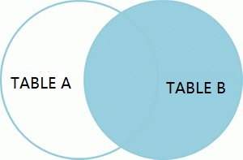
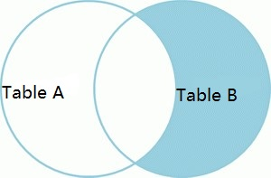
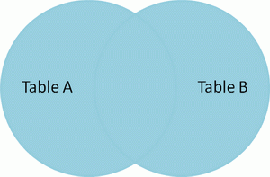
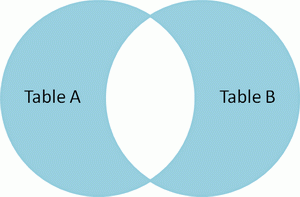

[TOC]

# ali规约

>  建表规约
```sql

```
```sql

```
```sql

```
```sql

```
```sql

```
```sql

```
```sql

```
```sql

```
```sql

```
```sql

```
```sql

```
```sql

```
```sql

```


```sql
"1.强制" 表达是与否概念的字段，必须使用 is_xxx 的方式命名，数据类型是 unsigned tinyint（1表示是，0表示否），此规则同样适用于 odps 建表。-- 说明：任何字段如果为非负数，必须是 unsigned。

"2.强制" 表名、字段名必须使用小写字母或数字；禁止出现数字开头，禁止两个下划线中间只出现数字。数据库字段名的修改代价很大， 因为无法进行预发布，所以字段名称需要慎重考虑。
-- 正例： getter_admin，task_config，level3_name
-- 反例： GetterAdmin，taskConfig，level_3_name

"3.强制" 表名不使用复数名词。-- 说明：表名应该仅仅表示表里面的实体内容，不应该表示实体数量，对应于 DO 类名也是单数形式，符合表达习惯。

"4.强制" 禁用保留字，如 desc、range、match、delayed等，请参考 MySQL 官方保留字。

"5.强制" 唯一索引名为 uk_字段名； 普通索引名则为 idx_字段名。-- 说明：uk_ 即 unique key；idx_ 即 index 的简称。


```


```sql

```
```sql

```
```sql

```
```sql

```
```sql

```
```sql

```
```sql

```
```sql

```
```sql

```
```sql

```
```sql

```


```sql
'1.强制' 不要使用 COUNT(列名) 或 COUNT(常量) 来替代 COUNT(*)。 COUNT(*)就是 SQL92 定义的标准统计行数的语法，跟数据库无关，跟 NULL 和非 NULL 无关。
-- 说明：COUNT(*) 会统计值为 NULL 的行，而 COUNT(列名) 不会统计此列为 NULL 值的行。

'2.强制' COUNT(DISTINCT col) 计算该列除 NULL 之外的不重复数量。
-- 例子：SELECT COUNT(DISTINCT gender) FROM student;
-- 注意：COUNT(DISTINCT col1, col2)如果其中一列全为 NULL，那么即使另一列有不同的值，也返回为 0。

'3.强制' 当某一列的值全是 NULL 时， COUNT(col)的返回结果为 0，但SUM(col)的返回结果为NULL，因此使用 SUM()时需注意 NPE 问题。
-- 正例：避免 SUM 的 NPE 问题： SELECT IF(ISNULL(SUM(g)) ,0, SUM(g)) FROM table;

'4.强制' 使用 ISNULL() 来判断是否为 NULL 值。 -- 注意： NULL 与任何值的直接比较都为 NULL。
-- (1) NULL<>NULL 的返回结果是 NULL，而不是 false。
-- (2) NULL=NULL 的返回结果是 NULL，而不是 true。
-- (3) NULL<>1 的返回结果是 NULL，而不是 true 。

'5.强制' 在代码中写分页查询逻辑时，若总条数 count 为 0 应直接返回，避免执行后面的分页语句。

"6.强制" 不得使用外键与级联，一切外键概念必须在应用层解决。
-- 说明：（概念解释）学生表中的 student_id 是主键，那么成绩表中的 student_id 则为外键。如果更新学生表中的 student_id，同时触发成绩表中的 student_id 更新，则为级联更新。外键与级联更新适用于单机低并发，不适合分布式、高并发集群；级联更新是强阻塞，存在数据库更新风暴的风险；外键影响数据库的插入速度。

'7.强制' 禁止使用存储过程，存储过程难以调试和扩展，更没有移植性。

"8.强制" 数据订正时，删除和修改记录时，要先 select，避免出现误删除，确认无误才能执行更新语句。

'9.推荐' IN操作能避免则避免，实在避免不了，需要仔细评估 IN 后边的集合元素数量，控制在 1000之内。

'10.参考'如果有全球化需要，所有的字符存储与表示，均以 utf-8 编码，那么字符计数方法注意：
-- SELECT LENGTH("轻松工作")； 返回为 12
-- SELECT CHARACTER_LENGTH("轻松工作")； 返回为 4
-- 如果要使用表情，那么使用 utfmb4 来进行存储，注意它与 utf-8 编码的区别

'11.参考'TRUNCATE TABLE 比 DELETE 速度快，且使用的系统和事务日志资源少，但 TRUNCATE 无事务且不触发 trigger，有可能造成事故，故不建议在开发代码中使用此语句。
-- 说明： TRUNCATE TABLE 在功能上与不带 WHERE 子句的 DELETE 语句相同。
```

> 7.【强制】禁止使用存储过程，存储过程难以调试和扩展，更没有移植性。

```sql
调试：线上调试一般就是打日志，在应用层，日志可以在任何一步打，但是存储过程的话，日志没法跟踪详细的执行过程。

扩展：譬如你的 产品购买流程 要增加一个动作，这时候就要修改存储过程到db里，你这时候要直接操作db，而在大公司，直接操作db只能有dba来进行，其他都要审批后使用公司自己开发的工作来进行，且只能是简单的crud。

移植：你用mysql写的存储过程，到了sql-server不一定能直接用。但是在应用层的话，程序里的crud的基础sql基本上通用的，修改下连接串一般就ok了。
```

```sql
-- 存储过程的优点（适合处理场景固定的复杂事务，不要求并发性）：
1.效率高。
    (1).与数据库服务的通信次数少；
    (2).可以直接编译成物理计划，少了parse和查询优化步骤；有些数据库会做得更激进，对过程做JIT；
    (3).发生不可串行化冲突时，事务可以直接在数据库服务端重新执行；
    (4).许多优化都是基于存储过程（近来的许多并发控制的paper都假设事务在存储过程里执行）。
2.极大的简化开发。
    很多逻辑，用JAVA写要写好多代码，而在存储过程里可能几行很简单的SQL就搞定了；上一条的(3)，也有同样的效果。写JAVA代码处理回滚，不仅要做很多处理，也很容易犯错，因事务不可串行化导致的数据bug往往很难发现。
```

```sql
-- 存储过程的缺点：
1.并不是所有开发人员都熟悉怎么使用存储过程，包括像怎么用SQL表示各种复杂逻辑，怎么调试存储过程。
2.SQL是标准的，但存储过程以及控制逻辑，都是各家数据库自已的方言，不可移植到其它数据库。
3.存储过程也是代码，但却和代码分离开了，存储在数据库里。版本控制困难，进而造成从开发，测试，到上线整个流程的复杂度增加。
4.写JAVA代码的人和DBA通常是两波人，引来许多管理上的问题，如，数据库权限，两边人员打乒乓球。
5.工具支持不完善，不好调试（这点取决于用什么数据库）。
```


# 基础相关

##基础概念

> 完全卸载

```java
控制面板，程序和功能，卸载 mysql server!
删除mysql文件夹下的所有文件
删除 "C:\ProgramData\MySQL" 所有文件，如果删除不了则强制粉碎
其中'programData'文件默认是隐藏的，设置显示后即可见！删除后重启电脑，重装mysql就成功了。

如依然安装失败，则运行"regedit"文件，打开注册表:
    删除文件夹 "HKEY_LOCAL_MACHINESYSTEMControlSet001ServicesEventlogApplicationMySQL"
    删除文件夹 "HKEY_LOCAL_MACHINESYSTEMControlSet002ServicesEventlogApplicationMySQL"
    删除文件夹 "HKEY_LOCAL_MACHINESYSTEMCurrentControlSetServicesEventlogApplicationMySQL"
```

> mysql安装

```java
//配置方式
Detailed Configuration: 精确配置，需手动. (选择)
Standard Configuration: 标准配置，自动化配置

//服务器类型
Developer Machine: 开发测试机器，mysql占用很少资源 (选择)
Server Machine: 服务器机器，mysql占用较多资源
Dedicated MySQL Server Machine: 专门的数据库服务器，mysql占用所有可用资源

//数据库用途
Multifunctional Database: 通用多功能型 (选择)
Transactional Database Only: 事务处理型
Non-Transactional Database Only: 非事务处理型

//InnoDB Tablespace - 为InnoDB数据库文件选择一个存储空间
自定义的话，要记住位置，重装的时候要选择一样的地方，否则可能会造成数据库损坏

//mysql访问量，即同时连接的数目
Decision Support(DSS)/OLAP: 20个左右
Online Transaction Processing(OLTP): 500个左右
Manual Setting: 自定义数目

//是否启用TCP/IP连接 (启用)
Port Number: 3306
Enable Strict Mode: 是否启用标准模式，即是否允许细小的语法错误. (选择)

//西文编码
第三个: utf8

//windows服务
是否将mysql安装为windows服务. (选择)
Service Name: 自定义服务名
是否将mysql的bin目录加入到Windows PATH. (选择)

//是否要修改默认root用户(超级管理)的密码
New root password: 自定义root密码. (默认空)
Enable root access from remote machines: 是否允许root用户在其它的机器上登陆. (否) 
Create An Anonymous Account: 新建一个匿名用户，只可连接，不可操作，包括查询. (否)
```

##查询顺序


> 执行顺序

```sql
(8)SELECT (9)DISTINCT <select list>

(1)FROM [left_table]
(3)<join_type> JOIN <right_table>
(2)ON <join_condition>
(4)WHERE <where_condition>
(5)GROUP BY <group_by_list>
(6)WITH <CUBE | RollUP>
(7)HAVING <having_condition>

(10)ORDER BY <order_by_list>
(11)LIMIT <limit_number>
```

- (1).FROM：对FROM子句中的前两个表执行笛卡尔积(交叉联接），生成虚拟表 VT1。
- (2).ON：对VT1应用ON筛选器。只有那些使<join_condition>为真的行才被插入 VT2。
- (3).JOIN：如果指定了OUTER JOIN（相对于CROSS JOIN 或 INNER JOIN），主表中未找到匹配的行将作为外部行添加到 VT2，生成VT3。
- 如果FROM子句包含两个以上的表，则对上一个联接生成的结果表和下一个表重复执行步骤1到步骤3，直到处理完所有的表为止。
- (4).WHERE：对VT3应用WHERE筛选器。只有使<where_condition>为true的行才被插入VT4。
- (5).GROUP BY：按GROUP BY子句中的列对VT4中的行分组，生成VT5。
- (6).CUBE | ROLLUP：把超组（Suppergroups）插入VT5，生成VT6。
- (7).HAVING：对VT6应用HAVING筛选器。只有使<having_condition>为true的组才会被插入VT7。
- (8).SELECT：处理SELECT列表，产生VT8。
- (9).DISTINCT：将重复的行从VT8中移除，产生VT9。
- (10).ORDER BY：将VT9中的行按ORDER BY 子句中的列列表排序，生成游标（VC10)。
- (11).LIMIT：从VC10的开始处选择指定数量或比例的行，生成表VT11，并返回调用者。

**注意**：步骤10，按ORDER BY子句中的列排序上步返回的行，返回游标VC10。这一步是第一步也是唯一一步可以使用SELECT列表中的列别名的步骤。这一步不同于其它步骤的是，它不返回有效的表，而是返回一个游标。SQL是基于集合理论的。集合set不会预先对它的行排序，它只是成员的逻辑集合，成员的顺序无关紧要。对表进行排序的查询可以返回一个对象，包含按特定物理顺序组织的行。ANSI把这种对象称为游标。理解这一步是正确理解SQL的基础。

所以，不要为表中的行假设任何特定的顺序。换句话说，`除非确定要有序行，否则不要指定ORDER BY子句`。排序是需要成本的，mysql需要执行有序索引扫描或使用排序运行符。

> 查询字句顺序

五种子句严格顺序：`where → group by → having → order by → limit`

## 数据类型


## 约束相关

> 约束：一种限制，用于限制表中的数据，为了保证表中数据的准确性和可靠性。

```sql
NOT NULL-- 非空约束，保证该字段的值不能为空。姓名
DEFAULT -- 默认约束，保证该字段有默认值。性别

PRIMARY KEY -- 主键约束，保证该字段的值具有唯一性，且非空。学号
UNIQUE      -- 唯一约束，只保证该字段的值具有唯一性，可为空。如座位号

CHECK       -- 检查约束，但mysql不支持。如性别只能写男女，年龄只能写1-200等。
FOREIGN KEY -- 外键约束，表中该字段的值必须来自主表的关联列的值。
```
```sql
SHOW INDEX FROM `coupon`;
SHOW KEYS FROM `coupon`; -- 查看索引

ALTER TABLE `coupon` DROP index 索引名; -- 删除索引

ALTER TABLE `coupon` ADD key (索引名); -- 新增 普通索引
ALTER TABLE `coupon` ADD primary key 索引名; -- 新增 主键索引
ALTER TABLE `coupon` ADD UNIQUE key (索引名); -- 新增 唯一索引
```

> 主键 & 唯一

```sql
主键 -- 每个表中只能有一个，值必须保证唯一性，且不能为 null。
唯一 -- .......可以有多个，.............，但可以为 null（最多只能有一行 null）。

对于 组合主键 或 组合唯一，二者都支持，但不推荐使用。
组合主键 和 组合唯一 的唯一性：如id，name，只有两条数据的id，name都相同才报错，即不满足唯一性。
```

> 外键约束

```sql
1.外键要求在'从表'上进行设置
2.从表的外键类型和主表的关联列的'类型'要求一致或兼容，名字不一定要一样
3.主表的关联列必须是一个 key（主键或唯一键）
```

> 标识列：又称为自增长列，含义：可以不用手动的插入值，系统提供默认的序列值

```sql
1.标识列必须和主键搭配吗？ -- 不一定，但要求是一个key（也可以是unique）
2.一个表可以有几个标识列？ -- 至多一个！
3.标识列的类型只能是'数值型'
4.标识列可以通过 SET auto_increment_increment=3;设置步长；另外可以通过 手动插入值，设置起始值
```


## 函数

>函数：存储着一系列sql语句，调用函数就是一次性执行这些语句。所以函数可以降低语句重复。

```sql
-- 【区别】存储过程
函数：    返回值 - 有且仅有一个，'不允许返回一个结果集'。函数强调返回值，所以函数不允许返回多个值的情况，即使是查询语句。
存储过程： 返回值 - 有0个或者多个。

函数：    适合做处理数据，并返回一个结果。
存储过程： 适用于批量插入，或批量更新等
```

> 函数创建

```sql
CREATE FUNCTION 函数名([参数列表]) RETURNS 数据类型 -- 参数列表的格式是： 变量名 数据类型
BEGIN
    SQL语句;
    RETURN 值;
END;
```

```sql
-- 定义有参函数
create function fun_test(name varchar(15)) returns int
begin 
    declare c int default 0; --定义局部变量
    select id from class where cname=name into c; --局部变量赋值
    return c;
end;

-- 调用函数
select fun_test("python");
```

> 查看

```sql
show create function 函数名; --查看指定函数

show function status [like 'pattern']; --查看所有函数
```

> 修改：只能修改一些如 comment 的选项，不能修改内部的sql语句和参数列表。

```sql
alter function 函数名 选项；
```

> 删除

```sql
drop function 函数名;
```

## 执行结构

代码执行结构：多条sql语句的执行顺序。主要用于触发器、存储过程和函数等存储多条sql语句中。

> 顺序结构：默认结构，即从上到下依次执行sql语句

>分支结构：依据一定条件选择执行路径，会依据给定的条件来选择执行那些sql语句

```sql

```

```sql

```

```sql

```

> 循环结构：在程序中需要反复执行某个功能而设置的一种程序结构。mysql中循环结构用于循环多次运行同一sql语句。

```sql

```

```sql

```

# 查询命令

##基础查询

> 起别名：对于别名含有特殊符号的（如空格，#等），使用`双引号`括起来。此外，#是sql的注释符号

```sql

```

> 去重：DISTINCT 和 GROUP BY ，二者都是针对给定字段进行去重。


```sql

```

```sql

```

>  模糊查询：通配符`%` 零到多个字符，`_`一个字符，`[]`括号内的一个字符

```sql

```

```sql

```

> 安全等于`<=>`

```sql

```

| 区别：<=> 和 IS NULL | 普通类型的数值 | null值 | 可读性 |
| :------------------: | :------------: | :----: | :----: |
|         <=>          |      可以      |  可以  |   低   |
|       IS NULL        |       不       |  可以  |   高   |

> ANY 和 ALL

- ANY：和子查询返回的`某一值`比较。``


- ALL：和子查询返回的`所有值`比较。``


## 单行函数

> IFNULL

```sql
-- 表 passage_set 中有符合条件的记录，则取之；反之，取表 system_set 的记录
SELECT 
    (CASE WHEN (SELECT memo FROM passage_set WHERE mark="p_number") IS NULL
        THEN (SELECT memo FROM system_set WHERE mark="p_number")
        ELSE (SELECT memo FROM passage_set WHERE mark="p_number") END
    ) memo
```
```sql

```
```sql

```

> IS NULL 或 IS NOT NULL

```sql
SELECT * FROM student WHERE `name` IS NOT NULL;
```

> CONCAT 连接符：

```sql

```

> BETWEEN...AND...（`包括临界值 [5,10]`）

```sql

```

> IN 区间取值，包含临界值

```sql

```

> CASE THEN - 两种格式：(1).简单CASE函数。(2).CASE搜索函数。`容易忘记 END 结束符`

```sql

```

> 数学函数（`a%b = a-a/b*b`）

```sql

```

```java
long l = Math.round(-1.45); //-1
long l = Math.round(-1.65); //-2 --> 同sql

double d = Math.ceil(-1.455);  //-1.0
double d = Math.floor(-1.455); //-2.0 -->同sql
```

> 字符串命令（`SUBSTR() 方法是 SUBSTRING() 的简写，索引从1开始`）

```sql

```

> 时间命令

```sql

```


## 分组函数

SUM，AVG，MIN，MAX，COUNT`（统计非NULL）`用作统计使用，又称为聚合函数，统计函数，组函数。

> SUM，AVG 一般用于数值类型。MAX，MIN 可处理任何类型，如日期类型，字符串类型

```sql

```

> 所有函数 都忽略NULL。其中，对于SUM函数 `NULL和任何数相加结果都为 NULL`

```sql

```

> 所有函数都可以结合 DISTINCT

```sql

```

> COUNT 专题

**count(*)**：所有行进行统计，包括NULL行。
**count(1)**：所有行进行统计，包括NULL行。
**count(column)**：对 column 中非Null进行统计。

`由于 COUNT 统计时，不计入NULL值`。所以，可通过 `COUNT(*)` 统计当前表中的所有记录数，其原理是：当前行只要有一列值不为NULL，计数器就会增加1。但是，这将会造成全表扫描？ mysql有优化，只扫描索引列！

**效率比较**：`COUNT(*) = COUNT(1) = COUNT(PK) > COUNT(N-PK)`

**解释说明**：若表中有索引，COUNT(\*) 与 COUNT(1) 均会使用索引。由于mysql默认对主键添加索引，所以对存在主键的表进行 COUNT(*)、COUNT(1) 查询也都会使用主键索引。


> 关键字 `WHERE`用于分组前筛选，作用于原始表。`HAVING`用于分组后筛选，作用于分组后的表。
>
> 分组函数同时查询的字段要求是`GROUP BY`后的字段，分组函数作为条件肯定是放在`HAVING`语句中。

```sql

```
```sql

```

## 子查询

> FROM后面：子查询结果作为一张虚拟表使用，必须为虚拟表起别名。

```sql
-- 查询每个部门平均工资的工资等级

-- (1).每个部门的平均工资
-- (2).连接工资等级表进行查询，非等值连接
SELECT A.department_id,A.avg,jg.grade_level -- ②
FROM
    (SELECT department_id,AVG(salary) avg -- ①
    FROM employees
    GROUP BY department_id) A
JOIN job_grades jg
ON A.avg BETWEEN jg.lowest_sal AND jg.highest_sal; -- 非等值连接
```

```sql
-- 查询各部门中工资比本部门平均工资高的员工号，姓名。

-- (1).查询各部门的平均工资
-- (2).将①结果A和emp表进行连接查询，满足条件 emp.salary>A.avg
SELECT employee_id,last_name
FROM employees e
JOIN
    (SELECT department_id,AVG(salary) avg
    FROM employees 
    GROUP BY department_id) A
ON A.department_id=e.department_id
WHERE e.salary>A.avg;
```

> WHERE / HAVING后面

```sql
-- 查询最低工资大于 50号部门最低工资 的部门id和其最低工资

-- (1).50号部门的最低工资
-- (2).查询部门的最低工资 >①
SELECT department_id,MIN(salary) min_salary -- ②
FROM employees
GROUP BY department_id;
HAVING min_salary>(
    SELECT MIN(salary) -- ①
    FROM employees
    WHERE department_id=50
);
```

> EXISTS后面：相关子查询，最终结果为 1 或 0。

```sql
-- 查询有选课的学生id和学生名

-- 普通模式：先查出成绩表里的所有学生id
SELECT sid,sname
FROM student
WHERE sid IN(
    SELECT student_id
    FROM score
);
```

```sql
-- EXISTS 模式：
SELECT sid,sname
FROM student s
WHERE EXISTS(
    SELECT *
    FROM score sc
    WHERE sc.student_id=s.sid
);
```

> any，in，some，all 分别是子查询关键词之一

```sql
-- any，all关键字必须与一个比较操作符一起使用。

-- any：和子查询结果中的任一数值进行比较。
-- all：..............所有..........

NOT IN 等同于'<>all'。IN 等同于'=any'。

>ANY() 相当于'>MIN()'。>ALL() 相当于'>MAX()'。
```

```sql
select s1 from t1 where s1 <>any (select s1 from t2);
select s1 from t1 where s1 <>some (select s1 from t2); -- 表t1中有部分s1与t2表中的s1不相等
```


## 分页查询

> LIMIT offset, size：起始索引从0开始，`offset=(page-1)*size`


## 连接查询92

将多张表需要全部放在 FROM 之后，所有的连接条件都放在 WHERE 当中，因此 sql92 中的等值连接、非等值链接、外连接等等，其实只是 WHERE 中的条件不同罢了。

> 非等值连接

```sql
-- 为表起别名：有别名后就不可再用原表名查询字段，即 SELECT employees.salary
SELECT e.salary, jg.grade_level
FROM employees e, job_grades jg
WHERE salary BETWEEN jg.lowest_sal AND jg.highest_sal; -- 查询工资及工资等级
```

> 自连接：单个表进行自身连接

```sql
SELECT e.first_name,e.manager_id,m.first_name -- 查询员工名和其领导名
FROM employees e, employees m
WHERE e.manager_id=m.employee_id;
```

## 连接查询99

使用`from t1 join t2 on t1.c1=t2.c2`的语法来表示哪张表和哪张表进行什么样的连接，连接类型一目了然，写法更加符合逻辑，可读性更好，并且底层支持地更好；

sql99支持功能的较多，实现连接条件和筛选条件的分离使得可读性强。

> 非等值查询

```sql
SELECT e.salary, jg.grade_level -- 查询工资及工资等级
FROM employees e
JOIN job_grades jg
ON e.salary BETWEEN jg.lowest_sal AND jg.highest_sal;
```

> 自连接

```sql
SELECT e.employee_id,e.last_name,m.last_name -- 管理者是KING的员工号，姓名
FROM employees e 
JOIN employees m 
ON e.manager_id=m.employee_id
WHERE m.last_name='K_ING';

SELECT employee_id,last_name -- 效果同上
FROM employees
WHERE manager_id IN(
    SELECT employee_id
    FROM employees
    WHERE last_name='K_ING'
);
```
```sql
-- 赛程表'match'含有字段：'match_id'，'host_id','guest_id','match_time','match_result'。
-- 参赛队伍表'team'含有字段：'t_id','t_name'
-- 查出 2006-6-1 到 2006-7-1 之间举行的所有比赛，用以下形式列出：拜仁 2：0 不来梅 2006-6-21
SELECT t1.t_name '主队',m.match_result '比赛成绩',t2.t_name '客队',m.match_time '比赛时间'
FROM `match` m
JOIN team t1 ON t1.t_id=m.h_id
JOIN team t2 ON t2.t_id=m.g_id;
```


> 各种外连接

```sql
SET FOREIGN_KEY_CHECKS=0;

-- ----------------------------
-- Table structure for a
-- ----------------------------
DROP TABLE IF EXISTS `a`;
CREATE TABLE `a` (
  `id` int(11) NOT NULL AUTO_INCREMENT,
  `deptName` varchar(30) DEFAULT NULL,
  `locAdd` varchar(40) DEFAULT NULL,
  PRIMARY KEY (`id`)
) ENGINE=InnoDB AUTO_INCREMENT=10 DEFAULT CHARSET=utf8;

-- ----------------------------
-- Records of a
-- ----------------------------
INSERT INTO `a` VALUES ('1', 'RD', '11');
INSERT INTO `a` VALUES ('4', 'MIS', '14');
INSERT INTO `a` VALUES ('5', 'FD', '15');
INSERT INTO `a` VALUES ('6', 'SS', '66');

-- ----------------------------
-- Table structure for b
-- ----------------------------
DROP TABLE IF EXISTS `b`;
CREATE TABLE `b` (
  `id` int(11) NOT NULL AUTO_INCREMENT,
  `name` varchar(20) DEFAULT NULL,
  `deptId` int(11) DEFAULT NULL,
  PRIMARY KEY (`id`),
  KEY `deptId` (`deptId`),
  CONSTRAINT `b_ibfk_1` FOREIGN KEY (`deptId`) REFERENCES `a` (`id`)
) ENGINE=InnoDB AUTO_INCREMENT=8 DEFAULT CHARSET=utf8;

-- ----------------------------
-- Records of b
-- ----------------------------
INSERT INTO `b` VALUES ('1', 'z3', '1');
INSERT INTO `b` VALUES ('2', 'z4', '1');
INSERT INTO `b` VALUES ('3', 'z5', '1');
```

> 内连接 INNER JOIN：其中，`INNER可省`。效果和 sql92 的等值连接效果一致。


```sql
SELECT * 
FROM A 
INNER JOIN B ON A.id=B.id;
```

> 左外连接 LEFT OUTER JOIN：其中，`OUTER`可省。A表的所有记录和 B.id= A.id 的所有B的记录。


```sql
SELECT * 
FROM A 
LEFT JOIN B ON A.id=B.id;
```

> 左连接：A表独有的部分。


```sql
SELECT * 
FROM A 
LEFT JOIN B ON A.id=B.id
WHERE B.id IS NULL; --排除从表主键为NULL的记录
```

> 右外连接 RIGHT JOIN




```sql
SELECT * 
FROM A 
RIGHT JOIN B ON A.id=B.id;
```


> 右连接：B表独有的部分




```sql
SELECT * 
FROM A 
RIGHT JOIN B ON A.id=B.id
WHERE A.id IS NULL;
```

> 全连接：所有的数据




```sql
SELECT * FROM A LEFT JOIN B ON A.id=B.id
UNION
SELECT * FROM A RIGHT JOIN B ON A.id=B.id;
```

> 两张表中都没有出现的数据集



```sql
SELECT * FROM A LEFT JOIN B ON A.id=B.id WHERE B.id IS NULL
UNION
SELECT * FROM A RIGHT JOIN B ON A.id=B.id WHERE A.id IS NULL;
```


> 交叉连接：笛卡尔乘积，总条数为 = 主表条数*从表条数 

```sql
SELECT e.employee_id,d.department_id
FROM employees e
CROSS JOIN departments d; -- 交叉连接 a*b
```


# 相关优化

<https://mp.weixin.qq.com/s/NnaecffGc6-FgbEpjp4t7w>

> 数据库优化：设计优化（必须熟悉业务，利于扩展） + 查询优化

```sql
查询语句不要用 SELECT * FROM

避免全局扫描，即涉及到 非 逻辑，不要用 NOT IN，可以用 EXISTS 代替。

创建索引，加速查询，但影响增删改
```


#函数原理

##常用函数

## 函数原理

> IN语句内部原理（数据量 A >> B）。如果确定且有限的集合时，可以使用 IN（0，1，2）

```sql
-- IN 只执行一次，它查出B表中的所有id字段并缓存起来。之后，检查A表的id是否与B表中的id相等，如果相等则将A表的记录加入结果集中，直到遍历完A表的所有记录。
SELECT * FROM A WHERE id in (SELECT id FROM B);
```

```java
List resultSet = {};
Array A = (select * from A);
Array B = (select id from B); //首先执行内层子查询，再执行外层查询, 总共执行两个查询

for (int i = 0; i < A.length; i++) {
    for (int j = 0; j < B.length; j++) {
        if (A[i].id == B[j].id) { //在内存中比较是否包含
            resultSet.add(A[i]);
            break;
        }
    }
}
return resultSet;
```

> EXISTS语句内部原理（数据量 B>A）

```sql
-- EXISTS 每次循环一下外表都要查询一下内表，即使外表数量很少，但是每循环一次外表都要去查询一个大表，这样的效率是不高的，除非子查询走索引，最好走覆盖索引。
-- EXISTS 会执行 A.length 次，它并不缓存 exists() 结果集，因为 exists() 结果集的内容并不重要，重要的是其内查询语句的结果集空或者非空，空则返回false，非空则返回true。
SELECT * FROM A WHERE EXISTS (SELECT 1 FROM B WHERE A.id=B.id);
```
```java
List resultSet = {};
Array A = (select * from A);

for (int i = 0; i < A.length; i++) {
    if (exists(A[i].id) {  //执行 select 1 from B where B.id=A.id 是否有记录返回
        resultSet.add(A[i]);
    }
}
```


# 相关练习

## 其他练习

> 把num值处于[20, 29]之间改为20，处于[30, 39]之间的,改为30。

```sql
UPDATE tName SET num = floor(num/10)*10 WHERE num BETWEEN 20 AND 39;
```

> 把goods表中商品名为 '诺基亚xxxx' 的商品，改为 'HTCxxxx。'

```sql
-- substring(str, index)函数是截取字符串，其中index是从1开始算起
UPDATE goods SET goods_name=concat('HTC',substring(goods_name, 4))
WHERE goods_name LIKE '诺基亚%';
```

> 查询比市场价省钱200元以上的商品及该商品所省的钱（where和having分别实现）。

```sql
-- WHERE 实现
select goods_id,goods_name,market_price-shop_price as k from goods
where market_price-shop_price >200;
```

```sql
-- HAVING 实现
select goods_id,goods_name,market_price-shop_price as k from goods
having k >200;
```

```sql
-- 以下报错
select goods_id,goods_name,market_price-shop_price as k from goods
WHERE k >200;

-- sql解析器 先从原始表中查出 SELECT 后面的各个字段值，保存到内存表中（表中字段有 id, name, k）。
-- WHERE 是对原始表中的字段进行筛选，原始表并不存在 K 这一列，所以会报错。
-- 而 HAVING 是对内存表中的数据进行筛选，所以可行。
```

> 查询出2门及2门以上不及格者的平均成绩。

```sql
-- 表达式score < 60返回0和1，通过sum( )函数可以计算出不及格科目大于2的学生信息
SELECT student_id,SUM(num<60) gk,AVG(num) pj
FROM score sc
GROUP BY student_id
HAVING gk>1;
```

> 查询平均工资最低的部门信息

```sql
-- 子查询方式
SELECT * -- 4.部门信息
FROM departments
WHERE department_id=(
    SELECT department_id -- 3.平均工资=最低平均工资的部门id
    FROM employees
    GROUP BY department_id
    HAVING AVG(salary)=(
        SELECT MIN(ag) -- 2.最低的平均工资
        FROM(
            SELECT AVG(salary) ag -- 1.各部门的平均工资
            FROM employees
            GROUP BY department_id
        )A
    )
);
```

```sql
-- 排序方式
SELECT * -- 2.部门信息
FROM departments
WHERE department_id=(
    SELECT department_id -- 1.各部门的平均工资，按平均工资正序排序，并取第一条
    FROM employees
    GROUP BY department_id
    ORDER BY AVG(salary)
    LIMIT 1
);
```


## 数据准备

```sql

```

![(assets/sql0.png)

## 练习01-10

> 2.查询"生物"课程比"物理"课程成绩高的所有学生的学号

```sql

```

> 4.查询所有同学的学号、姓名、选课数、总成绩

```sql
-- 不能使用 COUNT(*)，当前行只要有一列不为NULL，就会增加1。应该针对具体某一行进行统计

SELECT s.sid,s.sname,COUNT(sc.course_id) cnt_course,SUM(IFNULL(sc.num,0)) sum_num
FROM student s LEFT JOIN score sc ON sc.student_id=s.sid
GROUP BY s.sid;
```

> 6.查询没学过"李平老师"老师课的同学的学号、姓名

```sql
-- 1."李平老师"所有课程id
-- 2.学过课程①的学生id
-- 3.对②进行取反

SELECT sid,sname -- ③
FROM student
WHERE sid NOT IN(
    SELECT DISTINCT student_id -- ②
    FROM score
    WHERE course_id IN(
        SELECT cid -- ①
        FROM teacher t JOIN course c ON c.teacher_id=t.tid
        WHERE tname='李平老师'
    )
);
```

> *7.查询学过"001"并且也学过编号"002"课程的同学的学号，姓名

```sql
-- 先查到既选择001又选择002课程的所有同学
-- 根据学生进行分组，如果学生数量等于2表示，两门均已选择

SELECT s.sid,s.sname
FROM
(SELECT student_id,course_id FROM score WHERE course_id BETWEEN 1 AND 2) AS A
LEFT JOIN student AS s ON s.sid=A.student_id
GROUP BY s.sid
HAVING COUNT(A.course_id)>1;
```

```sql
-- 分别查出选了 001和002 的学生
-- 然后将上两张临时表取交集，以学生id作为关联

SELECT DISTINCT A.student_id AS sid,student.sname AS sname -- 非最优解
FROM
(SELECT student_id,course_id FROM score WHERE course_id='001') AS A
JOIN
(SELECT student_id,course_id FROM score WHERE course_id='002') AS B
ON A.student_id=B.student_id
LEFT JOIN student ON student.sid=A.student_id;
```

> *8.查询学过"李平老师"老师所教的所有课的同学的学号，姓名

```sql
-- 先查询李平老师所有课程id
-- 查询学过课程①的所有学生
-- 注意是学过李平老师的所有课程，所以对②以学生id进行分组处理，筛选选课数=李平老师所有课程数

SELECT DISTINCT student_id,sname
FROM score LEFT JOIN student ON student.sid=score.student_id
WHERE course_id IN(
    SELECT c.cid AS cid
    FROM course AS c JOIN teacher AS t ON t.tid=c.teacher_id WHERE t.tname='李平老师'
    ) AS A GROUP BY student_id
    HAVING COUNT(course_id)=(
        SELECT COUNT(1) FROM course AS c JOIN teacher AS t ON t.tid=c.teacher_id 
        WHERE t.tname='李平老师'
    );
```

> *9.查询课程编号"002"的成绩比课程编号"001"课程低的所有同学的学号，姓名

```sql
SELECT A.student_id
FROM
(SELECT student_id,num FROM score JOIN course ON course.cid=score.course_id
    WHERE cid='002') AS A
JOIN
(SELECT student_id,num FROM score JOIN course ON course.cid=score.course_id
    WHERE cid='001') AS B
ON B.student_id=A.student_id
WHERE A.num<B.num;
```

```sql
-- 交叉查询？
SELECT sid,sname 
FROM student s
WHERE(
    (SELECT num FROM score sc WHERE s.sid=sc.student_id AND sc.course_id='002')
    <
    (SELECT num from score sc WHERE s.sid=sc.student_id AND sc.course_id='001')
);
```

> 10.查询有课程成绩小于60分的同学的学号，姓名

```sql
SELECT DISTINCT student_id,s.sname
FROM score sc
JOIN student s ON s.sid=sc.student_id
WHERE num<60;
```

```sql
-- 子查询。子查询的效率 < 关联查询，因为子查询走的是笛卡尔积
SELECT sid,sname FROM student WHERE sid IN
(SELECT DISTINCT student_id FROM score WHERE num<60);
```

##练习11-20

> 11.查询没有学全所有课的同学的学号，姓名

```sql
--1.先查询所有课程数目
--2.查询选修的课程数目 <① 的学生id

SELECT s.sid,sname,COUNT(sc.course_id) cnt
FROM student s LEFT JOIN score sc ON sc.student_id=s.sid
GROUP BY s.sid
HAVING cnt<(
    SELECT COUNT(*)
    FROM course
);
```

> 12.查询至少有一门课与学号为"001"的同学所学相同的同学的学号和姓名
>
> 13.查询至少学过学号为"001"同学所选课程中任意一门课的其他同学学号和姓名

```sql
-- 0.至少学过一门，使用关键字 ANY 或者 IN。
-- 1.学号“001”所有课程号
-- 2.查出所有学过课程①的学生id，并排除"001"。

SELECT DISTINCT s.sid,s.sname -- ②
FROM student s JOIN score sc ON sc.student_id=s.sid
-- WHERE s.sid<>'001' AND sc.course_id=ANY(
WHERE s.sid<>'001' AND sc.course_id IN(
    SELECT course_id -- ①
    FROM score
    WHERE student_id='001'
);
```

> **14.查询和"002"号的同学学习的课程完全相同的其他同学学号和姓名

```sql
-- 1.查出002学过的课程id
-- 2.查出学过①以外课程的学生id，这些学生的课程肯定和002不一样
-- 3.查出②以外的学生id，这些同学的课程都是002的子集，再通过课程数量排除002的真子集

SELECT * -- ③
FROM score
WHERE student_id<>'002' AND student_id NOT IN(
    SELECT student_id -- ②
    FROM score
    WHERE course_id NOT IN(
        SELECT course_id -- ①
        FROM score
        WHERE student_id='002'
    )
)
GROUP BY student_id
HAVING COUNT(course_id)=(SELECT COUNT(course_id) FROM score WHERE student_id='002');
```

> 15.查询学习"李平老师"老师课的Score表记录

```sql
SELECT *
FROM score
WHERE course_id IN(
    SELECT cid -- 李平老师教过的课程id
    FROM course c JOIN teacher t ON t.tid=c.teacher_id
    WHERE t.tname='李平老师'
);
```

```sql
SELECT sc.* --连表查询
FROM score sc JOIN course c ON c.cid=sc.course_id
RIGHT JOIN teacher t ON t.tid=c.teacher_id
WHERE t.tname='李平老师';
```

> 16.向SC表中插入一些记录：①没有上过编号"002"课程的同学学号；②插入"002"号课程的平均成绩

```sql
-- 学过002的学生id，再取反
-- 查出002课程的平均成绩

INSERT INTO score(student_id, course_id, num)
SELECT sid,'002',(SELECT AVG(num) FROM score WHERE course_id='002') avg_num
FROM student
WHERE sid NOT IN(
    SELECT student_id
    FROM score
    WHERE course_id='002'
);
```

> 16.按平均成绩从低到高显示所有学生的"语文"."数学"."英语"三门的课程成绩，如下形式显示： 学生ID,生物成绩,物理,美术,有效课程数,有效平均分

```sql
SELECT student_id '学生id',
(SELECT num FROM course c JOIN score sc ON sc.course_id=c.cid 
    WHERE c.cname='生物' AND sc.student_id=score.student_id) '生物', -- 子查询和父查询，字段结合
(SELECT num FROM course c JOIN score sc ON sc.course_id=c.cid 
    WHERE c.cname='物理' AND sc.student_id=score.student_id) '物理',
(SELECT num FROM course c JOIN score sc ON sc.course_id=c.cid 
    WHERE c.cname='美术' AND sc.student_id=score.student_id)  '美术',
COUNT(score.course_id) '有效课程数',
AVG(num) '平均有效分'
FROM score
GROUP BY student_id
ORDER BY AVG(num) ASC;
```

> 17.查询各科成绩最高和最低的分：以如下形式显示：课程ID，最高分，最低分

```sql
SELECT course_id '课程id',MAX(num) '最高分',MIN(num) '最低分'
FROM score
GROUP BY course_id;
```

> *18.按各科平均成绩从低到高和及格率的百分数从高到低顺序

```sql
-- 难点在于 统计及格人数，使用 CASE WHEN...THEN...
SELECT course_id,AVG(num) avg,
    SUM(CASE WHEN score.num<60 THEN 0 ELSE 1 END)/COUNT(1)*100 percent
FROM score
GROUP BY course_id
ORDER BY avg ASC, percent DESC;
```

> 19.课程平均分从高到低显示（显示任课老师）

```sql
SELECT AVG(num) avg,c.cid,t.tname
FROM score sc
JOIN course c ON c.cid=sc.course_id 
JOIN teacher t ON t.tid=c.teacher_id
GROUP BY sc.course_id
ORDER BY avg DESC;
```

> *20.查询各科成绩前三名的记录（不考虑成绩并列情况） 

```sql
-- 各科成绩
SELECT c.cid AS 课程ID,c.cname AS 课程,
(SELECT num FROM score AS s WHERE s.course_id=c.cid GROUP BY num ORDER BY num DESC LIMIT 0,1) AS 第一, 
(SELECT num FROM score AS s WHERE s.course_id=c.cid GROUP BY num ORDER BY num DESC LIMIT 1,1) AS 第二, 
(SELECT num FROM score AS s WHERE s.course_id=c.cid GROUP BY num ORDER BY num DESC LIMIT 2,1) AS 第三 
FROM course c;
```

##练习21-30

> 32.查询选修"杨艳"老师所授课程的学生中，成绩最高的学生姓名及其成绩

```sql

```

> 34.查询不同课程但成绩相同的学生的学号.课程号.学生成绩

```sql

```

> 35.查询每门课程成绩最好的前两名

```sql

```

> 37.查询全部学生都选修的课程的课程号和课程名

```sql

```

> 38.查询没学过"叶平"老师讲授的任一门课程的学生姓名

```sql

```

> 39.查询两门以上不及格课程的同学的学号及其平均成绩

```sql

```

> 

```sql

```

> 

```sql

```

> 查询选修“李平老师”所授课程的学生中，成绩最高的学生姓名及其成绩

```sql
SELECT s.sid,s.sname,sc.num
FROM score sc JOIN student s ON s.sid=sc.student_id
WHERE num=(
SELECT MAX(num)
FROM score sc LEFT JOIN course c ON c.cid=sc.course_id LEFT JOIN teacher t ON t.tid=c.teacher_id
WHERE t.tname='李平老师'
);
```

> 查询不同课程但成绩相同的学生的学号.课程号.学生成绩；

```sql

```

> 查询每门课程成绩最好的前两名

```sql
SELECT cid AS 课程ID,cname AS 课程, 
(SELECT num FROM score AS s WHERE s.course_id=c.cid GROUP BY num ORDER BY num DESC LIMIT 0,1) AS 第一, 
(SELECT num FROM score AS s WHERE s.course_id=c.cid GROUP BY num ORDER BY num DESC LIMIT 1,1) AS 第二 
FROM course AS c ---？？？
```

> 查询全部学生都选修的课程的课程号和课程名

```sql
SELECT course_id,COUNT(1) cnt
FROM score
GROUP BY course_id
HAVING cnt=(
    SELECT COUNT(1)
    FROM student
);
```

> 查询没学过"叶平"老师讲授的任一门课程的学生姓名

```sql
SELECT student.sid,student.sname
FROM student s
WHERE s.sid NOT IN 
    (SELECT DISTINCT student_id FROM score WHERE course_id IN
        (SELECT cid FROM course LEFT JOIN teacher ON course.teacher_id=teacher.tid 
        WHERE teacher.tname="李平老师")
    );
```

> 查询两门以上不及格课程的同学的学号及其平均成绩

```sql
SELECT student_id, AVG(num) avg_num,
SUM((CASE WHEN num<60 THEN 1 ELSE 0 END)) sum_60
FROM score
GROUP BY student_id
HAVING sum_60>1;
```

> 

```sql

```

> 

```sql

```

> 

```sql

```

> 

```sql

```

> 

```sql

```

> 

```sql

```

> 

```sql

```

> 

```sql

```

> 

```sql

```

> 

```sql

```

> 

```sql

```

> 

```sql

```

> 

```sql

```

> 

```sql

```

> 

```sql

```

> 

```sql

```

> 

```sql

```

> 

```sql

```

> 

```sql

```

> 

```sql

```

> 

```sql

```

> 

```sql

```

> 

```sql

```

> 

```sql

```

> 

```sql

```

> 

```sql

```

> 

```sql

```

> 

```sql

```

> 

```sql

```

> 

```sql

```

> 

```sql

```

> 

```sql

```

> 

```sql

```

> 

```sql

```

> 

```sql

```

> 

```sql

```

> 

```sql

```

> 

```sql

```

> 

```sql

```

> 

```sql

```

> 

```sql

```

> 

```sql

```

> 

```sql

```

> 

```sql

```

> 

```sql

```

> 

```sql

```

> 

```sql

```

> 

```sql

```

> 

```sql

```

> 

```sql

```

> 

```sql

```

> 

```sql

```

> 

```sql

```

> 

```sql

```

> 

```sql

```

> 

```sql

```

> 

```sql

```

> 

```sql

```

> 

```sql

```

> 

```sql

```

> 

```sql

```

> 

```sql

```

> 

```sql

```

> 

```sql

```

> 

```sql

```

> 

```sql

```

> 

```sql

```

> 

```sql

```

> 

```sql

```

> 

```sql

```

> 

```sql

```

> 

```sql

```

> 

```sql

```

> 

```sql

```

> 

```sql

```

> 

```sql

```

> 

```sql

```

> 

```sql

```

> 

```sql

```

> 

```sql

```

> 

```sql

```

> 

```sql

```

> 

```sql

```

> 

```sql

```

> 

```sql

```

> 

```sql

```

> 

```sql

```

> 

```sql

```

> 

```sql

```

> 

```sql

```

> 

```sql

```

> 

```sql

```

> 

```sql

```

> 

```sql

```

> 

```sql

```

> 

```sql

```

> 

```sql

```

> 

```sql

```

> 

```sql

```

> 

```sql

```

> 

```sql

```

> 

```sql

```

> 

```sql

```

> 

```sql

```

> 

```sql

```

> 

```sql

```

> 

```sql

```

> 

```sql

```

> 

```sql

```

> 

```sql

```


## 题目

```
2.查询"生物"课程比"物理"课程成绩高的所有学生的学号；

3.查询平均成绩大于60分的同学的姓名和平均成绩； 

4.查询所有同学的学号.姓名.选课数.总成绩；

5.查询姓"李"的老师的个数；

6.查询没学过"李平"老师课的同学的学号.姓名；

7.查询学过"001"并且也学过编号"002"课程的同学的学号.姓名；

8.查询学过"叶平"老师所教的所有课的同学的学号.姓名；

9.查询课程编号"002"的成绩比课程编号"001"课程低的所有同学的学号.姓名；

10.查询有课程成绩小于60分的同学的学号.姓名；

11.查询没有学全所有课的同学的学号.姓名；

12.查询至少有一门课与学号为"001"的同学所学相同的同学的学号和姓名；

13.查询至少学过学号为"001"同学所有一门课的其他同学学号和姓名；

14.查询和"002"号的同学学习的课程完全相同的其他同学学号和姓名；

15.删除学习"叶平"老师课的SC表记录；

16.向SC表中插入一些记录，这些记录要求符合以下条件：①没有上过编号"002"课程的同学学号；②插入"002"号课程的平均成绩； 

17.按平均成绩从低到高显示所有学生的"语文"."数学"."英语"三门的课程成绩，按如下形式显示： 学生ID,语文,数学,英语,有效课程数,有效平均分；

18.查询各科成绩最高和最低的分：以如下形式显示：课程ID，最高分，最低分；

19.按各科平均成绩从低到高和及格率的百分数从高到低顺序；

20.课程平均分从高到低显示（现实任课老师）；

21.查询各科成绩前三名的记录:(不考虑成绩并列情况) 


32.查询选修"杨艳"老师所授课程的学生中，成绩最高的学生姓名及其成绩；


34.查询不同课程但成绩相同的学生的学号.课程号.学生成绩；

35.查询每门课程成绩最好的前两名；


37.查询全部学生都选修的课程的课程号和课程名；

38.查询没学过"叶平"老师讲授的任一门课程的学生姓名；

39.查询两门以上不及格课程的同学的学号及其平均成绩；


```


