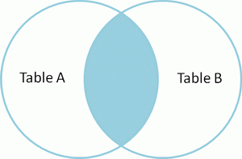
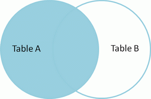

[TOC]


# 相关概念

##基础概念

> 名词解析

DB：Data-Base，数据库，存储一系列有组织的数据
DBMS：Data-Base-Manage-System，数据库管理系统软件，如：Mysql，Oracle，sql-server
SQL：Structure-Query-Language，结构化查询语言，与数据库通信

> 基础语法

不区分大小写。建议关键字大写，表名和列名小写。每条命令使用分号结尾。


##基础配置

> linux环境mysql日志配置在`my.cnf 或 mysql.cnf`

```java
find / -name my.cnf(mysql.cnf) //查找这两个文件所在位置
log-error=/var/log/mysql.log   //在上述两个文件中配置
```

> 远程登录

```sql
-- GRANT [权限内容] ON [库名.表名] TO [用户名@'IP地址'] IDENTIFIED BY ['密码']WITH GRANT OPTION;
-- 赋予用户名 MAO，密码 MIAOMIAO 的用户可以在任意设备上操作所有数据库表的权限
GRANT ALL PRIVILEGES ON *.* TO MAO@'%' IDENTIFIED BY 'MIAOMIAO' WITH GRANT OPTION;
```


> 完全卸载

```java
控制面板，程序和功能，卸载 mysql server!
删除mysql文件夹下的所有文件
删除 "C:\ProgramData\MySQL" 所有文件，如果删除不了则强制粉碎
其中'programData'文件默认是隐藏的，设置显示后即可见！删除后重启电脑，重装mysql就成功了。

如依然安装失败，则运行"regedit"文件，打开注册表:
    删除文件夹 "HKEY_LOCAL_MACHINESYSTEMControlSet001ServicesEventlogApplicationMySQL"
    删除文件夹 "HKEY_LOCAL_MACHINESYSTEMControlSet002ServicesEventlogApplicationMySQL"
    删除文件夹 "HKEY_LOCAL_MACHINESYSTEMCurrentControlSetServicesEventlogApplicationMySQL"
```

> mysql安装

```java
//配置方式
Detailed Configuration: 精确配置，需手动. (选择)
Standard Configuration: 标准配置，自动化配置

//服务器类型
Developer Machine: 开发测试机器，mysql占用很少资源 (选择)
Server Machine: 服务器机器，mysql占用较多资源
Dedicated MySQL Server Machine: 专门的数据库服务器，mysql占用所有可用资源

//数据库用途
Multifunctional Database: 通用多功能型 (选择)
Transactional Database Only: 事务处理型
Non-Transactional Database Only: 非事务处理型

//InnoDB Tablespace - 为InnoDB数据库文件选择一个存储空间
自定义的话，要记住位置，重装的时候要选择一样的地方，否则可能会造成数据库损坏

//mysql访问量，即同时连接的数目
Decision Support(DSS)/OLAP: 20个左右
Online Transaction Processing(OLTP): 500个左右
Manual Setting: 自定义数目

//是否启用TCP/IP连接 (启用)
Port Number: 3306
Enable Strict Mode: 是否启用标准模式，即是否允许细小的语法错误. (选择)

//西文编码
第三个: utf8

//windows服务
是否将mysql安装为windows服务. (选择)
Service Name: 自定义服务名
是否将mysql的bin目录加入到Windows PATH. (选择)

//是否要修改默认root用户(超级管理)的密码
New root password: 自定义root密码. (默认空)
Enable root access from remote machines: 是否允许root用户在其它的机器上登陆. (否) 
Create An Anonymous Account: 新建一个匿名用户，只可连接，不可操作，包括查询. (否)
```


##查询顺序


> 执行顺序

```sql
(8)SELECT (9)DISTINCT <select list>

(1)FROM [left_table]
(3)<join_type> JOIN <right_table>
(2)ON <join_condition>
(4)WHERE <where_condition>
(5)GROUP BY <group_by_list>
(6)WITH <CUBE | RollUP>
(7)HAVING <having_condition>

(10)ORDER BY <order_by_list>
(11)LIMIT <limit_number>
```

- (1).FROM：对FROM子句中的前两个表执行笛卡尔积(交叉联接），生成虚拟表 VT1。
- (2).ON：对VT1应用ON筛选器。只有那些使<join_condition>为真的行才被插入 VT2。
- (3).JOIN：如果指定了OUTER JOIN（相对于CROSS JOIN 或 INNER JOIN），主表中未找到匹配的行将作为外部行添加到 VT2，生成VT3。
- 如果FROM子句包含两个以上的表，则对上一个联接生成的结果表和下一个表重复执行步骤1到步骤3，直到处理完所有的表为止。
- (4).WHERE：对VT3应用WHERE筛选器。只有使<where_condition>为true的行才被插入VT4。
- (5).GROUP BY：按GROUP BY子句中的列对VT4中的行分组，生成VT5。
- (6).CUBE | ROLLUP：把超组（Suppergroups）插入VT5，生成VT6。
- (7).HAVING：对VT6应用HAVING筛选器。只有使<having_condition>为true的组才会被插入VT7。
- (8).SELECT：处理SELECT列表，产生VT8。
- (9).DISTINCT：将重复的行从VT8中移除，产生VT9。
- (10).ORDER BY：将VT9中的行按ORDER BY 子句中的列列表排序，生成游标（VC10)。
- (11).LIMIT：从VC10的开始处选择指定数量或比例的行，生成表VT11，并返回调用者。

**注意**：步骤10，按ORDER BY子句中的列排序上步返回的行，返回游标VC10。这一步是第一步也是唯一一步可以使用SELECT列表中的列别名的步骤。这一步不同于其它步骤的是，它不返回有效的表，而是返回一个游标。SQL是基于集合理论的。集合set不会预先对它的行排序，它只是成员的逻辑集合，成员的顺序无关紧要。对表进行排序的查询可以返回一个对象，包含按特定物理顺序组织的行。ANSI把这种对象称为游标。理解这一步是正确理解SQL的基础。

所以，不要为表中的行假设任何特定的顺序。换句话说，`除非确定要有序行，否则不要指定ORDER BY子句`。排序是需要成本的，mysql需要执行有序索引扫描或使用排序运行符。

> 查询字句顺序

五种子句严格顺序：`where → group by → having → order by → limit`

# 基础命令

##DDL定义

> 登陆命令

```sql
-- [-h] 服务器ip; [-P] 端口号(默认3306,非默认则必须显示指定); [-u] 用户名; [-p] 密码
mysql -h 192.168.5.25 -P 33306 -u bluecardsoft -p
```

```sql
SELECT VERSION(); -- 数据库版本
SELECT name, DATABASE() FROM flower; -- 查看当前所在的数据库或表

SELECT ROW_COUNT(); -- 返回受影响的行数
```

> sql分类

- DDL：Data-Define-Languge，数据定义语言。                如，create，drop，alter
- DML：Data-Manipulate-Language，数据操作语言。     如，insert，update，delete
- DQL：Data-Query-Language，数据查询语言。              如，select
- TCL：Transaction-Control-Language，事务控制语言。 如，commit，rollback    

> DDL（定义）

```sql
-- CREATE TABLE 表名(字段 类型 约束 COMMENT 列注释, ...) COMMENT 表注释

DROP TABLE IF EXISTS flower;
CREATE TABLE flower(
    id INT(10)  PRIMARY KEY auto_increment COMMENT '编号', -- 主键自增，字段注释
    name VARCHAR(30) NOT NULL COMMENT '花名',
    price FLOAT NOT NULL DEFAULT 0.0 COMMENT '价格', -- 默认价格0.0
    production VARCHAR(50) NOT NULL COMMENT '原产地'
) COMMENT '花花'

DESC flower; -- DESC 查看表的详细信息

ALTER TABLE tbName ADD 列名 列类型 [列参数] [NOT NULL DEFAULT]; --增加列
ALTER TABLE tbName CHANGE 旧列名 新列名 列类型 [列参数] [NOT NULL DEFAULT] --修改列

ALTER TABLE tbName DROP 列名; --删除列
ALTER TABLE tbName DROP 主键列; --删除主键

TRUNCATE tbName; --清空表
```

> 索引相关

```sql
SHOW INDEX FROM `coupon`;
SHOW KEYS FROM `coupon`; -- 查看索引

ALTER TABLE `coupon` DROP index 索引名; -- 删除

ALTER TABLE `coupon` ADD key (索引名); -- 新增 普通索引
ALTER TABLE `coupon` ADD primary key 索引名; -- 新增 主键索引
ALTER TABLE `coupon` ADD UNIQUE key (索引名); -- 新增 唯一索引
```

##DML操作

>INSERT：两种语法

```sql
-- 列与值要严格对应。如果没有显示指明列名，则代表插入所有的列。
INSERT INTO flower VALUES('牵牛花',1.1,'山西'); -- 错误写法，自增主键也得显示赋值 DEFAULT
INSERT INTO flower VALUES(DEFAULT,'牵牛花',1.1,'山西');

-- 显示指定列名。对于Nullable列，如不指定则默认插入NULL
INSERT INTO flower(id,name,price) VALUES(DEFAULT,'牵牛花',1.1);
```

```sql
-- 另一种插入方式
INSERT INTO flower(name,price,production)
SELECT '向日葵',5.9,'大理';

INSERT INTO flower
SET `name`='牡丹花',price=1.3*6,production='杭州'; --具体详见练习15
```

```sql
-- 两种插入方式比较：
-- (1).第一种方式支持批量插入，第二种不支持
-- (2).第一种方式支持子查询，第二种不支持

INSERT INTO flower VALUES(DEFAULT,'牵牛花',1.1,'山西'), -- 1.批量插入
(DEFAULT,'喇叭花',1.2,'山西'),
(DEFAULT,'太阳花',1.3,'辽宁'); 

INSERT INTO flower(name,price,production)
SELECT '向日葵',(SELECT 1.0*5),'大理'; -- 2.子查询
```

> UPDATE

```sql
-- 修改语句
UPDATE flower
SET price=5.3,production='云南'
WHERE name LIKE '%向日葵%'; -- 必须添加条件，否则全表修改
```


# 查询命令

##基础查询

> 起别名：对于别名含有特殊符号的（如空格，#等），使用`双引号`括起来。此外，#是sql的注释符号

```sql
SELECT id, `name` "stu#name" FROM student;
```

> 去重：DISTINCT 和 GROUP BY ，二者都是针对给定字段进行去重。

DISTINCT 方式就是两两对比，需要遍历整个表。GROUP BY 分组类似先建立索引再查索引。

两者对比，大表 GROUP BY 快。小表DISTINCT 快，不用建索引。但小表就算建索引，也不会慢到哪去。

```sql
SELECT DISTINCT course_id,num -- DISTINCT：课程id和成绩都相同的，才进行去重
FROM score;
```

```sql
SELECT course_id,num -- GROUP BY 方式
FROM score
GROUP BY course_id,num;
```

>  模糊查询：通配符`%` 零到多个字符，`_`一个字符，`[]`括号内的一个字符

```sql
SELECT * FROM student WHERE `id` LIKE '1%'; -- id以1开头，可以匹配数值型。

SELECT * FROM student WHERE `name` LIKE '_\_%'; -- 第二个字符为下划线（系统转义符）
SELECT * FROM student WHERE `name` LIKE '_$_%' ESCAPE '$'; --自定义转义符 $
```

```sql
-- 两句查询结果不一样。因为，like '%%' 只查询不为 NULL 的值。
SELECT * FROM employee; 
SELECT * FROM employee WHERE first_name like '%%'; 
```

> 安全等于`<=>`

```sql
SELECT * FROM student WHERE `name` <=> '如花'; -- 对于非NULL，等同于 =
SELECT * FROM student WHERE `name` <=> NULL; -- 对于NULL，等同于 IS

SELECT * FROM student WHERE `name` IS NULL; -- IS NULL 
```

| 区别：<=> 和 IS NULL | 普通类型的数值 | null值 | 可读性 |
| :------------------: | :------------: | :----: | :----: |
|         <=>          |      可以      |  可以  |   低   |
|       IS NULL        |       不       |  可以  |   高   |

> ANY 和 ALL

- ANY：和子查询返回的`某一值`比较。`>ANY() 相当于 >MIN()`


- ALL：和子查询返回的`所有值`比较。`>ALL() 相当于 >MAX()`

```sql
-- 查询其他部门中比job_id为"IT_PROG"任一工资低的员工信息

-- 普通方式：比任一工资低 等同于 比最高工资低，先查出"IT_PROG"中的最高工资。
SELECT *
FROM employees
WHERE job_id<>'IT_PROG'
AND salary<(
    SELECT MAX(salary) --最高工资
    FROM employees
    WHERE job_id='IT_PROG'
);
```

```sql
SELECT *
FROM employees
WHERE job_id<>'IT_PROG'
AND salary < ANY( -- 任一都低，即 <ANY()。使用关键字 ANY
    SELECT DISTINCT salary
    FROM employees
    WHERE job_id='IT_PROG'
);
```


## 单行函数

> IFNULL

```sql
-- 表 passage_set 中有符合条件的记录，则取之；反之，取表 system_set 的记录
SELECT 
    (CASE WHEN (SELECT memo FROM passage_set WHERE mark="p_number") IS NULL
        THEN (SELECT memo FROM system_set WHERE mark="p_number")
        ELSE (SELECT memo FROM passage_set WHERE mark="p_number") END
    ) memo
```
```sql
-- 利用三目函数 IF(e1, e2, e3)
SELECT IF((SELECT memo FROM passage_set WHERE mark="park_number") IS NULL,
	(SELECT memo FROM system_set WHERE mark="park_number"),
	(SELECT memo FROM passage_set WHERE mark="park_number")) memo
```
```sql
-- 利用函数 IFNULL(e1, e2) 
SELECT IFNULL ((SELECT memo FROM passage_set WHERE mark="park_number"),
	(SELECT memo FROM system_set WHERE mark="park_number")) memo
```

> IS NULL 或 IS NOT NULL

```sql
SELECT * FROM student WHERE `name` IS NOT NULL;
```

> CONCAT 连接符：`NULL和任何值相加，结果都为NULL`

```sql
SELECT 5+'aa'; -- 对于非数值的一方，作取0处理。最终结果：5
SELECT NULL+5; -- NULL和任何值相加，结果都为NULL

SELECT CONCAT(first_name, last_name) AS 姓名 FROM student; -- 将查询结果拼接
```

> BETWEEN...AND...（`包括临界值 [5,10]`）

```sql
SELECT id FROM student WHERE id BETWEEN 5 AND 10;
```

> IN 区间取值，包含临界值

```sql
SELECT * FROM student WHERE tid in(2, 3);
```

> CASE THEN - 两种格式：(1).简单CASE函数。(2).CASE搜索函数。`容易忘记 END 结束符`

```sql
-- 简单CASE函数 --> 相当于Switch
SELECT employee_id,
    (CASE sex
        WHEN '1' THEN '男'
        WHEN '0' THEN '女'
        ELSE '其他' END) sex
FROM employees

-- CASE搜索函数 --> 相当于if-else ---> 两者区别：前者适合离散的等值条件，后者适合逻辑逻辑条件
SELECT employee_id,
    (CASE
        WHEN sex=1 THEN '男'
        WHEN sex=0 THEN '女'
        ELSE '其他' END) sex
FROM employees
```


> 数学函数（`a%b = a-a/b*b`）

```sql
SELECT ROUND(-1.45) n1, ROUND(-1.65) n2; -- -1，-2 -->先绝对值，再四舍五入，最后加符号
SELECT ROUND(-1.455, 2) n1; -- -1.46 -->保留两位小数

SELECT CEIL(-1.451) n1;  -- -1 -->向上取整，返回 >= 参数的最小整数
SELECT FLOOR(-1.451) n1; -- -2 -->向下取整，... <= ............

SELECT TRUNCATE(-1.499, 1) n1; -- -1.4 -->截断，保留一位小数

SELECT MOD(-10, -3) n1; -- -1 -->取余%，取余操作的符号位和被除数一致。 a%b = a-a/b*b
```

```java
long l = Math.round(-1.45); //-1
long l = Math.round(-1.65); //-2 --> 同sql

double d = Math.ceil(-1.455);  //-1.0
double d = Math.floor(-1.455); //-2.0 -->同sql
```


> 字符串命令（`SUBSTR() 方法是 SUBSTRING() 的简写，索引从1开始`）

```sql
SELECT LENGTH('测试') AS length;			-- 6 --> 以'字节'为单位（汉字：utf-8占3字节，GBK占2）
SELECT CHAR_LENGTH('测试') AS charLength;	-- 2 --> ..'字符'.....【推荐】

SELECT CONCAT('aaa', 'vvv') con; -- 字符串拼接

SELECT INSTR('ASDFGH', 'SD') AS instr; -- 2 -->子串第一次出现的索引，找不到返回0

SELECT LEFT('RUNOOB', 3) AS leftStr;      -- RUN --> 左侧前3位字符
SELECT RIGHT('RUNOOB', 3) AS rightStr;    -- OOB --> 右侧后3......
SELECT MID('RUNOOB', 2, 3) AS midStr;     -- UNO --> 中间第2位字符开始(从1开始计数),截取3位

SELECT SUBSTR('RUNOOB', 2) AS subStr;     -- UNOOB
SELECT SUBSTR('RUNOOB', 2, 3) AS subStr;  -- UNO --> 同 MID()
SELECT SUBSTR('RUNOOB', -3) AS subStr;    -- OOB --> 同 RIGHT()

SELECT SUBSTRING_INDEX('192.168.5.120', '.', 2) AS subIndex;  -- 192.168 --> 截第二个'.'之前
SELECT SUBSTRING_INDEX('192.168.5.120', '.', -2) AS subIndex; -- 5.120   --> ...........后
SELECT SUBSTRING_INDEX('192.168.5.120', '..', 2) AS subIndex; -- 192.168.5.120 -> 无返回所有

SELECT REPLACE('192.168.5.120','.','') INTO @repStr; -- 1921685120 --> 替换

SELECT UCASE("runoob") AS uCase; -- RUNOOB
SELECT LCASE("RUNOOB") AS lCase; -- runoob --> 大小写转换

SELECT REPLACE('192.168.5.123','.','') INTO @device_id; -- 1921685123
SELECT SUBSTR(@device_id, LENGTH(@device_id)-8, 9) INTO @device_id; -- 921685123
```

```sql
-- 查询邮箱中的用户名。两个函数：字符串截取，字符索引
SELECT SUBSTR(email,1, INSTR(email,'@')-1) s
FROM employees;
```


> 时间命令

```sql
-- NOW(); 当前的日期和时间   2008-12-29 16:25:46
-- CURDATE(); 当前的日期    2008-12-29
-- CURTIME(); 当前的时间    16:25:46

SELECT YEAR('2019-4-23 20:41:20') y; -- 2019 -->截取年份

-- DATE(); 提取字符串中的日期部分. SELECT DATE("2019-01-11 14:38:11") AS Date		
-- EXTRACT(); 提取字符串的各时间部分.
SET @now=NOW();
SELECT EXTRACT(YEAR FROM @now) AS nowYear, -- 2019
	   EXTRACT(HOUR FROM @now) AS nowHour; -- 14

-- DATE_ADD() / DATE_SUB(); 给定日期添加(减少)指定的时间间隔
SELECT DATE_ADD(@now, INTERVAL 1 DAY);	-- 1天后的NOW.(-1表示1天前)

-- DATEDIFF(); 两个日期之间的天数
SELECT DATEDIFF('2008-12-30','2008-12-31') AS DiffDate -- -1

-- DATE_FORMAT(); 日期时间格式化
SELECT DATE_FORMAT(NOW(),'%Y-%m-%d %H:%i:%s') AS FormatNow; -- 2019-01-11 14:56:19

-- 将日期格式的字符，转换成指定格式的日期
SELECT STR_TO_DATE('23/04/2019', '%d/%m/%Y') str2date; -- 2019-04-23
```

| 序号 | 格式符 |         功能          |
| :--: | :----: | :-------------------: |
|  1   |   %Y   |       4位的年份       |
|  2   |   %y   |       2位的年份       |
|  3   |   %m   | 月份（01，02…11，12） |
|  4   |   %c   |  月份（1，2…11，12）  |
|  5   |   %d   |     日（01，02…）     |
|  6   |   %H   |   小时（24小时制）    |
|  7   |   %h   |   小时（12小时制）    |
|  8   |   %i   |   分钟（00，01…59）   |
|  9   |   %s   |    秒（00，01…59）    |


## 分组函数

SUM，AVG，MIN，MAX，COUNT`（统计非NULL）`用作统计使用，又称为聚合函数，统计函数，组函数。

> SUM，AVG 一般用于数值类型。MAX，MIN 可处理任何类型，如日期类型，字符串类型

```sql
SELECT SUM(salary), AVG(salary) FROM employees;

SELECT MAX(hiredate), MIN(first_name) FROM employees; --日期类型，字符串类型
```

> 所有函数 都忽略NULL。其中，对于SUM函数 `NULL和任何数相加结果都为 NULL`

```sql
SELECT SUM(commission_pct), AVG(commission_pct), SUM(commission_pct)/COUNT(commission_pct)
FROM employees;
```

> 所有函数都可以结合 DISTINCT

```sql
SELECT SUM(DISTINCT salary) s1, SUM(salary) s2 FROM employees;
```

> COUNT 专题

**count(*)**：所有行进行统计，包括NULL行。
**count(1)**：所有行进行统计，包括NULL行。
**count(column)**：对 column 中非Null进行统计。

`由于 COUNT 统计时，不计入NULL值`。所以，可通过 `COUNT(*)` 统计当前表中的所有记录数，其原理是：当前行只要有一列值不为NULL，计数器就会增加1。但是，这将会造成全表扫描？ mysql有优化，只扫描索引列！

**效率比较**：`COUNT(*) = COUNT(1) = COUNT(PK) > COUNT(N-PK)`

**解释说明**：若表中有索引，COUNT(\*) 与 COUNT(1) 均会使用索引。由于mysql默认对主键添加索引，所以对存在主键的表进行 COUNT(*)、COUNT(1) 查询也都会使用主键索引。


> 关键字 `WHERE`用于分组前筛选，作用于原始表。`HAVING`用于分组后筛选，作用于分组后的表。
>
> 分组函数同时查询的字段要求是`GROUP BY`后的字段，分组函数作为条件肯定是放在`HAVING`语句中。

```sql
SELECT department_id, MAX(salary) max
FROM employees
WHERE commission_pct IS NOT NULL
GROUP BY department_id
ORDER BY max DESC; -- 每个部门，有奖金员工中的最高工资 --> WHERE
```
```sql
SELECT department_id, COUNT(department_id) AS count 
FROM employees
GROUP BY department_id
HAVING count>2
ORDER BY count ASC; -- 查询哪个部门的员工数大于2 --> HAVING
```

## 子查询

出现在其他语句中的select语句，称为子查询或内查询。

> FROM后面：子查询结果作为一张虚拟表使用，必须为虚拟表起别名。

```sql
-- 查询每个部门平均工资的工资等级

-- (1).每个部门的平均工资
-- (2).连接工资等级表进行查询，非等值连接
SELECT A.department_id,A.avg,jg.grade_level -- ②
FROM
    (SELECT department_id,AVG(salary) avg -- ①
    FROM employees
    GROUP BY department_id) A
JOIN job_grades jg
ON A.avg BETWEEN jg.lowest_sal AND jg.highest_sal; -- 非等值连接
```

```sql
-- 查询各部门中工资比本部门平均工资高的员工号，姓名。

-- (1).查询各部门的平均工资
-- (2).将①结果A和emp表进行连接查询，满足条件 emp.salary>A.avg
SELECT employee_id,last_name
FROM employees e
JOIN
    (SELECT department_id,AVG(salary) avg
    FROM employees 
    GROUP BY department_id) A
ON A.department_id=e.department_id
WHERE e.salary>A.avg;
```

> WHERE / HAVING后面

```sql
-- 查询最低工资大于 50号部门最低工资 的部门id和其最低工资

-- (1).50号部门的最低工资
-- (2).查询部门的最低工资 >①
SELECT department_id,MIN(salary) min_salary -- ②
FROM employees
GROUP BY department_id;
HAVING min_salary>(
    SELECT MIN(salary) -- ①
    FROM employees
    WHERE department_id=50
);
```

> EXISTS后面：相关子查询，最终结果为 1 或 0。

```sql
-- 查询有选课的学生id和学生名

-- 普通模式：先查出成绩表里的所有学生id
SELECT sid,sname
FROM student
WHERE sid IN(
    SELECT student_id
    FROM score
);
```

```sql
-- EXISTS 模式：
SELECT sid,sname
FROM student s
WHERE EXISTS(
    SELECT *
    FROM score sc
    WHERE sc.student_id=s.sid
);
```

## 分页查询

> LIMIT offset, size：起始索引从0开始，`offset=(page-1)*size`


#连接查询

## 连接查询92

将多张表需要全部放在 FROM 之后，所有的连接条件都放在 WHERE 当中，因此 sql92 中的等值连接、非等值链接、外连接等等，其实只是 WHERE 中的条件不同罢了。

> 非等值连接

```sql
-- 为表起别名：有别名后就不可再用原表名查询字段，即 SELECT employees.salary
SELECT e.salary, jg.grade_level
FROM employees e, job_grades jg
WHERE salary BETWEEN jg.lowest_sal AND jg.highest_sal; -- 查询工资及工资等级
```

> 自连接：单个表进行自身连接

```sql
SELECT e.first_name,e.manager_id,m.first_name -- 查询员工名和其领导名
FROM employees e, employees m
WHERE e.manager_id=m.employee_id;
```

## 连接查询99

使用`from t1 join t2 on t1.c1=t2.c2`的语法来表示哪张表和哪张表进行什么样的连接，连接类型一目了然，写法更加符合逻辑，可读性更好，并且底层支持地更好；

sql99支持功能的较多，实现连接条件和筛选条件的分离使得可读性强。

> 非等值查询

```sql
SELECT e.salary, jg.grade_level -- 查询工资及工资等级
FROM employees e
JOIN job_grades jg
ON e.salary BETWEEN jg.lowest_sal AND jg.highest_sal;
```

> 自连接

```sql
SELECT e.employee_id,e.last_name,m.last_name -- 管理者是KING的员工号，姓名
FROM employees e 
JOIN employees m 
ON e.manager_id=m.employee_id
WHERE m.last_name='K_ING';

SELECT employee_id,last_name -- 效果同上
FROM employees
WHERE manager_id IN(
    SELECT employee_id
    FROM employees
    WHERE last_name='K_ING'
);
```
```sql
-- 赛程表'match'含有字段：'match_id'，'host_id','guest_id','match_time','match_result'。
-- 参赛队伍表'team'含有字段：'t_id','t_name'
-- 查出 2006-6-1 到 2006-7-1 之间举行的所有比赛，用以下形式列出：拜仁 2：0 不来梅 2006-6-21
SELECT t1.t_name '主队',m.match_result '比赛成绩',t2.t_name '客队',m.match_time '比赛时间'
FROM `match` m
JOIN team t1 ON t1.t_id=m.h_id
JOIN team t2 ON t2.t_id=m.g_id;
```


> 各种外连接

```sql
SET FOREIGN_KEY_CHECKS=0;

-- ----------------------------
-- Table structure for a
-- ----------------------------
DROP TABLE IF EXISTS `a`;
CREATE TABLE `a` (
  `id` int(11) NOT NULL AUTO_INCREMENT,
  `deptName` varchar(30) DEFAULT NULL,
  `locAdd` varchar(40) DEFAULT NULL,
  PRIMARY KEY (`id`)
) ENGINE=InnoDB AUTO_INCREMENT=10 DEFAULT CHARSET=utf8;

-- ----------------------------
-- Records of a
-- ----------------------------
INSERT INTO `a` VALUES ('1', 'RD', '11');
INSERT INTO `a` VALUES ('4', 'MIS', '14');
INSERT INTO `a` VALUES ('5', 'FD', '15');
INSERT INTO `a` VALUES ('6', 'SS', '66');

-- ----------------------------
-- Table structure for b
-- ----------------------------
DROP TABLE IF EXISTS `b`;
CREATE TABLE `b` (
  `id` int(11) NOT NULL AUTO_INCREMENT,
  `name` varchar(20) DEFAULT NULL,
  `deptId` int(11) DEFAULT NULL,
  PRIMARY KEY (`id`),
  KEY `deptId` (`deptId`),
  CONSTRAINT `b_ibfk_1` FOREIGN KEY (`deptId`) REFERENCES `a` (`id`)
) ENGINE=InnoDB AUTO_INCREMENT=8 DEFAULT CHARSET=utf8;

-- ----------------------------
-- Records of b
-- ----------------------------
INSERT INTO `b` VALUES ('1', 'z3', '1');
INSERT INTO `b` VALUES ('2', 'z4', '1');
INSERT INTO `b` VALUES ('3', 'z5', '1');
```

> 内连接 INNER JOIN：其中，`INNER可省`。效果和 sql92 的等值连接效果一致。



```sql
SELECT * 
FROM A 
INNER JOIN B ON A.id=B.id;
```

> 左外连接 LEFT OUTER JOIN：其中，`OUTER`可省。A表的所有记录和 B.id= A.id 的所有B的记录。



```sql
SELECT * 
FROM A 
LEFT JOIN B ON A.id=B.id;
```

> 左连接：A表独有的部分。


```sql
SELECT * 
FROM A 
LEFT JOIN B ON A.id=B.id
WHERE B.id IS NULL; --排除从表主键为NULL的记录
```

> 右外连接 RIGHT JOIN


```sql
SELECT * 
FROM A 
RIGHT JOIN B ON A.id=B.id;
```


> 右连接：B表独有的部分


```sql
SELECT * 
FROM A 
RIGHT JOIN B ON A.id=B.id
WHERE A.id IS NULL;
```

> 全连接：所有的数据


```sql
SELECT * FROM A LEFT JOIN B ON A.id=B.id
UNION
SELECT * FROM A RIGHT JOIN B ON A.id=B.id;
```

> 两张表中都没有出现的数据集


```sql
SELECT * FROM A LEFT JOIN B ON A.id=B.id WHERE B.id IS NULL
UNION
SELECT * FROM A RIGHT JOIN B ON A.id=B.id WHERE A.id IS NULL;
```


> 交叉连接：笛卡尔乘积，总条数为 = 主表条数*从表条数 

```sql
SELECT e.employee_id,d.department_id
FROM employees e
CROSS JOIN departments d; -- 交叉连接 a*b
```


# 相关练习

## 其他练习

> 把num值处于[20, 29]之间改为20，处于[30, 39]之间的,改为30。

```sql
UPDATE tName SET num = floor(num/10)*10 WHERE num BETWEEN 20 AND 39;
```

> 把goods表中商品名为 '诺基亚xxxx' 的商品，改为 'HTCxxxx。'

```sql
-- substring(str, index)函数是截取字符串，其中index是从1开始算起
UPDATE goods SET goods_name=concat('HTC',substring(goods_name, 4))
WHERE goods_name LIKE '诺基亚%';
```

> 查询比市场价省钱200元以上的商品及该商品所省的钱（where和having分别实现）。

```sql
-- WHERE 实现
select goods_id,goods_name,market_price-shop_price as k from goods
where market_price-shop_price >200;
```

```sql
-- HAVING 实现
select goods_id,goods_name,market_price-shop_price as k from goods
having k >200;
```

```sql
-- 以下报错
select goods_id,goods_name,market_price-shop_price as k from goods
WHERE k >200;

-- sql解析器 先从原始表中查出 SELECT 后面的各个字段值，保存到内存表中（表中字段有 id, name, k）。
-- WHERE 是对原始表中的字段进行筛选，原始表并不存在 K 这一列，所以会报错。
-- 而 HAVING 是对内存表中的数据进行筛选，所以可行。
```

> 查询出2门及2门以上不及格者的平均成绩。

```sql
-- 表达式score < 60返回0和1，通过sum( )函数可以计算出不及格科目大于2的学生信息
SELECT student_id,SUM(num<60) gk,AVG(num) pj
FROM score sc
GROUP BY student_id
HAVING gk>1;
```

> 查询平均工资最低的部门信息

```sql
-- 子查询方式
SELECT * -- 4.部门信息
FROM departments
WHERE department_id=(
    SELECT department_id -- 3.平均工资=最低平均工资的部门id
    FROM employees
    GROUP BY department_id
    HAVING AVG(salary)=(
        SELECT MIN(ag) -- 2.最低的平均工资
        FROM(
            SELECT AVG(salary) ag -- 1.各部门的平均工资
            FROM employees
            GROUP BY department_id
        )A
    )
);
```

```sql
-- 排序方式
SELECT * -- 2.部门信息
FROM departments
WHERE department_id=(
    SELECT department_id -- 1.各部门的平均工资，按平均工资正序排序，并取第一条
    FROM employees
    GROUP BY department_id
    ORDER BY AVG(salary)
    LIMIT 1
);
```


## 数据准备

```sql
SET NAMES utf8;
SET FOREIGN_KEY_CHECKS = 0;

-- ----------------------------
--  Table structure for `class`
-- ----------------------------
DROP TABLE IF EXISTS `class`;
CREATE TABLE `class` (
  `cid` int(11) NOT NULL AUTO_INCREMENT,
  `caption` varchar(32) NOT NULL,
  PRIMARY KEY (`cid`)
) ENGINE=InnoDB AUTO_INCREMENT=5 DEFAULT CHARSET=utf8;

-- ----------------------------
--  Records of `class`
-- ----------------------------
BEGIN;
INSERT INTO `class` VALUES ('1', '三年二班'), ('2', '三年三班'), ('3', '一年二班'), ('4', '二年九班');
COMMIT;

-- ----------------------------
--  Table structure for `course`
-- ----------------------------
DROP TABLE IF EXISTS `course`;
CREATE TABLE `course` (
  `cid` int(11) NOT NULL AUTO_INCREMENT,
  `cname` varchar(32) NOT NULL,
  `teacher_id` int(11) NOT NULL,
  PRIMARY KEY (`cid`),
  KEY `fk_course_teacher` (`teacher_id`),
  CONSTRAINT `fk_course_teacher` FOREIGN KEY (`teacher_id`) REFERENCES `teacher` (`tid`)
) ENGINE=InnoDB AUTO_INCREMENT=5 DEFAULT CHARSET=utf8;

-- ----------------------------
--  Records of `course`
-- ----------------------------
BEGIN;
INSERT INTO `course` VALUES ('1', '生物', '1'), ('2', '物理', '2'), ('3', '体育', '3'), ('4', '美术', '2');
COMMIT;

-- ----------------------------
--  Table structure for `score`
-- ----------------------------
DROP TABLE IF EXISTS `score`;
CREATE TABLE `score` (
  `sid` int(11) NOT NULL AUTO_INCREMENT,
  `student_id` int(11) NOT NULL,
  `course_id` int(11) NOT NULL,
  `num` int(11) NOT NULL,
  PRIMARY KEY (`sid`),
  KEY `fk_score_student` (`student_id`),
  KEY `fk_score_course` (`course_id`),
  CONSTRAINT `fk_score_course` FOREIGN KEY (`course_id`) REFERENCES `course` (`cid`),
  CONSTRAINT `fk_score_student` FOREIGN KEY (`student_id`) REFERENCES `student` (`sid`)
) ENGINE=InnoDB AUTO_INCREMENT=53 DEFAULT CHARSET=utf8;

-- ----------------------------
--  Records of `score`
-- ----------------------------
BEGIN;
INSERT INTO `score` VALUES ('1', '1', '1', '10'), ('2', '1', '2', '9'), ('5', '1', '4', '66'), ('6', '2', '1', '8'), ('8', '2', '3', '68'), ('9', '2', '4', '99'), ('10', '3', '1', '77'), ('11', '3', '2', '66'), ('12', '3', '3', '87'), ('13', '3', '4', '99'), ('14', '4', '1', '79'), ('15', '4', '2', '11'), ('16', '4', '3', '67'), ('17', '4', '4', '100'), ('18', '5', '1', '79'), ('19', '5', '2', '11'), ('20', '5', '3', '67'), ('21', '5', '4', '100'), ('22', '6', '1', '9'), ('23', '6', '2', '100'), ('24', '6', '3', '67'), ('25', '6', '4', '100'), ('26', '7', '1', '9'), ('27', '7', '2', '100'), ('28', '7', '3', '67'), ('29', '7', '4', '88'), ('30', '8', '1', '9'), ('31', '8', '2', '100'), ('32', '8', '3', '67'), ('33', '8', '4', '88'), ('34', '9', '1', '91'), ('35', '9', '2', '88'), ('36', '9', '3', '67'), ('37', '9', '4', '22'), ('38', '10', '1', '90'), ('39', '10', '2', '77'), ('40', '10', '3', '43'), ('41', '10', '4', '87'), ('42', '11', '1', '90'), ('43', '11', '2', '77'), ('44', '11', '3', '43'), ('45', '11', '4', '87'), ('46', '12', '1', '90'), ('47', '12', '2', '77'), ('48', '12', '3', '43'), ('49', '12', '4', '87'), ('52', '13', '3', '87');
COMMIT;

-- ----------------------------
--  Table structure for `student`
-- ----------------------------
DROP TABLE IF EXISTS `student`;
CREATE TABLE `student` (
  `sid` int(11) NOT NULL AUTO_INCREMENT,
  `gender` char(1) NOT NULL,
  `class_id` int(11) NOT NULL,
  `sname` varchar(32) NOT NULL,
  PRIMARY KEY (`sid`),
  KEY `fk_class` (`class_id`),
  CONSTRAINT `fk_class` FOREIGN KEY (`class_id`) REFERENCES `class` (`cid`)
) ENGINE=InnoDB AUTO_INCREMENT=17 DEFAULT CHARSET=utf8;

-- ----------------------------
--  Records of `student`
-- ----------------------------
BEGIN;
INSERT INTO `student` VALUES ('1', '男', '1', '理解'), ('2', '女', '1', '钢蛋'), ('3', '男', '1', '张三'), ('4', '男', '1', '张一'), ('5', '女', '1', '张二'), ('6', '男', '1', '张四'), ('7', '女', '2', '铁锤'), ('8', '男', '2', '李三'), ('9', '男', '2', '李一'), ('10', '女', '2', '李二'), ('11', '男', '2', '李四'), ('12', '女', '3', '如花'), ('13', '男', '3', '刘三'), ('14', '男', '3', '刘一'), ('15', '女', '3', '刘二'), ('16', '男', '3', '刘四');
COMMIT;

-- ----------------------------
--  Table structure for `teacher`
-- ----------------------------
DROP TABLE IF EXISTS `teacher`;
CREATE TABLE `teacher` (
  `tid` int(11) NOT NULL AUTO_INCREMENT,
  `tname` varchar(32) NOT NULL,
  PRIMARY KEY (`tid`)
) ENGINE=InnoDB AUTO_INCREMENT=6 DEFAULT CHARSET=utf8;

-- ----------------------------
--  Records of `teacher`
-- ----------------------------
BEGIN;
INSERT INTO `teacher` VALUES ('1', '张磊老师'), ('2', '李平老师'), ('3', '刘海燕老师'), ('4', '朱云海老师'), ('5', '李杰老师');
COMMIT;

SET FOREIGN_KEY_CHECKS = 1;
```


##练习01-10

> 1.查询"生物"课程比"物理"课程成绩高的所有学生的学号

```sql
-- 获取所有有生物课程的人（学号，成绩） - 临时表
-- 获取所有有物理课程的人（学号，成绩） - 临时表
-- 根据【学号】连接两个临时表，再进行筛选
SELECT a.student_id,a.num sw,b.num wl
FROM
(SELECT student_id,num FROM score sc LEFT JOIN course c ON c.cid=sc.course_id WHERE c.cname='生物') a
LEFT JOIN
(SELECT student_id,num FROM score sc LEFT JOIN course c ON c.cid=sc.course_id WHERE c.cname='物理') b
ON a.student_id=b.student_id
WHERE a.num>b.num;
```

> 2.查询平均成绩大于60分的同学的学号和平均成绩

```sql
SELECT student_id, AVG(num) avg
FROM score
GROUP BY student_id
HAVING avg>60;
```

> 3.查询所有同学的学号、姓名、选课数、总成绩

```sql
-- 不能使用 COUNT(*)，当前行只要有一列不为NULL，就会增加1。应该针对具体某一行进行统计
SELECT s.sid,s.sname,COUNT(sc.course_id) count, SUM(sc.num) sum
FROM student s
LEFT JOIN score sc 
ON sc.student_id=s.sid
GROUP BY s.sid;
```

> 4.查询姓"李"的老师的个数

```sql
SELECT COUNT(tid) count
FROM teacher
WHERE tname LIKE '李%';
```

> 5.查询没学过"李平老师"老师课的同学的学号、姓名

```sql
-- 1."李平老师"所有的课程id
-- 2.学过课程①的学生id
-- 3.对②进行取反

SELECT sid,sname -- ③
FROM student
WHERE sid NOT IN(
    SELECT DISTINCT student_id -- ②
    FROM score
    WHERE course_id IN(
        SELECT cid -- ①
        FROM teacher t JOIN course c ON c.teacher_id=t.tid
        WHERE tname='李平老师'
    )
);
```

> 6.查询学过"001"并且也学过编号"002"课程的同学的学号，姓名

```sql
-- 先查到既选择001又选择002课程的所有同学
-- 根据学生进行分组，如果学生数量等于2表示，两门均已选择


```

> 7.查询学过"叶平"老师所教的所有课的同学的学号，姓名

```sql

```

> 8.查询课程编号"002"的成绩比课程编号"001"课程低的所有同学的学号，姓名

```sql
-- 分步查询
SELECT sid,sname
FROM student
WHERE sid IN(
    SELECT A.student_id FROM
    (SELECT student_id,num num002 -- 1.查询课程编号002的成绩
        FROM score sc JOIN course c ON c.cid=sc.course_id WHERE cid='002') A
    JOIN
    (SELECT student_id,num num001 -- 2.查询课程编号001的成绩
        FROM score sc JOIN course c ON c.cid=sc.course_id WHERE cid='001') B
    ON B.student_id=A.student_id
    WHERE num002<num001
);
```

```sql
-- 交叉查询？
SELECT sid,sname 
FROM student s
WHERE(
    (SELECT num FROM score sc WHERE s.sid=sc.student_id AND sc.course_id='002')
    <
    (SELECT num from score sc WHERE s.sid=sc.student_id AND sc.course_id='001')
);
```

> 9.查询有课程成绩小于60分的同学的学号，姓名

```sql
SELECT DISTINCT student_id,s.sname
FROM score sc
JOIN student s ON s.sid=sc.student_id
WHERE num<60;
```

```sql
-- 关联查询的另一种形式
SELECT DISTINCT student_id,sname
FROM score sc, student s 
WHERE s.sid=sc.student_id AND num<60;
```

```sql
-- 子查询1。表关联的效率要高于子查询，因为子查询走的是笛卡尔积
SELECT sid,sname FROM student WHERE sid IN
(SELECT DISTINCT student_id FROM score WHERE num<60);
```

```sql
-- 子查询2
SELECT sid,sname FROM student WHERE sid IN
(SELECT student_id FROM score WHERE num<60 GROUP BY student_id);
```

> 10.查询没有学全所有课的同学的学号，姓名

```sql
--1.先查询所有课程数目
--2.查询每个同学的课程数目，<① 的即为所求

SELECT student_id,sname,COUNT(course_id) cnt
FROM score sc JOIN student s ON s.sid=sc.student_id
GROUP BY student_id
HAVING cnt<(
    SELECT COUNT(*)
    FROM course
);
```

##练习11-20

> 11.查询至少有一门课与学号为"001"的同学所学相同的同学的学号和姓名

```sql
-- 0.至少学过一门，使用关键字 ANY 或者 IN。
-- 1.学号“001”所有课程号
-- 2.查出所有学过课程①的学生id，排除"001"。

SELECT DISTINCT s.sid,s.sname -- ②
FROM student s JOIN score sc ON sc.student_id=s.sid
-- WHERE s.sid<>'001' AND sc.course_id=ANY(
WHERE s.sid<>'001' AND sc.course_id IN(
    SELECT course_id -- ①
    FROM score
    WHERE student_id='001'
);
```

> 12.查询至少学过学号为"001"同学所选课程中任意一门课的其他同学学号和姓名

```sql
-- 同上
```

> 13.查询和"002"号的同学学习的课程完全相同的其他同学学号和姓名

```sql
-- 1.查出002学过的课程id
-- 2.查出学过①以外课程的学生id，这些学生的课程肯定和002不一样
-- 3.查出②以外的学生id，这些同学的课程都是002的子集，再通过课程数量排除002的真子集

SELECT * -- ③
FROM score
WHERE student_id<>'002' AND student_id NOT IN(
    SELECT student_id -- ②
    FROM score
    WHERE course_id NOT IN(
        SELECT course_id -- ①
        FROM score
        WHERE student_id='002'
    )
)
GROUP BY student_id
HAVING COUNT(course_id)=(SELECT COUNT(course_id) FROM score WHERE student_id='002');
```

> 14.查询学习"李平老师"老师课的Score表记录

```sql
SELECT *
FROM score
WHERE course_id IN(
    SELECT cid -- 李平老师教过的课程id
    FROM course c JOIN teacher t ON t.tid=c.teacher_id
    WHERE t.tname='李平老师'
);
```

> 15.向SC表中插入一些记录：①没有上过编号"002"课程的同学学号；②插入"002"号课程的平均成绩

```sql
-- 学过002的学生id，再取反
-- 查出002课程的平均成绩

INSERT INTO score(student_id, course_id, num)
SELECT sid,'002',(SELECT AVG(num) FROM score WHERE course_id='002' GROUP BY course_id) avg
FROM student
WHERE sid NOT IN(
    SELECT student_id
    FROM score
    WHERE course_id='002'
);
```

> 16.按平均成绩从低到高显示所有学生的"语文"."数学"."英语"三门的课程成绩，如下形式显示： 学生ID,生物成绩,物理,美术,有效课程数,有效平均分

```sql
SELECT student_id '学生id',
(SELECT num FROM course c JOIN score sc ON sc.course_id=c.cid 
    WHERE c.cname='生物' AND sc.student_id=score.student_id) '生物', -- 子查询和父查询，字段结合
(SELECT num FROM course c JOIN score sc ON sc.course_id=c.cid 
    WHERE c.cname='物理' AND sc.student_id=score.student_id) '物理',
(SELECT num FROM course c JOIN score sc ON sc.course_id=c.cid 
    WHERE c.cname='美术' AND sc.student_id=score.student_id)  '美术',
COUNT(score.course_id) '有效课程数',
AVG(num) '平均有效分'
FROM score
GROUP BY student_id
ORDER BY AVG(num) ASC;
```

> 17.查询各科成绩最高和最低的分：以如下形式显示：课程ID，最高分，最低分

```sql
SELECT course_id '课程id',MAX(num) '最高分',MIN(num) '最低分'
FROM score
GROUP BY course_id;
```

> 

```sql

```

> 

```sql

```

> 

```sql

```

> 

```sql

```

> 

```sql

```

> 

```sql

```

> 

```sql

```

> 

```sql

```

> 

```sql

```

> 

```sql

```

> 

```sql

```

> 

```sql

```

> 

```sql

```

> 

```sql

```

> 

```sql

```

> 

```sql

```

> 

```sql

```

> 

```sql

```

> 

```sql

```

> 

```sql

```

> 

```sql

```

> 

```sql

```

> 

```sql

```

> 

```sql

```

> 

```sql

```

> 

```sql

```

> 

```sql

```

> 

```sql

```

> 

```sql

```

> 

```sql

```

> 

```sql

```

> 

```sql

```

> 

```sql

```

> 

```sql

```

> 

```sql

```

> 

```sql

```

> 

```sql

```

> 

```sql

```

> 

```sql

```

> 

```sql

```

> 

```sql

```

> 

```sql

```

> 

```sql

```

> 

```sql

```

> 

```sql

```

> 

```sql

```

> 

```sql

```

> 

```sql

```

> 

```sql

```

> 

```sql

```

> 

```sql

```

> 

```sql

```

> 

```sql

```

> 

```sql

```

> 

```sql

```

> 

```sql

```

> 

```sql

```

> 

```sql

```

> 

```sql

```

> 

```sql

```

> 

```sql

```

> 

```sql

```

> 

```sql

```

> 

```sql

```

> 

```sql

```

> 

```sql

```

> 

```sql

```

> 

```sql

```

> 

```sql

```

> 

```sql

```

> 

```sql

```

> 

```sql

```

> 

```sql

```

> 

```sql

```

> 

```sql

```

> 

```sql

```

> 

```sql

```

> 

```sql

```

> 

```sql

```

> 

```sql

```

> 

```sql

```

> 

```sql

```

> 

```sql

```

> 

```sql

```

> 

```sql

```

> 

```sql

```

> 

```sql

```

> 

```sql

```

> 

```sql

```

> 

```sql

```

> 

```sql

```

> 

```sql

```

> 

```sql

```

> 

```sql

```

> 

```sql

```

> 

```sql

```

> 

```sql

```

> 

```sql

```

> 

```sql

```

> 

```sql

```

> 

```sql

```

> 

```sql

```

> 

```sql

```

> 

```sql

```

> 

```sql

```

> 

```sql

```

> 

```sql

```

> 

```sql

```

> 

```sql

```

> 

```sql

```

> 

```sql

```

> 

```sql

```

> 

```sql

```

> 

```sql

```

> 

```sql

```

> 

```sql

```

> 

```sql

```

> 

```sql

```

> 

```sql

```

> 

```sql

```

> 

```sql

```

> 

```sql

```

> 

```sql

```

> 

```sql

```

> 

```sql

```

> 

```sql

```

> 

```sql

```

> 

```sql

```


## 题目

```
2.查询"生物"课程比"物理"课程成绩高的所有学生的学号；

3.查询平均成绩大于60分的同学的姓名和平均成绩； 

4.查询所有同学的学号.姓名.选课数.总成绩；

5.查询姓"李"的老师的个数；

6.查询没学过"李平"老师课的同学的学号.姓名；

7.查询学过"001"并且也学过编号"002"课程的同学的学号.姓名；

8.查询学过"叶平"老师所教的所有课的同学的学号.姓名；

9.查询课程编号"002"的成绩比课程编号"001"课程低的所有同学的学号.姓名；

10.查询有课程成绩小于60分的同学的学号.姓名；

11.查询没有学全所有课的同学的学号.姓名；

12.查询至少有一门课与学号为"001"的同学所学相同的同学的学号和姓名；

13.查询至少学过学号为"001"同学所有一门课的其他同学学号和姓名；

14.查询和"002"号的同学学习的课程完全相同的其他同学学号和姓名；

15.删除学习"叶平"老师课的SC表记录；

16.向SC表中插入一些记录，这些记录要求符合以下条件：①没有上过编号"002"课程的同学学号；②插入"002"号课程的平均成绩； 

17.按平均成绩从低到高显示所有学生的"语文"."数学"."英语"三门的课程成绩，按如下形式显示： 学生ID,语文,数学,英语,有效课程数,有效平均分；

18.查询各科成绩最高和最低的分：以如下形式显示：课程ID，最高分，最低分；

19.按各科平均成绩从低到高和及格率的百分数从高到低顺序；

20.课程平均分从高到低显示（现实任课老师）；

21.查询各科成绩前三名的记录:(不考虑成绩并列情况) 

22.查询每门课程被选修的学生数；

23.查询出只选修了一门课程的全部学生的学号和姓名；

24.查询男生.女生的人数；

25.查询姓"张"的学生名单；

26.查询同名同姓学生名单，并统计同名人数；

27.查询每门课程的平均成绩，结果按平均成绩升序排列，平均成绩相同时，按课程号降序排列；

28.查询平均成绩大于85的所有学生的学号.姓名和平均成绩；

29.查询课程名称为"数学"，且分数低于60的学生姓名和分数；

30.查询课程编号为003且课程成绩在80分以上的学生的学号和姓名； 

31.求选了课程的学生人数

32.查询选修"杨艳"老师所授课程的学生中，成绩最高的学生姓名及其成绩；

33.查询各个课程及相应的选修人数；

34.查询不同课程但成绩相同的学生的学号.课程号.学生成绩；

35.查询每门课程成绩最好的前两名；

36.检索至少选修两门课程的学生学号；

37.查询全部学生都选修的课程的课程号和课程名；

38.查询没学过"叶平"老师讲授的任一门课程的学生姓名；

39.查询两门以上不及格课程的同学的学号及其平均成绩；

40.检索"004"课程分数小于60，按分数降序排列的同学学号；

41.删除"002"同学的"001"课程的成绩；
```


