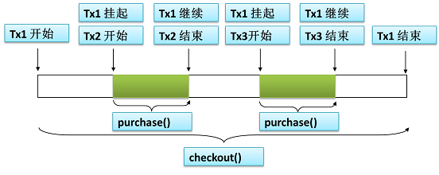

## 基础命令

> 常用命令

```sql
-- [-h] 服务器ip; [-P] 端口号(默认3306，非默认则必须显示指定); [-u] 用户名; [-p] 密码（#$%_BC13439677375）
mysql -h 192.168.5.25 -P 33306 -u bluecardsoft -p
```

```sql
 select version();   -- 版本
 
 use test0806;       -- 切换数据库
 show tables;        -- 当前数据库下的所有表
 select database();  -- 当前所使用的数据库
 
 SELECT ROW_COUNT(); -- 返回受影响的行数
```


# JSON相关

## 创建

>JSON_OBJECT：生成 JSON 对象。如果有KEY为 NULL 或参数个数为奇数，则抛错

```sql
mysql> SET @j = (SELECT JSON_OBJECT('age', 20, 'birthday', now(), 'datas', (SELECT JSON_OBJECT('name', 'lucy'))) json);

mysql> SELECT @j;
+----------------------------------------------------------------------------------+
| @j                                                                               |
+----------------------------------------------------------------------------------+
| {"age": 20, "datas": {"name": "lucy"}, "birthday": "2019-08-02 09:17:03.000000"} |
+----------------------------------------------------------------------------------+
```

> JSON_ARRAY：生成 JSON 数组

```sql
mysql> SELECT JSON_ARRAY(JSON_OBJECT('age',20,'name','lucy'), JSON_OBJECT('age',18,'name','lily')) json_arrary;
+------------------------------------------------------------+
| json_arrary                                                |
+------------------------------------------------------------+
| [{"age": 20, "name": "lucy"}, {"age": 18, "name": "lily"}] |
+------------------------------------------------------------+
```

## 解析

> JSON_VALID：检验 JSON 是否合法

```sql
mysql> SELECT JSON_VALID('{"a": "1", "b"}');
+-------------------------------+
| JSON_VALID('{"a": "1", "b"}') |
+-------------------------------+
|                             0 |
+-------------------------------+
```

> JSON_TYPE：查询 JSON 的类型，是 JSON-OBJECT 还是 JSON-ARRARY。

```sql
mysql> SELECT JSON_TYPE('{"a": "1"}');
+-------------------------+
| JSON_TYPE('{"a": "1"}') |
+-------------------------+
| OBJECT                  |
+-------------------------+
```

```sql
mysql> SELECT JSON_TYPE('[{"a": "1"}, {"B": 2}]');
+-------------------------------------+
| JSON_TYPE('[{"a": "1"}, {"B": 2}]') |
+-------------------------------------+
| ARRAY                               |
+-------------------------------------+
```

>JSON_CONTAINS_PATH：查询 KEY 值是否存在。存在返回1，否则返回0

```sql
-- JSON_CONTAINS_PATH(json_doc, one_or_all, path[, path] ...)：参数2，只能取值 one/all。参数3是变长，可查单个key，也可查多个key
```

```sql
-- 查询单个key时，参数2可以是 one/all。
mysql> SELECT JSON_CONTAINS_PATH(@j, 'one', '$.age');
+----------------------------------------+
| JSON_CONTAINS_PATH(@j, 'one', '$.age') |
+----------------------------------------+
|                                      1 |
+----------------------------------------+
```

```sql
-- 查询多个key时，参数2根据情况选择。one：表示只要有一个存在即可；all：表示所有的都存在才行。
mysql> SELECT JSON_CONTAINS_PATH(@j, 'one', '$.age', '$.datas.address');
+-----------------------------------------------------------+
| JSON_CONTAINS_PATH(@j, 'one', '$.age', '$.datas.address') |
+-----------------------------------------------------------+
|                                                         1 |
+-----------------------------------------------------------+

mysql> SELECT JSON_CONTAINS_PATH(@j, 'all', '$.age', '$.datas.address');
+-----------------------------------------------------------+
| JSON_CONTAINS_PATH(@j, 'all', '$.age', '$.datas.address') |
+-----------------------------------------------------------+
|                                                         0 |
+-----------------------------------------------------------+
```

>JSON_CONTAINS：查询 KEY-VALUE 键值对是否存在

```sql
-- JSON_CONTAINS(json_doc, val[, path])：参数1是待查json，参数2是value，参数3是key。

--【注意】参数3的 value 有些限制条件，比如正整数1，需要写成 '1'；如果是字符串"lucy"，要写成 '"lnmp"'。sql才是有效的
mysql> SELECT JSON_CONTAINS(@j, "lucy", '$.datas.name');
ERROR 3141 (22032): Invalid JSON text in argument 2 to function json_contains: "Invalid value." at position 0.

mysql> SELECT JSON_CONTAINS(@j, '"lucy"', '$.datas.name');
+---------------------------------------------+
| JSON_CONTAINS(@j, '"lucy"', '$.datas.name') |
+---------------------------------------------+
|                                           1 |
+---------------------------------------------+
```

> JSON_KEYS：列出所有的 KEY

```sql
-- 查询普通 JSON
mysql> SELECT JSON_KEYS(@j);
+------------------------------+
| JSON_KEYS(@j)                |
+------------------------------+
| ["age", "datas", "birthday"] |
+------------------------------+

-- 查询内嵌 JSON
mysql> SELECT JSON_KEYS(@j, '$.datas');
+--------------------------+
| JSON_KEYS(@j, '$.datas') |
+--------------------------+
| ["name"]                 |
+--------------------------+
```

> JSON_EXTRACT：解析JSON。`【注意】默认查询结果中，字符串类型带有引号`

```sql
-- 如果想去掉外层引号，配合 JSON_UNQUOTE 使用
mysql> SELECT JSON_EXTRACT(@j, '$.datas.name');
+----------------------------------+
| JSON_EXTRACT(@j, '$.datas.name') |
+----------------------------------+
| "lucy"                           |
+----------------------------------+
```

> JSON_UNQUOTE：去掉 VALUE 值的外层引号

```sql
-- 类比于上个查询，外层无引号
mysql> SELECT JSON_UNQUOTE(JSON_EXTRACT(@j, '$.datas.name'));
+------------------------------------------------+
| JSON_UNQUOTE(JSON_EXTRACT(@j, '$.datas.name')) |
+------------------------------------------------+
| lucy                                           |
+------------------------------------------------+
```


##操作

> JSON_INSERT：追加 KEY，KEY 不存在，才能插入。`以下操作均生成新的JSON，不会影响原有的JSON`

```sql
-- 只插入了 id。因为 age 已存在，所以未插入。
mysql> SELECT JSON_INSERT(@j, '$.age', 18, '$.id', '001');
+-----------------------------------------------------------------------------------------------+
| JSON_INSERT(@j, '$.age', 18, '$.id', '001')                                                   |
+-----------------------------------------------------------------------------------------------+
| {"id": "001", "age": 20, "datas": {"name": "lucy"}, "birthday": "2019-08-02 09:17:34.000000"} |
+-----------------------------------------------------------------------------------------------+
```

>JSON_SET：直接插入，不管 KEY 是否存在

```sql
mysql> SELECT JSON_SET(@j, '$.age', 18, '$.id', '001');
+-----------------------------------------------------------------------------------------------+
| JSON_SET(@j, '$.age', 18, '$.id', '001')                                                      |
+-----------------------------------------------------------------------------------------------+
| {"id": "001", "age": 18, "datas": {"name": "lucy"}, "birthday": "2019-08-02 09:17:34.000000"} |
+-----------------------------------------------------------------------------------------------+
```

>JSON_REMOVE：删除指定 KEY，若 KEY 不存在则忽略

```sql
mysql> SELECT JSON_REMOVE(@j, '$.age', '$.gender');
+-----------------------------------------------------------------------+
| JSON_REMOVE(@j, '$.age', '$.gender')                                  |
+-----------------------------------------------------------------------+
| {"datas": {"name": "lucy"}, "birthday": "2019-08-02 09:17:34.000000"} |
+-----------------------------------------------------------------------+
```

>JSON_REPLACE：替换 KEY 对应的 VALUE 值，KEY 不存在则忽略

```sql
mysql> SELECT JSON_REPLACE(@j, '$.age', 18, '$.gender', '女');
+----------------------------------------------------------------------------------+
| JSON_REPLACE(@j, '$.age', 18, '$.gender', '女')                                  |
+----------------------------------------------------------------------------------+
| {"age": 18, "datas": {"name": "lucy"}, "birthday": "2019-08-02 09:17:34.000000"} |
+----------------------------------------------------------------------------------+
```

##结合表

>和数据字段相结合使用。 `注意语法糖 ->`

```sql
mysql> SELECT memo FROM log WHERE id=470941;
+------------------------------------------------------------------------------+
| memo                                                                         |
+------------------------------------------------------------------------------+
| {"age": 20, "time": "2019-07-30 16:55:32.000000", "datas": {"name": "lucy"}} |
+------------------------------------------------------------------------------+
```

```sql
-- 解析 JSON 类型字段中的某个 KEY
mysql> SELECT JSON_UNQUOTE(JSON_EXTRACT(memo, '$.datas.name')) name FROM log WHERE id=470941;
+------+
| name |
+------+
| lucy |
+------+
```

```sql
-- 【注意】JSON 解析的 -> 语法。参数1只能为数据表中的字段，不能为 JSON字符串 或 表达式。
mysql> SELECT JSON_UNQUOTE(memo -> '$.datas.name') name FROM log WHERE id=470941;
+------+
| name |
+------+
| lucy |
+------+
```


# 事务相关

##基础概念

> 事务分类：隐式事务 和 显式事务

```shell
事务：一个或一组 sql 语句组成一个执行单元，这个执行单元要么都执行成功，要么都执行失败。
```

```sql
show engines; --查看当前数据库支持的存储引擎，只有 Innodb 支持事务
```

```sql
-- 【隐式事务】事务没有明显的开启和关闭标识。例如，普通的sql语句：INSERT，UPDATE，DELETE
```

```sql
--【显示事务】必须先设置《自动提交》功能为禁用状态

SHOW VARIABLES LIKE 'autocommit'; -- 查看《自动提交》功能是否开启

SET autocommit=0;                 -- 关闭《自动提交》，只针对当前会话起作用。所以每条事务都要以这条语句开始
START TRANSACTION; -- 可选语句，开始事务
UPDATE trans SET fmoney = fmoney - 700 WHERE fname='小李'; -- 事务正文sql
UPDATE trans SET fmoney = fmoney + 700 WHERE fname='老王';
COMMIT; -- 提交事务
-- ROLLBACK; --回滚事务，与提交事务，二选一
```

> ACID

```sql
-- 原子性（Atomicity）
事务中多条 sql 语句在逻辑上'不可再分'。要么都执行成功，要么都执行失败。
```

```sql
-- 一致性（Consistency）
事务执行会使数据从 一个一致性状态 ->（变换到）-> 另外一个一致性状态（转账之前和之后，金钱总额不变）。

执行过程中，如果某一个或某几个操作失败了，则必须将其他所有操作撤销，将数据恢复到事务执行之前的状态，这就是'回滚'。
```

```sql
-- 隔离性（Isolation）
多个事务并发执行，应保证各个事务之间不能互相干扰。

隔离级别：读未提交（Read uncommitted）、读提交（read committed）、可重复读（repeatable read）和串行化（Serializable）。
```

```sql
-- 持久性（Durability）
事务一旦提交，对数据的改变将是永久的，不会被其他操作所影响。比如，删除一条数据。
```


## 事务管理

>编程式事务管理器：使用原生JDBC

```sql
--> （1）获取数据库连接 Connection 对象 --> （2）取消事务的自动提交 --> （3）执行操作
--> （4）正常完成操作时手动提交事务 --> （4）执行失败时回滚事务
--> （5）关闭相关资源
```

```sql
编程式事务管理：需要将事务管理代码'嵌入到业务方法中'来控制事务的提交和回滚。

在使用编程的方式管理事务时，必须在每个事务操作中包含额外的事务管理代码。相对于'核心业务'而言，事务管理的代码显然属于'非核心业务'，
如果多个模块都使用同样模式的代码进行事务管理，显然会造成较大程度的'代码冗余'。
```

>声明式事务管理器

```sql
声明式事务管理：将事务管理代码从业务方法中分离出来，'以声明的方式来实现事务管理'。

事务管理代码的固定模式作为一种横切关注点，可以通过 AOP 方法模块化，进而借助'Spring AOP'框架实现声明式事务管理。
Spring 在不同的事务管理 API 之上定义了一个 抽象层，通过 配置的方式使其生效。
从而让应用程序开发人员不必了解事务管理 API 的底层实现细节，就可以使用 Spring 的事务管理机制。
```

```sql
Spring 的核心事务管理抽象是'PlatformTransactionManager'。它为事务管理封装了一组独立于技术的方法。

-- DataSourceTransactionManager：在应用程序中只需要处理一个数据源，而且通过 JDBC 存取。（常用）
-- JtaTransactionManager       ：在 JavaEE 应用服务器上用 JTA(Java Transaction API)进行事务管理
-- HibernateTransactionManager ：用 Hibernate 框架存取数据库
```

> XML配置（二选一）

```xml
<!-- 配置事务管理器 -->
<bean id="transactionManager" class="org.springframework.jdbc.datasource.DataSourceTransactionManager">
    <property name="dataSource" ref="dataSource" />
</bean>

<!-- 开启事务注解 -->
<tx:annotation-driven transaction-manager="transactionManager" />
```

> 注解配置（二选一）

```java
@EnableTransactionManagement //全局注解
```

>在需要进行事务控制的方法上加注解

```java
@Transactional
public void purchase(int bookId, int bookCount) {
    //（1）获取书籍信息（单价，库存）
    Book book = helloMapper.findBookById(bookId);
    
    //（2）扣除书籍库存
    boolean update = helloMapper.updateBookStock(bookId, bookStock);

    //（3）扣除用户金额
    update = helloMapper.updateUserAccount(1, userAccount);
}
```

> @Transactional 注解相关参数

```java
/**
 * @param propagation   事务的传播行为。默认：REQUIRED
 * @param isolation     事务的隔离级别。默认：READ_COMMITED.（和 mysql 默认的隔离不同）
 *
 * @param rollbackFor   需要回滚的异常类，可以为多个。默认：捕获到 RuntimeException 或 Error 时回滚，而捕获到编译时异常不回滚
 * @param noRollbackFor 不需要回滚的异常类，可以为多个
 * @param readOnly      指定事务是否为只读。表示这个事务只读取数据但不更新数据，这样可以帮助数据库引擎优化事务
 * @param timeout       事务执行时间超过这个时间就强制回滚。单位：秒
 */
@Transactional(propagation = Propagation.REQUIRED, isolation = Isolation.READ_COMMITTED,
               rollbackFor = RuntimeException.class, noRollbackFor = RuntimeException.class,
               readOnly = false, timeout = -1)
```

## 隔离级别

> `mysql 默认：REPEATABLE_READ（可重复读）。Spring 默认：READ_COMMITED（读提交）`

> 数据库事务的并发问题

```sql
-- 脏读（更新场景） --> T2更新未提交 T1读 T2回滚

T1 将某条记录的 AGE 值从 20 修改为 30，但未提交。
T2 读取了 T1 更新后的值：30。
T1 回滚，AGE 值恢复到了 20。
T2 读取到的 30 就是一个无效的值。
```

```sql
-- 不可重复读（更新） --> T1读 T2更新提交 T1再读

T1 读取了 AGE 值为 20。
T2 将 AGE 值修改为 30。
T1 再次读取 AGE 值为 30，和第一次读取不一致。
```

```sql
-- 幻读（新增场景） --> T1读 T2新增 T1读

T1 读取了 STUDENT 表中的一部分数据。
T2 向 STUDENT 表中插入了新的行。
T1 读取了 STUDENT 表时，多出了一些行。
```

> 事务的隔离级别要得到底层数据库引擎的支持，而不是应用程序或者框架的支持。`mysql支持4种 > oracle的2种`

```sql
-- READ_UNCOMMITTED（读未提交）：以上③种问题都可能发生
允许 T1 读取 T2 未提交的修改。
```

```sql
-- READ_COMMITTED（读提交）：只可以避免【脏读】
要求 T1 只能读取 T2 已提交的修改。
```

```sql
-- REPEATABLE_READ（可重复读）：可以避免【脏读】+【不可重复读】。mysql 的默认配置
执行 T1 期间，禁止其它事务对这个字段进行更新，确保 T1 可以多次从一个字段中读取到相同的值。
```

```sql
-- SERIALIZABLE（串行化）：以上③个问题都可以避免，但效率低。不推荐
在 T1 执行期间，禁止其它事务对这个表进行添加、更新、删除操作。可确保 T1 可以多次从一个表中读取到相同的行，避免任何并发问题，但性能十分低下。
锁定整个范围的键，并一直持有锁，直到事务完成。

在 REPEATABLE_READ（可重复读） 的基础上，增加了在事务完成之前，其他事务不能向事务已读取的范围'插入新行'的限制。
```

> 设置隔离级别

```sql
SELECT @@tx_isolation; -- 查看当前的隔离级别。默认是：可重复读（repeatable_read）

SET transaction isolation level repeatable read;       -- 设置隔离级别，仅对当前连接起效
SET global transaction isolation level read committed; -- 设置全局的隔离级别
```
##传播行为

> 当事务方法被另一个事务方法调用时，必须指定事务应该如何传播？

```java
场景：用户买 5 本书，结账 checkout() 时，调用5次 purchase() 方法，这两个方法都是 声明式事务管理。这就涉及到'事务的传播行为'。
```

```java
@Service
public class UserService {

    @Transactional //结账
    public void checkout(String userId, List<Integer> bookIds) {
        for (Integer bookId : bookIds) {
            bookService.purchase(userId, bookId);
        }
    }
}
```

```java
@Service
public class BookService {

    @Transactional //买书
    public void purchase(String userId, Integer bookId) {
        //（1）获取书籍信息（单价，库存）
        //（2）扣除书籍库存
        //（3）扣除用户金额
    }
}
```

>REQUIRED：默认配置。在当前已有的事务中继续执行

```java
当 purchase() 方法被另一个事务方法 checkout() 调用时，它默认会在 checkout() 方法的事务内运行。
因此在 checkout() 方法的开始和终止边界内只有一个事务，这个事务只在 checkout() 方法结束的时候被提交。

所以，当用户余额不足购买 5 本书时，整个事务都会回滚，结果导致用户一本书都买不了。
```


>REQUIRES_NEW：挂起当前已有的事务，开启新的事务执行

```java
每一次调用 purchase()方法，都会开启一个新的事务去执行。 checkout()方法会被挂起，直到所有 purchase()方法执行结束，才会提交。
 
所以，当用户余额不足购买 5 本书时，只会导致某一次的 purchase()方法回滚，用户可以买到部分书籍。
```




