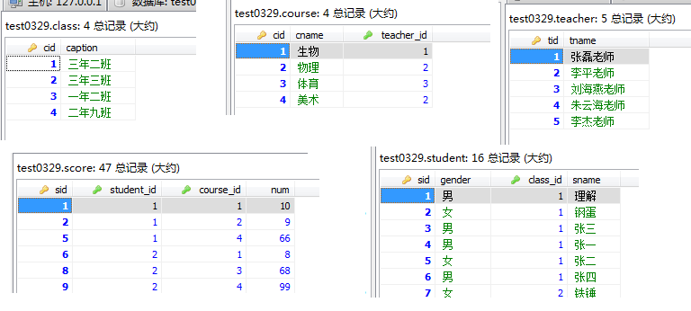

# 基础命令

## 基础命令

> 名词解析

```sql
DB    --Data-Base，数据库，存储一系列有组织的数据
DBMS  --Data-Base-Manage-System，数据库管理系统软件，如：Mysql，Oracle，sql-server
SQL   --Structure-Query-Language，结构化查询语言，与数据库通信
```

> 基础语法

```sql
'不区分大小写。建议关键字大写，表名和列名小写'。每条命令使用分号结尾。单引号和双引号都可以表示字符串。

mysql的字段名、表名通常不需要加任何引号，如果非要加上引号，必须加反引号。
mysql的别名可不加引号，如果加，单引号和双引号以及反引号都可以。别名含有特殊字符，则必须使用双引号。
```

>赋予权限

```sql
-- GRANT [权限内容] ON [库名.表名] TO [用户名@'IP地址'] IDENTIFIED BY ['密码']WITH GRANT OPTION;
-- 赋予用户名 MAO，密码 MIAOMIAO 的用户可以在任意设备上操作所有数据库表的权限
GRANT ALL PRIVILEGES ON *.* TO MAO@'%' IDENTIFIED BY 'MIAOMIAO' WITH GRANT OPTION;
```

> linux环境mysql日志配置在`my.cnf 或 mysql.cnf`

```shell
find / -name my.cnf(mysql.cnf) #查找这两个文件所在位置
log-error=/var/log/mysql.log   #在上述两个文件中配置
```

> 常用命令

```sql
-- [-h] 服务器ip; [-P] 端口号(默认3306，非默认则必须显示指定); [-u] 用户名; [-p] 密码（#$%_BC13439677375）
mysql -h 192.168.5.25 -P 33306 -u bluecardsoft -p
```

```sql
 select version();   -- 版本
 
 use test0806;       -- 切换数据库
 show tables;        -- 当前数据库下的所有表
 select database();  -- 当前所使用的数据库
 
 SELECT ROW_COUNT(); -- 返回受影响的行数
```
## 定义-DDL

> sql分类

```sql
DDL：Data-Define-Languge，数据定义语言。         --如，create，drop，alter
DML：Data-Manipulate-Language，数据操作语言。    --如，insert，update，delete
DQL：Data-Query-Language，数据查询语言。         --如，select

TCL：Transaction-Control-Language，事务控制语言。--如，commit，rollback  
```

> CREATE

```sql
CREATE TABLE `city` (
    `id` int(11) NOT NULL AUTO_INCREMENT COMMENT 'id',
    `name` varchar(10) DEFAULT NULL COMMENT '用户名', --VARCHAR 记得指定长度
    PRIMARY KEY (`id`)
) COMMENT '用户';

SHOW CREATE TABLE city; --查看创建过程
DESC city;              --DESC 查看表的详细信息
```

```sql
CREATE TABLE city0 LIKE city; --仅复制表的整体结构

CREATE TABLE city1 SELECT id,name FROM city WHERE id=2; --复制表的部分结构 + 数据（id，name两列）
```

> DROP

```sql
DROP TABLE IF EXISTS `city`; --先删除
```

> ALERT：`ADD|CHANGE|MODIFY|DROP`

```sql
ALTER TABLE tbName ADD COLUMN 列名 列类型 [列参数] [NOT NULL DEFAULT]  --增加列
ALTER TABLE tbName CHANGE COLUMN 旧列名 新列名 列类型 [列参数]          --修改列名（注意，新列的类型）
ALTER TABLE tbName MODIFY COLUMN 列名 新列类型 [列参数]                --修改列类型
ALTER TABLE tbName DROP COLUMN 列名;                                 --删除列

ALTER TABLE tbName RENAME TO newName; -- 修改表名
```

## 操作-DML

> INSERT

```sql
INSERT INTO city(id,name) VALUES --列与值要严格对应。不写则默认为所有列赋值
(DEFAULT,'晋州'),                 --自增主键赋值 DEFAULT，不指定的列默认赋值 NULL
(DEFAULT,'朔州');                 --支持批量插入
```

```sql
INSERT INTO city(id,name)
SELECT id,name FROM employee WHERE id>3; --将查询结果插入到表中
```

> UPDATE

```sql
UPDATE city SET age=900 WHERE name='苏州'; --必须添加条件，否则全表修改

UPDATE detail AS a,info AS b SET a.state=07,b.state=07 WHERE a.id=b.id AND b.id=5; --联表修改
```

> DELETE

```sql
DELETE FROM city WHERE name='晋州'; --单表删除
```

```sql
DELETE city,student
FROM city JOIN student ON student.name=city.name
WHERE city.name='晋州';             --联表删除
```

## 查询-DQL

> 别名：对于别名含有特殊符号的（如空格，#等），使用`双引号`括起来。

```sql
SELECT id, `name` "stu#name" FROM student;
```

> 去重：DISTINCT 和 GROUP BY ，二者都是针对给定字段进行去重。

```sql
DISTINCT 方式就是两两对比，需要遍历整个表。 GROUP BY 分组类似先建立索引，再查索引。

两者对比：大表 GROUP BY 快，小表 DISTINCT 快（不用建索引）。但小表就算建索引，也不会慢到哪去。
```

```sql
SELECT DISTINCT id,num FROM score;        -- DISTINCT：id和num 都相同的，才进行去重
SELECT id,num FROM score GROUP BY id,num; -- GROUP BY
```

> 模糊查询：通配符`%` 零到多个字符，`_`一个字符，`[]`括号内的一个字符

```sql
SELECT * FROM student WHERE `id` LIKE '1%';                -- id以1开头，可以匹配数值型。
SELECT * FROM student WHERE `name` LIKE '_\_%';            -- 第二个字符为下划线（系统内置转义符\）
SELECT * FROM student WHERE `name` LIKE '_$_%' ESCAPE '$'; -- 自定义转义符 $
```

```sql
-- 两句查询结果不一样。因为，like '%%' 不能匹配值为 NULL 记录
SELECT * FROM employee; 
SELECT * FROM employee WHERE first_name like '%%'; 
```

> 安全等于`<=>`

```sql
SELECT * FROM student WHERE `name` <=> '如花'; -- 对于非NULL，等同于 =

SELECT * FROM student WHERE `name` <=> NULL;  -- 对于NULL，等同于 IS
SELECT * FROM student WHERE `name` IS NULL;
```

> ANY & ALL

```sql
ANY：和子查询返回的'某一值'比较。
ALL：和子查询返回的'所有值'比较。
```


## 执行顺序

>所有的查询语句都是从 FROM 开始执行的，并非 SELECT。`where → group by → having → order by → limit`

```sql
(7) - SELECT
(8) - DISTINCT <select_list>
(1) - FROM <left_table>
(3) - <join_type> JOIN <right_table>
(2) - ON <join_condition>
(4) - WHERE <where_condition>
(5) - GROUP BY <group_by_list>
(6) - HAVING <having_condition>
(9) - ORDER BY <order_by_condition>
(10 - LIMIT <limit_number>
```

```sql
SELECT 班级, AVG(数学成绩) AS 数学平均成绩
FROM 学生信息表
WHERE 数学成绩表 IS NOT NULL --（错误写法）WHERE 数学成绩表 IS NOT NULL AND AVG(数学成绩) > 75
GROUP BY 班级
HAVING 数学平均成绩 > 75

ORDER BY 数学平均成绩 DESC
LIMIT 3;
```

```sql
首先，执行 FROM 子句, 从学生成绩表中组装数据源的数据。
执行 WHERE 子句, 筛选学生成绩表中所有学生的数学成绩不为 NULL 的数据 。
执行 GROUP BY 子句, 把学生成绩表按 "班级" 字段进行分组。
计算 avg 聚合函数, 按找每个班级分组求出 数学平均成绩。
执行 HAVING 子句, 筛选出班级 数学平均成绩大于 75 分的。

执行 SELECT 语句，返回数据，但别着急，还需要执行后面几个步骤。

执行 ORDER BY 子句, 把最后的结果按 "数学平均成绩" 进行排序。
执行 LIMIT ，限制仅返回3条数据。结合 ORDER BY 子句，即返回所有班级中数学平均成绩的前三的班级及其数学平均成绩。
```

```sql
若将 avg(数学成绩) > 75 放到 WHERE 子句中，此时 GROUP BY 语句还未执行，因此此时聚合值 avg(数学成绩) 还是未知的，因此会报错。
```

## 数据类型

> timestamp & datetime

```sql
timestamp：占用4个字节，表示范围 '1970-01-01 00:00:01.000000' to '2038-01-19 03:14:07.999999'
datetime ：占用8个字节，表示范围 '1000-01-01 00:00:00.000000' to '9999-12-31 23:59:59.999999'

-- 如果存进去的是 NULL, timestamp 会自动储存当前时间，datetime 会储存 NULL。
-- timestamp 适合用来记录数据的最后修改时间，因为只要更改了记录中其他字段的值， timestamp 字段的值都会被自动更新（可设置不自动更新）。
```

```sql
-- 保存毫秒值
无论 datetime 还是 timestamp：数据长度一栏选择 3，不然不保留毫秒值。'2019-5-17 20:09:10.456'
```

> char & varchar

```sql
--区别1：定长和变长
char 表示定长，长度固定，varchar表示变长，即长度可变。
当所插入的字符串超出它们的长度时，视情况来处理，如果是严格模式，则会拒绝插入并提示错误信息，如果是宽松模式，则会截取然后插入。
如果插入的字符串长度小于定义长度时，则会以不同的方式来处理。
如char（10），表示存储的是10个字符，无论你插入的是多少，都是10个，如果少于10个，则用空格填满。
而varchar（10），小于10个的话，则插入多少个字符就存多少个。

varchar 怎么知道所存储字符串的长度呢？
实际上，对于varchar字段来说，需要使用一个（如果字符串长度小于255）或两个字节（长度大于255）来存储字符串的长度。
```

```sql
--区别2：存储的容量不同
对 char 来说，最多能存放的字符个数 255，和编码无关。而 varchar 呢，最多能存放 65532 个字符。
在 varchar 存字符串的时候，第 1 个字节是空的，然后还需要 2 个字节来存放字符串的长度。所以有效长度就是 65535 - 1 - 2 = 65532
```

```sql
无论是否通过索引，varchar类型的数据检索略优于char的扫描。那实际开发中，我们使用哪种呢？
当确定字符串为定长、数据变更频繁、数据检索需求少时，使用 char；
当不确定字符串长度、对数据的变更少、查询频繁时，使用 varchar。

相关题目：若一个表定义为 create table t1(c int, c2 char(30), c3 varchar(N)) charset=utf8; 问 N 的最大值又是多少？
（65535 - 1 - 2 - 4 - 30 * 3 ）/3
```

> ip如何保存？

```sql
SELECT INET_ATON('192.168.5.25'); --3232236825
SELECT INET_NTOA(3232236825);     --192.168.5.25

--查出范围在 192.168.1.3 到 192.168.1.20 之间的 ip 地址
select * from ip_table where inet_aton(ip) > inet_aton('192.168.1.3') and inet_aton(ip) < inet_aton('192.168.1.20');
```


#基础函数

## 单行函数

> NULL

```sql
ISNULL(expr)    -- 表达式为 NULL，返回 1，否则返回 0
IFNULL(v1,v2)   -- v1 为 NULL，返回 v2，否则返回 v1
IF(expr,v1,v2)  -- 表达式成立，返回 v1；否则返回 v2
```

> CONCAT

```sql
SELECT 5 + 'aa'; -- 对于非数值的一方，作取0处理。最终结果：5
SELECT 5 + NULL; -- NULL和任何值相加，结果：NULL
```

```sql
SELECT CONCAT(5,'a') caoncat; -- 字符串拼接：'5a'
```

> BETWEEN 和 IN

```sql
BETWEEN 5 AND 10 --[5,10]
IN(5, 10)        --x=5 || x=10
```

> CASE简单函数：SWITCH `（适合离散的等值条件）`

```sql
SELECT employee_id,
    (CASE sex
     WHEN '1' THEN '男'
     WHEN '0' THEN '女'
     ELSE '其他' END) sex
FROM employees
```

> CASE搜索函数：IF-ELSE `（适合逻辑逻辑条件）`

```sql
SELECT employee_id,
    (CASE
     WHEN sex=1 THEN '男'
     WHEN sex=0 THEN '女'
     ELSE '其他' END) sex
FROM employees
```

> 数学函数 `（a%b = a-a/b*b）`

```sql
SELECT ROUND(-1.45) n1, ROUND(-1.65) n2;         -- -1，-2 -->先绝对值，再四舍五入，最后加符号
SELECT ROUND(-1.455, 2) n1, ROUND(-1.451, 2) n2; -- -1.46, -1.45 -->保留两位小数

SELECT CEIL(-1.451) n1;        -- -1 -->向上取整，返回 >= 参数的最小整数
SELECT FLOOR(-1.451) n1;       -- -2 -->向下取整，... <= ............

SELECT TRUNCATE(-1.499, 1) n1; -- -1.4 -->截断，保留一位小数

SELECT MOD(-10, -3) n1;        -- -1 -->取余%，取余操作的符号位和被除数一致。 a%b = a-a/b*b
```

> 字符串函数 `（索引从1开始计数）`

```sql
SELECT SUBSTR('RUNOOB', 2) AS subStr;     -- UNOOB，从 1 开始计数
SELECT SUBSTR('RUNOOB', 2, 3) AS subStr;  -- UNO --> 同 MID()
SELECT SUBSTR('RUNOOB', -3) AS subStr;    -- OOB --> 同 RIGHT()
```

```sql
SELECT LEFT('RUNOOB', 3) AS leftStr;      -- RUN --> 左侧前3位字符
SELECT RIGHT('RUNOOB', 3) AS rightStr;    -- OOB --> 右侧后3......
SELECT MID('RUNOOB', 2, 3) AS midStr;     -- UNO --> 中间第2位字符开始(从1开始计数)，截取3位
```

```sql
SELECT SUBSTRING_INDEX('192.168.5.120', '.', 2) AS subIndex;  -- 192.168 --> 截第二个'.'之前
SELECT SUBSTRING_INDEX('192.168.5.120', '.', -2) AS subIndex; -- 5.120   --> ...........后
SELECT SUBSTRING_INDEX('192.168.5.120', '..', 2) AS subIndex; -- 192.168.5.120 --> 无返回所有
```

```sql
SELECT UCASE("runoob") AS uCase; -- RUNOOB
SELECT LCASE("RUNOOB") AS lCase; -- runoob --> 大小写转换
```

```sql
SELECT LENGTH('测试') AS length;          -- 6 --> 以'字节'为单位（汉字：utf-8占3字节，GBK占2）
SELECT CHAR_LENGTH('测试') AS charLength; -- 2 --> '字符'【推荐】。VARCHAR(10)，10指的是字符
```

```sql
SELECT REPLACE('192.168.5.120','.','') INTO @repStr; -- 1921685120 --> 替换所有
```

```sql
SELECT INSTR('ASDFGH', 'SD') AS instr;   -- 2 --> 子串第一次出现的索引，找不到返回0

SELECT SUBSTR(email, 1, INSTR(email, '@')-1) name FROM employee; --截取 email 中的 name
```

> 时间函数

```sql
SELECT now();      -- 2019-08-20 11:15:43
SELECT curdate();  -- 2019-08-20
SELECT curtime();  -- 11:16:55
```

```sql
SELECT date('2019-08-20 11:15:43') date; -- 2019-08-20 --> 截取日期部分
SELECT time('2019-08-20 11:15:43') time; -- 11:15:43   --> 截取时间部分

SELECT year('2019-08-20 11:15:43') year;              -- 2019 -->截取年份
SELECT EXTRACT(YEAR FROM '2019-08-20 11:15:43') year; -- 同上
```

```sql
SELECT DATE_ADD('2019-08-20 11:15:43', INTERVAL 1 DAY); -- 1天以后（-1表示一天以前）【DATE_SUB() 也可以表示一天以前】
```

```sql
SELECT DATEDIFF('2008-12-30','2008-12-31') AS dateDiff; -- -1，时间差（前面减后面）
```

```sql
SELECT DATE_FORMAT('2019/08/20 11:15:43', '%Y-%m-%d %H:%i:%s') AS dateFormat; -- 2019-01-11 14:56:19

SELECT STR_TO_DATE('23/04/2019', '%d/%m/%Y') str2date; -- 2019-04-23，字符串转日期
```

```sql
--%Y：4位的年份； %m：两位的月份； %y：2位的年份； %c：1位的月份； %d：两位的天数
```

```sql
-- 时间支持 BETWEEN AND 语法
SELECT s_id FROM grade WHERE (s_brith BETWEEN '20000101' AND '20190101')；

SELECT * FROM passage_open_timer WHERE CURTIME() BETWEEN timer_start AND timer_end; --同上，潮汐车道
```


##聚合函数

> SUM，AVG，MIN，MAX，COUNT：用作统计使用，又称为聚合函数，统计函数，组函数。

> SUM，AVG 一般用于`数值类型`。MAX，MIN 可处理`任何类型`，如日期类型，字符串类型

```sql
SELECT SUM(salary), AVG(salary) FROM employees;

SELECT MAX(hiredate), MIN(first_name) FROM employees; --日期类型，字符串类型
```

> 处理 NULL

```sql
-- MAX，MIN：都忽略 NULL
-- COUNT：两种情况：COUNT(column) --> 忽略 NULL； COUNT(*) --> 不忽略 NULL，若某行全为 NULL，计数器也会 +1。

-- SUM：忽略 NULL 值。且当对多个列求和时 sum(id+name)，如果运算的列中任意一列的值为 NULL，则忽略这行的记录。
select sum(name+id) from student;

-- AVG：忽略 NULL 值，而不是将其作为 0 参与计算
select sum(name)/count(name),avg(name) from student; --两种算法，结果一致
select sum(name)/count(*),avg(name) from student;    --两种算法，结果不一致。0.625,1
```

> GROUP BY 处理 NULL

```sql
（1）.分组列中若有 NULL，这也将作为一组，且 NULL 值排在最前面。
（2）.除汇总函数计算语句外，SELECT 中的选择列必须出现在 GROUP BY 中
（3）.GROUP BY 可以包含任意数目的列，可以嵌套
```

> `WHERE` 用于分组前筛选，作用于原始表。`HAVING`用于分组后筛选，作用于分组后的表。
>
> 聚合函数作用的字段要求是 `GROUP BY` 后的字段，聚合函数作为条件肯定是放在 `HAVING` 语句中。

```sql
SELECT department_id, MAX(salary) max
FROM employees
WHERE commission_pct IS NOT NULL
GROUP BY department_id
ORDER BY max DESC; -- 每个部门，有奖金员工中的最高工资 --> WHERE
```

```sql
SELECT department_id, COUNT(department_id) AS count 
FROM employees
GROUP BY department_id
HAVING count > 2
ORDER BY count ASC; -- 查询哪个部门的员工数大于2 --> HAVING
```

> `count()`

```sql
count(*)     ：当前行有一列不为 NULL，则计数器 +1
count(1)     ：同上
count(column)：当前行的当前列不为 NULL,计数器 +1
```

```sql
由于 COUNT 统计时，不计入NULL值。所以，可通过 COUNT(*) 统计当前表中的所有记录数，其原理是：当前行只要有一列值不为NULL，计数器就会增加1。
但是，这将会造成全表扫描？ mysql有优化，只扫描索引列！

效率比较：COUNT(*) = COUNT(1) = COUNT(PK) > COUNT(N-PK)

解释说明：若表中有索引，COUNT(*) 与 COUNT(1) 均会使用索引。
由于mysql默认对主键添加索引，所以，对存在主键的表进行 COUNT(*)、COUNT(1) 查询也都会使用主键索引。
```

```sql
--统计每个老师的学生个数
SELECT t.*,COUNT(t.id),COUNT(s.id) FROM teacher t LEFT JOIN student s ON s.tid=t.id GROUP BY t.id;

--其中，COUNT(t.id)统计有问题，对于没有学生的老师，也会得到结果：1
1	张磊老师	6	6
3	刘燕老师	5	5
5	李杰老师	1	0
```


# 查询相关

## 子查询

> FROM：子查询结果作为一张虚拟表使用，必须为虚拟表起别名

```sql
-- 查询各课程中成绩比本门平均成绩高的课程号，学生号，成绩
SELECT sc.course_id,sc.student_id,sc.num 
FROM score sc LEFT JOIN(
    SELECT course_id,AVG(num) num_avg FROM score GROUP BY course_id
) tmp ON tmp.course_id=sc.course_id WHERE sc.num>tmp.num_avg;
```

> WHERE`/`HAVING

```sql
-- 查询最高成绩小于【4号课程平均成绩】的课程id和其最高成绩
SELECT course_id,max(num) num_max FROM score GROUP BY course_id HAVING num_max<(
    SELECT avg(num) num_avg FROM score WHERE course_id=4
);
```

> IN：`包含的值不应过多，转化为 exists`

```sql
select * from 表A where id in (select id from 表B);
select * from 表A where exists(select * from 表B where 表B.id = 表A.id); --等同于上
```

```sql
IN 查询适合 B 表数据量不多的情况。这是因为： IN 只执行一次，它查出 B 表中的所有id字段并缓存起来。
之后，检查 A 表的id是否与 B 表中的id相等，如果相等则将 A 表的记录加入结果集中，直到遍历完 A 表的所有记录。
```

> EXISTS

```sql
-- 查询有选课的学生id和学生名
SELECT id,`name` FROM student WHERE id IN(
    SELECT student_id FROM score
);
```

```sql
SELECT id,`name` FROM student s WHERE EXISTS(
    SELECT sc.student_id FROM score sc WHERE sc.student_id=s.id
);
```

> IN，SOME，ANY，ALL

```sql
IN  ：范围之内。等同于'=ANY()'
SOME：ANY的别名，用法相同

ANY：和子查询结果中的任一数值进行比较。
ALL：.............所有...........。ANY，ALL必须和比较操作符一起使用。-- >ANY() 相当于'>MIN()'。>ALL() 相当于'>MAX()'
```

## 92连接

> 基础概念

```sql
将多张表需要全部放在 FROM 之后，所有的连接条件都放在 WHERE 当中。
因此 sql92 中的等值连接、非等值链接、外连接等等，其实只是 WHERE 中的条件不同罢了。
```

> 非等值连接

```sql
-- 查询每门课程平均成绩的成绩等级
SELECT tmp.*,sl.num_level FROM(
    SELECT course_id,AVG(num) num_avg FROM score GROUP BY course_id
) tmp,score_level sl WHERE tmp.num_avg BETWEEN sl.lowest_num AND sl.highest_num;
```

> 自连接

```sql
-- 查询员工名和其领导名
SELECT e.first_name,e.manager_id,m.first_name
FROM employees e, employees m WHERE e.manager_id=m.employee_id;
```

## 99连接

> 基础概念

```sql
使用 FROM t1 JOIN t2 ON t1.c1=t2.c2 的语法来表示哪张表和哪张表进行什么样的连接。连接类型一目了然，并且底层支持地更好。
sql99支持功能的较多，实现'连接条件'和'筛选条件'的分离，使得可读性强
```

>非等值连接

```sql
-- 查询每门课程平均成绩的成绩等级
SELECT tmp.*,sl.num_level FROM(
    SELECT course_id,AVG(num) num_avg FROM score GROUP BY course_id
) tmp LEFT JOIN score_level sl ON tmp.num_avg BETWEEN sl.lowest_num AND sl.highest_num; -- 非等值连接
```

> 自连接

```sql
-- 查询员工名和其领导名
SELECT e.first_name,e.manager_id,m.first_name
FROM employees e LEFT JOIN employees m ON e.manager_id=m.employee_id;
```

> 常见 JOIN

```sql
-- （1）[INNER] JOIN：内连接。效果同 sql92 的等值连接
SELECT * FROM A INNER JOIN B ON A.id=B.id;

-- （2）LEFT [OUTER] JOIN：左外连接。A 的所有记录和 A.id=B.id 的所有 B 的记录
SELECT * FROM A LEFT JOIN B ON A.id=B.id;

-- （3）A 表独有的记录
SELECT * FROM A LEFT JOIN B ON A.id=B.id WHERE B.id IS NULL;
```

```sql
-- （4）RIGHT [OUTER] JOIN：右外连接。B 的所有记录和 A.id=B.id 的所有 A 的记录
SELECT * FROM A RIGHT JOIN B ON A.id=B.id;

-- （5）B 表独有的记录
SELECT * FROM A RIGHT JOIN B ON A.id=B.id WHERE A.id IS NULL;
```

```sql
-- （6）A + B 所有的记录
SELECT * FROM A LEFT JOIN B ON A.id=B.id
UNION
SELECT * FROM A RIGHT JOIN B ON A.id=B.id;

-- 	（7）A，B 表中单独出现的记录
SELECT * FROM A LEFT JOIN B ON A.id=B.id WHERE B.id IS NULL
UNION
SELECT * FROM A RIGHT JOIN B ON A.id=B.id WHERE A.id IS NULL;
```

   

  

 


>

```

```


# JSON相关

## 创建

>JSON_OBJECT：生成 JSON 对象。如果有KEY为 NULL 或参数个数为奇数，则抛错

```sql
mysql> SET @j = (SELECT JSON_OBJECT('age', 20, 'birthday', now(), 'datas', (SELECT JSON_OBJECT('name', 'lucy'))) json);

mysql> SELECT @j;
+----------------------------------------------------------------------------------+
| @j                                                                               |
+----------------------------------------------------------------------------------+
| {"age": 20, "datas": {"name": "lucy"}, "birthday": "2019-08-02 09:17:03.000000"} |
+----------------------------------------------------------------------------------+
```

> JSON_ARRAY：生成 JSON 数组

```sql
mysql> SELECT JSON_ARRAY(JSON_OBJECT('age',20,'name','lucy'), JSON_OBJECT('age',18,'name','lily')) json_arrary;
+------------------------------------------------------------+
| json_arrary                                                |
+------------------------------------------------------------+
| [{"age": 20, "name": "lucy"}, {"age": 18, "name": "lily"}] |
+------------------------------------------------------------+
```

## 解析

> JSON_VALID：检验 JSON 是否合法

```sql
mysql> SELECT JSON_VALID('{"a": "1", "b"}');
+-------------------------------+
| JSON_VALID('{"a": "1", "b"}') |
+-------------------------------+
|                             0 |
+-------------------------------+
```

> JSON_TYPE：查询 JSON 的类型，是 JSON-OBJECT 还是 JSON-ARRARY。

```sql
mysql> SELECT JSON_TYPE('{"a": "1"}');
+-------------------------+
| JSON_TYPE('{"a": "1"}') |
+-------------------------+
| OBJECT                  |
+-------------------------+
```

```sql
mysql> SELECT JSON_TYPE('[{"a": "1"}, {"B": 2}]');
+-------------------------------------+
| JSON_TYPE('[{"a": "1"}, {"B": 2}]') |
+-------------------------------------+
| ARRAY                               |
+-------------------------------------+
```

>JSON_CONTAINS_PATH：查询 KEY 值是否存在。存在返回1，否则返回0

```sql
-- JSON_CONTAINS_PATH(json_doc, one_or_all, path[, path] ...)：参数2，只能取值 one/all。参数3是变长，可查单个key，也可查多个key
```

```sql
-- 查询单个key时，参数2可以是 one/all。
mysql> SELECT JSON_CONTAINS_PATH(@j, 'one', '$.age');
+----------------------------------------+
| JSON_CONTAINS_PATH(@j, 'one', '$.age') |
+----------------------------------------+
|                                      1 |
+----------------------------------------+
```

```sql
-- 查询多个key时，参数2根据情况选择。one：表示只要有一个存在即可；all：表示所有的都存在才行。
mysql> SELECT JSON_CONTAINS_PATH(@j, 'one', '$.age', '$.datas.address');
+-----------------------------------------------------------+
| JSON_CONTAINS_PATH(@j, 'one', '$.age', '$.datas.address') |
+-----------------------------------------------------------+
|                                                         1 |
+-----------------------------------------------------------+

mysql> SELECT JSON_CONTAINS_PATH(@j, 'all', '$.age', '$.datas.address');
+-----------------------------------------------------------+
| JSON_CONTAINS_PATH(@j, 'all', '$.age', '$.datas.address') |
+-----------------------------------------------------------+
|                                                         0 |
+-----------------------------------------------------------+
```

>JSON_CONTAINS：查询 KEY-VALUE 键值对是否存在

```sql
-- JSON_CONTAINS(json_doc, val[, path])：参数1是待查json，参数2是value，参数3是key。

--【注意】参数3的 value 有些限制条件，比如正整数1，需要写成 '1'；如果是字符串"lucy"，要写成 '"lnmp"'。sql才是有效的
mysql> SELECT JSON_CONTAINS(@j, "lucy", '$.datas.name');
ERROR 3141 (22032): Invalid JSON text in argument 2 to function json_contains: "Invalid value." at position 0.

mysql> SELECT JSON_CONTAINS(@j, '"lucy"', '$.datas.name');
+---------------------------------------------+
| JSON_CONTAINS(@j, '"lucy"', '$.datas.name') |
+---------------------------------------------+
|                                           1 |
+---------------------------------------------+
```

> JSON_KEYS：列出所有的 KEY

```sql
-- 查询普通 JSON
mysql> SELECT JSON_KEYS(@j);
+------------------------------+
| JSON_KEYS(@j)                |
+------------------------------+
| ["age", "datas", "birthday"] |
+------------------------------+

-- 查询内嵌 JSON
mysql> SELECT JSON_KEYS(@j, '$.datas');
+--------------------------+
| JSON_KEYS(@j, '$.datas') |
+--------------------------+
| ["name"]                 |
+--------------------------+
```

> JSON_EXTRACT：解析JSON。`【注意】默认查询结果中，字符串类型带有引号`

```sql
-- 如果想去掉外层引号，配合 JSON_UNQUOTE 使用
mysql> SELECT JSON_EXTRACT(@j, '$.datas.name');
+----------------------------------+
| JSON_EXTRACT(@j, '$.datas.name') |
+----------------------------------+
| "lucy"                           |
+----------------------------------+
```

> JSON_UNQUOTE：去掉 VALUE 值的外层引号

```sql
-- 类比于上个查询，外层无引号
mysql> SELECT JSON_UNQUOTE(JSON_EXTRACT(@j, '$.datas.name'));
+------------------------------------------------+
| JSON_UNQUOTE(JSON_EXTRACT(@j, '$.datas.name')) |
+------------------------------------------------+
| lucy                                           |
+------------------------------------------------+
```


##操作

> JSON_INSERT：追加 KEY，KEY 不存在，才能插入。`以下操作均生成新的JSON，不会影响原有的JSON`

```sql
-- 只插入了 id。因为 age 已存在，所以未插入。
mysql> SELECT JSON_INSERT(@j, '$.age', 18, '$.id', '001');
+-----------------------------------------------------------------------------------------------+
| JSON_INSERT(@j, '$.age', 18, '$.id', '001')                                                   |
+-----------------------------------------------------------------------------------------------+
| {"id": "001", "age": 20, "datas": {"name": "lucy"}, "birthday": "2019-08-02 09:17:34.000000"} |
+-----------------------------------------------------------------------------------------------+
```

>JSON_SET：直接插入，不管 KEY 是否存在

```sql
mysql> SELECT JSON_SET(@j, '$.age', 18, '$.id', '001');
+-----------------------------------------------------------------------------------------------+
| JSON_SET(@j, '$.age', 18, '$.id', '001')                                                      |
+-----------------------------------------------------------------------------------------------+
| {"id": "001", "age": 18, "datas": {"name": "lucy"}, "birthday": "2019-08-02 09:17:34.000000"} |
+-----------------------------------------------------------------------------------------------+
```

>JSON_REMOVE：删除指定 KEY，若 KEY 不存在则忽略

```sql
mysql> SELECT JSON_REMOVE(@j, '$.age', '$.gender');
+-----------------------------------------------------------------------+
| JSON_REMOVE(@j, '$.age', '$.gender')                                  |
+-----------------------------------------------------------------------+
| {"datas": {"name": "lucy"}, "birthday": "2019-08-02 09:17:34.000000"} |
+-----------------------------------------------------------------------+
```

>JSON_REPLACE：替换 KEY 对应的 VALUE 值，KEY 不存在则忽略

```sql
mysql> SELECT JSON_REPLACE(@j, '$.age', 18, '$.gender', '女');
+----------------------------------------------------------------------------------+
| JSON_REPLACE(@j, '$.age', 18, '$.gender', '女')                                  |
+----------------------------------------------------------------------------------+
| {"age": 18, "datas": {"name": "lucy"}, "birthday": "2019-08-02 09:17:34.000000"} |
+----------------------------------------------------------------------------------+
```

##结合表

>和数据字段相结合使用。 `注意语法糖 ->`

```sql
mysql> SELECT memo FROM log WHERE id=470941;
+------------------------------------------------------------------------------+
| memo                                                                         |
+------------------------------------------------------------------------------+
| {"age": 20, "time": "2019-07-30 16:55:32.000000", "datas": {"name": "lucy"}} |
+------------------------------------------------------------------------------+
```

```sql
-- 解析 JSON 类型字段中的某个 KEY
mysql> SELECT JSON_UNQUOTE(JSON_EXTRACT(memo, '$.datas.name')) name FROM log WHERE id=470941;
+------+
| name |
+------+
| lucy |
+------+
```

```sql
-- 【注意】JSON 解析的 -> 语法。参数1只能为数据表中的字段，不能为 JSON字符串 或 表达式。
mysql> SELECT JSON_UNQUOTE(memo -> '$.datas.name') name FROM log WHERE id=470941;
+------+
| name |
+------+
| lucy |
+------+
```


# 事务相关

##基础概念

> 事务分类：隐式事务 和 显式事务

```shell
事务：一个操作序列，这些操作要么都执行成功，要么都执行失败。它是一个不可分割的工作单位。

'隐式事务'：事务没有明显的开启和关闭标识。例如，普通的sql语句：INSERT，UPDATE，DELETE
'显示事务'：事务语句被 BEGIN END 包裹，必须先设置《自动提交》功能为禁用状态
```

```sql
SHOW engines; --查看当前数据库支持的存储引擎，只有 Innodb 支持事务

SHOW VARIABLES LIKE 'autocommit'; -- 查看《自动提交》功能是否开启

SET autocommit=0;                 -- 关闭《自动提交》，只针对当前会话起作用。所以每条事务都要以这条语句开始
START TRANSACTION; -- 可选语句，开始事务

UPDATE trans SET fmoney = fmoney - 700 WHERE fname='小李'; -- 事务正文sql
UPDATE trans SET fmoney = fmoney + 700 WHERE fname='老王';

COMMIT; -- 提交事务
-- ROLLBACK; --回滚事务，与提交事务，二选一
```

> ACID

```sql
-- 原子性（Atomicity）
事务是一个'不可再分割'的工作单位，事务中的操作要么都发生，要么都不发生。
```

```sql
-- 一致性（Consistency）
事务执行会使数据从 一个一致性状态 ->（变换到）-> 另外一个一致性状态（转账之前和之后，金钱总额不变）。
执行过程中，如果某一个或某几个操作失败了，则必须将其他所有操作撤销，将数据恢复到事务执行之前的状态，这就是'回滚'。
```

```sql
-- 隔离性（Isolation）
多个事务并发执行，应保证各个事务之间不能互相干扰。

隔离级别：读未提交（Read uncommitted）、读提交（Read committed）、可重复读（Repeatable read）和串行化（Serializable）。
```

```sql
-- 持久性（Durability）
事务一旦提交，对数据的改变将是永久的，不会被其他操作所影响。比如，删除一条数据。
```

> ACID & CAP

```shell
数据库对于 ACID 中的一致性的定义是这样的：如果一个事务原子地在一个一致地数据库中独立运行，那么在它执行之后，数据库的状态一定是一致的。
对于这个概念，它的第一层意思就是对于数据完整性的约束，包括主键约束、引用约束以及一些约束检查等等，
在事务的执行的前后以及过程中不会违背对数据完整性的约束，所有对数据库写入的操作都应该是合法的，并不能产生不合法的数据状态。
```

```shell
CAP 定理中的数据一致性，其实是说分布式系统中的各个节点中对于同一数据的拷贝有着相同的值；
而 ACID 中的一致性是指数据库的规则，如果 schema 中规定了一个值必须是唯一的，那么一致的系统必须确保在所有的操作中，该值都是唯一的。
由此来看 CAP 和 ACID 对于一致性的定义有着根本性的区别。
```

```shell
数据库的一致性是：应用系统从一个正确的状态到另一个正确的状态。
而 ACID 就是说事务能够通过 AID 来保证这个 C 的过程. C 是目的, AID 都是手段.
```

## 事务管理

>编程式事务管理器：使用原生JDBC

```sh
Spring 事务有两种：（1）编程式事务 （2）声明式事务
```

```sql
--> （1）获取数据库连接 Connection 对象 --> （2）取消事务的自动提交 --> （3）执行操作
--> （4）正常完成操作时手动提交事务 --> （4）执行失败时回滚事务
--> （5）关闭相关资源
```

```sql
'编程式事务管理'：需要将事务管理代码'嵌入到业务方法中'来控制事务的提交和回滚。

在使用编程的方式管理事务时，必须在每个事务操作中包含额外的事务管理代码。相对于'核心业务'而言，事务管理的代码显然属于'非核心业务'，
如果多个模块都使用同样模式的代码进行事务管理，显然会造成较大程度的'代码冗余'。
```

>声明式事务管理器

```sql
'声明式事务管理'：将事务管理代码从业务方法中分离出来，'以声明的方式来实现事务管理'。

事务管理代码的固定模式作为一种横切关注点，可以通过 AOP 方法模块化，进而借助'Spring AOP'框架实现声明式事务管理。
Spring 在不同的事务管理 API 之上定义了一个 抽象层，通过 配置的方式使其生效。
从而让应用程序开发人员不必了解事务管理 API 的底层实现细节，就可以使用 Spring 的事务管理机制。
```

```sql
Spring 的核心事务管理抽象是'PlatformTransactionManager'。它为事务管理封装了一组独立于技术的方法。

-- DataSourceTransactionManager：在应用程序中只需要处理一个数据源，而且通过 JDBC 存取。（常用）
-- JtaTransactionManager       ：在 JavaEE 应用服务器上用 JTA(Java Transaction API)进行事务管理
-- HibernateTransactionManager ：用 Hibernate 框架存取数据库
```

>在需要进行事务控制的方法上加注解

```java
@EnableTransactionManagement //全局注解
```

```java
@Transactional
public void purchase(int bookId, int bookCount) {
    Book book = helloMapper.findBookById(bookId);                    //（1）获取书籍信息（单价，库存）
    boolean update = helloMapper.updateBookStock(bookId, bookStock); //（2）扣除书籍库存
    update = helloMapper.updateUserAccount(1, userAccount);          //（3）扣除用户金额
}
```

> @Transactional 注解相关参数

```java
/**
 * @param propagation   事务的传播行为。默认：REQUIRED
 * @param isolation     事务的隔离级别。默认：READ_COMMITED.（和 mysql 默认的隔离不同）
 *
 * @param rollbackFor   需要回滚的异常类，可以为多个。默认：捕获到 RuntimeException 或 Error 时回滚，而捕获到编译时异常不回滚
 * @param noRollbackFor 不需要回滚的异常类，可以为多个
 * @param readOnly      指定事务是否为只读。表示这个事务只读取数据但不更新数据，这样可以帮助数据库引擎优化事务
 * @param timeout       事务执行时间超过这个时间就强制回滚。单位：秒
 */
@Transactional(propagation = Propagation.REQUIRED, isolation = Isolation.READ_COMMITTED,
               rollbackFor = RuntimeException.class, noRollbackFor = RuntimeException.class,
               readOnly = false, timeout = -1)
```

```sh
默认情况下，在遇到 RuntimeException 和 Error，Spring事务都会回滚，而遇到'非运行时异常'则不会回滚
可以通过 rollbackFor 指定需要回滚的受检查异常，指定异常之后，被指定的异常和该异常的子类都会得到回滚，
'并且，RuntimeException 和 Error 仍然会得到回滚'。
```

> 只读事务

```sh
如果只执行单条查询语句，则没有必要启用事务支持，数据库默认支持SQL执行期间的读一致性；

如果一次执行多条查询语句，例如统计查询，报表查询，在这种场景下，多条查询SQL必须保证整体的读一致性。
否则，在前条SQL查询之后，后条SQL查询之前，数据被其他用户改变，则该次整体的统计查询将会出现读数据不一致的状态，此时，应该启用事务支持。
```

```sh
对于只读查询，可以指定事务类型为 readonly=true。由于只读事务不存在数据的修改，因此数据库将会为只读事务提供一些优化手段。
例如，不安排相应的数据库锁，以减轻事务对数据库的压力，毕竟事务也是要消耗数据库的资源的
```

## 隔离级别

> mysql 默认：REPEATABLE_READ`（可重复读）`。Spring 默认：READ_COMMITED`（读已提交）`

> 数据库的事务并发可能引起的问题

```shell
丢失修改    -> 更新   #T1,T2 读入同一数据并修改，T2提交的结果被 T1 破坏了，导致 T1 的修改丢失。（订票系统）

脏读       -> 更新   #T2改  T1读  T2回滚（T1读取的无效值）
不可重复读  -> 更新   #T1读  T2提  T1读（和第一次读取的不一样）
幻读       -> 新增   #T1读  T2增  T1读（多了几行）
```

> 事务的隔离级别要得到底层数据库引擎的支持，而不是应用程序或者框架的支持。`mysql支持4种 > oracle的2种`

```shell
#读未提交，避免【丢失修改】
事务可以读取到其他事务'尚未提交'的修改
```

```shell
#读已提交，避免【脏读】
'修改数据的事务'在修改过程中锁定数据，禁止其他事务读取
```

```shell
#可重复读，避免【脏读】和【不可重复读】
'读取数据的事务'在读取过程中锁定数据，进制其他事务修改，但可以读取
```

```shell
#串行化，消除【以上问题】，但性能低下
'读取数据的事务'在读取过程中锁定数据，进制其他事务新增。要求事务只能一个接着一个地执行，'不能并发执行'

#隔离级别越高，越能保证数据的完整性和一致性，但是对并发性能的影响也越大
```

> 设置隔离级别

```sql
SELECT @@tx_isolation; -- 查看当前的隔离级别。默认是：可重复读（repeatable_read）

SET transaction isolation level repeatable read;       -- 设置隔离级别，仅对当前连接起效
SET global transaction isolation level read committed; -- 设置全局的隔离级别
```
##传播行为

> 当事务方法被另一个事务方法调用时，事务如何传播？

```java
场景：用户买 5 本书，结账 checkout() 时，调用5次 purchase() 方法，这两个方法都是 声明式事务管理。这就涉及到'事务的传播行为'。
```

```java
@Transactional //结账
public void checkout(String userId, List<Integer> bookIds) {
    for (Integer bookId : bookIds) {
        bookService.purchase(userId, bookId);
    }
}
```

```java
@Transactional //买书
public void purchase(String userId, Integer bookId) {
    //（1）获取书籍信息（单价，库存）
    //（2）扣除书籍库存
    //（3）扣除用户金额
}
```

>REQUIRED：默认配置。在原有方法的事务中执行当前方法

```java
当 purchase() 方法被另一个事务方法 checkout() 调用时，它默认会在 checkout() 方法的事务内运行。
因此，在 checkout() 方法的开始和终止边界内只有一个事务，这个事务只在 checkout() 方法结束的时候被提交。

所以，当用户余额不足购买 5 本书时，整个事务都会回滚，结果导致用户一本书都买不了。
```


>REQUIRES_NEW：挂起原有方法的事务，开启新的事务执行当前方法

```java
每一次调用 purchase()方法，都会开启一个新的事务去执行。 checkout()方法会被挂起，直到所有 purchase()方法执行结束，才会提交。
 
所以，当用户余额不足购买 5 本书时，只会导致某一次的 purchase()方法回滚，用户可以买到部分书籍。
```


## 事务消失

> `普通方法A` 调用 `事务方法B`

```java
public void methodA(Customer customer) {
    System.out.println("go into deleteAllAndAddOne");
    methodB(customer);
}


@Transactional
public void methodB(Customer customer) {
    customerRepository.deleteAll();
    if ("Yang".equals(customer.getFirstName())) {
        throw new RuntimeException();
    }
    customerRepository.save(customer);
}
```

```sh
#Spring 的声明式事务 @Transactional，跟 Spring-AOP 一样，都是利用了'动态代理'。
对于事务注解方法，Spring会自动生成一个代理对象proxy，代理对象的 methodB()，会先开启事务（begin-Transaction），
然后再去执行原先对象 target.methodB()，如果抛异常，则回滚（rollBack），如果一切顺利，则提交（commit）。

由于，methodA() 没有加 @Transactional 注解，所以代理对象里面，直接就是 target.methodA()，直接调用了原来对象的 methodA()。
原来对象的 methodA()，再去调用原来对象的 methodB()，而原来对象的 methodB()是不具有事务的。
事务只存在于代理对象的 methodB(). 所以整个方法也就'没有事务'了。
```


# 高级命令

## 存储过程

> 一组预先编译好的sql语句集合，可以理解成批处理语句。

```sql
-- 优点
封装并隐藏复杂的业务逻辑，简化sql操作，并提高代码的重用性
减少编译次数，只编译一次
减少和数据库服务器的连接次数，提高了效率

-- 缺点
切换到其他厂商的数据库系统时，需要重写原有的存储过程
存储过程的性能调校与撰写，受限于各种数据库系统
```

> 基础操作

```sql
-- 查看：存储过程详细的定义信息
SHOW CREATE PROCEDURE 数据库.存储过程名;

-- 修改：只能改变存储过程的特征（注释和权限），不能修改过程的参数以及过程体
ALTER {PROCEDURE | FUNCTION} ...

-- 删除：删除后再创建，可以修改存储过程的参数和过程体
DROP PROCEDURE [IF EXISTS] db_name.sp_name;
```

> 创建操作：当过程体只有一句话时，BEGIN END可以省略

```sql
-- 参数模式：IN（只能做输入），OUT（只能做输出），INOUT（既能...又能...）
CREATE PROCEDURE pro_test(参数模式 参数名 参数类型...)
BEGIN
  -- 存储过程体（一组合法的sql语句）
END
```

>创建の参数模式 IN `常用`

```sql
DROP PROCEDURE IF EXISTS get_student_by_teacher_id; --删除
CREATE PROCEDURE get_student_by_teacher_id(IN p_teacher_id INT)
BEGIN
	SELECT s.id id,s.`name` name,t.id `teacher.id`,t.`name` `teacher.name` -- t.id `teacher.id` 关联查询
	FROM student s RIGHT JOIN (SELECT id,`name`,sid FROM teacher WHERE id=p_teacher_id) t
	ON s.tid=t.id LIMIT 5;
END
```

```sql
-- sql 测试
CALL get_student_by_teacher_id(1);
```

```xml
<!-- mybatis 测试 -->
<select id="getStudentByTeacherId" statementType="CALLABLE" resultType="com.example.mybatis.po.Student">
    {CALL get_student_by_teacher_id(#{teacherId})}
</select>
```

>创建の参数模式 OUT

```sql
-- 参数模式 OUT
CREATE PROCEDURE get_student_info_by_id(IN p_in_id INT, OUT p_out_name VARCHAR(20))
BEGIN
    SELECT name INTO p_out_name
    FROM student WHERE id=p_in_id;
END
```

```sql
-- 测试
-- SET @sname='', @gender=''; -- 使用前先声明，声明时必须指定默认值（也可以省略声明过程，直接使用用户变量）

CALL get_student_info_by_id(3, @sname);
SELECT @sname;
```

> 创建の参数模式 INOUT

```sql
-- 参数模式 INOUT
CREATE PROCEDURE double_self(INOUT p_a INT, INOUT p_b INT)
BEGIN
    SET p_a=p_a*2;
    SET p_b=p_b*2;
END
```

```sql
SET @a=3, @b=5; -- 对于模式 INOUT，必须先声明并赋值

CALL double_self(@a, @b);
SELECT @a,@b;
```

## 变量

> `系统变量`：系统预定义好的变量，用户不能新增。只能修改已有变量的值，重启将被重置

```sql
--变量以 '@@' 开始，形式为 '@@变量名'。修改必须具有 SUPER 权限

show variables LIKE "%event%";  --显示已有的变量
SET @@event_scheduler=value;
SELECT @@event_scheduler;
```

> `用户变量`：只在当前会话生效

```sql
--变量以 '@' 开始，形式为 '@变量名'

SET @var='hello sql';
SELECT @var;           --默认为 NULL
```

> `局部变量`：一般用在存储过程、函数中

```sql
--不需要使用 '@'，声明使用关键字 declare

declare var int default 666; -- 可选项 default 设置默认值
set var = 值；
select 值 into var;
```

>用户变量 & 局部变量

```sql
前缀符号：用户变量是以 "@" 开头的。局部变量没有这个符号
定义方式：用户变量使用 set 语句，局部变量使用 declare 语句定义 
作用范围：局部变量只在 begin-end 语句块之间有效，出了范围就失效

-- 为了和 oracle 赋值相匹配，尽量都使用 ":=" 来赋值
```

##函数

> 函数：存储着一系列sql语句，调用函数就是一次性执行这些语句。所以，函数可以降低语句重复。

```sql
-- 【区别】存储过程
函数   ： 返回值 - 有且仅有一个，'不允许返回一个结果集'。函数强调返回值，所以函数不允许返回多个值的情况，即使是查询语句。
存储过程： 返回值 - 有0个或者多个。

函数   ： 适合做处理数据，并返回一个结果。
存储过程： 适用于批量插入，或批量更新等
```

> 函数创建

```sql
-- 定义有参函数
CREATE FUNCTION fun_test(name varchar(15)) RETURNS int
BEGIN 
    declare c int default 0; --定义局部变量
    select id from class where cname=name into c; --局部变量赋值
    return c;
END;
```

```sql
select fun_test("python");  --调用函数

show create function 函数名; --查看指定函数
show function status [like 'pattern']; --查看所有函数
drop function 函数名;        --删除函数
```


## 执行结构

> 分支结构

```sql
create procedure pro_test(in a char(1))
begin
    if a in('a','b') then
        select 1; -- 注意每个结束符号 ;
    else 
        select 2;
    end if;
end;
```

>循环结构

```sql
CREATE PROCEDURE pro_while(IN p_count INT)
BEGIN
    DECLARE i INT DEFAULT 0;
    WHILE i<p_count DO
        INSERT INTO student(s_name,s_pwd) VALUES(CONCAT('john',i),'123');
        SET i=i+1; -- 循环体内 ++
    END WHILE;
END;
```


# 概念区分

## 三大范式

```sql
但是，你可能会发现，这张表中并没有设置外键约束，似乎与数据库的设计范式不符。为什么这么做？

外键会严重影响数据库读写的效率
数据删除时会比较麻烦
在电商行业，性能是非常重要的。我们宁可在代码中通过逻辑来维护表关系，也不设置外键。
```


## 基础概念

> delete & truncate

```sql
DELETE FROM city;    -- 清空表（1）
TRUNCATE TABLE city; -- 清空表（2）

-- DELETE 可以加 WHERE 过滤条件，TRUNCATE 不可以
-- DELETE 删除有返回值。TRUNCATE 删除没有
-- DELETE 对每条记录的删除均需要记录日志，所有速度慢，但可回滚。TRUNCATE 只记录页删除的日志，速度快，不可恢复

-- DELETE 清空表后，添加新的数据时自增列接着自增。TRUNCATE 则是从1开始重新计数
```

> where & having

```sql

```

```sql

```

```sql

```

```sql

```


## 优化相关

>基础优化

```sql
查询语句不要用 SELECT *            --增加很多不必要的消耗（CPU、IO、内存、网络带宽）
创建索引，加速查询，但影响增删改

如果排序字段没有用到索引，就尽量少排序 

避免全局扫描，即涉及到 非 逻辑，不要用 NOT IN，可以用 EXISTS 代替
```

```sql
--尽量用 union-all 代替 union
后者需要将结果集合并后再进行唯一性过滤操作，这就会涉及到排序，增加大量的CPU运算，加大资源消耗及延迟
当然，union all的前提条件是两个结果集没有重复数据

--避免在where子句中对字段进行null值判断
对于null的判断会导致引擎放弃使用索引而进行全表扫描。

--避免隐式类型转换
where子句中出现column字段的类型和传入的参数类型不一致的时候发生的类型转换，建议先确定where中的参数类型。

```

>操作符`<>`优化（无法使用索引）

```sql
select id from orders where amount != 100;

(select id from orders where amount > 100)
 union all
(select id from orders where amount < 100 and amount > 0); --如果金额为100的订单极少，这种数据分布严重不均的情况下，有可能使用索引。
```

>`OR`优化（在Innodb引擎下or无法使用组合索引）

```sql
select id，product_name from orders where mobile_no = '13421800407' or user_id = 100;

(select id，product_name from orders where mobile_no = '13421800407')
 union
(select id，product_name from orders where user_id = 100); --此时id和product_name字段都有索引
```

> 使用`exists/join`代替 IN

```sql
select * from 表A where id in (select id from 表B); --IN包含的值不应过多
select * from 表A where exists(select * from 表B where 表B.id = 表A.id); --等同于上
```

```sql
select id from orders where user_id in (select id from user where level = 'VIP');
select o.id from orders o left join user u on o.user_id = u.id where u.level = 'VIP';
```

```sql
select * from A表 where a.id not in (select b.id from B表);
select * from A表 left join B表 on a.id = b.id where b.id is null;
```

>不做列运算（在where子句中对字段进行运算操作，导致索引失效）

```sql
select user_id,user_project from user_base where age*2=36;
select user_id,user_project from user_base where age=36/2; --优化后
```

```sql
select id from order where date_format(create_time，'%Y-%m-%d') = '2019-07-01';
select id from order where create_time between '2019-07-01 00:00:00' and '2019-07-01 23:59:59'; --优化后
```

>`Limit`优化（分页查询时越往后翻性能越差）

```sql
select id,name from emp limit 1747390, 10;         --随着表数据量的增加，直接使用 limit 分页查询会越来越慢

select id,name from emp WHERE id>1747390 LIMIT 10; --优化：取前一页的最大行数的id，然后以此id来限制下一页的起点
```

> 

```sql

```

>不建议使用 `%前缀` 模糊查询

```sql
例如LIKE"%name"或者LIKE"%name%"，这种查询会导致索引失效而进行全表扫描。但是可以使用LIKE "name%"

那如何查询%name%？ 使用全文索引
ALTER TABLE `dynamic_201606` ADD FULLTEXT INDEX `idx_user_name` (`user_name`);  --创建全文索引
select id,fnum,fdst from dynamic_201606 where match(user_name) against('zhangsan' in boolean mode); --使用全文索引
```

>分批处理

```sql
--如果大量优惠券需要更新为不可用状态，执行这条SQL可能会堵死其他SQL，分批处理伪代码
update status=0 FROM `coupon` WHERE expire_date <= #{currentDate} and status=1;
```

```java
private void updateState() {
    int pageNo = 1;
    int PAGE_SIZE = 100;
    while (true) {
        List<Integer> batchIdList = queryList("select id FROM `coupon` WHERE expire_date <= #{currentDate}" +
                                              "and status = 1 limit #{(pageNo-1) * PAGE_SIZE},#{PAGE_SIZE}");
        if (CollectionUtils.isEmpty(batchIdList)) {
            return;
        }
        update("update status = 0 FROM `coupon` where status = 1 and id in #{batchIdList}");
        pageNo++;
    }
}
```

>索引优化

```sql
分页查询很重要，如果查询数据量超过30%，MYSQL不会使用索引。
单表索引数不超过5个、单个索引字段数不超过5个。
字符串可使用前缀索引，前缀长度控制在5-8个字符。
字段唯一性太低，增加索引没有意义，如：是否删除、性别。
```


# 开发手册

##建表规约

```sql
【强制】表达是与否概念的字段，必须使用 is_xxx 的方式命名，数据类型是 unsigned tinyint（1表示是，0表示否），此规则同样适用于 odps 建表。
--说明：任何字段如果为非负数，必须是 unsigned
--注意：POJO 类中的任何布尔类型的变量，都不要加 is 前缀。所以，需要在<resultMap/>设置从 is_xxx 到 Xxx 的映射关系。
--数据库表示是与否的值，使用 tinyint 类型，坚持 is_xxx 的命名方式是为了明确其取值含义与取值范围。
--正例：表达逻辑删除的字段名 is_deleted，1 表示删除，0 表示未删除。

CREATE TABLE `grade` (
    `id` int(11) NOT NULL AUTO_INCREMENT,
    `is_delete` tinyint(1) unsigned DEFAULT 0,
    PRIMARY KEY (`id`)
);
```

```sql
【强制】数据库名、表名、字段名，必须使用小写字母或数字。禁止出现数字开头，禁止两个下划线中间只出现数字。
【强制】表名不使用复数名词。对应于 DO 类名也是单数形式，符合表达习惯。

【强制】表必备三字段：id, gmt_create, gmt_modified
--说明：其中 id 必为主键，类型为 bigint unsigned、单表时自增、步长为 1。 
--gmt_create，gmt_modified 的类型均为 datetime 类型，前者现在时表示主动创建，后者过去分词表示被动更新。

【强制】小数类型为 decimal，禁止使用 float 和 double
--说明：float 和 double 在存储的时候，存在精度损失的问题，很可能在值的比较时，得到不正确的结果。
--如果存储的数据范围超过 decimal 的范围， 建议将数据拆成整数和小数分开存储。

【强制】如果存储的字符串长度几乎相等，使用 char 定长字符串类型
【强制】变长字符串 varchar 不预先分配存储空间，长度不要超过 5000
--如果存储长度大于此值，定义字段类型为 text，独立出来一张表，用主键来对应，避免影响其它字段索引效率。

【推荐】单表行数超过 500 万行或者单表容量超过 2 GB，才推荐进行分库分表
--说明：如果预计三年后的数据量根本达不到这个级别，请不要在创建表时就分库分表。
```

```sql
【参考】合适的字符存储长度，不但节约数据库表空间、节约索引存储，更重要的是提升检索速度。
--正例：如下表，其中无符号值可以避免误存负数，且扩大了表示范围

人       150岁以内    tinyint unsigned    1个字节     无符号值：0 ~ 255
龟       数百岁       smallint unsigned   2          无符号值：0 ~ 65535
恐龙化石  数千万年     int unsigned        4          0 ~ 2^(4*8)-1
```

```sql
【强制】禁用保留字，如desc、range、match、delayed等，请参考 MySQL 官方保留字。
【强制】唯一索引名为 uk_字段名； 普通索引名则为 idx_字段名。-- 说明：uk_ 即 unique key；idx_ 即 index 的简称。

【推荐】表的命名最好是加上'业务名称_表的作用'。-- alipay_task / force_project / trade_config
【推荐】库名与应用名称尽量一致
【推荐】如果修改字段含义或对字段表示的状态追加时，需要及时更新字段注释。

【推荐】字段允许适当冗余，以提高查询性能，但必须考虑数据一致。冗余字段应遵循：
1）不是频繁修改的字段。
2）不是 varchar 超长字段，更不能是 text 字段。
--正例：商品类目名称使用频率高，字段长度短，名称基本一成不变，可在相关联的表中冗余存储类目名称，避免关联查询。
```

## 索引规约


## SQL语句

```sql
【强制】不要使用 COUNT(列名)或 COUNT(常量)来替代 COUNT(*)。COUNT(*)就是SQL92定义的标准统计行数的语法，跟数据库无关，跟NULL和非NULL无关。
-- 说明：COUNT(*) 会统计值为 NULL 的行，而 COUNT(列名) 不会统计此列为 NULL 值的行。【使用场景不同】

【强制】 COUNT(DISTINCT col) 计算该列除 NULL 之外的不重复数量。
-- 注意：COUNT(DISTINCT col1,col2)如果其中一列全为 NULL，那么即使另一列有不同的值，也返回为 0。

【强制】当某一列的值全是 NULL时， COUNT(col)的返回结果为 0。但 SUM(col)的返回结果为NULL，因此使用 SUM()时需注意 NPE 问题。
-- 正例：避免 SUM的 NPE问题： SELECT IF(ISNULL(SUM(g)) ,0, SUM(g)) FROM table;

【强制】使用 ISNULL() 来判断是否为 NULL 值。 -- 注意： NULL 与任何值的直接比较都为 NULL。
-- (1) NULL<>NULL 的返回结果是 NULL，而不是 false。
-- (2) NULL=NULL 的返回结果是 NULL，而不是 true。
-- (3) NULL<>1 的返回结果是 NULL，而不是 true 。
```

```sql
【强制】在代码中写'分页'查询逻辑时，若总条数 COUNT 为 0 应直接返回，避免执行后面的分页语句。

【强制】不得使用外键与级联，一切外键概念必须在应用层解决。
-- 说明：（概念解释）学生表中的 student_id 是主键，那么成绩表中的 student_id 则为外键。
-- 如果更新学生表中的 student_id，同时触发成绩表中的 student_id 更新，则为级联更新。
-- 外键与级联更新适用于单机低并发，不适合分布式、高并发集群。级联更新是强阻塞，存在数据库更新风暴的风险。外键影响数据库的插入速度。

【强制】数据订正时，删除和修改记录时，要先 SELECT，避免出现误删除，确认无误才能执行更新语句。

【推荐】 IN 操作能避免则避免，实在避免不了，需要仔细评估 IN 后边的集合元素数量，控制在 1000之内。

【参考】如果有全球化需要，所有的字符存储与表示，均以 UTF-8 编码，那么字符计数方法注意：
-- SELECT LENGTH("轻松工作")； 返回为 12
-- SELECT CHARACTER_LENGTH("轻松工作")； 返回为 4
-- 如果要使用表情，那么使用 utfmb4 来进行存储，注意它与 utf-8 编码的区别

【参考】TRUNCATE TABLE比 DELETE速度快，且使用的系统和事务日志资源少。
但 TRUNCATE无事务且不触发 trigger，有可能造成事故，故不建议在开发代码中使用此语句。
-- 说明： TRUNCATE TABLE 在功能上与不带 WHERE 子句的 DELETE 语句相同。
```

>【强制】禁止使用存储过程，存储过程难以调试和扩展，更没有移植性。

```sql
'调试'：线上调试一般就是打日志，在应用层，日志可以在任何一步打，但是存储过程的话，日志没法跟踪详细的执行过程。

'扩展'：譬如你的产品购买流程要增加一个动作，这时候就要修改存储过程到db里，你这时候要直接操作db。
而在大公司，直接操作db只能有dba来进行，其他都要审批后使用公司自己开发的工作来进行，且只能是简单的crud。

'移植'：你用mysql写的存储过程，到了sql-server不一定能直接用。但是在应用层的话，程序里的crud的基础sql基本上通用的，修改下连接串一般就ok了。
```

```sql
-- 存储过程的优点（适合处理场景固定的复杂事务，不要求并发性）：
1.效率高。
  (1).与数据库服务的通信次数少；
  (2).可以直接编译成物理计划，少了parse和查询优化步骤；有些数据库会做得更激进，对过程做JIT；
  (3).发生不可串行化冲突时，事务可以直接在数据库服务端重新执行；
  (4).许多优化都是基于存储过程（近来的许多并发控制的paper都假设事务在存储过程里执行）。
2.极大的简化开发。
  很多逻辑，用JAVA写要写好多代码，而在存储过程里可能几行很简单的SQL就搞定了；
  上一条的(3)，也有同样的效果。写JAVA代码处理回滚，不仅要做很多处理，也很容易犯错，因事务不可串行化导致的数据bug往往很难发现。
```

```sql
-- 存储过程的缺点：
1.并不是所有开发人员都熟悉怎么使用存储过程，包括像怎么用SQL表示各种复杂逻辑，怎么调试存储过程。
2.SQL是标准的，但存储过程以及控制逻辑，都是各家数据库自已的方言，不可移植到其它数据库。
3.存储过程也是代码，但却和代码分离开了，存储在数据库里。版本控制困难，进而造成从开发，测试，到上线整个流程的复杂度增加。
4.写JAVA代码的人和DBA通常是两波人，引来许多管理上的问题，如，数据库权限，两边人员打乒乓球。
5.工具支持不完善，不好调试（这点取决于用什么数据库）。
```


##ORM映射


## 设计相关

> 10分钟内只允许 3 此登陆错误

```sql

```


```sql

```


# 练习相关

## 基础练习

> 学生成绩练习

```sql
DROP TABLE IF EXISTS `blue`;
CREATE TABLE `blue` (
    `id` int(11) NOT NULL AUTO_INCREMENT,
    `name` varchar(12) DEFAULT NULL,
    `birth` char(8) DEFAULT NULL,
    `class` tinyint(1) unsigned DEFAULT '1',
    `chinese` int(11) DEFAULT NULL,
    `english` int(11) DEFAULT NULL,
    `math` int(11) DEFAULT NULL,
    PRIMARY KEY (`id`)
) ENGINE=InnoDB AUTO_INCREMENT=5 DEFAULT CHARSET=utf8mb4;

-- ----------------------------
-- Records of blue
-- ----------------------------
INSERT INTO `blue` VALUES ('1', '赵云', '19000101', '1', '21', '31', '20');
INSERT INTO `blue` VALUES ('2', '李超', '19970801', '2', '40', '50', '60');
INSERT INTO `blue` VALUES ('3', '李云', '20101108', '2', '70', '80', '90');
INSERT INTO `blue` VALUES ('4', '赵云', '20190909', '1', '50', '50', '30');
```

```sql
-- 将id为 1 的学生，数学成绩加 1 分
UPDATE blue SET math=math+1 WHERE id=1;

-- 将学生姓名由"马XX"改为"李XX"（substr从 1 开始计数）
UPDATE blue SET name=CONCAT('李', SUBSTR(name,2)) WHERE name LIKE '马%';

-- 把数学成绩在[20, 29]之间改为20，处于[30, 39]之间的,改为30
UPDATE blue SET math=(FLOOR(math/10)*10) WHERE math BETWEEN 20 AND 39;

-- 查出生日在2000年到2019年之间，以及1995年之前的学生 【DATEDIFF()函数: 前者-后者】
SELECT * FROM blue WHERE (birth BETWEEN '20000101' AND '20190101') OR birth<'19950101';
SELECT * FROM blue WHERE (birth BETWEEN '20000101' AND '20190101') OR DATEDIFF(birth,'19950101')<0;

-- 姓名相同的学生信息
SELECT id,`name` FROM blue WHERE id IN(
    SELECT id FROM blue GROUP BY `name` HAVING COUNT(`name`)>1
);
```

> WHERE & HAVING

```sql
WHERE  语句在 GROUP BY 语句之前；sql会在'分组之前'计算 where 语句。 
HAVING 语句在 GROUP BY 语句之后；sql会在'分组之后'计算 having 语句。
```

```sql
-- 查询语文比英语低50分以上的学生，及低的分
SELECT id,`name`,(english-chinese) sub FROM blue WHERE english-chinese>50;
SELECT id,`name`,(english-chinese) sub FROM blue HAVING sub>50;

注意: WHERE 后面要跟的是'数据表里的字段'，如果 WHERE 后换成 sub， 则报错，因为表里没有该字段（先执行 WHERE，再执行 SELECT）！！
而 HAVING 只是根据前面查询出来的是什么就可以后面接什么。
```

```sql
-- 查询语文成绩最低分大于70，最高分小于90的班级
SELECT class FROM blue GROUP BY class HAVING MIN(chinese)>70 AND MAX(chinese)<90;
```

> 交易流水

```sql
--交易表（trade）：id,day,code,money,flag(1表示扣款成功，2表示扣款失败)

--查询每天扣款成功必输、成功金额、失败笔数、失败金额
select `day` '日期',
sum(case when flag=1 then 1 else 0 end) as '成功笔数',
sum(case when flag=1 then money else 0 end) '成功金额',
sum(case when flag=2 then 1 else 0 end) as '失败笔数',
sum(case when flag=2 then money else 0 end) '失败金额'
from trade group by `day`;
```


> 删除重复数据，保留重复数据中最大id所在行的数据

```sql
DELETE FROM city WHERE id NOT IN(
    SELECT tmp.maxid FROM (
        SELECT MAX(id) AS maxid FROM city GROUP BY `name` where count(name)>1
    ) tmp
);
```

```sql
--错误的sql：[Err] 1093 - You can't specify target table 'city' for update in FROM clause
DELETE FROM city WHERE id NOT IN(
    SELECT MAX(id) AS maxid FROM city GROUP BY `name` where count(name)>1
);
```
> 足球比赛

```sql
--表 team : t_id, t_name
--表 match: match_id, host_id, guest_id, match_result, match_time
--查出 2006-6-1 到 2006-7-1 之间举行的所有比赛，用以下形式列出：拜仁 2：0 不来梅 2006-6-21
SELECT t1.t_name '主队',m.match_result '比赛成绩',t2.t_name '客队',m.match_time '比赛时间' 
FROM `match` m 
LEFT JOIN team t1 ON t1.t_id=m.host_id
LEFT JOIN team t2 ON t2.t_id=m.guest_id
WHERE match_time BETWEEN '2006-6-1' AND '2006-7-1';
```

```sql

```

```sql

```


```sql

```

<http://cache.baiducontent.com/c?m=9d78d513d9d431af4f9a9f697d17c0121d4380123cd5d21168d5e35f93124c403762f4ba57351072c4c40c6416af384b9af72102411420c69bca8a4ecabae23f2ffe30350019914062c419d9dc4755c237902bfed91df0c98725e3dfc5a4d94352ba44750d9786804d7616dd19f2033093b1e94f022e16adec40728e29605d943436b7508fe2256f779686de4b3dc93da16b06e3de21f77e4cba49e259596553a13fac15146375f74f50ae186d5acfbe1cf02a0e117ee955f2e396eaa313d59bb63299f9cdb26d886ae6c1e0fc734367528d7ff8f4e3&p=8736cc0085cc43eb08e2947d0b4092&newp=882a9546d0830ae917fec7710f4c88231610db2151d3d601298ffe0cc4241a1a1a3aecbf22231503d6c07e6107aa4c58e0f631723d0034f1f689df08d2ecce7e6fc3617b63&user=baidu&fm=sc&query=%B2%E9%B3%F6+2006%2D6%2D1+%B5%BD+2006%2D7%2D1+%D6%AE%BC%E4%BE%D9%D0%D0%B5%C4%CB%F9%D3%D0%B1%C8%C8%FC&qid=c98579f4000e7597&p1=1>

> 学生总成绩

```sql

```


## 数据准备

```sql
SET FOREIGN_KEY_CHECKS=0;

-- ----------------------------
-- Table structure for class
-- ----------------------------
DROP TABLE IF EXISTS `class`;
CREATE TABLE `class` (
  `cid` int(11) NOT NULL AUTO_INCREMENT,
  `caption` varchar(32) NOT NULL,
  PRIMARY KEY (`cid`)
) ENGINE=InnoDB AUTO_INCREMENT=5 DEFAULT CHARSET=utf8;

-- ----------------------------
-- Records of class
-- ----------------------------
INSERT INTO `class` VALUES ('1', '三年二班');
INSERT INTO `class` VALUES ('2', '三年三班');
INSERT INTO `class` VALUES ('3', '一年二班');
INSERT INTO `class` VALUES ('4', '二年九班');

-- ----------------------------
--  Table structure for `student`
-- ----------------------------
DROP TABLE IF EXISTS `student`;
CREATE TABLE `student` (
  `sid` int(11) NOT NULL AUTO_INCREMENT,
  `gender` char(1) NOT NULL,
  `class_id` int(11) NOT NULL,
  `sname` varchar(32) DEFAULT NULL,
  PRIMARY KEY (`sid`),
  KEY `fk_class` (`class_id`),
  CONSTRAINT `fk_class` FOREIGN KEY (`class_id`) REFERENCES `class` (`cid`)
) ENGINE=InnoDB AUTO_INCREMENT=18 DEFAULT CHARSET=utf8;

-- ----------------------------
--  Records of `student`
-- ----------------------------
BEGIN;
INSERT INTO `student` VALUES ('1', '男', '1', '理解'), ('2', '女', '1', '钢蛋'), ('3', '男', '1', '张三'), ('4', '男', '1', '张一'), ('5', '女', '1', '张二'), ('6', '男', '1', '张四'), ('7', '女', '2', '铁锤'), ('8', '男', '2', '李三'), ('9', '男', '2', '李一'), ('10', '女', '2', '李二'), ('11', '男', '2', '李四'), ('12', '女', '3', '如花'), ('13', '男', '3', '刘三'), ('14', '男', '3', '刘一'), ('15', '女', '3', '刘二'), ('16', '男', '3', '刘四');
COMMIT;

-- ----------------------------
--  Table structure for `teacher`
-- ----------------------------
DROP TABLE IF EXISTS `teacher`;
CREATE TABLE `teacher` (
  `tid` int(11) NOT NULL AUTO_INCREMENT,
  `tname` varchar(32) NOT NULL,
  PRIMARY KEY (`tid`)
) ENGINE=InnoDB AUTO_INCREMENT=6 DEFAULT CHARSET=utf8;

-- ----------------------------
--  Records of `teacher`
-- ----------------------------
BEGIN;
INSERT INTO `teacher` VALUES ('1', '张磊老师'), ('2', '李平老师'), ('3', '刘海燕老师'), ('4', '朱云海老师'), ('5', '李杰老师');
COMMIT;

-- ----------------------------
-- Table structure for course
-- ----------------------------
DROP TABLE IF EXISTS `course`;
CREATE TABLE `course` (
  `cid` int(11) NOT NULL AUTO_INCREMENT,
  `cname` varchar(32) NOT NULL,
  `teacher_id` int(11) NOT NULL,
  PRIMARY KEY (`cid`),
  KEY `fk_course_teacher` (`teacher_id`),
  CONSTRAINT `fk_course_teacher` FOREIGN KEY (`teacher_id`) REFERENCES `teacher` (`tid`)
) ENGINE=InnoDB AUTO_INCREMENT=5 DEFAULT CHARSET=utf8;

-- ----------------------------
-- Records of course
-- ----------------------------
INSERT INTO `course` VALUES ('1', '生物', '1');
INSERT INTO `course` VALUES ('2', '物理', '2');
INSERT INTO `course` VALUES ('3', '体育', '3');
INSERT INTO `course` VALUES ('4', '美术', '2');

-- ----------------------------
-- Table structure for score
-- ----------------------------
DROP TABLE IF EXISTS `score`;
CREATE TABLE `score` (
  `sid` int(11) NOT NULL AUTO_INCREMENT,
  `student_id` int(11) NOT NULL,
  `course_id` int(11) NOT NULL,
  `num` int(11) NOT NULL,
  PRIMARY KEY (`sid`),
  KEY `fk_score_student` (`student_id`),
  KEY `fk_score_course` (`course_id`),
  CONSTRAINT `fk_score_course` FOREIGN KEY (`course_id`) REFERENCES `course` (`cid`),
  CONSTRAINT `fk_score_student` FOREIGN KEY (`student_id`) REFERENCES `student` (`sid`)
) ENGINE=InnoDB AUTO_INCREMENT=53 DEFAULT CHARSET=utf8;

-- ----------------------------
--  Records of `score`
-- ----------------------------
BEGIN;
INSERT INTO `score` VALUES ('1', '1', '1', '10'), ('2', '1', '2', '9'), ('5', '1', '4', '66'), ('6', '2', '1', '8'), ('8', '2', '3', '68'), ('9', '2', '4', '99'), ('10', '3', '1', '77'), ('11', '3', '2', '66'), ('12', '3', '3', '87'), ('13', '3', '4', '99'), ('14', '4', '1', '79'), ('15', '4', '2', '11'), ('16', '4', '3', '67'), ('17', '4', '4', '100'), ('18', '5', '1', '79'), ('19', '5', '2', '11'), ('20', '5', '3', '67'), ('21', '5', '4', '100'), ('22', '6', '1', '9'), ('23', '6', '2', '100'), ('24', '6', '3', '67'), ('25', '6', '4', '100'), ('26', '7', '1', '9'), ('27', '7', '2', '100'), ('28', '7', '3', '67'), ('29', '7', '4', '88'), ('30', '8', '1', '9'), ('31', '8', '2', '100'), ('32', '8', '3', '67'), ('33', '8', '4', '88'), ('34', '9', '1', '91'), ('35', '9', '2', '88'), ('36', '9', '3', '67'), ('37', '9', '4', '22'), ('38', '10', '1', '90'), ('39', '10', '2', '77'), ('40', '10', '3', '43'), ('41', '10', '4', '87'), ('42', '11', '1', '90'), ('43', '11', '2', '77'), ('44', '11', '3', '43'), ('45', '11', '4', '87'), ('46', '12', '1', '90'), ('47', '12', '2', '77'), ('48', '12', '3', '43'), ('49', '12', '4', '87'), ('52', '13', '3', '87');
COMMIT;
```



##01-10

> 查询《生物》比《物理》课程成绩高的所有学生的学号

```sql
SELECT sw.student_id,sw.num sw_num,wl.num wl_num FROM
(SELECT s.num,s.student_id FROM score s JOIN course c ON c.cid=s.course_id WHERE c.cname='生物') sw -- 临时表 1
LEFT JOIN
(SELECT s.num,s.student_id FROM score s JOIN course c ON c.cid=s.course_id WHERE c.cname='物理') wl -- 临时表 2
ON wl.student_id=sw.student_id
WHERE sw.num > IF(ISNULL(wl.num),0,wl.num);
```

> 查询所有同学的学号、姓名、选课数、总成绩

```sql
-- 不能使用 COUNT(*)，当前行只要有一列不为NULL，就会增加1。应该针对具体某一行进行统计
SELECT s.id,s.name,COUNT(sc.course_id) course_count,SUM(IFNULL(sc.num,0)) score_sum 
FROM score sc RIGHT JOIN student s ON s.id=sc.student_id
GROUP BY s.id;
```

> 查询没学过"李平老师"老师课的同学的学号、姓名

```sql
SELECT id,`name` FROM student WHERE id NOT IN(
    SELECT DISTINCT student_id FROM score WHERE course_id IN(
        SELECT c.cid FROM teacher t LEFT JOIN course c ON c.teacher_id=t.id WHERE t.`name`='李平老师'
    )
);
```

>查询两门及两门以上不及格同学的平均分

```sql
SELECT student_id,AVG(num),SUM(num<60) bjg FROM score GROUP BY student_id HAVING bjg>1;
```

