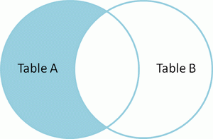

# 基础命令

## 基础命令

> 名词解析

```sql
DB    --Data-Base，数据库，存储一系列有组织的数据
DBMS  --Data-Base-Manage-System，数据库管理系统软件，如：Mysql，Oracle，sql-server
SQL   --Structure-Query-Language，结构化查询语言，与数据库通信
```

> 基础语法

```sql
'不区分大小写。建议关键字大写，表名和列名小写'。每条命令使用分号结尾。单引号和双引号都可以表示字符串。

mysql的字段名、表名通常不需要加任何引号，如果非要加上引号，必须加反引号。
mysql的别名可不加引号，如果加，单引号和双引号以及反引号都可以。别名含有特殊字符，则必须使用双引号。
```

>赋予权限

```sql
-- GRANT [权限内容] ON [库名.表名] TO [用户名@'IP地址'] IDENTIFIED BY ['密码']WITH GRANT OPTION;
-- 赋予用户名 MAO，密码 MIAOMIAO 的用户可以在任意设备上操作所有数据库表的权限
GRANT ALL PRIVILEGES ON *.* TO MAO@'%' IDENTIFIED BY 'MIAOMIAO' WITH GRANT OPTION;
```

> linux环境mysql日志配置在`my.cnf 或 mysql.cnf`

```shell
find / -name my.cnf(mysql.cnf) #查找这两个文件所在位置
log-error=/var/log/mysql.log   #在上述两个文件中配置
```

> 常用命令

```sql
-- [-h] 服务器ip; [-P] 端口号(默认3306，非默认则必须显示指定); [-u] 用户名; [-p] 密码（#$%_BC13439677375）
mysql -h 192.168.5.25 -P 33306 -u bluecardsoft -p
```

```sql
 select version();   -- 版本
 
 use test0806;       -- 切换数据库
 show tables;        -- 当前数据库下的所有表
 select database();  -- 当前所使用的数据库
 
 SELECT ROW_COUNT(); -- 返回受影响的行数
```
## 定义-DDL

> sql分类

```sql
DDL：Data-Define-Languge，数据定义语言。         --如，create，drop，alter
DML：Data-Manipulate-Language，数据操作语言。    --如，insert，update，delete
DQL：Data-Query-Language，数据查询语言。         --如，select

TCL：Transaction-Control-Language，事务控制语言。--如，commit，rollback  
```

> CREATE

```sql
CREATE TABLE `city` (
    `id` int(11) NOT NULL AUTO_INCREMENT COMMENT 'id',
    `name` varchar(10) DEFAULT NULL COMMENT '用户名', --VARCHAR 记得指定长度
    PRIMARY KEY (`id`)
) COMMENT '用户';

SHOW CREATE TABLE city; --查看创建过程
DESC city;              --DESC 查看表的详细信息
```

```sql
CREATE TABLE city0 LIKE city; --仅复制表的整体结构

CREATE TABLE city1 SELECT id,name FROM city WHERE id=2; --复制表的部分结构 + 数据（id，name两列）
```

> DROP

```sql
DROP TABLE IF EXISTS `city`; --先删除
```

> ALERT：`ADD|CHANGE|MODIFY|DROP`

```sql
ALTER TABLE tbName ADD COLUMN 列名 列类型 [列参数] [NOT NULL DEFAULT]  --增加列
ALTER TABLE tbName CHANGE COLUMN 旧列名 新列名 列类型 [列参数]          --修改列名（注意，新列的类型）
ALTER TABLE tbName MODIFY COLUMN 列名 新列类型 [列参数]                --修改列类型
ALTER TABLE tbName DROP COLUMN 列名;                                 --删除列

ALTER TABLE tbName RENAME TO newName; -- 修改表名
```

## 操作-DML

> INSERT

```sql
INSERT INTO city(id,name) VALUES --列与值要严格对应。不写则默认为所有列赋值
(DEFAULT,'晋州'),                 --自增主键赋值 DEFAULT，不指定的列默认赋值 NULL
(DEFAULT,'朔州');                 --支持批量插入
```

```sql
INSERT INTO city(id,name)
SELECT id,name FROM employee WHERE id>3; --将查询结果插入到表中
```

> UPDATE

```sql
UPDATE city SET age=900 WHERE name='苏州'; --必须添加条件，否则全表修改

UPDATE detail AS a,info AS b SET a.state=07,b.state=07 WHERE a.id=b.id AND b.id=5; --联表修改
```

> DELETE

```sql
DELETE FROM city WHERE name='晋州'; --单表删除
```

```sql
DELETE city,student
FROM city JOIN student ON student.name=city.name
WHERE city.name='晋州';             --联表删除
```

## 查询-DQL

> 别名：对于别名含有特殊符号的（如空格，#等），使用`双引号`括起来。

```sql
SELECT id, `name` "stu#name" FROM student;
```

> 去重：DISTINCT 和 GROUP BY ，二者都是针对给定字段进行去重。

```sql
DISTINCT 方式就是两两对比，需要遍历整个表。 GROUP BY 分组类似先建立索引，再查索引。

两者对比：大表 GROUP BY 快，小表 DISTINCT 快（不用建索引）。但小表就算建索引，也不会慢到哪去。
```

```sql
SELECT DISTINCT id,num FROM score;        -- DISTINCT：id和num 都相同的，才进行去重
SELECT id,num FROM score GROUP BY id,num; -- GROUP BY
```

> 模糊查询：通配符`%` 零到多个字符，`_`一个字符，`[]`括号内的一个字符

```sql
SELECT * FROM student WHERE `id` LIKE '1%';                -- id以1开头，可以匹配数值型。
SELECT * FROM student WHERE `name` LIKE '_\_%';            -- 第二个字符为下划线（系统内置转义符\）
SELECT * FROM student WHERE `name` LIKE '_$_%' ESCAPE '$'; -- 自定义转义符 $
```

```sql
-- 两句查询结果不一样。因为，like '%%' 不能匹配值为 NULL 记录
SELECT * FROM employee; 
SELECT * FROM employee WHERE first_name like '%%'; 
```

> 安全等于`<=>`

```sql
SELECT * FROM student WHERE `name` <=> '如花'; -- 对于非NULL，等同于 =

SELECT * FROM student WHERE `name` <=> NULL;  -- 对于NULL，等同于 IS
SELECT * FROM student WHERE `name` IS NULL;
```

> ANY & ALL

```sql
ANY：和子查询返回的'某一值'比较。
ALL：和子查询返回的'所有值'比较。
```


## 执行顺序

>所有的查询语句都是从 FROM 开始执行的，并非 SELECT。`where → group by → having → order by → limit`

```sql
(7) - SELECT
(8) - DISTINCT <select_list>
(1) - FROM <left_table>
(3) - <join_type> JOIN <right_table>
(2) - ON <join_condition>
(4) - WHERE <where_condition>
(5) - GROUP BY <group_by_list>
(6) - HAVING <having_condition>
(9) - ORDER BY <order_by_condition>
(10 - LIMIT <limit_number>
```

```sql
SELECT 班级, AVG(数学成绩) AS 数学平均成绩
FROM 学生信息表
WHERE 数学成绩表 IS NOT NULL --（错误写法）WHERE 数学成绩表 IS NOT NULL AND AVG(数学成绩) > 75
GROUP BY 班级
HAVING 数学平均成绩 > 75

ORDER BY 数学平均成绩 DESC
LIMIT 3;
```

```sql
首先，执行 FROM 子句, 从学生成绩表中组装数据源的数据。
执行 WHERE 子句, 筛选学生成绩表中所有学生的数学成绩不为 NULL 的数据 。
执行 GROUP BY 子句, 把学生成绩表按 "班级" 字段进行分组。
计算 avg 聚合函数, 按找每个班级分组求出 数学平均成绩。
执行 HAVING 子句, 筛选出班级 数学平均成绩大于 75 分的。

执行 SELECT 语句，返回数据，但别着急，还需要执行后面几个步骤。

执行 ORDER BY 子句, 把最后的结果按 "数学平均成绩" 进行排序。
执行 LIMIT ，限制仅返回3条数据。结合 ORDER BY 子句，即返回所有班级中数学平均成绩的前三的班级及其数学平均成绩。
```

```sql
若将 avg(数学成绩) > 75 放到 WHERE 子句中，此时 GROUP BY 语句还未执行，因此此时聚合值 avg(数学成绩) 还是未知的，因此会报错。
```


#基础函数

## 单行函数

> NULL

```sql
ISNULL(expr)    -- 表达式为 NULL，返回 1，否则返回 0
IFNULL(v1,v2)   -- v1 为 NULL，返回 v2，否则返回 v1
IF(expr,v1,v2)  -- 表达式成立，返回 v1；否则返回 v2
```

> CONCAT

```sql
SELECT 5 + 'aa'; -- 对于非数值的一方，作取0处理。最终结果：5
SELECT 5 + NULL; -- NULL和任何值相加，结果：NULL
```

```sql
SELECT CONCAT(5,'a') caoncat; -- 字符串拼接：'5a'
```

> BETWEEN 和 IN

```sql
BETWEEN 5 AND 10 --[5,10]
IN(5, 10)        --x=5 || x=10
```

> CASE简单函数：SWITCH `（适合离散的等值条件）`

```sql
SELECT employee_id,
    (CASE sex
     WHEN '1' THEN '男'
     WHEN '0' THEN '女'
     ELSE '其他' END) sex
FROM employees
```

> CASE搜索函数：IF-ELSE `（适合逻辑逻辑条件）`

```sql
SELECT employee_id,
    (CASE
     WHEN sex=1 THEN '男'
     WHEN sex=0 THEN '女'
     ELSE '其他' END) sex
FROM employees
```

> 数学函数 `（a%b = a-a/b*b）`

```sql
SELECT CEIL(-1.451) n1;        -- -1 -->向上取整，返回 >= 参数的最小整数
SELECT FLOOR(-1.451) n1;       -- -2 -->向下取整，... <= ............

SELECT MOD(-10, -3) n1;        -- -1 -->取余%，取余操作的符号位和被除数一致。 a%b = a-a/b*b
```

```sql
SELECT ROUND(45.678, 2);     -- 45.68 保留两位小数，四舍五入
SELECT TRUNCATE(45.678, 2);  -- 45.67 同上，但不会四舍五入

SELECT ROUND(-1.45) n1, ROUND(-1.65) n2; -- -1 -2 四舍五入，向靠近原点 0 的方向舍弃，向远离 0 的方向入
```

> 字符串函数 `（索引从1开始计数）`

```sql
SELECT SUBSTR('RUNOOB', 2) AS subStr;     -- UNOOB，从 1 开始计数
SELECT SUBSTR('RUNOOB', 2, 3) AS subStr;  -- UNO --> 同 MID()
SELECT SUBSTR('RUNOOB', -3) AS subStr;    -- OOB --> 同 RIGHT()
```

```sql
SELECT LEFT('RUNOOB', 3) AS leftStr;      -- RUN --> 左侧前3位字符
SELECT RIGHT('RUNOOB', 3) AS rightStr;    -- OOB --> 右侧后3......
SELECT MID('RUNOOB', 2, 3) AS midStr;     -- UNO --> 中间第2位字符开始(从1开始计数)，截取3位
```

```sql
SELECT SUBSTRING_INDEX('192.168.5.120', '.', 2) AS subIndex;  -- 192.168 --> 截第二个'.'之前
SELECT SUBSTRING_INDEX('192.168.5.120', '.', -2) AS subIndex; -- 5.120   --> ...........后
SELECT SUBSTRING_INDEX('192.168.5.120', '..', 2) AS subIndex; -- 192.168.5.120 --> 无返回所有
```

```sql
SELECT UCASE("runoob") AS uCase; -- RUNOOB
SELECT LCASE("RUNOOB") AS lCase; -- runoob --> 大小写转换
```

```sql
SELECT LENGTH('测试') AS length;          -- 6 --> 以'字节'为单位（汉字：utf-8占3字节，GBK占2）
SELECT CHAR_LENGTH('测试') AS charLength; -- 2 --> '字符'【推荐】。VARCHAR(10)，10指的是字符
```

```sql
SELECT REPLACE('192.168.5.120','.','') INTO @repStr; -- 1921685120 --> 替换所有
```

```sql
SELECT INSTR('ASDFGH', 'SD') AS instr;   -- 2 --> 子串第一次出现的索引，找不到返回0

SELECT SUBSTR(email, 1, INSTR(email, '@')-1) name FROM employee; --截取 email 中的 name
```

> 时间函数

```sql
SELECT now();      -- 2019-08-20 11:15:43
SELECT curdate();  -- 2019-08-20
SELECT curtime();  -- 11:16:55
```

```sql
SELECT date('2019-08-20 11:15:43') date; -- 2019-08-20 --> 截取日期部分
SELECT time('2019-08-20 11:15:43') time; -- 11:15:43   --> 截取时间部分

SELECT year('2019-08-20 11:15:43') year;              -- 2019 -->截取年份
SELECT EXTRACT(YEAR FROM '2019-08-20 11:15:43') year; -- 同上
```

```sql
SELECT DATE_ADD('2019-08-20 11:15:43', INTERVAL 1 DAY); -- 1天以后（-1表示一天以前）【DATE_SUB() 也可以表示一天以前】
```

```sql
SELECT DATEDIFF('2008-12-30','2008-12-31') AS dateDiff; -- -1，时间差（前面减后面）
```

```sql
SELECT DATE_FORMAT('2019/08/20 11:15:43', '%Y-%m-%d %H:%i:%s') AS dateFormat; -- 2019-01-11 14:56:19

SELECT STR_TO_DATE('23/04/2019', '%d/%m/%Y') str2date; -- 2019-04-23，字符串转日期
```

```sql
--%Y：4位的年份； %m：两位的月份； %y：2位的年份； %c：1位的月份； %d：两位的天数
```

```sql
-- 时间支持 BETWEEN AND 语法
SELECT s_id FROM grade WHERE (s_brith BETWEEN '20000101' AND '20190101')；

SELECT * FROM passage_open_timer WHERE CURTIME() BETWEEN timer_start AND timer_end; --同上，潮汐车道
```


##聚合函数

> SUM，AVG，MIN，MAX，COUNT：用作统计使用，又称为聚合函数，统计函数，组函数。

> SUM，AVG 一般用于`数值类型`。MAX，MIN 可处理`任何类型`，如日期类型，字符串类型

```sql
SELECT SUM(salary), AVG(salary) FROM employees;

SELECT MAX(hiredate), MIN(first_name) FROM employees; --日期类型，字符串类型
```

> 处理 NULL

```sql
-- MAX，MIN：都忽略 NULL
-- COUNT：两种情况：COUNT(column) --> 忽略 NULL； COUNT(*) --> 不忽略 NULL，若某行全为 NULL，计数器也会 +1。

-- SUM：忽略 NULL 值。且当对多个列求和时 sum(id+name)，如果运算的列中任意一列的值为 NULL，则忽略这行的记录。
select sum(name+id) from student;

-- AVG：忽略 NULL 值，而不是将其作为 0 参与计算
select sum(name)/count(name),avg(name) from student; --两种算法，结果一致
select sum(name)/count(*),avg(name) from student;    --两种算法，结果不一致。0.625,1
```

> GROUP BY 处理 NULL

```sql
（1）.分组列中若有 NULL，这也将作为一组，且 NULL 值排在最前面。
（2）.除汇总函数计算语句外，SELECT 中的选择列必须出现在 GROUP BY 中
（3）.GROUP BY 可以包含任意数目的列，可以嵌套
```

> `WHERE` 用于分组前筛选，作用于原始表。`HAVING`用于分组后筛选，作用于分组后的表。
>
> 聚合函数作用的字段要求是 `GROUP BY` 后的字段，聚合函数作为条件肯定是放在 `HAVING` 语句中。

```sql
SELECT department_id, MAX(salary) max
FROM employees
WHERE commission_pct IS NOT NULL
GROUP BY department_id
ORDER BY max DESC; -- 每个部门，有奖金员工中的最高工资 --> WHERE
```

```sql
SELECT department_id, COUNT(department_id) AS count 
FROM employees
GROUP BY department_id
HAVING count > 2
ORDER BY count ASC; -- 查询哪个部门的员工数大于2 --> HAVING
```

> `count()`

```sql
count(*)     ：当前行有一列不为 NULL，则计数器 +1
count(1)     ：同上
count(column)：当前行的当前列不为 NULL,计数器 +1
```

```sql
由于 COUNT 统计时，不计入NULL值。所以，可通过 COUNT(*) 统计当前表中的所有记录数，其原理是：当前行只要有一列值不为NULL，计数器就会增加1。
但是，这将会造成全表扫描？ mysql有优化，只扫描索引列！

效率比较：COUNT(*) = COUNT(1) = COUNT(PK) > COUNT(N-PK)

解释说明：若表中有索引，COUNT(*) 与 COUNT(1) 均会使用索引。
由于mysql默认对主键添加索引，所以，对存在主键的表进行 COUNT(*)、COUNT(1) 查询也都会使用主键索引。
```

```sql
--统计每个老师的学生个数
SELECT t.*,COUNT(t.id),COUNT(s.id) FROM teacher t LEFT JOIN student s ON s.tid=t.id GROUP BY t.id;

--其中，COUNT(t.id)统计有问题，对于没有学生的老师，也会得到结果：1
1	张磊老师	6	6
3	刘燕老师	5	5
5	李杰老师	1	0
```


# 查询相关

## 子查询

> FROM：子查询结果作为一张虚拟表使用，必须为虚拟表起别名

```sql
-- 查询各课程中成绩比本门平均成绩高的课程号，学生号，成绩
SELECT sc.course_id,sc.student_id,sc.num 
FROM score sc LEFT JOIN(
    SELECT course_id,AVG(num) num_avg FROM score GROUP BY course_id
) tmp ON tmp.course_id=sc.course_id WHERE sc.num>tmp.num_avg;
```

> WHERE`/`HAVING

```sql
-- 查询最高成绩小于【4号课程平均成绩】的课程id和其最高成绩
SELECT course_id,max(num) num_max FROM score GROUP BY course_id HAVING num_max<(
    SELECT avg(num) num_avg FROM score WHERE course_id=4
);
```

> IN：`包含的值不应过多，转化为 exists`

```sql
select * from 表A where id in (select id from 表B);
select * from 表A where exists(select * from 表B where 表B.id = 表A.id); --等同于上
```

```sql
IN 查询适合 B 表数据量不多的情况。这是因为： IN 只执行一次，它查出 B 表中的所有id字段并缓存起来。
之后，检查 A 表的id是否与 B 表中的id相等，如果相等则将 A 表的记录加入结果集中，直到遍历完 A 表的所有记录。
```

> EXISTS

```sql
-- 查询有选课的学生id和学生名
SELECT id,`name` FROM student WHERE id IN(
    SELECT student_id FROM score
);
```

```sql
SELECT id,`name` FROM student s WHERE EXISTS(
    SELECT sc.student_id FROM score sc WHERE sc.student_id=s.id
);
```

> IN，SOME，ANY，ALL

```sql
IN  ：范围之内。等同于'=ANY()'
SOME：ANY的别名，用法相同

ANY：和子查询结果中的任一数值进行比较。
ALL：.............所有...........。ANY，ALL必须和比较操作符一起使用。-- >ANY() 相当于'>MIN()'。>ALL() 相当于'>MAX()'
```

## 92连接

> 基础概念

```sql
将多张表需要全部放在 FROM 之后，所有的连接条件都放在 WHERE 当中。
因此 sql92 中的等值连接、非等值链接、外连接等等，其实只是 WHERE 中的条件不同罢了。
```

> 非等值连接

```sql
-- 查询每门课程平均成绩的成绩等级
SELECT tmp.*,sl.num_level FROM(
    SELECT course_id,AVG(num) num_avg FROM score GROUP BY course_id
) tmp,score_level sl WHERE tmp.num_avg BETWEEN sl.lowest_num AND sl.highest_num;
```

> 自连接

```sql
-- 查询员工名和其领导名
SELECT e.first_name,e.manager_id,m.first_name
FROM employees e, employees m WHERE e.manager_id=m.employee_id;
```

## 99连接

> 基础概念

```sql
使用 FROM t1 JOIN t2 ON t1.c1=t2.c2 的语法来表示哪张表和哪张表进行什么样的连接。连接类型一目了然，并且底层支持地更好。
sql99支持功能的较多，实现'连接条件'和'筛选条件'的分离，使得可读性强
```

>非等值连接

```sql
-- 查询每门课程平均成绩的成绩等级
SELECT tmp.*,sl.num_level FROM(
    SELECT course_id,AVG(num) num_avg FROM score GROUP BY course_id
) tmp LEFT JOIN score_level sl ON tmp.num_avg BETWEEN sl.lowest_num AND sl.highest_num; -- 非等值连接
```

> 自连接

```sql
-- 查询员工名和其领导名
SELECT e.first_name,e.manager_id,m.first_name
FROM employees e LEFT JOIN employees m ON e.manager_id=m.employee_id;
```

> 常见 JOIN

```sql
-- （1）[INNER] JOIN：内连接。效果同 sql92 的等值连接
SELECT * FROM A INNER JOIN B ON A.id=B.id;

-- （2）LEFT [OUTER] JOIN：左外连接。A 的所有记录和 A.id=B.id 的所有 B 的记录
SELECT * FROM A LEFT JOIN B ON A.id=B.id;

-- （3）A 表独有的记录
SELECT * FROM A LEFT JOIN B ON A.id=B.id WHERE B.id IS NULL;
```

```sql
-- （4）RIGHT [OUTER] JOIN：右外连接。B 的所有记录和 A.id=B.id 的所有 A 的记录
SELECT * FROM A RIGHT JOIN B ON A.id=B.id;

-- （5）B 表独有的记录
SELECT * FROM A RIGHT JOIN B ON A.id=B.id WHERE A.id IS NULL;
```

```sql
-- （6）A + B 所有的记录
SELECT * FROM A LEFT JOIN B ON A.id=B.id
UNION
SELECT * FROM A RIGHT JOIN B ON A.id=B.id;

-- 	（7）A，B 表中单独出现的记录
SELECT * FROM A LEFT JOIN B ON A.id=B.id WHERE B.id IS NULL
UNION
SELECT * FROM A RIGHT JOIN B ON A.id=B.id WHERE A.id IS NULL;
```

   

  

 


>

```

```


# JSON相关

## 创建

>JSON_OBJECT：生成 JSON 对象。如果有KEY为 NULL 或参数个数为奇数，则抛错

```sql
mysql> SET @j = (SELECT JSON_OBJECT('age', 20, 'birthday', now(), 'datas', (SELECT JSON_OBJECT('name', 'lucy'))) json);

mysql> SELECT @j;
+----------------------------------------------------------------------------------+
| @j                                                                               |
+----------------------------------------------------------------------------------+
| {"age": 20, "datas": {"name": "lucy"}, "birthday": "2019-08-02 09:17:03.000000"} |
+----------------------------------------------------------------------------------+
```

> JSON_ARRAY：生成 JSON 数组

```sql
mysql> SELECT JSON_ARRAY(JSON_OBJECT('age',20,'name','lucy'), JSON_OBJECT('age',18,'name','lily')) json_arrary;
+------------------------------------------------------------+
| json_arrary                                                |
+------------------------------------------------------------+
| [{"age": 20, "name": "lucy"}, {"age": 18, "name": "lily"}] |
+------------------------------------------------------------+
```

## 解析

> JSON_VALID：检验 JSON 是否合法

```sql
mysql> SELECT JSON_VALID('{"a": "1", "b"}');
+-------------------------------+
| JSON_VALID('{"a": "1", "b"}') |
+-------------------------------+
|                             0 |
+-------------------------------+
```

> JSON_TYPE：查询 JSON 的类型，是 OBJECT 还是 ARRAY。

```sql
mysql> SELECT JSON_TYPE('{"a": "1"}');
+-------------------------+
| JSON_TYPE('{"a": "1"}') |
+-------------------------+
| OBJECT                  |
+-------------------------+
```

```sql
mysql> SELECT JSON_TYPE('[{"a": "1"}, {"B": 2}]');
+-------------------------------------+
| JSON_TYPE('[{"a": "1"}, {"B": 2}]') |
+-------------------------------------+
| ARRAY                               |
+-------------------------------------+
```

>JSON_CONTAINS_PATH：查询 KEY 值是否存在。存在返回1，否则返回0

```sql
-- JSON_CONTAINS_PATH(json_doc, one_or_all, path[, path] ...)：参数2，只能取值 one/all。参数3是变长，可查单个key，也可查多个key
```

```sql
-- 查询单个key时，参数2可以是 one/all。
mysql> SELECT JSON_CONTAINS_PATH(@j, 'one', '$.age');
+----------------------------------------+
| JSON_CONTAINS_PATH(@j, 'one', '$.age') |
+----------------------------------------+
|                                      1 |
+----------------------------------------+
```

```sql
-- 查询多个key时，参数2根据情况选择。one：表示只要有一个存在即可；all：表示所有的都存在才行。
mysql> SELECT JSON_CONTAINS_PATH(@j, 'one', '$.age', '$.datas.address');
+-----------------------------------------------------------+
| JSON_CONTAINS_PATH(@j, 'one', '$.age', '$.datas.address') |
+-----------------------------------------------------------+
|                                                         1 |
+-----------------------------------------------------------+

mysql> SELECT JSON_CONTAINS_PATH(@j, 'all', '$.age', '$.datas.address');
+-----------------------------------------------------------+
| JSON_CONTAINS_PATH(@j, 'all', '$.age', '$.datas.address') |
+-----------------------------------------------------------+
|                                                         0 |
+-----------------------------------------------------------+
```

>JSON_CONTAINS：查询 KEY-VALUE 键值对是否存在

```sql
-- JSON_CONTAINS(json_doc, val[, path])：参数1是待查json，参数2是value，参数3是key。
```

```sql
--【注意】参数3的 value 有些限制条件，比如正整数1，需要写成 '1'；如果是字符串"lucy"，要写成 '"lnmp"'。sql才是有效的
mysql> SELECT JSON_CONTAINS(@j, "lucy", '$.datas.name');
ERROR 3141 (22032): Invalid JSON text in argument 2 to function json_contains: "Invalid value." at position 0.

mysql> SELECT JSON_CONTAINS(@j, '"lucy"', '$.datas.name');
+---------------------------------------------+
| JSON_CONTAINS(@j, '"lucy"', '$.datas.name') |
+---------------------------------------------+
|                                           1 |
+---------------------------------------------+
```

> JSON_KEYS：列出所有的 KEY

```sql
-- 查询普通 JSON
mysql> SELECT JSON_KEYS(@j);
+------------------------------+
| JSON_KEYS(@j)                |
+------------------------------+
| ["age", "datas", "birthday"] |
+------------------------------+

-- 查询内嵌 JSON
mysql> SELECT JSON_KEYS(@j, '$.datas');
+--------------------------+
| JSON_KEYS(@j, '$.datas') |
+--------------------------+
| ["name"]                 |
+--------------------------+
```

> JSON_EXTRACT：解析JSON。`【注意】默认查询结果中，字符串类型带有引号`

```sql
-- 如果想去掉外层引号，配合 JSON_UNQUOTE 使用
mysql> SELECT JSON_EXTRACT(@j, '$.datas.name');
+----------------------------------+
| JSON_EXTRACT(@j, '$.datas.name') |
+----------------------------------+
| "lucy"                           |
+----------------------------------+
```

> JSON_UNQUOTE：去掉 VALUE 值的外层引号

```sql
-- 类比于上个查询，外层无引号
mysql> SELECT JSON_UNQUOTE(JSON_EXTRACT(@j, '$.datas.name'));
+------------------------------------------------+
| JSON_UNQUOTE(JSON_EXTRACT(@j, '$.datas.name')) |
+------------------------------------------------+
| lucy                                           |
+------------------------------------------------+
```

##操作

> JSON_INSERT：追加 KEY，KEY 不存在，才能插入。`以下操作均生成新的JSON，不会影响原有的JSON`

```sql
-- 只插入了 id。因为 age 已存在，所以未插入。
mysql> SELECT JSON_INSERT(@j, '$.age', 18, '$.id', '001');
+-----------------------------------------------------------------------------------------------+
| JSON_INSERT(@j, '$.age', 18, '$.id', '001')                                                   |
+-----------------------------------------------------------------------------------------------+
| {"id": "001", "age": 20, "datas": {"name": "lucy"}, "birthday": "2019-08-02 09:17:34.000000"} |
+-----------------------------------------------------------------------------------------------+
```

>JSON_SET：直接插入，不管 KEY 是否存在

```sql
mysql> SELECT JSON_SET(@j, '$.age', 18, '$.id', '001');
+-----------------------------------------------------------------------------------------------+
| JSON_SET(@j, '$.age', 18, '$.id', '001')                                                      |
+-----------------------------------------------------------------------------------------------+
| {"id": "001", "age": 18, "datas": {"name": "lucy"}, "birthday": "2019-08-02 09:17:34.000000"} |
+-----------------------------------------------------------------------------------------------+
```

>JSON_REMOVE：删除指定 KEY，若 KEY 不存在则忽略

```sql
mysql> SELECT JSON_REMOVE(@j, '$.age', '$.gender');
+-----------------------------------------------------------------------+
| JSON_REMOVE(@j, '$.age', '$.gender')                                  |
+-----------------------------------------------------------------------+
| {"datas": {"name": "lucy"}, "birthday": "2019-08-02 09:17:34.000000"} |
+-----------------------------------------------------------------------+
```

>JSON_REPLACE：替换 KEY 对应的 VALUE 值，KEY 不存在则忽略

```sql
mysql> SELECT JSON_REPLACE(@j, '$.age', 18, '$.gender', '女');
+----------------------------------------------------------------------------------+
| JSON_REPLACE(@j, '$.age', 18, '$.gender', '女')                                  |
+----------------------------------------------------------------------------------+
| {"age": 18, "datas": {"name": "lucy"}, "birthday": "2019-08-02 09:17:34.000000"} |
+----------------------------------------------------------------------------------+
```

##结合表

>和数据字段相结合使用。 `注意语法糖 ->`

```sql
mysql> SELECT memo FROM log WHERE id=470941;
+------------------------------------------------------------------------------+
| memo                                                                         |
+------------------------------------------------------------------------------+
| {"age": 20, "time": "2019-07-30 16:55:32.000000", "datas": {"name": "lucy"}} |
+------------------------------------------------------------------------------+
```

```sql
-- 解析 JSON 类型字段中的某个 KEY
mysql> SELECT JSON_UNQUOTE(JSON_EXTRACT(memo, '$.datas.name')) name FROM log WHERE id=470941;
+------+
| name |
+------+
| lucy |
+------+
```

```sql
-- 【注意】JSON 解析的 -> 语法。参数1只能为数据表中的字段，不能为 JSON字符串 或 表达式。
mysql> SELECT JSON_UNQUOTE(memo -> '$.datas.name') name FROM log WHERE id=470941;
+------+
| name |
+------+
| lucy |
+------+
```

> 生成 JsonArray

```sql
-- mysql8.0之前解决方案
SELECT CONCAT(
    '[', 
    GROUP_CONCAT(JSON_OBJECT('name', name, 'phone', phone)),
    ']'
) 
FROM person;
```

```sql
-- mysql8.0新增方法
SELECT JSON_ARRAYAGG(JSON_OBJECT('name', name, 'phone', phone)) from Person;
```


# 练习相关

## 基础练习

> 学生成绩练习

```sql
DROP TABLE IF EXISTS `blue`;
CREATE TABLE `blue` (
    `id` int(11) NOT NULL AUTO_INCREMENT,
    `name` varchar(12) DEFAULT NULL,
    `birth` char(8) DEFAULT NULL,
    `class` tinyint(1) unsigned DEFAULT '1',
    `chinese` int(11) DEFAULT NULL,
    `english` int(11) DEFAULT NULL,
    `math` int(11) DEFAULT NULL,
    PRIMARY KEY (`id`)
) ENGINE=InnoDB AUTO_INCREMENT=5 DEFAULT CHARSET=utf8mb4;

-- ----------------------------
-- Records of blue
-- ----------------------------
INSERT INTO `blue` VALUES ('1', '赵云', '19000101', '1', '21', '31', '20');
INSERT INTO `blue` VALUES ('2', '李超', '19970801', '2', '40', '50', '60');
INSERT INTO `blue` VALUES ('3', '李云', '20101108', '2', '70', '80', '90');
INSERT INTO `blue` VALUES ('4', '赵云', '20190909', '1', '50', '50', '30');
```

```sql
-- 将id为 1 的学生，数学成绩加 1 分
UPDATE blue SET math=math+1 WHERE id=1;

-- 将学生姓名由"马XX"改为"李XX"（substr从 1 开始计数）
UPDATE blue SET name=CONCAT('李', SUBSTR(name,2)) WHERE name LIKE '马%';

-- 把数学成绩在[20, 29]之间改为20，处于[30, 39]之间的,改为30
UPDATE blue SET math=(FLOOR(math/10)*10) WHERE math BETWEEN 20 AND 39;

-- 查出生日在2000年到2019年之间，以及1995年之前的学生 【DATEDIFF()函数: 前者-后者】
SELECT * FROM blue WHERE (birth BETWEEN '20000101' AND '20190101') OR birth<'19950101';
SELECT * FROM blue WHERE (birth BETWEEN '20000101' AND '20190101') OR DATEDIFF(birth,'19950101')<0;

-- 姓名相同的学生信息
SELECT id,`name` FROM blue WHERE id IN(
    SELECT id FROM blue GROUP BY `name` HAVING COUNT(`name`)>1
);
```

> WHERE & HAVING

```sql
WHERE  语句在 GROUP BY 语句之前；sql会在'分组之前'计算 where 语句。 
HAVING 语句在 GROUP BY 语句之后；sql会在'分组之后'计算 having 语句。
```

```sql
-- 查询语文比英语低50分以上的学生，及低的分
SELECT id,`name`,(english-chinese) sub FROM blue WHERE english-chinese>50;
SELECT id,`name`,(english-chinese) sub FROM blue HAVING sub>50;

注意: WHERE 后面要跟的是'数据表里的字段'，如果 WHERE 后换成 sub， 则报错，因为表里没有该字段（先执行 WHERE，再执行 SELECT）！！
而 HAVING 只是根据前面查询出来的是什么就可以后面接什么。
```

```sql
-- 查询语文成绩最低分大于70，最高分小于90的班级
SELECT class FROM blue GROUP BY class HAVING MIN(chinese)>70 AND MAX(chinese)<90;
```

> 交易流水

```sql
--交易表（trade）：id,day,code,money,flag(1表示扣款成功，2表示扣款失败)

--查询每天扣款成功必输、成功金额、失败笔数、失败金额
select `day` '日期',
sum(case when flag=1 then 1 else 0 end) as '成功笔数',
sum(case when flag=1 then money else 0 end) '成功金额',
sum(case when flag=2 then 1 else 0 end) as '失败笔数',
sum(case when flag=2 then money else 0 end) '失败金额'
from trade group by `day`;
```


> 删除重复数据，保留重复数据中最大id所在行的数据

```sql
DELETE FROM city WHERE id NOT IN(
    SELECT tmp.maxid FROM (
        SELECT MAX(id) AS maxid FROM city GROUP BY `name` where count(name)>1
    ) tmp
);
```

```sql
--错误的sql：[Err] 1093 - You can't specify target table 'city' for update in FROM clause
DELETE FROM city WHERE id NOT IN(
    SELECT MAX(id) AS maxid FROM city GROUP BY `name` where count(name)>1
);
```
> 足球比赛

```sql
--表 team : t_id, t_name
--表 match: match_id, host_id, guest_id, match_result, match_time
--查出 2006-6-1 到 2006-7-1 之间举行的所有比赛，用以下形式列出：拜仁 2：0 不来梅 2006-6-21
SELECT t1.t_name '主队',m.match_result '比赛成绩',t2.t_name '客队',m.match_time '比赛时间' 
FROM `match` m 
LEFT JOIN team t1 ON t1.t_id=m.host_id
LEFT JOIN team t2 ON t2.t_id=m.guest_id
WHERE match_time BETWEEN '2006-6-1' AND '2006-7-1';
```

```sql

```

```sql

```


```sql

```

<http://cache.baiducontent.com/c?m=9d78d513d9d431af4f9a9f697d17c0121d4380123cd5d21168d5e35f93124c403762f4ba57351072c4c40c6416af384b9af72102411420c69bca8a4ecabae23f2ffe30350019914062c419d9dc4755c237902bfed91df0c98725e3dfc5a4d94352ba44750d9786804d7616dd19f2033093b1e94f022e16adec40728e29605d943436b7508fe2256f779686de4b3dc93da16b06e3de21f77e4cba49e259596553a13fac15146375f74f50ae186d5acfbe1cf02a0e117ee955f2e396eaa313d59bb63299f9cdb26d886ae6c1e0fc734367528d7ff8f4e3&p=8736cc0085cc43eb08e2947d0b4092&newp=882a9546d0830ae917fec7710f4c88231610db2151d3d601298ffe0cc4241a1a1a3aecbf22231503d6c07e6107aa4c58e0f631723d0034f1f689df08d2ecce7e6fc3617b63&user=baidu&fm=sc&query=%B2%E9%B3%F6+2006%2D6%2D1+%B5%BD+2006%2D7%2D1+%D6%AE%BC%E4%BE%D9%D0%D0%B5%C4%CB%F9%D3%D0%B1%C8%C8%FC&qid=c98579f4000e7597&p1=1>

> 学生总成绩

```sql

```


## 数据准备

```sql
SET FOREIGN_KEY_CHECKS=0;

-- ----------------------------
-- Table structure for class
-- ----------------------------
DROP TABLE IF EXISTS `class`;
CREATE TABLE `class` (
  `cid` int(11) NOT NULL AUTO_INCREMENT,
  `caption` varchar(32) NOT NULL,
  PRIMARY KEY (`cid`)
) ENGINE=InnoDB AUTO_INCREMENT=5 DEFAULT CHARSET=utf8;

-- ----------------------------
-- Records of class
-- ----------------------------
INSERT INTO `class` VALUES ('1', '三年二班');
INSERT INTO `class` VALUES ('2', '三年三班');
INSERT INTO `class` VALUES ('3', '一年二班');
INSERT INTO `class` VALUES ('4', '二年九班');

-- ----------------------------
--  Table structure for `student`
-- ----------------------------
DROP TABLE IF EXISTS `student`;
CREATE TABLE `student` (
  `sid` int(11) NOT NULL AUTO_INCREMENT,
  `gender` char(1) NOT NULL,
  `class_id` int(11) NOT NULL,
  `sname` varchar(32) DEFAULT NULL,
  PRIMARY KEY (`sid`),
  KEY `fk_class` (`class_id`),
  CONSTRAINT `fk_class` FOREIGN KEY (`class_id`) REFERENCES `class` (`cid`)
) ENGINE=InnoDB AUTO_INCREMENT=18 DEFAULT CHARSET=utf8;

-- ----------------------------
--  Records of `student`
-- ----------------------------
BEGIN;
INSERT INTO `student` VALUES ('1', '男', '1', '理解'), ('2', '女', '1', '钢蛋'), ('3', '男', '1', '张三'), ('4', '男', '1', '张一'), ('5', '女', '1', '张二'), ('6', '男', '1', '张四'), ('7', '女', '2', '铁锤'), ('8', '男', '2', '李三'), ('9', '男', '2', '李一'), ('10', '女', '2', '李二'), ('11', '男', '2', '李四'), ('12', '女', '3', '如花'), ('13', '男', '3', '刘三'), ('14', '男', '3', '刘一'), ('15', '女', '3', '刘二'), ('16', '男', '3', '刘四');
COMMIT;

-- ----------------------------
--  Table structure for `teacher`
-- ----------------------------
DROP TABLE IF EXISTS `teacher`;
CREATE TABLE `teacher` (
  `tid` int(11) NOT NULL AUTO_INCREMENT,
  `tname` varchar(32) NOT NULL,
  PRIMARY KEY (`tid`)
) ENGINE=InnoDB AUTO_INCREMENT=6 DEFAULT CHARSET=utf8;

-- ----------------------------
--  Records of `teacher`
-- ----------------------------
BEGIN;
INSERT INTO `teacher` VALUES ('1', '张磊老师'), ('2', '李平老师'), ('3', '刘海燕老师'), ('4', '朱云海老师'), ('5', '李杰老师');
COMMIT;

-- ----------------------------
-- Table structure for course
-- ----------------------------
DROP TABLE IF EXISTS `course`;
CREATE TABLE `course` (
  `cid` int(11) NOT NULL AUTO_INCREMENT,
  `cname` varchar(32) NOT NULL,
  `teacher_id` int(11) NOT NULL,
  PRIMARY KEY (`cid`),
  KEY `fk_course_teacher` (`teacher_id`),
  CONSTRAINT `fk_course_teacher` FOREIGN KEY (`teacher_id`) REFERENCES `teacher` (`tid`)
) ENGINE=InnoDB AUTO_INCREMENT=5 DEFAULT CHARSET=utf8;

-- ----------------------------
-- Records of course
-- ----------------------------
INSERT INTO `course` VALUES ('1', '生物', '1');
INSERT INTO `course` VALUES ('2', '物理', '2');
INSERT INTO `course` VALUES ('3', '体育', '3');
INSERT INTO `course` VALUES ('4', '美术', '2');

-- ----------------------------
-- Table structure for score
-- ----------------------------
DROP TABLE IF EXISTS `score`;
CREATE TABLE `score` (
  `sid` int(11) NOT NULL AUTO_INCREMENT,
  `student_id` int(11) NOT NULL,
  `course_id` int(11) NOT NULL,
  `num` int(11) NOT NULL,
  PRIMARY KEY (`sid`),
  KEY `fk_score_student` (`student_id`),
  KEY `fk_score_course` (`course_id`),
  CONSTRAINT `fk_score_course` FOREIGN KEY (`course_id`) REFERENCES `course` (`cid`),
  CONSTRAINT `fk_score_student` FOREIGN KEY (`student_id`) REFERENCES `student` (`sid`)
) ENGINE=InnoDB AUTO_INCREMENT=53 DEFAULT CHARSET=utf8;

-- ----------------------------
--  Records of `score`
-- ----------------------------
BEGIN;
INSERT INTO `score` VALUES ('1', '1', '1', '10'), ('2', '1', '2', '9'), ('5', '1', '4', '66'), ('6', '2', '1', '8'), ('8', '2', '3', '68'), ('9', '2', '4', '99'), ('10', '3', '1', '77'), ('11', '3', '2', '66'), ('12', '3', '3', '87'), ('13', '3', '4', '99'), ('14', '4', '1', '79'), ('15', '4', '2', '11'), ('16', '4', '3', '67'), ('17', '4', '4', '100'), ('18', '5', '1', '79'), ('19', '5', '2', '11'), ('20', '5', '3', '67'), ('21', '5', '4', '100'), ('22', '6', '1', '9'), ('23', '6', '2', '100'), ('24', '6', '3', '67'), ('25', '6', '4', '100'), ('26', '7', '1', '9'), ('27', '7', '2', '100'), ('28', '7', '3', '67'), ('29', '7', '4', '88'), ('30', '8', '1', '9'), ('31', '8', '2', '100'), ('32', '8', '3', '67'), ('33', '8', '4', '88'), ('34', '9', '1', '91'), ('35', '9', '2', '88'), ('36', '9', '3', '67'), ('37', '9', '4', '22'), ('38', '10', '1', '90'), ('39', '10', '2', '77'), ('40', '10', '3', '43'), ('41', '10', '4', '87'), ('42', '11', '1', '90'), ('43', '11', '2', '77'), ('44', '11', '3', '43'), ('45', '11', '4', '87'), ('46', '12', '1', '90'), ('47', '12', '2', '77'), ('48', '12', '3', '43'), ('49', '12', '4', '87'), ('52', '13', '3', '87');
COMMIT;
```


##01-10

> 查询《生物》比《物理》课程成绩高的所有学生的学号

```sql
SELECT sw.student_id,sw.num sw_num,wl.num wl_num FROM
(SELECT s.num,s.student_id FROM score s JOIN course c ON c.cid=s.course_id WHERE c.cname='生物') sw -- 临时表 1
LEFT JOIN
(SELECT s.num,s.student_id FROM score s JOIN course c ON c.cid=s.course_id WHERE c.cname='物理') wl -- 临时表 2
ON wl.student_id=sw.student_id
WHERE sw.num > IF(ISNULL(wl.num),0,wl.num);
```

> 查询所有同学的学号、姓名、选课数、总成绩

```sql
-- 不能使用 COUNT(*)，当前行只要有一列不为NULL，就会增加1。应该针对具体某一行进行统计
SELECT s.id,s.name,COUNT(sc.course_id) course_count,SUM(IFNULL(sc.num,0)) score_sum 
FROM score sc RIGHT JOIN student s ON s.id=sc.student_id
GROUP BY s.id;
```

> 查询没学过"李平老师"老师课的同学的学号、姓名

```sql
SELECT id,`name` FROM student WHERE id NOT IN(
    SELECT DISTINCT student_id FROM score WHERE course_id IN(
        SELECT c.cid FROM teacher t LEFT JOIN course c ON c.teacher_id=t.id WHERE t.`name`='李平老师'
    )
);
```

>查询两门及两门以上不及格同学的平均分

```sql
SELECT student_id,AVG(num),SUM(num<60) bjg FROM score GROUP BY student_id HAVING bjg>1;
```


