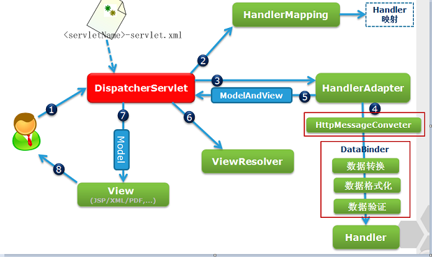

# SSM

##Web


> 初始化`SpringIoC`容器的监听器

```xml
<context-param>
    <param-name>contextConfigLocation</param-name>
    <param-value>classpath:applicationContext.xml</param-value>
</context-param>
<listener>
    <listener-class>org.springframework.web.context.ContextLoaderListener</listener-class>
</listener>
```

>`SpringMVC`核心控制器，拦截所有请求

```xml
<servlet>
    <servlet-name>springmvc</servlet-name>
    <servlet-class>org.springframework.web.servlet.DispatcherServlet</servlet-class>
    <init-param>
        <param-name>contextConfigLocation</param-name> 
        <param-value>classpath:springmvc.xml</param-value>
    </init-param>
    <load-on-startup>1</load-on-startup>
</servlet>
<servlet-mapping>
    <servlet-name>springmvc</servlet-name>
    <url-pattern>/</url-pattern> <!-- 3种可选值 -->
</servlet-mapping>
```

```sh
#可选参数: ①/ ②*.action ③/*
①. 所有地址的访问都要由'前端控制器'进行解析, 静态文件另配不解析
②. 以".action"结尾的访问,由'前端控制器'解析
③. 错误配置; 当转发到jsp页面时,仍由'前端控制器'解析jsp地址,找不到导致报错
```

>字符编码过滤器 `第1个过滤器`

```xml
<filter>
    <filter-name>characterEncodingFilter</filter-name>
    <filter-class>org.springframework.web.filter.CharacterEncodingFilter</filter-class>
    <init-param>
        <param-name>encoding</param-name>
        <param-value>UTF-8</param-value>
    </init-param>
</filter>
<filter-mapping>
    <filter-name>characterEncodingFilter</filter-name>
    <url-pattern>/*</url-pattern>
</filter-mapping>
```

>REST过滤器，POST 转换成 PUT DELETE

```xml
<filter>
    <filter-name>hiddenHttpMethodFilter</filter-name>
    <filter-class>org.springframework.web.filter.HiddenHttpMethodFilter</filter-class>
</filter>
<filter-mapping>
    <filter-name>hiddenHttpMethodFilter</filter-name>
    <url-pattern>/*</url-pattern>
</filter-mapping>
```

##Spring

> SpringIoC 组件扫描：`排除@Controller`

```xml
<context:component-scan base-package="com.example.spring">
    <context:exclude-filter type="annotation" expression="org.springframework.stereotype.Controller" />
</context:component-scan>
```

>配置数据源

```xml
<context:property-placeholder location="classpath:db.properties"/> <!--引用外部属性文件-->
<bean id="dataSource" class="com.alibaba.druid.pool.DruidDataSource">
    <property name="driverClass" value="${jdbc.driver}"/>
    <property name="jdbcUrl" value="${jdbc.url}"/>
    <property name="user" value="${jdbc.username}"/>
    <property name="password" value="${jdbc.password}"/>
</bean>
```

>事务管理器 + 注解事务

```xml
<bean id="transactionManager" class="org.springframework.jdbc.datasource.DataSourceTransactionManager">
    <property name="dataSource" ref="dataSource"/>
</bean>
<tx:annotation-driven transaction-manager="transactionManager"/>
```

>Spring 整合 Mybatis

```xml
<!-- （1）.SqlSession 对象的创建，管理等  -->
<bean class="org.mybatis.spring.SqlSessionFactoryBean">
    <property name="dataSource" ref="dataSource"/>
    <property name="mapperLocations" value="classpath:mybatis/mapper/*.xml"/> <!-- mapper.xml文件位置 -->
    <property name="configLocation" value="classpath:mybatis-config.xml"/>    <!-- （可选）mybatis配置文件 -->    
    <property name="typeAliasesPackage" value="com.example.spring.beans"/>    <!-- （可选）别名处理 -->
</bean>

<!-- （2）.mapper接口扫描 -->
<mybatis-spring:scan base-package="com.example.spring.**.mapper"/>
```

## MVC

> 组件扫描：`只扫描@Controller`

```xml
<context:component-scan base-package="com.example.spring" use-default-filters="false">
    <context:include-filter type="annotation" expression="org.springframework.stereotype.Controller" />
</context:component-scan>
```

> 视图解析器

```xml
<bean class="org.springframework.web.servlet.view.InternalResourceViewResolver">
    <property name="prefix" value="/WEB-INF/views/" />
    <property name="suffix" value=".jsp" />
</bean>
```

>开启 mvc 注解支持：映射动态请求

```xml
<mvc:annotation-driven />
```

```sh
将在 SpringMVC 上下文中定义一个 DefaultServletHttpRequestHandler，
它会对进入 DispatcherServlet 的请求进行筛查，如果发现是没有经过映射的请求，
就将该请求交由 WEB 应用服务器默认的 Servlet 处理，如果是由映射的请求，才由 DispatcherServlet 继续处理
如果web应用服务器的默认的Serlvet的名字不叫"default",则需要通过default-servlet-name来进行指定

配置了 default-serlvet-handler 后，RequestMapping的映射会失效，需要加上 annotation-driven 的配置。
```

```sh
#简化配置
（1）自动注册 DefaultAnootationHandlerMapping，AnotationMethodHandlerAdapter。是 SpringMVC 为 @Controllers 分发请求所必须的
（2）提供：数据绑定，数字和日期的format，@NumberFormat，@DateTimeFormat，xml，json默认读写支持
```

>释放静态资源：将MVC不能处理的请求交给Tomcat

```xml
<mvc:default-servlet-handler />
```

> 相关问题

```sh
#需要在 Spring 配置中整合 SpringMVC 吗？ 还是否需要再加入 SpringIOC 容器 ?
#是否需要在 web.xml 中配置启动 SpringIOC 容器的 ContextLoaderListener ?

（1）需要: 通常情况下, 类似于数据源, 事务, 整合其他框架都是放在 Spring 的配置文件中（而不是放在 SpringMVC 的配置文件中）
实际上放入 Spring 配置文件对应的 IOC 容器中的还有 Service 和 Dao. 
（2）不需要: 都放在 SpringMVC 的配置文件中. 也可以分多个 Spring 的配置文件, 然后使用 import 节点导入其他的配置文件
```

```sh
#若 Spring 的 IOC 容器和 SpringMVC 的 IOC 容器扫描的包有重合的部分, 就会导致有的 bean 会被创建 2 次.

（1）使 Spring 的 IOC 容器扫描的包和 SpringMVC 的 IOC 容器扫描的包没有重合的部分. 
（2）使用 exclude-filter 和 include-filter 子节点来规定只能扫描的注解
```

```sh
#SpringMVC-IOC 容器中的bean可以来引用 Spring-IOC 容器中的 bean，反过来呢? 

反之则不行。Spring-IOC 容器中的 bean 却不能来引用 SpringMVC-IOC 容器中的 bean！
```

## Mybatis

> mybatis-config.xml

```xml
<!-- Spring 整合 MyBatis 后，MyBatis中配置数据源，事务等一些配置都可以迁移到 Spring 的配置中。
     MyBatis配置文件中只需要配置与MyBatis相关的即可 -->
<configuration>
    <settings>
        <setting name="mapUnderscoreToCamelCase" value="true"/> <!-- 映射下划线到驼峰命名 -->
        <setting name="lazyLoadingEnabled" value="true"/>       <!-- 开启延迟加载 -->
        <setting name="aggressiveLazyLoading" value="false"/>   <!-- 配置按需加载-->
    </settings>
</configuration>
```

# Spring

## 手动装配

>基于`属性`的依赖注入

```xml
<context:property-placeholder location="classpath:db.properties"/> <!--引用外部属性文件-->
<bean id="dataSource" class="com.alibaba.druid.pool.DruidDataSource">
    <property name="driverClass" value="${jdbc.driver}"/>
    <property name="jdbcUrl" value="${jdbc.url}"/>
    <property name="user" value="${jdbc.username}"/>
    <property name="password" value="${jdbc.password}"/>
</bean>

<bean id="factory" class="org.mybatis.spring.SqlSessionFactoryBean">
    <property name="dataSource" ref="dataSouce"></property> <!-- 属性注入 -->
</bean>
```

```xml
<bean id="people" class="com.x.pojo.People" p:id="123" p:car-ref="car"/> <!--引入 p 命名空间-->
```

> 基于`构造函数`的依赖注入

```xml
<bean id="person" class="com.x.pojo.Person"/> <!--无参构造-->
```

```xml
<bean id="people" class="com.x.pojo.People"> <!--有参构造-->
    <constructor-arg name="id" value="123"/>
    <constructor-arg name="car" ref="car"/>
</bean>
```

```xml
<bean id="people" class="com.x.pojo.People" c:id="123" c:car-ref="car"/> <!--引入 c 命名空间-->
```

>Bean的高级配置の`继承`

```xml
<!-- Spring允许 继承 bean的配置。
    (0).子Bean 可以'继承并覆盖' 父Bean 中的配置（属性 autowire，abstract 除外）
    (1).若 父Bean 只作为模板，可以设置 abstract=true，这样，Spring将不会实例化这个 Bean
    (2).父Bean 可不配置class属性（必须 abstract=true），让 子Bean 自己指定类，只继承 父Bean 其他的属性 -->
<bean id="people" p:id="123" p:name="wang" abstract="true"/>
<bean id="chinese" class="com.x.pojo.Chinese" parent="people"/> <!--p:id="123" p:name="wang"-->
```

> Bean的高级配置の`依赖`

```xml
<!-- 依赖关系 != 引用关系。people 依赖 car，即必须先创建car，才能创建people。但，people不一定要引用car -->
<bean id="car" class="com.x.pojo.Car" p:brand="Audi" p:price="720000"/>
<bean id="people" class="com.x.pojo.people" p:id="123" p:name="wang" depends-on="car"/> <!--前置依赖-->
```

> FactoryBean

```sh
#Spring 中有两种类型的 bean： 一种是普通 bean，另一种是工厂 bean，即 FactoryBean。
工厂 bean 跟普通 bean 不同，其返回的对象不是指定类的一个实例，其返回的是该工厂 bean 的 getObject 方法所返回的对象。
工厂 bean 必须实现 org.springframework.beans.factory.FactoryBean 接口。

#其中，mybatis 的 SqlSessionFactoryBean 就是工厂 Bean。
```

```java
public interface FactoryBean<T> {
    T getObject() throws Exception; //将创建好的 bean 返回给 IOC 容器

    Class<?> getObjectType(); //返回 bean 类型

    default boolean isSingleton() { //创建的 bean 是否单例
        return true;
    }
}
```
## 自动装配-XML

> 自动装配 & 手动装配

```sh
手动装配： '需要'明确指定属性值，但常常发生字母缺漏和大小写等错误，而无法对其进行检查，使得开发效率降低。
自动装配： 根据指定的装配规则，'不需要'明确指定，Spring'自动'将匹配的属性值'注入' bean 中。

#autowire 的取值范围
default    ：默认值，根据全局 default-autowire=""值（全局默认 no，不自动注入）
no         ：不自动注入
byName     ：根据 name 去匹配所有bean的id
byType     ：... type ................，当出现两个相同Type时，报错!!!
constructor： 根据构造方法的参数名去匹配所有bean的id，底层使用 byName!!!

#局部和全局
在<bean>中通过 autowire="" 配置，只对这个<bean>生效
在<beans>中通过 default-autowire="" 配置，对当前文件中所有<bean>生效
```
>byType：`@Autowired 按类型自动转配`

```xml
<!-- People 有一个 Car 类型的属性。
     byType：从Spring容器中，查找类型为 Car 的bean去装配 People。若容器中存在两个及以上的 Car 类型，则自动装配失败 -->
<bean id="people" class="com.x.pojo.People" p:name="wang" autowire="byType" /> <!-- 不用写：p:car-ref="car" -->
```

> byName

```xml
<!-- byName：从Spring容器中，查找 id="car" 的bean去装配 People -->
<bean id="people" class="com.x.pojo.People" p:name="wang" autowire="byName" />
```

## 自动装配-注解

> @Autowired

```sh
#先使用 byType，再使用 byName
首先，会使用 'byType' 的方式进行自动装配，如果能唯一匹配，则装配成功。
如果匹配到多个兼容类型的bean，还会尝试使用 'byName' 的方式进行唯一确定，如果能唯一确定，则装配成功。
如果都不能唯一确定，则装配失败，抛出异常。
```

```java
@Autowired
HelloService helloService; //匹配到多个兼容类型，则可通过指定 name 的形式装配

@Service
public class HelloServiceImpl0 implements HelloService {}

@Service("helloService") //指定 name
public class HelloServiceImpl1 implements HelloService {}
```

```java
//如若在 IOC 容器中通过 byType byName 都未找到相匹配的bean，也会抛出异常。通过 required = false 设置该属性非必须装配
@Autowired(required = false)
HelloService helloService;
```

>@Qualifier

```java
//如果匹配到多个兼容类型的bean，可以使用 @Qualifier 来进一步指定要装配的bean的 id 值
@Autowired
@Qualifier("helloServiceImpl1") //指定 id
HelloService helloService;

@Service
public class HelloServiceImpl0 implements HelloService {}

@Service/*("helloService")*/
public class HelloServiceImpl1 implements HelloService {}
```

> @Resource

```java
@Resource(name = "helloServiceImpl1") //先 'byName'，再 'byType'
HelloService helloService;
```

> 区分 `@Autowired @Resource @Inject`

```sh
@Resource：先 'byName'，再 'byType'
@Inject  ：只 'byType'，需要导入 javax.inject 的包

#@Autowired       ：Spring 定义的，使用 Spring 框架，推荐使用
#@Resource,@Inject：java 规范，通用性强
```

## 其他注解

> @Configuration  @Bean  @Scope

```java
@Configuration //SpringIoC 配置类。不可以是 final 类型，嵌套的 @Configuration 必须是静态类
public class AppConfig {

    @Bean("restTemplate") //默认方法名为bean的 id，也可以手动指定
    @Scope("prototype")   //Bean作用域的注解。默认 singleton
    public RestTemplate restTemplate() {
        return new RestTemplate();
    }
}
```

```sh
'singleton': 默认值，唯一实例。只在IoC容器初始化时创建一次，以后每次获取都是从容器中直接拿
'prototype': 原型的，多实例的。IoC容器初始化时并不会创建，而是在每次调用时重新创建一个新的对象
```

> @Component

```sh
#通用注解     持久层注解      业务逻辑层注解   控制层注解
@Component   @Respository  @Service       @Controller

事实上，Spring 并没有能力识别一个组件到底是不是它所标记的类型，即使将 @Respository 注解用在一个表述层控制器组件上，也不会产生任何错误。
所以 @Respository、@Service、@Controller 这几个注解，仅仅是为了让开发人员自己明确当前的组件扮演的角色。
```

> @ComponentScan

```java
@Configuration
@ComponentScan(basePackages = "com.x.web") //组件扫描，将组件加入 IoC 容器进行管理
public class SpringConfiguration { }
```

```java
//排除注解 @Repository 标注的组件：true + excludeFilters
@ComponentScan(value = "com.x.web", useDefaultFilters = true,
               excludeFilters = @ComponentScan.Filter(type = FilterType.ANNOTATION, classes = Repository.class))
```

```java
//只扫描注解 @Repository 标注的组件：false + includeFilters
@ComponentScan(value = "com.x.web", useDefaultFilters = false,
               includeFilters = @ComponentScan.Filter(type = FilterType.ANNOTATION, classes = Repository.class))
```

> @PropertySource  @Value

```java
//@PropertySource：批量读取配置文件。@Value：读取单个配置 ${}
@Value("$(server.port)")
```

```java
//bean属性、系统属性、表达式注入 #{}
@Value("#{device.deviceName}")
String deviceName; // 注入其他Bean属性：lcd-10086

@Value("#{systemProperties['os.name']}")
String osName; // 注入操作系统属性：Windows 7

@Value("#{T(java.lang.Math).random() * 100.0}")
String random; //注入表达式结果：60.969226153296965
```


## 生命周期-Bean

> 生命周期

```sh
#SpringIOC 容器管理 bean 的生命周期，Spring允许在 bean 生命周期内特定的时间点执行指定的任务。

通过构造器或工厂方法'创建 Bean 实例'      #constuctor...
为 Bean 的'属性赋值'和对其他 Bean 的引用  #setter...
将 Bean 实例传递给 Bean 后置处理器的 postProcessBeforeInitialization() 方法
调用 Bean 的'初始化'方法                #init...
将 Bean 实例传递给 Bean 后置处理器的 postProcessAfterInitialization() 方法
Bean 此时可以使用了                    #Car [brand=Audi, price=720000.0]
当容器关闭时，调用 Bean 的'销毁方法'      #destroy...
```

```sh
#bean 的后置处理器
（1）bean 后置处理器允许在调用 '初始化方法 前+后' 对 bean 进行额外的处理
（2）bean 后置处理器对 IOC 容器里的所有 bean 实例逐一处理，而非单一实例。其典型应用是：检查 bean 属性的正确性或根据特定的标准更改 bean 的属性。
（3）bean 后置处理器时需要实现接口 BeanPostProcessor
```

```xml
//首先，bean 中必须定义 init(); destroy(); 方法
//其次，实现bean后置处理器: implements BeanPostProcessor
<bean id="car" class="com.example.bean.Car" init-method="init"
      destroy-method="destroy" p:brand="Audi" p:price="720000" /> //配置init(),destroy()方法
<bean class="com.x.config.myBeanPostProcessor" /> //配置bean后置处理器  
```


## 111

> 常见概念

```sh
'BeanFactory'：IOC 容器的基本实现，是 Spring 内部的基础设施，是面向Spring 本身的，不是提供给开发人员使用的
'ApplicationContext'：BeanFactory 的子接口，提供了更多高级特性。面向 Spring 的使用者，几乎所有场合都使用
```

```sh
#ApplicationContext 的主要实现类
'ClassPathXmlApplicationContext'：对应类路径下的 XML 格式的配置文件
'FileSystemXmlApplicationContext'：对应文件系统中的 XML 格式的配置文件
```

```sh
#ConfigurableApplicationContext
ApplicationContext 的子接口，包含一些扩展方法
refresh() 和 close() 让 ApplicationContext 具有启动、关闭和刷新上下文的能力
```

```sh
#WebApplicationContext
专门为 WEB 应用而准备的，它允许从相对于 WEB 根目录的路径中完成初始化工作
```

## AOP

> 优先级

```shell
#使用注解 @Order(i) 定义每个切面的优先级。i 的值越小，优先级越高。
#前置通知，从小到大。后置返回通知，从大到小
@Before          @Order(5)  --> @Order(10)
@After           @Order(10) --> @Order(5)
@AfterReturning  @Order(10) --> @Order(5)
```

>切入点表达式：定位 一个或多个具体的切入点

```shell
execution(<权限修饰符> [返回值类型] [简单类名/全类名] [方法名]([参数列表]) <异常列表>)

*            --> 匹配任意类型
..           --> 匹配任意多个任意类型入参，或当前包及其子孙包
(*, String)  --> 匹配第一个参数任意类型，第二个参数String
(..)         --> 匹配零个或多个任意类型的参数
```

```shell
execution(public * *(..))                        #匹配 所有类中的 public 方法
execution(* *To(..))                             #匹配 所有以 To 为后缀的方法
execution(* com..*.*Dao.find*(..))               #匹配 包名前缀 com，类名后缀 Dao，方法名前缀 find 的所有方法

execution(* com.demo.service.InfoService.*(..))  #匹配 com.demo.service.InfoService 类中的所有方法
execution(* com.demo.service.*.*(..))            #匹配 com.demo.service 包下所有类的所有方法
execution(* com.demo.service..*(..))             #匹配 com.demo.service 包，及其子孙包下，所有类的所有方法
```

```shell
#可以使用 && || ! 三个运算符连接各个切点签名（&& 表示同时满足）

#任意类中第一个参数为 int 类型的 add 方法或 sub 方法
execution (* *.add(int,..)) || execution(* *.sub(int,..))

#匹配任意类中 第一个参数为 int 类型的 add 方法 以外的方法
!execution (* *.add(int,..))
```
> DEMO

```java
@Slf4j
@Aspect     // 标明该类是一个切面类
@Order(5)   // 切面的优先级 -> 值越小，优先级越高
@Component  // Spring组件
public class AopConfig {

    // 定义切入点: 切入点表达式 + 切入点签名
    @Pointcut("execution(* com.example.controller..*(..))")
    private void ctrl() {}

    @Pointcut("execution(* com.example.mapper..*(..))")
    private void mapper() {}

    // 【目标】 -> 记录一次请求所需时间
    // 定义一个成员变量来给 @doBefore 和 @doAfterReturning 一起访问，是否会有同步问题???
    // 会有同步问题。正确做法是引入 ThreadLocal 对象
    private static final ThreadLocal<Long> REQUEST_TIME = new ThreadLocal<>(); //private static final

    // （1）.前置通知：在方法执行之前执行
    @Before("ctrl() || mapper()")
    public void doBefore(JoinPoint joinPoint) {
        REQUEST_TIME.set(System.currentTimeMillis());

        List<Object> args = Arrays.asList(joinPoint.getArgs());
        log.info("【前置通知】 {} BEGIN WITH: {}", getMethodAllName(joinPoint), args);
    }

    // （2）.后置通知：在方法返回结果或抛出异常，都会执行
    @After("ctrl()")
    public void doAfter(JoinPoint joinPoint) {
        long spendTime = System.currentTimeMillis() - REQUEST_TIME.get();
        REQUEST_TIME.remove(); //必须调用，防止内存泄露

        log.info("【后置通知】 {} END. SPEND TIME: {} ", getMethodAllName(joinPoint), spendTime);
    }

    // （3）.只有在方法成功完成时，才能执行通知，抛异常则不会
    @AfterReturning(value = "ctrl()", returning = "result")
    public void doAfterReturning(JoinPoint joinPoint, Object result) {//第二个参数名必须和 returning 属性值相同
        log.info("【返回通知】 {} END WITH: {} ", getMethodAllName(joinPoint), result);
    }

    // （4）.异常通知：只有在方法退出抛出异常时，才能执行通知。
    @AfterThrowing(value = "ctrl()", throwing = "t")
    public void doAfterThrowing(JoinPoint joinPoint, Throwable t) {
        log.error("【异常通知】 {} throws {} ", getMethodAllName(joinPoint), t.getMessage());
    }

    // （5）.环绕通知：在方法调用之前和之后，执行通知。
    // @Around(value = "")
    public void doAround(JoinPoint joinPoint) {
        // TODO
    }

    //获取完整方法名：类全名.方法名()
    private String getMethodAllName(JoinPoint joinPoint) {
        Signature signature = joinPoint.getSignature();
        String className = signature.getDeclaringTypeName(); // 类全名
        String methodName = signature.getName();             // 方法名
        return className.concat(".").concat(methodName).concat("()");
    }
}
```


> 

```java

```


# MVC

## 数据校验

> 常见校验

```sh
#以下注解都有一个参数 message: 表示校验失败的提示信息
@Null @NotNull             必须为(不为) null
@AssertTrue @AssertFalse   必须为 true(false)

@Min(value)                必须是数字，其值必须 >= 指定的最小值
@DecimalMin(value)         必须是数字，其值必须 >= 指定的最小值
@Range(min=,max=,message=) 数值必须在合适的范围内
@Digits(integer, fraction) 必须是数字，其值必须在可接受的范围内。(integer: 整数部分; fraction: 小数部分)

@Past @Future              必须是一个过去(未来)的日期
@Pattern(regex=)           必须符合指定的正则表达式
```

```sh
@NotBlank            字符串非null，非空(去掉首尾空格)
@NotEmpty            字符串必须非空(不会去掉...)
@Length(min=,max=)   字符串长度必须在指定的范围内
@Size(max=, min=)    数组，map，集合的大小必须在指定的范围内

@Email               必须是电子邮箱地址
@URL(protocol=,host=,port=,regexp=,flags=)    合法的url
```

> 在实体类中添加校验规则

```java
@Data
@NoArgsConstructor
@TableName("tbl_emp")
public class Emp {
    @TableId(value = "emp_id", type = IdType.AUTO)
    private Integer empId;

    @Pattern(regexp = "(^[a-zA-Z0-9_-]{6,16}$)|(^[\\u2E80-\\u9FFF]{2,5})", message = "用户名格式不合法")
    @TableField("emp_name")
    private String empName;

    // @AssertFalse(message = "性别必须为女")
    private Boolean gender;

    @Email(message = "邮箱格式不合法") //系统自带的email校验规则
    private String email;

    // @Range(min = 1, max = 3, message = "部门编号必须在 {min} 到 {max} 之间")
    @Range(min = 1, max = 3, message = "{emp.empName.pattern}") //引用配置文件
    @TableField("dept_id")
    private Integer deptId;
}
```

>将校验信息抽取到配置文件

```properties
#在'resources'目录下新建配置文件 ValidationMessages.properties
emp.empName.pattern=部门编号必须在 {min} 到 {max} 之间
```

>控制器中开启校验

```java
@PostMapping("") //POST /crud/emp
public Result addEmp(@Valid Emp emp, BindingResult result) {
    System.out.println("addEmp: " + emp);
    if (result.hasErrors()) { //失败有错
        Map<String, String> map = new HashMap<>();
        result.getFieldErrors().forEach(error -> {
            map.put(error.getField(), error.getDefaultMessage()); //校验失败字段 - 校验失败原因
        });
        return Result.fail(map);
    }

    int insert = empMapper.insert(emp);
    return Result.success(); //新增成功
}
```

```js
{"code":400,"msg":"fail","datas":{"deptId":"部门编号必须在 1 到 3 之间"}} //返回结果
```

> 测试接口

```java
@Test
public void addEmpTest() throws Exception {
    MvcResult result = mockMvc.perform(
        MockMvcRequestBuilders.post("/emp")
        .param("empName", "lin1998")
        .param("gender", "false")
        .param("email", "lin1998@qq.com")
        .param("deptId", "12")) //此处校验有误
        .andExpect(MockMvcResultMatchers.jsonPath("$.code").value(400))
        .andReturn();
    System.out.println("新增员工: " + result.getResponse().getContentAsString());
}
```


## 国际化

>两种方式

```sh
（1）页面根据'浏览器的语言设置'对文本（不是内容），时间，数值等自动进行本地化处理
（2）页面可以通过'超链接'切换，而不再依赖于浏览器的语言设置
```

> 资源文件

```sh
目录'/resources/i18n/'下新建三个属性文件：login; login_zh_CN; login_en_US
分别对应: ①默认配置; ②中文环境; ③英文环境
分别编辑: login.user=用户名; login.user=用户名; login.user=user
```

> 配置文件

```xml
<bean id="messageSource" class="org.springframework.context.support.ResourceBundleMessageSource">
    <property name="basename" value="i18n.login"/>
</bean>
```

```properties
#SpringBoot 默认已配置 ResourceBundleMessageSource，即只需配置 basename。
#此属性默认值为 message。所以，在 /resources 下新建 message 资源文件，则可以省去此配置
spring.messages.basename=i18n.login 
```

> 前台页面

```html
<span th:text="#{login.user}"/> <!--thymeleaf页面使用标签： #{} -->
```

```jsp
<%@ taglib prefix="fmt" uri="http://java.sun.com/jsp/jstl/fmt"%> <!--jsp页面使用标签： fmt -->
<fmt:bundle basename="i18n.login"> <!--可省，由basename指定-->
    <fmt:message key="login.user"/>
</fmt:bundle>
```

> 点击链接切换

```sh
到此，已经可以实现方式(1)，对于方式(2)，还需以下两步配置。#注意: 实现方式(2)，则方式(1)不起作用
```

> 页面配置超链接

```html
<a th:href="@{/?l=zh_CN}">中文</a>
<a th:href="@{/?l=en_US}">英文</a>
<span th:text="#{login.user}"/>
```

>后台注册自定义国际化配置

```java
@Bean
public LocaleResolver localeResolver() { //注册自定义国际化配置
    return new LocaleResolver() {
        @Override
        public Locale resolveLocale(HttpServletRequest request) {
            Locale locale = Locale.getDefault(); //默认
            String parameter = request.getParameter("l"); //获取自定义
            if (!StringUtils.isEmpty(parameter)) {
                String[] split = parameter.split("_"); //zh_CN
                locale = new Locale(split[0], split[1]);
            }
            return locale;

            @Override
            public void setLocale(HttpServletRequest request, HttpServletResponse response, Locale locale) {}
        }
    };
}
```


# 常见问题

## 概念区分

> 过滤器 & 拦截器 & AOP

```sh
#过滤器
'过滤器拦截web访问url地址'。严格意义上讲，filter只是适用于web中，依赖于Servlet容器，利用'Java的回调机制'进行实现。
Filter过滤器：和框架无关，可以控制最初的http请求，但是更细一点的类和方法控制不了。
过滤器可以拦截到方法的请求和响应(ServletRequest, ServletResponse)，并对请求响应做出像响应的过滤操作，
比如设置字符编码，鉴权操作等
```

```sh
#拦截器
'拦截器拦截以 .action结尾的url，拦截Action的访问'。Interfactor是基于'Java的反射机制（APO思想）'进行实现，不依赖Servlet容器。
拦截器可以在方法执行之前(preHandle)和方法执行之后(afterCompletion)进行操作，回调操作(postHandle)，可以获取执行的方法的名称，请求(HttpServletRequest)
Interceptor：可以控制请求的控制器和方法，但控制不了请求方法里的参数(只能获取参数的名称，不能获取到参数的值)
用于处理页面提交的请求响应并进行处理（例如做国际化，做主题更换，过滤等）。
```

```sh
#AOP
只能拦截Spring管理Bean的访问（业务层Service）。具体AOP详情参照 Spring-AOP：原理、通知、连接点、切点、切面、表达式
实际开发中，AOP常和事务结合：Spring的事务管理 ---> 声明式事务管理（切面）
AOP操作可以对操作进行横向的拦截，最大的优势在于他可以获取执行方法的参数( ProceedingJoinPoint.getArgs() )，对方法进行统一的处理。
Aspect: 可以自定义切入的点，有方法的参数，但是拿不到http请求，可以通过其他方式如RequestContextHolder获得
常见使用日志，事务，请求参数安全验证等
```

```sh
#拦截器 VS 过滤器
拦截器是基于java的反射机制，使用代理模式，而过滤器是基于函数回调。
拦截器不依赖servlet容器，依赖于Spring容器；过滤器依赖于servlet容器。
拦截器只能对action起作用，而过滤器可以对几乎所有的请求起作用（可以保护资源）。
拦截器可以访问action上下文，堆栈里面的对象，而过滤器不可以。
```

```sh
#执行顺序：过滤前-拦截前-Action处理-拦截后-过滤后。
拦截器相比过滤器有更细粒度的控制，依赖于Spring容器，可以在请求之前或之后启动，过滤器主要依赖于servlet，过滤器能做的，拦截器基本上都能做。
```

## MVC



>MVC的工作流程

```sh
1. 用户向服务器发送请求，请求被Spring 前端控制Servelt DispatcherServlet捕获；
2. DispatcherServlet对请求URL进行解析，得到请求资源标识符（URI）。然后根据该URI，调用HandlerMapping获得该Handler配置的所有相关的对象（包括Handler对象以及Handler对象对应的拦截器），最后以HandlerExecutionChain对象的形式返回；
3. DispatcherServlet 根据获得的Handler，选择一个合适的HandlerAdapter。（附注：如果成功获得HandlerAdapter后，此时将开始执行拦截器的preHandler(...)方法）
4.  提取Request中的模型数据，填充Handler入参，开始执行Handler（Controller)。 在填充Handler的入参过程中，根据你的配置，Spring将帮你做一些额外的工作：
HttpMessageConveter： 将请求消息（如Json、xml等数据）转换成一个对象，将对象转换为指定的响应信息
数据转换：对请求消息进行数据转换。如String转换成Integer、Double等
数据根式化：对请求消息进行数据格式化。 如将字符串转换成格式化数字或格式化日期等
数据验证： 验证数据的有效性（长度、格式等），验证结果存储到BindingResult或Error中
5.  Handler执行完成后，向DispatcherServlet 返回一个ModelAndView对象；
6.  根据返回的ModelAndView，选择一个适合的ViewResolver（必须是已经注册到Spring容器中的ViewResolver)返回给DispatcherServlet ；
7. ViewResolver 结合Model和View，来渲染视图
8. 将渲染结果返回给客户端。
```

```sh
1、用户向服务器发送请求，请求被 Spring '前端控制器' DispatcherServlet 捕获

2、DispatcherServlet 对请求URL进行解析，得到请求资源标识符（URI）。
然后根据该URI，通过 '处理器映射器' HandlerMapping 获得该Handler配置的所有相关的对象（包括Handler对象以及Handler对象对应的拦截器），最后以HandlerExecutionChain对象的形式返回；#查找handler

3、DispatcherServlet 根据获得的Handler，选择一个合适的 '处理器适配器' HandlerAdapter。
提取Request中的模型数据，填充Handler入参，开始执行Handler（Controller)。
Handler执行完成后，向DispatcherServlet 返回一个ModelAndView对象。#执行handler

4、DispatcherServlet 根据返回的ModelAndView，选择一个适合的ViewResolver（必须是已经注册到Spring容器中的ViewResolver) #选择ViewResolver

5、通过ViewResolver 结合Model和View，来渲染视图，DispatcherServlet 将渲染结果返回给客户端。#渲染返回
```

```sh
#快速记忆技巧：核心控制器捕获请求、查找Handler、执行Handler、选择ViewResolver，通过ViewResolver渲染视图并返回
```


```sh
（1）用户发起请求到'前端控制器'（DispatcherServlet），该控制器会过滤出哪些请求可以访问Servlet、哪些不能访问。
就是 url-pattern 的作用，并且会加载 springmvc.xml 配置文件。

（2）前端控制器会找到'处理器映射器'（HandlerMapping），通过HandlerMapping完成url到controller映射的组件。
简单来说，就是将在 springmvc.xml 中配置的或者注解的url与对应的处理类找到并进行存储，用 map<url,handler> 这样的方式来存储。

（3）HandlerMapping有了映射关系，并且找到url对应的处理器，HandlerMapping就会将其'处理器'（Handler）返回，在返回前，会加上很多'拦截器'。

（4）DispatcherServlet拿到Handler后，找到'处理器适配器'（HandlerAdapter），通过它来访问处理器，并执行处理器。

（5）HandlerAdapter在执行Handler方法的过程中，可通过Service和DAO进行数据库相关操作，最终返回一个 ModelAndView 对象，封装了模型数据和视图名称。

（6）HandlerAdapter 将 ModelAndView 返回给 DispatcherServlet，DispatcherServlet 将 ModelAndView 传递给视图解析器（ViewResolver）
进行视图解析，根据逻辑视图名解析成真正的视图(jsp)，其实就是将ModelAndView对象中存放视图的名称进行查找，找到对应的页面形成视图对象

5 执行处理器
6 处理器会返回一个ModelAndView对象给HandlerAdapter
7 通过HandlerAdapter将ModelAndView对象返回给前端控制器(DispatcherServlet)
8 前端控制器请求视图解析器(ViewResolver)去进行视图解析，根据逻辑视图名解析成真正的视图(jsp)，其实就是将ModelAndView对象中存放视图的名称进行查找，找到对应的页面形成视图对象
9 返回视图对象到前端控制器。
10 视图渲染，就是将ModelAndView对象中的数据放到request域中，用来让页面加载数据的。
11 通过第8步，通过名称找到了对应的页面，通过第10步，request域中有了所需要的数据，那么就能够进行视图渲染了。最后将其返回即可。

```


```sh
（1）浏览器发送请求，请求交给 '前端控制器'DispatcherServlet 处理
（2）前端控制器 通过 '处理器映射器'HandlerMapping 维护的请求和 '控制器'Controller 之间的映射关系，找到相应的 Controller 组件处理请求
（3）

处理器映射器找到具体的处理器，生成处理器对象及处理器拦截器（如果有则生成）一并返回给DispatcherServlet。
DispatcherServlet调用HandlerAdapter处理器适配器。
HandlerAdapter经过适配调用具体的处理器（controller，也叫后端控制器）。
Controller执行完成返回ModelAndView。
HandlerAdapter将Controller返回的执行结果ModelAndView返回给DispatcherServlet。
DispatcherServlet将ModelAndView传给ViewReslover视图解析器。
ViewReslover解析之后返回具体的view。
DispatcherServlet根据View进行渲染视图（即将模型数据填充至视图jsp/freemaker..中）。
DispatcherServlet响应用户。
```


## SSM

