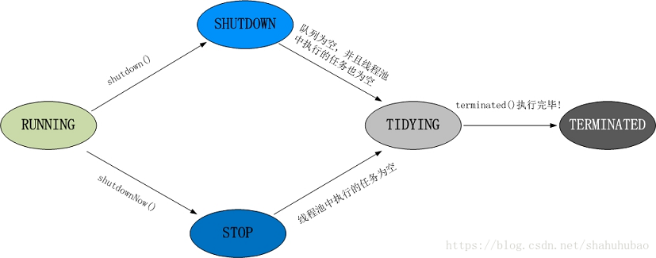

[TOC]


# 线程概念

## 基础概念

> 并行 & 并发

```sh
并行：'同一时刻'处理多个任务。多 CPU 系统可以做到并行
并发：'同一时间段内'处理多个任务，不要求'同时'。单 CPU 系统只能做到并发
```

> 进程 & 线程

```sh
进程：是指一个内存中运行的应用程序，每个进程都有一个独立的内存空间，'一个应用程序可以同时运行多个进程'；
-----进程也是程序的一次执行过程，是系统运行程序的基本单位；系统运行一个程序即是一个进程从创建、运行到消亡的过程。

线程：进程内部的一个独立执行单元；'一个进程可以同时并发的运行多个线程'，可以理解为一个进程便相当于一个单 CPU 操作系统，
-----而线程便是这个系统中运行的多个任务。
```

> 线程创建

```java
extends Thread     ：'不推荐使用'。单继承，多实现     //每个线程执行自己的 run()方法（Thread implements Runnable）
implements Runnable：'推荐使用'，作为参数传入 Thread。//多个.......同一个 run()...
implements Callable：有返回值的任务
```

```java
FutureTask<Object> futureTask = new FutureTask<Object>(() -> "SUCCESS"); //Future：未来结果，代表线程任务执行结束后的返回结果
new Thread(futureTask).start();
Object res = futureTask.get(); //获取结果，默认一直等待，直到任务结束
```

```sh
#Runnable 比 Thread 具有的优势
多个线程共享同一个 run()方法，共同操作同一份资源
可以避免java中的单继承的局限性
增加程序的健壮性，实现解耦操作，代码可以被多个线程共享，代码和数据独立
线程池只能放入实现 Runable 或 Callable 类线程，不能直接放入继承Thread的类
```

> 线程调度

```sh
计算机通常只有一个CPU时，在任意时刻只能执行一条计算机指令，每一个进程只有获得CPU的使用权才能执行指令。
所谓多进程并发运行，从宏观上看，其实是各个进程轮流获得CPU的使用权，分别执行各自的任务。

那么,在可运行池中，会有多个线程处于就绪状态等到CPU，JVM就负责了线程的调度。
JVM采用的是'抢占式调度'，没有采用分时调度，因此可以能造成多线程执行结果的的随机性。
```

> 获取线程的返回值

```sh
（1）.主线程阻塞
（2）.线程的 join() 方法
（3）.实现 Callable 接口
```


## 高级概念

> 优先级

```sh
每个线程都有优先级概念，取值范围 [1,10]，默认是'5'。可通过 setPriority() 指定
'子线程的优先级与父线程相同'。即在线程A中创建线程B，则线程B的优先级与线程A相同

#线程的优先级越高，其越容易得到 CPU 资源。但并不是一定能获取到 CPU 资源。
```

> 守护线程

```sh
'守护线程'：是指在程序运行的时候，在后台提供一种通用服务的线程，如gc。（'守护线程中创建的子线程,默认也是守护线程'）
'非.....'：也叫用户线程，是由用户创建的。主线程也是非守护线程，默认优先级'5'。

#非守护线程执行完毕，则jvm退出，此时守护线程也会被强制结束。所以，一些重要的任务不该放在守护线程中。
```

```java
public static void main(String[] args) {
    System.out.println("主线程-START");
    daemonThreadTest(); //启动 守护线程
    TimeUnit.SECONDS.sleep(3);
    System.out.println("主线程-END!");
}

public static void daemonThreadTest() {
    Thread daemonThread = new Thread(() -> {
        for (int i = 0; i < 5; i++) {
            System.out.println(Thread.currentThread().getName() + "打印: " + i);
            TimeUnit.SECONDS.sleep(1);
        }
    }, "守护线程");

    daemonThread.setDaemon(true); //设置线程为守护线程，在 start() 之前调用。否则抛异常
    daemonThread.start();
}
```

```sh
#主线程   -> 休眠 3 秒后结束
#守护线程 -> 每隔 1 秒打印一次，共打印 5 次

主线程-START       主线程-START       主线程-START 
守护线程打印: 0     守护线程打印: 0     守护线程打印: 0
守护线程打印: 1     守护线程打印: 1     守护线程打印: 1
守护线程打印: 2     守护线程打印: 2     守护线程打印: 2
主线程-END!        守护线程打印: 3     主线程-END!
                  主线程-END!        守护线程打印: 3
```

```sh
#为什么守护线程没有打印 5 次？
主线程是非守护线程，非守护线程执行完毕，jvm退出。此时，守护线程也强制结束。所以，一些重要的任务不应该放在守护线程中完成。
```

```sh
#为什么后两个运行结果守护线程会多打印一次 i 值？
这其实是由线程调度引起的。
刨去守护线程中的打印耗时，可以近似的理解：在程序运行的第 3 秒，主线程和守护线程都从'休眠状态转化为就绪状态'，
此时，如果'线程调度器'先调度主线程，则出现第（1）和第（3）种结果；如果先调度守护线程，则出现第（2）种结果。

#第（3）种结果比较特殊：线程调度器先调度主线程，jvm退出，但退出相对缓慢，线程调度器又调度了1次守护线程。
```


## 常用API

> 线程T2调用T1线程的`join()`方法，导致T2挂起，挂起指定时间（有参）或直至T1执行完毕（无参），才继续执行T2。

```java
Thread t1 = new Thread(() -> {
    System.out.println(LocalTime.now() + " Thread-T1");
    TimeUnit.SECONDS.sleep(2);
});

Thread t2 = new Thread(() -> {
    t1.join(1000); //等待，最大等待时间1000ms
    System.out.println(LocalTime.now() + " Thread-T2");
    TimeUnit.SECONDS.sleep(2);
});

Thread t3 = new Thread(() -> {
    t2.join(); //等待，直到线程t1终止
    System.out.println(LocalTime.now() + " Thread-T3");
});

t1.start();
t2.start();
t3.start();
System.out.println(LocalTime.now() + " main");
```

```sh
09:19:27.880 - main      #主线程和 T1 几乎同时执行
09:19:27.883 - Thread-T1
09:19:28.983 - Thread-T2 #等待1s（只等待T1执行1s）
09:19:30.983 - Thread-T3 #等待2s（等待T2执行完毕）
```

> 如果线程被创建了，但还未启动，调用它的 `join()` 方法是没有作用的！

```java
Thread thread = new Thread(() -> TimeUnit.SECONDS.sleep(2));
System.out.println(LocalTime.now() + " " + " 111");

thread.join(); //线程还未启动
System.out.println(LocalTime.now() + " " + " 222");

thread.start(); //线程启动
thread.join();
System.out.println(LocalTime.now() + " " + " 333");
```

```sh
10:00:16.611  111
10:00:16.611  222 #子线程未启动，调用子线程的 join() 不会挂起主线程
10:00:18.616  333 #启动后，则会挂起
```

>`join() + synchronized`

```java
Thread thread = new Thread(() -> {
    synchronized (Thread.currentThread()) {
        TimeUnit.SECONDS.sleep(5);
    }
});
thread.start();
System.out.println(LocalTime.now() + " Main Start");

thread.join(1000);
System.out.println(LocalTime.now() + " Main Finished");
```

```sh
11:10:27.522 Main Start
11:10:32.433 Main Finished #相隔 5s，而非join()设置的 1s

#由于先调用了 thread.start()方法，线程进入 synchronized 代码段
#main线程等待 1 秒以后，还是得不到线程 thread 的对象锁，只能继续等待，直到线程 thread 结束，释放锁。
```

>线程谦让`yield()`

```sh
t2 调用 Thread.yield(); 是提示线程调度器让出 t2 的CPU资源，让其他线程使用。
'这只是一种提示'，线程调度器可以忽略这种提示，所以 CPU 资源是否让出并不是一定的，是有一定概率的。
#注意：成功让出后，t2 进入就绪状态，而非阻塞状态。
```

```java
new Thread(() -> {
    while (true) {
        System.out.println("子线程 - 正在占用CPU");
        Thread.yield(); //请求线程调度器让出当前线程的 CPU 资源
    }
}).start();

for (; ; ) {
    System.out.println("主线程 - 正在占用CPU");
    Thread.yield();
}
```

```sh
主线程 - 正在占用CPU #主线程调用 yield(); 是一定概率的让出CPU资源，但不是一定让出
主线程 - 正在占用CPU
子线程 - 正在占用CPU
```

> 其他API

```java
// 让调用这个方法的线程让出 CPU，休眠参数指定的毫秒数
// 休眠完成之后，线程并不会直接获得 CPU 资源，而是进入就绪状态，等待线程调度器的调度来获取 CPU 资源
Thread.sleep(long millis);
```

```java
// 让调用这个方法的线程陷入等待状态，可以通过参数设置等待时间，如果不设置参数将使得线程一直等待
// 注意：这个方法只能在 synchronized 关键字修饰的代码块中调用
Object.wait();
```

```java
// 唤醒一个因调用当前对象的 wait() 方法而陷入等待状态的线程，具体哪个线程未知
// 法也只能在 synchronized 关键字修饰的代码块中执行
Object.notify();
```

```java
// 唤醒所有因调用当前对象的 wait() 方法而陷入等待状态的线程
// 同样，这个方法也只能在 synchronized 关键字修饰的代码块中执行
Object.notifyAll();
```


# 线程状态

## 生命周期

> 五种状态

```sh
'新生状态'：线程对象创建后，即处于新生状态。处于新生状态的线程有自己的内存空间，调用 start() 方法，线程进入就绪状态。

'就绪状态'：就绪状态的线程处于线程就绪队列中，等待系统为其分配CPU。当系统为其分配了CPU资源后，线程进入运行状态。

'运行状态'：执行 run() 方法体代码，直到等待某资源而阻塞 或 完成任务而死亡。
----------如果在给定的时间片内没有执行结束，就会被系统给换下来回到就绪状态，等待下一次线程调度器的调度。

'阻塞状态'：处于运行状态的线程，如果调用了 sleep() 方法 或 等待IO设备等资源，则会主动让出CPU，进入阻塞状态。
----------当阻塞原因消除时，如 sleep 时间已到 或 等待的IO设备空闲下来，'阻塞线程便转为就绪状态，而不是转为运行状态'。

'死亡状态'：死亡状态是线程生命周期中的最后一个阶段。线程死亡的原因有三个。
----------（1）.线程被强制性地终止，如通过执行 stop() 来终止一个线程【不推荐使用】
----------（2）.线程代码正常的执行完毕
----------（3）.线程代码抛出未捕获的异常

NEW -> RUNNABLE -> BLOCKED -> WAITING -> TIMED_WAITING -> TERMINATED
```


## 阻塞状态

> 三类阻塞状态

```sh
'TIMED_WAITING'：计时等待。与资源锁无关，线程睡眠到期自动苏醒，并返回到就绪状态。如：sleep(n); wait(n); join(n);

'WAITING'      ：无限等待。运行中的线程调用了某个对象的 wait() 就会转化为 'WAITING' 无限等待状态

'BLOCKED'      ：锁阻塞。线程A，B使用同一锁，如果线程A获取到锁进入到运行状态，那么线程B就进入到 'BLOCKED' 锁阻塞状态。
```

```sh
对于A，B两个线程，如果A线程在运行状态中调用了 wait()，那么A线程就进入 'WAITING' 状态，同时失去了同步锁。
假如，这个时候B线程获取到了同步锁，在运行状态中调用了 notify()，那么就会将处于 'WAITING' 状态的A线程唤醒。
注意只是唤醒，如果A线程获取到了锁对象，那么A线程唤醒后就进入就绪状态；如果没有获取锁对象，那么就进入到 'BLOCKED' 状态。
```


## 线程退出

> `官方推荐`：变量标记

```java
public void run() {
    boolean isFinish = false; //记录线程任务是否完成

    while (!isFinish) {
        if (/*任务完成*/) {
            isFinish = true; //或者 break;
        }
        // do something ...
    }
}
```

>中断标识

```java
public void run() {
    while (!Thread.currentThread().isInterrupted()) {//当前线程的中断标识
        if (/*任务完成*/) {
            Thread.currentThread().interrupt(); //实例方法，将线程的中断标识设为 true
        }
        // do something ...
    }
}
```

> `弊端`：中断标识

```sh
中断标识 本身不会影响线程的执行，但是和其他方法混用时，就有可能影响线程的执行。
例如，和 sleep() 混用，如果当前线程处于中断状态，再调用 sleep() 方法后，不仅会抛出异常，而且还会打断当前线程的中断状态。
```

```java
new Thread(() -> {
    for (int i = 0; !Thread.currentThread().isInterrupted() && i < 3; i++) {
        if (i > 0) {
            Thread.currentThread().interrupt(); //大于0，中断标识设为 true
        }
        System.out.println(LocalTime.now() + " - " + i);
        try {
            Thread.sleep(1000);
        } catch (InterruptedException e) {
            System.out.println(LocalTime.now() + " - " + e.getMessage());
        }
    }
}).start();
```

```sh
20:46:30.274 - 0
20:46:31.275 - 1
20:46:31.275 - sleep interrupted #中断线程-调用 sleep()，不仅会抛出异常，而且不再 sleep，不再 中断
20:46:31.275 - 2
20:46:31.275 - sleep interrupted
```


# 线程安全

## 线程同步

> 什么是线程安全

```sh

```

> 产生原因

```sh
线程安全问题都是由'全局变量、静态的全局变量'引起的。
若每个线程中对 全局变量、静态的全局变量 '只有读操作'，而无写操作，一般来说，这个全局变量是线程安全的；
若有'多个线程同时执行写操作'，一般都需要考虑线程同步，否则的话就可能影响线程安全。
```

> 锁对象

```sh
锁对象可以是任意类型，推荐使用'共享资源'作为锁对象。多个线程要使用同一把锁。
#在任何时候，最多允许一个线程拥有同步锁，谁拿到锁就进入代码块，其他的线程只能在外等着。
```

```java
public synchronized void method(){ }; //锁对象：调用这个同步方法的那个对象。
```

```java
public void method(){
    synchronized(obj){ } //锁对象：obj对象
}
```

```java
public static synchronized void method(){ }; //锁对象：当前方法所在类的字节码对象（类名.class）
```

> 释放锁

```sh
#释放锁的两种方式
(1).在 synchronized 同步代码块中调用监视器对象的 wait()方法
(2).程序自然离开锁对象的监视的范围（执行完毕，或者抛异常），即离开 synchronized 同步代码块

#不释放锁
(1).方法 notify();只会唤醒其他 wait() 线程，但是不会释放锁资源
(2).方法 sleep()；也不会释放锁资源
```

```java
public static void main(String[] args) throws InterruptedException {
    new Thread(() -> {
        synchronized (ThreadTest.class) { //多线程使用同一资源锁
            System.out.println(LocalTime.now() + " START-1");
            ThreadTest.class.wait();
            System.out.println(LocalTime.now() + " END-1");
        }
    }).start();

    TimeUnit.SECONDS.sleep(2);

    new Thread(() -> {
        synchronized (ThreadTest.class) {
            System.out.println(LocalTime.now() + " START-2");
            ThreadTest.class.notify();

            // int i = 1 / 0; //此处如果抛出异常，则 线程-2 立马释放锁资源，线程-1 也马上开始执行
            TimeUnit.SECONDS.sleep(1);
            System.out.println(LocalTime.now() + " END-2");
        }
    }).start();
}
```

```sh
15:21:41.249 START-1  #线程 1 调用wait()，进入'WAITING'无限等待状态
15:21:43.238 START-2  #线程 2 notify()将 1 唤醒，但是不释放锁，所以 2 继续执行
15:21:44.238 END-2    #线程 2 sleep()也不释放锁
15:21:44.238 END-1    #线程 2 执行完毕，出了同步代码块范围，释放锁，线程 1 得以继续执行
```

> 

```sh

```

## 对象锁

> 同步方法只能阻塞使用`同一锁资源`的同步方法

```java
private void demo2() {
    ThreadTest demo = new ThreadTest();
    new Thread(() -> demo.m20()).start(); //this
    new Thread(() -> demo.m21()).start(); //this
    new Thread(() -> demo.m22()).start(); //非同步方法
    new Thread(() -> demo.m23()).start(); //obj
}
```

```java
synchronized void m20() {
    System.out.println(LocalTime.now() + " START 20");
    TimeUnit.SECONDS.sleep(3);
}

void m21() {
    synchronized (this) {
        System.out.println(LocalTime.now() + " START 21");
        TimeUnit.SECONDS.sleep(3);
    }
}

void m22() {
    System.out.println(LocalTime.now() + " START 22");
    TimeUnit.SECONDS.sleep(3);
}

final Object obj = new Object(); //作为同步资源锁，最好 final

void m22() {
    synchronized (obj) {
        System.out.println(LocalTime.now() + " START 23");
        TimeUnit.SECONDS.sleep(3);
    }
}
```

```sh
19:34:28.482 START 20
19:34:28.482 START 22 #m22 非同步方法 ---> 可以执行，详见下面说明
19:34:28.482 START 23 #m23 和 m20 使用不同的资源锁，所以可同时执行
19:34:31.483 START 21 #m21 和 m20 ...相同.......（this），故 m21 被阻塞

#当一个线程调用一个对象的 synchronize 方法后，其他线程'只能访问该对象的其他非同步方法'，同步方法被锁定，不可调用。
```

> 定义同步代码块时，不要使用`常量`对象作为锁对象

```java
String str0 = "hello", str1 = "hello";

new Thread(() -> {
    synchronized (str0) {
        while (true) System.out.println(Thread.currentThread().toString());
    }
}).start();

new Thread(() -> {
    synchronized (str1) {
        while (true) System.out.println(Thread.currentThread().toString());
    }
}).start();
```

```sh
16:34:05.468 - Thread-01
16:34:06.481 - Thread-01  #只有 Thread-01 执行，Thread-02 没有执行。这说明 2 个线程使用同一个锁对象
16:34:07.481 - Thread-01  #进一步说明，str0 和 str1 是同一个对象
```

> `锁对象的变更`：不会影响同步代码的执行

```java
Object obj = new Object(); //作为同步资源锁，最好 final

private void demo0() throws InterruptedException {
    new Thread(() -> m01(), "Thread-01").start();

    TimeUnit.SECONDS.sleep(2);
    obj = new Object();
    new Thread(() -> m01(), "Thread-02").start();
}
```

```java
private void m01() {
    synchronized (obj1) {
        while (true) {
            System.out.println(LocalTime.now() + " - " + Thread.currentThread().getName());
            TimeUnit.SECONDS.sleep(1);
        }
    }
}
```

```sh
16:20:32.612 - Thread-01
16:20:33.614 - Thread-01
16:20:34.571 - Thread-02  #锁对象的变更，不影响 Thread-01 的执行，其使用的是线程私有内存中锁对象，
16:20:34.614 - Thread-01  #和主内存中的对象无关，即 Thread-01，Thread-02 不是同一个锁对象
```

>同步方法`只能保证当前方法的原子性`，不能保证多个业务方法之间的互相访问的原子性。

```java
private void demo3() throws InterruptedException {
    ThreadTest demo = new ThreadTest();
    for (int i = 0; i < 2000; i++) {
        new Thread(() -> demo.m30()).start();
    }

    demo.m31();
    TimeUnit.SECONDS.sleep(3);
    demo.m31();
}
```

```java
void m30() {
    TimeUnit.MILLISECONDS.sleep(100); //模拟网络等耗时操作
    synchronized (this) { //同步保证原子性
        this.num += 1;
    }
}

void m31() {
    System.out.println(LocalTime.now() + " - " + this.num);
}
```

```sh
09:31:15.751 - 148  #虽然方法 30 在多线程操作时加了锁，但是 31 在 30 未执行完，就执行读操作，所以结果不正确
09:31:18.753 - 2000
```

> `锁重入（1）`：同一个线程，多次调用同步代码，锁定同一个锁对象，可重入。

```java
synchronized void demo4() throws InterruptedException {
    System.out.println(LocalTime.now() + " START 4");
    TimeUnit.SECONDS.sleep(1);
    m40();
    System.out.println(LocalTime.now() + " END 4");
}
```

```java
synchronized void m40() throws InterruptedException {
    System.out.println(LocalTime.now() + " START 40");
    TimeUnit.SECONDS.sleep(1);
    System.out.println(LocalTime.now() + " END 40");
}
```

```sh
09:52:01.011 START 4
09:52:02.014 START 40  #方法 40 和 4 使用的是同一个资源锁。
09:52:03.014 END 40    #同一个线程从 4 进入到 40 不会阻塞，只会在资源锁的标记上 +1
09:52:03.014 END 4     #出了方法 40 同步范围后，在资源锁的标记上 -1，直至减到 0，然后释放资源锁
```

> `锁重入（2）`：同步方法の继承，子类同步方法覆盖父类同步方法。可以指定调用父类的同步方法。

```java
public static void main(String[] args) throws InterruptedException {
    SubThreadDemo threadTest = new SubThreadDemo();
    threadTest.demo5();
}
```

```java
synchronized void demo5() throws InterruptedException {
    System.out.println(LocalTime.now() + " START SUPER");
    TimeUnit.SECONDS.sleep(1);
}

static class SubThreadDemo extends ThreadTest {
    synchronized void demo5() throws InterruptedException { //子类同步方法
        System.out.println(LocalTime.now() + " START SUB");
        super.demo5();
    }
}
```

```sh
11:08:44.986 START SUB
11:08:44.986 START SUPER  #子类同步方法 和 父类的同步方法，使用的都是同一个资源锁
```

## Reentr*

> `ReentrantLock`重入锁，比`synchronized`高，量级较轻

```sh
synchronized 在 JDK1.5 版本开始，尝试优化。到 JDK1.7 版本后，优化效率已经非常好了。在绝对效率上，不比 reentrantLock 差多少。
使用重入锁，'必须必须必须' 手工释放锁标记。一般都是在 finally 代码块中定义释放锁标记的 unlock 方法。
```

> 三个线程交替打印：1-9

```java
public static void main(String[] args) {
    Resource resource = new Resource();
    List<Runnable> runList = new ArrayList<>();
    runList.add(() -> resource.printNnm(resource.first, resource.second));
    runList.add(() -> resource.printNnm(resource.second, resource.third));
    runList.add(() -> resource.printNnm(resource.third, resource.first));

    for (int i = 0; i <= runList.size() - 1; i++) {
        new Thread(runList.get(i), i + 1 + "").start();
    }
}

static class Resource {
    int num = 1; // 初始值
    Lock lock = new ReentrantLock();
    Condition first = lock.newCondition();
    Condition second = lock.newCondition();
    Condition third = lock.newCondition();

    void printNnm(Condition self, Condition next) {
        lock.lock();
        try {
            while (num < 10) {// 打印到9
                System.out.println(Thread.currentThread().getName() + ": " + num++);
                next.signal();
                self.await();
            }
            next.signal(); // 最后一个打印9结束也要唤醒下一个线程，保证下一个线程不在阻塞状态
        } catch (Exception e) {
            e.printStackTrace();
        } finally {
            lock.unlock();
        }
    }
}
```


## volatile


> 线程的`私有工作内存`和`主内存`之间的联系

```sh
#线程私有工作内存 类比于 CPU和主内存之间的高速缓存，特点：读写速度比内存快，接近于CPU的速度。

Java 线程只能对其私有工作内存进行直接的IO读取和写入操作，而不能对主内存进行直接的IO操作。
'主内存对所有的 Java 线程都可见'，即所有的 Java 线程都可以通过其工作内存来间接的修改主内存中的数据。
'线程的工作内存只对其对应的 Java 线程可见'，不同的 Java 线程不共享其工作内存。
```

> 线程修改主内存数据の步骤

```sh
（1）通过工作内存读取主内存中的变量值，并拷贝一份副本
（2）线程修改工作内存中的副本值
（3）工作内存将修改后的结果写入到主内存中
```

> volatile `一个轻量级的线程通信`

```sh
'有序性'：对于存在指令重排序的情况，volatile 会禁止部分指令重排序。
'可见性'：多个线程访问同一个变量时，一个线程修改了这个变量的值，这新值对其他线程来说是立即可见的。
#volatile 只能保证对单次读/写的原子性。i++ 这种操作不能保证原子性。
```

> 有序性？？

```sh
根据线程修改内存数据的'3个步骤'，可能出现：Thread-01 在执行完第 (2) 个步骤之后，CPU时间划分给 Thread-02，
即，Thread-01 修改的值没有真正的同步到主内存中，导致 Thread-02 从主内存中读取数据还是修改之前的值。
volitale 关键字提供了一个功能，就是被其修饰的变量在被修改后会被强制刷入到主内存中。
```

> 可见性（1） <https://blog.csdn.net/BryantLmm/article/details/78506352>

```java
volatile boolean flag = false;

private void demo7() throws InterruptedException {
    new Thread(() -> {
        System.out.println(LocalTime.now() + " START");
        while (!flag) { }
        System.out.println(LocalTime.now() + " END");
    }).start();

    TimeUnit.SECONDS.sleep(1);
    flag = true;
}

11:49:56.659 START;  //不写 volatile，则while()循环一直执行，每次使用的都是线程私有内存中的值
11:49:57.764 END    //加上 volatile，则会终止循环，因为每次使用都会获取最新的值
```

```sh
#多线程访问共享变量，以下两种情况（脏读、不可重复读）会引发线程安全问题：
(1).线程1 读取共享变量到'私有工作内存'，更改共享变量的值（还未刷新到主内存）。
此时，CPU时间片切换到 线程2，线程2 读取共享变量。这样，线程2 使用的共享变量就不是 线程1 更改后的值，即不是最新值

(2).线程1 读取共享变量到'私有工作内存'。此时，CPU时间片切换到 线程2，线程2 读取并更改共享变量（刷新到主内存）。
然后，CPU时间片又切换到 线程1，线程1 直接使用'私有工作内存'中的共享变量值。
这样，线程1 使用的共享变量就不是线程2 更改后的值，即不是最新值
```

```sh
当'写'一个 volatile 变量时，JMM 会将'线程私有工作内存'中对应的共享变量值立即刷新到'主内存'中。
当'读'一个 volatile 变量时，JMM 会将'线程私有工作内存'中存储的变量值置为无效，线程接下来将从'主内存'中读取共享变量。

#volatile变量与非volatile变量的区别
volatile变量：  每次读都需要去主内存读取最新的值，每次写也需要写回到主内存。
非volatile变量：允许在缓存中读写以加快计算速度。

使用volatile的好处是不必担心在多线程的环境下，不同线程之间共享某些数据的时候出现'数据更新不及时'。
注意，这里只是说对于 volatile 变量，每个线程在读写的时候的操作对象是主内存（而非各种缓存设备中该变量的拷贝），而不是简单使用 volatile 就能够保证绝对的线程安全。
#volatile 只能保证使用的变量值是最新的，但不能保证变量在多线程中的线程安全。
```

> 原子性：不能保证

```java
volatile int sum;

private void demo88() throws InterruptedException {
    Runnable task = () -> {
        for (int j = 0; j < 1000; j++) sum++;
    };

    Thread t1 = new Thread(task);
    Thread t2 = new Thread(task);
    t1.start();
    t2.start();
    t1.join();
    t2.join(); //依次调用 t1，t2 的join()方法，即在 t1，t2 执行完之后再执行 sout
    System.out.println(LocalTime.now() + " - " + sum);
}
```

```java
static volatile int sum;

private static void demo66() throws InterruptedException {
    CountDownLatch latch = new CountDownLatch(2);
    // CyclicBarrier barrier = new CyclicBarrier(2);
    Runnable task = () -> {
        for (int j = 0; j < 1000; j++) sum++;
        latch.countDown();
        // barrier.isBroken();
    };
    new Thread(task).start();
    new Thread(task).start();
    latch.await(); //异步转同步
    System.out.println(LocalTime.now() + " - " + sum);
}

20:56:14.149 - 1554 //volatile 只能保证 sum 在各个线程中使用时，都是最新的值，但不能保证原子性
```

##Atomic*

> 原子操作类型。其中的每个方法都是原子操作。可以保证线程安全

```java
AtomicInteger atomicSum = new AtomicInteger(0);

Runnable task = () -> {
    for (int i = 0; i < 1000; i++) {
        atomicSum.incrementAndGet(); //自增操作，线程安全，勿需加锁
    }
};
```

```java
int demoSum = 0;

Runnable task = () -> {
    for (int i = 0; i < 1000; i++) {
        synchronized (this) { //非线程安全，得加锁
            demoSum++;
        }
    }
};
```

> `注意`：原子类型中的方法是保证了原子操作，但多个方法之间是没有原子性的

```java
//get()方法 和 incrementAndGet()方法都是原子操作。但复合使用时，无法保证原子性，仍旧可能出现数据错误
AtomicInteger atomicNum = new AtomicInteger(0);
if (atomicNum.get() != 5) {
    atomicNum.incrementAndGet();
}
```


# 线程池

##基础概念

> 基本概念

```sh
#一个可以容纳多个线程的容器，其中的线程可以反复使用，省去了频繁创建和销毁线程的系统开销
'限定个数'。限定线程的个数，不会导致由于线程过多导致系统运行缓慢或崩溃。
'复用线程'。线程池不需要每次都去创建或销毁，节约了资源。
'加快响应'。线程池不需要每次都去创建，响应时间更快。
```

> VS 线程组

```sh
# 线程组 中不仅可以包含线程，也可以包含线程组
'线程池'：为了在子线程中处理大量的任务，同时又避免频繁的创建和销毁线程带来的系统资源开销而产生的
'线程组'：为了方便和统一多个线程的管理而产生的
```

```sh
注意：当新建一个 线程/线程组 之后，如果没有指定父线程组，默认会将'当前线程所属的父线程组'作为父线程组
同时，一个线程只有调用了其 start() 之后，其才真正算是被添加到了对应的线程组中
```

> 生命周期

```sh
线程池是一个进程级的重量级资源。默认生命周期和 jvm 一致。即从开启线程池开始，到 jvm 关闭为止。
如果手工调用 shutdown()，那么线程池执行所有的任务后，自动关闭。
```

> 线程池初始化

```sh
默认，线程池创建之后，池中是没有线程的，需要接收任务之后才会创建线程。如果需要预创建线程，可通过以下两个方法实现。

prestartCoreThread();     #初始化  1   个核心线程
prestartAllCoreThreads(); #初始化 core 个核心线程
```

> 线程池关闭

```sh
shutdown();    #不再接受新的任务，处理队列任务，以及当前任务
shutdownNow(); #.............，不处理队列任务，并尝试中断正在执行的任务线程
```

## 生命周期

> 五种状态

```java
public class ThreadPoolExecutor extends AbstractExecutorService {
    volatile int runState; //线程池的状态，volatile 保证线程之间的可见性
    private static final int RUNNING    = -1 << COUNT_BITS;
    private static final int SHUTDOWN   =  0 << COUNT_BITS;
    private static final int STOP       =  1 << COUNT_BITS;
    private static final int TIDYING    =  2 << COUNT_BITS;
    private static final int TERMINATED =  3 << COUNT_BITS;
}
```



>RUNNING

```sh
'状态说明'：线程池处在 RUNNING 状态时，能够接收新任务，以及对已添加的任务进行处理。
'状态切换'：线程池的初始化状态是 RUNNING。换句话说，线程池被一旦被创建，就处于 RUNNING 状态！
```

```java
//道理很简单，在ctl的初始化代码中(如下)，就将它初始化为 RUNNING 状态，并且"任务数量"初始化为0。
private final AtomicInteger ctl = new AtomicInteger(ctlOf(RUNNING, 0));
```

>SHUTDOWN

```sh
'状态说明'：线程池处在 SHUTDOWN 状态时，不接收新任务，但能处理已添加的任务。
'状态切换'：调用线程池的 'shutdown()' 方法时，线程池由 'RUNNING -> SHUTDOWN'。
```

>STOP

```sh
'状态说明'：线程池处在 STOP 状态时，不接收新任务，不处理已添加的任务，并且会中断正在处理的任务。
'状态切换'：调用线程池的 'shutdownNow()' 方法时，线程池由'(RUNNING or SHUTDOWN ) -> STOP'。
```

> TIDYING（整理状态）

```sh
'状态说明'：当所有的任务已终止，ctl记录的"任务数量"为0，线程池会变为 TIDYING 状态。此状态会执行钩子函数 terminated()。
--------terminated()在 ThreadPoolExecutor 类中是空的，若用户想在线程池变为TIDYING时，进行相应的处理，可重载此方法。

'状态切换'：当线程池在SHUTDOWN状态下，阻塞队列为空并且线程池中执行的任务也为空时，就会由'SHUTDOWN -> TIDYING'。
--------当线程池在STOP状态下，线程池中执行的任务为空时，就会由'STOP -> TIDYING'。
```

> TERMINATED

```sh
'状态说明'：线程池彻底终止，就变成 TERMINATED 状态。
'状态切换'：线程池处在 TIDYING 状态时，执行完 terminated ()之后，就会由'TIDYING -> TERMINATED'。
```

## 高级概念

>核心参数

```java
public ThreadPoolExecutor(int corePoolSize, int maximumPoolSize, long keepAliveTime, TimeUnit unit,
                          BlockingQueue<Runnable> workQueue, ThreadFactory threadFactory, RejectedExecutionHandler handler);
```

```sh
'corePoolSize'：线程池中的核心线程数。
默认，线程池创建后池中线程总数为 0，只有在有任务提交到线程池中时才会创建线程。当然，也可以预创建线程。

每次新来一个任务，会创建一个线程去执行，直到 poolSize = corePoolSize
当'poolSize > corePoolSize'时，新提交的任务会被放进任务缓存队列 queue
```

```sh
'maximumPoolSize'：线程池中允许创建的最大线程数
表示在线程池中最多能创建多少个线程，非核心线程数 = maximumPoolSize - corePoolSize
```

```sh
'keepAliveTime'：线程池中【非核心线程】允许闲置的最大时间，超过这个时间将会被回收
----------------对于任务很多，并且每个任务处理时间较短的的情况，可以适当增大这个参数来提高线程利用率。
----------------当设置 allowCoreThreadTimeOut(true) 时，此参数也会作用到核心线程上，即 corePoolSize 也会被回收。
```

```sh
'workQueue'：存储任务的缓存队列（线程安全），用于提交和存储待处理的任务

(1).poolSize <  corePoolSize，添加新线程
(2).poolSize >= corePoolSize，将请求加入缓冲队列
(3).poolSize <  maximumPoolSize，缓冲队列已满，则扩充 corePoolSize 至 maximumPoolSize
(4).poolSize >= maximumPoolSize，请求无法加入缓冲队列，任务将被拒绝
```

```sh
'threadFactory'：线程工厂，主要用来创建线程
```

```sh
'handler'：任务拒绝策略。以下两种情况，会触发：
----------(1).等待队列已满 && poolSize = maximumPoolSize
----------(2).调用 shutdown()，会等待线程池里的任务执行完毕，才真正 SHUTDOWN。在等待间，会拒绝新任务
```

> 任务拒绝策略

```java
private static void testPolicy() {
    // ThreadFactory threadFactory = Executors.defaultThreadFactory();
    ThreadFactory threadFactory = new BasicThreadFactory.Builder().namingPattern("demo-pool-%d").build();
    ExecutorService threadPool = new ThreadPoolExecutor(
        2, 5, 1L, TimeUnit.SECONDS, new LinkedBlockingQueue<>(3), threadFactory,
        // new ThreadPoolExecutor.AbortPolicy()) //默认策略。抛出异常，丢弃最新的任务（9、10）。丢弃任务无法再次执行
        // new ThreadPoolExecutor.DiscardPolicy());       //不抛异常，丢弃最新的任务（9、10）。丢弃任务同上
        // new ThreadPoolExecutor.DiscardOldestPolicy()); //不抛异常，丢弃最旧的任务（3、4）。丢弃任务同上
        new ThreadPoolExecutor.CallerRunsPolicy());       //不抛异常，丢弃最新的任务（9、10）。丢弃任务将在调用线程中执行，如，main线程

    for (int i = 1; i <= 10; i++) {
        int index = i;
        threadPool.execute(() -> System.out.println(Thread.currentThread().getName() + " 任务ing " + index));
    }
    threadPool.shutdown();
}
```

> 核心方法

```java
public class ThreadPoolExecutor 
    extends [AbstractExecutorService implements (ExecutorService extends Executor)] {

    // 向线程池提交一个任务，交由线程池去执行
    execute();

    // 也是用来向线程池提交任务的，但和 execute() 不同，它能够返回任务执行的结果
    // 底层还是调用 execute()，只不过利用了 Future 来获取任务执行结果
    submit();

    //关闭线程池。不会接收新的任务，但会处理缓存队列中的任务，以及当前正在执行的任务。
    void shutdown();

    //立刻关闭线程池。即不会接收新的任务，也不处理缓存队列中的任务，甚至还会尝试中断正在执行的任务
    //返回结果为 阻塞列表中未被执行的任务
    List<Runnable> shutdownNow();
}
```

> 线程池扩充

```sh
'poolSize = 0'：默认，线程池创建之后，池中是没有线程，需要接收任务之后才会创建线程
'poolSize < corePoolSize'：新来任务，就会创建一个新的线程去执行
'poolSize > corePoolSize && 缓存队列未满'：新来任务，尝试将其添加到缓存队列当中，等待空闲线程将其取出去执行

'poolSize > corePoolSize && 缓存队列已满 && poolSize < maximumPoolSize'：
----------新来任务，缓存队列已满，则会尝试创建新的线程（即扩充 corePoolSize）去执行这个任务

'poolSize > corePoolSize && 缓存队列已满 && poolSize = maximumPoolSize'：
----------新来任务，缓存队列已满，corePoolSize 已扩充至 maximumPoolSize，则会采取'任务拒绝策略'进行处理
```

```sh
当高峰期已过，如果某线程空闲时间超过 keepAliveTime，线程将被终止，直至 poolSize <= corePoolSize。
如果设置了 allowCoreThreadTimeOut(true)，那么核心线程也会被终止（默认不会），直至 poolSize = 0。
```

> 举个栗子：corePoolSize = 10，maximumPoolSize = (10+5)

```sh
假如有一个工厂，工厂里面有 10 个工人，每个工人同时只能做一件任务。
因此，只要当10个工人中有工人是空闲的，来了任务就分配给空闲的工人做。当10个工人都有任务在做时，如果还来了任务，就把任务进行排队等待。
如果新任务增长的速度远大于工人做任务的速度，那么此时工厂主管可能会想补救措施，如再招 5 个临时工人，然后就将任务也分配给这 5 个临时工人做
如果说 （10+5） 个工人做任务的速度还是不够，此时工厂主管可能就要考虑不再接收新的任务或者抛弃前面的一些任务了

当这 （10+5） 个工人中有人空闲时，而新任务增长的速度又比较缓慢，工厂主管可辞掉 5 个临时工。只保持原来的10个工人，毕竟请额外的工人是要花钱
```

## 基本使用

> JDK 内置的 4 种线程池

```java
//(1).单例线程池：只用一个核心线程来处理任务，适用于有序执行任务
public static ExecutorService newSingleThreadExecutor() {
    return new FinalizableDelegatedExecutorService
        (new ThreadPoolExecutor(1, 1, 0L, TimeUnit.MILLISECONDS, new LinkedBlockingQueue<Runnable>())); //queue MAX
}
```

```java
//(2).固定线程池：核心线程数和最大线程数相同，不存在非核心线程。处理一个无限队列
public static ExecutorService newFixedThreadPool(int nThreads) {
    return new ThreadPoolExecutor(nThreads, nThreads, 0L, TimeUnit.MILLISECONDS, new LinkedBlockingQueue<Runnable>()); //queue MAX
}
```

```java
//(3).缓存线程池：不使用核心线程，使用无限大的非核心线程，每个线程的过期时间为 60 秒
//适用于大量需要立即处理，并且每个任务耗时较少的任务集合
public static ExecutorService newCachedThreadPool() {
    return new ThreadPoolExecutor(0, Integer.MAX_VALUE, 60L, TimeUnit.SECONDS, new SynchronousQueue<Runnable>()); //max MAX
}
```

```java
//(4).定时线程池：比Timer更安全，功能更强大。--> 如果有任务执行过程中抛出异常，则会跳出，不会影响下次循环
public static ScheduledExecutorService newScheduledThreadPool(int corePoolSize) {
    return new ScheduledThreadPoolExecutor(corePoolSize, Integer.MAX_VALUE, 0, NANOSECONDS, new DelayedWorkQueue()); //max MAX
}
```

> 内置线程池的弊端

```sh
Single & Fixed    #queue：MAX，容易因请求队列堆积，耗费大量内存，甚至OOM
Cached & Schedule #max  ：MAX，可能会创建非常多的线程，甚至OOM
```

> `ali 推荐`

```java
//org.apache.commons.lang3.concurrent.BasicThreadFactory
ThreadFactory threadFactory = new BasicThreadFactory.Builder().namingPattern("demo-pool-%d").build();
```

```java
//com.google.common.util.concurrent.ThreadFactoryBuilder
ThreadFactory threadFactory = new ThreadFactoryBuilder().setNameFormat("demo-pool-%d").build();
```

```java
//普通任务的线程池
ThreadFactory threadFactory = Executors.defaultThreadFactory(); //默认线程工厂，不能自定义线程名
ExecutorService threadPool = new ThreadPoolExecutor(2, 5, 0L, TimeUnit.MILLISECONDS, new LinkedBlockingQueue<>(3),
                                                    threadFactory, new ThreadPoolExecutor.AbortPolicy());
```

```java
//定时任务的线程池
ScheduledExecutorService threadPool = new ScheduledThreadPoolExecutor(1, threadFactory);
```

##线程异常

> 如何正确处理子线程中的异常？

```sh
子线程中发生了异常，如果没有任何类来接手处理的话，是会直接退出的
所以，不做异常处理，也不记录日志，则会出现子线程任务既没执行成功，也没有任何日志提示的诡异现象
```

```sh
#java中两种异常：编译期异常(CheckedExceptions)，运行时异常(RuntimeExceptions)

'编译期异常'：因为 run()不接受 throws 语句，所以需要手动 try-catch
'运行时异常'：将异常信息记录到日志，然后退出程序。常见的APP崩溃，正是基于这一原理
```

> 异常处理方式（1）：手动 try-catch

>异常处理方式（2）：线程的【局部】异常处理器

>异常处理方式（3）：线程的【全局】异常处理器

```sh
#选择顺序
优先选择，当前线程的【局部】异常处理器（默认没有）
然后选择，当前线程所属'线程组'的局部异常处理器
最后选择，线程的【全局】异常处理器
最后的最后，都没有设置异常处理器，则主线程默默退出
```

```java
Thread.setDefaultUncaughtExceptionHandler(
    (t, e) -> log.info("线程的【全局】异常处理器: {} - {}", t.getName(), e.toString()));

new Thread(() -> {
    Thread.currentThread().setUncaughtExceptionHandler(
        (t, e) -> log.info("线程的【局部】异常处理器: {} - {}", t.getName(), e.toString()));
    int i = 1 / 0;
}).start();

new Thread(() -> System.out.println("aa".split("_")[1])).start();

//线程的【全局】异常处理器: Thread-1 - java.lang.ArrayIndexOutOfBoundsException: 1
//线程的【局部】异常处理器: Thread-0 - java.lang.ArithmeticException: / by zero
```

>异常处理方式（4）：在父线程中捕获异常

```java
ExecutorService executor = Executors.newSingleThreadExecutor();
Future<Object> future = executor.submit(() -> {
    try {
        int i = 1 / 0;
    } catch (Exception e) {
        throw new RuntimeException(e.getMessage()); //抛出异常
    }
    return "SUCCESS";
});

try {
    log.info("res: {}", future.get()); //get 获取结果
} catch (InterruptedException | ExecutionException e) {
    log.error("父线程中捕获异常: {}", e.toString());
    executor.shutdown();
}

//父线程中捕获异常: java.util.concurrent.ExecutionException: java.lang.RuntimeException: / by zero
```

#定时调度

## Timer

> 单线程，串行执行。单个任务异常，整体任务停止

```java
Timer timer = new Timer();
timer.schedule(Task_A, 0, 1 * 1000); //1s执行一次
timer.schedule(Task_B, 2 * 1000, 2 * 1000); //延迟2s，2s执行一次 (完成消耗2s)
timer.schedule(Task_C, 5 * 1000, 5 * 1000); //延迟5s，5s执行一次 (抛出异常)
```

```sh
#最终结果：A A A B A B C(x)
一开始，Task_A 能正常1秒执行一次。
Task_B 启动后，由于 Task_B 完成需要2秒，导致 Task_A 要等到 Task_B 执行完才能执行。
更可怕的是，Task_C 启动后，抛了异常，导致整个定时任务全部挂了！！！
```

```java
Task_A.cancel(); //取消单个任务
timer.cancel();  //取消整体任务
```

##定时线程池

> 并行执行，互不影响。单任务异常，异常任务停止，其他任务不影响

```java
ScheduledExecutorService pool = Executors.newScheduledThreadPool(2);
pool.scheduleWithFixedDelay(Task_A, 0, 1, TimeUnit.SECONDS);
pool.scheduleWithFixedDelay(Task_B, 2, 2, TimeUnit.SECONDS);
pool.scheduleWithFixedDelay(Task_C, 5, 5, TimeUnit.SECONDS); //Task_C 抛出异常后，将停止执行。如若想继续执行，使用 try-catch
```

```sh
#最终结果：A A B A A A C(x) A B A A A A B
Task_B，Task_C 不再影响 Task_A 定时执行
Task_C 抛出异常后，只影响自身不再执行，其他无碍！！！
```

```java
ScheduledFuture<?> future = scheduled.scheduleWithFixedDelay(task1, 1, 1, TimeUnit.SECONDS);
future.cancel(true); //取消单个任务
pool.shutdown();     //取消整体任务
```

> 停止任务时，任务是否已放入任务集map？

```java
private static void scheduledTest() {
    String key = "JOB_KEY";
    final Map<String, Future> futures = new HashMap<>(); //job_map
    LocalTime init = LocalTime.now();
    ScheduledExecutorService pool = Executors.newScheduledThreadPool(5);

    ScheduledFuture<?> future = pool.scheduleWithFixedDelay(() -> {
        if (ChronoUnit.MILLIS.between(init, LocalTime.now()) > 3 * 1000) { //启动3s后，停止任务
            futures.get(key).cancel(true);
            pool.shutdown();
        }
    }, 1, 3, TimeUnit.SECONDS);

    //先于任务执行，即任务执行过程中，future 肯定已放入 Map
    futures.put(key, future);
}
```

## Scheduled

> Spring内置的定时线程池 `（默认使用单例线程池）`

```java
@Scheduled(fixedRate = 6000)  //上一次开始执行时间点之后6秒再执行
@Scheduled(fixedDelay = 6000) //.....执行完毕时间点...........
@Scheduled(initialDelay=1000, fixedRate=6000) //第一次延迟1秒后执行，之后按 fixedRate 的规则每6秒执行一次

@Scheduled(cron = "0/1 * * * * ?")   //详细配置方法执行频率，1s1次
```

```sh
#cron表达式: [秒] [分] [时] [日] [月] [周] [年(可省)]
秒(0~59); 分(0~59); 时(0~23); 日(1~31,和月份有关); 月(1~12); 星期(1~7,1为周日); 年(1970~2099)

* 适用于所有字段。表示对应时间域的'每一个时刻'。如分钟字段，表示每分钟

- 适用于所有字段。表示'一个范围'。如小时字段10-12，表示从10到12点，即 10,11,12

, 适用于所有字段。表示'一个列表值'。如星期字段"MON,WED,FRI"，表示星期一、星期三和星期五

/ 适用于所有字段。表示'一个等步长序列'。x/y表示：x为起始值，y 为增量步长值
  如，分钟字段： 0/15表示 0,15,30,45； 5/15表示 5,20,35,50。'*/y == 0/y'

? 日期和星期字段。通常指定为'无意义的值'，相当于占位符。因为日和星期是有冲突的
```

>配置定时任务的线程池大小

```properties
#线程池大小，默认1
spring.task.scheduling.pool.size=5
#线程名前缀，默认 scheduling-
#spring.task.scheduling.thread-name-prefix=demoscheduling-
```

> 异步任务

```sh

```

##Quartz

> 核心概念

```xml
<dependency>
    <groupId>org.springframework.boot</groupId>
    <artifactId>spring-boot-starter-quartz</artifactId>
</dependency>
```

```sh
Job       #任务      你要做什么事？
Trigger   #触发器    你什么时候去做？
Scheduler #任务调度  你什么时候需要去做什么事？
```

> javaSE

```java
//JOB类必须定义为 public
public class JobDemo implements Job {
    @Override
    public void execute(JobExecutionContext jobExecutionContext) {
        log.info("{} - 任务被触发时调用！", LocalTime.now());
    }
}
```

```java
private static void task01() throws SchedulerException {
    //1.job
    JobDetail job = JobBuilder.newJob(JobDemo.class)
        .withIdentity("job-01", "group-01").build();

    //2.trigger
    // 方式一：通过 Quartz 内置方法来完成简单的重复调用，2秒一次
    Trigger trigger = TriggerBuilder.newTrigger()
        .withSchedule(SimpleScheduleBuilder.repeatSecondlyForever(2)).build();

    //方式二：自定义 Cron 表达式来给定触发的时间
    // Trigger trigger = TriggerBuilder.newTrigger()
    //         .withIdentity("trigger-11", "group-11")
    //         .withSchedule(CronScheduleBuilder.cronSchedule("0/2 * * * * ?")).build();

    //3.scheduler
    Scheduler scheduler = StdSchedulerFactory.getDefaultScheduler();
    scheduler.scheduleJob(job, trigger);
    scheduler.start();
}
```

> SpringBoot（1）：创建普通job类，直接调用。灵活，非侵入

```java
@Slf4j
@Component
public class JobDemo01 {
    @Autowired
    HelloController helloController;

    public void job() {
        String hello = helloController.hello();
        log.info("定时任务执行: {}", hello);
    }
}
```

```java
@Configuration
public class QuartzConfig01 {
    @Bean("job01")
    public MethodInvokingJobDetailFactoryBean job01(JobDemo01 jobDemo01) {
        MethodInvokingJobDetailFactoryBean job = new MethodInvokingJobDetailFactoryBean();
        job.setName("my-job01"); // 任务的名字
        job.setGroup("my"); // 任务的分组
        job.setConcurrent(false); // 是否并发
        job.setTargetObject(jobDemo01); // 被执行的对象
        job.setTargetMethod("job"); // 被执行的方法
        return job;
    }

    @Bean(name = "trigger01")
    public CronTriggerFactoryBean tigger01(@Qualifier("job01") MethodInvokingJobDetailFactoryBean job01) {
        CronTriggerFactoryBean tigger = new CronTriggerFactoryBean();
        tigger.setName("my-tigger01");
        tigger.setJobDetail(Objects.requireNonNull(job01.getObject()));
        tigger.setCronExpression("0/5 * * * * ?"); //cron
        return tigger;
    }

    @Bean(name = "scheduler01")
    public SchedulerFactoryBean scheduler01(@Qualifier("trigger01") Trigger trigger01) {
        SchedulerFactoryBean scheduler = new SchedulerFactoryBean();
        scheduler.setStartupDelay(5); // 延时启动定时任务，避免系统未完全启动却开始执行定时任务的情况
        scheduler.setOverwriteExistingJobs(true); // 覆盖已存在的任务
        scheduler.setTriggers(trigger01); // 注册触发器
        return scheduler;
    }
}
```

> SpringBoot（2）：job继承特定类，实现其方法，方法就是被调度的任务体

```java
@Slf4j
//@Component -> 无需此注解，区别于方式1
public class JobDemo02 extends QuartzJobBean {
    @Override
    protected void executeInternal(JobExecutionContext context) {
        HelloController helloController = (HelloController) context.getMergedJobDataMap().get("helloController");
        String hello = helloController.hello();
        log.info("定时任务执行: {}", hello);
    }
}
```

```java
@Configuration
public class QuartzConfig02 {
    @Autowired
    HelloController helloController;

    @Bean("job02")
    public JobDetailFactoryBean job02() {
        JobDetailFactoryBean job = new JobDetailFactoryBean();
        job.setJobClass(JobDemo02.class);

        Map<String, Object> map = new HashMap<>();
        map.put("helloController", helloController);
        job.setJobDataAsMap(map); //传参 -> helloController
        return job;
    }
    //...同上...
}
```

# 补充知识

## ThreadLocal

>用于`存储线程局部变量`，能够保证相同线程数据共享，不同线程数据隔离

```sh
官方建议，将 ThreadLocal 变量设置为'private static'访问级别。

本质是一个类似 Map 的数据结构，可看作：'Map<当前线程的ThreadLocal对象, 当前线程的局部变量>'
每个线程只能访问到自己的数据，多线程之间互不干扰，可有效防止本线程的变量被其它线程篡改。
一个 ThreadLocal 对象只能存放当前线程的一个局部变量。所以，对多个局部变量需实例化多个 ThreadLocal 对象。
```

```sh
#ThreadLocal 无法解决共享对象的更新问题，ThreadLocal 对象建议使用 static 修饰。
这个变量是针对一个线程内所有操作共享的，所以设置为静态变量，所有此类实例共享此静态变量，也就是说在类第一次被使用时装载，只分配一块存储空间，
所有此类的对象 (只要是这个线程内定义的) 都可以操控这个变量。
```

```sh
ThreadLocal 中的数据不会随着线程结束而回收，必须手动 remove() 防止内存泄露。

操作系统中，线程和进程数量是有上限的，确定线程和进程的唯一条件就是线程或进程id。
操作系统在回收线程或进程的时候，并不一定杀死。系统繁忙时,只会清空其栈内数据，然后重复使用。
所以，对于存储在 ThreadLocal 中的数据，如若不 remove()，则有可能在线程 t2 获取到 t1 的数据。
```

> 用于解决`不同线程间的数据隔离问题`，而不是多线程共享数据问题

```java
private static ThreadLocal<String> threadLocal = ThreadLocal.withInitial(() -> "666"); //设置默认值

class Task implements Runnable {
    Task() {
        threadLocal.set("777"); //【易错处】这里还属于主线程
        System.out.println(Thread.currentThread().getName() + ": " + threadLocal.get()); //sout: main: 777
    }

    @Override
    public void run() {
        System.out.println(Thread.currentThread().getName() + ": " + threadLocal.get()); //sout: Thread-0: 666
    }
}

public static void main(String[] args) {
    new Thread(new ThreadTest().new Task()).start();
}
```

> InheritableThreadLocal

```java
//InheritableThreadLocal extends ThreadLocal，子线程继承父线程的局部变量
private static ThreadLocal<String> threadLocal = InheritableThreadLocal.withInitial(() -> "666");

public static void main(String[] args) {
    threadLocal.set("777");
    System.out.println(Thread.currentThread().getName() + ": " + threadLocal.get()); //sout: main: 777

    //父线程中创建子线程，子线程继承主线程的 ThreadLocal 环境变量
    //此外，子线程的优先级属性 和 是否是守护线程属性 都和父线程相同
    new Thread(() -> System.out.println(Thread.currentThread().getName() + ": " + threadLocal.get())).start(); //Thread-0: 777
}
```

> ThreadLocal底层原理

```java
//Thread 中有个 ThreadLocal.ThreadLocalMap 类型的成员变量 threadLocals
public class Thread implements Runnable {
    ThreadLocal.ThreadLocalMap threadLocals = null;
}
```

```java
public class ThreadLocal<T> {

    //通过 ThreadLocal 对象的set方法，把ThreadLocal对象自己当做key，放进了ThreadLoalMap中。
    public void set(T value) {
        Thread t = Thread.currentThread();
        ThreadLocalMap map = t.threadLocals; // 获取当前线程的 threadLocals 变量
        map.set(this, value);                // key -> ThreadLocal对象自身; value -> 局部变量
    }

    public T get() {
        Thread t = Thread.currentThread();
        ThreadLocalMap map = t.threadLocals;
        return (T)map.get(this);             //key为 this，ThreadLocal对象自身，而不是当前线程t
    }

    //ThreadLocalMap 是 ThreadLocal 的内部类，它是一个类似Map，它的Key是 ThreadLocal 类型对象！
    static class ThreadLocalMap /* <ThreadLocal<?>, Object> //自己加的,便于理解 */ { 
        //...
    }
}
```

## CountDown*

> 基础概念

```sh
多线程通讯的一个辅助类型。相当于在一个门上加多个锁，当线程调用 await() 方法时，会检查门闩数量，如果门闩数量大于 0，线程会阻塞等待。
当线程调用 countDown() 时，会递减门闩的数量。当门闩数量为 0 时，await() 阻塞线程可执行。

由于 countDown() 方法可以用在任何地方，所以这里说的N个点，可以是N个线程，也可以是1个线程里的N个执行步骤。
用在多个线程时，你只需要把这个 CountDownLatch 的引用传递到线程里。
```

> 常用方法

```java
//调用 await() 方法的线程会被挂起，它会等待直到 count 值为 0 才继续执行
public void await() throws InterruptedException { };

//和 await() 类似，只不过等待一定的时间后，count 值还没变为0的话也会继续执行
public boolean await(long timeout, TimeUnit unit) throws InterruptedException { };

//将count值减1
public void countDown() { };
```

> 使用场景

```sh
'开始执行前，等待N个线程完成各自任务'：例如，应用程序启动类要确保在处理用户请求前，所有N个外部系统已经启动和运行了
'实现最大的并行性'：有时想同时启动多个线程，实现最大程度的并行性
'死锁检测'：可以使用N个线程访问共享资源，在每次测试阶段的线程数目是不同的，并尝试产生死锁
```

> 实现最大的并行性

```java
//【不推荐】以下是一般测试的并发代码，但不严谨，所有线程都是顺序创建，并不符合并发（至少在启动那一刻）
for (int i = 0; i < nThreads; i++) {
    pool.execute(() -> doWork());
}
```

```java
public static void doTestWithCountDown() throws InterruptedException {
    List<Integer> list = new ArrayList<>(); //线程安全的 CopyOnWriteArrayList
    int nThreads = 20;
    ExecutorService pool = Executors.newFixedThreadPool(nThreads);

    CountDownLatch begin = new CountDownLatch(1);
    for (int i = 0; i < nThreads; i++) {
        pool.execute(() -> {
            begin.await(); //begin-门栓开启之前，任务不能抢先执行

            for (int j = 0; j < 100; j++) {
                synchronized (RegexTest.class) { 
                    list.add(j);
                }
            }
        });
    }
    begin.countDown(); //所有任务提交完毕，begin-门栓开启

    TimeUnit.SECONDS.sleep(2); //不知道所有线程何时执行完毕，所以加个等待时间
    pool.shutdown();
    System.out.println(list.size());
}
```

> 异步转同步

```java
public static void doTestWithCountDown() throws InterruptedException {
    List<Integer> list = new ArrayList<>(); //线程安全的 CopyOnWriteArrayList
    int nThreads = 20;
    ExecutorService pool = Executors.newFixedThreadPool(nThreads);
    CountDownLatch end = new CountDownLatch(nThreads); //预定义 20 个 end-门栓

    for (int i = 0; i < nThreads; i++) {
        pool.execute(() -> {
            for (int j = 0; j < 100; j++) {
                synchronized (RegexTest.class) {
                    list.add(j);
                }
            }
            end.countDown(); //一个线程执行完毕，去掉一个 end-门栓
        });
    }
    end.await();       //end-门栓 开启完毕，即20个线程都已执行完毕

    // TimeUnit.SECONDS.sleep(2); //不需要延时等待【区别于上面的例子】
    pool.shutdown();
    System.out.println(list.size());
}
```

```sh
#启动20个线程往 ArrayList 里增加数据，每个线程增加100个，最后输出这个集合的长度
如果 ArrayList 线程安全，最后结果应该是2000，但并不安全，所以结果应该是：'小于2000 或 出现下标越界'
```

> 写两个线程，线程1添加10个元素到容器中，线程2实现监控元素的个数，当个数到5个时，线程2给出提示并结束

```java
private static void doTestWithCountDown() {
    List<Object> list = new ArrayList<>();
    CountDownLatch countDownLatch = new CountDownLatch(5);
    new Thread(() -> {
        for (int i = 0; i < 10; i++) {
            list.add(i);
            countDownLatch.countDown();
            TimeUnit.MILLISECONDS.sleep(100); //自增执行速度过快，必须保证门栓通讯完再做下一次自增。所以，自增之前需做延时处理
        }
    }).start();

    new Thread(() -> {
        countDownLatch.await();
        System.out.println(LocalTime.now() + " 结束：" + list.size());
    }).start();
}
```

##CyclicBarrier

<https://www.jianshu.com/p/9262361a1200>

## ForkJoinPool

> 分支合并线程池

```sh
分支合并线程池（mapduce 类似的设计思想）。可以递归完成复杂任务。

要求可分支合并的任务必须是 ForkJoinTask 类型的子类型。ForkJoinTask 类型提供了两个抽象子类型：
'RecursiveTask'有返回结果的分支合并任务，'RecursiveAction'无返回结果的分支合并任务。
（Callable / Runnable）compute 方法：就是任务的执行逻辑。

ForkJoinPool 没有所谓的容量。默认都是 1 个线程，初始化线程容量与 CPU 核心数相关。根据任务自动的分支新的子线程。
当子线程任务结束后，自动合并。所谓自动是根据 fork 和 join 两个方法实现的。

应用： 主要是做科学计算或天文计算的。数据分析的。
```

```java
final static int[] NUMBERS = new int[1000000]; //100w个随机数
final static int MAX_SIZE = 50000;
final static Random RANDOM = new Random();

static {
    for (int i = 0; i < NUMBERS.length; i++) {
        NUMBERS[i] = RANDOM.nextInt(1000);
    }
}

static class AddTask extends RecursiveTask<Long> { // RecursiveAction
    int begin, end;

    public AddTask(int begin, int end) {
        this.begin = begin;
        this.end = end;
    }

    protected Long compute() {
        if ((end - begin) < MAX_SIZE) {
            long sum = 0L;
            for (int i = begin; i < end; i++) {
                sum += NUMBERS[i];
            }
            return sum;
        } else {
            int middle = begin + (end - begin) / 2;
            AddTask task1 = new AddTask(begin, middle);
            AddTask task2 = new AddTask(middle, end);
            task1.fork();// 就是用于开启新的任务的。 就是分支工作的。 就是开启一个新的线程任务。
            task2.fork();
            // join - 合并。将任务的结果获取。 这是一个阻塞方法。一定会得到结果数据。
            return task1.join() + task2.join();
        }
    }
}

public static void main(String[] args) throws InterruptedException, ExecutionException, IOException {
    long start = System.currentTimeMillis();
    long result = 0L;
    for (int i = 0; i < NUMBERS.length; i++) {
        result += NUMBERS[i];
    }
    System.out.println(result + " - " + (System.currentTimeMillis() - start));

    ForkJoinPool pool = new ForkJoinPool();
    start = System.currentTimeMillis();
    AddTask task = new AddTask(0, NUMBERS.length);

    Future<Long> future = pool.submit(task);
    System.out.println(future.get() + " - " + (System.currentTimeMillis() - start));
}
```


#常见问题

## 基础概念

> 三个线程顺序执行

```java
//使用【单例线程池】
Runnable task01 = () -> System.out.println(LocalDateTime.now() + " Thread-T1");
Runnable task02 = () -> System.out.println(LocalDateTime.now() + " Thread-T2");
Runnable task03 = () -> System.out.println(LocalDateTime.now() + " Thread-T3");

ExecutorService pool = Executors.newSingleThreadExecutor();
pool.execute(task01);
pool.execute(task02);
pool.execute(task03); //任务启动顺序 和 提交顺序一致：1-2-3
pool.shutdown();
```

```java
//使用【join】方法
Thread t1 = new Thread(() -> {
    System.out.println(LocalDateTime.now() + " Thread-T1");
});

Thread t2 = new Thread(() -> {
    t1.join(); //等待，直到线程 t1 终止
    System.out.println(LocalDateTime.now() + " Thread-T2");
});

Thread t3 = new Thread(() -> {
    t2.join(); //等待，直到线程 t2 终止
    System.out.println(LocalDateTime.now() + " Thread-T3");
});

t3.start();
t2.start();
t1.start(); //无论启动顺序，执行顺序都是：1-2-3
```

> 当缓存队列已满时，新来一个任务，恰好核心线程有一个空闲，哪种情况正确：`（1）`

```sh
（1）.新任务直接在空闲的核心线程中执行
（2）.空闲的核心线程从缓冲队列中获取任务，然后将新任务放入到缓存队列

#正确答案（1）：有空闲的核心线程就直接使用；没有则加入队列（队列未满）或新建线程（队列已满）。以下demo可验证
```

> 线程池最大容量为 4+2，依次添加 7 个任务，怎么执行？

```java
ThreadPoolExecutor executor = new ThreadPoolExecutor(1, 2, 200,  //线程池最大容量 1+2
                                                     TimeUnit.MILLISECONDS, new ArrayBlockingQueue<>(1));
printPoolProperty(executor); //任务开始执行前，获取线程池属性
for (int i = 1; i < 5; i++) {
    int taskNum = i;
    try {
        executor.submit(() -> {
            System.out.println(LocalTime.now() + " - " + Thread.currentThread().getName() + " START " + taskNum);
            TimeUnit.SECONDS.sleep(1);
        });
        printPoolProperty(executor); //任务添加后，获取线程池属性
    } catch (Exception e) {
        log.error("任务执行异常: {}", e.toString());
    }
}

Thread.sleep(2 * 1000);
printPoolProperty(executor); //所有任务执行完毕后，获取线程池属性
executor.shutdown();
```

```sh
11:10:55.354 - poolSize: 0; queueSize: 0; completedTask: 0 #初始状态

11:10:55.356 - poolSize: 1; queueSize: 0; completedTask: 0 #Task-1.（poolSize = core）
11:10:55.356 - poolSize: 1; queueSize: 1; completedTask: 0 #Task-2.（queue 已满）
11:10:55.356 - poolSize: 2; queueSize: 1; completedTask: 0 #Task-3.（扩充 poolSize = max）
11:10:55.358 - 任务执行异常: java.util.concurrent.RejectedExecutionException: #Task-4.（拒绝策略）

11:10:55.356 - pool-1-thread-1 START 1
11:10:55.357 - pool-1-thread-2 START 3 #后提交的 3 先于 2 执行
11:10:56.356 - pool-1-thread-1 START 2

11:11:01.364 - poolSize: 1; queueSize: 0; completedTask: 3 #所有任务完毕后，poolSize = core
```

> 线程池原理

```java
public class MyThreadPool {
    private int nThreads = 5;               //初始线程数
    private TaskThread[] taskThreads;       //工作线程
    private final List<Runnable> taskQueue; //阻塞队列

    private MyThreadPool() {
        taskThreads = new TaskThread[nThreads];
        taskQueue = new CopyOnWriteArrayList<>(); //线程安全的list
        for (int i = 0; i < nThreads; i++) {      //预创建好工作线程
            taskThreads[i] = new TaskThread();
            taskThreads[i].start();
        }
    }

    private static class ThreadHolder {
        private static MyThreadPool pool = new MyThreadPool();
    }

    public static MyThreadPool getInstance() { //单例 --> 静态内部类方式
        return MyThreadPool.ThreadHolder.pool;
    }

    //提交任务 ---> 其实只是把任务加入任务队列，什么时候执行有线程池管理器决定
    public void execute(Runnable r) {
        synchronized (taskQueue) {
            taskQueue.add(r);
            taskQueue.notify(); //唤醒工作线程
        }
    }

    // 内部类 --> 工作线程 --> 如果阻塞队列不空，则取出任务执行；否则，等待
    private class TaskThread extends Thread {
        public void run() {
            for (; ; ) {
                if (taskQueue.isEmpty()) {
                    synchronized (taskQueue) {
                        taskQueue.wait(20); //阻塞队列为空，等待
                    }
                } else {
                    Runnable r = taskQueue.remove(0); //取出第一个任务执行（FIFO模式）
                    if (null != r) {
                        r.run();
                    }
                }
            }
        }
    }
}
```

## 开发手册

> 线程池

```sh
'限定个数'。限定线程的个数，不会导致由于线程过多导致系统运行缓慢或崩溃。
'节约资源'。线程池不需要每次都去创建或销毁，节约了资源。
'加快响应'。线程池不需要每次都去创建，响应时间更快。
```

> SimpleDateFormat 非线程安全，不能定义为 static

```sh
SimpleDateFormat 是线程不安全的类，一般不要定义为 static 变量，如果定义为 static ，必须加锁。#具体详见 java-8
```

> 加锁顺序

```sh
#对多个资源、数据库表、对象同时加锁时，需要保持一致的加锁顺序，否则可能会造成死锁。
说明：线程一需要对表 A 、 B 、 C 依次全部加锁后才可以进行更新操作，那么线程二的加锁顺序也必须是 A 、 B 、 C ，否则可能出现死锁。
```

> 并发修改同一条记录时

```sh
#并发修改同一记录时，避免更新丢失，需要加锁。要么在应用层加锁，要么在缓存加锁，要么在数据库层使用乐观锁，使用 version 作为更新依据。
说明：如果每次访问冲突概率小于 20%，推荐使用'乐观锁'，否则使用'悲观锁'。乐观锁的重试次数不得小于 3 次。
```

> 异步转同步

```sh
#使用 CountDownLatch 进行异步转同步操作，每个线程退出前必须调用 countDown() 方法。
线程执行代码注意 catch 异常，确保 countDown 方法被执行到，避免主线程无法执行至 await 方法，直到超时才返回结果。
说明：注意，子线程抛出异常堆栈，不能在主线程 try-catch 到。
```

```java
public static void main(String[] args) throws InterruptedException {
    CountDownLatch latch = new CountDownLatch(2);
    ExecutorService pool = Executors.newFixedThreadPool(2);
    pool.execute(() -> {
        TimeUnit.SECONDS.sleep(1);
        System.out.println("1 - " + LocalTime.now());
        latch.countDown();
    });

    pool.execute(() -> {
        TimeUnit.SECONDS.sleep(2);
        System.out.println("2 - " + LocalTime.now());
        latch.countDown();
    });
    latch.await(); //异步转同步。两个异步方法在此汇聚
    pool.shutdown();
}
```

> 多线程 Random

```sh
#避免 Random 实例被多线程使用，虽然共享该实例是线程安全的，但会因竞争同一seed 导致的性能下降。
说明： Random 实例包括 java . util . Random 的实例或者  Math . random() 的方式。
正例：在 JDK7 之后，可以直接使用API 'ThreadLocalRandom'，而在 JDK7 之前，需要编码保证每个线程持有一个实例。
```

```java

```

> 并发场景下的 双重检查锁

```sh
#在并发场景下，通过双重检查锁（double-checked-locking）实现延迟初始化的优化问题隐患。
推荐解决方案中较为简单一种（适用于 JDK5 及以上版本），将目标属性声明为 volatile 型 。
```

```java
class LazyInitDemo {
    private volatile Helper helper = null;
    public Helper getHelper() {
        if (helper == null) synchronized(this) {
            if (helper == null)
                helper = new Helper();
        }
        return helper;
    }
    // other methods and fields...
}
```

> volatile 注意点

```sh
#volatile 解决多线程内存不可见问题，不保操作的原子性。对于一写多读，是可以解决变量同步问题，但是如果多写，同样无法解决线程安全问题。
如果是 count++ 操作，使用如下类实现：AtomicInteger count = new AtomicInteger(); count.addAndGet(1); 
如果是 JDK-8，推荐使用 LongAdder 对象，比 AtomicLong 性能更好（减少乐观锁的重试次数）。
```

```java

```

> 并发情况，HashMap

```sh
HashMap 在容量不够进行 resize 时由于高并发可能出现死链，导致 CPU 飙升，在开发过程中可以使用其它数据结构或加锁来规避此风险。
```

> 

```sh

```


##概念区分

> `start() & run()`

```sh
start()：用来启动线程，真正实现多线程运行
run()  ：不会开启新的线程，直接在调用线程中执行 run()方法内容，相当于调用普通方法
```

> `execute() & submit()`

```sh
#可以接受的任务类型
execute()：Runnable接口
submit() ：Runnable接口；Callable接口
```

```sh
#有无返回值
execute()：没有返回值
submit() ：有返回值，通过返回值来判断任务是否成功完成
```

```sh
#异常处理
execute()：参数是Runnable接口的实现，所以只能使用'try-catch'来捕获 Exception
submit() ：不管提交的是Runnable还是Callable类型的任务，如果不对返回值'Future.get()'方法，都会吃掉异常
```

> `sleep() & wait()`

```sh
相同点：二者都可以使线程处于阻塞状态
不同点：当二者在同步代码块中使用时，都会让出 CPU 资源。但是，'wait()会让出资源锁'，而 sleep() notify() 不会
```

```sh
sleep：是 Thread 类的方法，可以在'任何地方'使用。
-------必须设置时间参数，设置的时间到，会自动从阻塞状态切换到就绪状态，等待线程调度器的调度

wait ：是 Object 类的方法，只能在'同步代码块'中使用。
-------可设置时间参数，也可以不设置。必须通过 notify 或 notifyAll 方法进行唤醒，唤醒后进入锁池，等待对象锁
```

> `等待池 & 锁池`

```sh
'等待池'：调用 wait()方法后，线程就处于等待池中，等待其他线程 notify()唤醒。#等待池中的线程不会去争夺锁的拥有权
'锁池' ：被唤醒的线程，未争夺到资源锁，则处于锁池中，等待下一次的争夺

以上线程拿到锁要干嘛？ '拿到锁，进入就绪状态，等待CPU时间片开始运行'。
#notify的作用相当于叫醒睡着的人，而并不会给他分配任务。就是说，notify只是让之前调用wait的线程有权利重新参与争夺线程锁
```

> `sleep() & yield()`

```sh
yield：只是让出分配给自己的 CPU 时间片，并且会立刻进入就绪状态参与CPU时间的竞争   #Thread 方法
sleep：让出 CPU 时间进入阻塞状态，等到阻塞时间结束，然后进入就绪状态，竞争CPU时间 #Object 方法
```


```sh
sleep()  ---> 抱着 资源锁 睡大觉，自己不用，也不给别人
join()   ---> 阻塞指定线程等到另一个线程完成以后再继续执行
wait()   ---> 释放 资源锁，自己站旁边，看别人使用
其他.     ---> 如IO中的read()，write();
```