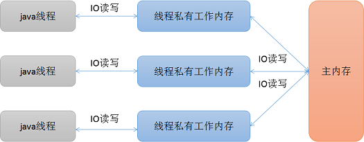

[TOC]


#线程基础

## 基础概念

> 并行 & 并发

```sh

```

> 线程 & 进程

```sh

```

> 线程调度

```sh
计算机通常只有一个CPU时，在任意时刻只能执行一条计算机指令，每一个进程只有获得CPU的使用权才能执行指令。
所谓多进程并发运行，从宏观上看，其实是各个进程轮流获得CPU的使用权，分别执行各自的任务。

那么,在可运行池中，会有多个线程处于就绪状态等到CPU，JVM就负责了线程的调度。
JVM采用的是'抢占式调度'，没有采用分时调度，因此可以能造成多线程执行结果的的随机性。
```

> 多线程意义

```
多线程的目的是为了更好的利用计算机的 CPU 资源。
比如在一个进程中，如果只有一个线程（也叫主线程），那么如果当这个线程因为某种原因阻塞（等待用户输入数据等情况）的时候，
那么相对应的这个进程也让出了 CPU 资源并暂停执行了。试想一下，如果在一个进程中添加多个线程，那么当这个进程中某个线程阻塞的时候，
其余线程还可以继续执行，做它们自己的工作，这样的话计算机的利用效率就提高了。
```

> 线程创建

```sh
- extends Thread，'不推荐使用'，java 单继承，多实现  #每个线程执行自己的 run()方法（Thread implements Runnable）。
- implements Runnable，作为参数传入 Thread，'推荐'。#多个.......同一个 run()...
- implements Callable，使用线程池调用

```

```sh
#Runnable 比 Thread 具有的优势
多个线程共享同一个 run()方法，共同操作同一份资源
可以避免java中的单继承的局限性
增加程序的健壮性，实现解耦操作，代码可以被多个线程共享，代码和数据独立
线程池只能放入实现 Runable 或 Callable 类线程，不能直接放入继承Thread的类
```

> 线程启动

```sh
通过调用线程对象的 start() 方法来启动一个线程（该方法只能被调用一次）。
线程开启后便进入'就绪状态'，但并不会马上执行，而是等待线程调度器的调度。
一旦线程调度器调度了该线程之后，该线程便可获得 CPU 资源，然后进入'运行状态'，开始执行 run() 方法。run() 方法运行结束，该线程也随即终止。
```

```sh
#区别 start() 和 run()
start()：用来启动线程，真正实现多线程运行。
run()  ：不会开启新的线程，直接在调用线程中执行 run()方法体中的内容，程序还是顺序执行。
```

> 线程暂停

```sh
通过调用线程对象的 sleep(long millis) 方法来让线程休眠指定的秒数，调用这个方法之后，线程将会让出 CPU 进入'休眠状态'。
休眠完成之后，线程并不会直接获得 CPU 资源，而是会进入'就绪状态'，等待线程调度器的调度来获取 CPU 资源。
```

##线程退出

```sh
- 调用 System.exit(0) 或 Runtime.getRuntime().exit(0)，并且安全管理器允许程序退出。
- 所有的'非守护线程'运行结束，包括：线程中 run() 正常执行完毕，或者在 run() 执行过程中发生异常。
```

```java

```
- 【官方推荐】用一个 boolean 变量来标记任务是否完成，在任务完成后直接退出循环 或 修改这个标记变量。

```java

```
- 利用系统预定义的`中断标识：Thread.isInterrupted()`

```java

```
- `中断标识 存在的问题：`

```java

```

```java

```
> 线程优先级

```java

```

> 守护线程

```java

```
## 生命周期


> 线程状态


> 进入阻塞状态的4种情况（都会让出CPU）

```java

```

> 区别 sleep() 和 wait()

```java
/*相同点*/：二者都可以使线程处于阻塞状态。
```

```java
sleep()是 Thread 类的方法，必须指定时间参数。 sleep()方法可以在任何地方使用。
```
```java
wait()是 Object 类的方法，可以指定时间参数，也可以不指定。 wait()方法只能在同步方法或同步代码块中使用。
```
```java
当二者都在同步语句中使用时，二者都会让出CPU资源，/* sleep(),notify()方法不会释放资源锁，wait()会 */
```
```java
sleep()方法时间到，线程直接恢复到就绪状态，再次获得线程调度才能恢复到运行状态。 sleep()方法如果没有设置时间，就必须通过 notify()或者 notifyAll()来唤醒，才会进入锁池，再次获得对象锁才会进入运行状态。
```
```java
每个对象都有一个锁来控制同步访问， synchronized 关键字可以和对象的锁交互，来实现同步方法或同步块。 sleep()方法正在执行的线程主动让出CPU（然后CPU就可以去执行其他任务），在sleep指定时间后CPU再回到该线程继续往下执行(注意：sleep方法只让出了CPU，而并不会释放同步资源锁！！！)；
```
```java
wait()方法则是使当前线程让出CPU资源，释放同步资源锁，以便线程获取到资源锁而运行，只有调用了 notify()方法，wait状态才会解除，可以去参与竞争同步资源锁，进而得到执行。（注意：notify的作用相当于叫醒睡着的人，而并不会给他分配任务，就是说notify只是让之前调用wait的线程有权利重新参与线程的调度）；
```
> 锁池 和 等待池

```java
如果线程调用了对象的wait()方法，那么线程就处于该对象的'等待池'中，等待池中的线程不会去争夺锁的拥有权。

当线程调用了该对象的 notify()方法或者 notifyAll()方法，被唤醒的线程进入'锁池'，准备争夺锁的拥有权。假如某个线程没有争夺到锁，它仍旧停留在锁池中等待下一次的争夺，只有再次调用 wait()方法才会进入等待池中。

以上线程拿到锁要干嘛？ '拿到锁，进入就绪状态，等待CPU时间片开始运行'。
```


> DEMO：sleep 和 wait

```java
public static void main(String[] args) throws InterruptedException {
    new Thread(new ThreadTest().new Thread01()).start();
    TimeUnit.SECONDS.sleep(2);
    new Thread(new ThreadTest().new Thread02()).start();
}

private class Thread01 implements Runnable {
    @Override
    public void run() {
        //Thread1 和 Thread2 内部run()方法要用同一对象作为监视器，如果用this则不是同一对象
        synchronized (ThreadTest.class) {
            System.out.println(LocalDateTime.now() + " Thread01 START...");
            //释放锁的两种方式
            // (1).程序自然离开监视器的范围，即离开 synchronized 同步代码块
            // (2).在 synchronized 同步代码块中调用监视器对象的 wait()方法
            ThreadTest.class.wait();
            System.out.println(LocalDateTime.now() + " Thread01 END!!!");
        }
    }
}

private class Thread02 implements Runnable {
    @Override
    public void run() {
        synchronized (ThreadTest.class) {
            System.out.println(LocalDateTime.now() + " Thread02 START...");

            //notify()方法并不释放锁。即使thread2调用了下面的sleep方法休息1s，但thread1仍然不会执行
            //因为thread2没有释放锁，所以Thread1得不到锁而无法执行
            ThreadTest.class.notify();
            TimeUnit.SECONDS.sleep(1);
            System.out.println(LocalDateTime.now() + " Thread02 END!!!");
        }
    }
}
```

```java
2019-05-25T10:02:31.893 Thread01 START... //wait()阻塞线程-01，并释放资源锁
2019-05-25T10:02:33.858 Thread02 START... //线程-02获取资源锁
2019-05-25T10:02:34.858 Thread02 END!!!   //线程-02唤醒线程-01，但notify()没有释放资源锁
2019-05-25T10:02:34.858 Thread01 END!!!   //线程-02出了同步代码块，释放资源锁，线程-01获得资源锁
```
## 线程状态

在给定时间点上，一个线程只能处于一种状态。这些状态是虚拟机状态，它们并没有反映所有操作系统线程状态。


> 线程状态-API：Thread.State

```java
'NEW'：至今尚未启动的线程处于这种状态。
'RUNNABLE'：正在 Java 虚拟机中执行的线程处于这种状态。
'TERMINATED'：已退出的线程处于这种状态。

'BLOCKED'：受阻塞并且正在等待监视器锁。如进入 synchronized 或调用 wait()后再次进入同步的块/方法。 

'WAITING'：无限期地等待另一个线程执行某一特定操作。如调用不带超时的 wait(); join();

'TIMED_WAITING'：具有指定等待时间的某一等待线程的线程状态。如调用 sleep(n); wait(n); join(n);
```
> 线程状态-DEMO

```java
public void doThreadState() throws InterruptedException {
    Thread thread = new Thread(() -> {
        boolean isFinish = false;
        long l = System.currentTimeMillis();

        while (!isFinish) {
            if (System.currentTimeMillis() - l == 500) {
                TimeUnit.SECONDS.sleep(1);
            }
            if (System.currentTimeMillis() - l == 2500) {
                synchronized (ThreadTest.class) {
                    ThreadTest.class.wait();
                }
            }
            if (System.currentTimeMillis() - l > 4500) {
                isFinish = true;
            }
        }
    });

    System.out.println("S" + " - " + thread.getState());
    for (int i = 0; i < 7; i++) {
        if (0 == i) thread.start();

        if (5 == i) {
            synchronized (ThreadTest.class) {
                ThreadTest.class.notifyAll();
            }
        }
        System.out.println(i + " - " + thread.getState());
        TimeUnit.MILLISECONDS.sleep(1000);
    }

    // S - NEW
    // 0 - RUNNABLE
    // 1 - TIMED_WAITING
    // 2 - RUNNABLE
    // 3 - WAITING
    // 4 - WAITING
    // 5 - BLOCKED
    // 6 - TERMINATED
}
```
## 相关API

> 线程插队：`t1.join(millis)`

线程 t2 调用 t1.join()，导致 t2 挂起，挂起指定时间（有参） 或 直至 t1 执行完毕（无参），才继续执行 t2。

```java
Thread t1 = new Thread(() -> {
    System.out.println(LocalDateTime.now() + " Thread-T1");
    TimeUnit.SECONDS.sleep(2);
});

Thread t2 = new Thread(() -> {
    t1.join(1000); //等待，最大等待时间1000ms
    System.out.println(LocalDateTime.now() + " Thread-T2");
    TimeUnit.SECONDS.sleep(2);
});

Thread t3 = new Thread(() -> {
    t2.join(); //等待，直到线程t1终止
    System.out.println(LocalDateTime.now() + " Thread-T3");
});

t1.start();
t2.start();
t3.start(); //【模拟】三个线程顺序执行
System.out.println(LocalDateTime.now() + " main");
```
```java
2019-05-22T09:19:27.880 - main //主线程和 T1 几乎同时执行
2019-05-22T09:19:27.883 - Thread-T1
2019-05-22T09:19:28.983 - Thread-T2 //等待1s.(只等待T1执行1s)
2019-05-22T09:19:30.983 - Thread-T3 //等待2s.(等待T2执行完毕)
```
> 如果线程被创建了，但还未启动，调用它的 `join()` 方法是没有作用的，将直接继续向下执行！

```java
Thread thread = new Thread(() -> TimeUnit.SECONDS.sleep(2));
System.out.println(LocalDateTime.now() + " " + " 111");

thread.join(); //线程还未启动
System.out.println(LocalDateTime.now() + " " + " 222");

thread.start(); //线程启动
thread.join();
System.out.println(LocalDateTime.now() + " " + " 333");
```

```java
2019-05-22T10:00:16.611  111
2019-05-22T10:00:16.611  222 //子线程未启动，调用子线程的 join() 不会挂起主线程
2019-05-22T10:00:18.616  333 //启动后，则会挂起
```
> `join() + synchronized`

```java
Thread thread = new Thread(() -> {
    synchronized (Thread.currentThread()) {
        TimeUnit.SECONDS.sleep(5);
    }
});
thread.start();
System.out.println(LocalDateTime.now() + " Main Start");

thread.join(1000);
System.out.println(LocalDateTime.now() + " Main Finished");
```

```java
2019-05-27T11:10:27.522 Main Start
2019-05-27T11:10:32.433 Main Finished //相隔 5s，而非join()设置的 1s

//由于先调用了 thread.start()方法，线程进入 synchronized 代码段
//main线程等待 1 秒以后，还是得不到线程 thread 的对象锁，只能继续等待，直到线程 thread 结束，释放锁。
```

> 线程谦让`yield()`

```java
//t2调用 Thread.yield(); 是提示线程调度器让出 t2 的 CPU 资源，让其他线程使用。
//这只是一种提示，线程调度器可以忽略这种提示，所以 CPU 资源是否让出并不是一定的，是有一定概率的。
//注意：成功让出后，t2进入就绪状态，而非阻塞状态。
new Thread(() -> {
    while (true) {
        System.out.println("子** - 正在占用CPU");
        Thread.yield(); //请求线程调度器让出当前线程的 CPU 资源
    }
}).start();

for (; ; ) {
    System.out.println("主线程 - 正在占用CPU");
    Thread.yield();
}
```

```java
主线程 - 正在占用CPU //主线程调用 yield(); 是一定概率的让出CPU资源，但不是一定让出
主线程 - 正在占用CPU
子** - 正在占用CPU
... ...
```
> 其他API

```java
//让调用这个方法的线程让出 CPU，休眠参数指定的毫秒数。
//休眠完成之后，线程并不会直接获得 CPU 资源，而是进入就绪状态，等待线程调度器的调度来获取 CPU 资源。
Thread.sleep(long millis);
```

```java
Object.wait(); //让调用这个方法的线程陷入等待状态，可以通过参数设置等待时间，
// 如果不设置参数将使得线程一直等待。
// 注意这个方法只能在 synchronized 关键字修饰的代码块中调用，
// 这个我们会在后面的文章中细讲。

Object.notify(); //唤醒一个因调用当前对象的 wait() 方法而陷入等待状态的线程，具体哪个线程未知。
// 这个方法也只能在 synchronized 关键字修饰的代码块中执行

Object.notifyAll(); //唤醒所有因调用当前对象的 wait() 方法而陷入等待状态的线程。
// 同样，这个方法也只能在 synchronized 关键字修饰的代码块中执行。
```


# 线程同步

##内存模型




> 线程的私有工作内存和主内存之间的联系：

线程私有工作内存 类比于 CPU和主内存之间的高速缓存，特点：`读写速度比内存快，接近于CPU的速度`。

```
Java 线程只能对其私有工作内存进行直接的IO读取和写入操作，而不能对主内存进行直接的IO操作。
主内存对所有的 Java 线程都可见，即所有的 Java 线程都可以通过其工作内存来间接的修改主内存中的数据。
线程的工作内存只对其对应的 Java 线程可见，不同的 Java 线程不共享其工作内存。
```

> 线程修改主内存数据，通过以下步骤：

```
通过工作内存读取主内存中的变量值，并拷贝一份副本。
线程修改工作内存中的副本值。
工作内存将修改后的结果写入到主内存中。
```

> volatile：用于保证数据同步，即可见性。禁止指令重排。

`可见性`：多个线程访问同一个变量时，一个线程修改了这个变量的值，其他线程能够立即看到修改后的值。

```java
private /*volatile*/ static int num = 5;

private void doVolatile() {
    new Thread(() -> num++, "Thread-01").start();
    new Thread(() -> System.out.println(num), "Thread-02").start(); //5 或 6
}

//根据线程修改内存数据的3个步骤，可能出现：线程-01在执行完第2个步骤之后，CPU时间划分给线程-02，
//即，线程-01修改的值没有真正的同步到主内存中，导致线程-02从主内存中读取数据还是修改之前的值。
//volitale 关键字提供了一个功能，就是被其修饰的变量在被修改后会被强制刷入到主内存中。
```

```java
在 CPU 计算过程中，会将计算过程需要的数据加载到 CPU 计算缓存中，当 CPU 计算中断时，有可能刷新缓存，重新读取内存中的数据。在线程运行的过程中，如果某变量被其他线程修改，可能造成数据不一致的情况，从而导致结果错误。

volatile 修饰的变量是线程可见的，当 JVM 解释 volatile 修饰的变量时，会通知 CPU，在计算过程中，每次使用变量参与计算时，都会检查内存中的数据是否发生变化，而不是一直使用 CPU 缓存中的数据，可以保证计算结果的正确。

volatile 只是通知底层计算时，CPU 检查内存数据，而不是让一个变量在多个线程中同步。
```

>ReentrantLock：重入锁，建议应用的同步方式。相对效率比 synchronized 高。量级较轻。

```java
synchronized 在 JDK1.5 版本开始，尝试优化。到 JDK1.7 版本后，优化效率已经非常好了。在绝对效率上，不比 reentrantLock 差多少。
使用重入锁，'必须必须必须' 手工释放锁标记。一般都是在 finally 代码块中定义释放锁标记的 unlock 方法。
```


> volitale、synchronized、RetreenLock


## 同步机制

多个线程同时操作同一资源，容易出现线程安全问题。需要让线程同步，保证数据安全（确保资源在某一时刻只被一个线程使用）。

> 两种实现方案

```java
 synchronized(obj){ } //同步代码块
```

```java
private synchronized void makeWithdrawal(int amt) { } //同步方法
```

> 同步监视器

- synchronized (obj){ }中的 `obj` 称为同步监视器
- 同步代码块中同步监视器可以是任何对象，但是推荐使用共享资源作为同步监视器
- 同步方法中无需指定同步监视器，因为同步方法的同步监视器是this，也就是该对象本事

```java
//同步监视器的执行过程
• 第一个线程访问，锁定同步监视器，执行其中代码
• 第二个线程访问，发现同步监视器被锁定，无法访问
• 第一个线程访问完毕，解锁同步监视器
• 第二个线程访问，发现同步监视器未锁，锁定并访问
```


## synchronized

> synchronized 锁什么？锁对象。

```java
同步代码块 中可以使用临界资源，即
同步代码块 和 同步方法，锁的是调用该方法的当前对象。 this
静态方法中的同步代码块 和 静态同步方法，锁的是当前类型的类对象。如 Test.class
```

>加锁的目的： 就是为了保证操作的原子性

```java
int sum;

private void demo1() {
    for (int i = 0; i < 500; i++) {
        new Thread(() -> {
            //synchronized (this) {
                System.out.println(LocalTime.now() + " - " + sum++); //不加同步 <500
            //}
        }).start();
    }
}
```

>`同步方法只阻塞使用同一锁资源的同步方法`。不阻塞其他线程调用非同步方，或调用其他锁资源的同步方法。

```java
private void demo2() {
    ThreadDemo demo = new ThreadDemo();
    new Thread(() -> demo.m20()).start();
    new Thread(() -> demo.m21()).start(); //m1 和 m0 使用相同的资源锁，故被阻塞
    new Thread(() -> demo.m22()).start(); //非同步方法
    new Thread(() -> demo.m23()).start(); //m3 和 m0 使用不同的资源锁
    
    // 20:46:28.825 START 0
    // 20:46:28.826 START 3
    // 20:46:28.858 START 2 --> 以上 3 个方法同时执行，未被阻塞
    // 20:46:31.826 START 1 --> 被阻塞
}

synchronized void m20() { //同步方法 比 同步代码块，更加重量级
    System.out.println(LocalTime.now() + " START 0");
    TimeUnit.SECONDS.sleep(3);
}

void m21() {
    synchronized (this) {
        System.out.println(LocalTime.now() + " START 1");
        TimeUnit.SECONDS.sleep(3);
    }
}

void m22() {
    System.out.println(LocalTime.now() + " START 2");
    TimeUnit.SECONDS.sleep(3);
}

final Object obj = new Object(); //作为同步资源锁，最好 final

void m23() {
    synchronized (obj) {
        System.out.println(LocalTime.now() + " START 3");
        TimeUnit.SECONDS.sleep(3);
    }
}
```

> 同步方法`只能保证当前方法的原子性`，不能保证多个业务方法之间的互相访问的原子性。

注意：在商业开发中，多方法要求结果访问原子操作，需要多个方法都加锁，且锁定同一个资源。

```java
private void demo3() throws InterruptedException {
    ThreadDemo demo = new ThreadDemo();
    for (int i = 0; i < 2000; i++) {
        new Thread(() -> demo.m30()).start();
    }
    demo.m31();

    TimeUnit.SECONDS.sleep(3);
    demo.m31();
    
    // 09:31:15.751 - 148 //多个方法之间不保证原子性
    // 09:31:18.753 - 2000
}

void m30() {
    TimeUnit.MILLISECONDS.sleep(1); //模拟网络等耗时操作
    synchronized (this) { //同步保证原子性
        this.num += 1;
    }
}

void m31() { 
    //synchronized (obj) {
        System.out.println(LocalTime.now() + " - " + this.num);
    //}
}
```

> `锁可重入(1)`：同一个线程，多次调用同步代码，锁定同一个锁对象，可重入。

```java
synchronized void demo4() throws InterruptedException {
    System.out.println(LocalTime.now() + " START 4");
    TimeUnit.SECONDS.sleep(1);
    m40();
    System.out.println(LocalTime.now() + " END 4");
    
    // 09:52:01.011 START 4
    // 09:52:02.014 START 40 --> 方法40 和 方法4 使用的是同一个资源锁，同一个线程从 4 进入到 40
    // 09:52:03.014 END 40   --> 不会阻塞，只会在资源锁的标记上+1，出了方法 01 同步范围后，在资源锁
    // 09:52:03.014 END 4    --> 的标记上-1，直至减到0，然后释放资源锁
}

synchronized void m40() throws InterruptedException {
    System.out.println(LocalTime.now() + " START 40");
    TimeUnit.SECONDS.sleep(1);
    System.out.println(LocalTime.now() + " END 40");
}
```

> `锁可重入(2)`：同步方法の继承，子类同步方法覆盖父类同步方法。可以指定调用父类的同步方法。

```java
synchronized void demo5() throws InterruptedException {
    System.out.println(LocalTime.now() + " START SUPER");
    TimeUnit.SECONDS.sleep(1);
    
    // 11:08:44.986 START SUB  --> 子类同步方法 和 父类的同步方法 使用的都是同一个资源锁
    // 11:08:44.986 START SUPER
}

static class SubThreadDemo extends ThreadDemo {
    
    synchronized void demo5() throws InterruptedException { //子类同步方法
        System.out.println(LocalTime.now() + " START SUB");
        super.demo5();
    }
}
```

> `锁与异常`：当同步方法中发生异常时，自动释放锁资源。不会影响其他线程的执行。

```java
private void demo6() {
    for (int i = 0; i < 3; i++) {
        int index = i;

        new Thread(() -> {
            synchronized (ThreadDemo.class) {
                System.out.println(LocalTime.now() + " - " + index);
                TimeUnit.SECONDS.sleep(1);
                
                if (1 == index) {
                    int num = 1 / 0;
                }
            }
        }).start();
    }
    
    // 11:39:47.878 - 1
    // Exception in thread ....
    // 11:39:48.953 - 2 --> 释放同步锁的两种方式：（1）显示调用锁资源的 wait()方法
    // 11:39:48.953 - 2 --> （2）方法执行出了同步代码块，包括正常执行完，或者异常跳出
}
```

> `锁对象的变更`：同步代码一旦加锁后，那么会有一个临时的锁引用执行锁对象，和真实的引用无直接关联。在锁未释放之前，修改锁对象引用，不会影响同步代码的执行。

```java
Object obj = new Object(); //作为同步资源锁，最好 final

private void m01() {
    synchronized (obj) {
        while (true) {
            System.out.println(LocalTime.now() + " - " + Thread.currentThread().getName());
            TimeUnit.SECONDS.sleep(1);
        }
    }
}

private void demo0() throws InterruptedException {
    new Thread(() -> m01(), "Thread-01").start();

    TimeUnit.SECONDS.sleep(2);
    obj = new Object();
    new Thread(() -> m01(), "Thread-02").start();
    
    // 16:20:32.612 - Thread-01
    // 16:20:33.614 - Thread-01
    // 16:20:34.571 - Thread-02 --> 锁对象的变更，不影响线程-01 的执行，其使用的是线程私有内存中
    // 16:20:34.614 - Thread-01 --> 锁对象，和主内存中的对象无关，即线程-01和-02 不是同一个锁对象
}
```

>在定义同步代码块时，`不要使用常量对象作为锁对象`。

```java
String str0 = "hello";
String str1 = "hello";

private void m101() {
    synchronized (str0) {
        while (true) {
            System.out.println(LocalTime.now() + " - " + Thread.currentThread().getName());
            TimeUnit.SECONDS.sleep(1);
        }
    }
}

private void m102() {
    synchronized (str1) {
        while (true) {
            System.out.println(LocalTime.now() + " - " + Thread.currentThread().getName());
            TimeUnit.SECONDS.sleep(1);
        }
    }
}

private void demo10() {
    new Thread(() -> m101(), "Thread-01").start();
    new Thread(() -> m102(), "Thread-02").start();
    
    // 16:34:05.468 - Thread-01
    // 16:34:06.481 - Thread-01 --> 只有线程-01执行，02没有执行。这说明 2 个线程使用同一个锁对象
    // 16:34:07.481 - Thread-01 --> 进一步说明 str0 和 str1 是同一个对象
}
```

> `volatile` 修饰的变量，在计算过程中，每次使用变量参与计算时，都会检查内存中的数据是否发生变化，而不是一直使用 CPU 缓存中的数据，可以保证计算结果的正确。`但不是让一个变量在多个线程中同步。`

```java
volatile boolean flag = false;

private void demo7() throws InterruptedException {
    new Thread(() -> {
        System.out.println(LocalTime.now() + " START");
        while (!flag) { }
        System.out.println(LocalTime.now() + " END");
    }).start();

    TimeUnit.SECONDS.sleep(1);
    flag = true;
    
    // 11:49:56.659 START --> 不写 volatile，则while()循环一直执行，每次使用的都是线程私有内存中的值
    // 11:49:57.764 END   --> 加上 volatile，则会终止循环，因为每次使用都会获取最新的值
}
```

> `volatile`： 只能保证可见性，不能保证原子性。

```java
volatile int sum;

/*synchronized*/ void m80() {
    for (int j = 0; j < 1000; j++) {
        sum++;
    }
}

private void demo8() throws InterruptedException {
    ArrayList<Thread> list = new ArrayList<>();
    for (int i = 0; i < 10; i++) {
        list.add(new Thread(() -> m80()));
    }
    for (Thread thread : list) {
        thread.start();
    }
    for (Thread thread : list) {
        thread.join(); //线程-A 中调用 线程-B.join(),则线程-A 等待线程-B 执行完成。
    }
    System.out.println(LocalTime.now() + " - " + sum);
    
    // 13:04:49.806 - 9422 --> volatile只能保证 sum 在各个线程中使用时，都是最新的值，但不能保证...
}
```

>`AtomicInteger`：原子操作类型。其中的每个方法都是原子操作。可以保证线程安全。

```java
AtomicInteger atomicSum = new AtomicInteger(0);

void m90() {
    for (int j = 0; j < 1000; j++) {
        atomicSum.incrementAndGet(); //自增操作，线程安全，勿需加锁
    }
}

private void demo9() throws InterruptedException {
    ArrayList<Thread> list = new ArrayList<>();
    for (int i = 0; i < 10; i++) {
        list.add(new Thread(() -> m90()));
    }
    for (Thread thread : list) {
        thread.start();
    }
    for (Thread thread : list) {
        thread.join();
    }
    System.out.println(LocalTime.now() + " - " + atomicSum);
}
```

>`注意`：原子类型中的方法是保证了原子操作，但多个方法之间是没有原子性的。

```java
//get()方法 和 incrementAndGet()方法都是原子操作。但复合使用时，无法保证原子性，仍旧可能出现数据错误。
AtomicInteger atomicNum = new AtomicInteger(0);
if (atomicNum.get() != 5) {
    atomicNum.incrementAndGet();
}
```

## 线程组

线程池：为了在子线程中处理大量的任务，同时又避免频繁的创建和销毁线程带来的系统资源开销而产生的。

线程组：为了方便和统一多个线程的管理而产生的。

>线程组中不仅可以包含线程，也可以包含线程组。

有点类似于文件夹的概念，线程对应的就是文件，线程组对应的就是文件夹，文件夹中不仅可以包含文件，也可以包含文件夹。

需要注意的是，当新建一个线程 / 线程组之后，如果你没有给这个新建的线程 / 线程组指定一个父线程组，那么其默认会将当前执行创建线程 / 线程组代码的线程所属的父线程组作为新的线程 / 线程组的父线程组。

**同时，一个线程只有调用了其 start 方法之后，其才真正算是被添加到了对应的线程组中。**

```java
public static void stopThreadsByThreadGroup() throws InterruptedException {
    ThreadGroup group = new ThreadGroup("线程组1");

    for (int i = 0; i < 10; i++) {
        new Thread(group, () -> { //线程组添加 10 个线程
            while (!Thread.currentThread().isInterrupted()) { //中断标识
                System.out.println(Thread.currentThread().getName() + " RUNNING");
            }
        }, "Thread-" + i).start();
    }

    TimeUnit.SECONDS.sleep(1); //1s后，中断整个线程组
    group.interrupt();
}
```


# 线程池

## 基础概念

> 区别：execute() 和 submit()

```java
//可以接受的任务类型
execute()：Runnable接口
submit() ：Callable接口，Runnable接口，Runnable接口 + 返回值Result
```

```java
//有无返回值
execute()：没有返回值
submit() ：有返回值，所以需要返回值的时候必须使用submit
```

```java
//异常处理
execute()：参数是Runnable接口的实现，所以只能使用 try-catch 来捕获Exception
submit() ：不管提交的是Runnable还是Callable类型的任务，如果不对返回值Future调用get()方法，都会吃掉异常。
```

##核心相关

> 常见阻塞队列

```java
//队列的三种通用策略：直接提交，无界队列，有界队列
LinkedBlockingQueue
  - 常用，基于链表的 FIFO 队列（先进先出），创建时不指定大小，则使用默认值. Integer.MAX_VALUE

ArrayBlockingQueue
  - 基于数组的 FIFO 队列，创建时必须指定大小。
  - 当队列为空，消费者线程被阻塞；当队列装满，生产者线程被阻塞

SynchronousQueue
  - 直接提交，不进行缓存，直接新建一个线程来执行任务

PriorityBlockingQueue
  - 按照'优先级'进行排序的/*无限队列*/，优先级最高的元素将始终排在队列的头部
  - 存放在其中的元素必须 implements Comparable，这样才能通过实现 compareTo() 进行排序
```

## 容量相关

>动态调整容量

当下列参数从小变大时，ThreadPoolExecutor 进行线程赋值，还可能立即创建新的线程来执行任务

```java
setCorePoolSize(); //设置核心池大小

setMaximumPoolSize(); //设置线程池最大线程数目大小
```

> 容量合理大小

```java
int cpuSize = Runtime.getRuntime().availableProcessors(); //获取cpu核心数

//对于每天执行一次的低频任务，核心线程数设为 0。

//对于CPU密集型应用, 最大线程数设为 N+1.
//....IO........., ........... 2N+1.（N为CPU总核数）
```
```java
/**
 * 假设系统每秒任务数为500~1000，每个任务耗时0.1秒，最大响应时间2s。
 * tasks=500-1000; taskcost=0.1; resptime=1.
 *
 * core = tasks/(1/taskcost) = tasks*taskcost = (500~1000)*0.1 = 50~100, core应该大于50
 * 然后根据8020原则,即80%情况下,每秒任务数小于1000*20%=200,那么 core=20
 * 一般,处理请求数 = (10~18) * core;
 * 
 * queue = (core/taskcost)*resptime = 20/0.1*2 = 400
 * 切记不能使用默认值Integer.MAX_VALUE,这样队列会很大,线程数只会保持在corePoolSize大小. 
 * 当任务陡增时,不能新开线程来执行,响应时间会随之陡增.
 * 
 * max = (max(tasks) - queue)/(1/taskcost) = (1000-400)/10 = 60
 * 
 * 以上都是理想值,实际情况下要根据机器性能来决定. 如果在未达到最大线程数的情况机器cpu load已经满了,
 * 则需要通过升级硬件和优化代码,降低taskcost来处理.
 */
```
## DEMO

> 三个线程顺序执行

- 方法1：使用'单例线程池'

```java
Runnable task01 = () -> System.out.println(LocalDateTime.now() + " Thread-T1");
Runnable task02 = () -> System.out.println(LocalDateTime.now() + " Thread-T2");
Runnable task03 = () -> System.out.println(LocalDateTime.now() + " Thread-T3");

ExecutorService pool = Executors.newSingleThreadExecutor();
pool.execute(task01);
pool.execute(task02);
pool.execute(task03); //任务启动顺序 和 提交顺序一致：1-2-3
pool.shutdown();
```

- 方法2：使用 join() 方法

```java
Thread t1 = new Thread(() -> {
    System.out.println(LocalDateTime.now() + " Thread-T1");
});

Thread t2 = new Thread(() -> {
    t1.join(); //等待，直到线程 t1 终止
    System.out.println(LocalDateTime.now() + " Thread-T2");
});

Thread t3 = new Thread(() -> {
    t2.join(); //等待，直到线程 t2 终止
    System.out.println(LocalDateTime.now() + " Thread-T3");
});

t3.start();
t2.start();
t1.start(); //无论启动顺序，执行顺序都是：1-2-3
```

> 自定义线程池

```java
public class MyThreadPool {
    private int nThreads = 5; //默认的初始线程数
    private TaskThread[] taskThreads; //工作线程
    private final List<Runnable> taskQueue; //阻塞队列

    private MyThreadPool() {
        taskThreads = new TaskThread[nThreads];
        taskQueue = new CopyOnWriteArrayList<>(); //线程安全的list

        for (int i = 0; i < nThreads; i++) {
            taskThreads[i] = new TaskThread();
            taskThreads[i].start(); //预创建好工作线程
        }
    }

    private static class ThreadHolder {
        private static MyThreadPool pool = new MyThreadPool();
    }

    public static MyThreadPool getInstance() { //单例 --> 静态内部类方式
        return MyThreadPool.ThreadHolder.pool;
    }

    //提交任务 ---> 其实只是把任务加入任务队列，什么时候执行有线程池管理器决定
    public void execute(Runnable r) {
        synchronized (taskQueue) {
            taskQueue.add(r);
            taskQueue.notify(); //唤醒工作线程
        }
    }

    // 内部类 --> 工作线程 --> 如果阻塞队列不空，则取出任务执行；否则，等待
    private class TaskThread extends Thread {
        public void run() {
            try {
                for (; ; ) {
                    if (taskQueue.isEmpty()) {
                        synchronized (taskQueue) {
                            taskQueue.wait(20); //阻塞队列为空，等待
                        }
                    } else {
                        Runnable r = taskQueue.remove(0); //取出第一个任务执行（FIFO模式）
                        if (null != r) {
                            r.run();
                        }
                    }
                }
            } catch (InterruptedException e) {
                e.printStackTrace();
            }
        }
    }
}
```

## ali推荐

## 异常处理


# 定时调度

##Timer

##定时线程池

##@Scheduled

> 异步任务

```
1. 使用全局注解开启异步模式 @EnableAsync

2. 局部注解 @Async("*") 标记方法，调用过程中自动使用指定的线程池，并且不需要显示的创建线程去执行

3. @Async 也可标记在类上，标志该类中所有的方法均是异步方法

4. 异步方法和调用方法一定要写在不同的类中，同一类中不起效果
```

```java
@Async //异步注解，可配置自定义的线程池Bean，如 @Async("demoScheduler")
@EnableAsync //全局注解
@EnableScheduling
@Component
public class ScheduledTask {
    //... task1,2 同上
}
```
## Quartz


# ThreadLocal

> 基础介绍

```java
'ThreadLocal 用于存储线程局部变量，能够保证相同线程数据共享，不同线程数据隔离。'
即每个线程只能访问到自己的，多线程之间互不干扰，可有效防止本线程的变量被其它线程篡改。
官方建议，将 ThreadLocal 变量设置为 private static 访问级别。

本质是一个类似 Map 的数据结构，可看作：Map<当前线程的ThreadLocal对象,当前线程的局部变量>。

一个ThreadLocal对象只能存放当前线程的一个局部变量。所以，对多个局部变量需实例化多个ThreadLocal对象。

ThreadLocal中的数据不会随着线程结束而回收，必须手动 remove() 防止内存泄露。
```

```java
操作系统中，线程和进程数量是有上限的，确定线程和进程的唯一条件就是线程或进程id。
操作系统在回收线程或进程的时候，并不一定杀死。系统繁忙时,只会清空其栈内数据，然后重复使用。
所以，对于存储在 ThreadLocal 中的数据，如若不 remove()，则有可能在线程 t2 获取到 t1 的数据。
```

> Thread，ThreadLocal，ThreadLocalMap

```java
//Thread 中有个 ThreadLocal.ThreadLocalMap 类型的成员变量 threadLocals
public class Thread implements Runnable {
    ThreadLocal.ThreadLocalMap threadLocals = null;
}
```

```java
//ThreadLocalMap 是 ThreadLocal 的内部类，它是一个类似Map，它的Key是 ThreadLocal 类型对象！
public class ThreadLocal<T> {
    
    //通过 ThreadLocal 对象的set方法，把ThreadLocal对象自己当做key，放进了ThreadLoalMap中。
    public void set(T value) {
        Thread t = Thread.currentThread();
        ThreadLocalMap map = t.threadLocals; // 获取当前线程的 threadLocals 变量
        if (map != null) {
            map.set(this, value); // key -> ThreadLocal对象自身; value -> 局部变量
        } else {
            t.threadLocals = new ThreadLocalMap(this, value);
        }
    }
    
    public T get() {
        Thread t = Thread.currentThread();
        ThreadLocalMap map = t.threadLocals; //获取当前线程的 threadLocals 变量
        if (map != null) {
            ThreadLocalMap.Entry e = map.getEntry(this); //key为 this，而不是当前线程t
            if (e != null) {
                @SuppressWarnings("unchecked")
                T result = (T)e.value;
                return result;
            }
        }
        return null;
    }
    
    static class ThreadLocalMap /* <ThreadLocal<?>, Object> //自己加的,便于理解 */ { 
        //...
    }
}
```

> hash冲突

在插入过程中，根据ThreadLocal对象的hash值，定位到table中的位置i，过程如下：

```properties
1、如果当前位置是空的，那么正好，就初始化一个Entry对象放在位置i上；

2、不巧，位置i已经有Entry对象了，如果这个Entry对象的key正好是即将设置的key，那么重新设置Entry中的value；

3、很不巧，位置i的Entry对象，和即将设置的key没关系，那么只能找下一个空位置；
```

> 典型应用 - hibernate

```java
private static final ThreadLocal threadSession = new ThreadLocal();

public static Session getSession() throws InfrastructureException {
    Session s = (Session) threadSession.get();
    try {
        if (s == null) {
            s = getSessionFactory().openSession();
            threadSession.set(s);
        }
    } catch (HibernateException ex) {
        throw new InfrastructureException(ex);
    }
    return s;
}
```

> ThreadLocal：用于解决`不同线程间的数据隔离问题`，而不是多线程共享数据问题。

```java
//官方建议设置为 private static，用于关联线程上下文。可以设置默认值
// private static ThreadLocal<String> threadLocal = new ThreadLocal<>();
private static ThreadLocal<String> threadLocal = ThreadLocal.withInitial(() -> "666");

public static void main(String[] args) {
    new Thread(new ThreadTest().new MyRunnable()).start();
    // main: 777
    // Thread-0: 666
}

class MyRunnable implements Runnable {
    MyRunnable() {
        threadLocal.set("777"); //【易错处】这里还属于主线程
        System.out.println(Thread.currentThread().getName() + ": " + threadLocal.get());
    }

    @Override
    public void run() {
        System.out.println(Thread.currentThread().getName() + ": " + threadLocal.get());
    }
}
```
> InheritableThreadLocal：ThreadLocal 子类，继承上下文线程环境的数据，拷贝一份给子线程

```java
private static ThreadLocal<String> threadLocal = new InheritableThreadLocal<>();

public static void main(String[] args) {
    threadLocal.set("777");

    System.out.println(Thread.currentThread().getName() + ": " + threadLocal.get());
    new Thread(() -> {
        //父线程中创建子线程，子线程继承主线程的 ThreadLocal 环境变量
        //此外，子线程的优先级属性 和 是否是守护线程属性 都和父线程相同。
        System.out.println(Thread.currentThread().getName() + ": " + threadLocal.get());
    }).start();
    
    // main: 777
    // Thread-0: 777
}
```

# CountDown...

> 基础概念

多线程通讯的一个辅助类型。相当于在一个门上加多个锁，当线程调用 await() 方法时，会检查门闩数量，如果门闩数量大于 0，线程会阻塞等待。当线程调用 countDown() 时，会递减门闩的数量。当门闩数量为 0 时，await() 阻塞线程可执行。

由于countDown() 方法可以用在任何地方，所以这里说的N个点，可以是N个线程，也可以是1个线程里的N个执行步骤。用在多个线程时，你只需要把这个CountDownLatch的引用传递到线程里。

> 常用方法

```java
//调用 await() 方法的线程会被挂起，它会等待直到 count 值为0才继续执行
public void await() throws InterruptedException { };

//和 await() 类似，只不过等待一定的时间后，count 值还没变为0的话也会继续执行
public boolean await(long timeout, TimeUnit unit) throws InterruptedException { };

//将count值减1
public void countDown() { };
```

> 使用场景

- `开始执行前，等待N个线程完成各自任务：`例如，应用程序启动类要确保在处理用户请求前，所有N个外部系统已经启动和运行了。
- `实现最大的并行性：`有时想同时启动多个线程，实现最大程度的并行性。
- `死锁检测：`可以使用n个线程访问共享资源，在每次测试阶段的线程数目是不同的，并尝试产生死锁。


> 开始执行前，等待N个线程完成各自任务

```java
//模拟100米赛跑，8名选手准备就绪，只等裁判一声令下。当所有人都到达终点时，比赛结束。
private static void doCountDownLatch() throws InterruptedException {
    int nThreads = 8;
    ExecutorService pool = Executors.newFixedThreadPool(nThreads); //8名选手

    CountDownLatch begin = new CountDownLatch(1); //开始的倒数锁
    CountDownLatch end = new CountDownLatch(nThreads); //结束的倒数锁

    for (int i = 0; i < nThreads; i++) {
        final int index = i + 1;
        Runnable run = () -> {
            try {
                begin.await(); //等待枪响
                System.out.println(LocalDateTime.now() + " START: " + index);
                TimeUnit.MILLISECONDS.sleep((long) (Math.random() * 10000));
                System.out.println(LocalDateTime.now() + " ARRIVED: " + index);
            } catch (InterruptedException e) {
            } finally {
                end.countDown(); //每个选手到达终点时，end就减一
            }
        };
        pool.submit(run);
    }
    System.out.println(LocalDateTime.now() + " --- GAME START");
    begin.countDown(); //begin减一，开始游戏
    end.await(); //等待end变为0，即所有选手到达终点
    System.out.println(LocalDateTime.now() + " --- GAME OVER!");
    pool.shutdown();
}
```

> 实现最大的并行性

```java
//【不推荐】以下是一般测试的并发代码，但不严谨，所有线程都是顺序创建，并不符合并发（至少在启动那一刻）
for (int i = 0; i < nThreads; i++) {
    pool.execute(() -> doWork());
}
```

```java
//启动20个线程往 ArrayList 里增加数据，每个线程增加100个，最后输出这个集合的长度
//如果 ArrayList 线程安全，最后结果应该是2000，但并不安全，所以结果应该是小于 2000 或出现下标越界
public void doTestWithCountDown() throws InterruptedException {
    List<Integer> list = new ArrayList<>(); //线程安全的 CopyOnWriteArrayList
    int nThreads = 20;
    ExecutorService pool = Executors.newFixedThreadPool(nThreads);
    CountDownLatch countDownLatch = new CountDownLatch(1);

    Runnable task = () -> {
        countDownLatch.await(); //在倒计时结束前，await将一直阻塞，保证不会有那个线程先执行
        
        for (int i = 0; i < 100; i++) {
            list.add(i);
        }
    };

    for (int i = 0; i < nThreads; i++) {
        pool.execute(task);        
    }
    countDownLatch.countDown(); //所有任务提交完毕后执行

    pool.shutdown();
    pool.awaitTermination(5, TimeUnit.SECONDS);
    System.out.println(list.size());
}
```

> 实现一容器，提供两方法：add + size。写两个线程，线程1添加10个元素到容器中，线程2实现监控元素的个数，当个数到5个时，线程2给出提示并结束

```java
static class MyContainer {
    int count;

    public void add() throws InterruptedException {
        TimeUnit.SECONDS.sleep(1); //延时处理
        this.count++;
    }

    public int size() {
        return count;
    }

    public static void main(String[] args) {
        CountDownLatch countDownLatch = new CountDownLatch(5);
        MyContainer container = new MyContainer();

        new Thread(() -> {
            try {
                countDownLatch.await();
            } catch (InterruptedException e) {
                e.printStackTrace();
            }
            System.out.println(LocalDateTime.now() + " 元素个数：" + container.size());
        }, "Thread-1").start();

        new Thread(() -> {
            for (int i = 1; i <= 10; i++) {
                try {
                    //add()方法执行速度过快，必须保证 CountDownLatch 通讯完再做下一次add()
                    //所以在 count++ 之前（必须之前）做延时处理
                    container.add();

                    countDownLatch.countDown();
                } catch (InterruptedException e) {
                    e.printStackTrace();
                }
            }
        }, "Thread-2").start();
    }
}
```


<https://blog.csdn.net/m0_37125796/article/details/81105099>


