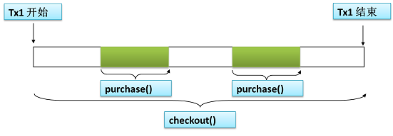

# web


# Spring

## IOC

> 轻量级框架

```sh
Spring 是一个开源的轻量级 IoC(控制反转) 和 AOP(面向切面) 的容器框架。
主要是对 javaBean 的生命周期进行管理，可以单独使用，也可以和 SpringMVC，mybatis 等组合使用。
#轻量级：非侵入式，不需要实现所使用框架的任何接口。这样，就算以后切换框架也不需要修改源码
```

```sh
#框架：软件的半成品，为解决问题制定的一套整体解决方案。
框架封装了很多细节，使开发者可以使用简单的方式实现功能，大大提高效率。如 mybatis，不用写 jdbc 繁琐过程

#类库 & 框架
类库：`提供的类没有封装一定逻辑`。  举例：类库就是名言警句，写作文时引入名言警句
框架：`区别与类库，里面有一些约束`。举例：框架是填空题
```
```sh
代理模式：AOP
单例模式：默认 Bean 为单例
工厂模式：BeanFactory
IOC：依赖倒置 or 依赖注入
MVC：spring web
模版方法模式：JdbcTemplate
```
>IoC & DI

```sh
# IoC 控制反转：反转了资源的获取方向。
以前，Service层调用DAO层，需要在Service中通过 new 主动创建 DAO 实例。
现在，所有的 javaBean 对象都由Spring容器进行统一创建和管理。Service只需要告诉Spring容器它依赖DAO对象，
Spring就会主动将DAO注入到Service中。即，'反转了资源的获取方向：由以前的主动创建 变为 现在的容器自动注入'。

以前，开发人员往往需要知道在具体容器中特定资源的获取方式，增加了学习成本，同时降低了开发效率。
现在，开发人员不需要知道容器是如何创建资源对象的，只需要提供接收资源的方式即可，极大的降低了学习成本，提高了开发的效率
```

```sh
# DI 依赖注入
组件之间依赖关系由容器在运行期决定，形象的说，由容器动态的将某个依赖关系注入到组件之中。
依赖注入的目的并非为软件系统带来更多功能，而是为了提升组件重用的频率，并为系统搭建一个灵活、可扩展的平台。
通过依赖注入机制，我们只需要通过简单的配置，而无需任何代码就可指定目标需要的资源，完成自身的业务逻辑，而不需要关心具体的资源来自何处，由谁实现。

# IOC 描述的是一种思想，而 DI 是对 IOC 思想的具体实现
相对 IoC 而言，依赖注入明确描述了'被注入对象 依赖 IoC容器配置 依赖对象'
```

> Bean的作用域

```sh
'singleton': 默认值，唯一实例。只在容器初始化时创建一次，以后直接从容器中获取
'prototype': 原型的，多实例的。容器初始化时并不创建，而是在每次调用时，每次创建一个新的对象

'request'：每次 http 请求都会产生一个新的实例
'session'：每次 session 创建一个实例
'global'：全局的 httpSession中，容器会返回该bean的同一个实例
```

## AOP

> AOP 概念

```sh
# AOP（Aspect-Oriented-Programing）：面向切面编程。通过 动态代理 方式，在目标方法前后或出现异常处加入相关逻辑。常用场景：
声明式事务 --> 执行方法前开启事务，执行完成后关闭事务，出现异常后回滚事务
权限判断   --> 在执行方法前，判断是否具有权限
日志      --> 在执行前进行日志处理

# AOP 是在不改变原有逻辑的前提下，提供额外功能，提高系统的扩展性。
因此，它可以很好的对业务逻辑的各个部分进行隔离，从而使得业务逻辑各部分之间的耦合度降低，提高程序的可重用性，同时提高了开发的效率
```

```sh
#Spring创建代理的规则为：
默认，使用'Java动态代理'来创建AOP代理，这样就可以为任何接口实例创建代理了
当需要代理的类不是代理接口的时候，Spring会切换为使用'CGLIB动态代理'，也可强制使用CGLIB
```

```sh
前置通知：在方法执行之前执行
后置通知：在方法返回结果或抛出异常，都会执行
返回通知：正常返回才会执行，抛异常则不会
异常通知：如果切点执行过程中出现异常，会触发异常通知
环绕通知：在方法调用之前和之后，执行通知

切入点: 目标方法，PointCut
切面: 所有功能总称叫做切面
织入: 把切面嵌入到原有功能的过程
```

> AOP优先级

```sh
#使用注解 @Order(i) 定义每个切面的优先级。i 的值越小，优先级越高。
#前置通知，从小到大。后置返回通知，从大到小
@Before          @Order(5)  --> @Order(10)
@After           @Order(10) --> @Order(5)
@AfterReturning  @Order(10) --> @Order(5)
```

## 事务

> 编程式事务

```sh
（1）获取数据库连接 Conn 对象 --> （2）取消事务的自动提交 --> （3）执行操作
（4）正常完成操作时手动提交事务 --> （4）执行失败时回滚事务
（5）关闭相关资源
```

```sh
#编程式事务：需要将事务管理代码 嵌入 到业务方法中，来控制事务的提交和回滚。
编程式事务，必须在每个事务操作中包含额外的事务管理代码。相对于'核心业务'而言，事务管理的代码显然属于'非核心业务'，
如果多个模块都使用同样模式的代码进行事务管理，显然会造成较大程度的'代码冗余'。
```

> 声明式事务

```sh
#声明式事务：将事务管理代码从业务方法中 分离 出来，以声明的方式来实现事务管理。
事务管理代码的固定模式作为一种横切关注点，可以通过 AOP 方法模块化，进而借助'Spring-AOP'框架实现声明式事务管理。
Spring 在不同的事务管理 API 之上定义了一个 抽象层，通过配置的方式使其生效。
从而让应用程序开发人员不必了解事务管理 API 的底层实现细节，就可以使用 Spring 的事务管理机制。
```

> ### 事务的 4 个基本特征：ACID

```sh
原子性（Atomicity）  ：事务是一个'不可再分割'的工作单位，事务中的操作要么都发生，要么都不发生。
一致性（Consistency）：事务执行会使数据从一个一致性状态'变换到'另外一个一致性状态（转账之前和之后，金钱总额不变）。
--                   执行过程中，如果某一个或某几个操作失败了，则必须将其他所有操作撤销，将数据恢复到事务执行之前的状态，这就是'回滚'。
隔离性（Isolation）  ：多个事务并发执行，应保证各个事务之间不能互相干扰。
持久性（Durability） ：事务一旦提交，对数据的改变将是永久的，不会被其他操作所影响。比如，删除一条数据。
```

> ACID & CAP

```sh
数据库对于 ACID 中的一致性的定义是这样的：如果一个事务原子地在一个一致地数据库中独立运行，那么在它执行之后，数据库的状态一定是一致的。
对于这个概念，它的第一层意思就是对于数据完整性的约束，包括主键约束、引用约束以及一些约束检查等等，
在事务的执行的前后以及过程中不会违背对数据完整性的约束，所有对数据库写入的操作都应该是合法的，并不能产生不合法的数据状态。
```

```sh
CAP 定理中的数据一致性，其实是说分布式系统中的各个节点中对于同一数据的拷贝有着相同的值；
而 ACID 中的一致性是指数据库的规则，如果 schema 中规定了一个值必须是唯一的，那么一致的系统必须确保在所有的操作中，该值都是唯一的。
由此来看 CAP 和 ACID 对于一致性的定义有着根本性的区别。

数据库的一致性是：应用系统从一个正确的状态到另一个正确的状态。
而 ACID 就是说事务能够通过 AID 来保证这个 C 的过程. C 是目的, AID 都是手段.
```

> ### 隔离级别

```sh
#事务并发执行可能出现的问题
脏读       ：T1改未提   T2读     T1回滚（写的过程，被人插队） `一个事务读取到另一个事务未提交的更新数据`
不可重复读  ：T1读      T2改并提  T1再读（读的过程，被人插队） `在同一事务中，多次读取同一数据返回的结果有所不同`
幻读       ：T1修改全部 T2新增    T1再读，发现还有未修改      `一个事务读取到另一个事务已提交的 insert 数据`
```

```sh
#mysql默认的隔离级别是【可重复读】，Spring默认是【读已提交】
事务的隔离级别要得到 底层数据库引擎 的支持，而不是应用程序或者框架的支持。mysql支持4种 > oracle的2种

读未提交 ：事务隔离的最低级别，允许其他事务读取本事务修改，但尚未提交的数据。         `不能解决 以上3个问题`
读已提交 ：只能读取其他事务已提交的数据。即事务'写的过程中锁定数据'，其他事务不能读取。`能够解决 脏读`
可重复读 ：事务'读取过程中锁定数据'，禁止其他事务修改，但可以读取。                 `能够解决 脏读 不可重复读`
串行化、 ：事务'执行过程中锁定数据'，禁止其他事务增删改，事务不能并发执行。          `能解决所有，但效率低`
```

```sh
#为什么要有事务的隔离级别？这是因为并发事务容易产生一些问题，事务的隔离级别就是解决这些问题产生的。
首先，最基础的事务级别是：'读未提交'，也就是说事务 T2 可以读取事务 T1 已修改但未提交的数据，
这将导致如果 T1 回滚，则 T2 读取到的就是无效数据，即所谓的'脏读'。
为了解决这一问题，而提出了'读已提交'，要求：一个事务只能读取其他事务已提交的数据。即`事务【写入】过程中锁定数据`，其他事务不能读取。

但是，在事务 T2 读取数据的过程中，数据被事务 T1 更改了，将导致事务 T2 两次读取数据不一致现象，即'不可重复读'。
为了解决这一问题，提出了更严格的隔离级别'可重复读'，要求：`事务【读取】过程中锁定数据`，禁止其他事务修改，只能读取。

但这也不是最完美的，比如事务 T1 要把数据表中所有行的某一列改为 3，在 T1 执行过程中，事务 T2 向数据表中又新加了 1 行数据，
事务 T1 执行完发现，并没有把所有行都改为 3，这就是所谓的'幻读'。为此，提出了最为严格的'串行化'。
串行化要求：`事务【执行】过程中锁定数据`，不允许其他事务增删改。事务只能一个一个串行化执行，不能并发执行，大大降低效率。
```

> ### 传播行为

```sh
#事务传播行为，是指事务方法A 调用 事务方法B，那么，A的事务该如何传播？
Required      已有事务则直接使用，没有则新建一个 `需要（默认值）`
Required_New  无论有无，都要新建一个           `需要新的`

Supports      有则用，无则不用                `支持`
Not_Supports  有则挂起不用，无则直接运行        `不支持`

Mandatory     有则用，无则抛出异常             `强制`
Never         有则抛出异常，无则直接运行        `不能用`

Nested：      如果有就嵌套、没有就开启事务       `嵌套`
```

> 举例说明

```java
@Transactional
public void checkout(String userId, List<Integer> bookIds) { //结账
    for (Integer bookId : bookIds) {
        purchase(userId, bookId); //事务b 调用 事务a
    }
}

@Transactional(propagation = Propagation.REQUIRED)
public void purchase(String userId, Integer bookId) { //买书
    //（1）获取书籍信息（单价，库存）
    //（2）扣除书籍库存
    //（3）扣除用户金额
}
```

```sh
#两种传播行为的图示
Required    ：默认值，已有事务则直接使用，没有则新建一个。#用户钱不够，整个 checkout() 回滚，则一本书也买不到。
Required_New：无论有无，都要新建一个。                 #用户钱不够，只单个 purchase() 回滚，也能卖到部分书。
```

 

> `消失的事务`：普通方法A 调用 事务方法B

```sh
#Spring 的声明式事务 @Transactional，跟 Spring-AOP 一样，都是利用了'动态代理'。
对于事务注解方法，Spring会自动生成一个代理对象proxy，代理对象的 methodB()，会先开启事务（begin-Transaction），
然后再去执行原先对象 target.methodB()，如果抛异常，则回滚（rollBack），如果一切顺利，则提交（commit）。

由于，methodA() 没有加 @Transactional 注解，所以代理对象里面，直接就是 target.methodA()，直接调用了原来对象的 methodA()。
原来对象的 methodA()，再去调用原来对象的 methodB()，而原来对象的 methodB()是不具有事务的。
事务只存在于代理对象的 methodB(). 所以整个方法也就'没有事务'了。

因此，Service层如果存在方法间相互调用，则 @Transactional 注解一定要写在最外层方法上。
```

> DEMO

```java
/**
 * @param propagation   事务的传播行为。默认：REQUIRED
 * @param isolation     事务的隔离级别。默认：READ_COMMITED.（和 mysql 默认的隔离不同）
 *
 * @param rollbackFor   需要回滚的异常类，可以为多个。默认：捕获到 RuntimeException 或 Error 时回滚，而捕获到编译时异常不回滚
 * @param noRollbackFor 不需要回滚的异常类，可以为多个
 * @param readOnly      指定事务是否为只读。表示这个事务只读取数据但不更新数据，这样可以帮助数据库引擎优化事务
 * @param timeout       事务执行时间超过这个时间就强制回滚。单位：秒
 */
@Transactional(propagation = Propagation.REQUIRED, isolation = Isolation.READ_COMMITTED,
               rollbackFor = RuntimeException.class, noRollbackFor = RuntimeException.class,
               readOnly = false, timeout = -1)
@EnableTransactionManagement //全局注解
```

```sh
默认情况下，在遇到 RuntimeException 和 Error，Spring事务都会回滚，而遇到'非运行时异常'则不会回滚。
可通过 rollbackFor 指定需要回滚的非运行时异常（即受检查异常），指定异常之后，被指定的异常和该异常的子类都会得到回滚，
`并且，RuntimeException 和 Error 仍然会得到回滚。`
```

```sh
#只读事务
如果只执行单条查询语句，则没有必要启用事务支持，数据库默认支持 sql 执行期间的读一致性；
如果一次执行多条查询语句，例如统计查询，报表查询，在这种场景下，多条查询 sql 必须保证整体的读一致性。
否则，在前条SQL查询之后，后条SQL查询之前，数据被其他用户改变，则该次整体的统计查询将会出现读数据不一致的状态，此时，应该启用事务支持。

对于只读查询，可以指定事务类型为 readonly=true。由于只读事务不存在数据的修改，因此数据库将会为只读事务提供一些'优化'手段。
例如，不安排相应的数据库锁，以减轻事务对数据库的压力，毕竟事务也是要消耗数据库的资源的
```


## 原理

> IOC容器创建

```sh

```

> Spring和web应用整合

```sh
在web应用程序中，要对 Spring-IoC 容器（WebApplicationContext）进行初始化，可以通过配置 ContextLoadListener 监听器实现。具体配置如下：
```
```xml
<!-- （1）在 web.xml 中通过应用上下文初始化参数来指定 Spring 配置文件的路径 -->
<context-param>
    <param-name>contextConfigLocation</param-name>
    <param-value>classpath:applicationContext.xml</param-value>
</context-param>
```

```xml
<!-- （2）在 web.xml 中配置 ContextLoadListener 监听器 -->
<listener>
    <listener-class>org.springframework.web.context.ContextLoaderListener</listener-class>
</listener>
```

```sh
（3）经过以上配置后，在Servlet中，直接使用 Spring 提供的 WebApplicationConttextUtils 工具类可以获取Spring的 WebApplicationContext 容器，
然后就可以从容器中获取想要的 Bean 了。
```


> Spring的 IoC 和 AOP

```sh
IOC：控制反转，是一种设计模式。一层含义是'控制权的转移'：由传统的在程序中控制依赖转移到容器来控制；
第二层是'依赖注入'：将相互依赖的对象分离，在Spring配置文件中描述他们的依赖关系。他们的依赖关系只在使用时才建立。

AOP：面向切面编程。将系统中非核心的业务提取出来，进行单独处理。

Spring的AOP和IOC在项目中都是为了解决系统代码耦合度过高的问题。使代码重用度高、易于维护。比如事务、日志、权限等。
```


> 拦截器的作用？ 事务拦截器的实现原理？

```sh
拦截器适合封装一些通用处理，便于重复利用。例如日志的记录，权限检查，事务处理等。拦截器是通过配置方式调用，隐藏使用方法，比较灵活，便于维护和扩展。

Spring 中的事务管理是通过 AOP 代理来实现的，对被代理对象的每个方法进行拦截，在方法执行前启动事务，方法执行后根据'是否有异常和异常的种类'进行提交或回滚。
```
> SSM三大框架中高内聚、低耦合是哪个框架实现的？

```sh
#高内聚、低耦合是通过Spring框架的 IOC 和 AOP 实现的。
将基于实现类的耦合变成基于接口的耦合，可以避免硬编码所造成的程序过度耦合。而接下来需要解决的问题就是，如何确定该接口的实现类。
IOC 控制反转，就是将某一接口的具体实现类的控制从调用类中移除，转交给第三方，即Spring容器。

在业务系统里除了要实现业务功能之外，还要实现如权限拦截、性能监控、事务管理等非业务功能。
通常的作法是非业务的代码穿插在业务代码中，从而导致了业务组件与非业务组件的耦合。
AOP 面向切面编程，就是将这些分散在各个业务逻辑代码中的非业务代码，通过横向切割的方式抽取到一个独立的模块中，从而实现业务组件与非业务组件的解耦。
```
> 什么是面向接口编程？

```sh
在一个大型系统中，系统的每一个功能都是由多个对象（可以是 SMM 架构的 Service层、DAO层，也可以是微服务的多个服务）共同完成的。
所以，在这种情况下，我们不关心各个对象内部是如何实现的，而是'将重点放在各个对象之间是如何进行相互协作的'。
比如，各个类之间的通信，模块之间的交互，在系统设计之初就需要着重考虑，面向接口编程就是指按照这种思想来编程
```


# mybatis

## 手册

> 开发手册

```sh
#【参考】 各层命名规约
get，list，count（统计值），insert/save（推荐），delete/remove（推荐），update

#【强制】 xml 配置中参数注意使用：#{}，不要使用${}，此种方式容易出现 SQL 注入。

#【强制】 在表查询中，一律不要使用 * 作为查询的字段列表，需要哪些字段必须明确写明。
-- 说明：（1）增加查询分析器解析成本。（2）增减字段容易与 resultMap 配置不一致。（3）无用字段增加网络消耗，尤其是 text 类型的字段。

#【强制】 POJO类 boolean 属性不能加 is，而数据库字段必须加 is_，要求在 resultMap 中进行字段与属性的映射。
-- 说明：参见定义POJO类以及数据库字段定义规定，在 sql.xml 增加映射，是必须的。

#【推荐】 不要写一个大而全的数据更新接口，传入为 POJO 类，不管是不是自己的目标更新字段，
-- 都进行 update table set c1=value1, c2=value2, c3=value3; 这是不对的。
-- 执行 SQL时，尽量不要更新无改动的字段。（1）易出错； （2）效率低； （3）binlog 增加存储。
```

```sh
#【强制】 不允许直接拿 HashMap 与 Hashtable 作为查询结果集的输出。
-- HashMap 会置入字段名和属性值，但是值的类型不可控。

#【强制】 不要用 resultClass 当返回参数，即使所有类属性名与数据库字段一一对应，也需要定义；反过来，每一个表也必然有一个与之对应。
-- 说明：配置映射关系，使字段与 DO 类解耦，方便维护。

#【强制】 mybatis 自带的 queryForList(String statementName, int start, int size) 不推荐使用。
-- 说明：此方法属于'逻辑分页'，会先查询所有记录，然后再代码中进行分页

#'【参考】 @Transactional 事务不要滥用。事务会影响数据库的 QPS。
-- 另外使用事务的地方需要考虑各方面的回滚方案，包括缓存回滚、搜索引擎回滚、消息补偿、统计修正等。
```

## 基础

> 池化技术：减少系统消耗，提升系统性能

```sh
#连接池就是用于存储连接的集合。集合必须是线程安全的，不能两个线程拿到同一个连接。集合还必须实现队列的特征：先进先出
限定数据库连接的个数，不会造成由于数据库连接过多而导致系统运行缓慢或崩溃。  `连接池`
数据库连接不需要每次都去创建或销毁，节约了资源。数据库连接用完之后，归还给连接池，并将其状态变成'Idle'，并不是销毁连接。
数据库连接不需要每次都去创建，响应时间更快。
```

```sh
限定线程的个数，不会造成由于线程过多导致系统运行缓慢或崩溃。              `线程池`
线程池不需要每次都去创建或销毁，节约了资源。
线程池不需要每次都去创建，响应时间更快。
```

>ORM

```sh
#什么是 ORM？
ORM（Object-Relational-Mapping）：对象-关系映射。Object 是指java语言中的对象，Relational 是指关系型数据库。
ORM 就是把数据库表和实体类及实体类的属性对应起来，用操作实体类的方式来完成数据库操作的一种技术。

#为什么使用 ORM?
当实现一个应用程序时，可能会写特别多数据访问层的代码，增删查改，而这些代码都是重复的。使用ORM则会大大减少重复性代码。

#ORM 优缺点
优点：(1).面向对象编程，易于理解，不必编写sql。(2).可能很好的做到数据库无关性。(3).只适用于业务逻辑简单的场景。
缺点：(1).自动生成sql，无法调节其性能。(2).对于复杂场景，ORM无法处理。
```

```sh
#举例说明，使用原生 jdbc 查询，需要编写sql
res = db.excSql("SELECT name,age FROM person WHERE id=10;");
name = res[0]["name"];

#使用 ORM 思想操作，则代码编写为：
person = PersonDao.getById(10);
name = person.getName();

#二者相比较，ORM使用面向对象编程，与数据对象直接交互，不用编写sql，封装了底层数据访问的细节。
数据库的表（table） --> 类（class）
记录（record）     --> 对象（object）
字段（field）      --> 对象的属性（attribute）
```

>JDBC

```sh
（1）建立连接 （2）创建Statement对象 （3）组装sql及参数 （4）执行sql （5）读取结果集并解析 （6）关闭连接，释放资源
```

```java
public static void main(String[] args) throws Exception {
    Class.forName("com.mysql.jdbc.Driver");
    Connection conn = DriverManager.getConnection(url, username, password);              //（1）
    Statement st = conn.createStatement();                                               //（2）
    ResultSet rs = st.executeQuery("select id,name,password,email,birthday from users"); //（3-4）
    while(rs.next()){
        System.out.println("name=" + rs.getObject("name"));                              //（5）
    }
    rs.close();
    st.close();
    conn.close();                                                                         //（6）
}
```

>JPA

```sh
#JPA 全称 Java-Persistence-API，即Java持久化API。JPA规范本质上就是一种ORM规范，注意不是ORM框架。
因为JPA并未提供ORM实现，它只是制订了一些规范，提供了一些编程的API接口，但具体实现则由服务厂商来提供实现。

#JPA & Hibernate
JPA 和 Hibernate 的关系就像JDBC和JDBC驱动的关系，JPA是规范，Hibernate 除了作为ORM框架之外，它也是一种JPA实现。

#JPA 能否取代 Hibernate？ JDBC规范可以驱动底层数据库吗？
答案是否定的，也就是说，如果使用JPA规范进行数据库操作，底层需要 Hibernate 作为其实现类完成数据持久化工作。
```

>mybatis

```sh
'半自动的 ORM 框架'，底层是对JDBC的封装，开发者只需要关注 sql 本身，而不需要去处理Jdbc繁杂的过程代码。
通过xml或注解的方式将 mapper接口和参数 映射生成 最终执行的sql语句，由框架调用执行，并将结果映射成 javabean 对象返回。
```

```sh
#优点
- 与 jdbc 相比，消除了 jdbc 大量冗余的代码，不需要手动开关连接
- sql 写在 xml 里，解除 sql 与程序代码的耦合，便于统一管理
- 能够与 Spring 很好的集成
- 提供映射标签，支持对象与数据库的字段关系映射；提供对象关系映射标签，支持对象关系组件维护。
```

```sh
#缺点
- sql 语句的编写工作量较大，尤其当字段多、关联表多时，对开发人员编写SQL语句的功底有一定要求。
- sql 语句依赖于数据库，导致数据库移植性差，不能随意更换数据库（数据库无关性差）。
```

>Hibernate

```sh
- mybatis 和 hibernate 不同，它是一个半自动 ORM 框架，需要程序员自己编写 sql 语句。
- mybatis 直接编写原生态sql，可以严格控制sql执行性能，灵活度高。
- Hibernate 对象/关系映射能力强，能够做到数据库无关性。mybatis 如果要实现数据无关性，则需要编写多套sql映射文件，工作量大。

#Hibernate： 全自动。自动生成sql，不能控制sql性能；但能做到数据库无关性。
#mybatis  ： 半自动。手写sql，可以优化sql性能；不能做到数据库无关性（数据库切换就得重新写sql）
```

>总结

```sh
- JDBC     ：sql包含在代码中，硬编码，高耦合，不易维护。还需要编写大量的冗余代码。
- mybatis  ：半自动化ORM。sql和java编码分开，一个专注数据，一个专注业务，低耦合。
- Hibernate：全自动ORM。自动产生sql，但不灵活。
```

## 原理

>运行原理

```java
@Test
public void mybatisTest() throws IOException {
    InputStream is = Resources.getResourceAsStream("mybatis.xml");
    SqlSessionFactory factory = new SqlSessionFactoryBuilder().build(is); //（1）

    SqlSession session = factory.openSession();                           //（2）

    EmpMapper empMapper = session.getMapper(EmpMapper.class);             //（3）
    //根据多态原则，调用接口的 selectList()，其实际调用的是：实现类的 selectList()
    List<Emp> emps = empMapper.selectList(null);
    session.commit();
    session.close();
}
```

```sh
mybatis 开始运行时，通过 'Resources' 读取配置文件，使用 'XMLConfigBuilder' 进行解析，并把解析结果存放在 'Configuration' 中，
然后通过 'SqlSessionFactoryBuilder' 对象的 build() 方法，以 Configuration 作为参数构建一个 'SqlSessionFactory' 对象。

Configuration：保存 mybatis 的全部xml配置信息，包括mapper.xml。
<parameterMap>标签会被解析为 ParameterMap 对象，其每个子元素会被解析为 ParameterMapping 对象。
<resultMap>标签会被解析为 ResultMap 对象，其每个子元素会被解析为 ResultMapping 对象。
每一个<select>、<insert>、<update>、<delete>标签均会被解析为 MappedStatement 对象，标签内的sql会被解析为 BoundSql 对象。
```

```sh
通过 SqlSessionFactory 的 openSession() 方法获取到 'SqlSession' 对象。
执行过程中会读取 Configuration 中的数据源信息，创建一个执行器对象 'Executor'。

#SqlSession：（1）创建接口的代理对象。（2）定义通用的增删改查方法
#Executor  ：真正地实现了与数据库的交互。负责执行SQL语句，并且封装结果集
```

```sh
使用'jdk动态代理技术'动态生成一个接口 EmpMapper 的实现类，
根据 mapper 接口的'全限定名'（全类名）从 Configuration 中查找对应的 sql 语句，
最后，使用 Executor 对象从数据库中查找数据，并封装范围结果到 javabean。
```

>常用API和方法

```sh
（1）SqlSessionFactoryBuilder：读取mybatis的配置文件，构建 SqlSessionFactory 对象
```

```sh
（2）SqlSessionFactory：负责创建 SqlSession 对象。
-- 特点：一旦创建就会存在应用程序的整个运行生命周期（需要做单例）。作用域：一个应用的生命周期

'sqlSessionFactory.openSession();执行结果'
1、将会启用一个事务作用域（即不会主动提交，需要手动提交）
2、将从正在生效的运行环境所配置的数据中获取一个连接对象
3、事务隔离级别是由驱动或数据源使用的默认级别
4、PreparedStatements 不会被重用，也不会进行批量更新
```

```sh
（3）SqlSession ---> 包含了所有的执行数据库sql语句，事务操作，获取mapper方法
-- 特点：每个线程都有一个SqlSession实例，sqlSession不是共享的，也不是线程安全的
-- 作用域：是Request 或 method。在一次会话结束时需要将sqlSession关闭

'SqlSession主要功能'
执行SQL语句、提交或回滚事务、sqlSession关闭、mapper接口映射、缓存操作

'执行sql语句'
传入待执行的sql及参数，获取结果，并将结果映射为javabean对象
<T> T selectOne(String statement, Object parameter);

'mapper接口映射'
通过使用mapper接口执行mapper文件中的映射语句
mapper中方法名称，参数名称，参数数量与配置文件xml中方法名称，参数名称，参数数量相互对应
mapper中也可以使用 RowsBounds 来限制查询结果，逻辑分页，不推荐
```


## 问题

> 特殊符号

```sh
'${}' 表示拼接sql串。                    #参数拼接 --> 编译成sql指令 --> 运行
'#{}' sql参数的占位符，可有效防止 sql 注入。#编译成sql指令 --> 动态传参 --> 运行
mybatis会将sql中的 '#{}' 替换为 ? 号，在sql执行前使用 PreparedStatement 的方法设置参数。

#特殊情况必须要用 ${}。如：动态传入字段，表名
SELECT * FROM person ORDER BY ${field} DESC LIMIT 10
```

```sh
#为什么能防止sql注入？
使用 PreparedStatemen 执行参数化查询时，数据库系统'不会将参数的内容视为 sql 指令的一部分'来处理，
而是在数据库完成 sql 指令的编译后，才套用参数运行。因此，就算参数中含有破坏性的指令，也不会被数据库所运行。
即，sql 语句在程序运行前已经进行了'预编译'，当运行时，动态地把参数传给 PreprareStatement。
即使参数里有敏感字符如 or '1=1'、数据库也会作为一个参数一个字段的属性值来处理，而不会作为一个 sql 指令。

userName = passWord = "1' OR '1'='1";
strSQL = "SELECT * FROM users WHERE name = '1' OR '1'='1' and pw = '1' OR '1'='1';"
```

```sh
#PreparedStatement 比 Statement 更快
Java提供了 3 种方式来执行查询语句：
`Statement` 用于通用查询，`PreparedStatement` 用于执行参数化查询，而 `CallableStatement` 则是用于存储过程。

使用 PreparedStatement 最重要的一点好处是它拥有更佳的性能优势：'SQL语句会预编译在数据库系统中'。
执行计划同样会被缓存起来，它允许数据库做参数化查询。使用预处理语句比普通的查询更快，
因为它做的工作更少（数据库对SQL语句的分析，编译，优化已经在第一次查询前完成了）。
为了减少数据库的负载，生产环境中的 jdbc 代码你应该总是使用 PreparedStatement 。

总结：为了获得性能上的优势，应该使用参数化sql查询，而不是字符串追加的方式。下面两个查询，第 2 个效率更高
```

```java
//（1）字符串追加 --> 不会预编译 --> 每次查询都要重新编译，就像每次查询都要重新写一遍相同的逻辑
String loanType = getLoanType();
PreparedStatement prestmt = conn.prepareStatement("select banks from loan where loan_type=" + loanType);

//（2）参数化查询 --> 数据库会预编译(定义一个方法) --> 每次查询都像是调用已写好的方法
PreparedStatement prestmt = conn.prepareStatement("select banks from loan where loan_type=?");
prestmt.setString(1, loanType);
```

> 延迟加载

```sh
mybatis.configuration.lazy-loading-enabled=true|false #配置延迟加载
mybatis 仅支持 association 关联对象（一对一）和 collection 关联集合对象（一对多）的延迟加载。

它的原理是，使用 cglib 创建目标对象的代理对象，当调用目标方法时，进入拦截器方法。
比如调用 a.getB().getName()，拦截器invoke()方法发现 a.getB() 是null值，那么就会单独发送事先保存好的查询关联B对象的sql，
把B查询上来，然后调用a.setB(b)，于是a的对象b属性就有值了，接着完成a.getB().getName()方法的调用。这就是延迟加载的基本原理。

当然了，不光是Mybatis，几乎所有的包括Hibernate，支持延迟加载的原理都是一样的。
```

> 关联查询

```sh
#关联查询 两种实现方式：
（1）'嵌套查询'，嵌套查询的含义为使用join查询，一部分列是A对象的属性值，另外一部分列是关联对象B的属性值。
好处是只发一个sql查询，就可以把主对象和其关联对象查出来。
（2）'分步查询'，先查出主对象，然后对于关联对象单独发送一个sql去查询，赋给主对象，然后返回主对象。
```

> 

```sh

```

> 分页

```sh
#物理分页：依赖的是某一物理实体，这个物理实体就是数据库。
比如，MySQL数据库提供了limit关键字，程序员只需要编写带有 limit 关键字的 sql 语句，数据库返回的就是分页结果。

#逻辑分页：依赖的是程序员编写的代码。数据库返回全部数据，由程序员通过代码获取分页数据。
常用的操作是一次性从数据库中查询出全部数据并存储到 list 集合中，因为 list 集合有序，再根据索引获取指定范围的数据。
```

```sh
mybatis 使用 RowBounds 对象进行分页，它是针对 ResultSet 结果集执行的'逻辑分页'，而非物理分页。
可以在sql内直接书写带有物理分页的参数来完成'物理分页'功能，也可以使用分页插件来完成物理分页。

'分页插件'的基本原理是：使用 mybatis 提供的插件接口，实现自定义插件，在插件的拦截方法内拦截待执行的sql，然后重写sql，
根据 dialect 方言，添加对应的物理分页语句和物理分页参数。
#举例：select * from student，拦截sql后重写为：select t.* from （select * from student）t limit 0，10
```

> 插件

```sh
mybatis 仅可以编写针对 ParameterHandler、ResultSetHandler、StatementHandler、Executor 这4种接口的插件。
mybatis 使用JDK的动态代理，为需要拦截的接口生成代理对象以实现接口方法拦截功能，每当执行这4种接口对象的方法时，就会进入拦截方法，
具体就是 InvocationHandler.invoke() 方法，当然，只会拦截那些你指定需要拦截的方法。

实现 mybatis 的 Interceptor 接口并复写 intercept() 方法，然后在给插件编写注解，指定要拦截哪一个接口的哪些方法即可。
记住，别忘了在配置文件中配置你编写的插件。
```

> 缓存

```sh

```

