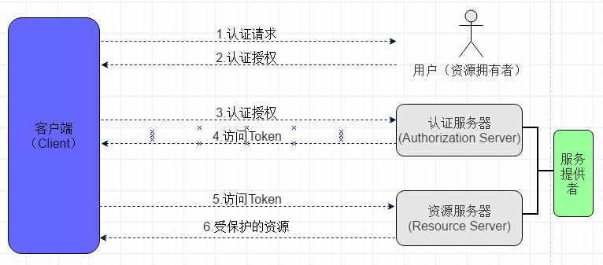
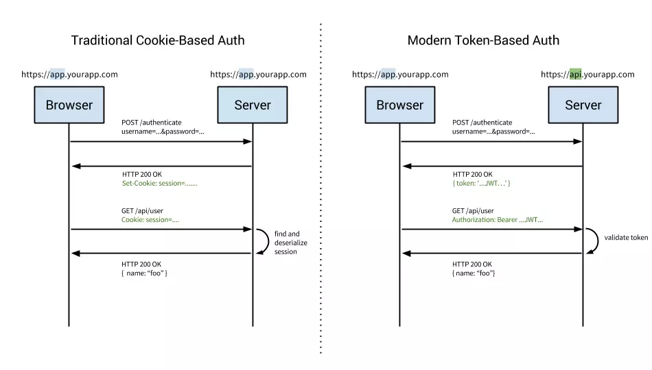
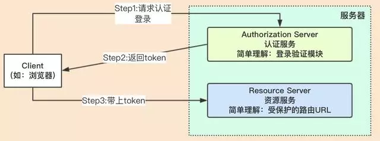
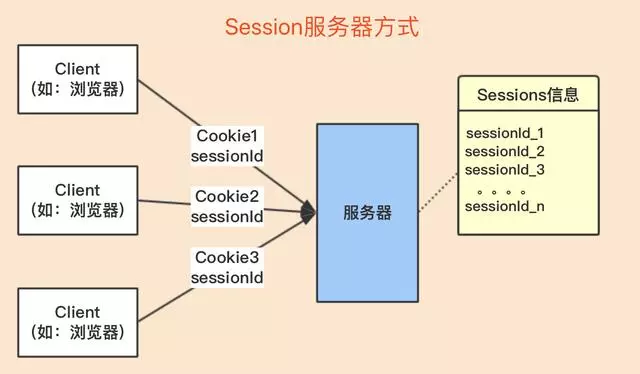
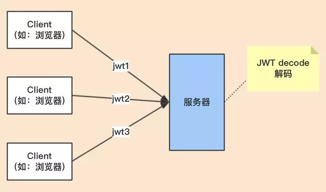

[TOC]


# Idea

## 相关插件

>`MybatisPlugin`

```
安装方式：Settings -> Plugins -> Intall Plugin from disk -> 选择压缩包即可
```

> `MavenRunHelper`

```
maven插件，可右键启动、打包、测试mvn项目
```

> `Alibaba Java Coding Guidelines-1.0.6`

```
ali开发手册的插件版，约束开发习惯
```

> `lombok`：简化POJO的getter/setter/toString；异常处理；I/O流的关闭操作等等

```xml
<dependency>
    <groupId>org.projectlombok</groupId>
    <artifactId>lombok</artifactId>
    <scope>provided</scope> <!-- 只在编译阶段生效，不需要打入包中 -->
    <optional>true</optional> <!--默认false。当A依赖B，B依赖 lombok 并设为true，若A没有显式的引入lombok，则A不依赖lombok-->
</dependency>
```

```java
//eclipse-安装
下载: https://projectlombok.org/download
将 lombok.jar 放在eclipse安装目录下，与 eclipse/sts.ini 同级
当前目录打开cmder，使用命令: "java -jar ./lombok.jar"，弹框选择 Install/Update
成功标识: sts.ini最后一行：-javaagent:F:\sts-bundle\sts-3.9.3.RELEASE\lombok.jar
```

```java
//idea-安装
下载: https://github.com/mplushnikov/lombok-intellij-plugin/releases
Settings-Plugins-'install from disk'，选择下载的*.zip，即可安装成功 
```

```java
//常用注解
@Slf4j: 生成slf4j注解式logger
@NonNull: 调用字段的setter方法时,传参为null，则报空指针异常。
@Data: 组合注解，包含 @Getter; @Setter; @ToString, @EqualsAndHashCode; 无参构造函数.

@Accessors: 定制化@Getter与@Setter
//(chain = true): 链式编写setter方法,如 Person hua = new Person().setName("HUA").setAge(18);
//(fluent  = true): 流式编写setter方法,如 Person wang = new Person().name("WANG").age(18);

@SneakyThrows(*.class): 
//用在'方法'上，可将方法中的代码用 try-catch 语句包裹起来
//捕获异常并在 catch 中用 Lombok.sneakyThrow(e) 把异常抛出
```


> `cmder`（cmd升级版）http://cmder.net/

```java
mini与full版：差别在于有没有内建 msysgit 工具

右键菜单：'配置系统环境变量,然后使用系统cmd执行命令: Cmder.exe /register ALL'
中文乱码：'settings -> Environment -> 添加: set LANG=zh_CN.UTF-8'
```

> `JSON-Handle`（Chrome插件）

```java
浏览器输入：'chrome://extensions/' 将下载后的文件拖入浏览器即可
```
> `Advanced_Rest_Client_Chrome`（Chrome插件）

```
用于调试 http请求，类似 postman
```

>`OneTab_v1.18`（Chrome插件）

```
将已打开的 chrome 网页，保存成类书签形式，以便后续阅读，减少内存
```


## 常见问题

>如何在IDEA中多次启动同一个项目

```java
启动绿三角 左边的 'Edit Config...'，在弹出窗口中取消勾选 'Single-instance-only（单例模式）'，点击OK
每次运行 SpringBoot 项目前，修改配置文件中的端口号即可。

注意：项目最好排除'spring-boot-devtools'
```

>如何在单个窗口打开多个Maven工程啊？

```
随便新建一个文件夹，然后将工程都扔进去，使用 IDEA 打开这个文件夹。
```
>复制警告或错误信息

```
方式一：鼠标光标悬浮在报错的地方，待错误提示出现后，键盘按住 Alt，同时点击鼠标左键，Ctrl+V 到度娘即可。

方式二：直接在界面的底部右键copy，错误信息显示在底部。
```

> mvn打包时，跳过Test

```java
打开右侧"Maven-Projects"，当前项目'Lifecycle'，选中'Test'，点击菜单栏的"小闪电"，此时Test上多了一条横。
```

> SpringBoot 项目的 Run Dashboard

```
工具栏，启动绿三角左边的 Edit Config...，找到 SpringBoot，点击 + 号新建一个标签，右侧 Main class 过滤启动类，修改 Name
```


## 默认配置

>当前项目配置 VS 默认配置

```
当前配置：顶部导航栏 -> File -> Settings / ProjectStructs

默认配置：顶部导航栏 -> File -> Other Settings -> Default Settings /Project Structs
```

> （默认配置）JDK

```
顶部工具栏 File -> Other Settins -> Default Project Structure -> SDKs -> JDK
```

> （默认配置）Maven

```java
顶部工具栏 File -> Other Settings -> Default Settings -> Build & Tools -> Maven

mvn命令：右侧工具栏 Maven -> 点击展开某工程或模块 ->快速执行Maven命令。
        clean：清空； compile：编译； package：打包； install：发布到仓库
```

>（默认配置）Maven DarchetypeCatalog。IDEA 创建Maven项目速度慢问题

```java
解决 ：IDEA根据 maven archetype 的本质，其实是执行'mvn archetype:generate'命令，
该命令执行时，需要指定一个'archetype-catalog.xml'文件。
该命令的参数-DarchetypeCatalog，可选值为：remote，internal，local等，用来指定 archetype-catalog.xml 文件从哪里获取。
默认为remote，即从'http://repo1.maven.org/maven2/archetype-catalog.xml'路径下载archetype-catalog.xml文件。

顶部工具栏 File -> Other Settings -> Default Settings -> Build，... -> maven -> Runner -> VM Options 填写：
-DarchetypeCatalog=internal
```

> （默认配置）版本控制Git/Svn

```
顶部工具栏 File -> Other Settings -> Default Settings -> Version Control -> Git
```

>（默认配置）自动导包和智能移除 

```
顶部工具栏 File -> Other Settings -> Default Settings -> Auto Import
    （√）add unambiguous...自动导入依赖
    （√）Optimize from... 优化导入和智能删除无关依赖
```

> （当前项目配置）Tomcat Server

```
顶部工具栏 File -> Settings -> Deployment -> Application Servers -> Tomcat Server，选择 Tomcat 的根目录
```

> 其他配置

```
自动编译：File -> Other Settings -> Default Settings -> Build... -> Compiler -> （√）Build project auto...

取消大小写敏感：File | Settings | Editor | General | Code Completion | Case Sensitive Completion = None

调整字体大小：打开配置，搜索Font，然后再Font可以调整字体类型，Size可以调整字体大小

F2修改文件名：File -> Settings -> Keymap -> 搜索 Rename -> 将快捷键设置为F2

F3浏览目录结构：File -> Settings -> Keymap -> 搜索 Show In Explorer -> 将快捷键设置为F3
```


## 配置tomcat

导入非 maven 项目的流程：

https://www.cnblogs.com/Miracle-Maker/articles/6476687.html

https://blog.csdn.net/small_mouse0/article/details/77506060

## 其他配置

> class类的doc模板

```java
（1）File -> Setting -> Editor -> File and Code Templates

（2）选择Tab页'Includes'，点击'+'，name填写'File Header'，内容填写
   /**  
    * @desc: TODO
    * @author: ${USER}
    * @date: ${DATE} ${TIME}
    */
```

> 方法的doc模板

```java
（1）File -> Setting -> Editor -> Live Templates
（2）点击最右边+，创建一个Template Group
（3）填写group名，任意填写。选中你刚刚创建的group，创建Live Template

（4）Abbreviation，即快捷方式，可填写 doc，然后在函数体上方输入doc加回车即可
（5）输入注释模板
    /**
    * desc: TODO
    * @author: $user$
    * @date: $date$ $time$
    */
（6）右侧'edit variables'，分别选择 $user$，$date$，$time$ 对应的表达式 user()，date()，time()
（7）设置doc快捷键生效位置：最低端的'change'，打开选择'everywhere'
```


> 快捷键

|                    描述                    |            idea             |       eclipse        |
| :----------------------------------------: | :-------------------------: | :------------------: |
|                  main方法                  |            psvm             |  main（Alt+/补全）   |
|                 输出控制台                 |            sout             |         syso         |
|               for普通 / 增强               |         fori / iter         |   for（Alt+/选择）   |
|                 try/catch                  |         Ctrl+Alt+T          |          *           |
|          自动生成Get/Set/实现方法          |         Alt+Insert          |          *           |
|                                            |                             |                      |
|              抽取变量（方法）              |      Ctrl+Alt+V （M）       |   Shift+Alt+L（M）   |
|                   格式化                   |         Ctrl+Alt+L          |     Ctrl+Shift+F     |
|               代码提示/补全                |       Ctrl+Alt+Space        |        Alt+/         |
|                  导包优化                  |         Ctrl+Alt+O          |     Ctrl+Shift+O     |
|                                            |                             |                      |
|        上下移动单行语句（整个方法）        | Shift+Alt+↑（Shift+Ctrl+↑） |      Alt+↑（）       |
|                 批量重命名                 |          Shift+F6           |     Shift+Alt+R      |
|            注释单行（选中部分）            |   Ctrl+/（Ctrl+Shift+/）    |        Ctrl+/        |
|                  参数提示                  |           Ctrl+P            |                      |
|              查看类的继承关系              |           Ctrl+H            |        Ctrl+T        |
|                   定位行                   |           Ctrl+G            |        Ctrl+L        |
|            整行复制（整行删除）            |      Ctrl+D（Ctrl+X）       | Ctrl+Alt+↓（Ctrl+D） |
|                                            |                             |                      |
|                 大小写转化                 |        Ctrl+Shift+U         |                      |
|            跳转到上次编辑的地方            |    Ctrl+Shift+BackSpace     |                      |
|           当前工作空间查找java类           |      Ctrl+Shift+Alt+N       |                      |
|                 查看类结构                 |            Alt+7            |                      |
|  跳到下（上）一个选择项（配合Ctrl+F使用）  |       F3（Shift+F3）        |                      |
| 在全局（当前类）查找方法调用，可配合F3使用 |      Alt+F7（Ctrl+F7）      |      Ctrl+Alt+H      |
|             折叠（展开）代码块             |   Shift+Ctrl+减号（加号）   | Shift+Ctrl+/（*号）  |
|                                            |                             |                      |
|                 创建测试类                 |        Ctrl+Shift+T         |                      |
|        调试：跳到下一步（进入代码）        |          F8（F7）           |       F6（*）        |

> 基本设置

```java
//黑色主题 --> 界面的字体大小,非代码字体
Appearance & Behavior - Appearance - Theme(选为Darcula) 
勾选 Override default fonts by(......) - Name(Mircrosoft Yahei UI) - Size(12)
    
//改变代码的字体和大小
Editor - Colors & Fonts
//首先,点击 Save As...,自定义一个名为 skyl 的样式
//然后,选择具体的字体和大小 Primary font(Source Code Pro) - Size(15)
    
//缩进采用4个空格,禁止使用tab字符
Editor - Code Style - java - Tabs and Indents - Use tab character(取消勾选)
    
//自动换行
Editor - Code Style - Java
右侧标签 Wrapping and Braces, (√) Line breaks 和 (√) Ensure right margin is not exceeded
    
//悬浮文档提示
Editor - General - Show quick documentation on...
    
//代码提示忽略大小写
Editor - General - Code Completion - Case sensitive...(None)
//代码补全快捷键: Ctrl + Alt + Space
    
//编码格式
Editor - File Encodings - 3个UTF-8

//显示行号等
Editor - General - Appearance //勾选以下
    (√)Show line number(行号) + (√)Show right margin(右边线) + (√)Show method sep...(方法分割线)

//自动导包
Editor - General - Auto Import 
    Insert imports...(All) + (√)Add unambiguous... + (√)Optimize imports...
    
//设置文件和代码的模板
Editor - File and Code Templates - Includes - 自行添加

//取消单行显示tabs
Editor - General - Editor Tabs - (X)show tabs in single...
    
//自动编译
Build,Exe... - Compiler - (√)Build project automatically
    
//Gradle配置
Build,Exe... - Build Tools - Gradle - Offline work
```

> 版本相关：Alpha，Beta，SNAPSHOT，Release，GA

```java
'Alpha': 内部测试版。一般不向外部发布，会有很多Bug。一般只有测试人员使用。
'Beta': 测试版。这个阶段的版本会一直加入新的功能，在Alpha版之后推出。
'RC(Release Candidate)': 候选版本。不会再加入新的功能，主要着重于除错。
'SNAPSHOT': 不稳定，尚处于开发中的版本。

'GA(General Availability)': 正式发布版本。在国外都是用GA来说明'Release'版本的。
```


# 常用工具

## WinScp

> 代理上网

```
登陆时，高级 - 连接 - 隧道 - (√)通过SSH隧道进行连接
主机名：192.168.5.88；端口号：33022；用户名：sysman；密码：999999
```

## SecurityCRT

> 代理上网

```
打开CRT界面，选项 - 全局选项 - 防火墙 - 添加（二者任选其一）
名称：5.88；类型：SOCKES V5(username/pwd)；主机IP:192.168.5.88；端口号：33022；用户名：sysman；密码：999999

名称：5.19；类型：HTTP(no auth)；用户名IP：192.168.5.19；密码：808
```

```
打开连接页面，在待选连接点上右键 - 属性 - SSH2 - 防火墙：选择 5.88 或 5.19
```


#log

## 基础概念

> `TRACE < DEBUG < INFO < WARN < ERROR`

```
日志门面：日志的接口，如slf4j，jcl，jboss-logging

日志实现：具体实现类，如logback，log4j，log4j2，jul
```

> 配置文件

```java
logback.xml //直接被日志框架加载
logback-spring.xml //跳过日志框架，直接被 SpringBoot 加载，可以使用高级特性 Profile
```

> 配置多环境

```properties
#application.properties 中激活开发环境: spring.profiles.active=dev
开发环境: application-dev.properties ---> logging.level=DEBUG
生产环境: application-pro.properties ---> logging.level=INFO

#动态读取 application.properties 中配置的日志级别
log4j.rootLogger = ${logging.level}, stdout, file
log4j.logger.com.x.controller = ${logging.level}, ctrl
```

> 日志格式

```properties
%t    -> 线程名   
%m    -> 日志主体
%n    -> 平台换行符
%r    -> 自应用启动到输出该log信息耗费的毫秒数
%p    -> 日志级别 {%-5p} --> 5字符长度,左边补空格
%d    -> 时间及格式 %d{yyyy-MMM-dd HH:mm:ss,SSS} --> 2002-10-18 22:10:28,921
```
```properties
#不建议使用,影响效率
#a.不输入： 表示输出完整的<包名>+<类名>
#b.输入0：  表示只输出<类名>
#c.任意数字：表示输出小数点最后边点号之前的字符数量
%c    -> %clength} -> length有三种情况(↑) -> 类全名

%l -> 日志发生位置: 包括类目名,发生的线程,以及在代码中的行数
```

> 输出线程id

slf4j默认不提供线程id输出，不过可利用 'MDC' 特性实现。

```java
//1.配置拦截器：在线程开始时加入 ThreadId; 在线程结束时删除 ThreadId
public class ThreadIdInterceptor implements HandlerInterceptor {
    private final static String THREAD_ID = "ThreadId";

    @Override
    public boolean preHandle(HttpServletRequest request, HttpServletResponse response,
                             Object handler) {
        String ThreadId = java.util.UUID.randomUUID().toString()
            .replaceAll("-", "").toUpperCase();
        MDC.put(THREAD_ID, ThreadId); //加入 ThreadId
        return true;
    }

    @Override
    public void afterCompletion(HttpServletRequest request, HttpServletResponse response,
                                Object handler, Exception ex) {
        // .... 其他逻辑代码

        MDC.remove(THREAD_ID); //删除 ThreadId
    }
}
```
```java
//2.注册拦截器
@Configuration
public class MyWebMvcConfigurer implements WebMvcConfigurer {
    @Override
    public void addInterceptors(InterceptorRegistry registry) {
        registry.addInterceptor(new ThreadIdInterceptor()).addPathPatterns("/**");
    }
}
```
```xml
<!-- 3.logback.xml -->
<property name="CONSOLE_PATTERN" <!-- %X{ThreadId}，输出MDC中key的值 -->
        value="%d{yyyy-MM-dd HH:mm:ss.SSS} %5p [%t] %X{ThreadId} %c{0} - %m%n" />
```
```java
//4.输出结果
2018-12-06 20:59:04.436  INFO [http-nio-8090-exec-1] 41C85FC1684A4F37B64BEFC22D288C0C
    HelloController - 2018-12-06 20:59:04.436 -> 50 - http-nio-8090-exec-1 ==> 
    java.lang.RuntimeException: asyncFuture - / by zero
```
>动态修改日志级别：利用 SpringBoot 的 Actuator 监控

```properties
#所有模块的日志级别
http://127.0.0.1:8090/demo/actuator/loggers
#具体模块的日志级别
http://127.0.0.1:8090/demo/actuator/loggers/com.example.controller

#发送 POST 请求到以上路径，动态修改以上模块的日志级别为 DEBUG，成功状态码为 '204'
POST - 请求体: {"configuredLevel": "DEBUG"} - Content-Type: application/json
```
##日志过滤

> LevelFilter：级别过滤器。根据配置的过滤级别，选择性的接收或拒绝日志

```java
//DENY      -> 日志将立即被抛弃,不再经过其他过滤器
//ACCEPT    -> 日志会被立即处理,..................
//NEUTRAL   -> 有序列表里的下一个过滤器会接着处理日志
```
```xml
<!--A.logback.xml-->
<filter class="ch.qos.logback.classic.filter.LevelFilter"> <!--过滤ERROR-->
    <level>ERROR</level>
    <onMatch>ACCEPT</onMatch>
    <onMismatch>DENY</onMismatch>
</filter>
```
```properties
#B.log4j.properties
log4j.logger.com.x.sm = DEBUG, sm, err ---> sm包日志级别, 输出路径1, 输出路径2

log4j.appender.err.filter.a=org.apache.log4j.varia.LevelRangeFilter ---> 过滤ERROR
log4j.appender.err.filter.a.LevelMin=ERROR
log4j.appender.err.filter.a.LevelMax=ERROR
log4j.appender.err.filter.a.acceptOnMatch=true
log4j.appender.err=org.apache.log4j.DailyRollingFileAppender
log4j.appender.err.File=/var/lib/X/logs/sm/error
log4j.appender.err.DatePattern='.'yyyyMMdd'.log'
log4j.appender.err.layout=org.apache.log4j.PatternLayout
log4j.appender.err.layout.ConversionPattern=%d{HH:mm:ss.SSS} - %m%n
```

> ThresholdFilter：临界值过滤器，`过滤 <配置级别，只输出 >=`

```xml
<!--A.logback.xml-->
<filter class="ch.qos.logback.classic.filter.ThresholdFilter">
    <level>INFO</level>
</filter>
```

```properties
#B.log4j.properties
log4j.logger.com.x.sm = DEBUG, sm, err

log4j.appender.err.Threshold=ERROR
log4j.appender.err=org.apache.log4j.DailyRollingFileAppender
log4j.appender.err.File=/var/lib/webpark/logs/sm/error
log4j.appender.err.DatePattern='.'yyyyMMdd'.log'
log4j.appender.err.layout=org.apache.log4j.PatternLayout
log4j.appender.err.layout.ConversionPattern=%d{HH:mm:ss.SSS} - %m%n
```

## 异步输出

每次输出日志就会发生一次磁盘IO，损耗性能。

异步输出，不让此次写日志发生磁盘IO，阻塞日志线程，从而减少不必要的性能损耗。

```xml
<!--同步appender-->
<appender name="info" class="ch.qos.logback.core.rolling.RollingFileAppender">
    //... ...
</appender>
```

```xml
<!--异步appender 必须跟在同步后面,否则不起作用-->
<appender name="async4info" class="ch.qos.logback.classic.AsyncAppender">

    <!--当 BlockingQueue 还有20%容量，将丢弃 TRACE、DEBUG 和 INFO 级别的日志-->
    <!--只保留 WARN 和 ERROR 级别的日志。为保持所有的日志，将该值设置为0。默认值20-->
    <discardingThreshold>0</discardingThreshold>
    <queueSize>256</queueSize> <!--BlockingQueue 的最大容量,该值影响性能. 默认值256-->

    <!--异步appender并不自己写日志，只是将日志输出到 BlockingQueue-->
    <!--最终还是具体的appender将日志输出到文件-->
    <!--图示详见: http://www.importnew.com/27247.html-->
    <appender-ref ref="info"/>
</appender>
```

## 框架切换

> logback ---> log4j

```xml
<dependency>
    <groupId>org.springframework.boot</groupId>
    <artifactId>spring-boot-starter-thymeleaf</artifactId>
    <exclusions>
        <exclusion> <!--根据 Dependency Hierarchy 界面,搜索"logback"找到其父依赖-->
            <groupId>org.springframework.boot</groupId>
            <artifactId>spring-boot-starter-logging</artifactId> <!--排除boot自带logging-->
        </exclusion>
    </exclusions>
</dependency>
<dependency>
    <groupId>org.springframework.boot</groupId> <!--引入'log4j'-->
    <artifactId>spring-boot-starter-log4j</artifactId>
    <version>1.3.8.RELEASE</version>
</dependency>
```

> logback ---> log4j2

```xml
<dependency>
    <groupId>org.springframework.boot</groupId>
    <artifactId>spring-boot-starter-web</artifactId>
    <exclusions>
        <exclusion>
            <groupId>org.springframework.boot</groupId> <!--排除boot自带'logging'-->
            <artifactId>spring-boot-starter-logging</artifactId>
        </exclusion>
    </exclusions>
</dependency>
<dependency>
    <groupId>org.springframework.boot</groupId>    <!--引入'log4j2'包-->
    <artifactId>spring-boot-starter-log4j2</artifactId>
</dependency>
```

## DEMO

> logback

```xml
<?xml version="1.0" encoding="UTF-8"?>

<!-- scan: 配置文件发生改变,是否重新加载,默认 true -->
<!-- scanPeriod: 监测配置文件是否改变的频率(scan为true时才生效),默认1分钟.如未给出时间单位,默认毫秒-->
<!-- debug: 是否打印logback内部日志信息,实时查看logback运行状态. 默认 false -->
<configuration scan="true" scanPeriod="60 seconds" debug="false">

    <!-- 设置上下文, 一旦设置，不能修改,可以通过 %contextName 在日志中输出上下文对应的值 -->
    <!-- <contextName>logback</contextName> 
    <property name="PATTERN_FILE" value="%d{HH:mm:ss.SSS} %contextName [%5level] %logger{5} - %m%n" /> -->

    <!--加载外部的yml配置文件.(文件名不能使用 logback.xml,加载太早,必须改为 logback-spring.xml)-->
    <!--scope固定值,用${}取值; name配置文件中属性对应的变量名; source配置文件中属性，defaultValue为缺省值 -->
    <!-- <springProperty scope="context" name="LOG_HOME" source="aopAll.home" defaultValue="blues/logs" />-->

    <!-- 设置变量 -->
    <!-- <property name="LOG_HOME" value="${LOG_HOME}" />--> <!-- 对应上面的加载外部配置文件-->
    <!-- <property name="APP_NAME" value="blue"/>-->
    <!-- <property name="LOG_HOME" value="${APP_NAME}/logs"/>-->

    <property name="LOG_HOME" value="logs" />
    <property name="PATTERN_CONSOLE" value="%d{yyyy-MM-dd HH:mm:ss.SSS} [%5p] [%t] - %m%n" />
    <property name="PATTERN_FILE" value="%d{HH:mm:ss.SSS} [%5p] [%t] - %m%n" />

    <!-- CTRL_DEBUG -->
    <!-- 滚动记录文件: 先将日志记录到临时文件,当符合某个条件时,再将日志归档到目标文件 -->
    <appender name="CTRL_DEBUG" class="ch.qos.logback.core.rolling.RollingFileAppender">

        <!-- 可选节点，归档前临时文件的路径。不指定，默认直接写入归档后的目标文件 -->
        <file>${LOG_HOME}/ctrl/debug/debug</file>

        <!-- 按照'大小和时间'两种策略综合滚动 -->
        <rollingPolicy class="ch.qos.logback.core.rolling.SizeAndTimeBasedRollingPolicy">
            <!-- 必选节点，归档后的文件路径 -->
            <!-- 支持 *.zip和 *.gz压缩模式（单个文件超过最大容量才会压缩，后缀名改为 .zip即可压缩） -->
            <!-- 每小时一归档：当大小超过 maxFileSize 时，按照 i 进行文件归档 -->
            <fileNamePattern>${LOG_HOME}/ctrl/debug/debug_%d{yyyyMMdd_HH}_%i.zip</fileNamePattern>

            <!-- 单个日志文件最大1MB, 最多保存5个小时的日志, 总日志大小不能超过5MB -->
            <!-- 当 MaxHistory 或 totalSizeCap 都满足时,自动删除旧的日志 -->
            <maxFileSize>1MB</maxFileSize>
            <MaxHistory>5</MaxHistory>
            <totalSizeCap>5MB</totalSizeCap>
        </rollingPolicy>

        <encoder>  <!-- 日志输出格式 -->
            <pattern>${PATTERN_FILE}</pattern>
        </encoder>
    </appender>

    <!--  异步appender 必须跟在同步后面,否则不起作用  -->
    <appender name="CTRL_DEBUG_ASYNC" class="ch.qos.logback.classic.AsyncAppender">
        <!--当 BlockingQueue 还有20%容量,将丢弃 TRACE,DEBUG,INFO 级别的event,只保留 WARN和ERROR 级别的event-->
        <!--为保持所有的events,将该值设置为0. 默认值20 -->
        <discardingThreshold>0</discardingThreshold>
        <!-- BlockingQueue 的最大容量,该值影响性能. 默认值256 -->
        <queueSize>256</queueSize>
        <!-- 异步appender并不自己写日志,只是将日志输出到 BlockingQueue,最终还是具体的appender将日志输出到文件 -->
        <!-- 图示详见: http:www.importnew.com/27247.html -->
        <appender-ref ref="CTRL_DEBUG" />
    </appender>

    <!-- CTRL_WARN -->
    <appender name="CTRL_WARN" class="ch.qos.logback.core.rolling.RollingFileAppender">
        <file>${LOG_HOME}/ctrl/warn/warn</file>
        <rollingPolicy class="ch.qos.logback.core.rolling.SizeAndTimeBasedRollingPolicy">
            <fileNamePattern>${LOG_HOME}/ctrl/warn/warn_%d{yyyyMMdd_HH}_%i.log
            </fileNamePattern>
            <maxFileSize>1MB</maxFileSize>
            <MaxHistory>5</MaxHistory>
            <totalSizeCap>5MB</totalSizeCap>
        </rollingPolicy>
        <encoder>
            <pattern>${PATTERN_FILE}</pattern>
        </encoder>

        <!--LevelFilter: 级别过滤器. 等于配置级别,根据 onMath 和 onMismatch 接收或拒绝日志 -->
        <!--ThresholdFilter: 临界值过滤器,过滤掉低于指定临界值的日志(只输出等于或高于临界值的日志).-->
        <filter class="ch.qos.logback.classic.filter.LevelFilter">
            <level>WARN</level>  <!-- ONLY WARN -->
            <onMatch>ACCEPT</onMatch>
            <onMismatch>DENY</onMismatch>
        </filter>
    </appender>

    <!-- CTRL_ERROR -->
    <appender name="CTRL_ERROR" class="ch.qos.logback.core.rolling.RollingFileAppender">
        <file>${LOG_HOME}/ctrl/error/error</file>
        <rollingPolicy class="ch.qos.logback.core.rolling.SizeAndTimeBasedRollingPolicy">
            <fileNamePattern>${LOG_HOME}/ctrl/error/error_%d{yyyyMMdd_HH}_%i.log
            </fileNamePattern>
            <maxFileSize>1MB</maxFileSize>
            <MaxHistory>5</MaxHistory>
            <totalSizeCap>5MB</totalSizeCap>
        </rollingPolicy>
        <encoder>
            <pattern>${PATTERN_FILE}</pattern>
        </encoder>
        <filter class="ch.qos.logback.classic.filter.ThresholdFilter">
            <level>ERROR</level>  <!-- ERROR+ -->
        </filter>
    </appender>

    <!-- 控制台 -->
    <appender name="CONSOLE" class="ch.qos.logback.core.ConsoleAppender">
        <encoder>
            <pattern>${PATTERN_CONSOLE}</pattern>
        </encoder>
    </appender>

    <!-- LOGFILE -->
    <appender name="LOGFILE" class="ch.qos.logback.core.rolling.RollingFileAppender">
        <file>${LOG_HOME}/log</file>
        <rollingPolicy class="ch.qos.logback.core.rolling.SizeAndTimeBasedRollingPolicy">
            <fileNamePattern>${LOG_HOME}/log_%d{yyyyMMdd}_%i.log</fileNamePattern>
            <maxFileSize>1MB</maxFileSize>
            <MaxHistory>5</MaxHistory>
            <totalSizeCap>5MB</totalSizeCap>
        </rollingPolicy>
        <encoder>
            <pattern>${PATTERN_FILE}</pattern>
        </encoder>
    </appender>

    <!-- 必选节点; 特殊的logger元素,用来指定最基础的日志输出级别 -->
    <root level="info" additivity="true">
        <appender-ref ref="CONSOLE" />
        <appender-ref ref="LOGFILE" />
    </root>

    <!-- 可选节点; 设置某个包或具体某个类的日志级别,以及<appender> (覆盖root节点的输出级别) -->
    <!-- name: 受此logger约束的某一个包或具体某一个类 -->
    <!-- level: 日志级别, 默认继承上级的打级别 -->
    <!-- additivity: 是否向上级logger传递打印信息. 默认是true -->
    <logger name="com.example.spring.controller" level="DEBUG">
        <appender-ref ref="CTRL_DEBUG_ASYNC" /> <!-- DEBUG+ -->
        <appender-ref ref="CTRL_WARN" /> <!-- ONLY WARN -->
        <appender-ref ref="CTRL_ERROR" /> <!-- ERROR+ -->
    </logger>
</configuration>
```

> log4j

```properties
#系统 -> 配置(基础-级别, 控制台, 文件)
#log4j.rootCategory=INFO, CONSOLE, LOGFILE //rootCategory 已过时
log4j.rootLogger=INFO, CONSOLE, LOGFILE

#系统 -> 控制台
log4j.appender.CONSOLE=org.apache.log4j.ConsoleAppender
log4j.appender.CONSOLE.layout=org.apache.log4j.PatternLayout
log4j.appender.CONSOLE.layout.ConversionPattern=%d{yyyy-MM-dd HH:mm:ss.SSS} [%5p] [%t] - %m%n

#系统 -> 文件
log4j.appender.LOGFILE=org.apache.log4j.DailyRollingFileAppender
log4j.appender.LOGFILE.file=/logs/log
log4j.appender.LOGFILE.DatePattern='_'yyyyMMdd'.log'
log4j.appender.LOGFILE.layout=org.apache.log4j.PatternLayout
log4j.appender.LOGFILE.layout.ConversionPattern= %d{HH:mm:ss.SSS} [%5p] [%t] - %m%n

#controller -> 配置 -> (包-级别, 文件1, 文件2, 文件3)
log4j.logger.com.example.spring.controller=DEBUG, CTRL_DEBUG, CTRL_WARN, CTRL_ERROR

#controller -> 文件1 -> DEBUG+
log4j.appender.CTRL_DEBUG=org.apache.log4j.DailyRollingFileAppender
log4j.appender.CTRL_DEBUG.File=/logs/ctrl/debug
log4j.appender.CTRL_DEBUG.DatePattern='_'yyyyMMdd_HH'.log'
log4j.appender.CTRL_DEBUG.layout=org.apache.log4j.PatternLayout
log4j.appender.CTRL_DEBUG.layout.ConversionPattern=%d{HH:mm:ss.SSS} [%5p] [%t] - %m%n

#controller -> 文件2 -> ONLY WARN
log4j.appender.CTRL_WARN.filter.a=org.apache.log4j.varia.LevelRangeFilter
log4j.appender.CTRL_WARN.filter.a.LevelMin=WARN
log4j.appender.CTRL_WARN.filter.a.LevelMax=WARN
log4j.appender.CTRL_WARN.filter.a.acceptOnMatch=true
log4j.appender.CTRL_WARN=org.apache.log4j.DailyRollingFileAppender
log4j.appender.CTRL_WARN.File=/logs/ctrl/warn/warn
log4j.appender.CTRL_WARN.DatePattern='_'yyyyMMdd_HH'.log'
log4j.appender.CTRL_WARN.layout=org.apache.log4j.PatternLayout
log4j.appender.CTRL_WARN.layout.ConversionPattern=%d{HH:mm:ss.SSS} [%5p] - %m%n

#controller -> 文件3 -> ERROR+
log4j.appender.CTRL_ERROR.Threshold=ERROR
log4j.appender.CTRL_ERROR=org.apache.log4j.DailyRollingFileAppender
log4j.appender.CTRL_ERROR.File=/logs/ctrl/error/error
log4j.appender.CTRL_ERROR.DatePattern='_'yyyyMMdd_HH'.log'
log4j.appender.CTRL_ERROR.layout=org.apache.log4j.PatternLayout
log4j.appender.CTRL_ERROR.layout.ConversionPattern=%d{HH:mm:ss.SSS} [%5p] [%t] - %m%n
```

## 使用原则

>使用场景

```
当你遇到问题的时候，只能通过 debug 功能来确定问题，你应该考虑打日志，良好的系统，是可以通过日志进行问题定为的。

当你碰到 if...else... 或者 switch... 这样的分支时，要在分支的首行打印日志，用来确定进入了哪个分支

经常以功能为核心进行开发，你应该在提交代码前，可以确定通过日志可以看到整个流程
```

> 必须使用参数化信息的方式，不能字符串拼接

```java
log.debug("Processing trade with id:[{}] and symbol : [{}] ", id, symbol);
```

> 必须先判断日志级别，再进行输出。`否则会造成不必要的资源消耗（字符串组装）`

```java
if (logConfig.CONFIG_LEVEL < logConfig.DEBUG_LEVEL) { //配置级别低于 DEBUG，才输出 DEBUG
    log.debug("Processing trade with id: " + id + " symbol: " + symbol);
}
```

> ERROR：影响到程序正常运行的异常情况

```java
打开配置文件失败

所有第三方对接的异常（包括第三方返回错误码）

所有影响功能使用的异常，包括：SQLException 和 除了业务异常之外的所有异常（RuntimeException和Exception）

//不应该出现的情况：比如要使用Azure传图片，但是Azure未响应
```

>WARN：不应该出现但是不影响程序，当前请求正常运行的异常情况

```
有容错机制的时候出现的错误情况

找不到配置文件，但是系统能自动创建配置文件

即将接近临界值的时候，例如：缓存池占用达到警告线

业务异常的记录，比如：当接口抛出业务异常时，应该记录此异常
```

> INFO：系统运行信息

```
Service方法中对于 系统/业务 状态的变更

主要逻辑中的分步骤

客户端请求参数（REST/WS）

调用第三方时的调用参数和调用结果
```

```
并不是所有的 service 都进行出入口打点记录，单一、简单 service 是没有意义的（job除外,job需要记录开始和结束）

对于复杂的业务逻辑，需要进行日志打点，以及埋点记录，比如电商系统中的下订单逻辑，以及OrderAction操作(业务状态变更)。

对于整个系统的提供出的接口（REST/WS），使用info记录入参

如果所有的 service 为SOA架构，那么可以看成是一个外部接口提供方，那么必须记录入参

调用其他第三方服务时，所有的出参和入参是必须要记录的（因为你很难追溯第三方模块发生的问题）
```

> DEBUG：

```
可以填写所有的想知道的相关信息(但不代表可以随便写，debug 信息要有意义,最好有相关参数)

生产环境需要关闭 DEBUG 信息

如果在生产情况下需要开启 DEBUG，需要使用开关进行管理，不能一直开启
```

> TRACE：特别详细的系统运行完成信息。业务代码中，不要使用（除非有特殊用意，否则请使用DEBUG级别替代）


#Maven

`约定 > 配置 > 编码` ==》 能用配置解决的问题就不编码，能基于约定的就不进行配置

## 基础概念

>为什么使用Maven这样的构建工具？

```shell
#一个项目就是一个工程
如果项目非常庞大，就不适合使用 package 来划分模块，最好是每一个模块对应一个工程，利于分工协作。
借助于maven就可以将一个项目拆分成多个工程。

#项目中使用jar包，需要 复制+粘贴 项目的lib中
同样的jar包重复的出现在不同的项目工程中，你需要做不停的复制粘贴的重复工作。
借助于maven，可以将jar包保存在“仓库”中，不管在哪个项目只要使用引用即可就行。

#jar包需要的时候每次都要自己准备好或到官网下载
借助于maven我们可以使用统一的规范方式下载jar包，规范

#jar包版本不一致的风险
不同的项目在使用jar包的时候，有可能会导致各个项目的jar包版本不一致，导致未知错误。
借助于maven，所有的jar包都放在“仓库”中，所有的项目都使用仓库的一份jar包。

#一个jar包依赖其他的jar包需要自己手动的加入到项目中
借助maven，它会自动的将依赖的jar包导入进来。
```

> 构建：把动态的Web工程经过编译得到的编译结果，并部署到服务器上的整个过程。

```shell
#构建的各个环节
清理-clean   ：将以前编译得到的旧文件class字节码文件删除
编译-compile ：将java源程序编译成class字节码文件
测试-test    ：自动测试，自动调用junit程序
报告-report  ：测试程序执行的结果
打包-package ：动态Web工程打War包，java工程打jar包
安装-install ：Maven特定的概念-----将打包得到的文件复制到“仓库”中的指定位置
部署-deploy  ：将动态Web工程生成的war包复制到Servlet容器下，使其可以运行
```

> 常用命令：执行mvn命令必须进入到 pom.xml 的目录中进行执行

```shell
mvn clean        ：清理
mvn compile      ：编译主程序
mvn test-compile ：编译测试程序
mvn test         ：执行测试
mvn package      ：打包
mvn install      ：安装
```

>依赖：如果依赖的是自己或者团队开发的maven工程，需要先使用 install 命令把被依赖的maven工程的jar包导入到本地仓库中

```shell
#依赖范围
compile  ：默认值，适用于所有阶段（开发、测试、部署、运行），本jar会一直存在所有阶段。 #如: spring-core
provided ：只在开发、测试阶段使用，目的是不让Servlet容器和你本地仓库的jar包冲突 。   #如: servlet-api（tomcat提供），lombok
runtime  ：只在运行时使用，如JDBC驱动，适用运行和测试阶段。       #如: mysql-connector-java
test     ：只在测试时使用，用于编译和运行测试代码。不会随项目发布。 #如: junit
system   ：类似 provided，需要显式提供包含依赖的jar，Maven不会在Repository中查找它。

#例如，在开发 web 应用时，编译期需要一个 servlet.jar 来编译程序中的 servlet，但打包时，不需要此 servlet.jar。
#因为，程序运行时，由servlet容器（tomcat）来提供 servlet.jar。
```

>依赖的传递性：Optional

```xml
<optional>true</optional> <!--true: 依赖不会传递，但是该依赖写在父项目则所有子类都可用。false: 会传递-->
```

```shell
#（1）pom.xml文件配置好依赖关系后，必须首先 mvn install 后，依赖的jar包才能使用。
Web -> Java1 -> Java2

Web 的 pom.xml 文件想能编译通过，Java1 必须先 mvn install。
Java1 的 pom.xml 文件想能编译通过，Java2 必须先 mvn install。
```

```shell
#（2）【注意】compile 范围以外的依赖不具备传递行。
Web -> Java1 -> Java2

如果为 Java2 增加一个 spring-core.jar 包后，会惊喜的发现依赖的两个项目（Web，Java1）都自动的增加了这个jar包，这就是依赖的传递性。
```

>依赖版本的原则

```shell
#（1）路径最短者优先原则
Web（log4j-1.2.9.jar） -> Java1（log4j-1.2.9.jar） -> Java2（log4j-1.2.7.jar）

Java2 的 log4j 版本是1.2.7，Java1 排除了此包的依赖，自己加了一个 log4j-1.2.9.jar，
那么 Web 项目遵守路径最短优先原则，log4j 的版本和 Java1 的版本一致。
```

```shell
#（2）路径相同先声明优先原则
Web（log4j-1.2.9.jar） 
    -> Java1（log4j-1.2.9.jar）
    -> Java2（log4j-1.2.7.jar）
    
Web 项目依赖 Java1 和 Java2，它俩是同一个路径，那么谁在 Web 的 pom.xml 中先声明的依赖就用谁的版本。
```

```xml
<!--统一管理依赖的版本-->
<properties>
    <demo_common.version>1.0-SNAPSHOT</demo_common.version> <!--声明版本-->
</properties>

<dependency>
    <groupId>com.example</groupId>
    <artifactId>demo_common</artifactId>
    <version>${demo_common.version}</version> <!--使用声明-->
</dependency>
```

> build配置

```xml
<build>
    <finalName>WebMavenDemo</finalName> <!-- 项目的名字 -->

    <resources> <!-- 资源打包 -->
        <resource>
            <directory>src/main/java</directory>
            <includes> <!-- 包括哪些文件参与打包 -->
                <include>**/*.xml</include>
            </includes>
            <excludes> <!-- 排除：哪些文件不参与打包 -->
                <exclude>**/*.txt</exclude>
                <exclude>**/*.doc</exclude>
            </excludes>
        </resource>
    </resources>

    <plugins> <!-- 打包插件 -->
        <plugin>
            <groupId>org.springframework.boot</groupId>
            <artifactId>spring-boot-maven-plugin</artifactId>
        </plugin>

        <!-- war插件（将项目打成war包）--> 
        <plugin> 
            <groupId>org.apache.maven.plugins</groupId> 
            <artifactId>maven-war-plugin</artifactId> 
            <version>2.1</version> 
            <configuration>                
                <warName>WebMavenDemo1</warName> <!-- war包名字 --> 
            </configuration> 
        </plugin> 
    </plugins>
</build>
```
## 安装配置

> 安装Mvn

```shell
下载解压：https://maven.apache.org/download.cgi

#Eclipse配置
window - preferences - maven：
    - installations - add - External - 本地maven路径  #如：'D:/apache-maven-3.3.9'
    - user_settings - add Global_Settings 和 User_Settings 都选择本地mvn的"settings.xml"文件
    #如：'D:\apache-maven-3.3.9\conf\settings.xml'
```

> 搭建私服

```shell
将'nexus-2.12.0-01-bundle.zip'解压到任意非中文目录中。
进入' 进入 nexus-2.12.0-01\bin\jsw\windows-x86-64'（对应自己系统）
    - install-nexus.bat   #安装服务
    - start-nexus.bat     #开启服务
    - stop-nexus.bat      #停止服务
    - uninstall-nexus.bat #卸载服务

修改nexus端口（默认8081）：'nexus-2.12.0-01\conf\nexus.properties'中的'application-prot=8081'

以用户名'admin'，密码'admin123'登陆网址： http://localhost:8081/nexus
```

>配置Mvn：`D:\apache-maven-3.3.9\conf\settings.xml`

```xml
<!--配置本地仓库-->
<localRepository>D:\apache-maven-3.3.9-repo</localRepository>
```

```xml
<!--配置阿里云镜像加速下载（可选）-->
<mirror> 
    <id>alimaven</id>
    <name>aliyun maven</name> 
    <url>http://maven.aliyun.com/nexus/content/groups/public/</url> 
    <mirrorOf>central</mirrorOf> 
</mirror>
```

```xml
<!--配置jdk-->
<profile>    
    <id>jdk-1.8</id>    
    <activation>    
        <activeByDefault>true</activeByDefault>    
        <jdk>1.8</jdk>    
    </activation>    
    <properties>    
        <maven.compiler.source>1.8</maven.compiler.source>    
        <maven.compiler.target>1.8</maven.compiler.target>    
        <maven.compiler.compilerVersion>1.8</maven.compiler.compilerVersion>    
    </properties>    
</profile>
```

```xml
<!--配置私服-->
<profile>  
    <id>nexus</id>  
    <repositories>
        <repository>  
            <id>central</id>
            <url>http://192.168.102.20:8081/nexus/content/groups/public</url>  
            <releases><enabled>true</enabled></releases>  
            <snapshots><enabled>true</enabled></snapshots>  
        </repository>  
    </repositories>  
</profile>
```

```xml
<!--配置下载jar包源码和文档-->
<!--相应jar包或整个项目，右键'Maven->Download_Sources/javaDoc'，即可下载-->
<profile>  
    <id>downloadSources</id>
    <properties>  
        <downloadSources>true</downloadSources>  
        <downloadJavadocs>true</downloadJavadocs>             
    </properties>  
</profile>
```

```xml
<!--激活私服和下载源码的profile-->
<activeProfiles>
    <activeProfile>nexus</activeProfile>
    <activeProfile>downloadSources</activeProfile>  
</activeProfiles>
```

```xml
<!--配置镜像，maven连接私服-->
<mirror>
    <id>nexus-releases</id>
    <mirrorOf>*</mirrorOf>
    <url>http://192.168.102.20:8081/nexus/content/groups/public</url>
</mirror>
<mirror>
    <id>nexus-snapshots</id>
    <mirrorOf>*</mirrorOf>
    <url>http://192.168.102.20:8081/nexus/content/repositories/apache-snapshots/</url>
</mirror>
```

> 将项目发布到私服，完成以下配置，然后项目右键：`run maven - deploy`

```xml
<!--pom文件配置，与<build>节点同级-->
<distributionManagement>
    <repository>
        <id>releases</id>
        <url>http://192.168.102.20:8081/nexus/content/repositories/releases</url>
    </repository>
    <snapshotRepository>
        <id>snapshots</id>
        <url>http://192.168.102.20:8081/nexus/content/repositories/snapshots</url>
    </snapshotRepository>
</distributionManagement>
```

```xml
<!--maven的settings配置-->
<!--其中，其中，<server>节点的<id>和 pom.xml 中<repository>节点的<id>相对应-->
<server>
    <id>releases</id>
    <username>admin</username>
    <password>admin123</password>
</server>
<server>
    <id>snapshots</id>
    <username>admin</username>
    <password>admin123</password>
</server>
```

>配置nexus的阿里云仓库

```java
以用户名 "admin" 密码 "admin123"，登陆 http://localhost:8081/nexus

主界面 -> Add... -> Proxy Repository
Repository ID: aliyun
Repository Name: Aliyun Repository
Remote Storage Location: http://maven.aliyun.com/nexus/content/groups/public/

选中仓库组"Public Repositories" -> Configuration 
把"Aliyun Repository"从右侧移到左侧, 并拖到"Central"上边
这样,就可以优先访问阿里云仓库了.
```

>加入第三方jar

```xml
<!--配置settings-->
<server>
    <id>thirdparty</id>
    <username>admin</username>
    <password>admin123</password>
</server>
```

```shell
#使用以下cmd命令将第三方包加入私服
#其中，-DgroupId="随意指定"; -DartifactId="第三方jar包名"; -Dversion="版本号"; -Dfile="jar所在本地路径"; -Durl="私服路径"
mvn deploy:deploy-file -DgroupId=com.bluecard -DartifactId=wxpay-sdk-0.0.3 -Dversion=0.0.3 -Dpackaging=jar -Dfile=G:\wxpay-sdk-0.0.3.jar -Durl=http://192.168.102.20:8081/nexus/content/repositories/thirdparty/ -DrepositoryId=thirdparty
```

```xml
<!--项目pom.xml添加引用-->
<dependency>
    <groupId>com.bluecard</groupId> <!--同上文 -DgroupId，-DartifactId，-Dversion-->
    <artifactId>wxpay-sdk-0.0.3</artifactId>
    <version>0.0.3</version>
</dependency>
```

##三种关系

>依赖关系

```xml
使用标签<dependency>把另一个项目的 jar 引入到当前项目，自动下载另一个项目所依赖的其他项目
```
> 继承 & 聚合

```shell
#都是统一管理各个子项目的依赖版本（子项目GV默认继承自父项目）。
1、聚合项目：可在父项目的 pom.xml 中查看所有子项目。
2、继承项目：必须得先 install 父项目，再 install 子项目。'聚合'则可以直接 install 子项目
```

>继承关系

```xml
<!--pom类型表示逻辑父项目，只要一个项目有子项目，则它必须是 pom 类型-->

<!--(1)继承の父项目：pom.xml 中看不到有哪些子项目（只在逻辑上具有父子关系）-->
<!--(2)继承の子项目：出现<parent>标签，GV标签同父项目，即可省-->
<parent>
    <groupId>com.example</groupId>
    <artifactId>parent</artifactId>
    <version>0.0.1-SNAPSHOT</version>
</parent>

<!-- <groupId>com.example</groupId> -->
<artifactId>child</artifactId>
<!-- <version>0.0.1-SNAPSHOT</version> -->
```
> 聚合关系（多模块模式，微服务项目推荐）

```xml
<!--前提是继承关系，父项目会把子项目包含到父项目中-->
<!--新建聚合项目的子项目时，点击父项目右键新建 "Maven Module"，而不是 "maven project"-->

<!--(1)聚合の父项目：可在 pom.xml 中查看所有子项目-->
<groupId>com.example</groupId>
<artifactId>demo_parent</artifactId>
<version>1.0-SNAPSHOT</version>
<packaging>pom</packaging> <!--父项目的打包类型必须设置为 pom-->

<modules>
    <module>demo_common</module>
    <module>demo_user</module>
    <module>demo_friend</module>
</modules>

<!--(2)聚合の子项目：可在 pom.xml 中查看父项目-->
<parent>
    <artifactId>demo_parent</artifactId>
    <groupId>com.example</groupId>
    <version>1.0-SNAPSHOT</version>
</parent>
<modelVersion>4.0.0</modelVersion>

<artifactId>demo_user</artifactId>
```
> 依赖管理：`dependencyManagement`和`pluginManagement`

```xml
<!--(1).父项目中，声明所有可能用到的jar； 再使用<properties>抽取版本,方便集中管理-->
<properties>
    <spring-version>4.1.6.RELEASE</spring-version> <!--自定义标签-->
</properties>

<dependencyManagement>
    <dependencies>
        <dependency>
            <groupId>org.springframework</groupId>
            <artifactId>spring-webmvc</artifactId>
            <version>${spring-version}</version> <!--引用自定义标签-->
        </dependency>
    </dependencies>
</dependencyManagement>

<!--(2)子项目中，也不是立即引用，也得写GA，<Version>继承自父项目，可省-->
<dependencies>
    <dependency>
        <groupId>org.springframework</groupId>
        <artifactId>spring-webmvc</artifactId>
    </dependency>
</dependencies>
```
## 使用相关

> 资源拷贝插件

```xml
<!--mvn默认只把 src/main/resources 里的非java文件编译到classes中-->
<!--如果希望 src/main/java 下的文件（如mapper.xml）也被编辑到 classes 中，在 pom.xml 中配置-->
<resources>
    <resource>
        <directory>src/main/java</directory>
        <includes>
            <include>**/*.xml</include>
        </includes>
    </resource>
    <resource>
        <directory>src/main/resources</directory>
        <includes>
            <include>**/*.xml</include>
            <include>**/*.properties</include>
        </includes>
    </resource>
</resources>
```

>新建war项目

```xml
<!--(1)创建 maven project 时，packaging 选择 war-->
<!--(2)在 webapp 文件夹下新建"META-INF"和"WEB-INF/web.xml"-->
<!--(3)在 pom.xml 中添加 javaEE 相关的三个 jar-->
<dependency>
    <groupId>javax.servlet</groupId>
    <artifactId>javax.servlet-api</artifactId>
    <version>3.0.1</version>
    <scope>provided</scope> <!--依赖的范围，这个必须是provided，因为 tomcat 中自带此jar包-->
</dependency>
<dependency>
    <groupId>javax.servlet.jsp</groupId>
    <artifactId>jsp-api</artifactId>
    <version>2.2</version>
    <scope>provided</scope>
</dependency>
<dependency>
    <groupId>jstl</groupId>
    <artifactId>jstl</artifactId>
    <version>1.2</version>
</dependency>

<!--(4)使用 tomcat 插件，而非本地tomcat。可实现不同项目发布到不同的tomcat，端口号不能相同.-->
<plugin>
    <groupId>org.apache.tomcat.maven</groupId>
    <artifactId>tomcat7-maven-plugin</artifactId>
    <version>2.2</version>
    <configuration>
        <!--本地启动时项目的端口号; 热部署到远程服务器则不起作用，以远程tomcat端口号为准-->
        <port>8099</port> 
        <!--项目发布到 tomcat 后的名称，只写'/'则名称为 ROOT-->
        <!--测试tomcat http://localhost:8080/ 其访问的是tomcat的 ROOT 项目-->
        <path>/hello</path>
    </configuration>
</plugin>

<!--(5)项目启动: 右键项目 -> run as -> maven build -> Goals中输入 "clean tomcat7:run"-->
```

> 远程部署

```xml
(1).修改 tomcat/conf/tomcat-users.xml 添加角色，然后重启tomcat
    <role rolename="manager-gui"/> //图形界面角色
    <role rolename="manager-script"/> //脚本角色
    <user username="tomcat" password="tomcat" roles="manager-gui,manager-script"/>

(2).在 pom.xml 中 tomcat 插件的<configuration>里配置
    </configuration>
        //...
        <username>tomcat</username>
        <password>tomcat</password>
        <url>http://192.168.8.8:8080/manager/text</url>
    </configuration>

(3).右键项目--> run as --> maven build(以前写过,选择第二个) 
    -->输入 tomcat7:deploy(第一次发布); tomcat7:redeploy(非第一次发布).
```


# 短信Sms

##基础配置

> 短信服务使用 阿里云通信

```java
（1）注册，登陆，实名，产品选择'短信服务'
（2）申请签名，申请模板，创建 AccessKey，充值
```

> 配置文件

```xml
<!-- https://mvnrepository.com/artifact/com.aliyun/aliyun-java-sdk-dysmsapi -->
<dependency>
    <groupId>com.aliyun</groupId>
    <artifactId>aliyun-java-sdk-dysmsapi</artifactId>
    <version>1.1.0</version>
</dependency>
<!-- https://mvnrepository.com/artifact/com.aliyun/aliyun-java-sdk-core -->
<dependency>
    <groupId>com.aliyun</groupId>
    <artifactId>aliyun-java-sdk-core</artifactId>
    <version>3.2.8</version>
</dependency>
```

```properties
aliyun.sms.accessKeyId=*
aliyun.sms.accessKeySecret=*
aliyun.sms.templateCode=sms_20190328 #模板CODE
aliyun.sms.signName=短信测试          #签名名称
```

>SMS工具类

```java
/**
 * 短信工具类
 *
 * @author Administrator
 */
@Component
public class SmsUtils {

    //产品名称:云通信短信API产品,开发者无需替换
    static final String product = "Dysmsapi";
    //产品域名,开发者无需替换
    static final String domain = "dysmsapi.aliyuncs.com";

    @Autowired
    private Environment env;

    // TODO 此处需要替换成开发者自己的AK(在阿里云访问控制台寻找)

    /**
     * 发送短信
     *
     * @param mobile        手机号
     * @param template_code 模板号
     * @param sign_name     签名
     * @param param         参数
     * @return
     * @throws ClientException
     */
    public SendSmsResponse sendSms(String mobile, String template_code, String sign_name, String param) throws
            ClientException {
        String accessKeyId = env.getProperty("aliyun.sms.accessKeyId");
        String accessKeySecret = env.getProperty("aliyun.sms.accessKeySecret");
        //可自助调整超时时间
        System.setProperty("sun.net.client.defaultConnectTimeout", "10000");
        System.setProperty("sun.net.client.defaultReadTimeout", "10000");
        //初始化acsClient,暂不支持region化
        IClientProfile profile = DefaultProfile.getProfile("cn-hangzhou", accessKeyId, accessKeySecret);
        DefaultProfile.addEndpoint("cn-hangzhou", "cn-hangzhou", product, domain);
        IAcsClient acsClient = new DefaultAcsClient(profile);
        //组装请求对象-具体描述见控制台-文档部分内容
        SendSmsRequest request = new SendSmsRequest();
        //必填：待发送手机号
        request.setPhoneNumbers(mobile);
        //必填：短信签名-可在短信控制台中找到
        request.setSignName(sign_name);
        //必填：短信模板-可在短信控制台中找到
        request.setTemplateCode(template_code);
        //可选：模板中的变量替换JSON串,如模板内容为"亲爱的${name},您的验证码为${code}"时,此处的值为
        request.setTemplateParam(param);
        //选填，上行短信扩展码(无特殊需求用户请忽略此字段)
        //request.setSmsUpExtendCode("90997");
        //可选，outId为提供给业务方扩展字段,最终在短信回执消息中将此值带回给调用者
        request.setOutId("yourOutId");
        //hint 此处可能会抛出异常，注意catch
        SendSmsResponse sendSmsResponse = acsClient.getAcsResponse(request);
        return sendSmsResponse;
    }

    //查询发送短信的详情：如当天的发送消息总数
    public QuerySendDetailsResponse querySendDetails(String mobile, String bizId) throws ClientException {
        String accessKeyId = env.getProperty("accessKeyId");
        String accessKeySecret = env.getProperty("accessKeySecret");
        //可自助调整超时时间
        System.setProperty("sun.net.client.defaultConnectTimeout", "10000");
        System.setProperty("sun.net.client.defaultReadTimeout", "10000");
        //初始化acsClient,暂不支持region化
        IClientProfile profile = DefaultProfile.getProfile("cn-hangzhou", accessKeyId, accessKeySecret);
        DefaultProfile.addEndpoint("cn-hangzhou", "cn-hangzhou", product, domain);
        IAcsClient acsClient = new DefaultAcsClient(profile);
        //组装请求对象
        QuerySendDetailsRequest request = new QuerySendDetailsRequest();
        //必填-号码
        request.setPhoneNumber(mobile);
        //可选-流水号
        request.setBizId(bizId);
        //必填-发送日期 支持30天内记录查询，格式yyyyMMdd
        SimpleDateFormat ft = new SimpleDateFormat("yyyyMMdd");
        request.setSendDate(ft.format(new Date()));
        //必填-页大小
        request.setPageSize(10L);
        //必填-当前页码从1开始计数
        request.setCurrentPage(1L);
        //hint 此处可能会抛出异常，注意catch
        QuerySendDetailsResponse querySendDetailsResponse = acsClient.getAcsResponse(request);
        return querySendDetailsResponse;
    }
}
```

>SMS发送

```java
@Value("${aliyun.sms.templateCode}") //模板编号Code
String templateCode;

@Value("${aliyun.sms.signName}") //签名
String signName;

@Autowired
SmsUtil smsUtil;

//发送短信
smsUtil.sendSms(moblieNum, templateCode, signName, "{\"checkCode\":\"" + checkCode + "\"}");
```

##注册DEMO


>用户填写手机号，点击获取验证码。服务器向用户填写的手机号发送验证码。

```java
@PostMapping("/sendSms/{mobile}")
public String sendSms(@PathVariable String mobile) {
    if (StringUtils.isEmpty(mobile)) { //正则检测略
        return "手机号不合法";
    }
    return HelloService.sendSms(mobile);
}
```
>发送短信Service

```java
public void sendSms(String mobile) {
    //(1).生成验证码
    String checkCode = RandomStringUtils.randomNumeric(6); //org.apache.commons.lang3

    //(2).验证码存入redis，5分钟失效
    redisTemplate.opsForValue().set("checkCode_" + mobile, checkCode, 5, TimeUnit.MINUTES);

    //(3).发送消息 RabbitMQ，短信验证
    JSONObject object = new JSONObject();
    object.put("mobile", mobile);
    object.put("checkCode", checkCode);
    rabbitTemplate.convertAndSend("spring.sms", object);
}
```

>用户将收到的验证码填入，然后点击注册

```java
@PostMapping("/regist/{mobile}/{checkCode}")
public String regist(@PathVariable String mobile, @PathVariable String checkCode) {
    if (StringUtils.isEmpty(mobile)) { //正则检测略
        return "手机号不合法";
    }
    return HelloService.regist(mobile, checkCode);
}
```
>用户注册Service

```java
//service, dao --> 抛出异常; Controller/全局异常处理器 --> 处理异常.
private void regist(String mobile, String checkCode) {
    if (StringUtils.isEmpty(checkCode))
        throw new RuntimeException("请输入验证码");

    if (!smsCodeRedis.equalsIgnoreCase(checkCode))
        throw new RuntimeException("验证码不正确或已过期");

    personDao.add(person); //写库
}
```
##中国网建

>测试账户

```java
private static final String ZGWJ_NAME = "bluecardsoft"; //中国网建账号
private static final String ZGWJ_PASS = "537915b43b2b99a355df"; //中国网建发短息密钥

SmsUtils.sendSMS(ZGWJ_NAME, ZGWJ_PASS, "1761061****", "测试文档");
```
>短信工具类

```java
public static String sendSMS(String userName, String key, String toMobile, String smsText) {
    List<NameValuePair> nvps = new ArrayList<>(4);
    nvps.add(new BasicNameValuePair("Uid", userName));
    nvps.add(new BasicNameValuePair("Key", key));
    nvps.add(new BasicNameValuePair("smsMob", toMobile));
    nvps.add(new BasicNameValuePair("smsText", smsText));
    UrlEncodedFormEntity entity = new UrlEncodedFormEntity(nvps, Charset.forName("GBK")); //中文乱码
    entity.setContentType("application/x-www-form-urlencoded;charset=gbk");

    HttpPost httpPost = new HttpPost("http://gbk.sms.webchinese.cn");
    httpPost.setEntity(entity);

    try (CloseableHttpResponse httpResponse =
         HttpClients.createDefault().execute(httpPost)) { //发送请求，连接自动关闭
        if (null != httpResponse && HttpStatus.SC_OK ==
            httpResponse.getStatusLine().getStatusCode()) {
            String res = EntityUtils.toString(httpResponse.getEntity(), "UTF-8"); //获取结果
            System.out.println(res);
            return res;
        }
    } catch (IOException e) {
        e.printStackTrace();
    }
    return null;
}
```
# BCrypt加密

##基础概念

>HASH算法不可逆，所以不能解密

```java
任何应用考虑到安全，绝不能明文的方式保存密码。密码应该通过哈希算法进行加密。有很多标准的算法比如 SHA 或 MD5，结合salt（盐）是一个不错的选择。
Spring Security提供了 BCryptPasswordEncoder 类，实现Spring的 PasswordEncoder 接口使用'BCrypt强哈希方法'来加密密码。
```
```java
//都是HASH算法
'纯md5加密'：可以使用密码字典破解，暴力破解。（X）
'md5加盐加密'：一旦知道 salt 和加密规则，就可以破解所有的密码。（X）
'md5随机盐加密'：不同用户分配不同的salt。必须得单独保存salt，验证时使用。（X）

'BCrypt加密'：随机生成salt，并混入最终加密后的密码。验证时也无需单独提供之前的salt，从而无需单独处理salt问题。
```

```java
//BCrypt加密对于同一个密码，每次生成的hash不一样。因为随机salt
但是，hash结果中包含了salt（hash产生过程：先随机生成salt，salt跟password进行hash）。

在下次校验时，从hash中取出salt，salt跟password进行hash。得到的结果跟保存在DB中的hash进行比对。
```

##配置使用

> 基础配置

```xml
<dependency>
    <groupId>org.springframework.boot</groupId>
    <artifactId>spring-boot-starter-security</artifactId>
</dependency>
```
```java
@Bean //注入Bean
public BCryptPasswordEncoder encoder(){
    return new BCryptPasswordEncoder();
}
```

> 必要配置

```java
添加了spring security依赖后，所有的地址都被spring security所控制了。
目前只是需要用到'BCrypt密码加密'的部分，所以要添加一个配置类，配置为所有地址都可以匿名访问。
```

```java
@Configuration
@EnableWebSecurity
public class WebSecurityConfig extends WebSecurityConfigurerAdapter {
    @Override
    protected void configure(HttpSecurity http) throws Exception {
        // super.configure(http); //必须注掉
        
        http.authorizeRequests() //开启权限验证
                .antMatchers("/**").permitAll() //拦截所有路径，任何权限都可以访问
                .anyRequest().authenticated() //任意请求，认证后才可以访问
                .and().csrf().disable(); //固定写法：表示使CRSF（网络攻击技术）拦截失效
    }
}
```

> 加密测试

```java
@Autowired
BCryptPasswordEncoder encoder;

@Test
public void encoder() {
    String encode = encoder.encode("123");
    System.out.println("encode: " + encode); //加密: $2a$10$ujGzEaaHHU0y72yzfwMk.OA0KUNpKfRFr291I5YuGqnWawmnAQV1y

    boolean matches = encoder.matches("123", "$2a$10$ujGzEaaHHU0y72yzfwMk.OA0KUNpKfRFr291I5YuGqnWawmnAQV1y");
    System.out.println("matches: " + matches); //比对: true
}
```
# JWT认证

## 常见认证

>**有状态登陆 & 无状态登陆**

```java
'有状态登陆'：服务端需要保存用户的登陆状态（如 SessionId），每个用户发起请求都需要根据 SessionId 查询redis获取用户的登陆信息。

'无...登陆'：.....不需要.....，每个用户发起请求后，只需要验证 Token 就可以获取到用户的登陆信息。
```

>HTTP Basic Auth `无状态登陆`

```
每次请求API时，都提供用户的 username 和 password。
简言之，Basic Auth是配合RESTful API 使用的最简单的认证方式，只需提供用户名密码即可。
但由于有把用户名密码暴露给第三方客户端的风险，所以应该尽量避免使用。
```

>OAuth `无状态登陆` <https://www.cnblogs.com/flashsun/p/7424071.html>

```
OAuth（开放授权）是一个开放的授权标准，允许用户让第三方应用访问该用户在某一web服务上存储的私密的资源（如照片，视频，联系人列表），
而无需将用户名和密码提供给第三方应用。

OAuth允许用户提供一个令牌，而不是用户名和密码来访问他们存放在特定服务提供者的数据。
每一个令牌授权一个特定的第三方系统（例如，视频编辑网站)在特定的时段（例如，接下来的2小时内）内访问特定的资源（例如仅仅是某一相册中的视频）。
这样，OAuth让用户可以授权第三方网站访问他们存储在另外服务提供者的某些特定信息，而非所有内容。

这种基于OAuth的认证机制适用于个人消费者类的互联网产品，如社交类APP等应用，但是不太适合拥有自有认证权限管理的企业应用。
```



>Cookie Auth `有状态登陆`

```java
一次请求认证后，在服务端创建一个Session对象，同时在客户端的浏览器端创建了一个Cookie对象；
通过客户端带上来Cookie对象，来与服务器端的Session对象匹配来实现'状态管理'的。
默认的，当我们关闭浏览器的时候，cookie会被删除。但可以通过修改cookie 的expire time使cookie在一定时间内有效。

cookie 验证是用于长时间用户验证，cookie 验证是'有状态的'，意味着验证记录或者会话需要一直在服务端和客户端保持。
服务器需要保持对数据库（如 redis）中活动会话的追踪，当在前端创建了一个 cookie，cookie 中包含了一个 session 标识符。
```

```java
//传统 cookie 会话的验证流程：
（1）用户登录，输入账号密码
（2）服务器验证用户账号密码正确，创建一个 session 存储在数据库（或者 redis）
（3）将 session ID 放进 cookie 中，被存储在用户浏览器中
（4）再次发起请求，服务器直接通过 session ID 对用户进行验证
（5）一旦用户登出，则 session 在客户端和服务器端都被销毁
```



>Token Auth `无状态登陆` <https://www.jianshu.com/p/c33f5777c2eb>

```java
使用基于 Token 的身份验证方法，'在服务端不需要存储用户的登录记录（无状态登陆的本质）'。

//大概的流程是这样的：
（1）客户端使用 username 和 password 请求登录
（2）服务端收到请求，去验证用户名与密码
（3）验证成功后，服务端会签发一个 Token，再把这个 Token 发送给客户端
（4）客户端收到 Token 以后可以把它存储起来，比如存储在 local storage，也可以存储在 session storage 或者 cookie 中
（5）客户端'以后每次'向服务端请求资源的时候，将 token 放进 Authorization-header，然后发送到服务端
（6）服务端收到请求，然后解码 Token，就可以知道用户的相关信息，然后根据权限返回请求的数据
（7）一旦用户登出，token 在客户端被销毁，不需要经过服务器端
```

##Token优缺点

```java
//4个优点
因为token存储在客户端，服务器只负责解码。这样不需要占用服务器端资源。
服务器端可以无限扩展，负载均衡器可以将用户传递到任何服务器，服务器都能知道用户信息，因为jwt里面包含了。
数据安全，因为有签名，防止了篡改，但信息还是透明的，不要放敏感信息。
放入请求头提交，很好的防止了csrf攻击，
```

```java
//2个缺点
（1）无法主动让token失效，小伙伴们会说token不是有过期时间吗？是的，token本身是有过期时间，但token一旦发出，服务器就无法收回。
如：一个jwt的token的失效时间是3天，但我们发现这个token有异常，有可能被人登录，那真实的用户可以修改密码。但是即使修改了密码，那个异常的token还是合法的，因为3天的失效时间未到，我们服务器是没法主动让异常token失效。

（2）数据延时，不一致问题。因为jwt中包含了用户的部分信息，如果这些部分信息修改了，服务器获取的还是以前的jwt中的用户信息，导致数据不一致。
```

>（优点1）：`无状态登陆`，可扩展和解耦

```java
使用 token，而不是 cookie 的最大优点应该就是'无状态'
后端不需要保持对 token 的记录，每个 token 都是独立的，包含了检查其有效性的所有数据，并通过声明传达了用户信息。

服务器端的工作只需要在登录成功后，生成（或者 sign，签署）token，或者验证传入的 token 是否有效。
有时候甚至不需要生成 token，第三方服务比如 Auth0 可以处理 token 的签发，服务器只需要验证 token 的有效性就可以。

解耦：Token可以在任何地方生成，只要在API被调用的时候，可以进行Token生成调用即可。
```

>（优点2）：支持跨域和 CORS，避免 CSRF

```java
cookie 能很好的处理单域和子域，但是遇到跨域的问题就会变得难以处理。

使用 token 的 CORS 可以很好的处理跨域的问题。由于每次发送请求到后端，都需要检查 JWT，只要它们被验证通过就可以处理请求。

因为不再依赖于Cookie，所以不需要考虑对 CSRF（跨站请求伪造）的防范。
```

>（优点3）：在 JWT 中存储数据

```java
当使用 cookie 进行验证时，是将 session id 存储到 cookie 里，JWT 允许你存储任何类型的元数据，只要是合法的 JSON。
可以在里面添加任何数据，可以只有用户 ID 和到期日，也可以添加其它的比如邮件地址，域名等等。

假如：有一个 API 是'/api/orders'，用于取回最新的订单，但是只有 admin 角色的用户可以获取到这些数据。
在基于 cookie 的验证中，一旦请求被创建，就需要先去访问数据库去验证 session 是否正确（现在应该都是存储到 redis 里了，不会存数据库里了），
另外还要去获取数据库里的用户权限去校验用户是否拥有 admin 的权限（这个应该是根据用户 role_id 查看权限是否是 admin），最后才是调用订单信息。

而使用 JWT 的话，可以将用户角色放进 JWT 内，所以只要验证通过了，就可以直接调用订单信息。
```

>（优点4）：移动平台

```
现代的 API 不仅仅和浏览器交互，正确编写一个 API 可以同时支持浏览器，还有原生移动平台，比如 IOS 或者 Android。

原生移动平台并不一定和 cookie 能良好的兼容，在使用中会存在一些限制和需要注意的地方。
另一方面，token 更容易在 IOS 和 Android 上实现，Token 也更容易实现物联网应用程序和服务，没有 Cookie 存储的概念。
```

> （优点5）：性能高

```
一次网络往返时间（通过数据库查询session信息），总比做一次 HMACSHA256 计算的Token验证和解析要费时得多。
```

>缺点1：JWT 大小

```
token 最大的缺点就是它的大小，最小的它都比 cookie 要大。
如果 token 中包含很多声明，那问题就会变得比较严重，毕竟向服务器发送的每个请求都要有这个 token。（太大了会导致请求缓慢）
```

>缺点2：哪里存储 token

```
通常 JWT 被存储在浏览器的 local storage 中并且能够很好的运用。
但是这样存储也会有问题，不像 cookie，local storage 被沙盒化到特定域，其区域不能被任何其他域访问，包括子域。

可以存储 token 在 cookie 中，但是 cookie 最大的大小也只有 4kb，所以如果你有许多声明的时候可能会存储不够，
session storage 就更不用说了，会话断开就被清除掉了。

（个人记录：由于JWT前两个字符串采用base64进行编码，所以内容越多，编码字符串长度越长）
```

## JWT概念

> JWT，全称JSON Web Token，主要特点：

```java
（1）数据是JSON格式
（2）用于Web应用
（3）是一个Token，也就是一个令牌方式
```

```java
JWT 定义了一种'紧凑且自包含'的方式，用于在各方之间'以JSON对象进行安全传输信息'。这些信息可以通过对称/非对称方式'进行签名，防止信息被串改'。

'紧凑'：就是JWT比较小，数据量不大，可以通过URL、POST参数或Header请求头方式进行传输。
'自包含'：JWT可以让用户自定义JWT里面包含的用户信息，如：姓名、昵称等（不要放隐密的信息）。从而避免了多次查询数据库。
```

> JWT数据结构：头部（header）、载荷（playload）与签名（signature）

```java
Header.Payload.Signature //三者通过'.'组合在一起

eyJhbGciOiJIUzI1NiJ9. //Header
eyJqdGkiOiIxMTQ2MDM1MDEzOTQ0MDEyODAwIiwic3ViIjoiYWFhIMDcxMzE0fQ. //Payload
TrJCYlVNnDSOYhwU9n5-k06kua-NCv0AX76JDwl_4qM //Signature
```

> BASE64编码和解码：http://tool.oschina.net/encrypt?type=3

```java
//Base64是一种基于64个可打印字符来表示二进制数据的表示方法。
JDK 中提供了非常方便的 BASE64Encoder 和 BASE64Decoder，用它们可以非常方便的完成基于 BASE64 的编码和解码

由于2的6次方等于64，所以每6个比特为一个单元，对应某个可打印字符。
3个字节有24个比特，对应于4个Base64单元，即3个字节需要用4个可打印字符来表示。
```

```java
@Test
public void demo01() throws IOException {
    String encode = new BASE64Encoder().
        encode("{\"typ\":\"JWT\",\"alg\":\"HS256\"}".getBytes(Charset.forName("UTF-8")));
    System.out.println("BASE64 编码: " + encode);

    String decode = new String(new BASE64Decoder().decodeBuffer("eyJ0eXAiOiJKV1QiLCJhbGciOiJIUzI1NiJ9"));
    System.out.println("BASE64 解码: " + decode);
}
```

>头部（header）：用于描述关于该JWT的最基本的信息，例如其类型以及签名所用的算法等。

```java
{"typ":"JWT","alg":"HS256"} //alg：签名的算法，默认HS256，可自定义。type：令牌的类型，JWT令牌就为JWT。

eyJ0eXAiOiJKV1QiLCJhbGciOiJIUzI1NiJ9 //BASE64编码后的结果
```

>载荷（playload）：用来存放实际需要传递的数据。包含三部分内容：

```java
//（1）标准中注册的声明（建议但不强制使用）
jti（JWT Id）: jwt的唯一编号，主要用来作为一次性token，从而回避重复攻击。
sub（subject）: 主题

iss（issuer）: 签发jwt的一方
aud（audience）: 接收jwt的一方

iat（Issued At）: jwt的签发时间
nbf（Not Before）: 生效时间，jwt从这个时间点开始生效
exp（Expiration time）: jwt的过期时间，这个过期时间必须要大于签发时间
```

```java
//（2）公共的声明
可以添加任何的信息，一般添加用户的相关信息或其他业务需要的必要信息。'但不建议添加敏感信息'，因为该部分在客户端可解密

'注意'：JWT使用Base64算法，默认不加密，任何人都可以获取，只要进行Base64解码就行了，所以不要把隐密的信息放到JWT中
```

```java
//（3）私有的声明
提供者和消费者所共同定义的声明，即自定义的claim。一般'不建议存放敏感信息'，因为base64是对称解密的，意味着该部分信息可以归类为明文信息。
如前面那个结构举例中的 admin 和 name 都属于自定的claim。

这些claim跟JWT标准规定的claim区别在于：
JWT规定的claim，JWT的接收方在拿到JWT之后，都知道怎么对这些标准的claim进行验证（还不知道是否能够验证）；
而 private claims不会验证，除非明确告诉接收方要对这些 claim 进行验证以及规则才行。
```

```java
{"sub":"1234567890","name":"John Doe","admin":true} //自定义playload
eyJzdWIiOiIxMjM0NTY3ODkwIiwibmFtZSI6IkpvaG4gRG9lIiwiYWRtaW4iOnRydWV9 //BASE64编码
```

> 签证（signature）：JWT第三段数据，主要作用是对前面两段的数据进行签名，防止数据篡改。

```java
进行签名的时候会有个'密钥（secret）'，只有服务器知道，然后利用Header中的签名算法进行签名。

//签名算法：base64加密后的header 和 base64加密后的payload，使用'.'连接组成的字符串，
//        然后通过header中声明的加密方式进行加盐（secret）加密，最终生成jwt的第三部分
HMACSHA256(base64UrlEncode(header) + "." + base64UrlEncode(payload), secret) 
```

> `jwt最终组成部分`：header（base64后的）+`.`+ payload（base64后的）+`.`+ signature

```java
eyJhbGciOiJIUzI1NiIsInR5cCI6IkpXVCJ9. //header
eyJzdWIiOiIxMjM0NTY3ODkwIiwibmFtZSI6IkpvaG4gRG9lIiwiYWRtaW4iOnRydWV9. //payload
TJVA95OrM7E2cBab30RMHrHDcEfxjoYZgeFONFh7HgQ //signature
```

> jwt的工作方式

```java
在用户进行认证登录时，登录成功后服务器会返回一个JWT给客户端；那这个JWT就是用户的凭证，以后到哪里去都要带上这个凭证token。
尤其访问受保护的资源的时候，通常把JWT放在'Authorization header'中。要用 Bearer schema，如header请求头中：

Authorization: Bearer <token>
```



>基于JWT的身份认证

```java
用户信息是放在JWT中的，是存放在客户端（cookie，local storage）中的，服务器只需解码验证就行了，就可以知道获取到用户信息。
'这和之前的Session方式就不一样。'
```

>与Session-Cookie方式的区别

```java
Session方式：用户信息（即SessionId）是'存储在服务器端'。

Token方式：用户信息（即token）是'存储在客户端'，服务器端只要解码即可。
```







## JJWT概念

> 基础概念

```java
JJWT是一个提供 端到端 的JWT创建和验证的'Java库'。永远免费和开源(Apache-License，版本2.0)，JJWT很容易使用和理解。
它被设计成一个以建筑为中心的流畅界面，隐藏了它的大部分复杂性。
```

```xml
<!-- https://mvnrepository.com/artifact/io.jsonwebtoken/jjwt -->
<dependency>
    <groupId>io.jsonwebtoken</groupId>
    <artifactId>jjwt</artifactId>
    <version>0.9.1</version>
</dependency>
```

>Token的创建

```java
private static final String SECRET_KEY = "bluecard"; //服务端的秘钥
```

```java
public void createToken() {
    long now = System.currentTimeMillis(); //当前时间
    long exp = now + 1000 * 60; //过期时间设为1分钟

    JwtBuilder builder = Jwts.builder()
        .signWith(SignatureAlgorithm.HS256, SECRET_KEY) //秘钥
        .setId("888")
        .setSubject("小白")
        .setIssuedAt(new Date()) //签发时间
        .setExpiration(new Date(exp)) //过期时间
        .claim("roles", "admin") //自定义Claims：roles
        .claim("logo", "logo.png"); //自定义Claims：logo
    String token = builder.compact();
    System.out.println(token);
}
```

> Token的解析

```java
public void parseToken() {
    String token = "eyJhbGciOiJIUzI1NiJ9." +
        "eyJqdGkiOiI4ODgiLCJzdWIiOiLlsI_nmb0iLCJpYXQiOjE1NjIwMzc0NTUsImV4cCI6" +
        "MTU2MjAzNzUxNCwicm9sZXMiOiJhZG1pbiIsImxvZ28iOiJsb2dvLnBuZyJ9." +
        "3biyBWxg0BNC_RnWlWJG_NM-pdUFmIRhonPJRdEvA_M";

    //parseClaimsJws(token); 可能抛出各种异常。
    //如，Token过期时会引发 io.jsonwebtoken.ExpiredJwtException 异常
    Claims claims = Jwts.parser().setSigningKey(SECRET_KEY).parseClaimsJws(token).getBody();

    //jti：jwt的唯一身份标识，主要用来作为一次性token，从而回避重放攻击
    System.out.println("jti: " + claims.get("jti")); //888
    //iat：jwt的签发时间
    System.out.println("iat: " + claims.get("iat")); //1562044568

    System.out.println("id: " + claims.getId()); //888
    System.out.println("subject: " + claims.getSubject()); //小白

    System.out.println("roles: " + claims.get("roles")); //自定义Claims: admin
    System.out.println("logo: " + claims.get("logo")); //logo.png

    SimpleDateFormat sdf = new SimpleDateFormat("yyyy-MM-dd hh:mm:ss");
    System.out.println("签发时间: " + sdf.format(claims.getIssuedAt()));
    System.out.println("过期时间: " + sdf.format(claims.getExpiration()));
    System.out.println("当前时间: " + sdf.format(new Date()));
}
```

##JJWT整合

> JJWT工具类。写在公共模块 `demo_common`

```java
/**
 * 读取配置文件，但配置文件不应该写在模块 demo_common，而是写在使用 JWT 功能的微服务，这样不同的微服务就可以自定义不同的配置。
 */
@Data
@ConfigurationProperties(prefix = "jwt.config")
public class JwtUtil {
    private String key; //加盐Secret
    private long ttl; //过期时间

    //生成JWT
    public String createJWT(String id, String subject, String roles) {
        long nowMillis = System.currentTimeMillis();
        JwtBuilder builder = Jwts.builder()
                .setId(id)
                .setSubject(subject)
                .setIssuedAt(new Date(nowMillis))
                .signWith(SignatureAlgorithm.HS256, key)
                .claim("roles", roles);
        if (ttl > 0) {
            builder.setExpiration(new Date(nowMillis + ttl));
        }
        return builder.compact();
    }

    //解析JWT
    public Claims parseJWT(String jwtStr) throws Exception {
        return Jwts.parser()
                .setSigningKey(key)
                .parseClaimsJws(jwtStr)
                .getBody();
    }
}
```

>JWT配置。写在用户微服务 `demo_user`

```java
//JWT鉴权，并不是所有的微服务项目都使用，所以不要在 JwtUtil 类上加 @Component
//而应该在使用 JwtUtil 的微服务中用 @Bean 标签注入
@Bean
public JwtUtil jwtUtil() {
    return new JwtUtil();
}
```

```properties
#配置文件
jwt.config.key=bluecard
jwt.config.ttl=300000
```

> 生成JWT。场景需求：登陆成功后生成 Token，返回给客户端

```java
@PostMapping("/login")
public Result login(@RequestBody Map<String, String> loginMap) { //restful接口的参数可以封装为 javaBean,也可以封装 map
    String loginName = loginMap.get("loginName");
    String loginPwd = loginMap.get("loginPwd");
    User user = userService.login(loginName, loginPwd); //登陆验证逻辑

    if (null == user) {
        return new Result(false, StatusCode.LOGIN_ERROR, "用户名或密码错误");
    }

    String userName = user.getName();
    String userRole = user.getRoles();
    String token = jwtUtil.createJWT(user.getId() + "", userName, userRole);
    HashMap<String, String> map = new HashMap<>();
    map.put("token", token);
    map.put("name", userName);
    map.put("roles", userRole); //返回前台，不用解析即可使用
    return new Result(true, StatusCode.OK, "登陆成功", map);
}
```

> 解析JWT。场景需求：删除用户，必须拥有管理员权限，否则不能删除。

```java
'前后端约定'：前端请求微服务时需要添加头信息 Authorization: Bearer+空格+token
```

```java
@DeleteMapping("/{id}")
public Result delete(@RequestHeader("Authorization") String authHeader, @PathVariable String id) {
    //@RequestHeader("Authorization") String authHeader //获取头信息：注解版
    // String authHeader = request.getHeader("Authorization"); //获取头信息：代码版

    if (authHeader == null || !authHeader.startsWith("Bearer ")) {
        return new Result(false, StatusCode.ACCESS_ERROR, "权限不足");
    }

    String token = authHeader.substring(7);//提取token
    Claims claims = null;
    try {
        claims = jwtUtil.parseJWT(token);
    } catch (Exception e) {
        log.error("delete Exception: ", e);
    }
    if (claims == null || !"admin".equals(claims.get("roles"))) {
        return new Result(false, StatusCode.ACCESS_ERROR, "权限不足");
    }

    userService.deleteById(id); //删除用户逻辑
    return new Result(true, StatusCode.OK, "删除成功");
}
```

## 拦截器鉴权

>定义拦截器：每个接口都进行鉴权处理，会显得冗余。可以通过拦截器 进行优化。 

```java
@Slf4j
@Component
public class JwtInterceptor implements HandlerInterceptor {

    @Autowired
    JwtUtil jwtUtil;

    //预处理：可以进行编码、安全控制等处理
    @Override
    public boolean preHandle(HttpServletRequest request, HttpServletResponse response, Object handler)
            throws Exception {
        log.info("经过了拦截器...");

        String header = request.getHeader(GlobalStr.TOKEN_KEY);
        if (StringUtils.isBlank(header) || !header.startsWith(GlobalStr.TOKEN_PREFIX)) {
            return true;
        }

        String token = header.substring(GlobalStr.TOKEN_PREFIX.length());
        log.info("token：" + token);

        try {
            Claims claims = jwtUtil.parseJWT(token);
            log.info("claims：" + claims);

            if (null != claims) {
                if ("admin".equals(claims.get("roles"))) { //如果是管理员
                    request.setAttribute("admin_claims", claims);
                }
                if ("user".equals(claims.get("roles"))) { //如果是用户
                    request.setAttribute("user_claims", claims);
                }
            }
        } catch (Exception e) {
            log.error("token验证异常：", e);
        }
        return true;
    }

    //后处理（调用了Service并返回ModelAndView，但未进行页面渲染）：有机会修改ModelAndView
    @Override
    public void postHandle(HttpServletRequest request, HttpServletResponse response, Object handler,
                           ModelAndView modelAndView) throws Exception {
    }

    //返回处理（已经渲染了页面）：可以根据ex是否为null判断是否发生了异常，进行日志记录
    @Override
    public void afterCompletion(HttpServletRequest request, HttpServletResponse response,
                                Object handler, Exception ex) throws Exception {
    }
}
```

> 注册拦截器

```java
@Configuration
public class WebMvcConfig implements WebMvcConfigurer {

    @Autowired
    JwtInterceptor jwtInterceptor;

    @Override
    public void addInterceptors(InterceptorRegistry registry) {
        registry.addInterceptor(jwtInterceptor)
                .addPathPatterns("/**")
                .excludePathPatterns("/**/login");
    }
}
```

>更新鉴权方式，不再每个接口中进行鉴权

```java
@Autowired
HttpServletRequest request;

@DeleteMapping("/{id}") //使用 拦截器 后的删除接口
public Result delete(@PathVariable String id) {
    Claims claims = (Claims) request.getAttribute("admin_claims");
    if (claims == null) {
        return new Result(true, StatusCode.ACCESS_ERROR, "无权访问");
    }
    userService.deleteById(id);
    return new Result(true, StatusCode.OK, "删除成功");
}
```


