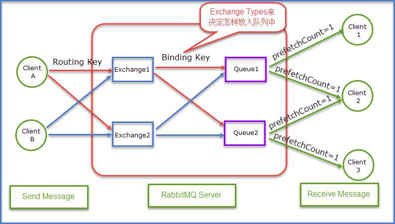
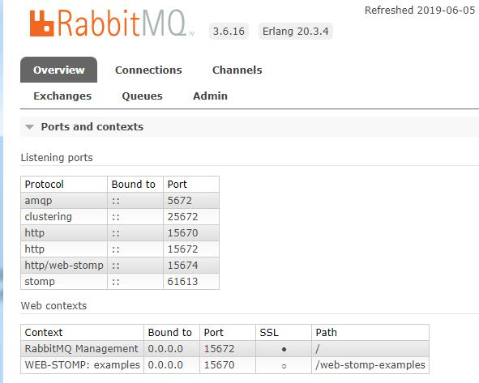
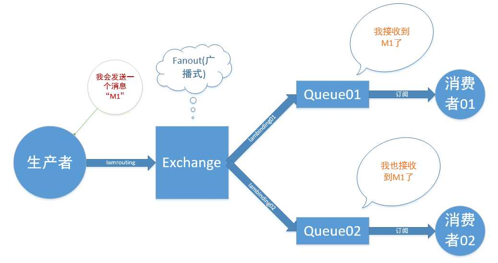
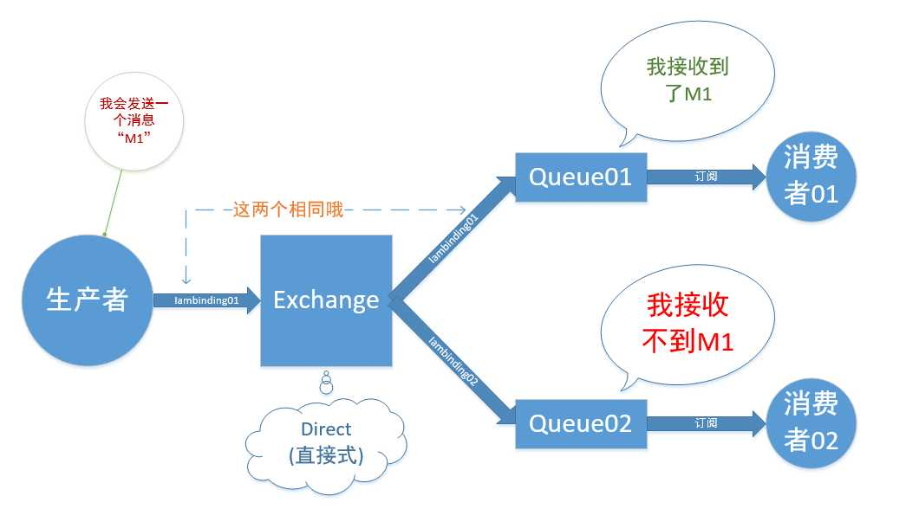
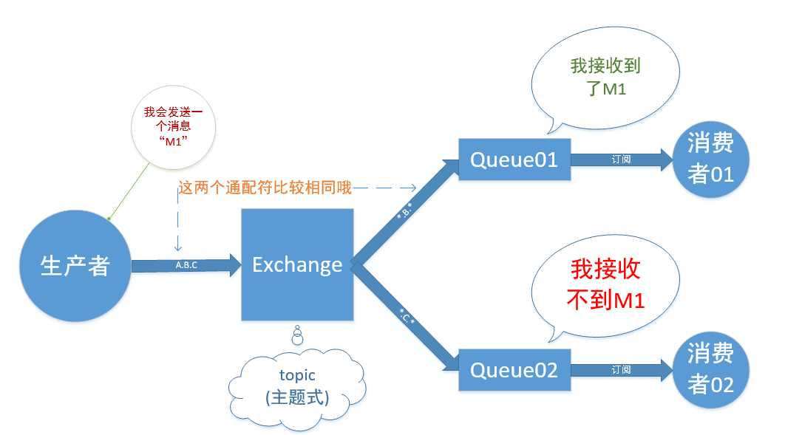

[TOC]


# Idea

## 相关插件

>MybatisPlugin（idea插件）

```
安装方式：Settings -> Plugins -> Intall Plugin from disk -> 选择压缩包即可
```

> MavenRunHelper（idea插件）

```
maven插件，可右键启动、打包、测试mvn项目
```

> Alibaba Java Coding Guidelines-1.0.6（idea插件）

```
ali开发手册的插件版，约束开发习惯
```


> JSON-Handle（Chrome插件）

```java
浏览器输入：'chrome://extensions/' 将下载后的文件拖入浏览器即可
```
> cmder（cmd升级版）http://cmder.net/

```java
mini与full版：差别在于有没有内建 msysgit 工具

右键菜单：'配置系统环境变量,然后使用系统cmd执行命令: Cmder.exe /register ALL'
中文乱码：'settings -> Environment -> 添加: set LANG=zh_CN.UTF-8'
```
> Advanced_Rest_Client_Chrome（Chrome插件）

```
用于调试 http请求，类似 postman
```

>OneTab_v1.18（Chrome插件）

```
将已打开的 chrome 网页，保存成类书签形式，以便后续阅读，减少内存
```


## 常见问题

>复制警告或错误信息

```
1).鼠标光标悬浮在报错的地方，待错误提示出现后，键盘按住 Alt，同时点击鼠标左键，Ctrl+V 到度娘即可。
2).直接在界面的底部右键copy，错误信息显示在底部。
```

> mvn打包时，跳过Test

```java
打开右侧"Maven-Projects"，当前项目'Lifecycle'，选中'Test'，点击菜单栏的"小闪电"，此时Test上多了一条横。
```


## 配置tomcat

导入非 maven 项目的流程：

https://www.cnblogs.com/Miracle-Maker/articles/6476687.html

https://blog.csdn.net/small_mouse0/article/details/77506060

## 基础配置

> class类的doc模板

```java
（1）File -> Setting -> Editor -> File and Code Templates
（2）选择Tab页'Includes'，点击'+'，name填写'File Header'，内容填写
   /**  
    * @desc: TODO
    * @author: ${USER}
    * @date: ${DATE} ${TIME}
    */
```

> 方法的doc模板

```java
（1）File -> Setting -> Editor -> Live Templates
（2）点击最右边+，创建一个Template Group
（3）填写group名，任意填写。选中你刚刚创建的group，创建Live Template

（4）Abbreviation，即快捷方式，可填写 doc，然后在函数体上方输入doc加回车即可
（5）输入注释模板
    /**
    * desc: TODO
    * @author: $user$
    * @date: $date$ $time$
    */
（6）右侧'edit variables'，分别选择 $user$，$date$，$time$ 对应的表达式 user()，date()，time()
（7）设置doc快捷键生效位置：最低端的'change'，打开选择'everywhere'
```


> 快捷键

|                    描述                    |            idea             |       eclipse        |
| :----------------------------------------: | :-------------------------: | :------------------: |
|                  main方法                  |            psvm             |  main（Alt+/补全）   |
|                 输出控制台                 |            sout             |         syso         |
|               for普通 / 增强               |         fori / iter         |   for（Alt+/选择）   |
|                 try/catch                  |         Ctrl+Alt+T          |          *           |
|            自动生成Get/实现方法            |         Alt+Insert          |          *           |
|                                            |                             |                      |
|              抽取变量（方法）              |      Ctrl+Alt+V （M）       |   Shift+Alt+L（M）   |
|                   格式化                   |         Ctrl+Alt+L          |     Ctrl+Shift+F     |
|               代码提示/补全                |       Ctrl+Alt+Space        |        Alt+/         |
|                  导包优化                  |         Ctrl+Alt+O          |     Ctrl+Shift+O     |
|                                            |                             |                      |
|        上下移动单行语句（整个方法）        | Shift+Alt+↑（Shift+Ctrl+↑） |      Alt+↑（）       |
|                 批量重命名                 |          Shift+F6           |     Shift+Alt+R      |
|            注释单行（选中部分）            |   Ctrl+/（Ctrl+Shift+/）    |        Ctrl+/        |
|                  参数提示                  |           Ctrl+P            |                      |
|              查看类的继承关系              |           Ctrl+H            |        Ctrl+T        |
|                   定位行                   |           Ctrl+G            |        Ctrl+L        |
|            整行复制（整行删除）            |      Ctrl+D（Ctrl+X）       | Ctrl+Alt+↓（Ctrl+D） |
|                                            |                             |                      |
|                 大小写转化                 |        Ctrl+Shift+U         |                      |
|                返回上次修改                |    Ctrl+Shift+BackSpace     |                      |
|           当前工作空间查找java类           |      Ctrl+Shift+Alt+N       |                      |
|                 查看类结构                 |            Alt+7            |                      |
|   跳到下(上)一个选择项（配合Ctrl+F使用）   |       F3（Shift+F3）        |                      |
| 在全局（当前类）查找方法调用，可配合F3使用 |      Alt+F7（Ctrl+F7）      |      Ctrl+Alt+H      |
|             折叠（展开）代码块             |   Shift+Ctrl+减号（加号）   | Shift+Ctrl+/（*号）  |
|                                            |                             |                      |
|        调试：跳到下一步（进入代码）        |          F8（F7）           |       F6（*）        |

> 基本设置

```java
//黑色主题 --> 界面的字体大小,非代码字体
Appearance & Behavior - Appearance - Theme(选为Darcula) 
勾选 Override default fonts by(......) - Name(Mircrosoft Yahei UI) - Size(12)
    
//改变代码的字体和大小
Editor - Colors & Fonts
//首先,点击 Save As...,自定义一个名为 skyl 的样式
//然后,选择具体的字体和大小 Primary font(Source Code Pro) - Size(15)
    
//缩进采用4个空格,禁止使用tab字符
Editor - Code Style - java - Tabs and Indents - Use tab character(取消勾选)
    
//自动换行
Editor - Code Style - Java
右侧标签 Wrapping and Braces, (√) Line breaks 和 (√) Ensure right margin is not exceeded
    
//悬浮文档提示
Editor - General - Show quick documentation on...
    
//代码提示忽略大小写
Editor - General - Code Completion - Case sensitive...(None)
//代码补全快捷键: Ctrl + Alt + Space
    
//编码格式
Editor - File Encodings - 3个UTF-8

//显示行号等
Editor - General - Appearance //勾选以下
    (√)Show line number(行号) + (√)Show right margin(右边线) + (√)Show method sep...(方法分割线)

//自动导包
Editor - General - Auto Import 
    Insert imports...(All) + (√)Add unambiguous... + (√)Optimize imports...
    
//设置文件和代码的模板
Editor - File and Code Templates - Includes - 自行添加

//取消单行显示tabs
Editor - General - Editor Tabs - (X)show tabs in single...
    
//自动编译
Build,Exe... - Compiler - (√)Build project automatically
    
//Gradle配置
Build,Exe... - Build Tools - Gradle - Offline work
```

> 版本相关：Alpha，Beta，SNAPSHOT，Release，GA

```java
'Alpha': 内部测试版。一般不向外部发布，会有很多Bug。一般只有测试人员使用。
'Beta': 测试版。这个阶段的版本会一直加入新的功能，在Alpha版之后推出。
'RC(Release Candidate)': 候选版本。不会再加入新的功能，主要着重于除错。
'SNAPSHOT': 不稳定，尚处于开发中的版本。

'GA(General Availability)': 正式发布版本。在国外都是用GA来说明'Release'版本的。
```

# Utils

包名统一使用小写，点分隔符之间有且仅有一个自然语义的英语单词。**包名统一使用单数形式**，但是类名如果有复数含义，**类名可以使用复数形式**。`com.example.spring.util.CommonUtils`

##A001

> 

```java
//获取项目class路径
public static String getClassPath() throws FileNotFoundException {
    // ClassUtils.getDefaultClassLoader().getResource("").getPath();//等同
    return ResourceUtils.getURL("classpath:").getPath();
}

//获取项目根路径
public static String getFilePath() throws FileNotFoundException {
    return ResourceUtils.getURL("").getPath();
}

//系统换行
public static String newline() {
    return System.getProperty("line.separator");
}
```

```

```

> 使用占位符拼接字符串

```java
//域名"www.qq.com"被访问了123.456次
MessageFormat.format("域名{0}被访问了{1}次", "\"www.qq.com\"", 123.456);

//创建格式化的字符串，及连接多个字符串对象：域名"www.qq.com"被访问了123.46次
String.format("域名%s被访问了%3.2f次", "\"www.qq.com\"", 123.456); 

//先转化十六进制,再高位补0
String.format("%04d",Integer.parseInt(String.format("%x", 16))); //0010
```


##B001

> 定时任务：不建议使用Timer

```java
//【强制】线程池不允许使用 Executors 去创建，而是通过 ThreadPoolExecutor 的方式。
//       这样的处理方式让写的同学更加明确线程池的运行规则，规避资源耗尽的风险。
private static ScheduledExecutorService scheduledExecutor = null;

public static ScheduledExecutorService getScheduleExecutor() {
    if (scheduledExecutor == null) {
        synchronized (Test02.class) {
            if (scheduledExecutor == null) {                
                scheduledExecutor = new ScheduledThreadPoolExecutor(10,
                        //源自：org.apache.commons.lang3.concurrent.BasicThreadFactory
                        new BasicThreadFactory.Builder()
                                .namingPattern("schedule-pool-%d")
                                .daemon(true).build());

            }
        }
    }
    return scheduledExecutor;
}
```

```java
    public ScheduledFuture<?> scheduleWithFixedDelay(Runnable command,
                                                     long initialDelay,
                                                     long delay,
                                                     TimeUnit unit);
```

>通过类名获取类的对象

```java
@Component // 获取bean的工具类
public class MyApplicationContextAware implements ApplicationContextAware {

    private static ApplicationContext context;

    // 实现接口的回调方法,设置上下文环境
    @Override
    public void setApplicationContext(ApplicationContext context) throws BeansException {
        MyApplicationContextAware.context = context;
    }

    // 获取applicationContext
    public static ApplicationContext getApplicationContext() {
        return context;
    }

    // 通过name获取Bean.
    public static Object getBean(String name) {
        return context.getBean(name);

    }

    // 通过clazz获取Bean.
    public static <T> T getBean(Class<T> clazz) {
        return context.getBean(clazz);
    }

    // 通过name及clazz返回指定的Bean
    public static <T> T getBean(String name, Class<T> clazz) {
        return context.getBean(name, clazz);
    }
}
```


#log

## 基础概念

> `TRACE < DEBUG < INFO < WARN < ERROR`

日志门面：日志的接口，如slf4j，jcl，jboss-logging
日志实现：具体实现类，如logback，log4j，log4j2，jul

> 配置文件

```java
logback.xml //直接被日志框架加载
logback-spring.xml //跳过日志框架，直接被 SpringBoot 加载，可以使用高级特性 Profile
```

> 配置多环境

```properties
#application.properties 中激活开发环境: spring.profiles.active=dev
开发环境: application-dev.properties ---> logging.level=DEBUG
生产环境: application-pro.properties ---> logging.level=INFO

#动态读取 application.properties 中配置的日志级别
log4j.rootLogger = ${logging.level}, stdout, file
log4j.logger.com.x.controller = ${logging.level}, ctrl
```

> 日志格式

```properties
%t    -> 线程名   
%m    -> 日志主体
%n    -> 平台换行符
%r    -> 自应用启动到输出该log信息耗费的毫秒数
%p    -> 日志级别 {%-5p} --> 5字符长度,左边补空格
%d    -> 时间及格式 %d{yyyy-MMM-dd HH:mm:ss,SSS} --> 2002-10-18 22:10:28,921
```
```properties
#不建议使用,影响效率
#a.不输入： 表示输出完整的<包名>+<类名>
#b.输入0：  表示只输出<类名>
#c.任意数字：表示输出小数点最后边点号之前的字符数量
%c    -> %clength} -> length有三种情况(↑) -> 类全名

%l -> 日志发生位置: 包括类目名,发生的线程,以及在代码中的行数
```

> 输出线程id

slf4j默认不提供线程id输出，不过可利用 'MDC' 特性实现。

```java
//1.配置拦截器：在线程开始时加入 ThreadId; 在线程结束时删除 ThreadId
public class ThreadIdInterceptor implements HandlerInterceptor {
    private final static String THREAD_ID = "ThreadId";

    @Override
    public boolean preHandle(HttpServletRequest request, HttpServletResponse response,
                             Object handler) {
        String ThreadId = java.util.UUID.randomUUID().toString()
            .replaceAll("-", "").toUpperCase();
        MDC.put(THREAD_ID, ThreadId); //加入 ThreadId
        return true;
    }

    @Override
    public void afterCompletion(HttpServletRequest request, HttpServletResponse response,
                                Object handler, Exception ex) {
        // .... 其他逻辑代码

        MDC.remove(THREAD_ID); //删除 ThreadId
    }
}
```
```java
//2.注册拦截器
@Configuration
public class MyWebMvcConfigurer implements WebMvcConfigurer {
    @Override
    public void addInterceptors(InterceptorRegistry registry) {
        registry.addInterceptor(new ThreadIdInterceptor()).addPathPatterns("/**");
    }
}
```
```xml
<!-- 3.logback.xml -->
<property name="CONSOLE_PATTERN" <!-- %X{ThreadId}，输出MDC中key的值 -->
        value="%d{yyyy-MM-dd HH:mm:ss.SSS} %5p [%t] %X{ThreadId} %c{0} - %m%n" />
```
```java
//4.输出结果
2018-12-06 20:59:04.436  INFO [http-nio-8090-exec-1] 41C85FC1684A4F37B64BEFC22D288C0C
    HelloController - 2018-12-06 20:59:04.436 -> 50 - http-nio-8090-exec-1 ==> 
    java.lang.RuntimeException: asyncFuture - / by zero
```
>动态修改日志级别：利用 SpringBoot 的 Actuator 监控

```properties
#所有模块的日志级别
http://127.0.0.1:8090/demo/actuator/loggers
#具体模块的日志级别
http://127.0.0.1:8090/demo/actuator/loggers/com.example.controller

#发送 POST 请求到以上路径，动态修改以上模块的日志级别为 DEBUG，成功状态码为 '204'
POST - 请求体: {"configuredLevel": "DEBUG"} - Content-Type: application/json
```
##日志过滤

> LevelFilter：级别过滤器。根据配置的过滤级别，选择性的接收或拒绝日志

```java
//DENY      -> 日志将立即被抛弃,不再经过其他过滤器
//ACCEPT    -> 日志会被立即处理,..................
//NEUTRAL   -> 有序列表里的下一个过滤器会接着处理日志
```
```xml
<!--A.logback.xml-->
<filter class="ch.qos.logback.classic.filter.LevelFilter"> <!--过滤ERROR-->
    <level>ERROR</level>
    <onMatch>ACCEPT</onMatch>
    <onMismatch>DENY</onMismatch>
</filter>
```
```properties
#B.log4j.properties
log4j.logger.com.x.sm = DEBUG, sm, err ---> sm包日志级别, 输出路径1, 输出路径2

log4j.appender.err.filter.a=org.apache.log4j.varia.LevelRangeFilter ---> 过滤ERROR
log4j.appender.err.filter.a.LevelMin=ERROR
log4j.appender.err.filter.a.LevelMax=ERROR
log4j.appender.err.filter.a.acceptOnMatch=true
log4j.appender.err=org.apache.log4j.DailyRollingFileAppender
log4j.appender.err.File=/var/lib/X/logs/sm/error
log4j.appender.err.DatePattern='.'yyyyMMdd'.log'
log4j.appender.err.layout=org.apache.log4j.PatternLayout
log4j.appender.err.layout.ConversionPattern=%d{HH:mm:ss.SSS} - %m%n
```

> ThresholdFilter：临界值过滤器，`过滤 <配置级别，只输出 >=`

```xml
<!--A.logback.xml-->
<filter class="ch.qos.logback.classic.filter.ThresholdFilter">
    <level>INFO</level>
</filter>
```

```properties
#B.log4j.properties
log4j.logger.com.x.sm = DEBUG, sm, err

log4j.appender.err.Threshold=ERROR
log4j.appender.err=org.apache.log4j.DailyRollingFileAppender
log4j.appender.err.File=/var/lib/webpark/logs/sm/error
log4j.appender.err.DatePattern='.'yyyyMMdd'.log'
log4j.appender.err.layout=org.apache.log4j.PatternLayout
log4j.appender.err.layout.ConversionPattern=%d{HH:mm:ss.SSS} - %m%n
```

## 异步输出

每次输出日志就会发生一次磁盘IO，损耗性能。

异步输出，不让此次写日志发生磁盘IO，阻塞日志线程，从而减少不必要的性能损耗。

```xml
<!--同步appender-->
<appender name="info" class="ch.qos.logback.core.rolling.RollingFileAppender">
    //... ...
</appender>
```

```xml
<!--异步appender 必须跟在同步后面,否则不起作用-->
<appender name="async4info" class="ch.qos.logback.classic.AsyncAppender">

    <!--当 BlockingQueue 还有20%容量，将丢弃 TRACE、DEBUG 和 INFO 级别的日志-->
    <!--只保留 WARN 和 ERROR 级别的日志。为保持所有的日志，将该值设置为0。默认值20-->
    <discardingThreshold>0</discardingThreshold>
    <queueSize>256</queueSize> <!--BlockingQueue 的最大容量,该值影响性能. 默认值256-->

    <!--异步appender并不自己写日志，只是将日志输出到 BlockingQueue-->
    <!--最终还是具体的appender将日志输出到文件-->
    <!--图示详见: http://www.importnew.com/27247.html-->
    <appender-ref ref="info"/>
</appender>
```

## 框架切换

> logback ---> log4j

```xml
<dependency>
    <groupId>org.springframework.boot</groupId>
    <artifactId>spring-boot-starter-thymeleaf</artifactId>
    <exclusions>
        <exclusion> <!--根据 Dependency Hierarchy 界面,搜索"logback"找到其父依赖-->
            <groupId>org.springframework.boot</groupId>
            <artifactId>spring-boot-starter-logging</artifactId> <!--排除boot自带logging-->
        </exclusion>
    </exclusions>
</dependency>
<dependency>
    <groupId>org.springframework.boot</groupId> <!--引入'log4j'-->
    <artifactId>spring-boot-starter-log4j</artifactId>
    <version>1.3.8.RELEASE</version>
</dependency>
```

> logback ---> log4j2

```xml
<dependency>
    <groupId>org.springframework.boot</groupId>
    <artifactId>spring-boot-starter-web</artifactId>
    <exclusions>
        <exclusion>
            <groupId>org.springframework.boot</groupId> <!--排除boot自带'logging'-->
            <artifactId>spring-boot-starter-logging</artifactId>
        </exclusion>
    </exclusions>
</dependency>
<dependency>
    <groupId>org.springframework.boot</groupId>    <!--引入'log4j2'包-->
    <artifactId>spring-boot-starter-log4j2</artifactId>
</dependency>
```

## DEMO

> logback

```xml
<?xml version="1.0" encoding="UTF-8"?>

<!-- scan: 配置文件发生改变,是否重新加载,默认 true -->
<!-- scanPeriod: 监测配置文件是否改变的频率(scan为true时才生效),默认1分钟.如未给出时间单位,默认毫秒-->
<!-- debug: 是否打印logback内部日志信息,实时查看logback运行状态. 默认 false -->
<configuration scan="true" scanPeriod="60 seconds" debug="false">

    <!-- 设置上下文, 一旦设置，不能修改,可以通过 %contextName 在日志中输出上下文对应的值 -->
    <!-- <contextName>logback</contextName> 
    <property name="PATTERN_FILE" value="%d{HH:mm:ss.SSS} %contextName [%5level] %logger{5} - %m%n" /> -->

    <!--加载外部的yml配置文件.(文件名不能使用 logback.xml,加载太早,必须改为 logback-spring.xml)-->
    <!--scope固定值,用${}取值; name配置文件中属性对应的变量名; source配置文件中属性，defaultValue为缺省值 -->
    <!-- <springProperty scope="context" name="LOG_HOME" source="aopAll.home" defaultValue="blues/logs" />-->

    <!-- 设置变量 -->
    <!-- <property name="LOG_HOME" value="${LOG_HOME}" />--> <!-- 对应上面的加载外部配置文件-->
    <!-- <property name="APP_NAME" value="blue"/>-->
    <!-- <property name="LOG_HOME" value="${APP_NAME}/logs"/>-->

    <property name="LOG_HOME" value="logs" />
    <property name="PATTERN_CONSOLE" value="%d{yyyy-MM-dd HH:mm:ss.SSS} [%5p] [%t] - %m%n" />
    <property name="PATTERN_FILE" value="%d{HH:mm:ss.SSS} [%5p] [%t] - %m%n" />

    <!-- CTRL_DEBUG -->
    <!-- 滚动记录文件: 先将日志记录到临时文件,当符合某个条件时,再将日志归档到目标文件 -->
    <appender name="CTRL_DEBUG" class="ch.qos.logback.core.rolling.RollingFileAppender">

        <!-- 可选节点,归档前临时文件的路径,不指定则直接写入归档后的目标文件 -->
        <file>${LOG_HOME}/ctrl/debug/debug</file>

        <!-- 按照'大小和时间'两种策略综合滚动 -->
        <rollingPolicy class="ch.qos.logback.core.rolling.SizeAndTimeBasedRollingPolicy">
            <!-- 必选节点,归档后文件路径 -->
            <!-- 支持.zip和.gz压缩模式,(单个文件超过最大容量才会压缩,后缀名改为.zip即可压缩) -->
            <!-- 每小时一归档: 当大小超过 maxFileSize 时,按照 i 进行文件归档 -->
            <fileNamePattern>${LOG_HOME}/ctrl/debug/debug_%d{yyyyMMdd_HH}_%i.zip
            </fileNamePattern>

            <!-- 单个日志文件最大1MB, 最多保存5个小时的日志, 总日志大小不能超过5MB -->
            <!-- 当 MaxHistory 或 totalSizeCap 都满足时,自动删除旧的日志 -->
            <maxFileSize>1MB</maxFileSize>
            <MaxHistory>5</MaxHistory>
            <totalSizeCap>5MB</totalSizeCap>
        </rollingPolicy>

        <encoder>  <!-- 日志输出格式 -->
            <pattern>${PATTERN_FILE}</pattern>
        </encoder>
    </appender>

    <!--  异步appender 必须跟在同步后面,否则不起作用  -->
    <appender name="CTRL_DEBUG_ASYNC" class="ch.qos.logback.classic.AsyncAppender">
        <!--当 BlockingQueue 还有20%容量,将丢弃 TRACE,DEBUG,INFO 级别的event,只保留 WARN和ERROR 级别的event-->
        <!--为保持所有的events,将该值设置为0. 默认值20 -->
        <discardingThreshold>0</discardingThreshold>
        <!-- BlockingQueue 的最大容量,该值影响性能. 默认值256 -->
        <queueSize>256</queueSize>
        <!-- 异步appender并不自己写日志,只是将日志输出到 BlockingQueue,最终还是具体的appender将日志输出到文件 -->
        <!-- 图示详见: http:www.importnew.com/27247.html -->
        <appender-ref ref="CTRL_DEBUG" />
    </appender>

    <!-- CTRL_WARN -->
    <appender name="CTRL_WARN" class="ch.qos.logback.core.rolling.RollingFileAppender">
        <file>${LOG_HOME}/ctrl/warn/warn</file>
        <rollingPolicy class="ch.qos.logback.core.rolling.SizeAndTimeBasedRollingPolicy">
            <fileNamePattern>${LOG_HOME}/ctrl/warn/warn_%d{yyyyMMdd_HH}_%i.log
            </fileNamePattern>
            <maxFileSize>1MB</maxFileSize>
            <MaxHistory>5</MaxHistory>
            <totalSizeCap>5MB</totalSizeCap>
        </rollingPolicy>
        <encoder>
            <pattern>${PATTERN_FILE}</pattern>
        </encoder>

        <!--LevelFilter: 级别过滤器. 等于配置级别,根据 onMath 和 onMismatch 接收或拒绝日志 -->
        <!--ThresholdFilter: 临界值过滤器,过滤掉低于指定临界值的日志(只输出等于或高于临界值的日志).->
        <filter class="ch.qos.logback.classic.filter.LevelFilter">
            <level>WARN</level>  //<!-- ONLY WARN -->
            <onMatch>ACCEPT</onMatch>
            <onMismatch>DENY</onMismatch>
        </filter>
    </appender>

    <!-- CTRL_ERROR -->
    <appender name="CTRL_ERROR" class="ch.qos.logback.core.rolling.RollingFileAppender">
        <file>${LOG_HOME}/ctrl/error/error</file>
        <rollingPolicy class="ch.qos.logback.core.rolling.SizeAndTimeBasedRollingPolicy">
            <fileNamePattern>${LOG_HOME}/ctrl/error/error_%d{yyyyMMdd_HH}_%i.log
            </fileNamePattern>
            <maxFileSize>1MB</maxFileSize>
            <MaxHistory>5</MaxHistory>
            <totalSizeCap>5MB</totalSizeCap>
        </rollingPolicy>
        <encoder>
            <pattern>${PATTERN_FILE}</pattern>
        </encoder>
        <filter class="ch.qos.logback.classic.filter.ThresholdFilter">
            <level>ERROR</level>  <!-- ERROR+ -->
        </filter>
    </appender>

    <!-- 控制台 -->
    <appender name="CONSOLE" class="ch.qos.logback.core.ConsoleAppender">
        <encoder>
            <pattern>${PATTERN_CONSOLE}</pattern>
        </encoder>
    </appender>

    <!-- LOGFILE -->
    <appender name="LOGFILE" class="ch.qos.logback.core.rolling.RollingFileAppender">
        <file>${LOG_HOME}/log</file>
        <rollingPolicy class="ch.qos.logback.core.rolling.SizeAndTimeBasedRollingPolicy">
            <fileNamePattern>${LOG_HOME}/log_%d{yyyyMMdd}_%i.log</fileNamePattern>
            <maxFileSize>1MB</maxFileSize>
            <MaxHistory>5</MaxHistory>
            <totalSizeCap>5MB</totalSizeCap>
        </rollingPolicy>
        <encoder>
            <pattern>${PATTERN_FILE}</pattern>
        </encoder>
    </appender>

    <!-- 必选节点; 特殊的logger元素,用来指定最基础的日志输出级别 -->
    <root level="info" additivity="true">
        <appender-ref ref="CONSOLE" />
        <appender-ref ref="LOGFILE" />
    </root>

    <!-- 可选节点; 设置某个包或具体某个类的日志级别,以及<appender> (覆盖root节点的输出级别) -->
    <!-- name: 受此logger约束的某一个包或具体某一个类 -->
    <!-- level: 日志级别, 默认继承上级的打级别 -->
    <!-- additivity: 是否向上级logger传递打印信息. 默认是true -->
    <logger name="com.example.spring.controller" level="DEBUG">
        <appender-ref ref="CTRL_DEBUG_ASYNC" /> <!-- DEBUG+ -->
        <appender-ref ref="CTRL_WARN" /> <!-- ONLY WARN -->
        <appender-ref ref="CTRL_ERROR" /> <!-- ERROR+ -->
    </logger>
</configuration>
```

> log4j

```properties
#系统 -> 配置(基础-级别, 控制台, 文件)
#log4j.rootCategory=INFO, CONSOLE, LOGFILE //rootCategory 已过时
log4j.rootLogger=INFO, CONSOLE, LOGFILE

#系统 -> 控制台
log4j.appender.CONSOLE=org.apache.log4j.ConsoleAppender
log4j.appender.CONSOLE.layout=org.apache.log4j.PatternLayout
log4j.appender.CONSOLE.layout.ConversionPattern=%d{yyyy-MM-dd HH:mm:ss.SSS} [%5p] [%t] - %m%n

#系统 -> 文件
log4j.appender.LOGFILE=org.apache.log4j.DailyRollingFileAppender
log4j.appender.LOGFILE.file=/logs/log
log4j.appender.LOGFILE.DatePattern='_'yyyyMMdd'.log'
log4j.appender.LOGFILE.layout=org.apache.log4j.PatternLayout
log4j.appender.LOGFILE.layout.ConversionPattern= %d{HH:mm:ss.SSS} [%5p] [%t] - %m%n

#controller -> 配置 -> (包-级别, 文件1, 文件2, 文件3)
log4j.logger.com.example.spring.controller=DEBUG, CTRL_DEBUG, CTRL_WARN, CTRL_ERROR

#controller -> 文件1 -> DEBUG+
log4j.appender.CTRL_DEBUG=org.apache.log4j.DailyRollingFileAppender
log4j.appender.CTRL_DEBUG.File=/logs/ctrl/debug
log4j.appender.CTRL_DEBUG.DatePattern='_'yyyyMMdd_HH'.log'
log4j.appender.CTRL_DEBUG.layout=org.apache.log4j.PatternLayout
log4j.appender.CTRL_DEBUG.layout.ConversionPattern=%d{HH:mm:ss.SSS} [%5p] [%t] - %m%n

#controller -> 文件2 -> ONLY WARN
log4j.appender.CTRL_WARN.filter.a=org.apache.log4j.varia.LevelRangeFilter
log4j.appender.CTRL_WARN.filter.a.LevelMin=WARN
log4j.appender.CTRL_WARN.filter.a.LevelMax=WARN
log4j.appender.CTRL_WARN.filter.a.acceptOnMatch=true
log4j.appender.CTRL_WARN=org.apache.log4j.DailyRollingFileAppender
log4j.appender.CTRL_WARN.File=/logs/ctrl/warn/warn
log4j.appender.CTRL_WARN.DatePattern='_'yyyyMMdd_HH'.log'
log4j.appender.CTRL_WARN.layout=org.apache.log4j.PatternLayout
log4j.appender.CTRL_WARN.layout.ConversionPattern=%d{HH:mm:ss.SSS} [%5p] - %m%n

#controller -> 文件3 -> ERROR+
log4j.appender.CTRL_ERROR.Threshold=ERROR
log4j.appender.CTRL_ERROR=org.apache.log4j.DailyRollingFileAppender
log4j.appender.CTRL_ERROR.File=/logs/ctrl/error/error
log4j.appender.CTRL_ERROR.DatePattern='_'yyyyMMdd_HH'.log'
log4j.appender.CTRL_ERROR.layout=org.apache.log4j.PatternLayout
log4j.appender.CTRL_ERROR.layout.ConversionPattern=%d{HH:mm:ss.SSS} [%5p] [%t] - %m%n
```


# WebSocket

## 基础概念

```xml
<dependency>
    <groupId>org.springframework.boot</groupId>
    <artifactId>spring-boot-starter-websocket</artifactId>
</dependency>
```

> 简介

B/S结构的软件项目中有时客户端需要实时的获得服务器消息，但默认HTTP协议只支持 `请求响应模式`。 对于这种需求可以通过 polling，Long-polling，长连接，Flash-Socket，HTML5中定义的WebSocket 完成。

HTTP模式可以简化Web服务器，减少服务器的负担，加快响应速度，因为服务器不需要与客户端长时间建立一个通信链接。但不容易直接完成实时的消息推送功能（如聊天室，后台信息提示，实时更新数据等）。

应用程序通过 Socket 向网络发出请求或者应答网络请求。Socket 可以使用TCP/IP协议或UDP协议。

```java
TCP协议：面向连接的，可靠的，基于字节流的传输层通信协议，负责数据的可靠性传输问题。
UDP协议："无连接，不可靠"，基于报文的传输层协议，优点：发送后不用管，速度比TCP快。

HTTP协议："无状态协议"，通过 Internet 发送请求消息和响应消息，默认使用80端口。（底层Socket）
```

> Http协议

HTTP 协议原本是设计用于传输简单的文档和文件，而非实时的交互。

根据 HTTP 协议，一个客户端如浏览器，向服务器打开一个连接，发出请求，等待回应，之后关闭连接。如果客户端需要更多数据，则需要打开一个新连接，以此循环往复。如果服务器有了新的信息，它必须等待客户端发出请求而不是立即发送消息。

那么要看到页面中要展示信息的最新情况，应该怎么办？不断刷新！

缺点：这种方式现在已经被完全淘汰，发送了很多不必要的请求，浪费大量带宽，页面不断刷新，用户体验差，而且做不到真正的实时，服务端有了新数据也不能立马推送给客户端，使得秒级的实时信息交互难以实现。

> 双向通信

HTTP协议决定了服务器与客户端之间的连接方式，无法直接实现消息推送（F5已坏），一些变相的解决办法：

1. 轮询（Polling）

   客户端定时向服务器发送Ajax请求，服务器接到请求后马上返回响应信息并关闭连接。

   优点：后端程序编写比较容易

   缺点：请求中有大半是无用，浪费带宽和服务器资源

   实例：适于小型应用

2. 长轮询（Long-Polling）

   客户端向服务器发送Ajax请求，服务器接到请求后hold住连接，直到有新消息才返回响应信息并关闭连接。客户端处理完响应信息后再向服务器发送新的请求

   优点：在无消息的情况下不会频繁的请求，耗费资小

   缺点：服务器hold连接会消耗资源，返回数据顺序无保证，难于管理维护

   实例：WebQQ，Hi网页版，Facebook-IM

3. 长连接

   在页面里嵌入一个隐蔵iframe，将这个隐蔵iframe的src属性设为对一个长连接的请求或是采用xhr请求，服务器端就能源源不断地往客户端输入数据

   优点：消息即时到达，不发无用请求，管理起来也相对便

   缺点：服务器维护一个长连接会增加开销

   实例：Gmail聊天

4. Flash-Socket

   在页面中内嵌入一个使用了Socket类的 Flash 程序，JavaScript通过调用此Flash程序提供的Socket接口，与服务器端的Socket接口进行通信，JavaScript在收到服务器端传送的信息后控制页面的显示。

   优点：实现真正的即时通信,而不是伪即时
   缺点：客户端必须安装Flash插件，非HTTP协议，无法自动穿越防火墙
   实例：网络互动游戏

5. Websocket

   Html5提供的一种浏览器与服务器间进行全双工通讯的网络技术。依靠这种技术可以实现客户端和服务器端的长连接，双向实时通信。

   优点：事件驱动，异步，使用ws或者wss协议的客户端socket，能够实现真正意义上的推送功能。

   缺点：少部分浏览器不支持，浏览器支持的程度与方式有区别。


> WebSocket

Websocket 允许通过js与远程服务器建立连接，从而实现客户端与服务器间双向的通信。Websocket 的url开头是ws，如果需要ssl加密可以使用wss。

当调用构造方法构建一个 Websocket 对象后，就可以进行即时通信了`（new WebSocket(url)）`。

## 客户端

```html
<body>
    <input id="text" type="text"/>
    <button onclick="send()">Send</button>
    <button onclick="closeWebSocket()">Close</button>
    <div id="message"></div>
</body>
<script type="text/javascript">
    var websocket = null;

    //判断当前浏览器是否支持WebSocket
    if (!'WebSocket' in window) {
        alert('浏览器不支持WebSocket')
    } else {
        var userId = parseInt(Math.random() * (99 + 1), 10); //生成[0,99]的任意随机数
        websocket = new WebSocket("ws://localhost:8090/demo/websocket?id=" + userId);

        //监听事件 -> 连接成功建立时触发该事件
        websocket.onopen = function (event) {
            setMessageInnerHTML("open: " + new Date());
        };

        //监听事件 -> 连接关闭
        websocket.onclose = function (event) {
            setMessageInnerHTML("close: " + new Date() + " - " + event.code);
            websocket.send(event.code);
        };

        //监听事件 -> 接收到服务器发来的消息
        websocket.onmessage = function (event) {
            setMessageInnerHTML(event.data);
        };

        //监听事件 -> 连接发生错误
        websocket.onerror = function () {
            setMessageInnerHTML("error: " + new Date());
        };

        //监听事件 -> 监听窗口关闭事件
        //当窗口关闭时，主动去关闭websocket连接，防止连接还没断开就关闭窗口，server端会抛异常
        window.onbeforeunload = function () {
            if (null != websocket) {
                websocket.close();
            }
        };

        //将消息显示在网页上
        function setMessageInnerHTML(innerHTML) {
            document.getElementById('message').innerHTML += innerHTML + '<br/>';
        }

        //关闭连接
        function closeWebSocket() {
            websocket.close();
        }

        //向远程服务器发送数据
        function send() {
            var message = document.getElementById('text').value;
            websocket.send(message);
        }
    }
</script>
```

## 服务端

```java
@Configuration
public class WebSocketConfig {

    //这个bean会自动注册使用 @ServerEndpoint 注解声明的 WebSocket-Endpoint.
    //注意: 如果使用独立的servlet容器，而不是直接使用 SpringBoot 内置容器，就不要注入此bean，
    //因为它将由容器自己提供和管理
    @Bean
    public ServerEndpointExporter serverEndpointExporter() {
        return new ServerEndpointExporter();
    }
}
```

```java
// 使用 SpringBoot 要使用注解 @Component
// 使用独立容器(tomcat)是由容器自己管理 WebSocket，但在 SpringBoot 中连容器都是 Spring 管理。
//
// 虽然 @Component 默认是单例模式的
// 但 SpringBoot 还是会为每个 WebSocket 连接初始化一个bean,所以可以用一个静态 Set/Map 保存起来.
@Component

// 使用注解 @ServerEndpoint 可以将一个普通Java类作为 WebSocket 服务器的端点
// 使用 ServerEndpoint 注解的类必须有一个公共的无参数构造函数.
//
// WebSocket 服务端运行在 ws://[Server端IP或域名]:[Server端口]/项目/push
// 客户端浏览器已经可以对WebSocket客户端API发起 <<<HTTP长连接>>>.
@ServerEndpoint("/push")
public class EchoEndpoint {

    //客户端注册时调用
    @OnOpen
    public void onOpen(Session session) {}

    //客户端关闭
    @OnClose
    public void onClose(Session session, CloseReason reason) {}

    //客户端异常
    @OnError
    public void onError(Throwable t) {}

    //收到浏览器客户端消息后调用
    @OnMessage
    public void onMessage(String message) {}

    //更高级的注解，MaxMessageSize 属性可以被用来定义消息字节最大限制，
    //在示例程序中，如果超过6个字节的信息被接收，就报告错误和连接关闭。
    // @Message(maxMessageSize = 6)
    // public void receiveMessage(String s) {
    // }
}
```

## 后台Demo

```java
@Component
@ServerEndpoint(value = "/websocket")
public class MyWebSocket {
    
    // 静态变量，用来记录当前在线连接数。应该把它设计成线程安全的
    private static int onlineCount = 0;

    // 旧版：concurrent包的线程安全Set，用来存放每个客户端对应的 MyWebSocket 对象
    // private static CopyOnWriteArraySet<MyWebSocket> webSocketSet =
    //         new CopyOnWriteArraySet<>();

    //新版：使用map对象，便于根据 userId 来获取对应的 MyWebSocket
    private static Map<String, MyWebSocket> webSocketMap = new ConcurrentHashMap<>();

    //区别: 非静态变量 和 静态变量
    //与某个客户端的连接会话,需要通过它来给客户端发送数据
    private Session session;

    //当前会话session对应的显式id
    private String userId;

    //客户端注册
    @OnOpen
    public void onOpen(Session session) {
        String id = this.userId = session.getRequestParameterMap().get("id").get(0);
        this.session = session;
        addOnlineCount(); //在线数加1
        webSocketMap.put(id, this); //加入Map
        System.out.println("有新连接加入: " + this.userId + " 当前在线人数为: "
                + getOnlineCount());

        sendMsg2All(this.userId + " - 已上线! 欢迎");
    }

    //客户端关闭
    @OnClose
    public void onClose() {
        if (null != webSocketMap.get(this.userId)) {
            subOnlineCount(); //在线数减1
            webSocketMap.remove(this.userId); //从Map中删除
            System.out.println("有一连接关闭: " + this.userId + " 当前在线人数为: " 
                    + getOnlineCount() + reason);

            sendMsg2All(this.userId + " - 已下线! 再见");
        }
    }

    //客户端异常
    @OnError
    public void onError(Session session, Throwable error) {
        System.out.println("发生错误: " + error);
        error.printStackTrace();
    }

    ///收到浏览器客户端消息后调用的方法
    @OnMessage
    public void onMessage(String message, Session session) {
        System.out.println("来自客户端的消息: " + this.userId + " - " + message);

        if (message.contains("-")) {
            String[] split = message.split("-");
            webSocketMap.keySet().forEach(x -> {
                if (split[0].equalsIgnoreCase(x))
                    sendMsg2One(this.userId + "->" + x + " - " + split[1], x); //点对点
            });
        } else {
            sendMsg2All(userId + " - " + message); //群发
        }
    }

    ///群发消息
    public static void sendMsg2All(String message) {
        webSocketMap.values().forEach(x -> x.sendMsg(message));
    }

    ///点对点发送消息
    public static void sendMsg2One(String message, String userId) {
        webSocketMap.get(userId).sendMsg(message);
    }

    ///实现服务器主动推送
    private void sendMsg(String message) {
        try {
            this.session.getBasicRemote().sendText(message);
            // this.session.getAsyncRemote().sendText(message);
        } catch (IOException e) {
            System.out.println("异常---发送消息: " + e);
        }
    }

    //三个同步方法,线程安全
    private static synchronized int getOnlineCount() {
        return onlineCount;
    }

    private static synchronized void addOnlineCount() {
        MyWebSocket.onlineCount++;
    }

    private static synchronized void subOnlineCount() {
        MyWebSocket.onlineCount--;
    }
}
```


# fastjson

##基础概念

```xml
<dependency>
    <groupId>com.alibaba</groupId>
    <artifactId>fastjson</artifactId>
    <version>1.2.47</version>
</dependency>
```

>`getIntValue()和getInteger()`的区别

```java
json.getInteger("a"); //null --->对于空的key
json.getIntValue("a"); //0
```

##相互转化

> X ---> JSONString 

```java
String json = JSON.toJSONString(list / map / javabean);
String json = JSON.toJSONString(list, true);//args1: json是否格式化(有空格和换行).
```

> JSONString --->X `必须有空构造方法`

```java
Dog dog = JSON.parseObject(json, Dog.class);
Map map = JSON.parseObject(json, Map.class);
List<Dog> list = JSON.parseArray(json, Dog.class);
```

> X ---> JSONObject，先转换为JSONString。其中，`javabean必须有get/set`

```java
JSONObject obj = JSON.parseObject(JSON.toJSONString(dog));//javabean
JSONObject obj = JSON.parseObject(JSON.toJSONString(map));//map
JSONArray array = JSON.parseArray(JSON.toJSONString(list));//list
```
##Null值处理

> null值处理：list ---> JSONString

```java
QuoteFieldNames         //输出key时是否使用双引号，默认为true
WriteMapNullValue       //是否输出值为null的字段，默认为false
WriteNullListAsEmpty    //List字段如果为null，输出为[]，而非null
WriteNullNumberAsZero   //数值字段如果为null，输出为0，而非null
WriteNullBooleanAsFalse //Boolean字段如果为null，输出为false，而非null

WriteNullStringAsEmpty  //字符类型字段如果为null，输出为""，而非null (√，默认不输出null字段)
```

```java
List<Dog> list = Arrays.asList(new Dog("11", 11), new Dog(null, 22));

// [{"age":11,"name":"11"},{"age":22}] ---> 默认不输出null字段
// String json = JSON.toJSONString(list);

// [{"age":11,"name":"11"},{"age":22,"name":""}]
String json = JSON.toJSONString(list, SerializerFeature.WriteNullStringAsEmpty);
```

##Boot配置

> SpringBoot2.x默认使用 jacksonJson 解析，现转换为 fastjson，并且解决中文乱码问题。

```java
@Configuration
public class WebMvcConfig extends WebMvcConfigurationSupport {
    @Override
    public void configureMessageConverters(List<HttpMessageConverter<?>> converters) {
        //1.构建了一个消息转换器 converter
        FastJsonHttpMessageConverter converter = new FastJsonHttpMessageConverter();

        //2.添加fastjson配置,如: 是否格式化返回的json数据;设置编码方式
        FastJsonConfig config = new FastJsonConfig();

        config.setSerializerFeatures(SerializerFeature.PrettyFormat);//格式化

        List<MediaType> list = new ArrayList<>();//中文乱码
        list.add(MediaType.APPLICATION_JSON_UTF8);
        converter.setSupportedMediaTypes(list);

        //3.在消息转换器中添加fastjson配置
        converter.setFastJsonConfig(config);
        converters.add(converter);
    }
}
```


# HttpClient

##基础概念

```xml
<dependency>
    <groupId>org.apache.httpcomponents</groupId>
    <artifactId>httpclient</artifactId>
</dependency>
```
> 区别 GET & POST

```java
超链接<a/>    ---> //只能用 GET 提交HTTP请求
表单<form/>   ---> //可以用 GET，POST .......

GET          ---> //参数只能在请求行（request-line）
POST         ---> //参数可在请求行，亦可在请求体（request-body）
```
> 区别 URL & URI：http://ip:port/demo/hello/hello & /demo/hello/hello

<https://www.cnblogs.com/wuyun-blog/p/5706703.html>

<https://blog.csdn.net/koflance/article/details/79635240>

## GET-请求行

> 两种方式获取HttpGet

```java
//(1).直接将参数拼接在 URI 之后
String uri = "http://127.0.0.1:8090/demo/http/get?name=中国&age=70";
HttpGet httpGet = new HttpGet(uri);
```
```java
//(2).通过 URIUtils 工具类生成带参数的 URI
String param = "name=中国&age=70";
// String param = "name=" + URLEncoder.encode("中国", "UTF-8") + "&age=70"; //中文参数,encode
URI uri = URIUtils.createURI("http", "127.0.0.1", 8090, "/demo/http/get", param, null);
HttpGet httpGet = new HttpGet(uri);
```

## POST-请求行

> 两种方式获取httpPost （同GET）

```java
//(1).拼接字符串
String uri = "http://127.0.0.1:8090/demo/http/post?name=中国&age=70";
HttpPost httpPost = new HttpPost(uri);
```

```java
//(2).工具类 URIUtils
String param = "name=中国&age=70";
// String param = "name=" + URLEncoder.encode("中国", "UTF-8") + "&age=70"; //中文参数,encode
URI uri = URIUtils.createURI("http", "127.0.0.1", 8090, "/demo/http/post", param, null);
HttpPost httpPost = new HttpPost(uri);
```

## POST-请求体

> 传输 表单键值对 keyValue

```java
//1.POST表单
List<NameValuePair> nvps = new ArrayList<>();
nvps.add(new BasicNameValuePair("name", "中国"));
nvps.add(new BasicNameValuePair("age", "70"));
UrlEncodedFormEntity entity = new UrlEncodedFormEntity(nvps, "UTF-8"); //中文乱码

HttpPost httpPost = new HttpPost("http://127.0.0.1:8090/demo/http/post");
httpPost.setEntity(entity);
```

```java
//2.查看HTTP数据
System.out.println(entity.getContentType()); //Content-Type: application/x-www-form-urlencoded; charset=UTF-8
System.out.println(entity.getContentLength()); //30
System.out.println(EntityUtils.toString(entity)); //name=%E4%B8%AD%E5%9B%BD&age=70
```

> 传输 JSON

```java
String json = "{\"name\":\"中国\",\"age\":\"70\"}";
StringEntity entity = new StringEntity(json, "UTF-8"); //中文乱码,默认"ISO-8859-1"
entity.setContentEncoding("UTF-8");
entity.setContentType("application/json");//设置contentType --> json

HttpPost httpPost = new HttpPost("http://127.0.0.1:8090/demo/http/postBody");
httpPost.setEntity(entity);
```

> 传输 File

```xml
<!-- HttpClient-File -->
<dependency>
    <groupId>org.apache.httpcomponents</groupId>
    <artifactId>httpmime</artifactId>
</dependency>
```

```html
<!-- 前台页面 -->
<form action="http://127.0.0.1:8090/demo/http/postFile" method="POST" enctype="multipart/form-data">  
    <input type="text" name="fileName" value="中国"/>  
    <input type="file" name="file"/>  
    <inupt type="submit" value="提交"/>  
</form>
```

```java
//后台逻辑
MultipartEntityBuilder builder = MultipartEntityBuilder.create();
ContentType contentType = ContentType.create("text/plain","UTF-8");//中文乱码,默认"ISO-8859-1"
builder.addTextBody("fileName", "中国", contentType);
builder.addBinaryBody("file", new File("C:\\Users\\BlueCard\\Desktop\\StatusCode.png"));
HttpEntity entity = builder.build();

HttpPost httpPost = new HttpPost("http://127.0.0.1:8090/demo/http/postFile");
httpPost.setEntity(entity);
```

## 请求结果解析

请求结果解析通用于 GET 和 POST。

```java
String uri = "http://127.0.0.1:8090/demo/http/get?name=中国&age=70";
HttpGet httpGet = new HttpGet(uri); //组装请求-GET
// HttpPost httpPost = new HttpPost(uri); //组装请求-POST

try (CloseableHttpResponse httpResponse =
             HttpClients.createDefault().execute(httpGet)) { //发送请求，连接自动关闭
    if (null != httpResponse && HttpStatus.SC_OK ==
            httpResponse.getStatusLine().getStatusCode()) {
        String res = EntityUtils.toString(httpResponse.getEntity(), "UTF-8"); //获取结果
        System.out.println(res);
    }
} catch (IOException e) {
    e.printStackTrace();
}
```


#Commons

## Lang

```xml
<dependency>
    <groupId>org.apache.commons</groupId>
    <artifactId>commons-lang3</artifactId>
</dependency>
```

> StringUtils

```java
//null和""
boolean empty = StringUtils.isEmpty(" "); //false

//null和""，以及" "
boolean blank = StringUtils.isBlank(""); //true

//删除所有空格（空格+制表符+换行）
String deleteWhitespace = StringUtils.deleteWhitespace("   ab   c  "); //abc

//trim()的升级版，去除前导和后续的指定字符，不再限于空白符
String trim = StringUtils.strip("01 2 30", "0"); //1 2 3

//stripAll：去除字符串数组中每个元素中的指定字符
String[] strs = {"010", "02", "30"};
String[] stripAll = StringUtils.stripAll(strs, "0"); //1 2 3
```

```java
//判断是否包含这个字符
boolean contains = StringUtils.contains("中华人民共和国", "共和"); //true

//截取从from开始字符串，区分大小写。截取失败返回空字符串""
String from = StringUtils.substringAfter("SELECT * FROM PERSON", "from"); //""

//截取左边两个字符
String left = StringUtils.left("中华人民共和国", 2); //中华

//在左边填充指定字符,使之总长度为6
String x = StringUtils.leftPad("123", 6, '0'); //000123
String format = String.format("%06d", 123); //jdk自带，不好用。000123
```

```java
//判断该字符串是不是为数字(0~9)组成，如果是，返回true。但该方法不识别有小数点和 请注意。
boolean numeric = StringUtils.isNumeric("45453.4");//false

//将数组中的内容以","分隔
List<String> list = Arrays.asList("a", "b", "c");
String join = StringUtils.join(list, ","); //a,b,c

//首字母大写
String capitalize = StringUtils.capitalize("中华人民共和国"); //Abc
```

```java
//字符串进行省略操作，省略字符以省略号填充，最小长度为4（省略号占3个字符）
StringUtils.abbreviate("abcdefg", 6); //abc...
StringUtils.abbreviate("abcdefg", 4); //a...
StringUtils.abbreviate("abcdefg", 3); //IllegalArgumentException
```

> NumberUtils

```java
int i = NumberUtils.toInt("5f", 5); //字符串转int，默认值5

boolean parsable = NumberUtils.isParsable("5.5"); //字符串是否是数字? true
boolean digits = NumberUtils.isDigits("5.5"); //字符串中是否全为数字? false
```

> RandomStringUtils：指定长度的随机 数字，字母，字母和数字

```java
String randomNumeric = RandomStringUtils.randomNumeric(5); //60954
String randomAlphabetic = RandomStringUtils.randomAlphabetic(5); //MgQgI
String randomAlphanumeric = RandomStringUtils.randomAlphanumeric(5); //Mq985
```

> ClassUtils

```java
//取得类名和包名
String shortClassName = ClassUtils.getShortClassName(Test.class);
String packageName = ClassUtils.getPackageName(Test.class);
```

## IO

```xml
<!-- https://mvnrepository.com/artifact/commons-io/commons-io -->
<dependency>
    <groupId>commons-io</groupId>
    <artifactId>commons-io</artifactId>
    <version>2.6</version>
</dependency>
```

> IOUtils

```java
IOUtils.closeQuietly(in); //不再推荐使用这种关闭流方式，推荐使用java7新特性：try-with-resources
```

```java
try (FileInputStream in = new FileInputStream(src);
     FileWriter out = new FileWriter(dest)) {
    IOUtils.copy(in, out, "UTF-8"); //拷贝流，从输入到输出
} catch (IOException e) {
    e.printStackTrace();
}
```

```java
//拷贝较大的数据流，比如2G以上
IOUtils.copyLarge(new FileInputStream(src), new FileOutputStream(dest));
```

```java
String line = IOUtils.toString(in, "UTF-8"); //读取流中的字符串
```

```java
IOUtils.write("1234", new FileOutputStream(dest), "UTF-8"); //字符串写入输出流
```

> FileUtils

```java
List<String> lines = FileUtils.readLines(file, "UTF-8"); //读取文件
```

```java
Collection<File> files = FileUtils.listFiles(dir, null, true); //迭代遍历目录
```


```java
FileUtils.copyFile(src, dest); //拷贝文件
```

```java
try {
    URLCodec urlCodec = new URLCodec();
    String url = "http://192.168.5.25:8080/webpark/image/20190518/" +
        urlCodec.encode("十二pass.log", "UTF-8"); //url中文 进行编码和解码
    String dest = "C:\\Users\\BlueCard\\Desktop";

    URL httpUrl = new URL(url);
    String fileName = urlCodec.decode(FilenameUtils.getName(httpUrl.getFile()), "UTF-8");

    //下载URL资源，注意设置超时时间,单位毫秒
    FileUtils.copyURLToFile(httpUrl, new File(dest, fileName), 5 * 1000, 5 * 1000);
} catch (IOException | DecoderException e) {
    e.printStackTrace();
}
```

> FilenameUtils

```java
String filePath = "D:\\abc\\123.txt";
String name = FilenameUtils.getName(filePath); //123.txt
String baseName = FilenameUtils.getBaseName(filePath); //123
String extension = FilenameUtils.getExtension(filePath); //txt
```

> Files

```java
//已过时，推荐使用：java.nio.file.Files
long freeSpace = FileSystemUtils.freeSpace("D:/");

FileStore fileStore = Files.getFileStore(Paths.get("D:/"));
long totalSpace = fileStore.getTotalSpace(); //总容量
long usableSpace = fileStore.getUsableSpace(); //可用容量
```

## codec

```xml
<!-- https://mvnrepository.com/artifact/commons-codec/commons-codec -->
<dependency>
    <groupId>commons-codec</groupId>
    <artifactId>commons-codec</artifactId>
    <version>1.12</version>
</dependency>
```

> Base64

```java
try (BufferedInputStream bis = new BufferedInputStream(new FileInputStream(src));
     BufferedOutputStream bos = new BufferedOutputStream(new FileOutputStream(dest))) {
    Base64 base64 = new Base64();

    byte[] buff = new byte[(int) new File(src).length()];
    bis.read(buff);
    String encode = base64.encodeAsString(buff);
    System.out.println("encode：" + encode); //File -> Base64

    byte[] decode = base64.decode(encode);
    for (int i = 0; i < decode.length; ++i) {
        if (decode[i] < 0) { //调整异常数据
            decode[i] += 256;
        }
    }
    bos.write(decode); //Base64 -> File
} catch (IOException e) {
    e.printStackTrace();
}
```

> MD5

```java
//org.apache.commons.codec.digest;
String md5Hex = DigestUtils.md5Hex("123456");

//org.springframework.util.DigestUtils;
String md5Hex = DigestUtils.md5DigestAsHex("123456".getBytes());
```

> URLCode

```java
URLCodec urlCodec = new URLCodec();
String encode = urlCodec.encode("abcdef", "UTF-8"); 

String decode = urlCodec.decode(encode, "UTF-8");
```

## Collections

```xml
<!-- https://mvnrepository.com/artifact/org.apache.commons/commons-collections4 -->
<dependency>
    <groupId>org.apache.commons</groupId>
    <artifactId>commons-collections4</artifactId>
    <version>4.3</version>
</dependency>
```

<http://www.imooc.com/article/271570>

> CollectionUtils：公用的接口和工具类（覆盖所有子类）

```java
List<String> list0 = Arrays.asList("1", "3", "5");
List<String> list1 = Arrays.asList("1", "13", "5");

//得到两个集合中相同的元素：[1, 5]
Collection<String> retainAll = CollectionUtils.retainAll(list0, list1);

//移除第二集合中的元素：[3]
Collection<String> removeAll = CollectionUtils.removeAll(list0, list1);
```

> ArrayUtils

```java
int[] array = {1, 3, 5, 7, 8};
int[] removeElement = ArrayUtils.removeElement(array, 5); //删除指定元素：1 3 7 8
```

```java
int[] insert = ArrayUtils.insert(3, array, 0, 69); //在 index 为3的位置添加两个元素 0,69
```

```java
ArrayUtils.reverse(array); //数组反转
```


# Docker

## 基础概念

能够把应用程序自动部署到容器的开源引擎，轻量级容器技术！

简化程序：将软件做好配置依赖 --> 编译成镜像 --> 镜像发布 --> 其他使用者就可以直接使用这个镜像。

简化部署：传统做法先安装（包管理工具或者源码包编译），再配置和运行。Docker模式为复制镜像，然后运行。

```java
主机(Host)       ->  安装了Docker程序的机器(Docker直接安装在操作系统之上)
客户端(Client)   ->  命令行
仓库(Registry)   ->  用来保存各种打包好的软件镜像
镜像(Images)     ->  软件打包好的镜像，放在docker仓库中
容器(Container)  ->  运行中的这个镜像称为容器，容器启动是非常快速的！
```
> Ubuntu安装

```shell
$ uname -r                     #内核版本必须是3.10及以上
$ apt-get install docker.io    #安装Docker -(可能存在权限错误,使用时添加 sudo 前缀)
$ service docker status/start  #启动服务和守护进程
$ docker -v                    #检测是否安装成功
$ ln -sf /usr/bin/docker.io /usr/local/bin/docker #创建软连接-(方便使用docker命令)
```
```shell
#权限问题：permission denied. Are you trying to connect to a TLS-enabled daemon without TLS?
#注意: 默认情况,执行 docker 都需要运行 sudo 命令. 如何免去 sudo?

sudo groupadd docker            #如果还没有 docker group 就添加一个
sudo gpasswd -a ${USER} docker  #将用户加入该 group 内.然后退出并重新登录就生效啦
sudo service docker restart     #重启 docker 服务
newgrp - docker                 #切换当前会话到新 group
```

> CentOS安装

```shell
$ yum install docker
$ systemctl start/restart docker
$ docker -v                #docker版本
$ systemctl enable docker  #开机启动
```

## 相关指令

> 状态相关

```shell
service docker status（Start-Stop-Restart）
docker info
```

> 镜像相关

```shell
docker search mysql
docker pull mysql:5.6.7
#docker pull registry.docker-cn.com/library/mysql:5.6.7 ---> 官方加速

docker images [-q]                #-q: 只显示id
docker rmi [-f] IMAGE_ID
docker rmi $(docker image -q)    #删除所有

docker inspect IMAGE_ID            #相关信息
docker tag IMAGE_ID NEW_NAME:NEW_TAG #拷贝重命名
```

> 容器相关

```shell
docker ps [-a]                    #运行中的容器（-a: 所有）

docker start(SSR) CONTAINER_NAME  #容器的启动，停止，重启
docker rm CONTAINER_NAME          #移除容器（停止状态） rm -> 移除容器; rmi -> 移除镜像！

docker top CONTAINER_NAME      #容器内进程
docker inspect CONTAINER_NAME  #容器相关信息

docker logs [-t] [--tail 10] CONTAINER_NAME    #容器日志(-t: 显示时间, --tail: 最新10条)
```

> 互动相关

```shell
docker exec -it CONTAINER_NAME /bin/bash    #进入容器.(exit: 退出)

docker cp CONTAINER_NAME:SRC_PATH DEST_PATH #拷出来
docker cp DEST_PATH CONTAINER_NAME:SRC_PATH #拷进去
```

## 配置容器

```shell
--name #为容器指定一个名称：--name ES01
-d     #后台运行容器，并返回容器ID
-e     #设置环境变量：-e ES_JAVA_OPTS="-Xms256m -Xmx256m"    
-p     #端口映射（宿主机:容器） -p 9200:9200

-it    #配合 exec 使用，开启一个交互模式的终端
-v     #挂载宿主机的目录作为配置文件（宿主机目录:容器目录）：-v /conf/mysql:/etc/mysql/conf.d
```

> elasticsearch

```shell
#后台启动 elasticsearch，指定内存大小，端口号，及名称，web通信使用 9200，分布式集群的节点间通信使用 9300
docker run --name ES01 -d -e ES_JAVA_OPTS="-Xms256m -Xmx256m" -p 9200:9200 -p 9300:9300 4f7e4c61f09d

#将 IK 插件解压到宿主机，然后配置docker容器加载宿主机 /plugins 目录
docker run --name ES02 -d -e ES_JAVA_OPTS="-Xms256m -Xmx256m" -p 9201:9200 -p 9301:9300 -v /var/tmp/plugins:/usr/share/elasticsearch/plugins 4f7e4c61f09d
```

> tomcat

```shell
#tomcat：最后一个参数是 镜像名:版本号(latest可省)
docker run --name tomcat01 -d -p 9090:8080 tomcat:8.5-jre8-alpine
```

> mysql

```shell
#mysql的root密码
docker run --name mysql01 -d -p 33066:3306 -e MYSQL_ROOT_PASSWORD=123456 mysql

#配置mysql参数
docker run --name mysql02 -d -e MYSQL_ROOT_PASSWORD=123456 mysql:tag --character-set-server=utf8mb4 --collation-server=utf8mb4_unicode_ci

#将上述配置参数保存到宿主机文件'/conf/mysql'，启动加载宿主机的配置文件。
#即以后可通过修改宿主机的配置文件来配置mysql
docker run --name mysql02 -d -e MYSQL_ROOT_PASSWORD=123456 mysql:tag -v /conf/mysql:/etc/mysql/conf.d
```

```shell
#对于 mysql-8.0.4 之后版本，不能简单的通过 '-e MYSQL_ROOT_PASSWORD=123456' 来指定root密码
docker exec -it 1457d60b0375  /bin/bash #进入mysql所在docker

mysql -u root -p //进入docker-mysql

ALTER USER 'root'@'%' IDENTIFIED WITH mysql_native_password BY '123456'; #修改root密码

exit #执行两次，依次退出 docker-mysql 和 docker。
```

## 构建镜像

> commit：通过已有的容器，打包成新的镜像

```shell
#-a：作者相关，-m：描述信息，mysql01：已有容器，skyl/mysql：新镜像
docker commit -a 'skyl' -m 'hello skyl' mysql01 skyl/mysql

#使用新镜像
docker run --name skyl-mysql -d -e MYSQL_ROOT_PASSWORD=123456 mysql
```

> build：从0开始构建，先创建 dockerfile

```shell
#First Dockerfile                ##为注释
FROM ubuntu:14.01                #FROM：基础镜像，必须写在第一行
MAINTAINER skyl 'skyl@qq.com'    #MAI*: 作者相关
RUN apt-get update                
RUN apt-get install -y nginx
EXPOSE 80                        #运行该容器所使用的端口

#build-构建(dockerfile所在目录)
docker build -t 'skyl-nginx' /var/tmp/docker/
```

## 镜像加速

```shell
#aliyun加速
https://cr.console.aliyun.com/cn-hangzhou/mirrors
    
#daocloud加速
https://hub.daocloud.io/

#直接设置 –registry-mirror 参数,仅对当前的命令有效 
docker run hello-world --registry-mirror=https://docker.mirrors.ustc.edu.cn

#修改 /etc/default/docker，加入 DOCKER_OPTS=”镜像地址”，可以有多个
DOCKER_OPTS="--registry-mirror=https://docker.mirrors.ustc.edu.cn"

#支持 systemctl 的系统,通过 sudo systemctl edit docker.service
#会生成 etc/systemd/system/docker.service.d/override.conf 覆盖默认的参数,在该文件中加入如下内容
[Service] 
ExecStart= 
ExecStart=/usr/bin/docker -d -H fd:// --registry-mirror=https://docker.mirrors.ustc.edu.cn

#新版的 Docker 推荐使用 json 配置文件的方式,默认为 /etc/docker/daemon.json
#非默认路径需要修改 dockerd 的 –config-file,在该文件中加入如下内容
{"registry-mirrors": ["https://docker.mirrors.ustc.edu.cn"]}        
```
# RabbitMQ

常用消息队列中间件：ActiveMQ（√），RabbitMQ（√），Kafka（√），ZeroMq，MetaMQ，RocketMQ

执行速度：Kafka > RabbitMQ > ActiveMQ。安全性则相反。

##功能作用

>流量削峰（秒杀服务）

    服务器接收用户请求后，首先写入消息队列，依次处理。
    假如消息队列长度超过最大数量，则直接抛弃用户请求或跳转到错误页面
> 同步变异步

```java
//(1).原始过程：用户下单 到 生成订单，总共花费 60ms，同步过程，强耦合。
用户下单 -> 短信通知(20ms) -> 邮件通知(20ms) -> app通知(20ms) --> 生成订单....

//(2).线程池技术：自己实现线程池，强耦合
用户下单 -> 短信通知(thread) -> 邮件通知(thread) -> app通知(thread) --> 生成订单....

//(3).消息机制：三个消息同时发送。异步，解耦。
用户下单 -> 短信通知(msg) -> 邮件通知(msg) -> app通知(msg) --> 生成订单....
```
```java
@Test
public void sendSms(String mobile) {
    //(1).生成验证码
    String checkCode = RandomStringUtils.randomNumeric(6); //org.apache.commons.lang3

    //(2).存入redis-5分钟失效
    redisTemplate.opsForValue().set("checkCode_" + mobile, checkCode, 5, TimeUnit.MINUTES);

    //(3).发送消息RabbitMQ-短信验证
    JSONObject object = new JSONObject();
    object.put("mobile", mobile);
    object.put("checkCode", checkCode);
    rabbitTemplate.convertAndSend("spring.sms", object);
}
```
## 核心概念



> 核心概念

```java
'Queue'：消息队列，用于存储消息。多个消费者可以订阅同一个Queue，这时Queue中的消息会被平均分摊给多个消费者进行处理，而不是每个消费者都收到所有的消息并处理。 
//一个消息可投入一个或多个队列
//消息一直在队列里面，等待消费者连接到这个队列将其取走
```

```java
'Message acknowledgment'：在实际应用中，可能会发生消费者收到Queue中的消息，但没有处理完成就宕机（或出现其他意外）的情况，这种情况下就可能会导致消息丢失。
为了避免这种情况发生，可以要求消费者在消费完消息后发送一个回执给RabbitMQ，RabbitMQ收到消息回执（Message acknowledgment）后才将该消息从Queue中移除；如果RabbitMQ没有收到回执并检测到消费者的RabbitMQ连接断开，则RabbitMQ会将该消息发送给其他消费者（如果存在多个消费者）进行处理。
这里不存在timeout概念，一个消费者处理消息时间再长也不会导致该消息被发送给其他消费者，除非它的RabbitMQ连接断开。这里会产生另外一个问题，如果我们的开发人员在处理完业务逻辑后，忘记发送回执给RabbitMQ，这将会导致严重的bug —— Queue中堆积的消息会越来越多；消费者重启后会重复消费这些消息并重复执行业务逻辑…
另外pub message是没有ack的。
```

```java
'Message durability'：如果我们希望即使在RabbitMQ服务重启的情况下，也不会丢失消息，我们可以将Queue与Message都设置为可持久化的（durable），这样可以保证绝大部分情况下我们的RabbitMQ消息不会丢失。但依然解决不了小概率丢失事件的发生（比如RabbitMQ服务器已经接收到生产者的消息，但还没来得及持久化该消息时RabbitMQ服务器就断电了）。
如果我们需要对这种小概率事件也要管理起来，那么我们要用到事务。由于这里仅为RabbitMQ的简单介绍，所以这里将不讲解RabbitMQ相关的事务。
```

```java
'Prefetch count'：前面讲到如果有多个消费者同时订阅同一个Queue中的消息，Queue中的消息会被平摊给多个消费者。这时如果每个消息的处理时间不同，就有可能会导致某些消费者一直在忙，而另外一些消费者很快就处理完手头工作并一直空闲的情况。
可以通过设置prefetchCount来限制Queue每次发送给每个消费者的消息数，比如我们设置prefetchCount=1，则Queue每次给每个消费者发送一条消息；消费者处理完这条消息后Queue会再给该消费者发送一条消息。
```

```java
'Exchange'：生产者将消息发送到Exchange（交换器），由Exchange将消息路由到一个或多个Queue中（或者丢弃）。
//Exchange(4种类型)： direct(默认)，fanout，topic， headers(几乎不用)
```

```java
'routing key'：生产者在将消息发送给Exchange的时候，一般会指定一个routing key，来指定这个消息的路由规则，而这个routing key需要与Exchange Type及binding key联合使用才能最终生效。 在Exchange Type与binding key固定的情况下（在正常使用时一般这些内容都是固定配置好的），生产者就可以在发送消息给Exchange时，通过指定routing key来决定消息流向哪里。 RabbitMQ为routing key设定的长度限制为255 bytes。
```

```java
'Binding key'：在绑定（Binding）Exchange与Queue的同时，一般会指定一个binding key；消费者将消息发送给Exchange时，一般会指定一个routing key；当binding key与routing key相匹配时，消息将会被路由到对应的Queue中。这个将在Exchange Types章节会列举实际的例子加以说明。在绑定多个Queue到同一个Exchange的时候，这些Binding允许使用相同的binding key。
binding key 并不是在所有情况下都生效，它依赖于Exchange Type，比如fanout类型的Exchange就会无视binding key，而是将消息路由到所有绑定到该Exchange的Queue。
```

```java

```


> 11个概念

```java
'Message'：消息。由消息头和消息体组成。消息体不透明，而消息头以下可选属性组成
    routing-key   //路由键
    priority      //相对于其他消息的优先权
    delivery-mode //该消息可能需要持久性存储

'Publisher'：消息的生产者。一个向交换器（Exchange）发布消息的客户端应用程序

'Consumer'：消息的消费者。表示一个从消息队列中取得消息的客户端应用程序

'Queue'：消息队列。用来保存消息直到发送给消费者。它是消息的容器，也是消息的终点
    //一个消息可投入一个或多个队列
    //消息一直在队列里面，等待消费者连接到这个队列将其取走

'Exchange'：交换器。用来接收生产者发送的消息，并将该消息路由给服务器中的队列
    Exchange(4种类型)： direct(默认)，fanout，topic， headers(几乎不用)
    //Publisher --> Message --> Exchange --> Queue --> Consumer
    
'Binding'：绑定。用于消息队列和交换器之间的关联
    一个绑定就是基于路由键将交换器和消息队列连接起来的路由规则
    所以，可以将交换器理解成一个由绑定构成的路由表
    //Exchange 和 Queue 的绑定可以是多对多的关系

'Routingkey'：路由键。RabbitMQ 决定消息该投递到哪个队列的规则。队列通过路由键绑定到交换器    
    消息发送到 MQ 服务器时，消息将拥有一个路由键，即便是空的，MQ也会将其和绑定使用的路由键进行匹配
    如果相匹配，消息将会投递到该队列
    如果不匹配，消息将会进入黑洞

'Connection'：链接。RabbitMQ 服务器和服务建立的 TCP 链接

'Channel'：信道。TCP 里面的虚拟链接。
    例如，电缆相当于 TCP，信道是一个独立光纤束，一条 TCP 连接上创建多条信道是没有问题的
    TCP 一旦打开，就会创建 AMQP 信道。
    无论是发布消息，接收消息，订阅队列，这些动作都是通过信道完成的

'VirtualHost'：虚拟主机。表示一批交换器，消息队列和相关对象
    虚拟主机是共享相同的身份认证和加密环境的独立服务器域
    每个 vhost 本质上就是一个 mini 版的 RabbitMQ 服务器，拥有自己的队列，交换器，绑定和权限机制
    vhost 是 AMQP 概念的基础，必须在链接时指定。 //RabbitMQ 默认的 vhost 是/

'Borker'：表示消息队列服务器实体

'prefetch count'：预取计数。用于指定消费者从Queue中每一次预取得消息、执行完城后才能接着去取。
```

>交换器和队列的关系

```java
交换器是通过'路由键'和队列绑定在一起的。路由键可以理解为匹配的规则

如果消息拥有的路由键跟队列和交换器的路由键匹配，那么消息就会被路由到该绑定的队列中

也就是说，消息到队列的过程中，消息首先会经过交换器，接下来交换器在通过路由键匹配分发消息到具体的队列中
```
>RabbitMQ为什么需要信道？ 为什么不是TCP直接通信？

```java
(1).TCP 的创建和销毁开销特别大。创建需要 3 次握手，销毁需要 4 次分手

(2).使用 TCP 链接 Rabbit，高峰时每秒成千上万条链接会造成资源巨大的浪费，而且操作系统每秒处理 TCP 链接数也是有限制的,必定造成性能瓶颈

(3).信道的原理是一条线程一个通道，多条线程多个通道，共用一条 TCP 链接。一条 TCP 链接可以容纳无限的信道，即使每秒成千上万的请求也不会成为性能的瓶颈
```

>消息可靠性：RabbitMQ 是如何保证消息可靠性的呢？`消息持久化，以及消息确认-ACK`

```java
//消息持久化
@param durable    是否持久化，即 rabbitmq 重启是否还存在？ 默认 true
@param autoDelete 当所有绑定队列都不在使用时，是否自动删除交换器？ 默认 false
```

```java
//什么是消息确认ACK？
如果消费者服务器在处理消息的过程中出现异常，那这条正在处理的消息就没有完成销费，数据就会丢失。
为确保数据不会丢失，RabbitMQ 支持消息确认ACK（默认开启）。

//ACK的消息确认机制
消费者处理完消息后反馈给 RabbitMQ，RabbitMQ 收到反馈后才将消息从队列中删除。

(1)对于单个消费者，消费出现异常，则不会有 ACK-反馈。RMQ认为此消息没有正常消费，则会将消息'重新放入队列'。
(2)对于集群消费者，单个消费（物理节点）出现异常，RMQ会立即将消息推送给其他节点的消费者，保证消息不会丢失。
(3)/** ACK-确认机制默认开启。没有收到ACK，则消息永远不会从 RabbitMQ 删除。*/
```

```java
//ACK机制注意
如果忘了 ACK，后果很严重。当消费者退出后，消息会一直重新分发，然后 RabbitMQ 内存也越来越大。长时间运行就会导致'内存泄露'。解决方案：

(1).消息消费端。添加 try-catch 异常捕获
(2).添加配置。开启异常重试，添加最大重试次数，默认3

spring.rabbitmq.template.retry.enabled=true
spring.rabbitmq.template.retry.max-attempts=3 //发送端

spring.rabbitmq.listener.direct.retry.max-attempts=3
spring.rabbitmq.listener.simple.retry.enabled=true //接收端
```

## boot整合

> docker启动：必须下载 management 的版本才能有管理界面

```java
// 4369：erlang发现；5672：client通信；15672：UI管理界面；25672：server间内部通信    
docker run --name rabbitmq01 -d -p 5671:5671 -p 5672:5672 -p 4369:4369 -p 15671:15671 -p 15672:15672 -p 25672:25672 rabbitmq 

UI管理页面,默认用户名密码: guest。 http://localhost:15672/ 
```

> js连接RabbitMq通过stomp实现消息实时推送

```shell
#获得容器的bash
docker exec -it rabbitmq01 /bin/bash

#手动开启 MQTT 插件
rabbitmq-plugins enable rabbitmq_mqtt

#手动开启 STOMP 有关的一系列插件
rabbitmq-plugins enable rabbitmq_management rabbitmq_web_stomp rabbitmq_stomp rabbitmq_web_stomp_examples

#重启RabbitMQ（可选）
docker restart rabbitmq01

#打开 RabbitMq的主页 OverView，会发现 Ports and contexts 多了2个端
http/web-stomp  ::  15674
stomp           ::  61613
```



>基础配置

```xml
<dependency>
    <groupId>org.springframework.boot</groupId>
    <artifactId>spring-boot-starter-amqp</artifactId>
</dependency>

#rabbitmq
spring.rabbitmq.host=192.168.5.23
spring.rabbitmq.port=5672
spring.rabbitmq.username=guest //默认,可省
spring.rabbitmq.password=guest

//全局注解   + 监听注解
//@EnableRabbit + @RabbitListener
```
>序列化器：默认以java序列化，现配置json序列化

```java
@Configuration
public class AMQPConfig {
    @Bean
    public MessageConverter messageConverter() {
        return new Jackson2JsonMessageConverter(); 
    }
}
```
>代码创建和删除，及发送消息

```java
/**
 * @param name       队列名称
 * @param durable    是否持久化，即 rabbitmq 重启是否还存在？ 默认 true
 * @param exclusive  排他性。true: queue的conn断了，队列就被删除,包括里面的消息。默认 false
 * @param autoDelete 当所有消费客户端连接断开后，是否自动删除队列？ 默认 false
 */
Map<String, Object> args = new HashMap<>();
args.put("x-max-length", 5); //队列长度
args.put("x-expires", 1800000); //自动过期，30min
amqpAdmin.declareQueue(new Queue("queue.direct.0", true, false, false, args)); //创建

amqpAdmin.deleteQueue("queue.admin.0"); //移除

/**
 * @param name 交换器名称
 * @param durable 是否持久化，即 rabbitmq 重启是否还存在？ 默认 true
 * @param autoDelete 当所有绑定队列都不在使用时，是否自动删除交换器。默认 false
 */
amqpAdmin.declareExchange(new FanoutExchange("exchange.admin", true, true)); //交换器

/**
 * @param destination 目的地
 * @param destinationType 目的地类型（可选值 QUEUE,EXCHANGE）
 * @param exchange 交换器
 * @param routingKey 路由键
 * @param arguments null
 */
amqpAdmin.declareBinding(new Binding("queue.admin.0", Binding.DestinationType.QUEUE,
        "exchange.admin", "admin.#", null)); //绑定（通道，交换器，路由键）
```
```java
//msg需要自己构造，自定义消息头和消息体
rabbitTemplate.send("exchange", "routing key", new Message("".getBytes(), null));

//只需传入要发送的对象 obj；系统自动将其当成消息体，并自动序列化
rabbitTemplate.convertAndSend("exchange", "routing key", new Object());
```

> 三种模式的区别

- fanout（广播）：Queue 只要连上 Exchange，就能收到其中的 Msg


- direct（直接）：`Queue 不仅要连上 Exchange，并且 E Q 之间 Binding 的 RK 还必须和 Msg 的 RK 完全一致`


- topic（主题）：... ... Binding 的 RK 和 Msg 的 RK 模糊匹配即可

## 广播模式



>广播模式（fanout）：多对多，发送到 E 的消息都会被转发到与该 E 绑定的所有 Q 上。`不处理 RK`

```java
0.很像子网广播，每台子网内的主机都获得了一份复制的消息。Fanout交换机转发消息是最快的。 

1.可以理解为路由表的模式，这种模式不需要RouteKey

2./*这种模式需要提前将 Exchange 与 Queue 进行绑定*/，一个Exchange可以绑定多个Queue，一个Queue可以同多个Exchange进行绑定。

3.如果接受到消息的Exchange没有与任何Queue绑定，则消息会被抛弃。
```

> 生产者：直接发送 Msg 到 Exchange，不指定 RK

```properties
spring.rabbitmq.host=192.168.5.23
spring.rabbitmq.port=8672
spring.rabbitmq.username=guest
spring.rabbitmq.password=guest

mq.config.exchange=log.fanout
```

```java
@Autowired
AmqpTemplate amqpTemplate;

@Value("${mq.config.exchange}")
String exchange;

public void sendFanout(String msg) {
    //
    /**
     * @param exchange    交换器
     * @param routingKey  路由键：不处理，E直接与Q绑定，多对多
     * @param object      消息对象
     */
    amqpTemplate.convertAndSend(exchange, "", msg);
}
```

```java
@Autowired
Publisher publisher;

@Test
public void sendFanout() {
    for (int i = 0; i < 10; i++) {
        String msg = "log_info_" + i;
        publisher.sendFanout(msg);
    }
}
```

> 消费者：将 Exchange 分别和两个队列 Queue 进行绑定

```properties
spring.rabbitmq.host=192.168.5.23
spring.rabbitmq.port=8672
spring.rabbitmq.username=guest
spring.rabbitmq.password=guest

spring.rabbitmq.listener.simple.retry.max-attempts=3
spring.rabbitmq.listener.simple.retry.enabled=true

mq.config.exchange=log.fanout

mq.config.queue.info=log.info
mq.config.queue.error=log.error
```

```java
@Component
/**
 * @RabbitListener - bindings: 绑定队列
 * @QueueBinding - value: 绑定队列的名称；exchange: 配置交换器；key: RoutingKey
 *
 * @Queue - value: 队列名称；autoDelete: 当所有消费客户端连接断开后，是否自动删除队列
 *
 * @Exchange - value: 交换器名称；type: 交换器类型；autoDelete: 当所有绑定队列都不在使用时，是否自动删除交换器
 */
//durable: 默认将消息存储在内存中，若rabbitMQ宕机，那么所有数据就会丢失，所以在声明队列的时候可以声明将数据持久化。
//但是如果已经声明了一个未持久化的队列，那么不能修改，只能将这个队列删除或重新声明一个持久化数据
@RabbitListener(
        bindings = {
                @QueueBinding(
                        value = @Queue(value = "${mq.config.queue.info}", autoDelete = "false", durable = "false"),
                        exchange = @Exchange(value = "${mq.config.exchange}", type = ExchangeTypes.FANOUT,
                                autoDelete = "false"),
                        key = "" //fanout模式不处理RK，直接将 Q 与 E 绑定
                )
                /*, @QueueBinding()*/ //也可以实现：一个Queue绑定多个Exchange
        }
)
public class InfoConsumer {

    @RabbitHandler //接收消息的方法。采用消息队列监听机制
    public void recv(String msg) {
        System.out.println(LocalTime.now() + " INFO: " + msg);
    }
}
```

```java
@Component
@RabbitListener(
        bindings = {
                @QueueBinding(
                        value = @Queue(value = "${mq.config.queue.error}", autoDelete = "false", durable = "false"),
                        exchange = @Exchange(value = "${mq.config.exchange}", type = ExchangeTypes.FANOUT),
                        key = "" //fanout模式不处理RK，直接将 Q 与 E 绑定
                )
                /*, @QueueBinding()*/ //也可以实现：一个Queue绑定多个Exchange
        }
)
public class ErrorConsumer {

    @RabbitHandler
    public void recv(String msg) {
        System.out.println(LocalTime.now() + " ERROR: " + msg);
    }
}
```

## 直接模式



> 直接模式（direct）：一对一，`任何发送到Direct Exchange的消息，都会被转发到Routing Key中指定的 Queue`。

需要将 Queue 绑定到 Exchange 上，要求该消息与 Routing Key完全匹配。如果一个队列绑定到该交换机上要求路由键 “dog”，则只有被标记为“dog”的消息才被转发，不会转发dog.puppy，也不会转发dog.guard，只会转发dog。 

```
1.这种模式，可以自定义 Exchange，也可以使用自带的”"（该Exchange的名字为空字符串，下文称其为 Default Exchange）

2.这种模式下不需要将Exchange进行任何绑定(binding)操作

3.消息传递时需要一个“RouteKey”，可以简单的理解为要发送到的队列名字

4.如果vhost中不存在RouteKey中指定的队列名，则该消息会被抛弃
```

> 生产者：发送 Msg 到 Exchange，并指定 Routing Key

```properties
mq.config.exchange=log.direct

mq.config.queue.info.routing.key=log.info.routing.key
mq.config.queue.error.routing.key=log.error.routing.key
```

```java
@Component
public class Publisher {

    @Autowired
    AmqpTemplate amqpTemplate;

    @Value("${mq.config.exchange}")
    String exchange;

    @Value("${mq.config.queue.info.routing.key}")
    String infoRoutingKey;

    @Value("${mq.config.queue.error.routing.key}")
    String errorRoutingKey;

    public void sendDirect(String msg) {
        /**
         * @param exchange     交换器，可以使用默认的Exchange，即""
         * @param routingKey   路由键
         * @param object       消息对象
         */
        amqpTemplate.convertAndSend(exchange, infoRoutingKey, msg);
    }
}
```

```java
@Test
public void sendDirect() {
    for (int i = 0; i < 10; i++) {
        String msg = "log_info_" + i;
        publisher.sendDirect(msg);
    }
}
```

> 消费者：根据 RK 找到`完全匹配`的 Queue

```properties
mq.config.exchange=log.direct

mq.config.queue.info=log.info
mq.config.queue.error=log.error

mq.config.queue.info.routing.key=log.info.routing.key
mq.config.queue.error.routing.key=log.error.routing.key
```

```java
@Component
@RabbitListener(
        bindings = {
                @QueueBinding(
                        value = @Queue(value = "${mq.config.queue.info}", autoDelete = "false", durable = "false"),
                        exchange = @Exchange(value = "${mq.config.exchange}", type = ExchangeTypes.DIRECT),
                        key = "${mq.config.queue.info.routing.key}" //Queue 通过 RK 与 Exchange 绑定
                )
        }
)
public class InfoConsumer {

    @RabbitHandler
    public void recv(String msg) {
        System.out.println(LocalTime.now() + " INFO: " + msg);
    }
}
```

## 主题模式



> Topic：多对多，任何发送到 Topic Exchange 的消息都会被转发到所有关心 Routing Key 中指定话题的Queue上。

```
1.每个队列都有其关心的主题，所有的消息都带有一个标题（RouteKey），Exchange会将消息转发到所有关注主题能与RouteKey模糊匹配的队列。

2.这种模式需要RouteKey，也许要提前绑定Exchange与Queue。

3.在进行绑定时，要提供一个该队列关心的主题，如“#.log.#”表示该队列关心所有涉及log的消息(一个RouteKey为”MQ.log.error”的消息会被转发到该队列)。

4.“#”表示0个或若干个关键词，“*”表示一个关键词。如“log.*”能与“log.warn”匹配，无法与“log.warn.timeout”匹配；但是“log.#”能与上述两者匹配。

5.同样，如果Exchange没有发现能够与RouteKey匹配的Queue，则会抛弃此消息。
```

> 生产者：发送 Msg 到 Exchange，并指定 Routing Key

```properties
mq.config.exchange=log.topic

mq.config.queue.info.routing.key=log.info.routing.key
mq.config.queue.error.routing.key=log.error.routing.key
```

```java
@Component
public class Publisher {

    @Autowired
    AmqpTemplate amqpTemplate;

    @Value("${mq.config.exchange}")
    String exchange;

    @Value("${mq.config.queue.info.routing.key}")
    String infoRoutingKey;

    @Value("${mq.config.queue.error.routing.key}")
    String errorRoutingKey;

    public void sendTopicInfo(String msg) {
        amqpTemplate.convertAndSend(exchange, infoRoutingKey, msg);
    }

    public void sendTopicError(String msg) {
        amqpTemplate.convertAndSend(exchange, errorRoutingKey, msg);
    }
}
```

```java
@Test
public void sendTopic() {
    for (int i = 0; i < 10; i++) {
        String msg = "log_info_" + i;
        publisher.sendTopicInfo(msg + "_info");
        publisher.sendTopicError(msg + "_error");
    }
}
```

> 生产者：根据 RK 找到`模糊匹配`的 Queue

```properties
mq.config.exchange=log.topic

mq.config.queue.info=log.info
mq.config.queue.error=log.error
mq.config.queue.all=log.all

mq.config.queue.info.routing.key=log.info.routing.key
mq.config.queue.error.routing.key=log.error.routing.key
mq.config.queue.all.routing.key=log.*.routing.key
```

```java
@Component
@RabbitListener(
        bindings = {
                @QueueBinding(
                        value = @Queue(value = "${mq.config.queue.all}", autoDelete = "false", durable = "false"),
                        exchange = @Exchange(value = "${mq.config.exchange}", type = ExchangeTypes.TOPIC),
                        key = "${mq.config.queue.all.routing.key}"
                )
        }
)
public class AllConsumer {

    @RabbitHandler
    public void recv(String msg) {
        System.out.println(LocalTime.now() + " ALL: " + msg);
    }
}
```

```java
@Component
@RabbitListener(
        bindings = {
                @QueueBinding(
                        value = @Queue(value = "${mq.config.queue.info}", autoDelete = "false", durable = "false"),
                        exchange = @Exchange(value = "${mq.config.exchange}", type = ExchangeTypes.TOPIC),
                        key = "${mq.config.queue.info.routing.key}"
                )
        }
)
public class InfoConsumer {

    @RabbitHandler
    public void recv(String msg) {
        System.out.println(LocalTime.now() + " INFO: " + msg);
    }
}
```


>


```java

```
```java

```


>

```java

```

```java

```

```java

```


>

```java

```
```java

```

```java

```
>

```java

```
>

```java

```
>

```java

```
>

```java

```
>

```java

```
>

```java

```
>

```java

```


