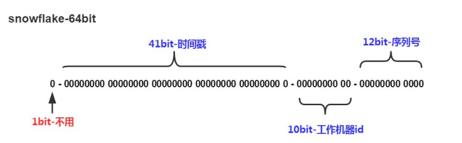

[TOC]


# Utils

## 工具类

> 命名规则

```java
//【强制】包名统一使用小写，点分隔符之间有且仅有一个自然语义的英语单词。包名统一使用单数形式，但是类名如果有复数含义，类名可以使用复数形式。

正例：应用工具类包名为 com.alibaba.ai.util、类名为 MessageUtils（此规则参考 spring 的框架结构）
```

> 常用方法

```java
//获取项目class路径
public static String getClassPath() throws FileNotFoundException {
    // ClassUtils.getDefaultClassLoader().getResource("").getPath();//等同
    return ResourceUtils.getURL("classpath:").getPath();
}

//获取项目根路径
public static String getFilePath() throws FileNotFoundException {
    return ResourceUtils.getURL("").getPath();
}

//系统换行
public static String newline() {
    return System.getProperty("line.separator");
}
```

> 页面返回类

```java
public class ResultVOUtils {

    public static ResultVO success() {
        return new ResultVO(0, "成功");
    }

    public static <T> ResultVO success(T data) {
        return new ResultVO<>(0, "成功", data);
    }

    public static ResultVO fail(MyException e) {
        return new ResultVO(e.getCode(), e.getMessage());
    }
}
```

> 使用占位符拼接字符串

```java
//域名"www.qq.com"被访问了123.456次
MessageFormat.format("域名{0}被访问了{1}次", "\"www.qq.com\"", 123.456);

//创建格式化的字符串，及连接多个字符串对象：域名"www.qq.com"被访问了123.46次
String.format("域名%s被访问了%3.2f次", "\"www.qq.com\"", 123.456); 

//先转化十六进制,再高位补0
String.format("%04d",Integer.parseInt(String.format("%x", 16))); //0010
```

> 定时任务：不建议使用Timer

```java
//【强制】线程池不允许使用 Executors 去创建，而是通过 ThreadPoolExecutor 的方式。
//       这样的处理方式让写的同学更加明确线程池的运行规则，规避资源耗尽的风险。
private static ScheduledExecutorService scheduledExecutor = null;

public static ScheduledExecutorService getScheduleExecutor() {
    if (scheduledExecutor == null) {
        synchronized (Test02.class) {
            if (scheduledExecutor == null) {                
                scheduledExecutor = new ScheduledThreadPoolExecutor(10,
                        //源自：org.apache.commons.lang3.concurrent.BasicThreadFactory
                        new BasicThreadFactory.Builder().namingPattern("schedule-pool-%d").daemon(true).build());
            }
        }
    }
    return scheduledExecutor;
}
```

```java
public ScheduledFuture<?> scheduleWithFixedDelay(Runnable command,
                                                 long initialDelay,
                                                 long delay,
                                                 TimeUnit unit);
```

>通过类名获取类的对象

```java
@Component // 获取bean的工具类
public class ApplicationUtils implements ApplicationContextAware {

    private static ApplicationContext context;

    // 实现接口的回调方法,设置上下文环境
    @Override
    public void setApplicationContext(ApplicationContext context) throws BeansException {
        MyApplicationContextAware.context = context;
    }

    // 获取applicationContext
    public static ApplicationContext getApplicationContext() {
        return context;
    }

    // 通过clazz获取Bean.
    public static <T> T getBean(Class<T> clazz) {
        return context.getBean(clazz);
    }

    // 通过name，clazz返回指定的Bean
    public static <T> T getBean(String name, Class<T> clazz) {
        return context.getBean(name, clazz);
    }
}
```

## 其他概念

> 淘汰算法

```java
//LRU（least_recently_used）：最近最少使用
将最近使用的条目存放到缓存的顶部位置。达到缓存极限时，从底部开始移除

这里会使用到昂贵的算法，而且它需要记录"年龄位"来精确显示条目是何时被访问的。
此外，当一个LRU缓存算法删除某个条目后，"年龄位"将随其他条目发生改变。

[]; 'A'->[A]; 'B'->[B,A]; 'C'->[C,B,A]; 'D'->[D,C,B,A]; 'C'->[C,D,B,A]; 'E'->[E,C,D,B]
缓存容量4，初始为空。访问A则缓存为[A]，...当再次访问C时，将C提到首位；最后访问E，由于缓存已达上限，则将最后的A移除
```
```java
//LFU（least_frequently_used）：最不经常使用
使用一个计数器来记录条目被访问的频率，最低访问频率的条目首先被移除

此算法并不经常使用，因为它无法对一个拥有最初高访问率，但之后长时间没有被访问的条目缓存负责

[A-32,B-30,C-26,D-26]; 'D'->[A-32,B-30,D-27,C-26]; 'B'->[A-32,B-31,D-27,C-26]; 'F'->[A-32,B-31,D-27,F-1]
首先访问D，则D的频率+1，并和C调换位置；再访问B，将B频率+1；最后访问F，由于容量为4，则必须将末位C移除，并将F加入，评率设为1
```
```java
//FIFO（first_in_first_out）：先进先出
与普通存储器的区别是没有外部读写地址线，这样使用起来非常简单

但缺点就是只能顺序写入数据，顺序的读出数据，其数据地址由内部读写指针自动加1完成。不能像普通存储器那样可以由地址线决定读取或写入某个指定的地址
```

```java
//MRU（most_recently_used）：最近最常使用
最先移除最近最常使用的条目。一个MRU算法擅长处理一个条目越久，越容易被访问的情况
```


#Commons

## lang

```xml
<dependency>
    <groupId>org.apache.commons</groupId>
    <artifactId>commons-lang3</artifactId>
</dependency>
```

> StringUtils

```java
//null和""
boolean empty = StringUtils.isEmpty(" "); //false

//null和""，以及" "
boolean blank = StringUtils.isBlank(""); //true
```

```java
//清除空白字符（空格+制表符+换行）
String deleteWhitespace = StringUtils.deleteWhitespace("   ab   c  "); //abc

//trim()的升级版，去除前导和后续的指定字符，不再限于空白符
String trim = StringUtils.strip("01 2 30", "0"); //1 2 3

//stripAll：去除字符串数组中每个元素中的指定字符
String[] strs = {"010", "02", "30"};
String[] stripAll = StringUtils.stripAll(strs, "0"); //1 2 3
```

```java
//字符串的缩写（第二个参数必须大于4，因为省略号占3个字符）
String str = "1234567890";
String abbreviate = StringUtils.abbreviate(str, 5); //12...
String abbreviate1 = StringUtils.abbreviate(str, 5, 9); //...678...
```

```java
//劈分字符串
String str = "12.34|56,78.90";
String[] array1 = StringUtils.split(str, " .|,");
```

```java
//查找嵌套字符串
String htmlContent = "ABC123DEF456-123000456";
String between = StringUtils.substringBetween(htmlContent, "123", "456"); //DEF，找不到返回 null

//截取从from开始字符串，区分大小写。截取失败返回空字符串""
String from = StringUtils.substringAfter("SELECT * FROM PERSON", "from"); //""

//截取左边两个字符
String left = StringUtils.left("中华人民共和国", 2); //中华
```

```java
//重复字符串
String repeat = StringUtils.repeat("*", 5); //*****

//把 args0 插入将 args2 重复多次后的字符串中间，得到字符串的总长为 args1
String center = StringUtils.center("China", 11, "*"); //***China***
```

```java
//颠倒字符串
String reverse = StringUtils.reverse("ABCDE"); //EDCBA
```

```java
//判断字符串内容的类型（该方法不识别有小数点和 请注意）
String state = "Virginia";
boolean numeric = StringUtils.isNumeric(state); //全由数字组成: false
boolean alpha = StringUtils.isAlpha(state);     //全由字母组成: true
boolean alphanumeric = StringUtils.isAlphanumeric(state); //全由数字或数字组成: true
boolean alphaSpace = StringUtils.isAlphaSpace(state);     //全由字母或空格组成: true
```

```java
//取得某字符串在另一字符串中出现的次数
int matches = StringUtils.countMatches("Chinese People", "e"); //4
```

```java
//判断是否包含这个字符
boolean contains = StringUtils.contains("中华人民共和国", "共和"); //true

//在左边填充指定字符,使之总长度为6
String x = StringUtils.leftPad("123", 6, '0'); //000123
String format = String.format("%06d", 123); //jdk自带，不好用。000123
```

```java
//将数组中的内容以","分隔
List<String> list = Arrays.asList("a", "b", "c");
String join = StringUtils.join(list, ","); //a,b,c

//首字母大写
String capitalize = StringUtils.capitalize("abc"); //Abc
```

> NumberUtils

```java
int i = NumberUtils.toInt("5f", 5); //字符串转int，默认值5

boolean parsable = NumberUtils.isParsable("5.5"); //字符串是否是数字? true
boolean digits = NumberUtils.isDigits("5.5"); //字符串中是否全为数字? false
```

> RandomStringUtils：指定长度的随机 数字，字母，字母和数字

```java
String randomNumeric = RandomStringUtils.randomNumeric(5); //60954
String randomAlphabetic = RandomStringUtils.randomAlphabetic(5); //MgQgI
String randomAlphanumeric = RandomStringUtils.randomAlphanumeric(5); //Mq985
```

> ClassUtils

```java
//取得类名和包名
String shortClassName = ClassUtils.getShortClassName(Test.class);
String packageName = ClassUtils.getPackageName(Test.class);
```

## IO

```xml
<!-- https://mvnrepository.com/artifact/commons-io/commons-io -->
<dependency>
    <groupId>commons-io</groupId>
    <artifactId>commons-io</artifactId>
    <version>2.6</version>
</dependency>
```

> IOUtils

```java
toString();     //读取流，返回 String
readLines();    //读取流，返回 list<String>
lineIterator(); //读取流，返回迭代器
```

```java
copy();      //拷贝流. 支持多种数据间的拷贝
copyLarge(); //适合拷贝较大的数据流，比如2G以上
```

```java
read();      //从一个流中读取内容
readFully(); //读取指定长度的流，如果数据源长度不够，就会抛出异常
```

```java
write();      //把数据写入到输出流中
writeLines(); //把 list<String> 写入到输出流中
```

```java
close();        //关闭URL连接
closeQuietly(); //忽略 nulls 和异常，关闭某个流 ---> 推荐使用java7新特性：try-with-resources
```

```java
skip();      //跳过指定长度的流
skipFully(); //类似skip，只是如果忽略的长度大于现有的长度，就会抛出异常
```

```java
contentEquals();          //比较两个流是否相同
contentEqualsIgnoreEOL(); //比较两个流，忽略换行符
```

```java
toBufferedInputStream(); //把流的全部内容放在另一个流中
toBufferedReader();      //返回输入流
toInputStream();         //返回输入流
toByteArray();           //返回字节数组
toCharArray();           //返回字符数组
```

> FileUtils

```java
//下载URL资源，注意设置超时时间,单位毫秒
FileUtils.copyURLToFile(httpUrl, new File(dest, fileName), 5 * 1000, 5 * 1000);
```

```java
readLines();        //读取文件内容，返回 List<String>
readFileToString(); //将文件内容作为字符串返回

openInputSteam();   //打开指定文件的输入流
```

```java
listFiles();  //列出指定目录下的所有文件
```

```java
copyInputStreamToFile(); //将一个输入流中的内容拷贝到某个文件

copyFile();              //文件拷贝
copyDirectory();         //目录拷贝。结合 FileFilter 过滤
copyFileToDirectory();   //将一个文件拷贝到某个目录下
```

```java
write();                //将字符串内容直接写到文件中
writeByteArrayToFile(); //将字节数组内容写到文件中
writeLines();           //将容器中的元素的toString方法返回的内容依次写入文件中
writeStringToFile();    //将字符串内容写到文件中
```

```java
size(); //返回文件或目录的大小
```

```java
deleteQuietly();   //删除文件

deleteDirectory(); //删除目录
cleanDirectory();  //清空目录，但不删除最外层目录
```

```java
contentEquals(); //比较两个文件的内容是否相同
```

> FilenameUtils

```java
String filePath = "D:\\abc\\123.txt";
String name = FilenameUtils.getName(filePath); //123.txt
String baseName = FilenameUtils.getBaseName(filePath); //123
String extension = FilenameUtils.getExtension(filePath); //txt
```

> Files

```java
//已过时，推荐使用：java.nio.file.Files
long freeSpace = FileSystemUtils.freeSpace("D:/");

FileStore fileStore = Files.getFileStore(Paths.get("D:/"));
long totalSpace = fileStore.getTotalSpace(); //总容量
long usableSpace = fileStore.getUsableSpace(); //可用容量
```

## codec

```xml
<!-- https://mvnrepository.com/artifact/commons-codec/commons-codec -->
<dependency>
    <groupId>commons-codec</groupId>
    <artifactId>commons-codec</artifactId>
    <version>1.12</version>
</dependency>
```

> Base64

```java
try (BufferedInputStream bis = new BufferedInputStream(new FileInputStream(src));
     BufferedOutputStream bos = new BufferedOutputStream(new FileOutputStream(dest))) {
    Base64 base64 = new Base64();

    byte[] buff = new byte[(int) new File(src).length()];
    bis.read(buff);
    String encode = base64.encodeAsString(buff);
    System.out.println("encode：" + encode); //File -> Base64

    byte[] decode = base64.decode(encode);
    for (int i = 0; i < decode.length; ++i) {
        if (decode[i] < 0) { //调整异常数据
            decode[i] += 256;
        }
    }
    bos.write(decode); //Base64 -> File
} catch (IOException e) {
    e.printStackTrace();
}
```

> MD5

```java
//org.apache.commons.codec.digest;
String md5Hex = DigestUtils.md5Hex("123456");

//org.springframework.util.DigestUtils;
String md5Hex = DigestUtils.md5DigestAsHex("123456".getBytes());
```

> URLCode

```java
URLCodec urlCodec = new URLCodec();
String encode = urlCodec.encode("abcdef", "UTF-8"); 

String decode = urlCodec.decode(encode, "UTF-8");
```

## Collections

```xml
<!-- https://mvnrepository.com/artifact/org.apache.commons/commons-collections4 -->
<dependency>
    <groupId>org.apache.commons</groupId>
    <artifactId>commons-collections4</artifactId>
    <version>4.3</version>
</dependency>
```

<http://www.imooc.com/article/271570>

> CollectionUtils：公用的接口和工具类（覆盖所有子类）

```java
List<String> list0 = Arrays.asList("1", "3", "5");
List<String> list1 = Arrays.asList("1", "13", "5");

//得到两个集合中相同的元素：[1, 5]
Collection<String> retainAll = CollectionUtils.retainAll(list0, list1);

//移除第二集合中的元素：[3]
Collection<String> removeAll = CollectionUtils.removeAll(list0, list1);
```

> ArrayUtils

```java
int[] array = {1, 3, 5, 7, 8};
int[] removeElement = ArrayUtils.removeElement(array, 5); //删除指定元素：1 3 7 8
```

```java
int[] insert = ArrayUtils.insert(3, array, 0, 69); //在 index 为3的位置添加两个元素 0,69
```

```java
ArrayUtils.reverse(array); //数组反转
```
## BeanUtils

>`copyProperties()原理：source.get() + target.set()`

```java
//属性名相同，类型相同（包括基本类型和封装类型）。可以被复制
springframework.beans.BeanUtils.copyProperties(source， target);
commons.beanutils.BeanUtils.copyProperties(target, source); //赋值方向不同
```

```java
//如果希望哪个属性不被复制，使用重载方法。ignoreProperties 传属性名称
public static void copyProperties(Object source, Object target, String... ignoreProperties) throws BeansException
```

```java
//BeanUtils.copyProperties()对bean属性进行复制，属于浅复制。且不能复制集合和数组
//对于 list，map，数组等，不能通过以上方法进行复制的，可通过 JSON 工具实现。前提是需要有无参构造

List<Dog> A = new ArrayList<>();
List<Dog> B = new ArrayList<>();
B = JSON.parseArray(JSON.toJSONString(A), Dog.class);
```


# HttpClient

##基础

```xml
<dependency>
    <groupId>org.apache.httpcomponents</groupId>
    <artifactId>httpclient</artifactId>
</dependency>
```
> GET & POST

```shell
超链接<a/>    #只能用 GET 提交HTTP请求
表单<form/>   #可以用 GET，POST .......

GET          #参数只能在请求行（request-line）
POST         #参数可在请求行，亦可在请求体（request-body）
```
```sh

```

> URL & URI

<https://www.cnblogs.com/wuyun-blog/p/5706703.html>

<https://blog.csdn.net/koflance/article/details/79635240>

```sh
http://ip:port/demo/hello/hello #url
/demo/hello/hello               #uri
```

## GET

> 请求行传参

```java
String params = "username=" + URLEncoder.encode("李", "UTF-8") + "&password=123"; //中文处理
String url = "http://localhost:9006/web/get?" + params;
HttpGet httpGet = new HttpGet(url);

String response = HttpClients.createDefault().execute(httpGet, new BasicResponseHandler()); //res
```

## POST

> 请求体 JSON

```java
HttpPost httpPost = new HttpPost("http://localhost:9006/web/post");
httpPost.setHeader("Content-Type", "application/json");
StringEntity entity = new StringEntity(JSON.toJSONString(new User()));
httpPost.setEntity(entity);
RequestConfig config = RequestConfig.custom().setConnectTimeout(2000)
    .setConnectionRequestTimeout(2000).setSocketTimeout(2000).build();
httpPost.setConfig(config); //设置超时时间

String response = HttpClients.createDefault().execute(httpPost, new BasicResponseHandler()); //res
```

> 请求体 Key-Value

```java
List<NameValuePair> nvps = new ArrayList<>(2);
nvps.add(new BasicNameValuePair("name", "中国"));
nvps.add(new BasicNameValuePair("age", "70"));
UrlEncodedFormEntity entity = new UrlEncodedFormEntity(nvps, Charset.forName("UTF-8")); //中文乱码

HttpPost httpPost = new HttpPost("http://localhost:9006/web/post");
httpPost.setEntity(entity);

String response = HttpClients.createDefault().execute(httpPost, new BasicResponseHandler()); //res
```

> 上传文件

```java
MultipartEntityBuilder builder = MultipartEntityBuilder.create();
ContentType contentType = ContentType.create("text/plain","UTF-8");//中文乱码
builder.addTextBody("fileName", "中国", contentType);
builder.addBinaryBody("file", new File("C:\\Users\\BlueCard\\Desktop\\StatusCode.png"));
HttpEntity entity = builder.build();

HttpPost httpPost = new HttpPost("http://127.0.0.1:8090/demo/http/postFile");
httpPost.setEntity(entity);

String response = HttpClients.createDefault().execute(httpPost, new BasicResponseHandler()); //res
```


# RestTemplate

> 前置准备

```java
@Configuration
public class AppConfig {
    @Bean
    public RestTemplate restTemplate() {
        return new RestTemplate();
    }
}
```

## GET

> 无参请求

```java
String url = "http://localhost:9006/web/test/get0";
ResponseEntity<User> entity = restTemplate.getForEntity(url, User.class); //arg2：返回值类型
```

> 有参请求（2种方式）

```java
String url = "http://localhost:9006/web/test/get1?username={1}&password={2}";
ResponseEntity<User> entity = restTemplate.getForEntity(url, User.class, "li", "123"); //arg3...：参数列表
```

```java
String url = "http://localhost:9006/web/test/get1?username={username}&password={password}";
Map<String, Object> map = new HashMap<>();
map.put("username", "li");
map.put("password", "123");
ResponseEntity<User> entity = restTemplate.getForEntity(url, User.class, map);
```

> `推荐方案`

```sh
getForObject() 是对 getForEntity() 进一步封装，'只返回消息体的内容'，不返回协议的信息。
```

```java
String url = "http://localhost:9006/web/test/get1?username={1}&password={2}";
User user = restTemplate.getForObject(url, User.class, "li", "pwd");
```

##POST

> 请求体传参

```java
String url = "http://localhost:9006/web/test/post0";
User user = restTemplate.postForObject(url, new User(), User.class);
```

> postForLocation

```sh
postForLocation() 也是提交新资源，提交成功之后，返回新资源的URI。
此方法的参数和前面两种的参数基本一致，只不过该方法的返回值为Uri，这个只需要服务提供者返回一个Uri即可，该Uri表示新资源的位置
```

> 也支持 PUT，DELETE

```java
restTemplate.put(url,new User());
restTemplate.delete(url,"123"); //都没有返回值
```


#JSON

## fastjson

```xml
<dependency>
    <groupId>com.alibaba</groupId>
    <artifactId>fastjson</artifactId>
    <version>1.2.47</version>
</dependency>
```

>`getIntValue()和getInteger()`的区别

```java
json.getInteger("a");  //null --->对于空的key
json.getIntValue("a"); //0
```

> 相互转化

```java
//X ---> JSONString 
String json = JSON.toJSONString(list / map / javabean);
String json = JSON.toJSONString(list, true);//args1: json是否格式化(有空格和换行).
```

```java
//JSONString --->X（必须有空构造方法）
Dog dog = JSON.parseObject(json, Dog.class);
Map map = JSON.parseObject(json, Map.class);
List<Dog> list = JSON.parseArray(json, Dog.class);
```

```java
//X ---> JSONObject（先转换为JSONString，javabean必须有 get/set）
JSONObject obj = JSON.parseObject(JSON.toJSONString(dog));//javabean
JSONObject obj = JSON.parseObject(JSON.toJSONString(map));//map
JSONArray array = JSON.parseArray(JSON.toJSONString(list));//list
```
> null值处理：list ---> JSONString

```java
QuoteFieldNames         //输出key时是否使用双引号，默认为true
WriteMapNullValue       //是否输出值为null的字段，默认为false
WriteNullListAsEmpty    //List字段如果为null，输出为[]，而非null
WriteNullNumberAsZero   //数值字段如果为null，输出为0，而非null
WriteNullBooleanAsFalse //Boolean字段如果为null，输出为false，而非null

WriteNullStringAsEmpty  //字符类型字段如果为null，输出为""，而非null (√，默认不输出null字段)
```

```java
List<Dog> list = Arrays.asList(new Dog("11", 11), new Dog(null, 22));

// [{"age":11,"name":"11"},{"age":22}] ---> 默认不输出null字段
// String json = JSON.toJSONString(list);

// [{"age":11,"name":"11"},{"age":22,"name":""}]
String json = JSON.toJSONString(list, SerializerFeature.WriteNullStringAsEmpty);
```

> SpringBoot2.x默认使用 jacksonJson 解析，现转换为 fastjson，并且解决中文乱码问题。

```java
@Configuration
public class WebMvcConfig extends WebMvcConfigurationSupport {
    @Override
    public void configureMessageConverters(List<HttpMessageConverter<?>> converters) {
        //1.构建了一个消息转换器 converter
        FastJsonHttpMessageConverter converter = new FastJsonHttpMessageConverter();

        //2.添加fastjson配置,如: 是否格式化返回的json数据;设置编码方式
        FastJsonConfig config = new FastJsonConfig();

        config.setSerializerFeatures(SerializerFeature.PrettyFormat);//格式化

        List<MediaType> list = new ArrayList<>();//中文乱码
        list.add(MediaType.APPLICATION_JSON_UTF8);
        converter.setSupportedMediaTypes(list);

        //3.在消息转换器中添加fastjson配置
        converter.setFastJsonConfig(config);
        converters.add(converter);
    }
}
```

## JackJson

>ObjectMapper是JSON操作的核心，Jackson的所有JSON操作都是在ObjectMapper中实现

```java
ObjectMapper mapper = new ObjectMapper();
```

```java
String json = mapper.writeValueAsString(employee); //X -> String
```

```java
String jsonArrary = mapper.writeValueAsString(employees); //list -> String
```

```java
Employee value = mapper.readValue(json, Employee.class); //String -> X
```

```java
JavaType list = mapper.getTypeFactory().constructParametricType(List.class, Employee.class); //String -> list/map
//JavaType map = mapper.getTypeFactory().constructParametricType(HashMap.class, String.class, Employee.class);
List<Employee> employees = mapper.readValue(jsonArrary, list);
```

```java
List<Employee> values = mapper.readValue(jsonArrary, new TypeReference<List<Employee>>() {}); //String -> list/map
```

> 自定义JSON的key值

```java
@Data
public class Employee {
    @JsonProperty("id") //默认，JSON的key为属性名，即empId。{"empId":1,"empName":"小王"}
    private Integer empId;

    @JsonProperty("name") //自定义JSON的key值。{"id":1,"name":"小王"}
    private String empName;
}
```

> 工具类

```java
public class JsonUtils {
    private static ObjectMapper objectMapper = new ObjectMapper();

    public static String toJson(Object object) {
        try {
            return objectMapper.writeValueAsString(object);
        } catch (JsonProcessingException e) {
            e.printStackTrace();
        }
        return null;
    }

    public static <T> T fromJson(String string, Class<T> clazz) { //泛型
        try {
            return objectMapper.readValue(string, clazz);
        } catch (IOException e) {
            e.printStackTrace();
        }
        return null;
    }

    public static <T> T fromJson(String string, TypeReference typeReference) {
        try {
            return (T) objectMapper.readValue(string, typeReference);
        } catch (IOException e) {
            e.printStackTrace();
        }
        return null;
    }
}
```

##JsonPath

> 基础概念

```sh
JsonPath是一种简单的方法来提取给定JSON文档的部分内容。SpringBoot项目内置其引用。
JsonPath提供的json解析非常强大，它提供了类似正则表达式的语法，基本上可以满足所有想要获得的json内容。
```

```xml
<dependency>
    <groupId>com.jayway.jsonpath</groupId>
    <artifactId>json-path</artifactId>
    <version>2.2.0</version>
</dependency>
```

>操作符

```sh
$         查询根元素。这将启动所有路径表达式。
@         当前节点由过滤谓词处理。
*         通配符，必要时可用任何地方的名称或数字。
..        深层扫描。 必要时在任何地方可以使用名称。
.<name>   点，表示子节点

['<name>' (, '<name>')]  括号表示子项
[<number> (, <number>)]  数组索引或索引
[start:end]              数组切片操作
[?(<expression>)]        过滤表达式。 表达式必须求值为一个布尔值。
```

>函数

```sh
#函数可以在路径的尾部调用，函数的输出是路径表达式的输出，该函数的输出是由函数本身所决定的。
min()     提供数字数组的最小值     Double
max()     提供数字数组的最大值     Double
avg()     提供数字数组的平均值     Double
stddev()  提供数字数组的标准偏差值  Double
length()  提供数组的长度          Integer
```

>过滤器运算符

```sh
#过滤器是用于筛选数组的逻辑表达式。
一个典型的过滤器将是[?(@.age > 18)]，其中@表示正在处理的当前项目。可以使用逻辑运算符&&和||创建更复杂的过滤器。
字符串文字必须用单引号或双引号括起来([?(@.color == 'blue')] 或者 [?(@.color == "blue")]).
```

```sh
=~        匹配正则表达式[?(@.name =~ /foo.*?/i)]
in        左边存在于右边 [?(@.size in ['S', 'M'])]
nin       左边不存在于右边
size      长度（数组或字符串）
empty     为空（数组或字符串）
```

> 测试DEMO

```js
{
    "expensive": 10,
    "store": {
        "bicycle": {
            "color": "red",
            "price": 19.95
        },
        "book": [
            {
                "author": "Nigel Rees",
                "category": "reference",
                "price": 8.95,
                "title": "Sayings of the Century"
            },
            {
                "author": "Evelyn Waugh",
                "category": "fiction",
                "price": 12.99,
                "title": "Sword of Honour"
            },
            {
                "author": "Herman Melville",
                "category": "fiction",
                "isbn": "0-553-21311-3",
                "price": 8.99,
                "title": "Moby Dick"
            },
            {
                "author": "J. R. R. Tolkien",
                "category": "fiction",
                "isbn": "0-395-19395-8",
                "price": 22.99,
                "title": "The Lord of the Rings"
            }
        ]
    }
}
```

```sh
$.store.book[0].author  获取book[0]的author值
$.store.book[*].author  获取json中store下book下的所有author值

$..author               获取json中所有的author值
$.store.*               获取store节点
$.store..price          获取json中store下所有price的值

$.store.book[?(@.price < 10)]                    获取json中book数组中 price<10 的所有值
$.store.book[?(@.category == 'reference')]       输出book[*]中 category == 'reference' 的book
$.store.book[?(@.author=='Nigel Rees')].price    ...book的price值

$..book[?(@.isbn)]                         获取json中book数组中包含isbn的所有值
$..book[?(@.price <= $['expensive'])]      获取json中book数组中 price<=expensive 的所有值（expensive节点值为10）
$..book[?(@.author =~ /.*REES/i)]          获取json中book数组中的作者以 REES 结尾的所有值（REES不区分大小写）

$..*                逐层列出json中的所有值，层级由外到内
$..book.length()    获取json中book数组的长度

$..book[2]              获取json中book数组的第3个值
$..book[-2]             倒数的第二本书
$..book[0,1]            前两本书
$..book[:2]             从索引0（包括）到索引2（排除）的所有图书
$..book[1:2]            从索引1（包括）到索引2（排除）的所有图书
$..book[-2:]            获取json中book数组的最后两个值
$..book[2:]             获取json中book数组的第3个到最后一个的区间值
```

```java

```


#其他工具

## 雪花算法

>分布式ID生成器

```shell
由于数据库在生产环境中要分片部署（MyCat），所以不能使用数据库本身的自增功能来产生主键值，只能由程序来生成唯一的主键值。
采用开源的 twitter 的 snowflake（雪花）算法，总长度 '64bit'。
```

```shell
'优点'：（1）整体上按照时间自增排序（2）整个分布式系统内不会产生ID碰撞(由数据中心ID和机器ID作区分) （3）效率较高
经测试，SnowFlake每秒能够产生26万ID左右。

0        #最高位是符号位，始终为0，不可用。
1-41     #41 位的时间序列，精确到毫秒级，可使用到2082年。时间位另一作用是可以根据时间进行排序
42-51    #10 位的机器标识，10位的长度最多支持部署1024个节点（2^10）
52-63    #12 位的计数序列，是一系列的自增id，支持每个节点每毫秒产生4096个ID序号（2^12）
```



## frp

> 内网穿透

```sh
'场景描述'：公司电脑在局域网内。现在想要在家里远程访问公司电脑。
'准备工作'：frp工具，一台用作frp-Server的阿里云服务器（47.103.68.238）
```

```sh
实现步骤：
(1).根据服务器类型下载对应的frp安装工具: frp_0.29.1_linux_arm64.tar.gz
(2).压缩包上传至阿里云服务器，解压，编辑 frps.ini
    [common]
    bind_port = 7000
    dashboard_port = 7500   #frps监控的端口
    dashboard_user = admin  #frps监控的账号和密码
    dashboard_pwd = admin
    token = helloworld      #frp验证token
(3).执行命令，后台启动frp-Server: nohup ./frps -c ./frps.ini &

(4).如果公司电脑可以上网，直接将 frpc和frpc.ini 放在公司电脑。
(5).如果公司电脑不能上网，则需要在局域网内找一台可以上外网的PC，将以上两个文件放在可以上外网的PC上
(6).编辑 frpc.ini
    [common]
    server_addr = 47.103.68.238  #服务端地址
    server_port = 7000
    token = helloworld

    [6000]
    type = tcp
    local_ip = 192.168.8.7  #公司电脑的局域网IP
    local_port = 3389       #windows远程桌面的默认端口
    remote_port = 6000      #frp-server的映射端口
(7).客户端电脑使用命令，后台启动: nohup ./frpc -c ./frpc.ini

(8).通过 'http://49.103.68.238:7500/' 查看frp监控
(9).最终，就可以在家通过 '47.103.68.238:6000' 访问公司电脑
```


